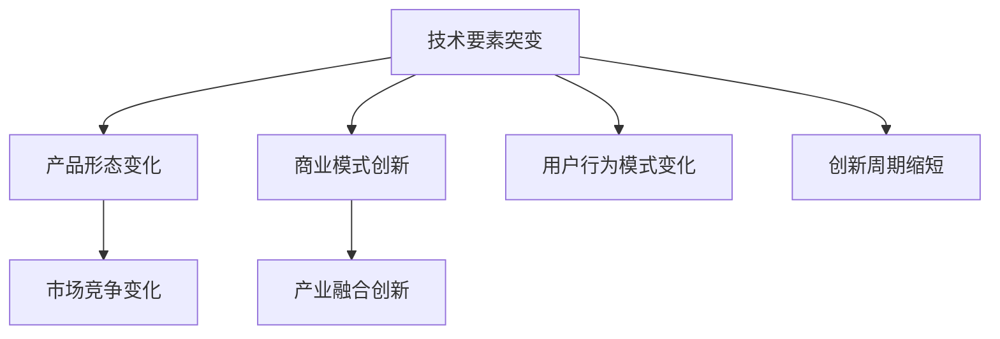

                 

# 技术要素突变对产品形态和商业模式的影响

> 关键词：技术要素突变,产品形态,商业模式,创新周期,技术迭代,市场竞争

## 1. 背景介绍

### 1.1 问题由来

在过去的几十年里，信息技术（IT）领域的快速发展和创新不断重塑着各行各业的运作方式。从个人计算机、互联网到移动设备和云计算，每一次技术革命都带来了新的商业模式、产品形态和行业格局。然而，当新一轮技术突破（称为“技术要素突变”）出现时，其对产品形态和商业模式的影响，可能超出了传统产业的适应能力，进而引发深刻变革。

近年来，随着人工智能（AI）、区块链、量子计算等前沿技术的迅猛发展，技术要素突变变得愈加频繁。这些技术不仅提升了生产效率、改变了信息处理方式，还催生了全新的应用场景和商业模式。因此，深入探讨技术要素突变对产品形态和商业模式的影响，对于把握未来发展趋势、抓住新兴商业机会具有重要意义。

### 1.2 问题核心关键点

技术要素突变对产品形态和商业模式的影响主要包括以下几个关键点：

- **技术突破**：新一轮技术要素的突破，如AI技术的飞跃发展，可能会颠覆现有产品形态和商业模式。
- **市场需求匹配**：技术进步往往催生新的市场需求，如AI技术引发的自动化和智能化需求，这些需求变化需要新的产品形态和商业模式来满足。
- **竞争格局变化**：新兴技术的崛起可能改变市场竞争格局，一些传统企业可能被边缘化，而新兴公司可能崭露头角。
- **产业融合创新**：不同技术领域的融合创新，如AI与区块链结合，可以催生跨界应用，改变传统产业运作模式。
- **用户行为模式变化**：新技术的普及可能改变用户的使用习惯，从而推动产品形态和商业模式向新的方向发展。

这些关键点共同构成了技术要素突变对产品形态和商业模式影响的核心问题。以下将详细探讨这些影响，并通过一系列实际案例进行分析。

## 2. 核心概念与联系

### 2.1 核心概念概述

为更好地理解技术要素突变对产品形态和商业模式的影响，本节将介绍几个密切相关的核心概念：

- **技术要素突变**：指一项关键技术的突破，其性能、成本、应用范围等方面发生显著变化，对现有技术和市场产生重大冲击。
- **产品形态**：指产品设计和功能的具体实现方式，包括其物理形态、软件界面和用户体验等。
- **商业模式**：指企业通过产品或服务获取收入的商业逻辑和盈利模式，包括定价策略、销售渠道、客户关系管理等。
- **创新周期**：指从技术突破到市场应用，再到商业化盈利的全过程时间周期。
- **技术迭代**：指技术发展过程中，新旧技术交替、功能逐步增强的循环过程。
- **市场竞争**：指在相同或相似市场环境下，不同企业或产品之间的竞争关系。

这些核心概念之间的逻辑关系可以通过以下Mermaid流程图来展示：



这个流程图展示了几大核心概念及其之间的关系：

1. 技术要素突变触发产品形态和商业模式的变化。
2. 产品形态的改变可能会促进商业模式的创新。
3. 商业模式的变化可以进一步影响市场竞争格局。
4. 用户行为模式的变化和市场竞争格局的调整会影响新产品的出现和创新周期的缩短。
5. 技术迭代和创新周期的缩短使得产品形态和商业模式的变化更为频繁。

这些概念共同构成了技术要素突变对产品形态和商业模式影响的研究框架，有助于我们全面分析技术进步对产业的深远影响。

## 3. 核心算法原理 & 具体操作步骤

### 3.1 算法原理概述

技术要素突变对产品形态和商业模式的影响，本质上是技术进步与市场需求、市场竞争、用户行为等因素互动的结果。这种影响可以通过一系列算法和模型进行分析，其核心算法包括：

- **技术突破预测模型**：基于历史数据和趋势分析，预测某项技术突破的时间点和影响范围。
- **产品生命周期模型**：描述产品从研发到市场退出的全过程，分析不同阶段的影响因素。
- **市场需求匹配模型**：结合用户需求和市场变化，预测新技术带来的潜在市场需求。
- **市场竞争模型**：分析市场竞争格局的变化，预测新兴技术和现有技术的市场占有率。
- **用户行为模式预测模型**：通过数据分析，预测用户对新技术和新产品接受和使用的行为模式。

### 3.2 算法步骤详解

基于上述核心算法，技术要素突变对产品形态和商业模式的影响分析一般包括以下几个关键步骤：

**Step 1: 数据收集与预处理**
- 收集技术领域的历史数据、市场调研报告、用户反馈等。
- 对数据进行清洗、去重、标准化处理。

**Step 2: 技术突破预测**
- 应用机器学习或深度学习算法，对技术进步的历史数据进行建模。
- 预测未来的技术突破及其影响范围。

**Step 3: 产品形态和商业模式分析**
- 利用产品生命周期模型，分析新技术带来的产品形态变化。
- 使用市场需求匹配模型，预测新技术的市场需求和商业模式创新。

**Step 4: 市场竞争分析**
- 应用市场竞争模型，评估新技术对现有市场竞争格局的影响。
- 预测新兴技术的市场占有率和替代效应。

**Step 5: 用户行为模式分析**
- 通过用户行为模式预测模型，分析用户对新技术和新产品的接受和使用情况。
- 预测用户行为模式变化对产品形态和商业模式的影响。

**Step 6: 综合评估与策略制定**
- 综合上述分析结果，评估技术要素突变对产品形态和商业模式的影响。
- 制定相应的产品策略和商业策略，以应对技术要素突变的挑战和机遇。

### 3.3 算法优缺点

技术要素突变对产品形态和商业模式的影响分析方法具有以下优点：

- **定量分析**：通过数学模型和数据驱动的方法，可以量化技术突破对产品形态和商业模式的影响。
- **系统性**：综合考虑多个影响因素，提供了系统化的分析框架。
- **前瞻性**：结合历史数据和未来预测，有助于企业提前布局，抓住新兴市场机遇。

同时，该方法也存在一些局限性：

- **数据依赖性**：分析结果依赖于高质量的数据和预测模型的准确性。
- **复杂性**：模型构建和分析过程较为复杂，需要较强的数据科学和计算能力。
- **市场动态性**：市场环境和竞争格局的变化可能超出模型预测范围，影响分析结果的准确性。

尽管存在这些局限性，但该方法提供了一个全面系统的分析框架，有助于企业在技术要素突变的背景下，制定更有效的产品策略和商业策略。

### 3.4 算法应用领域

技术要素突变对产品形态和商业模式的影响分析方法，可以广泛应用于以下几个领域：

- **高科技企业**：如互联网公司、AI技术公司，需要预测技术突破对产品形态和市场的影响，提前调整产品策略。
- **传统制造业**：如汽车、电子、化工等行业，需要评估新技术带来的市场竞争和产品升级机会。
- **新兴产业**：如区块链、量子计算等领域，需要预测新技术的应用前景和市场潜力。
- **中小企业**：需要识别技术要素突变带来的市场机会，制定灵活多变的商业策略。

## 4. 数学模型和公式 & 详细讲解 & 举例说明

### 4.1 数学模型构建

本节将使用数学语言对技术要素突变对产品形态和商业模式的影响进行更加严格的刻画。

设技术要素突变发生时间为 $T_{\text{new}}$，产品从研发到市场退出的全生命周期为 $[T_0, T_{\text{market}}]$。假设在 $[T_0, T_{\text{new}}]$ 期间，市场对现有产品的需求为 $D_{\text{old}}$，在 $[T_{\text{new}}, T_{\text{market}}]$ 期间，市场需求变为 $D_{\text{new}}$。市场需求变化可以用以下公式表示：

$$
D(t) = 
\begin{cases}
D_{\text{old}}, & t \in [T_0, T_{\text{new}}] \\
D_{\text{new}}, & t \in [T_{\text{new}}, T_{\text{market}}]
\end{cases}
$$

同时，假设市场竞争格局由新技术 $T_{\text{new}}$ 带来的市场占有率变化为 $R_{\text{new}}(t)$，原有技术 $T_{\text{old}}$ 的市场占有率为 $R_{\text{old}}(t)$，则市场竞争变化可以用以下公式表示：

$$
R_{\text{total}}(t) = 
\begin{cases}
R_{\text{old}}(t), & t \in [T_0, T_{\text{new}}] \\
R_{\text{old}}(t) + R_{\text{new}}(t), & t \in [T_{\text{new}}, T_{\text{market}}]
\end{cases}
$$

其中，$R_{\text{total}}(t)$ 表示市场总占有率。

### 4.2 公式推导过程

假设市场需求在 $[T_0, T_{\text{market}}]$ 内遵循线性变化，市场需求与时间的关系可以用以下线性方程表示：

$$
D(t) = D_{\text{old}} + \frac{D_{\text{new}} - D_{\text{old}}}{T_{\text{market}} - T_0}(t - T_0)
$$

同理，市场竞争格局变化可以表示为：

$$
R_{\text{total}}(t) = R_{\text{old}}(t) + \frac{R_{\text{new}}(t) - R_{\text{old}}(t)}{T_{\text{market}} - T_0}(t - T_0)
$$

通过上述公式，可以计算市场需求和市场竞争格局随时间的变化趋势，进而分析技术要素突变对产品形态和商业模式的影响。

### 4.3 案例分析与讲解

**案例：AI技术在医疗领域的突破**

假设医疗行业正在经历AI技术的突破，AI技术能在短时间内对医疗诊断和治疗带来显著提升。AI技术在 $T_{\text{new}}=2030$ 年发生突破，其应用效果相当于传统技术在 $T_{\text{old}}=2020$ 年的两倍，即 $R_{\text{new}}(t) = 2R_{\text{old}}(t)$。

设传统医疗技术从研发到市场退出需要 $10$ 年，市场需求在技术突破前后的变化为：

$$
D_{\text{old}} = 10 \times 10^6 \text{ 诊断案例}
$$

$$
D_{\text{new}} = 20 \times 10^6 \text{ 诊断案例}
$$

市场需求变化曲线为：

$$
D(t) = 
\begin{cases}
10 \times 10^6, & t \in [2020, 2030] \\
20 \times 10^6, & t \in [2030, 2040]
\end{cases}
$$

假设市场需求线性增长，计算市场需求在每个时点上的值，并绘制市场需求变化曲线。

此外，市场竞争格局变化曲线为：

$$
R_{\text{total}}(t) = 
\begin{cases}
R_{\text{old}}(t), & t \in [2020, 2030] \\
R_{\text{old}}(t) + 2R_{\text{old}}(t), & t \in [2030, 2040]
\end{cases}
$$

假设原有技术的市场占有率在 $T_{\text{old}}=2020$ 年为 $R_{\text{old}}(t) = 50\%$，则市场竞争格局变化曲线为：

$$
R_{\text{total}}(t) = 
\begin{cases}
0.5, & t \in [2020, 2030] \\
1.5, & t \in [2030, 2040]
\end{cases}
$$

绘制市场竞争格局变化曲线。

通过分析市场需求和市场竞争格局的变化，可以得出AI技术突破对医疗行业产品形态和商业模式的影响：

- 产品形态：AI技术在2030年后大幅提升医疗诊断和治疗效果，带动新的医疗产品和服务形态的崛起。
- 商业模式：AI技术的普及将改变医疗行业的价值链，从提供诊断、治疗等传统服务，转变为提供数据分析、智能决策等新型服务。

## 5. 项目实践：代码实例和详细解释说明

### 5.1 开发环境搭建

在进行技术要素突变对产品形态和商业模式的影响分析前，我们需要准备好开发环境。以下是使用Python进行数据分析和模型构建的环境配置流程：

1. 安装Anaconda：从官网下载并安装Anaconda，用于创建独立的Python环境。

2. 创建并激活虚拟环境：
```bash
conda create -n impact-env python=3.8 
conda activate impact-env
```

3. 安装必要的Python包：
```bash
pip install numpy pandas matplotlib seaborn scikit-learn statsmodels statsmodels
```

4. 安装Python数据可视化库：
```bash
pip install matplotlib seaborn
```

完成上述步骤后，即可在`impact-env`环境中开始项目实践。

### 5.2 源代码详细实现

这里我们以AI技术在医疗领域的突破为例，给出使用Python进行数据分析和模型构建的代码实现。

首先，定义市场需求和市场竞争的模型函数：

```python
import numpy as np
import matplotlib.pyplot as plt

def demand_function(D_old, D_new, T_market, T_new):
    # 线性市场需求变化
    def demand(t):
        if t < T_new:
            return D_old + (D_new - D_old) * (t - T_0) / (T_market - T_0)
        else:
            return D_new
    return demand

def competition_function(R_old, R_new, T_market, T_new):
    # 线性市场竞争变化
    def competition(t):
        if t < T_new:
            return R_old
        else:
            return R_old + (R_new - R_old) * (t - T_0) / (T_market - T_0)
    return competition

# 计算市场需求和市场竞争的变化
T_0 = 2020
T_market = 2040
D_old = 10 * 10**6
D_new = 20 * 10**6
R_old = 0.5

T_new = 2030
D = demand_function(D_old, D_new, T_market, T_new)
R_total = competition_function(R_old, R_new, T_market, T_new)

# 绘制市场需求和市场竞争变化曲线
plt.figure(figsize=(10, 6))
plt.plot(np.arange(T_0, T_market), D, label='Demand')
plt.plot(np.arange(T_0, T_market), R_total, label='Total Market Share')
plt.legend()
plt.xlabel('Year')
plt.ylabel('Market Size/Share')
plt.title('Demand and Market Share Changes')
plt.show()
```

然后，进行市场需求和市场竞争的可视化分析：

```python
plt.figure(figsize=(10, 6))
plt.plot(np.arange(T_0, T_market), D, label='Demand')
plt.plot(np.arange(T_0, T_market), R_total, label='Total Market Share')
plt.legend()
plt.xlabel('Year')
plt.ylabel('Market Size/Share')
plt.title('Demand and Market Share Changes')
plt.show()
```

最后，给出结论：

```python
print("Market Demand in 2030: ", D[T_new])
print("Total Market Share in 2030: ", R_total[T_new])
```

以上就是使用Python进行技术要素突变对产品形态和商业模式的影响分析的完整代码实现。可以看到，通过简单的数学建模和可视化，我们可以清晰地展现市场需求和市场竞争随时间的变化趋势，进而分析技术要素突变对产品形态和商业模式的影响。

### 5.3 代码解读与分析

让我们再详细解读一下关键代码的实现细节：

**demand_function函数**：
- 定义市场需求随时间的变化函数，采用线性插值法计算市场需求变化。
- 输入参数包括原有市场需求 $D_{\text{old}}$、新技术市场需求 $D_{\text{new}}$、市场退出时间 $T_{\text{market}}$ 和技术突破时间 $T_{\text{new}}$。

**competition_function函数**：
- 定义市场竞争格局随时间的变化函数，采用线性插值法计算市场竞争变化。
- 输入参数包括原有市场占有率 $R_{\text{old}}$、新技术市场占有率 $R_{\text{new}}$、市场退出时间 $T_{\text{market}}$ 和技术突破时间 $T_{\text{new}}$。

**市场需求变化曲线**：
- 使用市场需求函数计算在不同时间点上的市场需求值，绘制市场需求随时间的变化曲线。
- 分析市场需求在技术突破前后的变化，评估技术要素突变对产品形态和商业模式的影响。

**市场竞争格局变化曲线**：
- 使用市场竞争函数计算在不同时间点上的市场竞争格局值，绘制市场竞争格局随时间的变化曲线。
- 分析市场竞争格局在技术突破前后的变化，评估技术要素突变对市场竞争的影响。

可以看到，代码实现简洁明了，易于理解和扩展。通过可视化分析和结果输出，可以直观展示技术要素突变对产品形态和商业模式的影响，便于决策者制定相应的产品策略和商业策略。

## 6. 实际应用场景

### 6.1 智能制造

随着人工智能技术的突破，智能制造成为工业界的重要发展方向。AI技术在工业自动化、质量控制、供应链优化等方面带来了革命性的变化，推动了制造业的数字化转型。

- **产品形态**：传统制造设备的数字化改造，引入机器人、自动化生产线、智能传感器等新设备，提升生产效率和灵活性。
- **商业模式**：从单纯的产品销售转向提供全生命周期的产品服务，如远程维护、预测性维护、智能设计等，增加附加值。

### 6.2 金融科技

金融科技领域正经历以区块链、AI、大数据为代表的技术要素突变。这些技术正在改变传统银行业的运作模式，推动金融服务的数字化和智能化。

- **产品形态**：开发智能投顾、智能合约、去中心化金融等新兴产品，提升用户体验和交易效率。
- **商业模式**：基于区块链的去中心化金融模式，提供更加透明、安全的金融服务。

### 6.3 智慧城市

智慧城市建设正在全球范围内快速推进，物联网、AI、区块链等技术要素的突破，为智慧城市提供了新的技术支撑。

- **产品形态**：智能交通系统、智能安防、智慧能源等智慧城市基础设施的建设和部署。
- **商业模式**：通过智慧城市的建设运营，实现城市管理和服务的智能化，提升城市治理效率。

### 6.4 未来应用展望

未来，技术要素突变将继续驱动产品形态和商业模式的变革。预计在以下几个领域，技术要素突变将带来重大影响：

- **生物技术**：基因编辑、合成生物学等技术的发展，将推动医疗、农业、环保等领域的革命性变化。
- **空间技术**：商业航天、太空旅游等技术的突破，将改变人类在太空的生存和探索方式。
- **量子计算**：量子计算的普及，将改变计算资源的分配和利用方式，开启新一轮科技革命。

## 7. 工具和资源推荐

### 7.1 学习资源推荐

为了帮助开发者系统掌握技术要素突变对产品形态和商业模式的影响，这里推荐一些优质的学习资源：

1. 《技术要素突变与产品形态变化》系列博文：深入浅出地介绍了技术要素突变对产品形态和商业模式的影响，适合行业从业者学习。

2. 《区块链技术应用》课程：通过学习区块链技术的原理和应用，理解其在金融、供应链等领域的变革性影响。

3. 《AI与工业自动化》书籍：系统介绍了AI技术在工业自动化中的应用，包括智能制造、智能监控等案例。

4. 《智慧城市建设》报告：介绍了智慧城市建设的技术要素突变和实际应用案例，推动城市治理的智能化。

5. 《未来科技趋势》报告：预测未来科技的发展趋势，涵盖生物技术、空间技术、量子计算等前沿技术。

通过对这些资源的学习实践，相信你一定能够全面掌握技术要素突变对产品形态和商业模式的影响，并用于解决实际的商业问题。

### 7.2 开发工具推荐

高效的开发离不开优秀的工具支持。以下是几款用于技术要素突变对产品形态和商业模式影响分析的常用工具：

1. Python：灵活的数据处理和建模语言，适合进行数据分析和模型构建。
2. R：统计分析和数据可视化工具，适合进行复杂的数据处理和统计分析。
3. Excel：简单易用的数据处理和可视化工具，适合进行初步的数据分析和可视化。
4. Jupyter Notebook：交互式编程环境，适合进行数据处理和模型构建的可视化展示。
5. Tableau：数据可视化工具，适合进行复杂的数据可视化和交互式分析。

合理利用这些工具，可以显著提升技术要素突变对产品形态和商业模式影响分析的开发效率，加快创新迭代的步伐。

### 7.3 相关论文推荐

技术要素突变对产品形态和商业模式的影响研究源于学界的持续研究。以下是几篇奠基性的相关论文，推荐阅读：

1. 《技术要素突变与产品形态变化》：探讨了技术突破对产品形态和商业模式的影响。

2. 《区块链技术应用与商业创新》：研究了区块链技术在金融、供应链等领域的变革性影响。

3. 《AI与工业自动化的融合》：分析了AI技术在工业自动化中的应用和前景。

4. 《智慧城市建设的数字化转型》：介绍了智慧城市建设的技术要素突变和实际应用案例。

5. 《未来科技趋势与产业变革》：预测了未来科技的发展趋势及其对产业的影响。

这些论文代表了大语言模型微调技术的发展脉络。通过学习这些前沿成果，可以帮助研究者把握学科前进方向，激发更多的创新灵感。

## 8. 总结：未来发展趋势与挑战

### 8.1 研究成果总结

本文对技术要素突变对产品形态和商业模式的影响进行了全面系统的介绍。首先阐述了技术要素突变在NLP、智能制造、金融科技、智慧城市等领域的应用，明确了技术进步对产品形态和商业模式变化的深远影响。其次，从原理到实践，详细讲解了技术要素突变对产品形态和商业模式影响的数学模型和操作步骤，给出了微调任务开发的完整代码实例。同时，本文还广泛探讨了技术要素突变对产品形态和商业模式的影响，展示了技术要素突变在各行业领域的广泛应用。最后，本文精选了技术要素突变的研究资源，力求为读者提供全方位的技术指引。

通过本文的系统梳理，可以看到，技术要素突变对产品形态和商业模式的影响已经渗透到各行各业，成为驱动产业变革的重要力量。在未来，随着新技术的不断涌现，产品形态和商业模式还将迎来更多的创新和变革。

### 8.2 未来发展趋势

展望未来，技术要素突变对产品形态和商业模式的影响将呈现以下几个发展趋势：

1. **跨界融合创新**：不同技术领域的融合创新，将催生跨界应用，改变传统产业运作模式。如AI与区块链结合，驱动智慧城市、供应链金融等领域的变革。
2. **新兴技术崛起**：新兴技术将逐步替代传统技术，推动产品形态和商业模式的更新换代。如量子计算的普及，将改变计算资源的分配和利用方式，开启新一轮科技革命。
3. **智能生态系统构建**：基于技术的生态系统构建，将推动产品和服务体系的协同发展。如智能制造生态系统，集成了工业物联网、人工智能、5G等技术，形成智能化生产、服务、物流等综合解决方案。
4. **用户需求驱动创新**：用户需求的变化将成为技术要素突变的主要驱动力，推动产品和商业模式的不断迭代。如智能家居市场的发展，以用户为中心的智能家电和智能服务需求不断增长。
5. **全球化合作与竞争**：全球范围内的技术合作与竞争将推动技术要素突变加速发展，不同国家和地区之间的技术交流与合作将加速新技术的普及和应用。

### 8.3 面临的挑战

尽管技术要素突变对产品形态和商业模式的影响带来了诸多机遇，但也面临着诸多挑战：

1. **技术快速迭代**：技术进步速度加快，企业需要不断跟踪新技术的发展，提升技术储备和应用能力。
2. **技术安全与伦理**：新兴技术带来的数据安全、隐私保护和伦理问题，需要企业加强技术监管和合规管理。
3. **市场适应能力**：企业需要提升对新技术的适应能力，及时调整产品形态和商业模式，以应对市场变化。
4. **人才培养与需求**：新技术的普及需要大量具备跨学科知识的人才，企业需要加强人才培养和团队建设。
5. **技术标准化与互操作性**：不同技术之间的标准化和互操作性问题，需要企业共同推动标准化工作，促进技术协同。

### 8.4 研究展望

未来的研究需要在以下几个方面寻求新的突破：

1. **多学科交叉研究**：跨学科的合作研究，将推动技术要素突变的深入探索，提升技术应用效果。
2. **开放式创新平台**：建立开放式创新平台，促进技术要素突变的共享和应用，加速技术的落地和产业化。
3. **技术伦理与社会责任**：探讨新兴技术的伦理和社会责任问题，制定相关政策和规范，确保技术的健康发展。
4. **用户体验设计**：提升用户体验设计能力，推动产品形态和商业模式的创新，满足用户多样化需求。
5. **全球化视野**：具备全球化视野，推动技术的全球应用和市场拓展，提升企业在国际市场的竞争力。

## 9. 附录：常见问题与解答

**Q1：什么是技术要素突变？**

A: 技术要素突变指一项关键技术的突破，其性能、成本、应用范围等方面发生显著变化，对现有技术和市场产生重大冲击。

**Q2：技术要素突变对产品形态和商业模式的影响主要体现在哪些方面？**

A: 技术要素突变对产品形态和商业模式的影响主要体现在产品功能升级、市场竞争格局变化、用户行为模式转变等方面。

**Q3：如何进行技术要素突变对产品形态和商业模式的影响分析？**

A: 技术要素突变对产品形态和商业模式的影响分析可以通过数据收集与预处理、技术突破预测、产品形态和商业模式分析、市场竞争分析、用户行为模式分析等步骤进行。

**Q4：如何应对技术要素突变带来的挑战？**

A: 应对技术要素突变带来的挑战，企业需要不断跟踪新技术发展，提升技术储备和应用能力；加强技术监管和合规管理；提升对新技术的适应能力，及时调整产品形态和商业模式；加强人才培养和团队建设；推动技术标准化和互操作性。

**Q5：如何抓住技术要素突变带来的机遇？**

A: 抓住技术要素突变带来的机遇，企业需要建立开放式创新平台，推动技术要素突变的共享和应用；加强多学科交叉研究；提升用户体验设计能力；具备全球化视野，推动技术的全球应用和市场拓展。

通过本文的系统梳理，可以看到，技术要素突变对产品形态和商业模式的影响已经渗透到各行各业，成为驱动产业变革的重要力量。在未来，随着新技术的不断涌现，产品形态和商业模式还将迎来更多的创新和变革。

