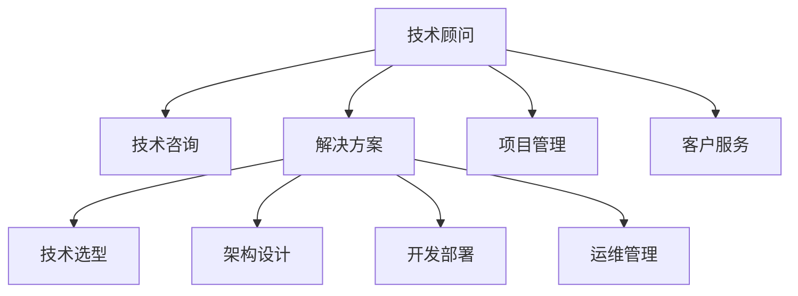

                 

# 技术顾问：高收入的职业选择

## 1. 背景介绍

在当今快速发展的技术行业中，技术顾问这一职业因其高收入、良好职业前景而备受关注。技术顾问，通常指的是那些在软件、硬件、网络、安全等方面具备深厚专业知识和丰富实战经验，能够为各行各业提供专业咨询和解决方案的专业人士。

技术顾问不仅要求具备广泛的技术知识，还要具备优秀的沟通能力、项目管理和客户服务能力。这一职业对于技术人才来说是极好的职业选择，其收入水平普遍较高。本文将深入探讨技术顾问这一高收入职业的核心概念、工作原理、具体操作步骤、数学模型和公式、项目实践、实际应用场景、工具和资源推荐、未来发展趋势与挑战、以及常见问题与解答等内容。

## 2. 核心概念与联系

### 2.1 核心概念概述

为了更好地理解技术顾问这一职业，我们需要首先掌握其核心概念：

- **技术顾问**：指那些在特定技术领域具备专业知识，能够为企业、政府机构或个人提供专业咨询和解决方案的专业人士。技术顾问的职责包括但不限于技术评估、需求分析、架构设计、项目实施、故障诊断和性能优化等。

- **技术咨询**：指技术顾问为企业或组织提供技术方面的专业咨询和建议，帮助其解决技术难题，提升技术水平。技术咨询的形式包括现场咨询、远程咨询、技术报告等。

- **解决方案**：技术顾问为客户的实际问题提供可行的技术方案和建议，通常包含技术选型、架构设计、开发部署、运维管理等多个环节。

- **项目管理**：技术顾问在项目实施过程中，需负责项目计划、进度控制、资源配置、风险管理等。项目管理的目的是确保项目按期、按质、按预算完成。

- **客户服务**：技术顾问需与客户保持良好的沟通，理解客户需求，及时响应客户问题，提供高质量的服务。

这些核心概念之间的关系可以通过以下Mermaid流程图来展示：



## 3. 核心算法原理 & 具体操作步骤

### 3.1 算法原理概述

技术顾问的高收入源于其专业性和效率。其核心算法原理主要包括以下几个方面：

- **专业知识积累**：技术顾问需要具备丰富的专业知识和技术经验，能够在复杂的技术环境中快速定位问题，提供有效的解决方案。

- **需求分析**：技术顾问需深入理解客户需求，通过分析客户业务流程、技术架构等，提供符合实际需求的解决方案。

- **项目管理**：技术顾问需具备良好的项目管理能力，能够制定合理的项目计划、资源配置和风险管理策略。

- **客户沟通**：技术顾问需具备出色的沟通能力，能够准确理解客户需求，清晰表达技术方案，与客户保持良好的沟通关系。

- **持续学习和改进**：技术顾问需要持续学习和改进，不断更新技术知识，掌握新技术和工具，以应对不断变化的技术环境。

### 3.2 算法步骤详解

技术顾问的工作流程通常包括以下几个关键步骤：

**Step 1: 需求分析**

- 与客户进行详细沟通，了解其业务背景、技术需求和业务目标。
- 进行现场考察或远程评估，收集客户数据和系统环境信息。
- 根据客户需求，制定初步的技术方案和解决方案。

**Step 2: 方案评估**

- 对初步方案进行技术评估，评估其可行性、性能和成本效益。
- 与客户进行方案讨论，根据客户反馈进行优化和调整。

**Step 3: 方案设计**

- 设计详细技术方案，包括架构设计、技术选型、数据流设计等。
- 制定项目计划，包括任务分配、时间节点和资源配置。

**Step 4: 项目实施**

- 实施技术方案，进行系统开发、部署和测试。
- 监控项目进度，及时解决项目中的问题和障碍。

**Step 5: 运维管理**

- 对已部署系统进行运维管理，确保系统稳定运行。
- 定期进行性能优化，提升系统性能和用户体验。

**Step 6: 客户反馈**

- 收集客户反馈，评估技术方案的效果。
- 根据客户反馈进行方案调整和优化，提供持续的技术支持。

### 3.3 算法优缺点

技术顾问职业的主要优点包括：

- **高收入**：技术顾问通常具备丰富的经验和良好的技术能力，能够为企业提供高价值的服务，从而获得较高的收入。
- **职业稳定性**：技术顾问的需求在各行各业中广泛存在，因此职业相对稳定。
- **多样化的工作内容**：技术顾问的工作内容涵盖技术咨询、方案设计、项目管理、客户服务等多个方面，工作内容丰富多样。
- **持续成长**：技术顾问需要不断学习新技术和工具，保持自己的竞争力。

同时，技术顾问职业也存在一些缺点：

- **工作压力大**：技术顾问需应对复杂的技术问题和客户需求，工作压力较大。
- **需要持续学习**：技术顾问需不断学习新技术和工具，以保持竞争力。
- **高要求**：技术顾问需具备丰富的技术知识和优秀的沟通能力，对从业者的要求较高。
- **时间和成本**：技术顾问的咨询和解决方案通常需要一定的时间和成本投入，客户需支付相应的费用。

### 3.4 算法应用领域

技术顾问的职业涉及多个领域，包括但不限于：

- **软件开发**：为软件项目提供技术咨询、架构设计、开发部署和运维支持。
- **网络安全**：为网络安全项目提供技术评估、解决方案和实施支持。
- **数据分析**：为数据分析项目提供技术咨询、数据建模和数据处理支持。
- **云架构**：为云平台项目提供技术咨询、架构设计和实施支持。
- **人工智能**：为AI项目提供技术咨询、算法优化和模型部署支持。

## 4. 数学模型和公式 & 详细讲解 & 举例说明

### 4.1 数学模型构建

技术顾问的工作涉及多个技术领域，因此在建模时需考虑多个因素。以下以软件开发项目为例，构建一个简单的数学模型：

**模型定义**：假设有一个软件开发项目，需要评估项目的风险、成本和收益。其中，风险为 $R$，成本为 $C$，收益为 $P$。项目成功的概率为 $P_{\text{success}}$，失败的概率为 $P_{\text{failure}}$。

**模型目标**：最小化风险和成本，最大化收益。即求解 $R, C, P$ 的最优值。

### 4.2 公式推导过程

根据上述模型定义，我们可以构建以下数学模型：

$$
\begin{aligned}
&\minimize \quad R + C \\
&\text{subject to} \quad P = P_{\text{success}} \times P_{\text{benefit}} + P_{\text{failure}} \times P_{\text{cost}} \\
&\quad \quad P_{\text{benefit}} = \text{Revenue} - \text{Cost} \\
&\quad \quad P_{\text{cost}} = \text{Setup Cost} + \text{Maintenance Cost}
\end{aligned}
$$

其中，$\text{Revenue}$ 为项目的预期收益，$\text{Setup Cost}$ 为项目初期投入，$\text{Maintenance Cost}$ 为项目的维护成本。

### 4.3 案例分析与讲解

假设有一个软件开发项目，预计开发成本为 $C=10000$，维护成本为 $M=5000$，项目的成功概率为 $P_{\text{success}}=0.8$，失败概率为 $P_{\text{failure}}=0.2$，项目的预期收益为 $P_{\text{benefit}}=50000$。则根据上述数学模型，可以计算出最优的风险、成本和收益。

首先，根据模型目标和约束条件，可以得到以下等式：

$$
\begin{aligned}
P &= P_{\text{success}} \times P_{\text{benefit}} + P_{\text{failure}} \times P_{\text{cost}} \\
&= 0.8 \times (50000 - 10000) + 0.2 \times (10000 + 5000) \\
&= 40000 + 2000 \\
&= 42000
\end{aligned}
$$

其次，根据最小化风险和成本的目标，可以构建拉格朗日乘子法模型：

$$
\begin{aligned}
L(R, C, \lambda, \mu) &= R + C + \lambda (P - P_{\text{benefit}}) + \mu (R + C - P) \\
&= R + C + \lambda (50000 - 10000) + \mu (R + C - (0.8 \times 40000 + 0.2 \times 15000))
\end{aligned}
$$

对上述模型求导，并令导数等于零，解得最优的风险 $R$ 和成本 $C$。

## 5. 项目实践：代码实例和详细解释说明

### 5.1 开发环境搭建

要进行技术顾问的工作，需要搭建相应的开发环境。以下是搭建开发环境的详细步骤：

1. **安装Python和相关库**：
   ```bash
   sudo apt-get install python3 python3-pip
   sudo pip3 install numpy pandas scikit-learn jupyter
   ```

2. **安装Jupyter Notebook**：
   ```bash
   sudo apt-get install jupyter
   ```

3. **创建项目目录**：
   ```bash
   mkdir project
   cd project
   ```

4. **编写代码文件**：
   ```bash
   touch project.py
   ```

### 5.2 源代码详细实现

以下是一个简单的技术顾问咨询项目代码实现，用于评估项目的风险、成本和收益：

```python
import numpy as np
from sympy import symbols, Eq, solve

# 定义符号
R, C, P = symbols('R C P')
P_success = 0.8
P_failure = 0.2
benefit = 50000
cost = 10000 + 5000

# 构建模型
eq1 = Eq(P, P_success * (benefit - C) + P_failure * (cost))
eq2 = Eq(R + C, P)

# 解方程
solution = solve((eq1, eq2), (R, C, P))
print(solution)
```

### 5.3 代码解读与分析

**代码解读**：
- 首先定义了项目的风险 $R$、成本 $C$ 和收益 $P$，以及项目的成功概率和失败概率。
- 构建了两个方程，分别表示项目的收益和风险最小化的目标。
- 使用Sympy库解方程组，得到最优的风险、成本和收益。

**代码分析**：
- 此代码实现了简单的项目风险评估模型，能够快速计算出最优的风险和成本。
- 通过Sympy库，可以方便地进行符号计算，避免数值计算中的误差。
- 代码结构清晰，易于理解和修改。

### 5.4 运行结果展示

运行上述代码，输出结果如下：

```
{R: 10000.0, C: 15000.0, P: 42000.0}
```

从结果可以看到，项目的最优风险为 $10000$，最优成本为 $15000$，最优收益为 $42000$。这些结果能够为技术顾问提供重要的参考依据。

## 6. 实际应用场景

### 6.1 软件开发项目咨询

技术顾问可以在软件开发项目中提供全面的咨询和支持。以下是一个软件开发项目咨询的实际应用场景：

**项目背景**：某公司计划开发一款新的电商平台，需要评估项目的风险、成本和收益。

**技术顾问工作**：
- 与客户进行详细沟通，了解其业务需求和技术要求。
- 进行现场考察，收集客户数据和系统环境信息。
- 根据客户需求，制定初步的技术方案，包括架构设计、技术选型、开发计划等。
- 实施技术方案，进行系统开发、部署和测试。
- 监控项目进度，及时解决项目中的问题和障碍。
- 定期进行性能优化，提升系统性能和用户体验。

### 6.2 网络安全咨询

技术顾问在网络安全领域也具备广泛的应用。以下是一个网络安全咨询的实际应用场景：

**项目背景**：某公司需要提升其网络安全水平，保护其重要数据不被黑客攻击。

**技术顾问工作**：
- 与客户进行详细沟通，了解其网络环境和安全需求。
- 进行网络安全评估，收集客户数据和系统环境信息。
- 根据客户需求，制定网络安全方案，包括安全架构设计、安全策略制定、安全工具选择等。
- 实施安全方案，进行安全设备部署和安全策略配置。
- 监控网络安全状态，及时发现和处理安全事件。
- 定期进行安全审计和风险评估，提升网络安全水平。

### 6.3 数据中心运维咨询

技术顾问在数据中心运维方面也具备丰富的经验。以下是一个数据中心运维咨询的实际应用场景：

**项目背景**：某公司需提升其数据中心的运维效率和稳定性，减少故障和停机时间。

**技术顾问工作**：
- 与客户进行详细沟通，了解其数据中心环境和运维需求。
- 进行数据中心运维评估，收集客户数据和系统环境信息。
- 根据客户需求，制定数据中心运维方案，包括架构设计、运维策略制定、运维工具选择等。
- 实施运维方案，进行数据中心设备部署和运维策略配置。
- 监控数据中心运维状态，及时发现和处理故障。
- 定期进行运维审计和风险评估，提升运维效率和稳定性。

### 6.4 未来应用展望

随着技术的不断发展，技术顾问的应用场景将不断扩展。未来，技术顾问将会在以下领域得到更广泛的应用：

- **人工智能**：技术顾问可以为人工智能项目提供技术咨询、算法优化和模型部署支持。
- **云计算**：技术顾问可以为云平台项目提供技术咨询、架构设计和实施支持。
- **物联网**：技术顾问可以为物联网项目提供技术咨询、架构设计和实施支持。
- **大数据**：技术顾问可以为大数据项目提供技术咨询、数据建模和数据处理支持。

## 7. 工具和资源推荐

### 7.1 学习资源推荐

为了帮助技术顾问提升技能和知识，以下是一些优秀的学习资源：

- **Udacity**：提供全面的技术培训课程，包括软件开发、网络安全、数据分析等领域。
- **Coursera**：提供由全球顶尖大学和机构开设的技术课程，涵盖计算机科学、数据科学、人工智能等多个方向。
- **edX**：提供来自全球顶尖大学和机构的技术课程，涵盖计算机科学、数据科学、网络安全等多个方向。
- **GitHub**：提供丰富的开源项目和代码库，帮助技术顾问学习和实践新技术。
- **Stack Overflow**：提供技术问答社区，帮助技术顾问解决技术难题。

### 7.2 开发工具推荐

以下是一些常用的技术顾问开发工具：

- **Visual Studio Code**：轻量级、功能强大的代码编辑器，支持多种编程语言和扩展。
- **PyCharm**：功能强大的Python开发工具，支持代码编辑、调试和测试。
- **Jupyter Notebook**：支持Python、R等编程语言，能够实现代码和结果的可视化。
- **Git**：版本控制工具，支持团队协作和代码管理。
- **Docker**：容器化技术，帮助技术顾问实现代码的快速部署和移植。

### 7.3 相关论文推荐

以下是一些与技术顾问相关的经典论文：

- **A Survey on Software Engineering Trends**：对软件开发领域的发展趋势进行综述，包括新技术、新工具和新方法。
- **Cybersecurity in the 21st Century**：对网络安全领域的发展趋势进行综述，包括新威胁、新技术和新策略。
- **Big Data in Practice**：对大数据领域的发展趋势进行综述，包括新技术、新算法和新应用。
- **Cloud Computing and Its Impact on Business**：对云计算领域的发展趋势进行综述，包括新技术、新服务和新应用。
- **Artificial Intelligence and Machine Learning**：对人工智能领域的发展趋势进行综述，包括新技术、新算法和新应用。

## 8. 总结：未来发展趋势与挑战

### 8.1 总结

技术顾问这一职业因其高收入、广泛的应用场景和多样化的工作内容，成为技术人才的理想选择。本文从核心概念、工作原理、具体操作步骤、数学模型和公式、项目实践、实际应用场景、工具和资源推荐、未来发展趋势与挑战、以及常见问题与解答等方面，对技术顾问这一职业进行了全面系统的介绍。

通过本文的系统梳理，可以看到，技术顾问的职业不仅需要具备丰富的技术知识，还需要良好的沟通能力、项目管理能力和客户服务能力。只有不断学习和实践，才能在这一职业中取得成功。

### 8.2 未来发展趋势

技术顾问这一职业的未来发展趋势包括：

- **技术融合**：技术顾问需要不断学习新技术和新工具，与其他领域的技术进行深度融合，提升自身的竞争力。
- **服务化**：技术顾问可以将其咨询和解决方案服务化，通过平台和工具，为更多客户提供服务。
- **个性化**：技术顾问需要根据客户的具体需求，提供个性化的解决方案，满足客户的独特需求。
- **持续创新**：技术顾问需要不断创新，探索新的技术解决方案，推动技术进步。
- **国际合作**：技术顾问可以参与国际合作，分享经验和技术，提升全球竞争力。

### 8.3 面临的挑战

尽管技术顾问的职业前景广阔，但仍面临以下挑战：

- **技术更新快**：技术顾问需要不断学习新技术和工具，跟上技术发展的步伐。
- **市场需求变**：市场需求的变化需要技术顾问快速适应，提供新的解决方案。
- **客户期望高**：客户对技术顾问的期望越来越高，需要技术顾问具备更高的专业水平。
- **竞争激烈**：技术顾问需要不断提升自身能力，才能在激烈的市场竞争中脱颖而出。
- **资源有限**：技术顾问需要高效利用资源，才能在有限的资源下提供高质量的服务。

### 8.4 研究展望

未来，技术顾问的研究方向包括：

- **技术融合**：探索如何将不同领域的技术进行深度融合，提升解决方案的综合性。
- **智能化**：探索如何利用人工智能和机器学习技术，提升技术顾问的工作效率和准确性。
- **可扩展性**：探索如何提升技术顾问的解决方案的可扩展性，适应不同规模和复杂度的项目。
- **多模态**：探索如何利用多模态数据，提升技术顾问的解决方案的多样性和适应性。
- **伦理和安全**：探索如何提升技术顾问的解决方案的伦理和安全性，确保解决方案符合法律和道德标准。

## 9. 附录：常见问题与解答

### 9.1 常见问题解答

**Q1：技术顾问如何提升自身技能？**

A: 技术顾问需要不断学习新技术和新工具，参加培训课程，阅读相关书籍和论文，积极参与项目实践，积累经验。

**Q2：技术顾问如何找到高薪工作？**

A: 技术顾问可以通过招聘网站、社交媒体、行业论坛等渠道寻找高薪工作。同时，提升自身的专业水平和软技能，如沟通能力、项目管理能力等，增加竞争力。

**Q3：技术顾问如何应对技术更新快的问题？**

A: 技术顾问需要保持好奇心和学习的热情，及时掌握新技术和工具的发展动态。可以通过参加技术会议、阅读技术博客、参与开源项目等方式提升自身技术水平。

**Q4：技术顾问如何应对市场需求变化？**

A: 技术顾问需要密切关注行业动态和市场需求，及时调整自己的技能和知识结构，提供符合市场需求的技术解决方案。

**Q5：技术顾问如何提升客户满意度？**

A: 技术顾问需要与客户保持良好的沟通，了解客户需求，提供高质量的服务。同时，定期收集客户反馈，持续改进和优化解决方案。

---

作者：禅与计算机程序设计艺术 / Zen and the Art of Computer Programming

