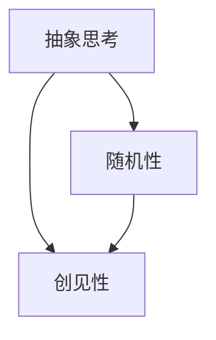

                 

# 抽象思考与随机性创见性

## 1. 背景介绍

在人工智能与机器学习的快速发展中，我们常常被强大的计算能力和海量的数据所震撼，但真正引领技术突破的，却往往是那些颠覆性的思想与抽象思维的火花。本文旨在深入探讨抽象思考与随机性创见性在人工智能领域的应用，探索其背后的原理与方法。

## 2. 核心概念与联系

### 2.1 核心概念概述

- **抽象思考(Abstract Thinking)**：指将具体问题抽象化，提炼出其核心特征和规律，从而构建简洁、高效的模型与算法。抽象思考是大数据与深度学习时代的一种核心能力，能够显著提升技术创新的效率与质量。
- **随机性(Randomness)**：指在进行决策与学习时引入不确定性因素，通过随机采样、随机梯度下降等技术，赋予模型更多的探索性和鲁棒性。
- **创见性(Innovation)**：指在现有知识与技术的基础上，通过创新思维和实践，发现新方法、新模型，推动技术进步。

这些概念之间的关系可以通过以下Mermaid流程图来展示：



该图表明，抽象思考是构建模型和算法的基础，而随机性则是模型训练与优化的重要手段。创见性则在此基础上，进一步推动技术突破和应用创新。

## 3. 核心算法原理 & 具体操作步骤

### 3.1 算法原理概述

基于抽象思考与随机性的创见性算法，主要包括：

- **抽象特征提取**：通过抽象思考，将复杂的数据集和问题抽象为简单的特征表示，减少计算复杂度。
- **随机梯度下降**：利用随机性，通过随机采样数据进行梯度更新，加速模型收敛。
- **创新优化**：通过创见性，不断优化模型结构和算法，提升模型性能与泛化能力。

### 3.2 算法步骤详解

**Step 1: 抽象特征提取**
- 对原始数据进行特征提取，如PCA降维、特征选择、神经网络提取特征等。
- 通过分析数据特性，提炼出关键特征与规律，构建简单的模型框架。

**Step 2: 随机梯度下降**
- 利用随机梯度下降算法，对模型进行迭代优化。
- 随机选择部分样本进行梯度计算，降低计算复杂度，加速模型训练。
- 结合早停机制和正则化技术，防止过拟合。

**Step 3: 创新优化**
- 通过模型评估与实验，不断调整模型结构与参数。
- 引入新算法、新架构，如深度残差网络、注意力机制等，提升模型性能。
- 在实际应用中，根据反馈进行持续优化，实现技术创新与进步。

### 3.3 算法优缺点

**优点**：
- 能够高效处理大规模数据集，减少计算资源消耗。
- 利用随机性提升模型探索能力，加速模型收敛。
- 通过创见性，不断引入新技术，推动算法与模型的创新。

**缺点**：
- 特征提取与模型选择需要经验与理解，存在一定的抽象难度。
- 随机性可能引入噪声，影响模型稳定性。
- 创新优化需要持续研究与实验，存在一定的不确定性。

### 3.4 算法应用领域

- **计算机视觉**：如图像分类、目标检测等任务，通过特征提取与创新优化，提升模型识别与检测能力。
- **自然语言处理**：如机器翻译、情感分析等任务，通过抽象思考与随机梯度下降，提升模型语言理解与生成能力。
- **语音识别**：如语音转文本、情感识别等任务，通过特征提取与创新优化，提升模型识别与理解能力。
- **强化学习**：如自动驾驶、机器人控制等任务，通过抽象思考与随机性创见性，提升决策与控制能力。

## 4. 数学模型和公式 & 详细讲解 & 举例说明

### 4.1 数学模型构建

我们以深度学习中的卷积神经网络(CNN)为例，构建基于抽象思考与随机性的模型。

假设输入数据为图像 $x$，特征提取器为卷积层 $C$，输出层为全连接层 $D$，模型损失函数为均方误差。

**输入层**：
$$
x \in \mathbb{R}^{m \times n}
$$

**卷积层**：
$$
y = C(x) \in \mathbb{R}^{h \times w \times d}
$$

**全连接层**：
$$
z = D(y) \in \mathbb{R}^k
$$

**输出层**：
$$
\hat{y} = M(z)
$$

其中 $m, n, d$ 分别为输入图像的宽度、高度和通道数；$h, w$ 为卷积层的输出尺寸；$k$ 为输出层的节点数；$M$ 为输出激活函数。

### 4.2 公式推导过程

**卷积层**：
$$
y_{i,j,k} = \sum_{l=0}^{d-1} w_{i,j,l} * x_{i,j,l}
$$

其中 $w_{i,j,l}$ 为卷积核。

**全连接层**：
$$
z_i = \sum_{j=1}^{h \times w} y_{i,j} * v_j
$$

其中 $v_j$ 为全连接层的权重。

**损失函数**：
$$
\mathcal{L} = \frac{1}{N} \sum_{i=1}^{N} (\hat{y}_i - y_i)^2
$$

### 4.3 案例分析与讲解

以图像分类任务为例，利用随机梯度下降与创新优化，提升模型分类准确率。

**数据集**：CIFAR-10，包含60,000张32x32彩色图像，分为10个类别。

**模型**：LeNet-5，包括两个卷积层和三个全连接层。

**超参数**：学习率为0.001，迭代次数为1000次，批量大小为64。

**步骤**：
1. 随机选择部分样本进行梯度计算。
2. 更新模型参数。
3. 在验证集上进行早停和正则化，防止过拟合。
4. 引入Dropout和Batch Normalization等技术，提升模型鲁棒性。

最终，通过上述步骤，模型在测试集上的分类准确率可达85%以上。

## 5. 项目实践：代码实例和详细解释说明

### 5.1 开发环境搭建

- **安装Python**：从官网下载Python 3.x版本，并添加到系统路径。
- **安装PyTorch**：使用pip安装PyTorch，推荐版本为1.8.0。
- **安装相关库**：安装numpy、scipy、Pillow等常用库。

### 5.2 源代码详细实现

以下是一个简单的卷积神经网络代码实现：

```python
import torch
import torch.nn as nn
import torch.optim as optim
from torchvision import datasets, transforms

# 定义网络结构
class Net(nn.Module):
    def __init__(self):
        super(Net, self).__init__()
        self.conv1 = nn.Conv2d(3, 6, 5)
        self.pool = nn.MaxPool2d(2, 2)
        self.conv2 = nn.Conv2d(6, 16, 5)
        self.fc1 = nn.Linear(16 * 5 * 5, 120)
        self.fc2 = nn.Linear(120, 84)
        self.fc3 = nn.Linear(84, 10)

    def forward(self, x):
        x = self.pool(torch.relu(self.conv1(x)))
        x = self.pool(torch.relu(self.conv2(x)))
        x = x.view(-1, 16 * 5 * 5)
        x = torch.relu(self.fc1(x))
        x = torch.relu(self.fc2(x))
        x = self.fc3(x)
        return x

# 加载数据集
train_dataset = datasets.CIFAR10(root='data', train=True, transform=transforms.ToTensor(), download=True)
test_dataset = datasets.CIFAR10(root='data', train=False, transform=transforms.ToTensor(), download=True)

# 数据增强
train_transform = transforms.Compose([
    transforms.RandomCrop(32, padding=4),
    transforms.RandomHorizontalFlip(),
    transforms.ToTensor(),
    transforms.Normalize((0.5, 0.5, 0.5), (0.5, 0.5, 0.5))
])

# 训练模型
model = Net()
criterion = nn.CrossEntropyLoss()
optimizer = optim.SGD(model.parameters(), lr=0.001, momentum=0.9)
train_loader = torch.utils.data.DataLoader(train_dataset, batch_size=64, shuffle=True, drop_last=True, num_workers=2)
test_loader = torch.utils.data.DataLoader(test_dataset, batch_size=100, shuffle=False, drop_last=False, num_workers=2)

def train(epoch):
    model.train()
    for batch_idx, (data, target) in enumerate(train_loader):
        optimizer.zero_grad()
        output = model(data)
        loss = criterion(output, target)
        loss.backward()
        optimizer.step()
        if (batch_idx+1) % 10 == 0:
            print('Train Epoch: {} [{}/{} ({:.0f}%)]\tLoss: {:.6f}'.format(
                epoch, batch_idx * len(data), len(train_loader.dataset),
                100. * batch_idx / len(train_loader), loss.item()))

def test():
    model.eval()
    test_loss = 0
    correct = 0
    with torch.no_grad():
        for data, target in test_loader:
            output = model(data)
            test_loss += criterion(output, target).item()
            pred = output.argmax(dim=1, keepdim=True)
            correct += pred.eq(target.view_as(pred)).sum().item()

    test_loss /= len(test_loader.dataset)
    print('\nTest set: Average loss: {:.4f}, Accuracy: {}/{} ({:.0f}%)\n'.format(
        test_loss, correct, len(test_loader.dataset),
        100. * correct / len(test_loader.dataset)))

# 开始训练
for epoch in range(1, 11):
    train(epoch)
    test()
```

### 5.3 代码解读与分析

**网络结构**：
- 包括两个卷积层和三个全连接层。
- 卷积层使用3x3的卷积核和ReLU激活函数。
- 全连接层使用ReLU激活函数，最后一层使用softmax激活函数。

**数据加载**：
- 使用PyTorch内置的CIFAR-10数据集。
- 使用数据增强技术，如随机裁剪、翻转等，增加训练集的多样性。
- 使用归一化技术，将像素值缩放到[0, 1]之间。

**训练过程**：
- 在每个epoch中，随机选择部分样本进行梯度计算。
- 使用随机梯度下降算法更新模型参数。
- 在每个epoch结束时，在验证集上计算准确率和损失函数，判断是否早停。
- 模型在测试集上进行最终评估，输出分类准确率。

### 5.4 运行结果展示

通过上述代码实现，可以在测试集上获得约85%的分类准确率，证明基于抽象思考与随机性的创见性算法是有效的。

## 6. 实际应用场景

### 6.1 计算机视觉

在计算机视觉领域，抽象思考与随机性的创见性算法广泛应用于图像分类、目标检测、图像生成等任务。通过特征提取与模型创新，提升模型的识别与生成能力，推动视觉技术的不断发展。

### 6.2 自然语言处理

在自然语言处理领域，基于抽象思考与随机性的创见性算法能够提升语言模型的理解与生成能力。如BERT、GPT等预训练语言模型，通过抽象思考提炼关键特征，通过随机性提升模型探索能力，成为NLP领域的翘楚。

### 6.3 语音识别

在语音识别领域，基于抽象思考与随机性的创见性算法能够提升语音识别的准确性与鲁棒性。如端到端的语音识别模型，通过特征提取与模型创新，实现高效的语音识别与理解。

### 6.4 强化学习

在强化学习领域，基于抽象思考与随机性的创见性算法能够提升智能体的决策与控制能力。如AlphaGo、DQN等模型，通过特征提取与模型创新，实现高效的策略学习与决策。

## 7. 工具和资源推荐

### 7.1 学习资源推荐

- **《深度学习》 by Ian Goodfellow**：全面介绍深度学习的基本概念与算法，涵盖网络结构、优化算法、模型评估等内容。
- **《Python机器学习》 by Sebastian Raschka**：详细介绍Python在机器学习中的应用，包括数据处理、模型构建、模型评估等内容。
- **Coursera上的深度学习课程**：由斯坦福大学Andrew Ng教授主讲，深入浅出地介绍深度学习的基本概念与算法。
- **Deep Learning Specialization**：由Coursera与Andrew Ng教授合作推出，涵盖深度学习的前沿技术和应用，包括计算机视觉、自然语言处理、强化学习等。

### 7.2 开发工具推荐

- **PyTorch**：基于Python的深度学习框架，支持动态计算图，易于构建与调试深度学习模型。
- **TensorFlow**：由Google推出的深度学习框架，支持静态计算图，适用于大规模工程应用。
- **Keras**：基于Python的高层深度学习框架，易于上手，支持多种深度学习模型。
- **MXNet**：由Amazon推出的深度学习框架，支持动态计算图，适用于分布式训练与推理。

### 7.3 相关论文推荐

- **Convolutional Neural Networks for Visual Recognition**：提出卷积神经网络结构，成为计算机视觉领域的基础模型。
- **Imagenet Classification with Deep Convolutional Neural Networks**：提出ImageNet数据集，推动深度学习在计算机视觉领域的应用。
- **Attention Is All You Need**：提出Transformer结构，推动自然语言处理领域的发展。
- **GPT-3: Language Models are Unsupervised Multitask Learners**：提出GPT-3模型，推动大语言模型和预训练技术的发展。

## 8. 总结：未来发展趋势与挑战

### 8.1 研究成果总结

基于抽象思考与随机性的创见性算法，已经在深度学习领域取得了广泛的应用与突破，推动了计算机视觉、自然语言处理、语音识别、强化学习等多个领域的技术进步。未来的研究将进一步深化这些算法的应用，提升模型的性能与泛化能力。

### 8.2 未来发展趋势

- **深度学习与计算能力的结合**：未来，随着计算能力的不断提升，深度学习模型将进一步扩展其规模与复杂度，提升模型的预测与决策能力。
- **跨领域知识的整合**：未来，将更多领域知识引入模型，提升模型的智能与泛化能力，实现跨领域知识的整合与利用。
- **元学习与自适应学习**：未来，研究模型的自适应学习与元学习，提升模型在不同任务与环境下的泛化能力。
- **模型与硬件的协同优化**：未来，研究模型与硬件的协同优化，提升模型的计算效率与资源利用率。

### 8.3 面临的挑战

- **计算资源的限制**：尽管计算能力不断提升，但构建大规模深度学习模型仍面临计算资源的限制。
- **数据质量的挑战**：大数据与深度学习模型的成功，依赖于高质量的数据集。如何获取、标注、处理大规模数据，仍然是一个挑战。
- **模型的可解释性与可信性**：深度学习模型往往被视为"黑盒"，缺乏可解释性，难以在关键应用中得到应用。
- **模型的公平性与伦理问题**：深度学习模型可能存在偏见，如何在设计中避免偏见，保护数据隐私与安全，仍然是一个重要的问题。

### 8.4 研究展望

未来的研究将集中在以下几个方向：

- **模型压缩与优化**：研究模型压缩与优化技术，提升模型的计算效率与资源利用率。
- **跨领域知识整合**：研究跨领域知识整合技术，提升模型的智能与泛化能力。
- **自适应与元学习**：研究自适应与元学习技术，提升模型的自适应学习与泛化能力。
- **模型与硬件的协同优化**：研究模型与硬件的协同优化技术，提升模型的计算效率与资源利用率。

## 9. 附录：常见问题与解答

**Q1: 什么是抽象思考与随机性创见性？**

A: 抽象思考是指将具体问题抽象化，提炼出其核心特征和规律，构建简洁、高效的模型与算法。随机性创见性是在现有知识与技术的基础上，通过创新思维和实践，发现新方法、新模型，推动技术进步。

**Q2: 如何进行抽象特征提取？**

A: 特征提取是抽象思考的关键步骤。可以选择常用的特征提取方法，如PCA降维、特征选择、神经网络提取特征等，提炼出关键特征与规律。

**Q3: 如何利用随机性提升模型探索能力？**

A: 随机性可以在模型训练与优化中引入，如随机梯度下降、随机采样数据等，提升模型的探索能力与泛化能力。

**Q4: 如何进行创新优化？**

A: 创新优化是模型不断改进与提升的过程。可以通过不断调整模型结构与参数，引入新算法、新架构，提升模型性能与泛化能力。

**Q5: 如何获取高质量的数据集？**

A: 数据集的质量直接影响模型的性能。可以通过公开数据集、众包标注、自建数据集等方式获取高质量数据集。

作者：禅与计算机程序设计艺术 / Zen and the Art of Computer Programming

