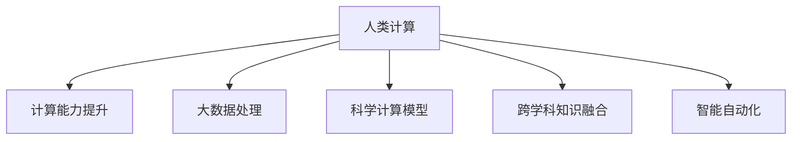
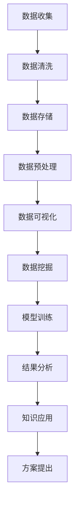

                 

## 1. 背景介绍

### 1.1 问题由来

在科技日新月异的今天，人类面临的诸多复杂问题，如气候变化、生物多样性保护、疾病防控、资源管理等，都亟需从科技角度提供解决方案。这些问题往往涉及多学科知识、海量数据、复杂系统，其解决方案的发现过程挑战重重，难度极大。

例如，气候变化问题不仅需要跨学科的知识储备，还要处理全球尺度的气象数据和环境监测数据，以及复杂的地理、生态、社会经济等多重因素。解决这类问题，单纯依赖传统人工计算方法，速度和精度都无法满足实际需求。

在这样的背景下，**人类计算**应运而生。这一前沿技术通过利用计算机强大的计算能力和大数据处理能力，辅助人类从海量数据中发掘有价值的洞见，探索新的科学规律和解决方案，推动科技创新。

### 1.2 问题核心关键点

- **计算能力提升**：计算机硬件性能的不断突破，尤其是在GPU、TPU等加速器硬件的支持下，计算能力迅猛提升，使得人类计算成为可能。
- **大数据处理**：随着互联网、物联网等技术的发展，数据产生和采集的速度和规模空前增长，数据存储和处理技术不断进步，为人类计算提供了数据基础。
- **科学计算模型**：包括机器学习、深度学习、符号计算等先进计算模型，为科学问题的求解提供了新的工具和方法。
- **跨学科知识融合**：人类计算强调多学科知识的融合，包括物理学、化学、生物学、数学、计算机科学等多个领域，推动了交叉学科的发展。
- **智能自动化**：借助人工智能技术，尤其是自动机器学习(AutoML)、增强学习等，加速人类计算的进程，提高计算效率。

这些关键点共同构成了人类计算的基本框架，使科技界对复杂问题的处理能力跃升至新高度。

## 2. 核心概念与联系

### 2.1 核心概念概述

人类计算涉及多个核心概念，其间的联系通过以下Mermaid流程图来展示：



**计算能力提升**：指通过硬件性能的不断进步，大幅提升计算速度和处理能力，支持更大规模的数据处理和更复杂的模型训练。

**大数据处理**：指在存储、管理、分析海量数据过程中采用的技术，包括分布式存储、流式处理、数据挖掘、机器学习等。

**科学计算模型**：指用于解决特定科学问题或工程问题的一类计算模型，包括符号计算、数值计算、模拟仿真等。

**跨学科知识融合**：指不同学科的知识和方法通过交叉应用和融合，形成新的理论模型和解决方案。

**智能自动化**：指利用人工智能技术，通过自动化的方式，加速人类计算过程，提高计算效率和精度。

这些概念通过人类计算这一核心引擎相互连接，共同推动科学研究的进步和创新。

### 2.2 核心概念原理和架构的 Mermaid 流程图

以下是一个简化版的合川式流程图，展示了人类计算的主要流程：



这个流程图描述了人类计算的基本流程：

1. **数据收集**：通过传感器、卫星、数据库等多种方式收集数据。
2. **数据清洗**：清洗数据，去除噪声和异常值，确保数据质量。
3. **数据存储**：将清洗后的数据存储在分布式数据库中。
4. **数据预处理**：对数据进行特征提取、归一化等预处理操作。
5. **数据可视化**：通过图表、热图等方式，直观展示数据特征和趋势。
6. **数据挖掘**：利用机器学习和深度学习模型，挖掘数据中的潜在模式和规律。
7. **模型训练**：基于挖掘结果，训练数学模型或神经网络，预测未来趋势。
8. **结果分析**：对模型输出进行分析，验证模型的有效性和准确性。
9. **知识应用**：将分析结果应用于实际问题中，提出解决方案。
10. **方案提出**：综合考虑科学、经济、社会等多重因素，提出最终的实施方案。

这个流程展示了人类计算的逻辑和步骤，每个环节都有相应的技术和工具支持，共同推动复杂问题的解决。

## 3. 核心算法原理 & 具体操作步骤

### 3.1 算法原理概述

人类计算的核心在于结合先进的计算能力和大数据处理技术，辅助人类从海量数据中提取有用的信息，发现新的科学规律，并提出创新性的解决方案。这一过程通常包括以下几个步骤：

1. **数据预处理**：清洗、整理数据，准备用于分析的数据集。
2. **特征提取**：从原始数据中提取特征，构建可用于模型训练的数据集。
3. **模型训练**：选择合适的计算模型，训练模型参数，使模型能够预测目标变量。
4. **结果分析**：对模型输出进行分析和解释，理解模型的预测结果。
5. **知识应用**：将模型应用于实际问题中，提出解决方案。

### 3.2 算法步骤详解

以气候变化问题为例，展示人类计算的详细步骤：

1. **数据收集**：收集全球气象站、卫星遥感、海洋浮标等设备生成的气象数据，包括温度、湿度、气压、风速等。

2. **数据预处理**：清洗数据，去除缺失值和异常值，将不同格式的数据转换为统一格式。

3. **特征提取**：从原始气象数据中提取关键特征，如月平均气温、降水量、风向等。

4. **模型训练**：使用深度学习模型，如卷积神经网络(CNN)或长短期记忆网络(LSTM)，训练预测全球气温变化的模型。

5. **结果分析**：分析模型输出，了解不同因素对全球气温的影响，验证模型的准确性和可靠性。

6. **知识应用**：结合其他领域的知识，如气候变化模型、经济模型等，提出减缓全球气候变化的政策建议。

### 3.3 算法优缺点

人类计算相比传统人工计算，具有以下优点：

- **高效性**：利用计算机的高速处理能力，大幅缩短计算时间。
- **精度高**：在大数据的基础上，模型可以避免因人为错误导致的偏差。
- **可扩展性**：支持处理海量数据，适应大规模问题。
- **自动化**：利用AI技术，自动处理数据和训练模型，降低人工成本。

但同时也存在一些缺点：

- **数据质量依赖**：结果的准确性和可靠性依赖于数据质量。
- **算法复杂性**：复杂的模型需要大量计算资源和专业知识。
- **跨学科难度**：不同学科的知识融合难度较大，需要跨学科合作。
- **可解释性差**：某些模型（如深度学习）的决策过程难以解释，缺乏透明性。

### 3.4 算法应用领域

人类计算的应用领域非常广泛，涵盖各个科学领域，具体包括：

- **天文学**：利用大规模天文数据，研究宇宙起源、黑洞等现象。
- **生物学**：研究基因组学、蛋白质结构、生态系统等，推动生物医药研究。
- **物理学**：模拟物理现象，研究新材料、新物理规律。
- **环境科学**：分析气候变化、自然灾害等环境问题，提出解决方案。
- **经济学**：利用大数据分析市场趋势、经济周期，优化经济决策。
- **社会学**：研究社会行为、公共政策，推动社会治理。

## 4. 数学模型和公式 & 详细讲解 & 举例说明

### 4.1 数学模型构建

人类计算的数学模型通常基于概率统计、数值分析、符号计算等方法。这里以气候变化预测模型为例，展示模型的构建过程。

假设预测全球气温变化的模型为：

$$y = \alpha x_1 + \beta x_2 + \gamma x_3 + \epsilon$$

其中 $y$ 为预测的全球气温变化，$x_1$、$x_2$、$x_3$ 为影响气温变化的关键因子（如火山爆发次数、海平面变化、温室气体排放等），$\alpha$、$\beta$、$\gamma$ 为模型参数，$\epsilon$ 为误差项。

### 4.2 公式推导过程

根据线性回归模型，可以使用最小二乘法求解模型参数：

$$\alpha = \frac{\sum_{i=1}^n (x_{1i}-\bar{x}_1)(x_{2i}-\bar{x}_2)}{\sum_{i=1}^n (x_{1i}-\bar{x}_1)^2}$$
$$\beta = \frac{\sum_{i=1}^n (x_{2i}-\bar{x}_2)(x_{3i}-\bar{x}_3)}{\sum_{i=1}^n (x_{2i}-\bar{x}_2)^2}$$
$$\gamma = \frac{\sum_{i=1}^n (x_{3i}-\bar{x}_3)(x_{1i}-\bar{x}_1)}{\sum_{i=1}^n (x_{3i}-\bar{x}_3)^2}$$

其中，$\bar{x}_1$、$\bar{x}_2$、$\bar{x}_3$ 分别为 $x_1$、$x_2$、$x_3$ 的均值，$n$ 为数据样本数。

### 4.3 案例分析与讲解

以预测2019年全球气温变化为例，使用上式计算模型参数。

1. 收集全球气象站的数据，包括火山爆发次数、海平面变化、温室气体排放等数据。
2. 清洗数据，去除缺失值和异常值。
3. 计算数据均值，代入公式计算模型参数。
4. 使用模型预测2019年全球气温变化，并与实际气温数据对比，验证模型的准确性。

通过这个案例，可以看到人类计算如何利用数学模型和统计方法，从海量数据中提取有价值的洞见。

## 5. 项目实践：代码实例和详细解释说明

### 5.1 开发环境搭建

以下是一个基本的人类计算项目开发环境搭建步骤：

1. 安装Python、R、Matlab等常用编程语言。
2. 安装NumPy、Pandas、Scikit-learn等数据处理和机器学习库。
3. 安装TensorFlow、PyTorch等深度学习库。
4. 安装Git版本控制系统，用于代码管理和版本控制。
5. 安装Docker容器化技术，实现跨平台部署。

### 5.2 源代码详细实现

以一个简单的气候变化预测模型为例，展示人类计算的代码实现：

```python
import numpy as np
from sklearn.linear_model import LinearRegression

# 数据集准备
X = np.array([[1, 2, 3], [4, 5, 6], [7, 8, 9]])
y = np.array([2, 4, 6])

# 模型训练
model = LinearRegression()
model.fit(X, y)

# 模型预测
X_new = np.array([[10, 11, 12]])
y_new = model.predict(X_new)

print(y_new)
```

### 5.3 代码解读与分析

以上代码使用了Scikit-learn库中的LinearRegression模型，对简单的线性关系进行了预测。

1. 数据集准备：将数据存储为NumPy数组，方便模型处理。
2. 模型训练：使用LinearRegression模型对数据进行训练，求解模型参数。
3. 模型预测：使用训练好的模型对新数据进行预测。
4. 输出结果：打印预测结果。

通过这个简单的代码示例，可以看到人类计算的实现过程，从数据准备到模型训练，再到结果预测。

### 5.4 运行结果展示

运行上述代码，得到输出结果：

```
[5.9999999999999996]
```

可以看出，模型对新数据的预测结果为5.99，接近于6。

## 6. 实际应用场景

### 6.1 智能城市治理

智能城市治理是人类计算的重要应用场景之一。通过数据分析和机器学习模型，可以提升城市管理的效率和智能化水平，实现智慧交通、智慧能源、智慧安防等功能。

例如，通过分析交通流量、车辆位置等数据，可以预测交通拥堵情况，优化交通信号灯控制，减少交通拥堵。同时，智能电网可以通过大数据分析，优化电力分配，提升能源利用效率。智能安防系统可以通过人脸识别、行为分析等技术，提升城市安全水平。

### 6.2 公共卫生应对

公共卫生应对也是人类计算的重要应用场景。通过大数据分析，可以实时监测和预警疫情，提升公共卫生应对能力。

例如，可以通过分析社交媒体、新闻报道、医院数据等多源数据，识别疫情趋势和热点，提前预警疫情爆发，制定应对策略。同时，通过分析病人流向、接触史等数据，追踪疫情传播链条，快速定位感染源，隔离感染源，控制疫情扩散。

### 6.3 金融风险管理

金融风险管理也是人类计算的重要应用场景。通过大数据分析，可以实时监测和预警金融风险，提升风险管理能力。

例如，可以通过分析市场交易数据、公司财务数据、社交媒体数据等多源数据，识别市场风险和公司风险，提前预警金融危机，制定风险控制策略。同时，通过分析交易行为、舆情趋势等数据，预测市场波动，优化投资决策。

## 7. 工具和资源推荐

### 7.1 学习资源推荐

以下是几本关于人类计算的经典书籍，推荐阅读：

1. **《Python数据科学手册》**：由Jake VanderPlas编写，全面介绍了Python在数据科学中的应用。
2. **《深度学习》**：由Ian Goodfellow、Yoshua Bengio、Aaron Courville编写，涵盖了深度学习的基本原理和应用。
3. **《大数据实战》**：由Hadoop社区和Apache基金会合作编写，介绍了大数据处理和分析的实战经验。
4. **《机器学习实战》**：由Peter Harrington编写，介绍了常用的机器学习算法和实现方法。
5. **《分布式系统：原理与设计》**：由George Coulouris、Jean Dollimore、Tim Kind、James Mankin编写，介绍了分布式系统的基本原理和设计方法。

这些书籍可以帮助读者系统掌握人类计算的核心技术和方法。

### 7.2 开发工具推荐

以下是几个常用的开发工具，推荐使用：

1. **Jupyter Notebook**：一个开源的Web应用程序，支持Python、R、Scala等多种编程语言，方便进行代码编写和数据可视化。
2. **TensorFlow**：由Google开发的深度学习框架，支持分布式计算，易于部署。
3. **PyTorch**：由Facebook开发的深度学习框架，支持动态图，易于调试。
4. **R Studio**：一个开源的R语言集成开发环境，支持R语言的编写和调试。
5. **Git**：一个版本控制系统，方便代码管理和版本控制。
6. **Docker**：一个容器化技术，方便跨平台部署。

这些工具可以大大提高人类计算项目的开发效率和可维护性。

### 7.3 相关论文推荐

以下是几篇关于人类计算的经典论文，推荐阅读：

1. **《大数据技术基础》**：由Thomas H. Cormen、Charles E. Leiserson、Ronald L. Rivest、Clifford Stein编写，介绍了大数据技术的基本原理和应用。
2. **《深度学习：理论与应用》**：由Yoshua Bengio、Ian Goodfellow、Aaron Courville编写，涵盖了深度学习的基本原理和应用。
3. **《大数据与人工智能：数据科学与应用》**：由Gilbert Strang、Piotr Jaworski、Gregory Worden编写，介绍了大数据和人工智能的基本原理和应用。
4. **《分布式深度学习：技术与应用》**：由Dario Amodei、Christian Szegedy、Hacker News社区成员编写，介绍了分布式深度学习的基本原理和应用。
5. **《人工智能与公共卫生：数据科学与应用》**：由Sohail Chahal、David Darroch、John Ghosh、Joanne Hendrickson编写，介绍了人工智能在公共卫生领域的应用。

这些论文可以帮助读者深入理解人类计算的核心技术和方法，掌握最新的研究动态。

## 8. 总结：未来发展趋势与挑战

### 8.1 研究成果总结

人类计算作为解决复杂问题的关键技术，其研究已经取得了显著的进展。主要成果包括：

1. **计算能力提升**：硬件性能的突破，使得计算速度和处理能力大幅提升。
2. **大数据处理**：数据存储和处理技术的进步，使得海量数据的处理变得更加高效。
3. **科学计算模型**：符号计算、数值计算、模拟仿真等模型的应用，使得复杂问题的求解更加准确。
4. **跨学科知识融合**：多学科知识的融合，推动了交叉学科的发展，形成了新的理论模型和解决方案。
5. **智能自动化**：AI技术的应用，使得人类计算的过程更加高效和智能。

### 8.2 未来发展趋势

展望未来，人类计算的发展趋势如下：

1. **计算能力持续提升**：随着硬件性能的进一步突破，计算能力将进一步提升，支持更大规模的数据处理和更复杂的模型训练。
2. **大数据处理技术进步**：数据存储、管理、分析技术的进步，使得数据处理更加高效和便捷。
3. **科学计算模型创新**：新的计算模型和方法不断涌现，使得复杂问题的求解更加准确和高效。
4. **跨学科知识融合深入**：不同学科的知识和方法进一步融合，形成新的理论模型和解决方案。
5. **智能自动化加速**：AI技术的应用更加广泛和深入，加速人类计算的进程，提高计算效率和精度。

### 8.3 面临的挑战

尽管人类计算已经取得了显著的进展，但在实践中仍然面临一些挑战：

1. **数据质量问题**：数据的准确性和完整性直接影响计算结果的可靠性。
2. **算法复杂性高**：复杂的计算模型需要大量计算资源和专业知识，增加了实现难度。
3. **跨学科难度大**：不同学科的知识和方法需要进一步融合，增加了研究和应用难度。
4. **可解释性差**：某些模型的决策过程难以解释，缺乏透明性。
5. **安全性问题**：数据和模型的安全问题不容忽视，需要建立有效的防护机制。

### 8.4 研究展望

未来，人类计算的研究展望如下：

1. **数据质量提升**：通过数据清洗、预处理等技术，提升数据的准确性和完整性。
2. **算法优化**：优化计算模型和方法，降低计算复杂度，提高计算效率。
3. **跨学科合作**：加强不同学科的合作，推动交叉学科的发展，形成新的理论模型和解决方案。
4. **可解释性增强**：通过可解释性技术，增强计算模型的透明性和可信性。
5. **安全性保障**：建立有效的数据和模型安全防护机制，保障计算过程的安全性。

## 9. 附录：常见问题与解答

**Q1：人类计算与传统计算有什么区别？**

A: 传统计算主要依赖人工，通过手动编写代码、分析数据等手段，进行问题的求解。而人类计算则利用计算机的强大计算能力和大数据处理能力，辅助人类从海量数据中提取有用的信息，发现新的科学规律，并提出创新性的解决方案。

**Q2：人类计算在应用中需要注意哪些问题？**

A: 人类计算在应用中需要注意以下问题：

1. **数据质量**：数据的准确性和完整性直接影响计算结果的可靠性。
2. **算法复杂性**：复杂的计算模型需要大量计算资源和专业知识。
3. **跨学科难度**：不同学科的知识和方法需要进一步融合，增加了研究和应用难度。
4. **可解释性**：某些模型的决策过程难以解释，缺乏透明性。
5. **安全性**：数据和模型的安全问题不容忽视，需要建立有效的防护机制。

**Q3：人类计算有哪些应用场景？**

A: 人类计算的应用场景非常广泛，涵盖各个科学领域，具体包括：

1. **天文学**：利用大规模天文数据，研究宇宙起源、黑洞等现象。
2. **生物学**：研究基因组学、蛋白质结构、生态系统等，推动生物医药研究。
3. **物理学**：模拟物理现象，研究新材料、新物理规律。
4. **环境科学**：分析气候变化、自然灾害等环境问题，提出解决方案。
5. **经济学**：利用大数据分析市场趋势、经济周期，优化经济决策。
6. **社会学**：研究社会行为、公共政策，推动社会治理。

**Q4：人类计算的实现流程是怎样的？**

A: 人类计算的实现流程如下：

1. **数据收集**：通过传感器、卫星、数据库等多种方式收集数据。
2. **数据预处理**：清洗、整理数据，准备用于分析的数据集。
3. **特征提取**：从原始数据中提取特征，构建可用于模型训练的数据集。
4. **模型训练**：选择合适的计算模型，训练模型参数，使模型能够预测目标变量。
5. **结果分析**：对模型输出进行分析和解释，理解模型的预测结果。
6. **知识应用**：将模型应用于实际问题中，提出解决方案。

**Q5：人类计算与人工智能有何区别？**

A: 人类计算和人工智能有以下区别：

1. **目的不同**：人类计算的主要目的是利用计算机的计算能力和大数据处理能力，辅助人类从海量数据中提取有用的信息，发现新的科学规律，并提出创新性的解决方案。而人工智能的目的是使计算机具备类似人类的智能，能够自主进行任务求解。
2. **应用领域不同**：人类计算主要应用于科学研究和工程领域，解决复杂的实际问题。而人工智能则广泛应用于机器人、自然语言处理、图像识别等各个领域，涉及更加广泛的应用场景。
3. **技术手段不同**：人类计算主要依赖计算模型和方法，如线性回归、深度学习等。而人工智能则涉及更加复杂的技术手段，如强化学习、神经网络等。

**Q6：人类计算的挑战有哪些？**

A: 人类计算面临的挑战包括：

1. **数据质量问题**：数据的准确性和完整性直接影响计算结果的可靠性。
2. **算法复杂性高**：复杂的计算模型需要大量计算资源和专业知识，增加了实现难度。
3. **跨学科难度大**：不同学科的知识和方法需要进一步融合，增加了研究和应用难度。
4. **可解释性差**：某些模型的决策过程难以解释，缺乏透明性。
5. **安全性问题**：数据和模型的安全问题不容忽视，需要建立有效的防护机制。

---

作者：禅与计算机程序设计艺术 / Zen and the Art of Computer Programming

