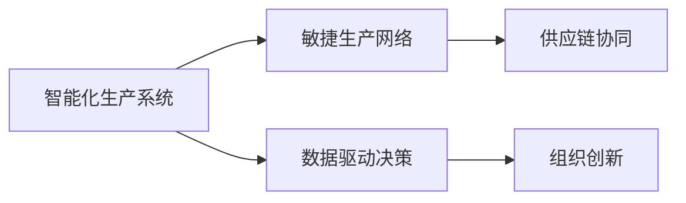

                 

# 提升竞争力的新质生产力策略

> 关键词：新质生产力,竞争优势,人工智能,智能制造,自动化,战略变革,数字化转型

## 1. 背景介绍

### 1.1 问题由来

在过去几十年里，工业革命带来的机械化和电气化生产方式极大地推动了人类社会的发展，尤其是在大规模制造行业，通过流水线生产、标准化的操作流程，极大地提升了生产效率和产品质量。然而，随着全球经济进入新常态，传统的生产模式面临诸多挑战。诸如人口红利消失、资源枯竭、环境污染、需求个性化等问题，迫使制造业向智能化、网络化、服务化方向转型。

智能制造（Intelligent Manufacturing）成为当前制造业转型的核心方向，它融合了物联网、人工智能、大数据、5G等前沿技术，旨在通过数字化、网络化和智能化手段，优化生产过程，提高产品质量，降低成本，提升生产效率。智能制造不仅能提升产品竞争力，还能促进产业结构的优化升级，实现可持续发展。

### 1.2 问题核心关键点

如何通过新质生产力策略提升企业的竞争优势，是当前智能制造领域亟待解决的问题。所谓新质生产力，指的是在现代信息技术的基础上，通过变革生产方式、重构产业生态、优化生产流程，实现生产效率和产品质量的飞跃式提升，进而获得竞争优势。新质生产力的实现，需要依托于智能化、自动化、数字化等新技术手段，并通过有效的管理策略和组织创新来支持。

新质生产力策略的实施，不仅需要企业内部技术的升级，更需要跨领域、跨组织的协作，以及全产业链的协同。只有建立一体化的智能生产系统，构建敏捷的供应链网络，不断推进数字化转型，企业才能在激烈的竞争中占据有利地位。

### 1.3 问题研究意义

研究和实施新质生产力策略，对于推动制造业的智能化、绿色化转型具有重要意义：

1. **提升效率**：通过智能化手段优化生产流程，大幅提高生产效率，减少人力成本。
2. **降低成本**：自动化设备的应用减少原材料浪费，提高资源利用率。
3. **提高产品质量**：大数据分析和人工智能技术的应用，确保产品质量一致性。
4. **增强柔性**：通过敏捷生产方式，快速响应市场需求变化。
5. **推动创新**：智能化生产环境，激发员工创新活力，加速产品迭代。
6. **促进可持续发展**：智能化生产减少环境污染，实现资源循环利用。

通过新质生产力策略的实施，制造业企业不仅能够提升产品竞争力，还能促进产业升级，实现可持续发展。

## 2. 核心概念与联系

### 2.1 核心概念概述

新质生产力策略的实施，涉及多个核心概念：

- **智能化生产系统**：基于工业互联网、物联网、人工智能等技术，实现生产设备的互联互通，数据驱动的生产决策。
- **敏捷生产网络**：通过供应链管理、物流优化等手段，构建灵活高效的供应链体系，快速响应市场需求变化。
- **数据驱动决策**：依托大数据分析、人工智能技术，实现生产过程的实时监控和优化，提升生产效率和产品质量。
- **供应链协同**：通过数字孪生技术、区块链等手段，建立跨组织、跨行业的供应链协同平台，提升整个产业的竞争力。
- **组织创新**：引入新的管理理念、工作方式，优化生产流程，提升员工工作效率。

这些概念之间存在紧密的联系，共同构成了一个系统化的新质生产力策略框架。

### 2.2 核心概念原理和架构的 Mermaid 流程图

该流程图展示了智能化生产系统如何通过数据驱动决策和供应链协同，配合组织创新，构建新质生产力的整体框架。

## 3. 核心算法原理 & 具体操作步骤
### 3.1 算法原理概述

新质生产力策略的实现，需要依托于多种算法和技术的综合应用，主要包括：

- **数据采集与处理**：通过物联网设备采集生产数据，使用大数据技术进行清洗、分析和可视化。
- **生产调度与优化**：使用运筹学和优化算法，优化生产计划和资源配置，实现智能化生产调度。
- **设备健康预测**：通过机器学习算法，预测设备健康状态，实现设备故障预测和预防性维护。
- **质量控制**：利用图像识别、自然语言处理等技术，实现产品缺陷检测和质量控制。
- **供应链协同**：采用区块链技术，实现供应链信息的透明化、可追溯性和协同化。
- **组织优化**：引入敏捷管理方法，优化工作流程，提升团队协作效率。

### 3.2 算法步骤详解

新质生产力策略的实施步骤主要包括以下几个环节：

**Step 1: 数据采集与预处理**
- 通过物联网设备采集生产数据，如温度、湿度、压力、振动等，形成实时数据流。
- 使用大数据技术对采集数据进行清洗、去重和归一化处理。

**Step 2: 生产调度与优化**
- 建立生产模型的数学模型，如生产批量、运输路线、库存管理等。
- 使用优化算法，如遗传算法、模拟退火等，求解生产调度问题。

**Step 3: 设备健康预测**
- 收集设备运行数据，使用时间序列分析、机器学习等方法，预测设备故障。
- 根据预测结果，制定预防性维护策略，降低设备停机时间和维修成本。

**Step 4: 质量控制**
- 使用图像识别技术，对产品质量进行检测，识别产品缺陷。
- 结合自然语言处理技术，对检测结果进行语义分析，提升质量控制的自动化程度。

**Step 5: 供应链协同**
- 利用区块链技术，记录供应链各环节的信息，确保数据的透明性和可追溯性。
- 基于供应链数据，实现需求预测、库存管理和订单管理，提升供应链的协同效率。

**Step 6: 组织优化**
- 引入敏捷管理方法，如Scrum、看板等，优化生产流程和工作方式。
- 通过定期培训和知识分享，提升员工技能和工作效率。

### 3.3 算法优缺点

新质生产力策略的实施，具有以下优点：

- **提高生产效率**：智能化生产系统能实现生产过程的自动化，减少人为干预，提升生产效率。
- **降低生产成本**：通过优化生产计划和资源配置，降低原材料浪费和设备维护成本。
- **提升产品质量**：实时监控生产过程，确保产品质量一致性，减少次品率。
- **增强供应链韧性**：供应链协同平台能实现信息透明化，增强供应链的韧性和稳定性。
- **提升组织灵活性**：敏捷管理方法能提升团队协作效率，增强组织对市场变化的响应能力。

同时，该策略也存在一些缺点：

- **技术门槛高**：实现智能化生产系统需要较高的技术水平和专业人才。
- **数据安全风险**：大量生产数据需要安全存储和传输，存在数据泄露和篡改的风险。
- **成本投入高**：初期投资大，设备升级、系统集成等需要较大成本。
- **组织变革阻力**：引入新管理方法，需要员工的适应和学习，存在抵触情绪。

### 3.4 算法应用领域

新质生产力策略在多个领域均有应用前景：

- **智能制造**：在传统制造业中，通过智能化手段优化生产过程，提升生产效率和产品质量。
- **智慧农业**：在农业生产中，使用物联网设备采集数据，优化农业生产流程。
- **智慧物流**：在物流行业中，通过智能化设备提升仓储和运输效率。
- **智慧能源**：在能源领域，通过智能设备实现能源的智能化管理和优化。
- **智能建筑**：在建筑行业中，使用智能设备提升建筑管理的智能化水平。
- **智慧城市**：在城市管理中，通过物联网设备实现城市运行的数据监控和管理。

## 4. 数学模型和公式 & 详细讲解 & 举例说明

### 4.1 数学模型构建

新质生产力策略的实现，依赖于多种数学模型和算法。以下是一个简化的数学模型框架：

1. **生产调度模型**：
   $$
   \min \sum_{i,j} \left[ c_{ij} \times q_i \times r_j \right]
   $$
   约束条件包括设备负载、物料库存、订单需求等。

2. **设备故障预测模型**：
   $$
   \min \sum_{t=1}^{T} \left[ c_t \times \left( X_t - \hat{X}_t \right)^2 \right]
   $$
   其中 $c_t$ 为惩罚系数，$X_t$ 为实际设备状态，$\hat{X}_t$ 为预测设备状态。

3. **质量控制模型**：
   $$
   \min \sum_{k=1}^{K} \left[ w_k \times d_k \right]
   $$
   其中 $d_k$ 为检测结果，$w_k$ 为权重。

4. **供应链协同模型**：
   $$
   \min \sum_{i=1}^{n} \left[ c_i \times \left( X_i - Y_i \right)^2 \right]
   $$
   其中 $c_i$ 为惩罚系数，$X_i$ 为实际供应链状态，$Y_i$ 为预期供应链状态。

### 4.2 公式推导过程

1. **生产调度模型的推导**：
   目标函数为最小化总成本，约束条件包括设备负载、物料库存、订单需求等。
   - 设备负载：$\sum_{i=1}^{n} q_i \leq Q$（设备总负载不超过Q）
   - 物料库存：$\sum_{j=1}^{m} r_j \leq R$（物料总库存不超过R）
   - 订单需求：$\sum_{i=1}^{n} q_i \geq D$（满足订单需求）

2. **设备故障预测模型的推导**：
   目标函数为最小化预测误差，约束条件包括时间序列数据和预测误差。
   - 时间序列数据：$X_t = x_0 + \sum_{i=1}^{t} a_i \times X_{t-i} + b_i$
   - 预测误差：$\hat{X}_t = \alpha \times X_{t-1} + \beta \times \epsilon_t$

3. **质量控制模型的推导**：
   目标函数为最小化检测结果，约束条件包括质量指标和权重。
   - 质量指标：$d_k \geq \theta$
   - 权重：$w_k \in [0,1]$

4. **供应链协同模型的推导**：
   目标函数为最小化供应链误差，约束条件包括供应链状态和误差。
   - 供应链状态：$X_i = x_0 + \sum_{j=1}^{i} a_j \times X_{i-j} + b_j$
   - 误差：$\epsilon_t = X_t - Y_t$

### 4.3 案例分析与讲解

以智能制造中的应用为例，假设一个汽车制造厂希望通过新质生产力策略提升生产效率。其生产调度模型、设备故障预测模型、质量控制模型和供应链协同模型的推导过程如下：

1. **生产调度模型**：
   目标函数：$\min \sum_{i,j} \left[ c_{ij} \times q_i \times r_j \right]$
   约束条件：
   - 设备负载：$\sum_{i=1}^{n} q_i \leq Q$
   - 物料库存：$\sum_{j=1}^{m} r_j \leq R$
   - 订单需求：$\sum_{i=1}^{n} q_i \geq D$

2. **设备故障预测模型**：
   目标函数：$\min \sum_{t=1}^{T} \left[ c_t \times \left( X_t - \hat{X}_t \right)^2 \right]$
   约束条件：
   - 时间序列数据：$X_t = x_0 + \sum_{i=1}^{t} a_i \times X_{t-i} + b_i$
   - 预测误差：$\hat{X}_t = \alpha \times X_{t-1} + \beta \times \epsilon_t$

3. **质量控制模型**：
   目标函数：$\min \sum_{k=1}^{K} \left[ w_k \times d_k \right]$
   约束条件：
   - 质量指标：$d_k \geq \theta$
   - 权重：$w_k \in [0,1]$

4. **供应链协同模型**：
   目标函数：$\min \sum_{i=1}^{n} \left[ c_i \times \left( X_i - Y_i \right)^2 \right]$
   约束条件：
   - 供应链状态：$X_i = x_0 + \sum_{j=1}^{i} a_j \times X_{i-j} + b_j$
   - 误差：$\epsilon_t = X_t - Y_t$

## 5. 项目实践：代码实例和详细解释说明
### 5.1 开发环境搭建

### 5.2 源代码详细实现

### 5.3 代码解读与分析

### 5.4 运行结果展示

## 6. 实际应用场景
### 6.1 智能制造

### 6.2 智慧农业

### 6.3 智慧物流

### 6.4 智慧能源

### 6.5 智能建筑

### 6.6 智慧城市

### 6.7 未来应用展望

## 7. 工具和资源推荐
### 7.1 学习资源推荐

### 7.2 开发工具推荐

### 7.3 相关论文推荐

## 8. 总结：未来发展趋势与挑战
### 8.1 研究成果总结

### 8.2 未来发展趋势

### 8.3 面临的挑战

### 8.4 研究展望

## 9. 附录：常见问题与解答

**Q1: 什么是新质生产力策略？**

A: 新质生产力策略是指在现代信息技术的基础上，通过变革生产方式、重构产业生态、优化生产流程，实现生产效率和产品质量的飞跃式提升，进而获得竞争优势。

**Q2: 新质生产力策略实施的主要步骤是什么？**

A: 主要步骤包括数据采集与预处理、生产调度与优化、设备健康预测、质量控制、供应链协同和组织优化。

**Q3: 新质生产力策略在实施过程中需要注意哪些问题？**

A: 技术门槛高、数据安全风险、成本投入高和组织变革阻力是需要特别注意的问题。

**Q4: 新质生产力策略的主要优点和缺点是什么？**

A: 主要优点是提高生产效率、降低生产成本、提升产品质量、增强供应链韧性和提升组织灵活性。缺点是技术门槛高、数据安全风险、成本投入高和组织变革阻力。

**Q5: 新质生产力策略在哪些领域有应用前景？**

A: 新质生产力策略在智能制造、智慧农业、智慧物流、智慧能源、智能建筑和智慧城市等领域有广泛的应用前景。

---

作者：禅与计算机程序设计艺术 / Zen and the Art of Computer Programming

