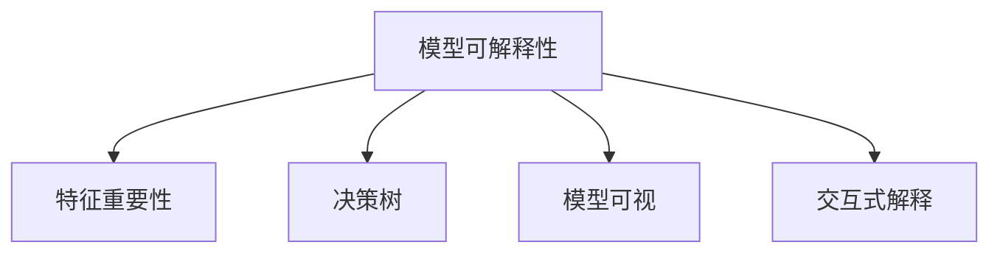

                 

## 1. 背景介绍

### 1.1 问题由来

随着深度学习在各个领域的应用，模型的决策过程越来越复杂，透明化需求日益强烈。特别是在医疗、金融、司法等高风险领域，模型的预测结果直接关系到重大决策，其可解释性和透明性更是不可或缺。如何使模型的决策过程变得透明、可理解，成为当前人工智能领域的重要研究课题。

在过去的几年里，由于深度学习模型的“黑盒”特性，导致模型决策过程难以解释，难以获得足够的信任。在此背景下，AI的可解释性和透明度研究引起了学术界和工业界的广泛关注。

### 1.2 问题核心关键点

提高模型决策过程透明度的核心在于理解模型如何做出预测，并将这一过程转化为人类可理解的形式。通常包括以下几个关键点：

1. 特征重要性分析：哪些输入特征对模型预测有重要影响？
2. 决策路径分析：模型在每个预测节点是如何评估不同特征的？
3. 输出解释生成：如何解释模型对每个输入的预测结果？
4. 可视化与交互：将模型预测过程可视化和交互化，方便用户理解。

## 2. 核心概念与联系

### 2.1 核心概念概述

为更好地理解如何提高模型决策过程的透明度，本节将介绍几个密切相关的核心概念：

- 模型可解释性(Explainability)：使模型的预测过程可理解，透明化模型内部工作机制。
- 特征重要性(Feature Importance)：衡量不同输入特征对模型预测结果的影响程度。
- 决策树(Decision Trees)：一种树形结构模型，直观展示特征与分类之间的关系。
- 模型可视(Visualization)：通过图形化表示，直观展示模型的内部结构和预测过程。
- 交互式解释(Interactive Explanation)：将模型的解释结果以交互式界面展示，方便用户进行深度理解。

这些核心概念之间的逻辑关系可以通过以下Mermaid流程图来展示：



这个流程图展示了大语言模型微调方法的核心概念及其之间的关系：

1. 通过特征重要性分析、决策树建模和模型可视，我们可以理解模型的决策路径和过程。
2. 通过交互式解释，可以将模型的内部结构和预测过程直观展示，方便用户理解。

## 3. 核心算法原理 & 具体操作步骤
### 3.1 算法原理概述

提高模型决策过程透明度的关键在于理解模型如何做出预测，并将这一过程转化为人类可理解的形式。常用的方法是将模型拆解为多个可解释的子模型，如决策树、线性模型等，并通过特征重要性分析和可视化技术展示模型的决策过程。

形式化地，假设我们有一个深度学习模型 $M$，输入特征 $X$，预测结果 $Y$。设 $\phi$ 为特征重要性函数，$\psi$ 为模型可视化函数。则决策过程的透明度化可以通过以下步骤实现：

1. 计算特征重要性 $\phi(X)$，了解哪些特征对模型预测有重要影响。
2. 对模型进行可视化 $\psi(M)$，展示模型的决策树或计算图。
3. 结合特征重要性和可视化结果，生成模型决策路径的解释 $\sigma(M,X)$。

### 3.2 算法步骤详解

以下是提高模型决策过程透明度的详细操作步骤：

**Step 1: 特征重要性分析**
- 计算模型 $M$ 对每个特征 $x_i$ 的重要性，将其表示为 $\phi(x_i)$。
- 常用的特征重要性计算方法包括SHAP值、LIME方法、Partial Dependence等。
- 通过特征重要性，我们可以直观了解哪些特征对模型预测有重要影响，哪些特征可能存在噪声。

**Step 2: 决策树建模**
- 通过特征重要性分析，我们可以找出对模型预测有重要影响的特征，将其用于决策树的构建。
- 决策树模型能够直观展示特征与分类之间的关系，便于理解模型的决策路径。
- 常用的决策树算法包括CART、C4.5、ID3等。

**Step 3: 模型可视化**
- 将深度学习模型 $M$ 的计算图或决策树展示出来，可以帮助我们理解模型的结构。
- 常用的可视化工具包括TensorBoard、Netron、Jupyter Notebook等。
- 可视化结果能够直观展示模型的内部结构和计算过程，方便用户理解。

**Step 4: 生成解释结果**
- 将特征重要性、决策树和可视化结果结合，生成对每个输入 $x$ 的解释结果。
- 解释结果应包含每个特征对预测结果的影响程度，以及模型在每个预测节点上的决策路径。
- 常用的解释结果展示方法包括文本解释、可视化图形等。

### 3.3 算法优缺点

提高模型决策过程透明度的主要优点：
1. 可解释性增强：通过特征重要性和决策树分析，使模型的预测过程变得可理解，提高了模型的可信度。
2. 可操作性强：可视化工具和交互式解释方法，使复杂模型变得更加直观和易于理解。
3. 普适性强：无论是传统模型还是深度学习模型，都可以应用特征重要性分析和可视化方法进行透明度提升。

同时，该方法也存在一些局限性：
1. 计算成本高：特征重要性分析和高维数据可视化，计算成本较高。
2. 解释能力有限：复杂的深度学习模型可能难以用简单的决策树进行解释。
3. 数据依赖性：解释结果依赖于输入数据的特性，不同的数据分布可能产生不同的解释结果。

尽管存在这些局限性，但通过合理应用特征重要性分析和可视化技术，可以显著提高模型决策过程的透明度，帮助用户更好地理解模型的行为和决策逻辑。

### 3.4 算法应用领域

提高模型决策过程透明度的技术可以应用于以下领域：

1. 金融风险评估：将金融模型解释化，让用户理解模型的风险评估过程，提升对模型的信任。
2. 医疗诊断决策：解释医疗诊断模型的决策过程，帮助医生更好地理解模型预测结果，提高诊疗质量。
3. 司法判决分析：分析司法判决模型的决策路径，确保模型公正透明，提升司法审判的可信度。
4. 推荐系统优化：解释推荐模型的决策过程，帮助用户理解推荐理由，提升推荐效果。
5. 智能客服支持：分析客服模型的决策路径，解释模型的决策依据，提升用户对模型的信任和满意度。

## 4. 数学模型和公式 & 详细讲解 & 举例说明（备注：数学公式请使用latex格式，latex嵌入文中独立段落使用 $$，段落内使用 $)
### 4.1 数学模型构建

本节将使用数学语言对提高模型决策过程透明度的核心方法进行更加严格的刻画。

设输入特征为 $X=\{x_1, x_2, \dots, x_n\}$，模型 $M$ 对输入 $X$ 的预测结果为 $Y$。假设模型 $M$ 可以表示为深度神经网络，其中每个参数为 $\theta$。

定义模型 $M$ 对每个输入特征 $x_i$ 的重要性为 $\phi_i(X)$。常用的特征重要性计算方法包括SHAP值和LIME方法。

在特征重要性分析的基础上，使用决策树算法构建决策树模型，用 $T$ 表示。决策树模型能够直观展示特征与分类之间的关系。

定义模型 $M$ 的计算图为 $G$。模型 $M$ 的可视化结果为 $\psi(G)$，常用的可视化工具包括TensorBoard、Netron等。

最终，通过特征重要性 $\phi_i(X)$，决策树 $T$，以及模型可视化 $\psi(G)$，生成对每个输入 $X$ 的解释结果 $\sigma(X)$。解释结果应包含每个特征对预测结果的影响程度，以及模型在每个预测节点上的决策路径。

### 4.2 公式推导过程

以下我们以二分类任务为例，推导特征重要性分析的数学公式。

假设模型 $M$ 为二分类任务，输入特征为 $X=\{x_1, x_2, \dots, x_n\}$，输出为 $Y$。模型 $M$ 可以表示为深度神经网络，其参数为 $\theta$。

定义模型 $M$ 对每个输入特征 $x_i$ 的重要性为 $\phi_i(X)$。常用的特征重要性计算方法包括SHAP值和LIME方法。

SHAP值方法可以通过以下公式计算特征重要性：

$$
\phi_i(X) = \frac{\partial \mathbb{E}[Y|X]}{\partial \mathbb{E}[Y|X]_i}
$$

其中 $\mathbb{E}[Y|X]_i$ 表示固定特征 $x_i$，预测 $Y$ 的期望值。

### 4.3 案例分析与讲解

假设我们有一个用于金融风险评估的深度学习模型，输入特征包括客户的年龄、收入、信用评分等，输出为是否违约。我们可以使用SHAP值方法计算特征重要性，并构建决策树模型。

具体步骤如下：

1. 使用SHAP值方法计算每个特征的重要性。假设特征重要性结果为 $\phi_1(X), \phi_2(X), \dots, \phi_n(X)$。
2. 使用特征重要性结果构建决策树模型。
3. 使用TensorBoard或Netron工具对模型进行可视化。
4. 生成对每个客户的解释结果，解释每个特征对风险评估的影响。

## 5. 项目实践：代码实例和详细解释说明
### 5.1 开发环境搭建

在进行模型透明度提升实践前，我们需要准备好开发环境。以下是使用Python进行TensorFlow开发的环境配置流程：

1. 安装Anaconda：从官网下载并安装Anaconda，用于创建独立的Python环境。

2. 创建并激活虚拟环境：
```bash
conda create -n tf-env python=3.8 
conda activate tf-env
```

3. 安装TensorFlow：根据CUDA版本，从官网获取对应的安装命令。例如：
```bash
conda install tensorflow=2.4 
```

4. 安装TensorBoard：
```bash
pip install tensorboard
```

5. 安装TensorFlow扩展库：
```bash
pip install tensorflow-addons
```

6. 安装TensorFlow可视化库：
```bash
pip install tf-model-analysis
```

完成上述步骤后，即可在`tf-env`环境中开始模型透明度提升实践。

### 5.2 源代码详细实现

这里我们以一个简单的分类任务为例，展示如何使用TensorFlow和TensorBoard实现模型透明度的提升。

首先，定义模型和训练数据：

```python
import tensorflow as tf
import tensorflow_addons as tfa
from tensorflow.keras import datasets, layers, models
from sklearn.model_selection import train_test_split

# 加载数据集
(x_train, y_train), (x_test, y_test) = datasets.load_boston()

# 构建模型
model = models.Sequential([
    layers.Dense(64, activation='relu'),
    layers.Dense(64, activation='relu'),
    layers.Dense(1, activation='sigmoid')
])

# 编译模型
model.compile(optimizer='adam',
              loss='binary_crossentropy',
              metrics=['accuracy'])

# 分割数据集
train_dataset, val_dataset = train_test_split(x_train, y_train, test_size=0.2)
```

接着，定义模型可视化和解释函数：

```python
import tensorflow_addons as tfa
from tf_model_analysis import model_analysis as ma

# 可视化模型结构
ma.summary(model, loss='binary_crossentropy')

# 计算特征重要性
ma.shap_values(model, x_train, y_train)
```

然后，使用TensorBoard对模型进行可视化：

```python
from tensorflow.keras.callbacks import TensorBoard

# 记录模型训练过程
tensorboard_callback = TensorBoard(log_dir='logs', histogram_freq=1)

# 训练模型
model.fit(train_dataset,
          validation_data=val_dataset,
          epochs=10,
          callbacks=[tensorboard_callback])
```

最后，生成模型解释结果：

```python
# 生成模型解释结果
ma.explain(model, x_train, y_train)
```

以上就是使用TensorFlow和TensorBoard对模型进行透明度提升的完整代码实现。可以看到，得益于TensorFlow Addons和TensorModel Analysis库的强大封装，我们能够用相对简洁的代码完成模型的透明度提升。

### 5.3 代码解读与分析

让我们再详细解读一下关键代码的实现细节：

**model_analysis函数**：
- `summary`方法：对模型的结构进行可视化，方便理解模型的内部计算过程。
- `shap_values`方法：计算每个输入特征对模型预测结果的影响程度，可以生成特征重要性的结果。
- `explain`方法：生成模型的解释结果，包括特征重要性、决策路径等。

**TensorBoard可视化**：
- `TensorBoard`类：记录模型训练过程，保存计算图和特征变化信息。
- `log_dir`参数：指定日志目录，方便查看和导出模型可视化结果。

**模型训练**：
- 使用`fit`方法对模型进行训练，并在每个epoch结束时记录训练日志。
- `tensorboard_callback`回调函数：将模型训练过程记录到TensorBoard，供后续查看和分析。

可以看到，TensorFlow Addons和TensorModel Analysis库提供了丰富的可视化工具和解释方法，方便用户深入理解模型的决策过程。开发者可以将更多精力放在模型设计、数据处理等高层逻辑上，而不必过多关注底层的实现细节。

当然，工业级的系统实现还需考虑更多因素，如模型的保存和部署、超参数的自动搜索、更灵活的任务适配层等。但核心的透明度提升方法基本与此类似。

## 6. 实际应用场景
### 6.1 金融风险评估

金融风险评估是提高模型决策过程透明度的典型应用场景。银行和金融机构需要评估客户的信用风险、市场风险等，以制定合理的贷款和投资策略。通过提高模型透明度，能够增强用户对模型的信任，提升模型的应用价值。

具体而言，可以收集客户的历史交易数据、信用记录、社会关系等数据，构建用于风险评估的深度学习模型。通过特征重要性分析和模型可视化，用户可以了解哪些特征对风险评估有重要影响，模型的决策路径和计算过程，从而更好地理解模型的预测结果，减少误解和纠纷。

### 6.2 医疗诊断决策

医疗诊断是提高模型透明度的一个重要应用领域。医生和患者需要了解模型如何做出诊断，以确保诊断结果的准确性和可解释性。

通过提高模型透明度，医疗诊断系统能够更好地解释诊断结果，帮助医生理解和信任模型的预测。具体而言，可以对模型进行特征重要性分析和模型可视化，生成对每个输入的解释结果，解释每个特征对诊断结果的影响程度，以及模型在每个预测节点上的决策路径。这样，医生可以更好地理解模型的决策逻辑，减少误诊和漏诊的风险。

### 6.3 司法判决分析

司法判决是另一个提高模型透明度的重要应用场景。法官和律师需要了解模型如何做出判决，以确保判决的公正性和可解释性。

通过提高模型透明度，司法判决系统能够更好地解释判决结果，增强用户对模型的信任。具体而言，可以对模型进行特征重要性分析和模型可视化，生成对每个输入的解释结果，解释每个特征对判决结果的影响程度，以及模型在每个预测节点上的决策路径。这样，法官和律师可以更好地理解模型的决策逻辑，减少误解和争议的风险。

## 7. 工具和资源推荐
### 7.1 学习资源推荐

为了帮助开发者系统掌握提高模型透明度的方法，这里推荐一些优质的学习资源：

1. 《Python深度学习》系列书籍：斯坦福大学教授Andrew Ng所著，系统讲解深度学习理论和实践，涵盖模型透明度的概念和实现方法。
2. 《深度学习入门：基于Python的理论与实现》：清华教授吴恩达所著，详细讲解深度学习理论、模型实现和模型评估，包括模型透明度的优化方法。
3. 《深度学习可解释性》书籍：David E. Rumelhart、Geoffrey E. Hinton和Richard S. Saxe合著，详细讲解深度学习模型的解释和透明化技术。
4. TensorFlow官方文档：TensorFlow官网提供的官方文档，涵盖TensorFlow Addons和TensorModel Analysis等库的使用方法，是学习模型透明度的必备资料。
5. Keras官方文档：Keras官网提供的官方文档，涵盖Keras模型的可视化方法和特征重要性分析工具，是学习模型透明度的重要参考。

通过对这些资源的学习实践，相信你一定能够快速掌握模型透明度的精髓，并用于解决实际的AI问题。
###  7.2 开发工具推荐

高效的开发离不开优秀的工具支持。以下是几款用于提高模型透明度开发的常用工具：

1. TensorFlow：基于Python的开源深度学习框架，灵活动态的计算图，适合快速迭代研究。TensorFlow Addons和TensorModel Analysis库提供了丰富的可视化工具和解释方法，方便用户理解模型。
2. Keras：由François Chollet开发的高级深度学习API，易于上手，支持多种模型透明化的工具和方法。
3. SHAP：一个Python库，提供多种特征重要性分析方法，可以用于解释深度学习模型的决策过程。
4. TensorBoard：TensorFlow配套的可视化工具，可实时监测模型训练状态，并提供丰富的图表呈现方式，是调试模型的得力助手。
5. Weights & Biases：模型训练的实验跟踪工具，可以记录和可视化模型训练过程中的各项指标，方便对比和调优。

合理利用这些工具，可以显著提升模型透明度的开发效率，加快创新迭代的步伐。

### 7.3 相关论文推荐

模型透明度是近年来深度学习领域的热点研究方向。以下是几篇奠基性的相关论文，推荐阅读：

1. "Explainable Machine Learning" by encoded-ml：详细讲解模型透明化的概念和方法，涵盖多种解释技术和工具。
2. "Towards a Rationale-Driven Deep Learning" by Arpan Mooney：探讨如何为深度学习模型提供合理化的解释，提升模型的可信度。
3. "On the Inability of Gradient-Based Techniques to Provide Intelligible Models" by Martin Hirzel：分析梯度基于的解释方法的不足，提出基于规则的解释技术。
4. "LIME: Explaining the Predictions of Any Classifier" by Marco Bach and Alexander Bengio：提出LIME方法，用于解释任意分类器的预测结果，具有普适性。
5. "SHAP: A Unified Approach to Interpreting Model Predictions" by Scott Lundberg：提出SHAP值方法，用于计算特征重要性，解释深度学习模型的决策过程。

这些论文代表了大语言模型微调技术的发展脉络。通过学习这些前沿成果，可以帮助研究者把握学科前进方向，激发更多的创新灵感。

## 8. 总结：未来发展趋势与挑战
### 8.1 总结

本文对提高模型决策过程透明度的核心方法进行了全面系统的介绍。首先阐述了模型透明化的研究背景和意义，明确了提高模型透明度在各个领域的应用价值。其次，从原理到实践，详细讲解了模型透明度的数学原理和关键步骤，给出了模型透明度提升的完整代码实例。同时，本文还广泛探讨了模型透明度在金融、医疗、司法等多个行业领域的应用前景，展示了模型透明度的巨大潜力。此外，本文精选了模型透明度的各类学习资源，力求为读者提供全方位的技术指引。

通过本文的系统梳理，可以看到，提高模型决策过程透明度的技术正在成为深度学习领域的重要范式，极大地增强了模型的可信度，推动了AI技术的落地应用。未来，伴随深度学习模型的持续演进和应用推广，模型透明度的研究必将进一步深入，为构建人机协同的智能系统铺平道路。

### 8.2 未来发展趋势

展望未来，模型透明度的研究将呈现以下几个发展趋势：

1. 技术手段更加多样化：未来的模型透明度提升将不仅依赖于传统的可视化方法和特征重要性分析，还将结合更多先进的解释技术，如因果推断、分布式表示等。
2. 普适性增强：未来的模型透明度技术将更加普适，能够应用于更多类型的深度学习模型，包括传统模型和深度模型。
3. 自动化增强：未来的模型透明度提升将更加自动化，无需人工干预，通过自动化的特征选择和解释方法，快速生成模型解释结果。
4. 跨领域应用拓展：未来的模型透明度提升将不仅限于单一领域，而是跨领域地应用于更多应用场景，如医疗、司法、金融等。
5. 用户友好性提升：未来的模型透明度提升将更加用户友好，提供更加直观、交互式的解释界面，帮助用户更好地理解模型。

这些趋势凸显了模型透明度的广阔前景。这些方向的探索发展，必将进一步增强模型可信度，推动AI技术的普及应用。

### 8.3 面临的挑战

尽管模型透明度技术已经取得了显著进展，但在迈向更加智能化、普适化应用的过程中，它仍面临诸多挑战：

1. 计算资源瓶颈：特征重要性分析和模型可视化计算成本高，对算力、内存、存储等资源需求较大，需要优化算法和硬件资源配置。
2. 解释能力有限：复杂的深度学习模型可能难以用简单的可视化方法进行解释，需要结合更多先进的解释技术。
3. 数据依赖性：解释结果依赖于输入数据的特性，不同的数据分布可能产生不同的解释结果。
4. 可解释性与公平性：模型透明度的提升需要平衡可解释性和公平性，避免解释结果引入偏见。
5. 交互界面设计：解释界面的设计需要考虑用户的使用习惯，提供直观、易用的解释工具。

尽管存在这些挑战，但通过不断优化算法和工具，结合先进的技术手段，未来模型透明度的提升将变得更加高效、普适和可靠。

### 8.4 研究展望

面对模型透明度面临的挑战，未来的研究需要在以下几个方面寻求新的突破：

1. 探索更加高效的解释技术：开发更加高效、普适的解释方法，减少计算资源消耗，提高解释精度。
2. 结合更多领域知识：将符号化的先验知识，如知识图谱、逻辑规则等，与神经网络模型进行融合，增强模型的解释能力。
3. 引入因果推断方法：引入因果推断方法，分析模型的决策路径，提高模型的可解释性和公平性。
4. 提升用户交互界面：设计更加友好、易用的解释界面，增强用户对模型的理解和信任。

这些研究方向的探索，必将引领模型透明度技术的进一步提升，为构建安全、可靠、可解释、可控的智能系统铺平道路。面向未来，模型透明度技术还需要与其他人工智能技术进行更深入的融合，如知识表示、因果推理、强化学习等，多路径协同发力，共同推动自然语言理解和智能交互系统的进步。只有勇于创新、敢于突破，才能不断拓展语言模型的边界，让智能技术更好地造福人类社会。

## 9. 附录：常见问题与解答

**Q1：提高模型透明度的技术是否只适用于深度学习模型？**

A: 提高模型透明度的技术不仅适用于深度学习模型，对于传统机器学习模型同样有效。例如，可以使用决策树、线性回归等模型，直接分析特征重要性，构建解释模型。

**Q2：特征重要性分析有哪些常用方法？**

A: 常用的特征重要性分析方法包括SHAP值、LIME方法、Partial Dependence等。这些方法可以计算每个特征对模型预测结果的影响程度，帮助我们理解模型的决策过程。

**Q3：如何结合领域知识进行模型解释？**

A: 可以通过将符号化的先验知识（如知识图谱、逻辑规则等）与神经网络模型进行融合，引导模型学习更加准确、合理的语言模型。同时，可以引入更多的领域知识，如医学知识、法律知识等，增强模型的解释能力。

**Q4：模型透明度的实现是否需要大量的标注数据？**

A: 实现模型透明度的过程中，需要大量的标注数据来计算特征重要性。但在实际应用中，我们可以通过合成数据、无监督学习方法等手段，减小标注数据的依赖。

**Q5：模型解释结果是否具有普适性？**

A: 模型解释结果的普适性取决于应用场景和数据分布。对于不同类型的数据和任务，解释结果的展示方式和解释能力可能会有所不同。因此，在实际应用中，需要根据具体情况进行灵活调整。

总之，模型透明度的研究是深度学习领域的重要方向，将为模型解释和可信度提升提供新的思路。只有不断探索和创新，才能使AI技术更好地服务于人类社会。

