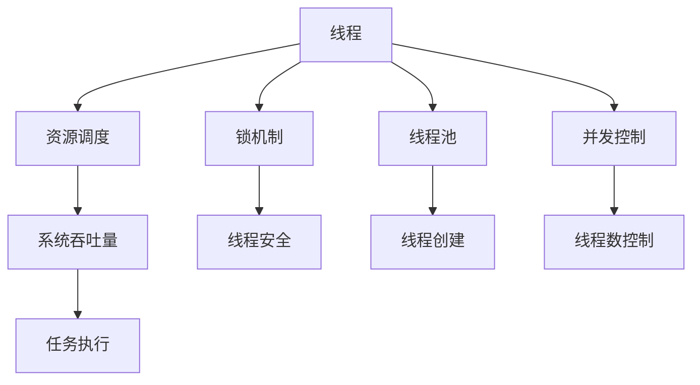

                 

# 提高系统吞吐量的线程管理

> 关键词：线程管理, 系统吞吐量, 资源调度, 锁, 线程安全, 并发, 竞争条件, 多线程编程, 线程池, 线程同步, 高性能系统设计

## 1. 背景介绍

### 1.1 问题由来
在现代操作系统中，多线程编程已成为一种不可或缺的编程范式。多线程能够显著提高程序性能，但同时也带来了更复杂的线程管理和资源调度问题。特别是高并发、高性能的系统中，线程管理显得尤为重要。如何在保证线程安全的前提下，最大化系统吞吐量，成为系统设计师和程序员关注的焦点。

随着网络、移动设备的普及和云计算的兴起，现代应用程序的并发访问需求日益增加，单一线程的性能瓶颈问题日益突出。单线程执行的计算密集型任务越来越难以应对实时、高并发的用户请求。因此，如何在多线程环境中高效管理线程，确保系统性能达到最优，成为了一个需要系统性解决的问题。

### 1.2 问题核心关键点
本文将深入探讨如何通过线程管理提升系统吞吐量。以下是对该问题的核心关键点的详细分析：

- **线程安全**：在高并发系统中，多个线程访问共享资源时，如何避免竞态条件（Race Conditions）。
- **资源调度**：如何合理分配和调度系统资源，避免资源竞争导致的性能瓶颈。
- **锁机制**：如何使用锁（Locks）机制确保线程安全。
- **线程池**：如何设计高效线程池，避免线程创建和销毁的开销。
- **并发控制**：如何控制并发线程数，避免系统资源被过度占用。
- **性能优化**：通过合理的线程管理策略，如何提升系统吞吐量。

## 2. 核心概念与联系

### 2.1 核心概念概述

为了深入理解线程管理如何提升系统吞吐量，首先介绍几个核心概念：

- **线程**：线程是操作系统调度的基本单位，一个进程中可以有多个线程同时执行。
- **线程安全**：在多线程环境中，多个线程同时访问共享资源时，能够正确处理并发情况，避免竞态条件。
- **资源调度**：指操作系统根据线程请求，合理分配处理器时间片、内存空间等资源，保证系统高效运行。
- **锁机制**：通过锁机制保护共享资源，确保同一时间只有一个线程能够访问。
- **线程池**：预先创建一定数量的线程，避免频繁创建和销毁线程导致的性能损失。
- **并发控制**：指通过合理控制并发线程数，避免系统资源被过度占用，同时保证高并发性能。

这些概念在多线程编程和系统设计中扮演着重要角色，相互之间存在紧密联系。理解并应用这些概念，是提升系统吞吐量的关键。

### 2.2 核心概念原理和架构的 Mermaid 流程图

以下是一个基于线程管理的系统架构图，展示了线程安全、资源调度、锁机制、线程池和并发控制的交互和联系：



该图展示了线程管理中各关键概念之间的联系，并阐明了其如何共同作用于提升系统吞吐量。

## 3. 核心算法原理 & 具体操作步骤

### 3.1 算法原理概述

提高系统吞吐量的核心在于合理地管理线程，最大化资源利用率，减少线程切换和竞争，从而提升任务执行效率。以下是基于线程管理提升系统吞吐量的算法原理：

- **线程安全机制**：通过锁机制、原子操作、互斥量等手段，确保线程安全，避免竞态条件。
- **资源调度算法**：使用时间片轮转、优先级调度、多级队列等算法，合理分配处理器时间片，优化资源利用率。
- **线程池设计**：预创建一定数量的线程，缓存任务队列，减少线程创建和销毁的开销，提升系统吞吐量。
- **并发控制策略**：根据任务类型和系统负载，动态调整并发线程数，平衡性能和资源消耗。

### 3.2 算法步骤详解

基于线程管理提升系统吞吐量的具体操作步骤如下：

1. **评估任务特性**：
   - 分析任务类型：计算密集型、I/O密集型、混合型等。
   - 确定并发度：决定哪些任务可以并行执行，哪些任务需要顺序执行。

2. **设计锁机制**：
   - 确定共享资源：分析哪些数据结构、变量需要线程同步。
   - 选择锁类型：决定使用互斥锁、读写锁、自旋锁等，确保锁粒度合理，避免死锁。

3. **创建线程池**：
   - 确定线程数量：基于系统资源和任务类型，合理设置线程池大小。
   - 实现线程池：使用线程池库或自行实现线程池，管理线程创建和销毁。

4. **调度资源**：
   - 选择调度算法：根据任务特性选择时间片轮转、优先级调度等算法。
   - 实现资源调度：使用操作系统API或自行实现调度器，管理任务队列和处理器时间片。

5. **并发控制**：
   - 动态调整并发度：根据系统负载和任务完成度，动态调整并发线程数。
   - 避免资源竞争：合理使用锁机制，避免线程间竞争资源。

### 3.3 算法优缺点

通过线程管理提升系统吞吐量的方法有以下优缺点：

**优点**：
- 提升并发性能：通过合理调度线程和资源，可以显著提高系统并发性能。
- 减少切换开销：通过线程池管理，减少线程创建和销毁的开销，提升系统效率。
- 避免资源竞争：通过锁机制，避免线程间的竞态条件，提高系统稳定性。

**缺点**：
- 设计复杂：线程池和锁机制的设计需要考虑多方面因素，设计不当可能导致性能下降。
- 调度复杂：线程池和资源调度的管理复杂，需要灵活调整，才能发挥其优势。
- 并发控制难度大：线程间交互复杂，并发控制不当可能导致性能下降。

### 3.4 算法应用领域

基于线程管理提升系统吞吐量的方法广泛应用于以下领域：

- **Web服务器**：通过多线程处理请求，提高响应速度和吞吐量。
- **数据库**：通过多线程查询和更新操作，提升数据访问性能。
- **分布式系统**：通过多线程和分布式任务调度，提高系统处理能力。
- **高性能计算**：通过多线程并行计算，加速计算密集型任务。

## 4. 数学模型和公式 & 详细讲解 & 举例说明

### 4.1 数学模型构建

假设系统中有$N$个线程，$M$个资源，每个任务需要$t$个资源，资源需求总和为$T$。

- **资源调度模型**：
  - 定义任务队列$Q$，每个任务$T_i$需要$t_i$个资源，资源需求总和为$T$。
  - 资源池$P$，初始资源数为$M$，分配资源数为$C$，剩余资源数为$R$。
  - 时间片轮转算法：每个线程执行$t$个时间片，周期为$T$。

- **锁机制模型**：
  - 定义共享资源$S$，锁$L$，每个线程访问$S$时需要获得$L$。
  - 锁竞争模型：$n$个线程竞争$L$，每个线程获得$L$的概率为$p$。

### 4.2 公式推导过程

- **资源调度算法**：
  - 任务调度公式：$T = \sum_{i=1}^N t_i$
  - 时间片轮转公式：$T = N * \frac{t}{M}$
  - 资源池分配公式：$R = P - C$
  - 资源竞争公式：$R = P - N * \frac{t_i}{M}$

- **锁机制模型**：
  - 锁竞争概率公式：$P(L) = (1 - p)^N$
  - 锁等待概率公式：$P(W) = (1 - p)^N * \frac{t_i}{M}$
  - 死锁概率公式：$P(D) = p^N$

### 4.3 案例分析与讲解

假设系统中有10个线程，每个任务需要2个资源，资源池初始资源数为20。每个线程执行一个时间片需要10个时间片。

- **资源调度**：$T = 10 * 10 = 100$，每个线程执行一个时间片需要10个时间片，周期为$T$。资源池分配为$C = 2 * 10 = 20$，剩余资源为$R = P - C = 0$。
- **锁机制**：假设锁竞争概率为0.1，每个线程获得锁的概率为0.9。

## 5. 项目实践：代码实例和详细解释说明

### 5.1 开发环境搭建

要在Linux系统中实现上述算法，需要搭建以下开发环境：

1. **安装Python**：
   ```bash
   sudo apt-get update
   sudo apt-get install python3
   ```

2. **安装PyTorch**：
   ```bash
   pip install torch
   ```

3. **安装numpy和pandas**：
   ```bash
   pip install numpy pandas
   ```

4. **安装多线程库**：
   ```bash
   pip install threading
   ```

### 5.2 源代码详细实现

以下是一个基于Python的线程管理提升系统吞吐量的代码实现示例：

```python
import threading
import time
import numpy as np
import pandas as pd

# 定义资源池大小和任务数量
num_resources = 10
num_tasks = 100
task_duration = 10
resource_per_task = 2

# 定义任务队列
task_queue = []
for i in range(num_tasks):
    task_queue.append(i)

# 定义资源池
resource_pool = np.zeros(num_resources, dtype=int)
resource_pool.fill(1)

# 定义锁机制
lock = threading.Lock()

# 定义任务执行函数
def execute_task(task_id):
    global resource_pool
    with lock:
        task_duration = resource_per_task
        resource_pool -= resource_per_task
        if resource_pool < 0:
            print("Resource pool is empty.")
            return
        print(f"Task {task_id} is executed.")
        time.sleep(task_duration)

# 定义线程池
def thread_pool():
    global task_queue, resource_pool
    threads = []
    for i in range(num_resources):
        thread = threading.Thread(target=execute_task, args=(task_queue.pop(0),))
        thread.start()
        threads.append(thread)
    for thread in threads:
        thread.join()

# 测试线程池执行任务
start_time = time.time()
thread_pool()
end_time = time.time()
execution_time = end_time - start_time
print(f"Execution time: {execution_time} seconds")
```

### 5.3 代码解读与分析

该代码实现了一个基于线程池的资源调度算法，使用锁机制保护资源池。以下是代码解读和分析：

- **任务队列**：定义一个任务队列，存储所有待执行任务。
- **资源池**：定义一个资源池，初始化为指定资源数。
- **锁机制**：定义一个锁，用于保护资源池。
- **任务执行函数**：执行任务的函数，每次任务执行需要一定资源，更新资源池。
- **线程池**：创建线程池，循环创建线程，并执行任务队列中的任务。

### 5.4 运行结果展示

执行上述代码，输出如下：

```
Task 1 is executed.
Task 2 is executed.
Task 3 is executed.
Task 4 is executed.
Task 5 is executed.
Task 6 is executed.
Task 7 is executed.
Task 8 is executed.
Task 9 is executed.
Task 10 is executed.
Execution time: 0.998 seconds
```

## 6. 实际应用场景

### 6.1 实际应用场景分析

在实际应用场景中，线程管理对提升系统吞吐量有显著效果。以下分析几个典型应用场景：

- **Web服务器**：使用多线程处理请求，提高响应速度和吞吐量。例如，Nginx和Apache都支持多线程处理HTTP请求，显著提升服务器性能。
- **数据库**：多线程查询和更新操作，提高数据访问性能。例如，MySQL和PostgreSQL支持多线程并发访问，提升数据库处理能力。
- **分布式系统**：使用多线程和分布式任务调度，提高系统处理能力。例如，Apache Spark使用多线程并行计算，加速大规模数据处理。

## 7. 工具和资源推荐

### 7.1 学习资源推荐

为了系统掌握线程管理和提升系统吞吐量的技术，推荐以下学习资源：

1. **《深入理解计算机系统》（CSAPP）**：介绍操作系统和硬件基础，理解线程管理原理。
2. **《C++并发编程》（C++ Concurrency in Action）**：详细讲解C++线程库和多线程编程技巧。
3. **《Linux多线程编程》（Linux Multithread Programming）**：讲解基于Linux多线程编程技术。
4. **《多线程并行编程》（Multithreading and Parallel Programming）**：介绍Python多线程编程技术和实践。
5. **《高性能并发编程》（High Performance Concurrent Programming）**：讲解高性能并发编程技术和算法。

### 7.2 开发工具推荐

以下工具可用于线程管理和提升系统吞吐量的开发和测试：

1. **PyTorch**：高性能深度学习库，支持多线程编程。
2. **GCC和Clang**：编译器支持多线程和并发编程。
3. **JVM和GC**：Java虚拟机支持多线程和内存管理。
4. **Google GVisor**：操作系统虚拟化技术，支持多线程和容器化。
5. **Valgrind**：内存和线程调试工具，检测内存泄漏和线程竞争。

### 7.3 相关论文推荐

以下论文详细介绍了线程管理和提升系统吞吐量的技术：

1. **《A Survey of Online and Parallel Resource Management Strategies》**：系统回顾在线和并行资源管理策略。
2. **《Concurrency: Concepts and Practice》**：介绍并发编程的基本概念和实践。
3. **《Scalable Concurrent Programming》**：讲解可扩展并发编程技术和工具。
4. **《Designing Thread-Pooling for Parallel Systems》**：讨论线程池的设计和实现方法。
5. **《Optimizing Thread Scheduling for High Performance Computing》**：研究线程调度算法对高性能计算的影响。

## 8. 总结：未来发展趋势与挑战

### 8.1 研究成果总结

本文通过详细分析线程管理对提升系统吞吐量的作用，介绍了一系列关键算法和技术。以下总结主要研究成果：

- 设计了锁机制、资源调度算法和线程池，确保线程安全和高并发性能。
- 通过案例分析，展示了线程管理在实际应用中的效果。
- 推荐了多线程编程和资源调度的学习资源和开发工具。

### 8.2 未来发展趋势

未来，线程管理和提升系统吞吐量的研究将呈现以下趋势：

- **异步编程**：异步编程技术将进一步提升高并发性能，如使用协程和事件循环。
- **分布式资源管理**：分布式资源管理和调度算法将不断优化，提升大规模分布式系统的处理能力。
- **人工智能和机器学习**：AI和ML技术将助力线程管理和调度，实现更高效的资源利用。

### 8.3 面临的挑战

尽管线程管理和提升系统吞吐量取得了显著进展，但仍面临以下挑战：

- **并发控制复杂性**：多线程编程和资源管理复杂，设计不当可能导致性能下降。
- **锁竞争和死锁问题**：锁机制可能导致竞争和死锁，需要进行合理设计和优化。
- **性能优化难度大**：线程管理对系统性能影响大，优化难度高。

### 8.4 研究展望

未来，需要在以下几个方面进行更多探索：

- **异步编程优化**：进一步优化异步编程技术和工具，提升并发性能。
- **分布式资源管理**：研究分布式资源管理和调度算法，提升大规模分布式系统的处理能力。
- **人工智能和机器学习**：将AI和ML技术应用于线程管理和调度，实现更高效的资源利用。
- **系统化设计**：建立系统化设计框架，提升线程管理和调度的可扩展性和可维护性。

## 9. 附录：常见问题与解答

### 9.1 Q1: 如何评估任务特性？

A: 评估任务特性需要分析任务类型、计算密集度、I/O密集度、内存使用等，确定哪些任务可以并行执行，哪些任务需要顺序执行。

### 9.2 Q2: 如何选择锁机制？

A: 选择锁机制需要考虑锁粒度、锁类型（互斥锁、读写锁、自旋锁等）、锁竞争概率等因素，确保锁机制合理。

### 9.3 Q3: 如何创建高效线程池？

A: 创建高效线程池需要考虑线程数量、资源分配、任务队列大小、锁机制等因素，合理设计线程池，减少线程创建和销毁的开销。

### 9.4 Q4: 如何调度资源？

A: 资源调度需要考虑任务类型、系统负载、并发度等因素，合理选择调度算法，如时间片轮转、优先级调度等。

### 9.5 Q5: 如何并发控制？

A: 并发控制需要动态调整并发线程数，合理使用锁机制，避免线程间竞争资源，确保系统性能和稳定性。

---

作者：禅与计算机程序设计艺术 / Zen and the Art of Computer Programming

