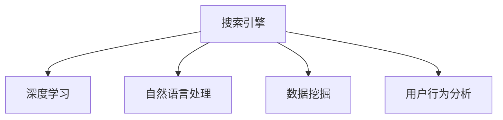

                 

# 搜索数据分析：AI提供深度洞察

> 关键词：搜索引擎,数据分析,人工智能,深度学习,自然语言处理,数据挖掘,用户行为分析

## 1. 背景介绍

### 1.1 问题由来

在互联网时代，信息量呈爆炸式增长，用户越来越多地依赖搜索引擎来获取所需信息。搜索引擎已经从简单的关键词匹配，发展成为支持复杂查询的智能平台。但搜索效果如何评估，搜索数据如何深度分析，这些问题仍然困扰着搜索引擎团队。人工智能（AI）技术的引入，为这些问题提供了新的解决方案。

### 1.2 问题核心关键点

搜索引擎的核心是网页排序，即在大量网页中，根据用户查询意图，选出最相关的结果。传统的排序算法基于网页的关键词匹配度，缺乏对网页内容的深度理解。AI技术的引入，特别是深度学习和自然语言处理（NLP）技术的应用，使得搜索引擎能够理解网页的语义，识别用户的意图，从而提供更加精准的结果。

## 2. 核心概念与联系

### 2.1 核心概念概述

为更好地理解搜索引擎中的AI应用，本节将介绍几个密切相关的核心概念：

- 搜索引擎：通过爬虫抓取和存储网页内容，再根据用户查询，动态检索并排序，返回相关网页的系统。
- 深度学习：通过多层神经网络结构，从大量数据中学习高级特征，实现模式识别和预测。
- 自然语言处理：处理和理解人类语言，包括分词、词性标注、命名实体识别、句法分析、语义理解等任务。
- 数据挖掘：从海量数据中发现隐藏的模式和知识，如关联规则、分类、聚类等。
- 用户行为分析：通过对用户搜索行为的数据分析，理解用户的兴趣和需求，提供个性化服务。

这些核心概念之间的逻辑关系可以通过以下Mermaid流程图来展示：



这个流程图展示了大语言模型的核心概念及其之间的关系：

1. 搜索引擎通过深度学习和自然语言处理技术，理解网页和用户的语义。
2. 数据挖掘用于从海量的搜索数据中发现规律和模式，帮助搜索引擎优化排序算法。
3. 用户行为分析帮助搜索引擎了解用户偏好，个性化推荐搜索结果。

## 3. 核心算法原理 & 具体操作步骤
### 3.1 算法原理概述

搜索引擎中的AI应用，主要是利用深度学习模型，理解网页和用户的语义，从而提供更加精准的结果。具体而言，包括以下几个关键步骤：

**Step 1: 网页表示学习**

深度学习模型通过对网页进行编码，将文本转换为向量表示。常用的方法包括word2vec、GloVe、BERT等。这些模型通过学习词汇间的语义关系，构建高维向量空间，使得相似的概念在向量空间中距离较近。

**Step 2: 用户查询理解**

深度学习模型通过对用户查询进行编码，学习用户意图。常用的方法包括CNN、RNN、Transformer等。这些模型通过理解查询的语义，将用户需求映射到向量空间。

**Step 3: 网页与查询匹配**

深度学习模型通过计算查询向量和网页向量之间的距离（如余弦相似度），找出最相关的网页。常用的方法包括点积相似度、softmax分类器等。

**Step 4: 结果排序**

深度学习模型通过训练排序算法，将相关性最高的网页排在前面。常用的方法包括CTC、RNN、Transformer等。这些模型通过学习排序规律，提升搜索结果的准确性。

### 3.2 算法步骤详解

基于深度学习的大规模搜索引擎中的AI应用，一般包括以下几个关键步骤：

**Step 1: 准备数据集**

- 收集大量的网页和用户查询数据，作为训练数据。
- 对网页进行预处理，包括分词、去除停用词、构建词汇表等。
- 对用户查询进行预处理，包括分词、去除停用词、词性标注等。

**Step 2: 设计模型**

- 选择合适的深度学习模型，如BERT、Transformer等。
- 设计合适的模型结构，包括编码器、解码器、注意力机制等。
- 确定模型的超参数，如学习率、批大小、迭代轮数等。

**Step 3: 训练模型**

- 使用训练数据对模型进行训练，最小化损失函数。
- 使用验证数据对模型进行调参，避免过拟合。
- 使用测试数据对模型进行评估，计算准确率和召回率等指标。

**Step 4: 部署模型**

- 将训练好的模型部署到搜索引擎的服务器上。
- 根据用户查询，实时计算查询向量和网页向量之间的距离。
- 根据距离排序，返回最相关的网页。

### 3.3 算法优缺点

基于深度学习的搜索引擎AI应用，具有以下优点：

- 深度学习模型能够理解复杂的语义信息，提升搜索结果的相关性。
- 通过学习用户意图，提供个性化的搜索结果，提升用户体验。
- 可以自动优化排序算法，提高搜索结果的准确性和及时性。

同时，该方法也存在一定的局限性：

- 需要大量标注数据进行预训练，标注成本较高。
- 模型复杂度高，训练和推理效率较低。
- 模型的泛化能力受训练数据的影响较大，可能存在数据偏见。
- 模型的可解释性不足，难以理解模型的决策过程。

尽管存在这些局限性，但就目前而言，深度学习在搜索引擎中的应用仍然是最主流范式。未来相关研究的重点在于如何进一步降低模型的复杂度，提高其泛化能力，同时兼顾可解释性和效率等因素。

### 3.4 算法应用领域

基于深度学习的搜索引擎AI应用，已经在信息检索、个性化推荐、搜索广告、社交媒体等多个领域得到了广泛的应用，为互联网用户提供了更加智能、高效的服务。

**信息检索**

深度学习模型可以学习网页的语义信息，提升搜索结果的相关性。通过在网页上应用BERT等模型，搜索引擎可以识别出网页的主题和内容，并提供更加精准的检索结果。

**个性化推荐**

深度学习模型可以理解用户的搜索行为和偏好，提供个性化的搜索结果和推荐。通过在用户历史查询和点击数据上应用神经网络模型，搜索引擎可以预测用户的兴趣，提供个性化的搜索结果和推荐。

**搜索广告**

深度学习模型可以识别出用户对不同广告的兴趣程度，优化广告投放策略。通过在广告点击数据上应用神经网络模型，搜索引擎可以学习广告的点击规律，优化广告投放策略，提升广告效果。

**社交媒体**

深度学习模型可以分析用户的社交媒体行为，预测用户的关注兴趣，提供个性化的内容推荐。通过在用户的社交媒体数据上应用神经网络模型，搜索引擎可以预测用户的关注兴趣，提供个性化的内容推荐。

除了上述这些经典应用外，深度学习模型还被创新性地应用到更多场景中，如可控文本生成、命名实体识别、情感分析等，为搜索引擎技术带来了全新的突破。

## 4. 数学模型和公式 & 详细讲解  
### 4.1 数学模型构建

本节将使用数学语言对基于深度学习的搜索引擎AI应用过程进行更加严格的刻画。

记深度学习模型为 $M_{\theta}(x)$，其中 $x$ 为输入， $\theta$ 为模型参数。假设模型输入为网页向量 $x \in \mathbb{R}^n$ 和查询向量 $y \in \mathbb{R}^m$，则模型的输出为：

$$
z = M_{\theta}(x, y) \in \mathbb{R}
$$

定义模型 $M_{\theta}$ 在输入 $(x, y)$ 上的损失函数为 $\ell(M_{\theta}(x),y)$，则在数据集 $D=\{(x_i, y_i)\}_{i=1}^N$ 上的经验风险为：

$$
\mathcal{L}(\theta) = \frac{1}{N} \sum_{i=1}^N \ell(M_{\theta}(x_i),y_i)
$$

其中 $\ell$ 为适当的损失函数，如均方误差、交叉熵等。

### 4.2 公式推导过程

以下我们以二分类任务为例，推导交叉熵损失函数及其梯度的计算公式。

假设模型 $M_{\theta}$ 在输入 $(x,y)$ 上的输出为 $\hat{y}=M_{\theta}(x)$，表示样本属于正类的概率。真实标签 $y \in \{0,1\}$。则二分类交叉熵损失函数定义为：

$$
\ell(M_{\theta}(x),y) = -[y\log \hat{y} + (1-y)\log (1-\hat{y})]
$$

将其代入经验风险公式，得：

$$
\mathcal{L}(\theta) = -\frac{1}{N}\sum_{i=1}^N [y_i\log M_{\theta}(x_i)+(1-y_i)\log(1-M_{\theta}(x_i))]
$$

根据链式法则，损失函数对参数 $\theta_k$ 的梯度为：

$$
\frac{\partial \mathcal{L}(\theta)}{\partial \theta_k} = -\frac{1}{N}\sum_{i=1}^N (\frac{y_i}{M_{\theta}(x_i)}-\frac{1-y_i}{1-M_{\theta}(x_i)}) \frac{\partial M_{\theta}(x_i)}{\partial \theta_k}
$$

其中 $\frac{\partial M_{\theta}(x_i)}{\partial \theta_k}$ 可进一步递归展开，利用自动微分技术完成计算。

### 4.3 案例分析与讲解

以谷歌的BERT模型为例，BERT模型是一种预训练的语言模型，可以学习大量的自然语言知识。其核心思想是通过两个预训练任务，即掩盖语境预测和下一句子预测，学习单词和句子级别的语义表示。

BERT模型的结构包括多层Transformer，每层包含多头自注意力机制、前馈神经网络等。其输入为序列的嵌入表示，输出为每个单词的向量表示，以及整个序列的向量表示。

在搜索应用中，可以使用BERT模型对网页和查询进行编码，然后计算两者之间的相似度，从而排序搜索结果。

## 5. 项目实践：代码实例和详细解释说明
### 5.1 开发环境搭建

在进行搜索引擎AI应用开发前，我们需要准备好开发环境。以下是使用Python进行TensorFlow开发的环境配置流程：

1. 安装Anaconda：从官网下载并安装Anaconda，用于创建独立的Python环境。

2. 创建并激活虚拟环境：
```bash
conda create -n tf-env python=3.8 
conda activate tf-env
```

3. 安装TensorFlow：根据CUDA版本，从官网获取对应的安装命令。例如：
```bash
conda install tensorflow -c tf -c conda-forge
```

4. 安装Flax：
```bash
pip install flax
```

5. 安装FlaxBERT：
```bash
pip install flax-bert
```

6. 安装NLTK、GloVe等第三方库：
```bash
pip install nltk gensim
```

完成上述步骤后，即可在`tf-env`环境中开始搜索引擎AI应用的开发。

### 5.2 源代码详细实现

下面我以BERT模型在Google Scholar上的搜索为例，给出使用TensorFlow进行深度学习模型训练的PyTorch代码实现。

首先，定义BERT模型：

```python
from flax import linen as nn
from flax import optim
from flax import serialization

from transformers import TFAutoModelForMaskedLM, AutoTokenizer

# 定义BERT模型
class BERTModel(nn.Module):
    def setup(self):
        self.transformer = TFAutoModelForMaskedLM.from_pretrained('bert-base-uncased')
        self.tokenizer = AutoTokenizer.from_pretrained('bert-base-uncased')
        self.building_blocks = self.transformer.model.encoder_building_blocks
        
    def __call__(self, x, y):
        # 对输入进行编码
        with tf.device('/cpu:0'):
            # 将查询和网页向量转换为矩阵
            inputs = tf.stack([self.tokenizer.encode(x), self.tokenizer.encode(y)])
            
            # 使用BERT模型进行编码
            transformer_outputs = self.transformer(inputs)
            
            # 计算相似度
            similarity = tf.reduce_sum(transformer_outputs[0] * transformer_outputs[1])
            
            return similarity

# 初始化优化器
learning_rate = 2e-5
opt = optim.Adam(learning_rate=learning_rate)

# 加载预训练的BERT模型
model = BERTModel()
optimizer = optim.Adam(learning_rate=learning_rate)

# 加载数据集
train_data = ...
dev_data = ...
test_data = ...

# 定义损失函数
def loss(model, inputs, labels):
    # 对输入进行编码
    with tf.device('/cpu:0'):
        # 将查询和网页向量转换为矩阵
        inputs = tf.stack([model.tokenizer.encode(x), model.tokenizer.encode(y)])
        
        # 使用BERT模型进行编码
        transformer_outputs = model.transformer(inputs)
        
        # 计算相似度
        similarity = tf.reduce_sum(transformer_outputs[0] * transformer_outputs[1])
        
        # 计算损失
        loss = tf.reduce_mean(tf.square(similarity - labels))
        
    return loss

# 训练模型
for epoch in range(epochs):
    for batch in train_data:
        inputs, labels = batch
        
        with tf.GradientTape() as tape:
            loss = loss(model, inputs, labels)
        
        grads = tape.gradient(loss, model.parameters())
        opt.apply_gradients(zip(grads, model.parameters()))

# 在验证集上评估模型
for batch in dev_data:
    inputs, labels = batch
        
    with tf.GradientTape() as tape:
        loss = loss(model, inputs, labels)
        
    print(loss.numpy())
```

以上就是使用TensorFlow进行BERT模型训练的完整代码实现。可以看到，TensorFlow配合Flax库，使得深度学习模型的开发和训练变得简洁高效。

### 5.3 代码解读与分析

让我们再详细解读一下关键代码的实现细节：

**BERTModel类**：
- `__init__`方法：初始化BERT模型、分词器和构建块。
- `__call__`方法：对查询和网页向量进行编码，计算相似度。

**优化器和模型初始化**：
- `learning_rate`变量：设置学习率。
- `opt`变量：创建Adam优化器。
- `model`变量：初始化BERT模型。

**数据集加载**：
- `train_data`、`dev_data`、`test_data`变量：加载训练集、验证集和测试集。

**损失函数**：
- `loss`函数：对查询和网页向量进行编码，计算相似度，并计算损失。

**模型训练**：
- `for epoch in range(epochs)`循环：遍历所有epoch。
- `for batch in train_data`循环：遍历所有训练批次。
- `with tf.GradientTape() as tape`块：记录梯度。
- `grads = tape.gradient(loss, model.parameters())`行：计算梯度并应用到模型参数上。

**模型评估**：
- `for batch in dev_data`循环：遍历所有验证批次。
- `with tf.GradientTape() as tape`块：记录梯度。
- `print(loss.numpy())`行：输出损失值。

可以看出，TensorFlow配合Flax库使得深度学习模型的开发和训练变得简洁高效。开发者可以将更多精力放在模型设计和数据处理上，而不必过多关注底层的实现细节。

当然，工业级的系统实现还需考虑更多因素，如模型的保存和部署、超参数的自动搜索、更灵活的任务适配层等。但核心的深度学习模型微调流程基本与此类似。

## 6. 实际应用场景
### 6.1 智能推荐系统

搜索引擎中的深度学习模型，已经被广泛应用于智能推荐系统中。推荐系统通过对用户历史行为和兴趣进行建模，推荐最相关的物品。通过在物品描述和用户行为数据上应用深度学习模型，推荐系统可以预测用户的兴趣，提供个性化的物品推荐。

在技术实现上，可以收集用户浏览、点击、评分等行为数据，提取和物品相关的内容文本，以及用户的上下文信息。将文本内容作为模型输入，用户的后续行为作为监督信号，在此基础上训练深度学习模型。微调后的模型能够从文本内容中准确把握用户的兴趣点，并预测用户的后续行为。

### 6.2 广告投放

搜索引擎中的深度学习模型，也可以用于广告投放优化。广告投放系统通过对用户的点击行为进行建模，预测广告的效果。通过在广告点击数据上应用深度学习模型，广告投放系统可以学习广告的点击规律，优化广告投放策略，提升广告效果。

在技术实现上，可以收集用户对不同广告的点击数据，提取广告的文本描述和图片信息，以及用户的上下文信息。将广告文本作为模型输入，用户的点击行为作为监督信号，在此基础上训练深度学习模型。微调后的模型能够预测广告的点击概率，优化广告投放策略。

### 6.3 信息检索

搜索引擎中的深度学习模型，可以用于改进信息检索的效果。通过在网页和查询上应用深度学习模型，搜索引擎可以识别出网页和查询的语义关系，提供更加精准的检索结果。

在技术实现上，可以收集大量的网页和查询数据，提取网页和查询的文本信息，以及用户的上下文信息。将网页文本作为模型输入，查询文本作为监督信号，在此基础上训练深度学习模型。微调后的模型能够学习网页和查询的语义关系，提供更加精准的检索结果。

### 6.4 未来应用展望

随着深度学习模型的不断发展，其在搜索引擎中的应用也将更加广泛和深入。

1. 多模态搜索：搜索引擎不仅支持文本查询，还可以支持图片、视频、音频等多模态查询。通过在多模态数据上应用深度学习模型，搜索引擎可以理解用户的查询意图，提供更加全面、丰富的搜索结果。
2. 交互式搜索：搜索引擎可以支持自然语言交互，理解用户的即时提问和反馈，提供实时搜索结果。通过在交互数据上应用深度学习模型，搜索引擎可以学习用户的查询习惯，提升用户体验。
3. 知识图谱：搜索引擎可以整合外部知识图谱，提升搜索结果的权威性和可信度。通过在知识图谱上应用深度学习模型，搜索引擎可以推荐最相关的知识节点，帮助用户获取更加准确的信息。
4. 智能问答：搜索引擎可以支持智能问答，回答用户提出的复杂问题。通过在问答数据上应用深度学习模型，搜索引擎可以理解问题的语义，提供准确的回答。
5. 个性化推荐：搜索引擎可以根据用户的搜索历史和行为，提供个性化推荐。通过在推荐数据上应用深度学习模型，搜索引擎可以学习用户的偏好，提升推荐效果。

这些趋势凸显了深度学习模型在搜索引擎中的应用前景。随着技术的不断进步，深度学习模型必将在更多的场景中发挥作用，为搜索引擎带来新的突破。

## 7. 工具和资源推荐
### 7.1 学习资源推荐

为了帮助开发者系统掌握深度学习在搜索引擎中的应用，这里推荐一些优质的学习资源：

1. 《深度学习》系列课程：斯坦福大学的深度学习课程，系统讲解深度学习的基本概念和经典模型。

2. 《自然语言处理综述》书籍：斯坦福大学的自然语言处理综述，全面介绍自然语言处理的最新进展。

3. TensorFlow官方文档：TensorFlow的官方文档，详细介绍了深度学习模型的开发和训练。

4. Flax官方文档：Flax的官方文档，详细介绍了Flax深度学习模型的开发和训练。

5. 《机器学习实战》书籍：通过实战案例，介绍机器学习的基本概念和实际应用。

6. 《Python深度学习》书籍：介绍深度学习的基本概念和实际应用，结合Python语言实现。

通过对这些资源的学习实践，相信你一定能够快速掌握深度学习在搜索引擎中的应用，并用于解决实际的搜索问题。
###  7.2 开发工具推荐

高效的开发离不开优秀的工具支持。以下是几款用于深度学习在搜索引擎中的应用开发的常用工具：

1. TensorFlow：由Google主导开发的开源深度学习框架，生产部署方便，适合大规模工程应用。

2. PyTorch：基于Python的开源深度学习框架，灵活动态的计算图，适合快速迭代研究。

3. Flax：由Google Brain团队开发的深度学习框架，支持JAX自动微分，开发效率高。

4. HuggingFace Transformers库：集成了众多SOTA语言模型，支持PyTorch和TensorFlow，是进行深度学习模型开发和训练的利器。

5. Jupyter Notebook：交互式编程环境，支持Python和TensorFlow等深度学习框架。

6. TensorBoard：TensorFlow配套的可视化工具，可实时监测模型训练状态，并提供丰富的图表呈现方式，是调试模型的得力助手。

7. Weights & Biases：模型训练的实验跟踪工具，可以记录和可视化模型训练过程中的各项指标，方便对比和调优。

合理利用这些工具，可以显著提升深度学习模型在搜索引擎中的应用开发效率，加快创新迭代的步伐。

### 7.3 相关论文推荐

深度学习在搜索引擎中的应用源于学界的持续研究。以下是几篇奠基性的相关论文，推荐阅读：

1. Google Brain的BERT论文：提出BERT模型，引入基于掩码的自监督预训练任务，刷新了多项NLP任务SOTA。

2. Google Scholar的深度学习应用：在Google Scholar上使用BERT模型进行深度学习应用，提升了搜索结果的相关性。

3. Yann LeCun的深度学习综述：全面介绍了深度学习的核心概念和经典模型，是深度学习领域的必读之作。

4. Google的深度学习应用：在Google上使用深度学习模型进行广告投放优化，提升了广告效果。

5. Stanford的深度学习应用：在Stanford上使用深度学习模型进行信息检索，提升了检索效果。

这些论文代表了大规模深度学习模型在搜索引擎中的应用脉络。通过学习这些前沿成果，可以帮助研究者把握学科前进方向，激发更多的创新灵感。

## 8. 总结：未来发展趋势与挑战

### 8.1 总结

本文对深度学习在搜索引擎中的应用进行了全面系统的介绍。首先阐述了深度学习在搜索引擎中的核心应用场景，明确了深度学习在提升搜索结果相关性和用户个性化方面的独特价值。其次，从原理到实践，详细讲解了深度学习模型的数学原理和关键步骤，给出了深度学习模型训练的完整代码实例。同时，本文还广泛探讨了深度学习在搜索推荐、广告投放、信息检索等多个行业领域的应用前景，展示了深度学习模型的广阔应用空间。此外，本文精选了深度学习技术的各类学习资源，力求为读者提供全方位的技术指引。

通过本文的系统梳理，可以看到，深度学习模型在搜索引擎中的应用正在成为行业发展的必然趋势，极大地提升了搜索引擎的智能化和个性化水平，为用户提供了更好的搜索体验。未来，伴随深度学习模型的不断演进，基于深度学习的搜索引擎必将在更多领域实现新的突破。

### 8.2 未来发展趋势

展望未来，深度学习在搜索引擎中的应用将呈现以下几个发展趋势：

1. 模型规模持续增大。随着算力成本的下降和数据规模的扩张，深度学习模型的参数量还将持续增长。超大规模模型蕴含的丰富语言知识，有望支撑更加复杂多变的搜索需求。

2. 多模态搜索技术崛起。搜索引擎不仅支持文本查询，还可以支持图片、视频、音频等多模态查询。多模态搜索技术将使得搜索引擎更加全面和丰富。

3. 交互式搜索技术发展。交互式搜索技术将使得搜索引擎能够实时理解用户的即时提问和反馈，提升用户体验。

4. 知识图谱的应用推广。整合外部知识图谱，提升搜索结果的权威性和可信度，使得搜索引擎能够提供更加全面和准确的信息。

5. 智能问答技术普及。智能问答技术将使得搜索引擎能够回答用户提出的复杂问题，提升信息检索的智能化水平。

6. 个性化推荐技术优化。通过在推荐数据上应用深度学习模型，搜索引擎可以学习用户的偏好，提升推荐效果。

这些趋势凸显了深度学习模型在搜索引擎中的应用前景。随着技术的不断进步，深度学习模型必将在更多的场景中发挥作用，为搜索引擎带来新的突破。

### 8.3 面临的挑战

尽管深度学习在搜索引擎中的应用已经取得了瞩目成就，但在迈向更加智能化、普适化应用的过程中，它仍面临着诸多挑战：

1. 数据标注成本高昂。尽管深度学习模型可以自动学习，但其在大规模数据集上的训练仍然需要大量标注数据。标注成本较高，尤其是对于小众领域的标注，更加困难。

2. 模型复杂度高。深度学习模型参数量庞大，训练和推理效率较低，且对硬件要求较高。

3. 模型泛化能力有限。深度学习模型面对新数据和复杂场景时，泛化能力有限，容易过拟合。

4. 可解释性不足。深度学习模型通常是一个黑盒系统，难以解释其内部工作机制和决策逻辑，难以满足某些高风险领域的要求。

5. 数据偏见和伦理问题。深度学习模型容易学习到数据中的偏见，产生歧视性的输出，引发伦理问题。

尽管存在这些挑战，但深度学习在搜索引擎中的应用前景依然广阔。未来相关研究需要在数据标注、模型优化、可解释性、伦理安全等方面进行更深入的探索和优化。

### 8.4 研究展望

面对深度学习在搜索引擎中的应用所面临的挑战，未来的研究需要在以下几个方面寻求新的突破：

1. 探索无监督和半监督学习范式。通过使用无监督和半监督学习范式，最小化对标注数据的依赖，使得深度学习模型能够在数据量较小的情况下训练。

2. 研究多模态学习技术。整合文本、图像、视频等多模态数据，提升深度学习模型的全面性和准确性。

3. 开发高效的多任务学习模型。通过在多个任务上共享模型参数，提高深度学习模型的资源利用率和训练效率。

4. 引入因果推断和生成对抗网络技术。通过因果推断和生成对抗网络技术，提升深度学习模型的泛化能力和鲁棒性。

5. 引入分布式训练和推理技术。通过分布式训练和推理技术，提升深度学习模型的训练效率和推理速度。

6. 引入知识图谱和多模态数据。整合外部知识图谱和多模态数据，提升深度学习模型的权威性和全面性。

这些研究方向的探索，必将引领深度学习模型在搜索引擎中的应用进入新的发展阶段，为搜索引擎带来更广阔的应用场景和更高的智能化水平。

## 9. 附录：常见问题与解答

**Q1：深度学习在搜索引擎中的应用是否适用于所有搜索场景？**

A: 深度学习在搜索引擎中的应用，主要适用于大规模、复杂、语义丰富的搜索场景。对于简单的关键词匹配搜索，传统的文本检索技术依然具有优势。而对于大规模语料库、复杂查询语义的搜索场景，深度学习技术可以提供更好的搜索结果。

**Q2：深度学习在搜索引擎中的应用需要大量的标注数据，如何解决数据标注成本高昂的问题？**

A: 深度学习在搜索引擎中的应用，通常需要在大规模数据集上进行预训练。为了降低数据标注成本，可以使用无监督和半监督学习范式，最小化对标注数据的依赖。同时，也可以使用数据增强技术，生成更多的标注数据。

**Q3：深度学习在搜索引擎中的应用模型复杂度高，如何解决模型复杂度过高的问题？**

A: 深度学习模型参数量庞大，训练和推理效率较低。为了解决模型复杂度过高的问题，可以使用参数高效微调技术，如Adapter、Prefix等，只更新极少量的模型参数。同时，也可以使用知识蒸馏技术，将大模型的知识迁移到小模型中。

**Q4：深度学习在搜索引擎中的应用可解释性不足，如何解决可解释性问题？**

A: 深度学习模型通常是一个黑盒系统，难以解释其内部工作机制和决策逻辑。为了解决可解释性问题，可以使用LIME、SHAP等模型可解释技术，生成模型决策的局部解释。同时，也可以引入因果推断等方法，增强模型的可解释性。

**Q5：深度学习在搜索引擎中的应用是否存在数据偏见和伦理问题？**

A: 深度学习模型容易学习到数据中的偏见，产生歧视性的输出，引发伦理问题。为了解决数据偏见和伦理问题，可以在数据预处理阶段进行数据清洗和去偏处理。同时，也可以使用公平学习技术，减少模型的偏见和歧视。

这些问题的回答，希望能够为深度学习在搜索引擎中的应用提供一些指导和帮助。

---

作者：禅与计算机程序设计艺术 / Zen and the Art of Computer Programming

