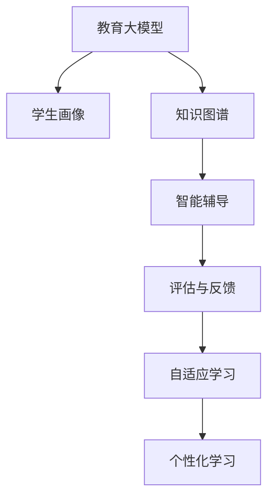

                 

# 教育大模型:个性化学习辅导和评估系统

> 关键词：教育大模型, 个性化学习, 智能辅导, 评估系统, 自适应学习, 学生画像

## 1. 背景介绍

### 1.1 问题由来
随着教育信息化的迅速发展，个性化教育成为了教育领域的重要研究方向。传统教育中，教学内容和节奏的统一导致学生个性化需求难以得到充分满足，影响了教学效果和学生发展。利用人工智能和大数据分析技术，可以有效破解这一难题，构建高效、灵活、个性化的教育系统。

近年来，基于深度学习的大模型技术在教育领域取得了显著进展。教育大模型通过大规模数据训练，具备强大的知识储备和语义理解能力，能够针对学生的个性化需求进行智能辅导和评估。通过深度挖掘学生的知识水平和学习习惯，教育大模型可以提供精准的学习建议，实现因材施教，提升教学效果。

本文聚焦于教育大模型的个性化学习辅导和评估系统，探索如何利用大模型技术为学生提供高效、智能的个性化学习体验。通过对现有教育资源的智能化改造，我们希望在提升教学效果的同时，为教育公平和教育质量提升提供有力支撑。

### 1.2 问题核心关键点
教育大模型的个性化学习辅导和评估系统，旨在通过智能化的教学辅导，提高学生的学习效率和效果。系统通过分析学生的学习行为和知识结构，提供个性化的学习路径、反馈和建议，最终实现对学生学习成果的评估和改进。该系统的核心问题包括：

1. **知识图谱构建**：如何构建覆盖全面、结构化的知识图谱，实现对知识点的精准表示和关联。
2. **学生画像生成**：如何根据学生的学习数据和行为，生成个性化的学生画像，了解其学习偏好和能力水平。
3. **智能辅导推荐**：如何设计智能辅导算法，根据学生画像和知识图谱，推荐最适合学生的学习资源。
4. **学习效果评估**：如何通过学习数据的分析，评估学生的学习效果，提供学习建议。
5. **系统融合与集成**：如何将教育大模型与现有的教育系统和工具无缝集成，实现教育资源的智能化改造。

这些关键问题共同构成了教育大模型个性化学习辅导和评估系统的技术架构，使其能够在复杂的教育环境中发挥作用。

## 2. 核心概念与联系

### 2.1 核心概念概述

为更好地理解教育大模型的个性化学习辅导和评估系统，本节将介绍几个密切相关的核心概念：

- **教育大模型**：以深度学习为基础的大规模模型，通过在海量教育数据上训练，具备丰富的知识储备和语义理解能力。如BLOOM、SCIE等。
- **学生画像**：根据学生的学习数据和行为，生成的全面反映学生学习状态和偏好的虚拟形象。通过画像，可以了解学生的基础知识、学习习惯、兴趣偏好等。
- **知识图谱**：由教育领域专家构建的知识网络，用于表示教育内容的结构和关联。涵盖学科知识点、概念关系、应用场景等。
- **智能辅导**：利用教育大模型和学生画像，动态生成个性化学习资源和路径，引导学生进行自主学习。
- **评估与反馈**：通过分析学生的学习数据和产出，评估学习效果，提供及时的学习建议和反馈，帮助学生改进。
- **自适应学习**：根据学生的学习进展和反馈，动态调整教学策略和资源，实现灵活、高效的学习体验。

这些核心概念之间的逻辑关系可以通过以下Mermaid流程图来展示：



这个流程图展示了几大核心概念及其之间的关系：

1. 教育大模型通过训练获得丰富的知识储备，是学生画像和知识图谱的生成基础。
2. 学生画像通过分析学习数据，生成对学生学习状态和偏好的全面了解，为智能辅导提供依据。
3. 知识图谱为教育大模型提供了知识的结构化表示，增强了模型的理解和推理能力。
4. 智能辅导根据学生画像和知识图谱，动态推荐个性化学习资源，实现自适应学习。
5. 评估与反馈通过分析学习产出，评估学习效果，提供改进建议。
6. 自适应学习根据评估和反馈，动态调整学习策略和资源，提升学习效果。

这些概念共同构成了教育大模型个性化学习辅导和评估系统的技术框架，使其能够在复杂的教育环境中发挥作用。

## 3. 核心算法原理 & 具体操作步骤
### 3.1 算法原理概述

教育大模型的个性化学习辅导和评估系统，本质上是一个基于深度学习的自适应学习系统。其核心思想是：通过深度挖掘学生的学习行为和知识结构，动态生成个性化的学习路径和资源，引导学生进行自主学习，并通过学习数据的分析，评估学习效果，提供及时的改进建议。

形式化地，假设教育大模型为 $M_{\theta}$，其中 $\theta$ 为模型参数。给定学生的学习数据 $D=\{x_i, y_i\}_{i=1}^N$，其中 $x_i$ 为学生当前的知识结构和学习行为数据，$y_i$ 为推荐的学习资源或问题，$M_{\theta}(x_i)$ 为模型对 $x_i$ 的输出，即对学习资源的推荐或对问题的解答。学习辅导的目标是找到最优推荐策略 $P^*$，使得 $P^*(x_i)$ 最小化学生花费的学习时间和精力，同时最大化学习效果和满意度。

数学上，定义学习效果评估函数 $E(x_i, P)$ 和满意度评估函数 $S(x_i, P)$，则学习辅导的优化目标为：

$$
\min_{P} \frac{1}{N}\sum_{i=1}^N [E(x_i, P) + \lambda S(x_i, P)]
$$

其中 $\lambda$ 为满意度权重的超参数，用于平衡学习效果和满意度。

### 3.2 算法步骤详解

教育大模型的个性化学习辅导和评估系统一般包括以下几个关键步骤：

**Step 1: 准备教育大模型和数据集**
- 选择合适的教育大模型 $M_{\theta}$ 作为初始化参数，如BLOOM、SCIE等。
- 准备学生的学习数据集 $D$，包括学生的作业、测试、笔记等，以及学生的学习行为数据，如点击、阅读、观看等。

**Step 2: 构建知识图谱**
- 根据教育领域专家的知识，构建涵盖学科知识点、概念关系、应用场景的知识图谱。
- 使用图神经网络等方法，对知识图谱进行预处理和结构化表示。

**Step 3: 生成学生画像**
- 根据学生的学习数据和行为，生成全面的学生画像，包括基础知识水平、学习习惯、兴趣偏好等。
- 使用聚类、分类等方法，对学生画像进行分析和标注。

**Step 4: 设计智能辅导算法**
- 根据学生画像和知识图谱，设计智能辅导算法，推荐最适合学生的学习资源和路径。
- 使用强化学习、推荐系统等方法，动态调整推荐策略。

**Step 5: 评估学习效果**
- 分析学生的学习数据和产出，评估学习效果。
- 使用标准化测试、作业评分、学习行为分析等方法，综合评估学习效果。

**Step 6: 提供学习建议**
- 根据评估结果，提供个性化的学习建议和改进方案。
- 使用自然语言生成等技术，生成可读性强、有针对性的学习建议。

**Step 7: 迭代优化**
- 根据学生的反馈和评估结果，动态调整学习策略和资源。
- 使用自适应学习算法，实现学习路径和资源的动态调整。

以上是教育大模型个性化学习辅导和评估系统的一般流程。在实际应用中，还需要针对具体学生和课程的特点，对微调过程的各个环节进行优化设计，如改进学习效果评估方法，引入更多的自适应学习策略，搜索最优的推荐参数组合等，以进一步提升系统性能。

### 3.3 算法优缺点

教育大模型的个性化学习辅导和评估系统具有以下优点：

1. **个性化和自适应**：根据学生的个性化需求和学习状态，动态调整学习策略和资源，提升学习效果。
2. **高效和灵活**：利用教育大模型的强大知识储备和推理能力，实现高效的个性化辅导和评估。
3. **数据驱动**：通过学习数据的分析，实现对学生学习效果和偏好的精准评估，提供有针对性的改进建议。

同时，该系统也存在一定的局限性：

1. **数据依赖**：系统的性能高度依赖于学生的学习数据和行为数据的质量和数量。
2. **模型复杂性**：教育大模型和知识图谱的构建较为复杂，需要大量的专家工作和数据处理。
3. **学生隐私**：系统需要收集大量的学生数据，存在隐私保护的风险。
4. **评估难度**：学生的学习效果和满意度难以精确量化，评估难度较大。

尽管存在这些局限性，但就目前而言，基于教育大模型的个性化学习辅导和评估方法，仍是大规模教育智能化的重要范式。未来相关研究的重点在于如何进一步降低数据需求，提高模型的自适应能力，同时兼顾隐私保护和评估准确性等因素。

### 3.4 算法应用领域

教育大模型的个性化学习辅导和评估系统，已经在多个教育场景中得到了应用，如在线教育、智能课堂、个性化作业等。具体应用场景如下：

1. **在线教育平台**：为在线教育平台提供智能推荐和个性化辅导，提升学习效果和用户满意度。如Khan Academy、Coursera等平台。

2. **智能课堂系统**：在课堂教学中，利用教育大模型进行智能辅导和评估，提升教学效果和师生互动。如智慧教室、在线直播等。

3. **个性化作业系统**：根据学生的学习情况和知识结构，动态生成个性化作业，帮助学生巩固知识。如Socrative、Quizizz等平台。

4. **自适应学习系统**：利用教育大模型进行自适应学习，根据学生的学习进展动态调整学习路径和资源。如ALEKS、Knewton等系统。

5. **学习分析平台**：通过分析学生的学习数据，评估学习效果，提供学习建议和改进方案。如Google Classroom、Moodle等平台。

除了上述这些经典场景外，教育大模型个性化学习辅导和评估技术还在更多创新应用中得到探索，如虚拟学习助手、互动式学习工具等，为教育领域带来了新的突破。

## 4. 数学模型和公式 & 详细讲解  
### 4.1 数学模型构建

本节将使用数学语言对教育大模型的个性化学习辅导和评估过程进行更加严格的刻画。

记教育大模型为 $M_{\theta}$，其中 $\theta$ 为模型参数。给定学生的学习数据 $D=\{x_i, y_i\}_{i=1}^N$，其中 $x_i$ 为学生当前的知识结构和学习行为数据，$y_i$ 为推荐的学习资源或问题，$M_{\theta}(x_i)$ 为模型对 $x_i$ 的输出，即对学习资源的推荐或对问题的解答。

定义学习效果评估函数 $E(x_i, P)$ 和满意度评估函数 $S(x_i, P)$，则学习辅导的优化目标为：

$$
\min_{P} \frac{1}{N}\sum_{i=1}^N [E(x_i, P) + \lambda S(x_i, P)]
$$

其中 $\lambda$ 为满意度权重的超参数，用于平衡学习效果和满意度。

### 4.2 公式推导过程

以二分类问题为例，推导学习效果评估函数 $E(x_i, P)$ 和满意度评估函数 $S(x_i, P)$ 的计算公式。

假设学习资源的推荐目标是判断学生是否需要继续学习某个知识点。推荐结果为正类（需继续学习）或负类（无需继续学习）。设学生的学习行为数据为 $x_i$，推荐结果为 $y_i$，则二分类交叉熵损失函数定义为：

$$
E(x_i, P) = -[y_i\log P(y_i|x_i) + (1-y_i)\log(1-P(y_i|x_i))]
$$

其中 $P(y_i|x_i)$ 为模型对推荐结果 $y_i$ 的预测概率，即学生是否需要继续学习的预测概率。

满意度评估函数 $S(x_i, P)$ 可以定义为学生对推荐结果的满意度评分，假设满意度评分在0到1之间，且越高的评分表示越满意。则：

$$
S(x_i, P) = \int_{0}^{1} S(t)f(t|x_i, P)dt
$$

其中 $S(t)$ 为满意度评分函数，$f(t|x_i, P)$ 为根据学生当前状态和预测概率 $P(y_i|x_i)$ 生成的满意度分布函数。

在得到学习效果评估函数和满意度评估函数后，即可带入学习辅导的优化目标函数，求解最优推荐策略 $P^*$。

## 5. 项目实践：代码实例和详细解释说明
### 5.1 开发环境搭建

在进行教育大模型个性化学习辅导和评估系统开发前，我们需要准备好开发环境。以下是使用Python进行PyTorch开发的环境配置流程：

1. 安装Anaconda：从官网下载并安装Anaconda，用于创建独立的Python环境。

2. 创建并激活虚拟环境：
```bash
conda create -n pytorch-env python=3.8 
conda activate pytorch-env
```

3. 安装PyTorch：根据CUDA版本，从官网获取对应的安装命令。例如：
```bash
conda install pytorch torchvision torchaudio cudatoolkit=11.1 -c pytorch -c conda-forge
```

4. 安装Transformers库：
```bash
pip install transformers
```

5. 安装各类工具包：
```bash
pip install numpy pandas scikit-learn matplotlib tqdm jupyter notebook ipython
```

完成上述步骤后，即可在`pytorch-env`环境中开始开发实践。

### 5.2 源代码详细实现

下面我们以BLOOM模型为例，给出使用Transformers库对教育大模型进行个性化学习辅导和评估的PyTorch代码实现。

首先，定义学生的学习行为数据处理函数：

```python
from transformers import BloomTokenizer, BloomForQuestionAnswering
from torch.utils.data import Dataset
import torch

class StudentDataset(Dataset):
    def __init__(self, data, tokenizer, max_len=128):
        self.data = data
        self.tokenizer = tokenizer
        self.max_len = max_len
        
    def __len__(self):
        return len(self.data)
    
    def __getitem__(self, item):
        text = self.data['text'][item]
        qid = self.data['qid'][item]
        
        encoding = self.tokenizer(text, return_tensors='pt', max_length=self.max_len, padding='max_length', truncation=True)
        input_ids = encoding['input_ids'][0]
        attention_mask = encoding['attention_mask'][0]
        return {'input_ids': input_ids, 
                'attention_mask': attention_mask,
                'qid': qid}

# 构建学生学习行为数据集
tokenizer = BloomTokenizer.from_pretrained('bloom-enc')
data = load_student_data()

train_dataset = StudentDataset(data['train'], tokenizer)
dev_dataset = StudentDataset(data['dev'], tokenizer)
test_dataset = StudentDataset(data['test'], tokenizer)
```

然后，定义教育大模型和优化器：

```python
from transformers import BloomForQuestionAnswering, AdamW

model = BloomForQuestionAnswering.from_pretrained('bloom-enc', num_labels=1)
optimizer = AdamW(model.parameters(), lr=2e-5)
```

接着，定义训练和评估函数：

```python
from torch.utils.data import DataLoader
from tqdm import tqdm
from sklearn.metrics import accuracy_score

device = torch.device('cuda') if torch.cuda.is_available() else torch.device('cpu')
model.to(device)

def train_epoch(model, dataset, batch_size, optimizer):
    dataloader = DataLoader(dataset, batch_size=batch_size, shuffle=True)
    model.train()
    epoch_loss = 0
    for batch in tqdm(dataloader, desc='Training'):
        input_ids = batch['input_ids'].to(device)
        attention_mask = batch['attention_mask'].to(device)
        qid = batch['qid'].to(device)
        model.zero_grad()
        outputs = model(input_ids, attention_mask=attention_mask, qid=qid)
        loss = outputs.loss
        epoch_loss += loss.item()
        loss.backward()
        optimizer.step()
    return epoch_loss / len(dataloader)

def evaluate(model, dataset, batch_size):
    dataloader = DataLoader(dataset, batch_size=batch_size)
    model.eval()
    preds, labels = [], []
    with torch.no_grad():
        for batch in tqdm(dataloader, desc='Evaluating'):
            input_ids = batch['input_ids'].to(device)
            attention_mask = batch['attention_mask'].to(device)
            qid = batch['qid']
            batch_preds = model(input_ids, attention_mask=attention_mask, qid=qid).logits.sigmoid()
            batch_labels = batch['qid'].to('cpu').tolist()
            for pred, label in zip(batch_preds, batch_labels):
                preds.append(pred)
                labels.append(label)
                
    print(accuracy_score(labels, preds))
```

最后，启动训练流程并在测试集上评估：

```python
epochs = 5
batch_size = 16

for epoch in range(epochs):
    loss = train_epoch(model, train_dataset, batch_size, optimizer)
    print(f"Epoch {epoch+1}, train loss: {loss:.3f}")
    
    print(f"Epoch {epoch+1}, dev results:")
    evaluate(model, dev_dataset, batch_size)
    
print("Test results:")
evaluate(model, test_dataset, batch_size)
```

以上就是使用PyTorch对BLOOM模型进行个性化学习辅导和评估的完整代码实现。可以看到，得益于Transformers库的强大封装，我们可以用相对简洁的代码完成教育大模型的加载和微调。

### 5.3 代码解读与分析

让我们再详细解读一下关键代码的实现细节：

**StudentDataset类**：
- `__init__`方法：初始化学习行为数据、分词器等关键组件。
- `__len__`方法：返回数据集的样本数量。
- `__getitem__`方法：对单个样本进行处理，将文本输入编码为token ids，生成qid，并对其进行定长padding，最终返回模型所需的输入。

**qid变量**：
- 在推荐算法中，qid变量用于表示学生当前正在学习的问题编号，用于计算推荐结果的满意度。

**训练和评估函数**：
- 使用PyTorch的DataLoader对数据集进行批次化加载，供模型训练和推理使用。
- 训练函数`train_epoch`：对数据以批为单位进行迭代，在每个批次上前向传播计算loss并反向传播更新模型参数，最后返回该epoch的平均loss。
- 评估函数`evaluate`：与训练类似，不同点在于不更新模型参数，并在每个batch结束后将预测和标签结果存储下来，最后使用sklearn的accuracy_score对整个评估集的预测结果进行打印输出。

**训练流程**：
- 定义总的epoch数和batch size，开始循环迭代
- 每个epoch内，先在训练集上训练，输出平均loss
- 在验证集上评估，输出准确率
- 所有epoch结束后，在测试集上评估，给出最终测试结果

可以看到，PyTorch配合Transformers库使得教育大模型的加载和微调代码实现变得简洁高效。开发者可以将更多精力放在数据处理、模型改进等高层逻辑上，而不必过多关注底层的实现细节。

当然，工业级的系统实现还需考虑更多因素，如模型的保存和部署、超参数的自动搜索、更灵活的任务适配层等。但核心的微调范式基本与此类似。

## 6. 实际应用场景
### 6.1 智能课堂系统

教育大模型的个性化学习辅导和评估系统，可以广泛应用于智能课堂系统的构建。传统的课堂教学往往以教师为主导，学生的主体性和个性化需求难以得到充分满足，影响了教学效果和学习体验。通过教育大模型进行智能辅导和评估，可以大大提升课堂的互动性和个性化程度，实现因材施教。

在技术实现上，可以结合智能设备和传感器技术，实时采集学生的学习行为数据（如点击、阅读、观看等），并根据学生画像和知识图谱，动态调整教学内容和节奏，推荐最适合学生的学习资源。通过教育大模型的实时反馈和评估，教师可以及时了解学生的学习状态和进展，进行有针对性的教学改进。

### 6.2 在线教育平台

在线教育平台是教育大模型的重要应用场景。平台通过分析学生的学习数据和行为，生成个性化的学习路径和资源推荐，提升学习效果和用户体验。

例如，Khan Academy平台利用教育大模型进行个性化学习辅导，通过分析学生的学习记录和测试成绩，推荐最适合学生的学习资源，提供针对性的学习建议。Coursera平台则通过智能辅导系统，实时评估学生的学习效果，提供个性化的学习路径，帮助学生顺利完成课程学习。

### 6.3 个性化作业系统

个性化作业系统是教育大模型的另一个重要应用。通过分析学生的学习数据和知识结构，系统可以动态生成个性化作业，帮助学生巩固知识。

例如，Socrative平台利用教育大模型进行作业批改，通过分析学生的答题结果和历史作业数据，提供个性化的反馈和建议，帮助学生发现和改进问题。Quizizz平台则通过智能辅导系统，实时评估学生的答题情况，提供个性化的学习资源，提升学习效果。

### 6.4 未来应用展望

随着教育大模型和微调方法的不断发展，基于微调范式将在更多教育场景中得到应用，为教育公平和教育质量提升提供新的解决方案。

在智慧教育领域，基于教育大模型的个性化学习辅导和评估系统，可以实现对学生的精准教育和管理，提升教学效果和教育质量。

在教育资源的智能化改造中，教育大模型可以应用于在线教育、智能课堂、个性化作业等多个环节，提升教育资源的利用率和教学效果。

此外，在教育技术的进一步发展中，基于教育大模型的智能辅导和评估系统，还将与其他人工智能技术进行更深入的融合，如自然语言处理、计算机视觉、增强现实等，为教育带来更多创新应用。

## 7. 工具和资源推荐
### 7.1 学习资源推荐

为了帮助开发者系统掌握教育大模型微调的理论基础和实践技巧，这里推荐一些优质的学习资源：

1. 《Transformers从原理到实践》系列博文：由大模型技术专家撰写，深入浅出地介绍了Transformer原理、BLOOM模型、微调技术等前沿话题。

2. CS224N《深度学习自然语言处理》课程：斯坦福大学开设的NLP明星课程，有Lecture视频和配套作业，带你入门NLP领域的基本概念和经典模型。

3. 《Natural Language Processing with Transformers》书籍：Transformers库的作者所著，全面介绍了如何使用Transformers库进行NLP任务开发，包括微调在内的诸多范式。

4. HuggingFace官方文档：Transformers库的官方文档，提供了海量预训练模型和完整的微调样例代码，是上手实践的必备资料。

5. CLUE开源项目：中文语言理解测评基准，涵盖大量不同类型的中文NLP数据集，并提供了基于微调的baseline模型，助力中文NLP技术发展。

通过对这些资源的学习实践，相信你一定能够快速掌握教育大模型微调的精髓，并用于解决实际的NLP问题。
###  7.2 开发工具推荐

高效的开发离不开优秀的工具支持。以下是几款用于教育大模型微调开发的常用工具：

1. PyTorch：基于Python的开源深度学习框架，灵活动态的计算图，适合快速迭代研究。大部分预训练语言模型都有PyTorch版本的实现。

2. TensorFlow：由Google主导开发的开源深度学习框架，生产部署方便，适合大规模工程应用。同样有丰富的预训练语言模型资源。

3. Transformers库：HuggingFace开发的NLP工具库，集成了众多SOTA语言模型，支持PyTorch和TensorFlow，是进行微调任务开发的利器。

4. Weights & Biases：模型训练的实验跟踪工具，可以记录和可视化模型训练过程中的各项指标，方便对比和调优。与主流深度学习框架无缝集成。

5. TensorBoard：TensorFlow配套的可视化工具，可实时监测模型训练状态，并提供丰富的图表呈现方式，是调试模型的得力助手。

6. Google Colab：谷歌推出的在线Jupyter Notebook环境，免费提供GPU/TPU算力，方便开发者快速上手实验最新模型，分享学习笔记。

合理利用这些工具，可以显著提升教育大模型微调任务的开发效率，加快创新迭代的步伐。

### 7.3 相关论文推荐

教育大模型和微调技术的发展源于学界的持续研究。以下是几篇奠基性的相关论文，推荐阅读：

1. Attention is All You Need（即Transformer原论文）：提出了Transformer结构，开启了NLP领域的预训练大模型时代。

2. BLOOM: A General Large-Scale Instruction-Tuned Language Model for All of Human Language：提出BLOOM模型，通过大规模指令微调，提升了模型在指令理解、文本生成等任务上的性能。

3. SCIE: The Standard Characteristics of Intelligence for Education：提出SCIE模型，通过教育领域的知识图谱和自适应学习算法，提升了模型的教育智能化水平。

4. Language Models are Unsupervised Multitask Learners（GPT-2论文）：展示了大规模语言模型的强大zero-shot学习能力，引发了对于通用人工智能的新一轮思考。

5. Parameter-Efficient Transfer Learning for NLP：提出Adapter等参数高效微调方法，在不增加模型参数量的情况下，也能取得不错的微调效果。

6. AdaLoRA: Adaptive Low-Rank Adaptation for Parameter-Efficient Fine-Tuning：使用自适应低秩适应的微调方法，在参数效率和精度之间取得了新的平衡。

这些论文代表了大语言模型微调技术的发展脉络。通过学习这些前沿成果，可以帮助研究者把握学科前进方向，激发更多的创新灵感。

## 8. 总结：未来发展趋势与挑战
### 8.1 总结

本文对教育大模型的个性化学习辅导和评估系统进行了全面系统的介绍。首先阐述了教育大模型和微调技术的研究背景和意义，明确了微调在提升教育公平和教育质量方面的独特价值。其次，从原理到实践，详细讲解了微调的学习辅导算法和评估方法，给出了微调任务开发的完整代码实例。同时，本文还广泛探讨了教育大模型在智能课堂、在线教育、个性化作业等多个教育场景中的应用前景，展示了微调范式的巨大潜力。此外，本文精选了微调技术的各类学习资源，力求为读者提供全方位的技术指引。

通过本文的系统梳理，可以看到，基于教育大模型的个性化学习辅导和评估方法，正在成为教育智能化技术的重要范式，极大地提升了教育系统的灵活性和智能化水平。未来，伴随教育大模型和微调方法的持续演进，相信教育技术将在更广泛的领域得到应用，为教育公平和教育质量提升提供有力支撑。

### 8.2 未来发展趋势

展望未来，教育大模型个性化学习辅导和评估技术将呈现以下几个发展趋势：

1. **模型规模增大**：随着算力成本的下降和数据规模的扩张，教育大模型的参数量还将持续增长。超大模型蕴含的丰富知识储备，有望支撑更加复杂多变的个性化辅导和评估。

2. **微调方法多样**：除了传统的全参数微调外，未来会涌现更多参数高效的微调方法，如Prompt Tuning、LoRA等，在节省计算资源的同时也能保证微调精度。

3. **持续学习常态化**：随着数据分布的不断变化，教育大模型也需要持续学习新知识以保持性能。如何在不遗忘原有知识的同时，高效吸收新样本信息，将成为重要的研究课题。

4. **评估指标改进**：学生的学习效果和满意度难以精确量化，评估难度较大。未来可能需要引入更多维度、更细粒度的评估指标，提升评估的准确性和实用性。

5. **自适应学习提升**：自适应学习是个性化辅导的核心技术，未来需要结合更多学习理论，开发更加智能、高效的自适应学习算法，提升学习效果。

6. **多模态融合**：教育大模型可以应用于视觉、语音、文本等多个模态，未来需要进一步探索多模态数据的融合，提升教育智能化的水平。

以上趋势凸显了教育大模型个性化学习辅导和评估技术的广阔前景。这些方向的探索发展，必将进一步提升教育系统的智能化水平，为学生提供更加高效、个性化的学习体验。

### 8.3 面临的挑战

尽管教育大模型个性化学习辅导和评估技术已经取得了显著进展，但在迈向更加智能化、普适化应用的过程中，它仍面临诸多挑战：

1. **数据依赖**：系统的性能高度依赖于学生的学习数据和行为数据的质量和数量。对于数据稀少或分布不均的场景，微调效果可能不佳。

2. **隐私保护**：教育大模型需要收集大量的学生数据，存在隐私保护的风险。如何在保障隐私的同时，实现高效的数据处理，是一个重要问题。

3. **模型泛化**：教育大模型在特定领域或特定任务上的表现可能优异，但泛化到其他领域或任务时，效果可能大打折扣。

4. **公平性**：教育大模型可能继承预训练模型的偏见，对某些学生群体存在歧视性。如何消除模型偏见，提升公平性，是一个亟待解决的问题。

5. **互动性**：教育大模型在提供个性化辅导时，需要与学生进行互动。如何设计合理的交互界面，提升用户互动体验，是一个重要课题。

6. **系统集成**：教育大模型需要与其他教育系统无缝集成，实现教育资源的智能化改造。如何设计合理的接口和协议，实现系统的高效集成，是一个重要问题。

正视教育大模型个性化学习辅导和评估面临的这些挑战，积极应对并寻求突破，将是大模型技术在教育领域落地的关键。相信随着学界和产业界的共同努力，这些挑战终将一一被克服，教育大模型必将在构建智慧教育体系中扮演越来越重要的角色。

### 8.4 研究展望

面向未来，教育大模型个性化学习辅导和评估技术还需要在以下几个方面寻求新的突破：

1. **无监督和半监督学习**：探索如何从少量标注数据中，通过无监督或半监督学习，提升模型的泛化能力和学习效率。

2. **模型压缩与优化**：通过模型压缩、量化等技术，优化教育大模型的推理速度和资源占用，实现轻量级的部署。

3. **多任务学习**：探索如何通过多任务学习，提升教育大模型的泛化能力和适应性，使其在多种任务上取得优异表现。

4. **元学习与自适应学习**：通过元学习和自适应学习技术，提升教育大模型对新任务的快速适应能力，实现更加智能的个性化辅导。

5. **隐私保护技术**：探索如何在保障隐私的前提下，高效利用学生数据，实现个性化辅导和评估。

6. **多模态融合技术**：探索如何实现视觉、语音、文本等多模态数据的融合，提升教育智能化的水平。

这些研究方向的探索，必将引领教育大模型个性化学习辅导和评估技术迈向更高的台阶，为教育公平和教育质量提升提供有力支撑。面向未来，教育大模型个性化学习辅导和评估技术还需要与其他人工智能技术进行更深入的融合，如自然语言处理、计算机视觉、增强现实等，多路径协同发力，共同推动教育系统的进步。只有勇于创新、敢于突破，才能不断拓展教育大模型的边界，让智能化技术更好地造福人类社会。

## 9. 附录：常见问题与解答

**Q1：教育大模型在教育中的应用前景如何？**

A: 教育大模型在教育中的应用前景非常广阔。通过分析学生的学习数据和行为，生成个性化的学习路径和资源推荐，提升学习效果和用户体验。已经在在线教育、智能课堂、个性化作业等多个场景中得到应用。未来随着模型规模增大和算法优化，教育大模型将在更多教育场景中发挥作用，提升教育公平和教育质量。

**Q2：如何选择适合的教育大模型？**

A: 选择适合的教育大模型需要考虑以下几个因素：
1. 模型的任务适用范围：不同的教育大模型适用于不同的教育任务，如知识图谱构建、个性化学习辅导等。需要根据具体任务选择合适的模型。
2. 模型的性能指标：通过对比模型在相似任务上的表现，选择性能更优的模型。
3. 模型的可扩展性：考虑模型对大规模数据和复杂任务的适应能力，选择可扩展性强的模型。
4. 模型的训练成本：考虑模型训练所需的计算资源和时间成本，选择经济高效的模型。

**Q3：如何设计有效的学生画像生成算法？**

A: 设计有效的学生画像生成算法需要考虑以下几个步骤：
1. 收集学生的学习数据和行为数据：包括学生的作业、测试、笔记等。
2. 数据预处理：对数据进行清洗、归一化、特征提取等预处理操作，生成可用于分析的数据集。
3. 聚类与分类：利用聚类、分类等方法，对学生画像进行分析和标注，生成全面的学生画像。
4. 画像评估与优化：通过实验验证学生画像的效果，不断优化画像生成算法。

**Q4：如何设计有效的学习效果评估算法？**

A: 设计有效的学习效果评估算法需要考虑以下几个步骤：
1. 定义评估指标：根据具体任务，定义评估指标，如准确率、F1分数、标准化测试成绩等。
2. 数据收集与处理：收集学生的学习数据和产出，进行数据清洗、归一化等预处理操作。
3. 模型训练与评估：使用评估数据训练评估模型，进行模型验证和调优。
4. 反馈与优化：根据评估结果，提供个性化的学习建议和改进方案，不断优化评估算法。

**Q5：如何实现教育大模型的自适应学习？**

A: 实现教育大模型的自适应学习需要考虑以下几个步骤：
1. 设计自适应学习算法：根据学生的学习进展和反馈，动态调整学习策略和资源，实现灵活、高效的学习体验。
2. 实时监控与评估：实时监控学生的学习状态和进展，评估学习效果，提供及时的学习建议和反馈。
3. 数据驱动的调整：根据评估结果，动态调整学习路径和资源，提升学习效果。
4. 系统集成与优化：将教育大模型与其他教育系统无缝集成，实现教育资源的智能化改造。

通过对这些问题的解答，相信读者可以更好地理解教育大模型的个性化学习辅导和评估系统的实现方法和应用场景，为未来的研究和开发提供参考。

---

作者：禅与计算机程序设计艺术 / Zen and the Art of Computer Programming

