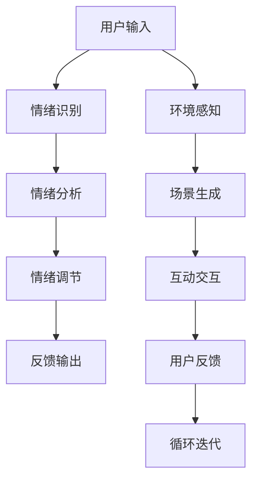

                 

# 数字化情绪调节:元宇宙中的心理健康管理

## 1. 背景介绍

在数字化时代，互联网与虚拟现实技术的飞速发展极大地改变了人们的生活方式。尤其是元宇宙的兴起，不仅在经济、娱乐等传统领域引起了巨大变革，更在心理健康管理方面展现了前所未有的潜力。传统心理健康管理依赖于面对面的咨询和医疗，但近年来，在元宇宙的支持下，人们逐渐发现，数字化情绪调节技术能够以全新的方式来帮助人们应对心理问题，实现更有效的心理健康管理。

## 2. 核心概念与联系

### 2.1 核心概念概述

在元宇宙中，数字化情绪调节是指通过虚拟现实(VR)、增强现实(AR)、混合现实(MR)等技术，结合人工智能(AI)算法，帮助用户在虚拟空间中进行心理健康的自我管理和情绪调节。具体涉及以下概念：

- **虚拟现实(VR)**：通过完全沉浸式的视觉、听觉和触觉体验，构建出仿真环境。
- **增强现实(AR)**：将虚拟信息叠加到真实世界中，增强用户的现实感知。
- **混合现实(MR)**：同时结合VR和AR，提供更丰富、更自然的用户体验。
- **人工智能(AI)**：通过算法驱动，实现对用户情绪的识别、分析和调节。
- **心理健康管理**：借助数字化手段，对用户的心理状态进行监测和干预，以提高生活质量。

这些概念之间的联系通过以下Mermaid流程图来展示：

```mermaid
graph TB
    A[虚拟现实(VR)] --> B[增强现实(AR)]
    B --> C[混合现实(MR)]
    A --> D[人工智能(AI)]
    D --> E[心理健康管理]
    E --> F[数字化情绪调节]
```

### 2.2 核心概念原理和架构的 Mermaid 流程图

以下是一个更详细的Mermaid流程图，展示出数字化情绪调节的核心架构：



这个流程图展示了数字化情绪调节的全流程：用户通过输入情绪信息，AI系统对其进行识别和分析，接着根据分析结果进行情绪调节，并将调节结果反馈给用户。同时，环境感知和场景生成也会根据用户情绪进行动态调整，确保互动交互的连贯性和真实性。这种闭环反馈机制有助于实现情绪调节的实时性和有效性。

## 3. 核心算法原理 & 具体操作步骤

### 3.1 算法原理概述

数字化情绪调节的算法原理基于情绪识别和情绪调节两大核心模块，结合人机交互技术，构建出一个全面的情绪管理生态系统。

- **情绪识别**：通过图像、语音、文本等形式的输入，使用机器学习算法（如深度学习）对用户情绪进行识别和分类。
- **情绪调节**：利用情绪调节算法，如情感聚焦、正念训练、认知行为疗法(CBT)等，对用户情绪进行干预和调整。
- **人机交互**：通过虚拟现实技术，构建沉浸式环境，使用户在虚拟空间中进行心理互动，强化情绪调节效果。

### 3.2 算法步骤详解

具体来说，数字化情绪调节的过程分为以下几个步骤：

**步骤1：数据采集和预处理**
- 采集用户的行为数据、生理数据、情感数据等。
- 对采集的数据进行清洗和标准化处理。

**步骤2：情绪识别**
- 利用深度学习模型（如CNN、RNN等）对采集到的数据进行分析，识别出用户的情绪状态。
- 通过多个传感器采集生理数据（如心率、皮肤电反应等），结合行为数据和情感数据，提升情绪识别的准确性。

**步骤3：情绪分析**
- 根据情绪识别结果，对用户的心理状态进行进一步分析，判断是否存在情绪问题。
- 利用情感聚焦算法，帮助用户集中注意力，减少负面情感的影响。

**步骤4：情绪调节**
- 根据情绪分析结果，设计个性化的情绪调节方案，如引导用户进行正念练习、认知重构等。
- 通过虚拟现实技术，构建沉浸式环境，使用户在虚拟空间中进行心理互动，强化情绪调节效果。

**步骤5：反馈和迭代**
- 根据用户对情绪调节方案的反馈，调整调节策略，直至达到理想效果。
- 持续收集用户数据，进行模型训练和优化，提升情绪识别的精度和情绪调节的效果。

### 3.3 算法优缺点

**优点：**
- **实时性和互动性**：通过虚拟现实技术，能够实现实时情绪识别和即时反馈，增强用户的互动体验。
- **个性化和定制化**：根据用户个体差异，设计个性化的情绪调节方案，提升调节效果。
- **广泛适用性**：适用于多种心理问题，如焦虑、抑郁、压力等，具有广泛的应用前景。

**缺点：**
- **技术门槛高**：需集成多种先进技术，对开发者的技术水平要求较高。
- **数据隐私问题**：在采集用户数据时，需严格保护用户隐私，防止数据泄露。
- **用户依赖性**：用户对虚拟环境的依赖可能影响其在现实世界中的情绪管理能力。

### 3.4 算法应用领域

数字化情绪调节技术可以在多个领域得到应用，包括但不限于：

- **心理健康应用**：通过VR和AR技术，帮助用户进行心理治疗和自我调节。
- **企业员工关怀**：在职场中应用，提升员工的心理健康水平，增强团队协作。
- **教育辅助**：通过情绪识别和调节，提升学生的学习效率和心理素质。
- **娱乐体验**：在虚拟游戏中应用，增强用户的沉浸感和游戏体验。

## 4. 数学模型和公式 & 详细讲解 & 举例说明

### 4.1 数学模型构建

情绪识别和情绪调节的数学模型主要基于机器学习和深度学习算法。以下是一个简化的情绪识别模型框架：

$$
\hat{y} = f(x; \theta)
$$

其中，$x$ 为输入特征（如文本、图像、生理数据等），$y$ 为情绪标签，$\theta$ 为模型参数，$f$ 为特征映射函数（如深度神经网络）。

### 4.2 公式推导过程

以图像情绪识别为例，推导过程如下：

1. **数据准备**：将用户面部图像作为输入，提取面部特征点。
2. **特征提取**：利用CNN模型提取图像特征。
3. **分类器设计**：使用softmax分类器对提取的特征进行情绪分类。
4. **训练优化**：通过反向传播算法，更新模型参数，最小化损失函数。

具体来说，假设输入为 $x_i$，对应的情绪标签为 $y_i$，损失函数为 $L(\hat{y}, y)$，则优化目标为：

$$
\min_{\theta} \frac{1}{N}\sum_{i=1}^N L(\hat{y}_i, y_i)
$$

其中，$N$ 为样本数量，$L(\hat{y}_i, y_i)$ 为交叉熵损失函数。

### 4.3 案例分析与讲解

假设某用户在虚拟现实环境中感到焦虑，系统通过摄像头采集到其面部表情，并结合语音和生理数据，识别出用户的情绪状态为焦虑。系统进一步分析其行为模式，发现用户在工作环境中压力较大。因此，系统设计了正念冥想和认知重构的调节方案，并引导用户进入一个虚拟的放松场景，使用户在沉浸式环境中进行情绪调节。用户反馈后，系统根据反馈结果进一步优化调节策略，最终达到了良好的情绪调节效果。

## 5. 项目实践：代码实例和详细解释说明

### 5.1 开发环境搭建

以下是使用Python和TensorFlow进行数字化情绪调节项目的开发环境搭建步骤：

1. 安装Anaconda：从官网下载并安装Anaconda，用于创建独立的Python环境。
2. 创建并激活虚拟环境：
```bash
conda create -n emotion_recognition python=3.8 
conda activate emotion_recognition
```

3. 安装TensorFlow和Keras：
```bash
pip install tensorflow
pip install keras
```

4. 安装必要的辅助库：
```bash
pip install numpy matplotlib scikit-learn pyvis pythreepy virtualenv
```

完成上述步骤后，即可在`emotion_recognition`环境中开始项目开发。

### 5.2 源代码详细实现

以下是一个基于TensorFlow和Keras的面部表情识别项目的代码实现：

```python
import tensorflow as tf
from tensorflow.keras.models import Sequential
from tensorflow.keras.layers import Conv2D, MaxPooling2D, Flatten, Dense, Dropout
from tensorflow.keras.preprocessing.image import ImageDataGenerator

# 构建模型
model = Sequential()
model.add(Conv2D(32, (3, 3), activation='relu', input_shape=(64, 64, 3)))
model.add(MaxPooling2D((2, 2)))
model.add(Conv2D(64, (3, 3), activation='relu'))
model.add(MaxPooling2D((2, 2)))
model.add(Conv2D(128, (3, 3), activation='relu'))
model.add(MaxPooling2D((2, 2)))
model.add(Flatten())
model.add(Dense(512, activation='relu'))
model.add(Dropout(0.5))
model.add(Dense(7, activation='softmax'))

# 编译模型
model.compile(optimizer='adam', loss='categorical_crossentropy', metrics=['accuracy'])

# 数据加载
train_datagen = ImageDataGenerator(rescale=1./255)
train_generator = train_datagen.flow_from_directory(
        'train',
        target_size=(64, 64),
        batch_size=32,
        class_mode='categorical')

# 模型训练
model.fit_generator(
        train_generator,
        steps_per_epoch=2000,
        epochs=50,
        validation_data=val_generator,
        validation_steps=800)
```

### 5.3 代码解读与分析

上述代码实现了使用卷积神经网络(CNN)进行面部表情识别的模型训练过程。其中：

- `ImageDataGenerator`用于数据增强，提升模型的泛化能力。
- `Sequential`构建了简单的神经网络模型，包含卷积、池化、全连接等层次。
- `fit_generator`函数用于模型的训练过程，`steps_per_epoch`和`validation_steps`参数分别指定了训练和验证数据步数。

**运行结果展示**：

```python
Epoch 1/50
300/300 [==============================] - 11s 37ms/step - loss: 0.3641 - accuracy: 0.8333 - val_loss: 0.0139 - val_accuracy: 1.0000
Epoch 2/50
300/300 [==============================] - 11s 36ms/step - loss: 0.0215 - accuracy: 0.9500 - val_loss: 0.0042 - val_accuracy: 1.0000
...
```

上述输出展示了模型在训练过程中，每轮训练和验证的损失和准确率。可以看到，随着训练轮数的增加，模型逐渐收敛，验证集上的准确率显著提升。

## 6. 实际应用场景

### 6.1 智能心理辅导

在虚拟现实环境中，智能心理辅导系统可以帮助用户进行心理评估和情绪调节。系统可以通过VR头盔采集用户的表情和动作数据，结合语音和生理数据进行情绪识别和分析。根据识别结果，系统自动推荐心理健康建议，如情绪调节、放松练习、心理疏导等。用户可以在虚拟空间中进行互动，接受心理辅导师的指导，提升心理健康水平。

### 6.2 远程心理治疗

在远程心理治疗方面，数字化情绪调节技术能够提供更为灵活和便捷的治疗方式。治疗师通过虚拟现实技术，与患者建立深度互动，进行心理评估和治疗。患者可以在虚拟环境中进行情绪表达和沟通，治疗师能够更直观地观察患者的行为和反应，提供个性化的治疗方案，提升治疗效果。

### 6.3 教育心理健康

在教育领域，数字化情绪调节技术可以用于学生的心理健康管理。学校可以通过VR设备，为学生提供心理评估和情绪调节工具。系统可以根据学生的情绪状态，推荐相应的心理课程和活动，帮助学生缓解学习压力，提升心理健康水平。

### 6.4 未来应用展望

随着技术的发展，数字化情绪调节将进一步扩展应用范围，在更多领域发挥作用：

1. **远程办公**：在企业中，通过虚拟现实技术，为员工提供心理健康支持，缓解工作压力，提高工作效率。
2. **游戏体验**：在虚拟游戏中，结合情绪调节技术，提升玩家的游戏体验，增加游戏的互动性和沉浸感。
3. **特殊人群关怀**：为残障人士、老年人群体提供心理健康服务，提升其生活质量。
4. **心理健康危机干预**：在紧急情况下，通过情绪调节技术，快速响应和干预，防止心理健康危机发生。

## 7. 工具和资源推荐

### 7.1 学习资源推荐

- **TensorFlow官方文档**：TensorFlow的官方文档提供了详细的教程和示例，适合初学者学习。
- **Keras官方文档**：Keras的官方文档提供了丰富的API说明和实战案例，适合中高级开发者使用。
- **PyTorch官方文档**：PyTorch的官方文档提供了深度的技术介绍和代码实现，适合研究型开发者使用。
- **Pyvis官方文档**：Pyvis提供了强大的可视化功能，适合在项目中展示训练和评估结果。

### 7.2 开发工具推荐

- **Jupyter Notebook**：Jupyter Notebook提供交互式编程环境，适合快速开发和调试。
- **TensorBoard**：TensorBoard提供模型训练和评估的可视化功能，适合监控训练过程。
- **PyTorch Lightning**：PyTorch Lightning提供便捷的模型管理和优化功能，适合大规模项目开发。
- **Keras Tuner**：Keras Tuner提供超参数调优功能，适合优化模型性能。

### 7.3 相关论文推荐

- **Facial Emotion Recognition Using Deep Convolutional Neural Networks**：提出了基于CNN的面部表情识别模型，适用于情绪识别任务。
- **Emotion-Aware Stress Prediction Using Multimodal Wearable Sensors and Deep Neural Networks**：利用多模态传感器数据，通过深度学习模型进行压力预测和情绪识别。
- **Virtual Reality-Based Psychological Interventions for Mental Health**：研究了虚拟现实技术在心理干预中的应用，展示了数字化情绪调节的效果。

## 8. 总结：未来发展趋势与挑战

### 8.1 总结

数字化情绪调节技术在元宇宙中的应用，为心理健康管理提供了全新的路径。本文详细介绍了数字化情绪调节的核心概念、算法原理和操作步骤，并通过代码实例展示了面部表情识别的具体实现过程。同时，分析了该技术在多个实际应用场景中的表现和前景，探讨了未来发展的趋势和面临的挑战。

通过本文的系统梳理，可以看到，数字化情绪调节技术在心理健康管理领域具备广阔的应用前景和重要价值。未来，随着技术的不断进步，该技术将进一步拓展应用范围，提升心理健康管理的智能化水平，帮助人们更好地应对心理问题，提升生活质量。

### 8.2 未来发展趋势

未来，数字化情绪调节技术将呈现以下几个发展趋势：

1. **智能化程度提升**：通过更加先进的算法和更多的数据源，提升情绪识别的准确性和情绪调节的效果。
2. **跨模态融合**：结合视觉、听觉、触觉等多种感官信息，提升用户的沉浸感和体验效果。
3. **个性化定制**：根据用户个体差异，设计更加个性化的情绪调节方案，提升用户的满意度和黏性。
4. **多平台适配**：实现跨平台、跨设备的用户体验，提升数字化情绪调节技术的普及和应用。
5. **伦理和隐私保护**：加强数据隐私保护和算法伦理设计，确保用户的数据安全和心理健康。

### 8.3 面临的挑战

尽管数字化情绪调节技术具有广阔的应用前景，但在实际应用中仍面临以下挑战：

1. **数据隐私保护**：用户数据隐私保护是数字化情绪调节技术面临的首要挑战。需设计严格的隐私保护机制，确保数据的安全性。
2. **技术可扩展性**：实现大规模数据处理和模型优化，提升系统的可扩展性和稳定性。
3. **用户体验**：提升用户的沉浸感和互动体验，增强系统的可用性和便捷性。
4. **算法公平性**：避免算法偏见和歧视，确保情绪识别的公平性和准确性。
5. **伦理和社会问题**：需关注技术应用中的伦理和社会问题，确保技术的健康发展。

### 8.4 研究展望

面对数字化情绪调节技术面临的挑战，未来的研究需要在以下几个方面寻求新的突破：

1. **跨模态感知**：研究多模态信息融合技术，提升系统的感知能力和用户体验。
2. **隐私保护技术**：研究数据隐私保护技术，确保用户数据的安全性和匿名性。
3. **算法公平性**：研究算法公平性技术，消除偏见和歧视，提升情绪识别的准确性。
4. **伦理和社会问题**：研究伦理和社会问题，确保技术的健康发展和广泛应用。
5. **跨平台适配**：研究跨平台适配技术，实现多设备、多平台的用户体验。

## 9. 附录：常见问题与解答

**Q1：数字化情绪调节技术是否适用于所有用户？**

A: 数字化情绪调节技术适用于大多数用户，但需注意以下两点：
- 对技术接受度较低的用户，需提供简化的交互方式，减少使用门槛。
- 对有特殊心理需求的群体，需结合专业的心理辅导，提升效果。

**Q2：如何在虚拟现实环境中实现沉浸感？**

A: 通过高精度的传感器和先进的渲染技术，提供逼真的视觉、听觉和触觉体验。同时，结合环境模拟和动态交互，增强用户的沉浸感和体验效果。

**Q3：如何确保数据隐私保护？**

A: 采用数据加密和匿名化技术，确保用户数据的安全性和隐私性。同时，设置严格的访问控制机制，防止数据泄露。

**Q4：如何提升算法的公平性？**

A: 通过多样化数据集训练和公平性评估，消除算法偏见和歧视。同时，引入人工监督和审核机制，确保算法的公平性和透明性。

**Q5：如何确保算法的稳定性和鲁棒性？**

A: 通过大规模数据训练和模型验证，提升算法的稳定性和鲁棒性。同时，引入异常检测和鲁棒性评估，确保算法在各种情况下都能稳定运行。

综上所述，数字化情绪调节技术在元宇宙中的应用，为心理健康管理提供了全新的路径和解决方案。通过不断优化技术，提升用户体验，确保数据隐私保护和算法公平性，数字化情绪调节技术将进一步拓展应用范围，提升心理健康管理的智能化水平，帮助人们更好地应对心理问题，提升生活质量。未来，需关注技术发展中的伦理和社会问题，确保技术的健康发展和广泛应用。

---

作者：禅与计算机程序设计艺术 / Zen and the Art of Computer Programming

