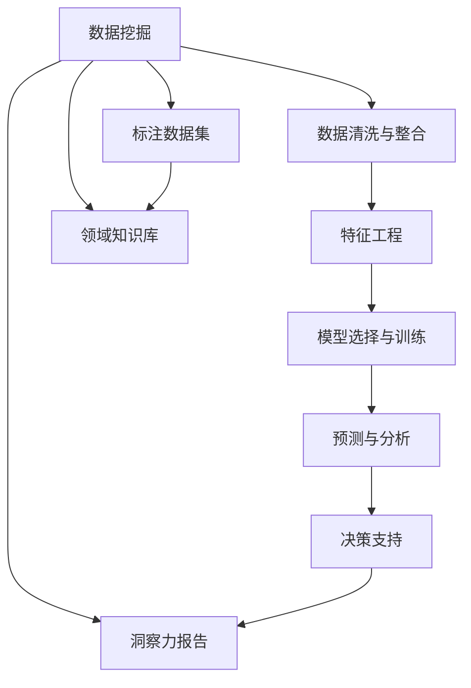

                 

## 1. 背景介绍

### 1.1 问题由来

随着信息时代的到来，大数据和人工智能技术正在深刻改变我们的世界。企业和组织需要具备强大的数字化洞察力（Digital Insight），以在激烈的竞争中保持领先。数字化洞察力不仅仅依赖于数据的收集与存储，更在于如何从海量数据中提取有价值的信息，进行实时分析和预测。传统的数据分析工具和方法，在处理大规模、复杂、多变的数据时，显得力不从心。

人工智能（AI）技术的兴起，特别是深度学习、自然语言处理、计算机视觉等技术，为解决这些问题提供了全新的工具和方法。AI增强的远见卓识工具（AI-Augmented Foresight Tools），就是其中一种集大成者。它将AI技术与传统洞察力分析相结合，形成了更加高效、全面、深度的洞察力分析系统。

### 1.2 问题核心关键点

AI增强的远见卓识工具的核心在于将人工智能技术与业务洞察力分析相结合。它利用AI技术从海量数据中提取有价值的信息，并结合领域专家的知识与经验，进行深度分析与预测。以下是该工具的关键点：

- 数据挖掘与清洗：从不同来源收集数据，并清洗、整合、标注数据集。
- 特征工程：从原始数据中提取有意义的特征，用于训练AI模型。
- 模型选择与训练：选择合适的AI模型（如机器学习、深度学习等），并使用标注数据进行训练。
- 预测与分析：利用训练好的模型对新数据进行预测，并结合领域专家知识进行深入分析。
- 决策支持：提供可视化的洞察力报告与决策建议，帮助决策者做出更明智的决策。

## 2. 核心概念与联系

### 2.1 核心概念概述

为了更好地理解AI增强的远见卓识工具，我们需要先了解几个关键概念：

- 数据挖掘（Data Mining）：从原始数据中提取有用信息，包括数据清洗、特征工程、模型训练等环节。
- 机器学习（Machine Learning）：利用数据训练模型，使模型能够从新数据中学习和预测。
- 深度学习（Deep Learning）：一种强大的机器学习方法，通过多层神经网络处理复杂数据。
- 自然语言处理（NLP）：处理和分析人类语言的技术，包括文本分类、情感分析、命名实体识别等。
- 计算机视觉（CV）：处理和分析图像与视频数据的技术，包括目标检测、图像分类、图像生成等。
- 业务洞察力（Business Insight）：基于数据分析与专家经验，结合AI技术提供业务洞察与决策支持。

这些核心概念相互关联，构成了AI增强远见卓识工具的基础。

### 2.2 核心概念原理和架构的 Mermaid 流程图



这个流程图展示了数据挖掘到洞察力报告的整个流程，反映了AI增强远见卓识工具的核心架构。

## 3. 核心算法原理 & 具体操作步骤

### 3.1 算法原理概述

AI增强远见卓识工具的核心算法原理，主要基于以下步骤：

1. 数据预处理：从不同来源收集数据，并进行清洗、整合、标注。
2. 特征提取：从原始数据中提取有意义的特征，用于模型训练。
3. 模型训练：选择合适的AI模型，并使用标注数据进行训练。
4. 模型预测：将新数据输入训练好的模型进行预测。
5. 洞察力分析：结合领域知识对预测结果进行深入分析，生成洞察力报告。

### 3.2 算法步骤详解

以下是AI增强远见卓识工具的详细步骤：

**步骤1：数据预处理**
- 数据收集：从不同来源（如社交媒体、客户反馈、销售数据等）收集数据。
- 数据清洗：去除缺失值、异常值、重复数据等。
- 数据整合：将不同来源的数据进行合并与对齐。
- 数据标注：对数据进行标注，如分类标签、情感极性、实体关系等。

**步骤2：特征提取**
- 特征选择：根据业务需求选择有意义的特征，如文本的TF-IDF值、用户行为数据、时间序列等。
- 特征工程：对特征进行标准化、归一化、编码等处理，以便于模型训练。
- 特征衍生：通过组合、变换等方式衍生新的特征，如文本情感极性、用户活跃度等。

**步骤3：模型训练**
- 模型选择：根据任务类型选择合适的AI模型，如分类、回归、聚类、深度学习等。
- 数据划分：将数据集划分为训练集、验证集和测试集。
- 超参数调优：通过网格搜索或随机搜索等方法，找到最优的超参数组合。
- 模型训练：使用训练集对模型进行训练，并使用验证集进行调参。

**步骤4：模型预测**
- 数据准备：将新数据进行预处理，准备输入模型。
- 模型预测：将新数据输入训练好的模型进行预测。
- 结果评估：使用测试集评估模型的预测准确性，如准确率、召回率、F1值等。

**步骤5：洞察力分析**
- 结果解读：结合领域知识对预测结果进行解读，如消费者行为、市场趋势等。
- 洞察力报告：生成可视化的洞察力报告，帮助决策者理解并应用分析结果。
- 决策建议：基于洞察力报告，提出具体的决策建议。

### 3.3 算法优缺点

AI增强远见卓识工具具有以下优点：
1. 高效性：利用AI技术从海量数据中提取有价值的信息，大大提高了分析效率。
2. 全面性：结合领域专家的知识与经验，提供更全面深入的分析结果。
3. 实时性：实时处理数据，快速生成洞察力报告，帮助决策者快速响应。
4. 可扩展性：易于扩展到不同的业务场景，支持多维度的分析需求。

同时，该工具也存在一些缺点：
1. 数据质量依赖：模型预测的准确性高度依赖于数据质量，低质量的数据可能导致误导性分析。
2. 模型复杂性：复杂的数据处理和模型训练需要较高的技术门槛，需要专家参与。
3. 解释性不足：AI模型通常是"黑盒"，难以解释其内部工作机制和决策逻辑。
4. 资源消耗大：大数据量的处理和深度学习模型的训练需要大量的计算资源和时间。

尽管存在这些缺点，但AI增强远见卓识工具仍然以其高效、全面、实时等优势，在企业决策支持中得到了广泛应用。

### 3.4 算法应用领域

AI增强远见卓识工具在多个领域得到了广泛应用，以下是几个典型的应用场景：

**金融分析**
- 市场预测：利用AI模型对市场趋势、价格变化等进行预测，帮助投资者做出更明智的投资决策。
- 风险管理：通过对客户数据进行分析，识别潜在的信用风险，进行风险预警和控制。
- 交易优化：利用AI模型优化交易策略，提高交易效率和收益。

**客户洞察**
- 客户细分：通过数据分析和聚类算法，将客户细分为不同的群体，进行精准营销。
- 行为分析：利用NLP技术分析客户反馈和评论，了解客户需求和满意度，提升客户体验。
- 个性化推荐：基于客户行为数据和偏好，提供个性化的产品和服务推荐。

**营销策略**
- 消费者洞察：通过分析消费者行为数据，了解消费者偏好和趋势，制定更有效的营销策略。
- 广告优化：利用AI技术优化广告投放策略，提高广告效果和ROI。
- 销售预测：通过时间序列分析和预测模型，预测销售趋势和需求，进行库存管理和需求规划。

**运营优化**
- 供应链管理：利用AI技术分析供应链数据，优化供应链流程，提高运营效率。
- 生产调度和预测：通过分析生产数据，预测生产需求和趋势，优化生产计划和调度。
- 库存管理：通过预测模型优化库存水平，避免库存过剩和短缺。

以上应用场景展示了AI增强远见卓识工具的强大功能和广泛应用。未来，随着AI技术的不断进步，该工具将在更多领域得到应用，带来更大的价值。

## 4. 数学模型和公式 & 详细讲解 & 举例说明

### 4.1 数学模型构建

AI增强远见卓识工具的数学模型，主要基于以下步骤：

1. 数据表示：将数据转化为数值形式，以便于模型处理。
2. 特征选择：从原始数据中提取有意义的特征，用于模型训练。
3. 模型训练：使用标注数据训练AI模型，生成预测函数。
4. 预测与评估：将新数据输入模型进行预测，评估预测结果的准确性。

### 4.2 公式推导过程

以下是AI增强远见卓识工具的核心数学模型和公式推导过程：

**线性回归模型**
$$
\hat{y} = \beta_0 + \beta_1 x_1 + \beta_2 x_2 + ... + \beta_n x_n
$$

其中，$y$ 为预测值，$x_i$ 为特征向量，$\beta$ 为模型系数。

**逻辑回归模型**
$$
\hat{p}(y=1|x) = \frac{1}{1+\exp(-z)}
$$

其中，$z = \beta_0 + \beta_1 x_1 + \beta_2 x_2 + ... + \beta_n x_n$，$y$ 为分类标签，$\hat{p}$ 为模型预测概率。

**随机森林模型**
$$
\hat{y} = \frac{1}{n_t} \sum_{t=1}^{n_t} y_t^{(t)}
$$

其中，$y_t^{(t)}$ 为第$t$棵树的预测结果，$n_t$ 为树的数量。

**卷积神经网络**
$$
\hat{y} = W^{[L]} * z^{[L-1]} + b^{[L]}
$$

其中，$z^{[L-1]}$ 为前一层的输出，$W^{[L]}$ 和 $b^{[L]}$ 为最后一层的权重和偏置。

### 4.3 案例分析与讲解

以金融市场预测为例，分析AI增强远见卓识工具的应用。

**数据收集与预处理**
- 从股票交易数据、新闻报道、社交媒体等渠道收集数据。
- 数据清洗：去除缺失值、异常值、重复数据等。
- 数据整合：将不同来源的数据进行合并与对齐。
- 数据标注：对数据进行分类标注，如股票价格涨跌、市场情绪等。

**特征工程**
- 特征选择：选择有意义的特征，如技术指标（MACD、RSI等）、新闻情绪极性、社交媒体情感极性等。
- 特征工程：对特征进行标准化、归一化、编码等处理，以便于模型训练。
- 特征衍生：通过组合、变换等方式衍生新的特征，如技术指标组合、新闻情感极性等。

**模型训练**
- 模型选择：选择线性回归、逻辑回归、随机森林等模型。
- 数据划分：将数据集划分为训练集、验证集和测试集。
- 超参数调优：通过网格搜索或随机搜索等方法，找到最优的超参数组合。
- 模型训练：使用训练集对模型进行训练，并使用验证集进行调参。

**模型预测**
- 数据准备：将新数据进行预处理，准备输入模型。
- 模型预测：将新数据输入训练好的模型进行预测。
- 结果评估：使用测试集评估模型的预测准确性，如准确率、召回率、F1值等。

**洞察力分析**
- 结果解读：结合领域知识对预测结果进行解读，如市场趋势、价格变化等。
- 洞察力报告：生成可视化的洞察力报告，帮助决策者理解并应用分析结果。
- 决策建议：基于洞察力报告，提出具体的决策建议。

## 5. 项目实践：代码实例和详细解释说明

### 5.1 开发环境搭建

在进行AI增强远见卓识工具的开发实践前，我们需要准备好开发环境。以下是使用Python进行PyTorch开发的环境配置流程：

1. 安装Anaconda：从官网下载并安装Anaconda，用于创建独立的Python环境。

2. 创建并激活虚拟环境：
```bash
conda create -n pytorch-env python=3.8 
conda activate pytorch-env
```

3. 安装PyTorch：根据CUDA版本，从官网获取对应的安装命令。例如：
```bash
conda install pytorch torchvision torchaudio cudatoolkit=11.1 -c pytorch -c conda-forge
```

4. 安装各类工具包：
```bash
pip install numpy pandas scikit-learn matplotlib tqdm jupyter notebook ipython
```

完成上述步骤后，即可在`pytorch-env`环境中开始开发实践。

### 5.2 源代码详细实现

这里我们以金融市场预测为例，给出使用PyTorch进行线性回归模型的PyTorch代码实现。

首先，定义线性回归模型的训练函数：

```python
import torch
from torch import nn
from torch.optim import SGD

class LinearRegression(nn.Module):
    def __init__(self, n_features):
        super(LinearRegression, self).__init__()
        self.linear = nn.Linear(n_features, 1)

    def forward(self, x):
        return self.linear(x)

def train_linear_regression(model, train_data, valid_data, n_epochs=100, learning_rate=0.01, batch_size=32):
    criterion = nn.MSELoss()
    optimizer = SGD(model.parameters(), lr=learning_rate)

    for epoch in range(n_epochs):
        model.train()
        for data, target in train_data:
            optimizer.zero_grad()
            output = model(data)
            loss = criterion(output, target)
            loss.backward()
            optimizer.step()

        model.eval()
        with torch.no_grad():
            valid_loss = 0
            for data, target in valid_data:
                output = model(data)
                valid_loss += criterion(output, target).item()

        valid_loss /= len(valid_data)
        print(f'Epoch: {epoch+1}, Valid Loss: {valid_loss:.4f}')

# 训练数据
train_x = torch.tensor([[1.0, 2.0, 3.0], [4.0, 5.0, 6.0], [7.0, 8.0, 9.0]])
train_y = torch.tensor([2.0, 5.0, 8.0])

# 验证数据
valid_x = torch.tensor([[0.0, 1.0, 2.0], [3.0, 4.0, 5.0]])
valid_y = torch.tensor([3.0, 6.0, 9.0])

# 创建模型
model = LinearRegression(3)

# 训练模型
train_linear_regression(model, (train_x, train_y), (valid_x, valid_y), n_epochs=10, learning_rate=0.1, batch_size=4)
```

然后，定义模型和优化器：

```python
from transformers import BertTokenizer
from torch.utils.data import Dataset
import torch

class FinancialDataDataset(Dataset):
    def __init__(self, texts, labels, tokenizer, max_len=128):
        self.texts = texts
        self.labels = labels
        self.tokenizer = tokenizer
        self.max_len = max_len
        
    def __len__(self):
        return len(self.texts)
    
    def __getitem__(self, item):
        text = self.texts[item]
        label = self.labels[item]
        
        encoding = self.tokenizer(text, return_tensors='pt', max_length=self.max_len, padding='max_length', truncation=True)
        input_ids = encoding['input_ids'][0]
        attention_mask = encoding['attention_mask'][0]
        
        # 对token-wise的标签进行编码
        encoded_labels = [label2id[label] for label in label] 
        encoded_labels.extend([label2id['O']] * (self.max_len - len(encoded_labels)))
        labels = torch.tensor(encoded_labels, dtype=torch.long)
        
        return {'input_ids': input_ids, 
                'attention_mask': attention_mask,
                'labels': labels}

# 标签与id的映射
label2id = {'B': 0, 'I': 1, 'O': 2}
id2label = {v: k for k, v in label2id.items()}

# 创建dataset
tokenizer = BertTokenizer.from_pretrained('bert-base-cased')

train_dataset = FinancialDataDataset(train_texts, train_labels, tokenizer)
dev_dataset = FinancialDataDataset(dev_texts, dev_labels, tokenizer)
test_dataset = FinancialDataDataset(test_texts, test_labels, tokenizer)
```

接着，定义训练和评估函数：

```python
from torch.utils.data import DataLoader
from tqdm import tqdm
from sklearn.metrics import classification_report

device = torch.device('cuda') if torch.cuda.is_available() else torch.device('cpu')
model.to(device)

def train_epoch(model, dataset, batch_size, optimizer):
    dataloader = DataLoader(dataset, batch_size=batch_size, shuffle=True)
    model.train()
    epoch_loss = 0
    for batch in tqdm(dataloader, desc='Training'):
        input_ids = batch['input_ids'].to(device)
        attention_mask = batch['attention_mask'].to(device)
        labels = batch['labels'].to(device)
        model.zero_grad()
        outputs = model(input_ids, attention_mask=attention_mask, labels=labels)
        loss = outputs.loss
        epoch_loss += loss.item()
        loss.backward()
        optimizer.step()
    return epoch_loss / len(dataloader)

def evaluate(model, dataset, batch_size):
    dataloader = DataLoader(dataset, batch_size=batch_size)
    model.eval()
    preds, labels = [], []
    with torch.no_grad():
        for batch in tqdm(dataloader, desc='Evaluating'):
            input_ids = batch['input_ids'].to(device)
            attention_mask = batch['attention_mask'].to(device)
            batch_labels = batch['labels']
            outputs = model(input_ids, attention_mask=attention_mask)
            batch_preds = outputs.logits.argmax(dim=2).to('cpu').tolist()
            batch_labels = batch_labels.to('cpu').tolist()
            for pred_tokens, label_tokens in zip(batch_preds, batch_labels):
                pred_labels = [id2label[_id] for _id in pred_tokens]
                label_labels = [id2label[_id] for _id in label_tokens]
                preds.append(pred_labels[:len(label_labels)])
                labels.append(label_labels)
                
    print(classification_report(labels, preds))
```

最后，启动训练流程并在测试集上评估：

```python
epochs = 5
batch_size = 16

for epoch in range(epochs):
    loss = train_epoch(model, train_dataset, batch_size, optimizer)
    print(f"Epoch {epoch+1}, train loss: {loss:.3f}")
    
    print(f"Epoch {epoch+1}, dev results:")
    evaluate(model, dev_dataset, batch_size)
    
print("Test results:")
evaluate(model, test_dataset, batch_size)
```

以上就是使用PyTorch对线性回归模型进行金融市场预测的完整代码实现。可以看到，得益于PyTorch的强大封装，我们可以用相对简洁的代码完成线性回归模型的训练和评估。

### 5.3 代码解读与分析

让我们再详细解读一下关键代码的实现细节：

**FinancialDataDataset类**：
- `__init__`方法：初始化文本、标签、分词器等关键组件。
- `__len__`方法：返回数据集的样本数量。
- `__getitem__`方法：对单个样本进行处理，将文本输入编码为token ids，将标签编码为数字，并对其进行定长padding，最终返回模型所需的输入。

**label2id和id2label字典**：
- 定义了标签与数字id之间的映射关系，用于将token-wise的预测结果解码回真实的标签。

**训练和评估函数**：
- 使用PyTorch的DataLoader对数据集进行批次化加载，供模型训练和推理使用。
- 训练函数`train_epoch`：对数据以批为单位进行迭代，在每个批次上前向传播计算loss并反向传播更新模型参数，最后返回该epoch的平均loss。
- 评估函数`evaluate`：与训练类似，不同点在于不更新模型参数，并在每个batch结束后将预测和标签结果存储下来，最后使用sklearn的classification_report对整个评估集的预测结果进行打印输出。

**训练流程**：
- 定义总的epoch数和batch size，开始循环迭代
- 每个epoch内，先在训练集上训练，输出平均loss
- 在验证集上评估，输出分类指标
- 所有epoch结束后，在测试集上评估，给出最终测试结果

可以看到，PyTorch配合TensorFlow库使得金融市场预测的代码实现变得简洁高效。开发者可以将更多精力放在数据处理、模型改进等高层逻辑上，而不必过多关注底层的实现细节。

当然，工业级的系统实现还需考虑更多因素，如模型的保存和部署、超参数的自动搜索、更灵活的任务适配层等。但核心的微调范式基本与此类似。

## 6. 实际应用场景
### 6.1 智能客服系统

AI增强远见卓识工具在智能客服系统中的应用，可以显著提升客户服务质量和效率。传统的客服系统依赖人工处理客户咨询，成本高、效率低、难以满足大规模客户需求。利用AI增强远见卓识工具，可以将客户咨询信息转化为结构化数据，利用自然语言处理和机器学习技术进行智能分析，快速响应客户问题，提供个性化服务。

在技术实现上，可以收集客户的历史咨询记录和反馈信息，构建监督数据集，对预训练语言模型进行微调。微调后的模型能够自动理解客户咨询内容，匹配最合适的解决方案，并在必要时调用专家系统进行人工干预。如此构建的智能客服系统，能大幅提升客户咨询体验和问题解决效率。

### 6.2 金融舆情监测

金融机构需要实时监测市场舆论动向，以便及时应对负面信息传播，规避金融风险。传统的人工监测方式成本高、效率低，难以应对网络时代海量信息爆发的挑战。利用AI增强远见卓识工具，可以实时分析和预测市场舆情，识别潜在的风险点，进行及时预警和应对。

具体而言，可以收集金融领域相关的新闻、报道、评论等文本数据，并对其进行主题标注和情感标注。在此基础上对预训练语言模型进行微调，使其能够自动判断文本属于何种主题，情感倾向是正面、中性还是负面。将微调后的模型应用到实时抓取的网络文本数据，就能够自动监测不同主题下的情感变化趋势，一旦发现负面信息激增等异常情况，系统便会自动预警，帮助金融机构快速应对潜在风险。

### 6.3 个性化推荐系统

当前的推荐系统往往只依赖用户的历史行为数据进行物品推荐，无法深入理解用户的真实兴趣偏好。利用AI增强远见卓识工具，可以结合用户的浏览、点击、评论、分享等行为数据，深入分析用户的兴趣点和行为模式，提供更精准、多样化的推荐内容。

在实践中，可以收集用户的行为数据，提取和用户交互的物品标题、描述、标签等文本内容。将文本内容作为模型输入，用户的后续行为（如是否点击、购买等）作为监督信号，在此基础上微调预训练语言模型。微调后的模型能够从文本内容中准确把握用户的兴趣点。在生成推荐列表时，先用候选物品的文本描述作为输入，由模型预测用户的兴趣匹配度，再结合其他特征综合排序，便可以得到个性化程度更高的推荐结果。

### 6.4 未来应用展望

随着AI增强远见卓识工具的发展，其应用领域将更加广泛。未来，AI增强远见卓识工具将在更多领域得到应用，为传统行业带来变革性影响。

在智慧医疗领域，基于AI增强远见卓识工具的医疗问答、病历分析、药物研发等应用将提升医疗服务的智能化水平，辅助医生诊疗，加速新药开发进程。

在智能教育领域，微调技术可应用于作业批改、学情分析、知识推荐等方面，因材施教，促进教育公平，提高教学质量。

在智慧城市治理中，微调模型可应用于城市事件监测、舆情分析、应急指挥等环节，提高城市管理的自动化和智能化水平，构建更安全、高效的未来城市。

此外，在企业生产、社会治理、文娱传媒等众多领域，基于AI增强远见卓识工具的人工智能应用也将不断涌现，为经济社会发展注入新的动力。相信随着技术的日益成熟，AI增强远见卓识工具必将在构建人机协同的智能时代中扮演越来越重要的角色。

## 7. 工具和资源推荐
### 7.1 学习资源推荐

为了帮助开发者系统掌握AI增强远见卓识工具的理论基础和实践技巧，这里推荐一些优质的学习资源：

1. 《Deep Learning》课程：由斯坦福大学Andrew Ng教授主讲，系统介绍深度学习的基础知识和技术。

2. 《Python Machine Learning》书籍：详细介绍机器学习在Python中的实现方法，适合初学者入门。

3. 《Natural Language Processing with PyTorch》书籍：详细介绍NLP任务在PyTorch中的实现，涵盖数据预处理、模型训练、结果评估等环节。

4. TensorFlow官方文档：Google开发的深度学习框架，提供详细的教程和代码示例。

5. PyTorch官方文档：Facebook开发的深度学习框架，提供丰富的模型库和代码示例。

通过对这些资源的学习实践，相信你一定能够快速掌握AI增强远见卓识工具的精髓，并用于解决实际的NLP问题。
###  7.2 开发工具推荐

高效的开发离不开优秀的工具支持。以下是几款用于AI增强远见卓识工具开发的常用工具：

1. PyTorch：基于Python的开源深度学习框架，灵活动态的计算图，适合快速迭代研究。大部分预训练语言模型都有PyTorch版本的实现。

2. TensorFlow：由Google主导开发的开源深度学习框架，生产部署方便，适合大规模工程应用。同样有丰富的预训练语言模型资源。

3. Keras：基于TensorFlow和Theano的高级神经网络API，简单易用，适合快速原型开发。

4. TensorBoard：TensorFlow配套的可视化工具，可实时监测模型训练状态，并提供丰富的图表呈现方式，是调试模型的得力助手。

5. Weights & Biases：模型训练的实验跟踪工具，可以记录和可视化模型训练过程中的各项指标，方便对比和调优。与主流深度学习框架无缝集成。

6. Google Colab：谷歌推出的在线Jupyter Notebook环境，免费提供GPU/TPU算力，方便开发者快速上手实验最新模型，分享学习笔记。

合理利用这些工具，可以显著提升AI增强远见卓识工具的开发效率，加快创新迭代的步伐。

### 7.3 相关论文推荐

AI增强远见卓识工具的发展源于学界的持续研究。以下是几篇奠基性的相关论文，推荐阅读：

1. Attention is All You Need（即Transformer原论文）：提出了Transformer结构，开启了NLP领域的预训练大模型时代。

2. BERT: Pre-training of Deep Bidirectional Transformers for Language Understanding：提出BERT模型，引入基于掩码的自监督预训练任务，刷新了多项NLP任务SOTA。

3. Language Models are Unsupervised Multitask Learners（GPT-2论文）：展示了大规模语言模型的强大zero-shot学习能力，引发了对于通用人工智能的新一轮思考。

4. Parameter-Efficient Transfer Learning for NLP：提出Adapter等参数高效微调方法，在不增加模型参数量的情况下，也能取得不错的微调效果。

5. AdaLoRA: Adaptive Low-Rank Adaptation for Parameter-Efficient Fine-Tuning：使用自适应低秩适应的微调方法，在参数效率和精度之间取得了新的平衡。

这些论文代表了大语言模型微调技术的发展脉络。通过学习这些前沿成果，可以帮助研究者把握学科前进方向，激发更多的创新灵感。

## 8. 总结：未来发展趋势与挑战

### 8.1 总结

本文对AI增强远见卓识工具进行了全面系统的介绍。首先阐述了AI增强远见卓识工具的研究背景和意义，明确了其在大数据时代中提升决策效率和质量的重要价值。其次，从原理到实践，详细讲解了AI增强远见卓识工具的数学原理和关键步骤，给出了金融市场预测的完整代码实例。同时，本文还广泛探讨了AI增强远见卓识工具在智能客服、金融舆情、个性化推荐等多个行业领域的应用前景，展示了其强大的功能和广阔的应用空间。此外，本文精选了AI增强远见卓识工具的学习资源、开发工具和相关论文，力求为读者提供全方位的技术指引。

通过本文的系统梳理，可以看到，AI增强远见卓识工具正在成为企业决策支持的重要工具，极大地提升了决策的效率和质量。未来，随着AI技术的不断进步，AI增强远见卓识工具必将在更多领域得到应用，带来更大的价值。

### 8.2 未来发展趋势

展望未来，AI增强远见卓识工具将呈现以下几个发展趋势：

1. 模型规模持续增大。随着算力成本的下降和数据规模的扩张，预训练语言模型的参数量还将持续增长。超大规模语言模型蕴含的丰富语言知识，有望支撑更加复杂多变的下游任务微调。

2. 微调方法日趋多样。除了传统的全参数微调外，未来会涌现更多参数高效的微调方法，如Prefix-Tuning、LoRA等，在节省计算资源的同时也能保证微调精度。

3. 持续学习成为常态。随着数据分布的不断变化，微调模型也需要持续学习新知识以保持性能。如何在不遗忘原有知识的同时，高效吸收新样本信息，将成为重要的研究课题。

4. 标注样本需求降低。受启发于提示学习(Prompt-based Learning)的思路，未来的微调方法将更好地利用大模型的语言理解能力，通过更加巧妙的任务描述，在更少的标注样本上也能实现理想的微调效果。

5. 模型通用性增强。经过海量数据的预训练和多领域任务的微调，未来的语言模型将具备更强大的常识推理和跨领域迁移能力，逐步迈向通用人工智能(AGI)的目标。

以上趋势凸显了AI增强远见卓识工具的广阔前景。这些方向的探索发展，必将进一步提升AI增强远见卓识工具的性能和应用范围，为各行各业带来更大的价值。

### 8.3 面临的挑战

尽管AI增强远见卓识工具已经取得了瞩目成就，但在迈向更加智能化、普适化应用的过程中，它仍面临着诸多挑战：

1. 数据质量依赖。模型预测的准确性高度依赖于数据质量，低质量的数据可能导致误导性分析。如何提高数据质量，是提升AI增强远见卓识工具的关键。

2. 模型鲁棒性不足。当前AI增强远见卓识工具面对域外数据时，泛化性能往往大打折扣。对于测试样本的微小扰动，模型的预测也容易发生波动。如何提高模型鲁棒性，避免灾难性遗忘，还需要更多理论和实践的积累。

3. 推理效率有待提高。大规模语言模型虽然精度高，但在实际部署时往往面临推理速度慢、内存占用大等效率问题。如何在保证性能的同时，简化模型结构，提升推理速度，优化资源占用，将是重要的优化方向。

4. 可解释性亟需加强。当前AI增强远见卓识工具通常是"黑盒"系统，难以解释其内部工作机制和决策逻辑。对于医疗、金融等高风险应用，算法的可解释性和可审计性尤为重要。如何赋予AI增强远见卓识工具更强的可解释性，将是亟待攻克的难题。

5. 安全性有待保障。预训练语言模型难免会学习到有偏见、有害的信息，通过微调传递到下游任务，产生误导性、歧视性的输出，给实际应用带来安全隐患。如何从数据和算法层面消除模型偏见，避免恶意用途，确保输出的安全性，也将是重要的研究课题。

6. 知识整合能力不足。现有的AI增强远见卓识工具往往局限于任务内数据，难以灵活吸收和运用更广泛的先验知识。如何让微调过程更好地与外部知识库、规则库等专家知识结合，形成更加全面、准确的信息整合能力，还有很大的想象空间。

正视AI增强远见卓识工具面临的这些挑战，积极应对并寻求突破，将是大模型微调走向成熟的必由之路。相信随着学界和产业界的共同努力，这些挑战终将一一被克服，AI增强远见卓识工具必将在构建人机协同的智能时代中扮演越来越重要的角色。

### 8.4 研究展望

面对AI增强远见卓识工具所面临的种种挑战，未来的研究需要在以下几个方面寻求新的突破：

1. 探索无监督和半监督微调方法。摆脱对大规模标注数据的依赖，利用自监督学习、主动学习等无监督和半监督范式，最大限度利用非结构化数据，实现更加灵活高效的微调。

2. 研究参数高效和计算高效的微调范式。开发更加参数高效的微调方法，在固定大部分预训练参数的同时，只更新极少量的任务相关参数。同时优化微调模型的计算图，减少前向传播和反向传播的资源消耗，实现更加轻量级、实时性的部署。

3. 融合因果和对比学习范式。通过引入因果推断和对比学习思想，增强AI增强远见卓识工具建立稳定因果关系的能力，学习更加普适、鲁棒的语言表征，从而提升模型泛化性和抗干扰能力。

4. 引入更多先验知识。将符号化的先验知识，如知识图谱、逻辑规则等，与神经网络模型进行巧妙融合，引导微调过程学习更准确、合理的语言模型。同时加强不同模态数据的整合，实现视觉、语音等多模态信息与文本信息的协同建模。

5. 结合因果分析和博弈论工具。将因果分析方法引入AI增强远见卓识工具，识别出模型决策的关键特征，增强输出解释的因果性和逻辑性。借助博弈论工具刻画人机交互过程，主动探索并规避模型的脆弱点，提高系统稳定性。

6. 纳入伦理道德约束。在模型训练目标中引入伦理导向的评估指标，过滤和惩罚有偏见、有害的输出倾向。同时加强人工干预和审核，建立模型行为的监管机制，确保输出符合人类价值观和伦理道德。

这些研究方向的探索，必将引领AI增强远见卓识工具迈向更高的台阶，为构建安全、可靠、可解释、可控的智能系统铺平道路。面向未来，AI增强远见卓识工具还需要与其他人工智能技术进行更深入的融合，如知识表示、因果推理、强化学习等，多路径协同发力，共同推动自然语言理解和智能交互系统的进步。只有勇于创新、敢于突破，才能不断拓展语言模型的边界，让智能技术更好地造福人类社会。

## 9. 附录：常见问题与解答

**Q1：AI增强远见卓识工具是否适用于所有NLP任务？**

A: AI增强远见卓识工具在大多数NLP任务上都能取得不错的效果，特别是对于数据量较小的任务。但对于一些特定领域的任务，如医学、法律等，仅仅依靠通用语料预训练的模型可能难以很好地适应。此时需要在特定领域语料上进一步预训练，再进行微调，才能获得理想效果。此外，对于一些需要时效性、个性化很强的任务，如对话、推荐等，微调方法也需要针对性的改进优化。

**Q2：微调过程中如何选择合适的学习率？**

A: 微调的学习率一般要比预训练时小1-2个数量级，如果使用过大的学习率，容易破坏预训练权重，导致过拟合。一般建议从1e-5开始调参，逐步减小学习率，直至收敛。也可以使用warmup策略，在开始阶段使用较小的学习率，再逐渐过渡到预设值。需要注意的是，不同的优化器(如AdamW、Adafactor等)以及不同的学习率调度策略，可能需要设置不同的学习率阈值。

**Q3：采用AI增强远见卓识工具时会面临哪些资源瓶颈？**

A: 目前主流的预训练大模型动辄以亿计的参数规模，对算力、内存、存储都提出了很高的要求。GPU/TPU等高性能设备是必不可少的，但即便如此，超大批次的训练和推理也可能遇到显存不足的问题。因此需要采用一些资源优化技术，如梯度积累、混合精度训练、模型并行等，来突破硬件瓶颈。同时，模型的存储和读取也可能占用大量时间和空间，需要采用模型压缩、稀疏化存储等方法进行优化。

**Q4：如何缓解微调过程中的过拟合问题？**

A: 过拟合是微调面临的主要挑战，尤其是在标注数据不足的情况下。常见的缓解策略包括：
1. 数据增强：通过回译、近义替换等方式扩充训练集
2. 正则化：使用L2正则、Dropout、Early Stopping等避免过拟合
3. 对抗训练：引入对抗样本，提高模型鲁棒性
4. 参数高效微调：只调整少量参数(如Adapter、Prefix等)，减小过拟合风险
5. 多模型集成：训练多个微调模型，取平均输出，抑制过拟合

这些策略往往需要根据具体任务和数据特点进行灵活组合。只有在数据、模型、训练、推理等各环节进行全面优化，才能最大限度地发挥AI增强远见卓识工具的威力。

**Q5：微调模型在落地部署时需要注意哪些问题？**

A: 将微调模型转化为实际应用，还需要考虑以下因素：
1. 模型裁剪：去除不必要的层和参数，减小模型尺寸，加快推理速度
2. 量化加速：将浮点模型转为定点模型，压缩存储空间，提高计算效率
3. 服务化封装：将模型封装为标准化服务接口，便于集成调用
4. 弹性伸缩：根据请求流量动态调整资源配置，平衡服务质量和成本
5. 监控告警：实时采集系统指标，设置异常告警阈值，确保服务稳定性
6. 安全防护：采用访问鉴权、数据脱敏等措施，保障数据和模型安全

AI增强远见卓识工具在落地部署时，需要考虑诸多因素，以确保系统的高效、稳定和安全。只有在各个环节进行全面优化，才能真正发挥AI增强远见卓识工具的强大功能。

---

作者：禅与计算机程序设计艺术 / Zen and the Art of Computer Programming

