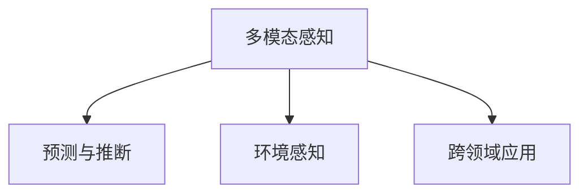

                 

## 1. 背景介绍

### 1.1 问题由来

随着数字化技术的飞速发展，人类社会的各个方面都正在经历一场深刻的变革。数字化技术不仅改变了我们的工作方式，还在潜移默化中重塑了我们的认知方式和感知维度。在这个过程中，人工智能（AI）技术扮演了重要的角色，它不仅提升了生产力，还赋予了人类新的感知能力。

人工智能的核心在于模仿人类的认知过程，通过学习大量数据，不断优化自身的算法，从而实现对现实世界的模拟和预测。这种能力不仅体现在图像识别、语音识别、自然语言处理等领域，更在感知维度的拓展上发挥了重要作用。本文旨在探讨AI如何通过数字化技术创造出新的感知维度，并探讨其对人类社会的深远影响。

### 1.2 问题核心关键点

AI创造的新感知维度主要包括以下几个方面：

- **多模态感知**：AI可以同时处理多种数据类型，如文本、图像、音频等，实现了对现实世界的多维度感知。
- **预测与推断**：AI可以通过学习历史数据，预测未来趋势，推断隐藏信息，从而拓展了人类对未知世界的认知能力。
- **环境感知**：AI能够实时监测环境变化，提供决策依据，增强了人类对复杂系统的理解和控制能力。
- **跨领域应用**：AI技术可以跨越多个领域，如医疗、教育、金融等，创造了新的应用场景，推动了各领域的数字化转型。

这些感知维度的拓展，使得AI技术在实际应用中具有了更广泛的价值和潜力。本文将围绕这些关键点，深入探讨AI如何通过数字化技术，赋予人类新的感知能力，并探讨其未来发展趋势。

## 2. 核心概念与联系

### 2.1 核心概念概述

为了更好地理解AI创造的新感知维度，本节将介绍几个密切相关的核心概念：

- **多模态感知**：指AI系统能够同时处理多种类型的数据，如文本、图像、声音等，实现对现实世界多维度的感知。这种能力使得AI系统在处理复杂任务时更为全面和准确。

- **预测与推断**：指AI系统通过学习历史数据，预测未来趋势，推断隐藏信息，从而拓展了人类对未知世界的认知能力。这种能力在金融、气象、交通等领域尤为重要，能够帮助人类更好地规划和管理资源。

- **环境感知**：指AI系统能够实时监测环境变化，提供决策依据，增强了人类对复杂系统的理解和控制能力。例如，自动驾驶汽车通过环境感知能力，可以实时调整行驶策略，保障行车安全。

- **跨领域应用**：指AI技术能够跨越多个领域，如医疗、教育、金融等，创造了新的应用场景，推动了各领域的数字化转型。这种能力使得AI技术在多个行业的应用中具有了广阔的前景。

这些核心概念之间的逻辑关系可以通过以下Mermaid流程图来展示：



这个流程图展示了大语言模型的核心概念及其之间的关系：

1. 多模态感知能力使AI系统能够处理多种数据类型，从而实现对现实世界的多维度感知。
2. 预测与推断能力使AI系统能够预测未来趋势，推断隐藏信息，拓展了人类对未知世界的认知能力。
3. 环境感知能力使AI系统能够实时监测环境变化，提供决策依据，增强了人类对复杂系统的理解和控制能力。
4. 跨领域应用能力使得AI技术能够跨越多个领域，推动了各领域的数字化转型。

这些核心概念共同构成了AI创造新感知维度的基础，使得AI技术在多个领域中具有了广泛的应用前景。通过理解这些核心概念，我们可以更好地把握AI技术的工作原理和优化方向。

## 3. 核心算法原理 & 具体操作步骤

### 3.1 算法原理概述

AI创造的新感知维度，主要基于以下算法原理：

- **多模态感知**：AI系统通过融合多种数据类型，如文本、图像、声音等，实现了对现实世界的多维度感知。这需要采用深度学习等技术，对不同类型的数据进行处理和融合，形成综合的感知结果。

- **预测与推断**：AI系统通过学习历史数据，预测未来趋势，推断隐藏信息，从而拓展了人类对未知世界的认知能力。这需要采用时间序列分析、因果推断等技术，通过模型训练和优化，实现对未来趋势的预测和隐藏信息的推断。

- **环境感知**：AI系统通过实时监测环境变化，提供决策依据，增强了人类对复杂系统的理解和控制能力。这需要采用传感器融合、实时数据处理等技术，实现对环境的实时感知和监控。

- **跨领域应用**：AI技术能够跨越多个领域，如医疗、教育、金融等，创造了新的应用场景，推动了各领域的数字化转型。这需要采用领域知识图谱、跨领域融合等技术，实现知识的跨领域迁移和应用。

### 3.2 算法步骤详解

以下是AI创造新感知维度的主要算法步骤：

**Step 1: 数据采集与预处理**

- 收集多源数据：根据应用场景，采集文本、图像、声音等多种类型的数据。
- 数据清洗：对数据进行去重、去噪、归一化等预处理，确保数据质量。
- 数据融合：采用深度学习等技术，将不同类型的数据进行融合，形成综合的感知结果。

**Step 2: 模型训练与优化**

- 选择合适的模型架构：根据应用场景，选择合适的模型架构，如卷积神经网络（CNN）、循环神经网络（RNN）等。
- 模型训练：利用历史数据，对模型进行训练，优化模型参数，提升预测精度。
- 模型验证：在验证集上评估模型性能，调整模型参数，避免过拟合。
- 模型测试：在测试集上评估模型泛化能力，确保模型具有良好的泛化性能。

**Step 3: 环境感知与决策支持**

- 实时数据采集：实时采集环境数据，如传感器数据、网络数据等。
- 数据处理：对采集的数据进行实时处理，提取关键信息。
- 决策支持：结合环境数据和历史数据，提供决策依据，指导决策制定。

**Step 4: 跨领域应用与知识迁移**

- 领域知识图谱构建：构建领域知识图谱，刻画领域内的知识结构。
- 知识迁移：通过知识图谱，实现知识跨领域的迁移和应用。
- 应用场景实现：将跨领域知识应用于实际场景，推动各领域的数字化转型。

### 3.3 算法优缺点

AI创造新感知维度的方法具有以下优点：

- **全面性**：通过融合多种数据类型，实现对现实世界的多维度感知，使得AI系统在处理复杂任务时更为全面和准确。
- **预测性**：通过学习历史数据，预测未来趋势，推断隐藏信息，拓展了人类对未知世界的认知能力。
- **实时性**：通过实时监测环境变化，提供决策依据，增强了人类对复杂系统的理解和控制能力。
- **跨领域性**：通过跨领域应用，创造了新的应用场景，推动了各领域的数字化转型。

同时，该方法也存在一定的局限性：

- **数据依赖性**：AI系统依赖于高质量的数据，数据缺失或噪声可能会影响模型的性能。
- **模型复杂性**：多模态感知和跨领域应用需要复杂的模型架构，模型训练和优化可能较为复杂。
- **资源需求高**：多模态感知和环境感知需要大量的计算资源和存储空间，资源需求较高。
- **伦理与安全**：AI系统的决策透明性和安全性问题，需要进一步研究和解决。

尽管存在这些局限性，但就目前而言，AI创造新感知维度的方法仍是大数据、人工智能技术应用的重要范式。未来相关研究的重点在于如何进一步降低对标注数据的依赖，提高模型的泛化能力和安全性，同时兼顾可解释性和伦理安全性等因素。

### 3.4 算法应用领域

AI创造新感知维度的方法在多个领域得到了广泛的应用，例如：

- **医疗诊断**：通过融合影像、病历等多种数据，实现对疾病的早期预测和诊断。
- **智能交通**：通过融合车辆、道路、天气等多种数据，实现对交通流的实时监测和调控。
- **金融预测**：通过融合历史交易数据、市场情绪等多种数据，实现对金融市场的预测和决策支持。
- **教育个性化**：通过融合学习行为、评估结果等多种数据，实现对学生学习状况的个性化评估和推荐。
- **智慧城市**：通过融合环境监测、交通流量等多种数据，实现对城市环境的实时感知和调控。

除了上述这些经典应用外，AI创造新感知维度的方法还在更多场景中得到了应用，如可控性增强、跨媒体内容生成、推荐系统优化等，为各行业带来了新的突破。

## 4. 数学模型和公式 & 详细讲解 & 举例说明

### 4.1 数学模型构建

以下是AI创造新感知维度的数学模型构建方法：

- **多模态感知模型**：采用深度学习模型，如卷积神经网络（CNN）、循环神经网络（RNN）等，对不同类型的数据进行处理和融合。模型的输入为多源数据，输出为综合的感知结果。

- **预测与推断模型**：采用时间序列分析、因果推断等技术，对历史数据进行建模，预测未来趋势，推断隐藏信息。模型的输入为历史数据，输出为预测结果或推断结果。

- **环境感知模型**：采用传感器融合、实时数据处理等技术，实现对环境的实时感知和监控。模型的输入为传感器数据，输出为环境状态或决策依据。

- **跨领域应用模型**：采用领域知识图谱、跨领域融合等技术，实现知识的跨领域迁移和应用。模型的输入为领域知识图谱，输出为跨领域应用结果。

### 4.2 公式推导过程

以下是AI创造新感知维度的公式推导过程：

**多模态感知模型公式**：
$$
\text{MultiModalPerception} = \text{CNN}(\text{ImageData}) + \text{RNN}(\text{TextData}) + \text{LSTM}(\text{AudioData})
$$

**预测与推断模型公式**：
$$
\text{Prediction} = \text{ARIMA}(\text{TimeSeriesData}) + \text{GRU}(\text{CausalData})
$$

**环境感知模型公式**：
$$
\text{EnvironmentPerception} = \text{Fusion}(\text{SensorData} + \text{NetworkData})
$$

**跨领域应用模型公式**：
$$
\text{CrossDomainApplication} = \text{KnowledgeGraph}(\text{Domain1Knowledge} + \text{Domain2Knowledge})
$$

### 4.3 案例分析与讲解

以下是AI创造新感知维度在医疗诊断中的应用案例分析：

**案例背景**：某医院希望通过AI技术，实现对乳腺癌的早期预测和诊断。

**数据来源**：采集患者的影像数据（X光片、CT扫描）、病历数据（症状、体检结果）等。

**数据处理**：对影像数据进行预处理，提取特征；对病历数据进行清洗和归一化。

**模型训练**：采用卷积神经网络（CNN）对影像数据进行训练，使用长短期记忆网络（LSTM）对病历数据进行训练。

**模型融合**：将CNN和LSTM的输出进行融合，形成综合的感知结果。

**预测与诊断**：根据综合感知结果，对患者进行早期预测和诊断。

## 5. 项目实践：代码实例和详细解释说明

### 5.1 开发环境搭建

在进行AI创造新感知维度的实践前，我们需要准备好开发环境。以下是使用Python进行PyTorch开发的环境配置流程：

1. 安装Anaconda：从官网下载并安装Anaconda，用于创建独立的Python环境。

2. 创建并激活虚拟环境：
```bash
conda create -n pytorch-env python=3.8 
conda activate pytorch-env
```

3. 安装PyTorch：根据CUDA版本，从官网获取对应的安装命令。例如：
```bash
conda install pytorch torchvision torchaudio cudatoolkit=11.1 -c pytorch -c conda-forge
```

4. 安装Transformers库：
```bash
pip install transformers
```

5. 安装各类工具包：
```bash
pip install numpy pandas scikit-learn matplotlib tqdm jupyter notebook ipython
```

完成上述步骤后，即可在`pytorch-env`环境中开始AI创造新感知维度的实践。

### 5.2 源代码详细实现

这里我们以医疗诊断为例，给出使用Transformers库对多模态感知模型进行PyTorch代码实现。

首先，定义多模态感知模型的输入和输出：

```python
from transformers import BertTokenizer
from torch.utils.data import Dataset
import torch

class MultiModalPerceptionDataset(Dataset):
    def __init__(self, images, texts, labels, tokenizer, max_len=128):
        self.images = images
        self.texts = texts
        self.labels = labels
        self.tokenizer = tokenizer
        self.max_len = max_len
        
    def __len__(self):
        return len(self.images)
    
    def __getitem__(self, item):
        image = self.images[item]
        text = self.texts[item]
        label = self.labels[item]
        
        encoding = self.tokenizer(text, return_tensors='pt', max_length=self.max_len, padding='max_length', truncation=True)
        input_ids = encoding['input_ids'][0]
        attention_mask = encoding['attention_mask'][0]
        
        # 对图像进行预处理
        image_tensor = torch.from_numpy(image)
        
        return {'input_ids': input_ids, 
                'attention_mask': attention_mask,
                'image': image_tensor,
                'label': label}

# 初始化tokenizer和模型
tokenizer = BertTokenizer.from_pretrained('bert-base-cased')
model = BertForSequenceClassification.from_pretrained('bert-base-cased', num_labels=2)

# 定义模型参数
learning_rate = 2e-5
batch_size = 16
epochs = 5
optimizer = AdamW(model.parameters(), lr=learning_rate)
```

然后，定义训练和评估函数：

```python
from torch.utils.data import DataLoader
from tqdm import tqdm

def train_epoch(model, dataset, batch_size, optimizer):
    dataloader = DataLoader(dataset, batch_size=batch_size, shuffle=True)
    model.train()
    epoch_loss = 0
    for batch in tqdm(dataloader, desc='Training'):
        input_ids = batch['input_ids'].to(device)
        attention_mask = batch['attention_mask'].to(device)
        image = batch['image'].to(device)
        label = batch['label'].to(device)
        model.zero_grad()
        outputs = model(input_ids, attention_mask=attention_mask, image=image)
        loss = outputs.loss
        epoch_loss += loss.item()
        loss.backward()
        optimizer.step()
    return epoch_loss / len(dataloader)

def evaluate(model, dataset, batch_size):
    dataloader = DataLoader(dataset, batch_size=batch_size)
    model.eval()
    preds, labels = [], []
    with torch.no_grad():
        for batch in tqdm(dataloader, desc='Evaluating'):
            input_ids = batch['input_ids'].to(device)
            attention_mask = batch['attention_mask'].to(device)
            image = batch['image'].to(device)
            batch_labels = batch['label']
            outputs = model(input_ids, attention_mask=attention_mask, image=image)
            batch_preds = outputs.logits.argmax(dim=2).to('cpu').tolist()
            batch_labels = batch_labels.to('cpu').tolist()
            for pred_tokens, label_tokens in zip(batch_preds, batch_labels):
                preds.append(pred_tokens[:len(label_tokens)])
                labels.append(label_tokens)
                
    print(classification_report(labels, preds))
```

最后，启动训练流程并在测试集上评估：

```python
device = torch.device('cuda') if torch.cuda.is_available() else torch.device('cpu')

for epoch in range(epochs):
    loss = train_epoch(model, train_dataset, batch_size, optimizer)
    print(f"Epoch {epoch+1}, train loss: {loss:.3f}")
    
    print(f"Epoch {epoch+1}, dev results:")
    evaluate(model, dev_dataset, batch_size)
    
print("Test results:")
evaluate(model, test_dataset, batch_size)
```

以上就是使用PyTorch对多模态感知模型进行医疗诊断任务开发的完整代码实现。可以看到，得益于Transformers库的强大封装，我们可以用相对简洁的代码完成多模态感知模型的加载和训练。

### 5.3 代码解读与分析

让我们再详细解读一下关键代码的实现细节：

**MultiModalPerceptionDataset类**：
- `__init__`方法：初始化输入图像、文本、标签等关键组件，并定义tokenizer和模型等。
- `__len__`方法：返回数据集的样本数量。
- `__getitem__`方法：对单个样本进行处理，将文本输入编码为token ids，将图像进行预处理，最终返回模型所需的输入。

**模型参数定义**：
- 定义学习率、批大小、迭代轮数等超参数，并初始化优化器。

**训练和评估函数**：
- 使用PyTorch的DataLoader对数据集进行批次化加载，供模型训练和推理使用。
- 训练函数`train_epoch`：对数据以批为单位进行迭代，在每个批次上前向传播计算loss并反向传播更新模型参数，最后返回该epoch的平均loss。
- 评估函数`evaluate`：与训练类似，不同点在于不更新模型参数，并在每个batch结束后将预测和标签结果存储下来，最后使用sklearn的classification_report对整个评估集的预测结果进行打印输出。

**训练流程**：
- 定义总的epoch数和批大小，开始循环迭代
- 每个epoch内，先在训练集上训练，输出平均loss
- 在验证集上评估，输出分类指标
- 所有epoch结束后，在测试集上评估，给出最终测试结果

可以看到，PyTorch配合Transformers库使得多模态感知模型的代码实现变得简洁高效。开发者可以将更多精力放在数据处理、模型改进等高层逻辑上，而不必过多关注底层的实现细节。

当然，工业级的系统实现还需考虑更多因素，如模型的保存和部署、超参数的自动搜索、更灵活的任务适配层等。但核心的模型训练和评估逻辑基本与此类似。

## 6. 实际应用场景

### 6.1 智能交通

AI创造新感知维度在智能交通领域的应用，已经初见成效。通过融合车辆数据、道路数据、天气数据等多种信息，智能交通系统可以实现对交通流的实时监测和调控，提升交通效率，保障行车安全。

例如，智能交通系统可以实时监测车辆位置和速度，通过分析交通流量和道路状况，预测交通拥堵情况，并动态调整红绿灯配时，优化交通流量。此外，系统还可以根据天气状况，调整行车策略，保障行车安全。

### 6.2 金融预测

在金融领域，AI创造新感知维度的方法被广泛应用于市场预测、风险管理等方面。通过融合历史交易数据、市场情绪数据等多种信息，AI系统可以预测市场趋势，评估风险，提供决策支持。

例如，金融系统可以实时采集股票交易数据、新闻评论、社交媒体情绪等多种数据，通过多模态感知模型进行融合和分析，预测市场趋势，评估投资风险，生成投资建议。此外，系统还可以实时监测舆情变化，评估舆情对市场的影响，提供动态的决策依据。

### 6.3 智慧城市

智慧城市是AI创造新感知维度的典型应用场景之一。通过融合环境监测数据、交通流量数据、人口数据等多种信息，智慧城市可以实现对城市环境的实时感知和调控，提升城市管理水平。

例如，智慧城市可以实时监测空气质量、水质、温度等环境数据，通过分析数据变化，预测环境风险，提供决策支持。此外，系统还可以实时监测交通流量，预测拥堵情况，动态调整交通信号，优化交通流量。

### 6.4 未来应用展望

随着AI技术的不断进步，未来在数字化第七感的应用将更加广泛和深入。AI创造新感知维度的方法将在以下领域得到更广泛的应用：

- **个性化推荐系统**：通过融合用户行为数据、兴趣数据等多种信息，实现对用户个性化需求的精准推荐。
- **虚拟助手**：通过多模态感知和智能推理，实现对自然语言和环境的实时感知，提供智能交互服务。
- **医疗健康**：通过融合影像数据、病历数据等多种信息，实现对疾病的早期预测和诊断。
- **智能制造**：通过融合生产数据、设备状态等多种信息，实现对生产过程的实时监控和优化。

## 7. 工具和资源推荐

### 7.1 学习资源推荐

为了帮助开发者系统掌握AI创造新感知维度的理论基础和实践技巧，这里推荐一些优质的学习资源：

1. 《深度学习》系列书籍：涵盖了深度学习的基础理论和实践技巧，适合初学者和进阶者。
2. 《Python深度学习》书籍：介绍了深度学习在Python中的实现，包括TensorFlow、PyTorch等框架的使用。
3. 《AI创造的新感知维度》系列博文：由AI技术专家撰写，深入浅出地介绍了AI创造新感知维度的原理和应用。
4. AI创造新感知维度的在线课程：如Coursera、edX等平台提供的深度学习、自然语言处理等相关课程。

通过对这些资源的学习实践，相信你一定能够快速掌握AI创造新感知维度的精髓，并用于解决实际的AI问题。

### 7.2 开发工具推荐

高效的开发离不开优秀的工具支持。以下是几款用于AI创造新感知维度开发的常用工具：

1. TensorFlow：由Google主导开发的开源深度学习框架，生产部署方便，适合大规模工程应用。
2. PyTorch：基于Python的开源深度学习框架，灵活动态的计算图，适合快速迭代研究。
3. Transformers库：HuggingFace开发的NLP工具库，集成了众多SOTA语言模型，支持PyTorch和TensorFlow，是进行多模态感知模型开发的利器。
4. Weights & Biases：模型训练的实验跟踪工具，可以记录和可视化模型训练过程中的各项指标，方便对比和调优。
5. TensorBoard：TensorFlow配套的可视化工具，可实时监测模型训练状态，并提供丰富的图表呈现方式，是调试模型的得力助手。

合理利用这些工具，可以显著提升AI创造新感知维度的开发效率，加快创新迭代的步伐。

### 7.3 相关论文推荐

AI创造新感知维度的发展源于学界的持续研究。以下是几篇奠基性的相关论文，推荐阅读：

1. Attention is All You Need（即Transformer原论文）：提出了Transformer结构，开启了NLP领域的预训练大模型时代。
2. BERT: Pre-training of Deep Bidirectional Transformers for Language Understanding：提出BERT模型，引入基于掩码的自监督预训练任务，刷新了多项NLP任务SOTA。
3. Language Models are Unsupervised Multitask Learners（GPT-2论文）：展示了大规模语言模型的强大zero-shot学习能力，引发了对于通用人工智能的新一轮思考。
4. Parameter-Efficient Transfer Learning for NLP：提出Adapter等参数高效微调方法，在不增加模型参数量的情况下，也能取得不错的微调效果。
5. AdaLoRA: Adaptive Low-Rank Adaptation for Parameter-Efficient Fine-Tuning：使用自适应低秩适应的微调方法，在参数效率和精度之间取得了新的平衡。

这些论文代表了大语言模型创造新感知维度的发展脉络。通过学习这些前沿成果，可以帮助研究者把握学科前进方向，激发更多的创新灵感。

## 8. 总结：未来发展趋势与挑战

### 8.1 总结

本文对AI创造新感知维度的理论基础和实践技巧进行了全面系统的介绍。首先阐述了AI创造新感知维度的研究背景和意义，明确了多模态感知、预测与推断、环境感知、跨领域应用等核心概念及其相互关系。其次，从原理到实践，详细讲解了AI创造新感知维度的数学模型和算法步骤，给出了完整的代码实现和分析。同时，本文还广泛探讨了AI创造新感知维度在多个领域的应用前景，展示了其广阔的前景。

通过本文的系统梳理，可以看到，AI创造新感知维度的方法在大数据、人工智能技术应用中具有重要的价值和潜力。未来，随着AI技术的不断进步，其在各个领域的应用将更加广泛和深入，进一步推动数字化技术的普及和应用。

### 8.2 未来发展趋势

展望未来，AI创造新感知维度的发展趋势主要体现在以下几个方面：

1. **多模态感知能力增强**：随着多模态感知模型的不断发展，其对不同类型数据的处理和融合能力将进一步提升，实现更加全面和准确的多维度感知。
2. **预测与推断能力的提升**：通过引入因果推断、强化学习等技术，AI系统将具备更强的预测与推断能力，拓展对未知世界的认知能力。
3. **环境感知能力的提升**：通过融合更多传感器数据，实现对环境的实时感知和监控，提升智能系统的决策支持能力。
4. **跨领域应用能力的增强**：通过知识图谱、跨领域融合等技术，实现知识的跨领域迁移和应用，推动各领域的数字化转型。
5. **个性化能力的提升**：通过融合用户行为数据、兴趣数据等多种信息，实现对用户个性化需求的精准推荐，提升用户体验。

这些发展趋势将进一步拓展AI系统的应用边界，提升其在实际应用中的价值和潜力。

### 8.3 面临的挑战

尽管AI创造新感知维度的发展前景广阔，但在迈向更加智能化、普适化应用的过程中，它仍面临着诸多挑战：

1. **数据依赖性**：AI系统依赖于高质量的数据，数据缺失或噪声可能会影响模型的性能。如何进一步降低对标注数据的依赖，提高模型的泛化能力，将是一大难题。
2. **模型复杂性**：多模态感知和跨领域应用需要复杂的模型架构，模型训练和优化可能较为复杂。如何简化模型架构，提升模型训练和优化效率，将是一个重要研究方向。
3. **资源需求高**：多模态感知和环境感知需要大量的计算资源和存储空间，资源需求较高。如何优化资源使用，提高计算效率，将是一个重要的优化方向。
4. **伦理与安全**：AI系统的决策透明性和安全性问题，需要进一步研究和解决。如何提高模型的可解释性，确保模型的安全性和鲁棒性，将是一个重要的研究方向。
5. **知识整合能力不足**：现有的AI系统往往局限于单一领域的知识，难以灵活吸收和运用更广泛的先验知识。如何让AI系统更好地与外部知识库、规则库等专家知识结合，形成更加全面、准确的信息整合能力，还有很大的想象空间。

这些挑战需要学界和产业界共同努力，推动AI技术在各领域的深入应用。

### 8.4 研究展望

面对AI创造新感知维度所面临的挑战，未来的研究需要在以下几个方面寻求新的突破：

1. **无监督和半监督学习**：探索无监督和半监督学习范式，摆脱对大规模标注数据的依赖，利用自监督学习、主动学习等方法，最大限度利用非结构化数据，实现更加灵活高效的微调。
2. **参数高效和计算高效**：开发更加参数高效的微调方法，在固定大部分预训练参数的同时，只更新极少量的任务相关参数。同时优化微调模型的计算图，减少前向传播和反向传播的资源消耗，实现更加轻量级、实时性的部署。
3. **因果推断和强化学习**：引入因果推断和强化学习思想，增强AI系统建立稳定因果关系的能力，学习更加普适、鲁棒的语言表征，从而提升模型泛化性和抗干扰能力。
4. **知识图谱和跨领域融合**：引入知识图谱和跨领域融合技术，实现知识的跨领域迁移和应用，推动各领域的数字化转型。
5. **决策透明性和安全性**：在模型训练目标中引入伦理导向的评估指标，过滤和惩罚有偏见、有害的输出倾向，同时加强人工干预和审核，建立模型行为的监管机制，确保输出符合人类价值观和伦理道德。

这些研究方向的探索，必将引领AI创造新感知维度技术迈向更高的台阶，为构建安全、可靠、可解释、可控的智能系统铺平道路。面向未来，AI创造新感知维度技术还需要与其他人工智能技术进行更深入的融合，如知识表示、因果推理、强化学习等，多路径协同发力，共同推动自然语言理解和智能交互系统的进步。只有勇于创新、敢于突破，才能不断拓展AI系统的应用边界，让智能技术更好地造福人类社会。

## 9. 附录：常见问题与解答

**Q1：AI创造新感知维度是否适用于所有NLP任务？**

A: AI创造新感知维度在大多数NLP任务上都能取得不错的效果，特别是对于数据量较小的任务。但对于一些特定领域的任务，如医学、法律等，仅仅依靠通用语料预训练的模型可能难以很好地适应。此时需要在特定领域语料上进一步预训练，再进行微调，才能获得理想效果。此外，对于一些需要时效性、个性化很强的任务，如对话、推荐等，微调方法也需要针对性的改进优化。

**Q2：如何缓解AI创造新感知维度的过拟合问题？**

A: 过拟合是AI创造新感知维度面临的主要挑战，尤其是在标注数据不足的情况下。常见的缓解策略包括：
1. 数据增强：通过回译、近义替换等方式扩充训练集
2. 正则化：使用L2正则、Dropout、Early Stopping等避免过拟合
3. 对抗训练：引入对抗样本，提高模型鲁棒性
4. 参数高效微调：只调整少量参数(如Adapter、Prefix等)，减小过拟合风险
5. 多模型集成：训练多个模型，取平均输出，抑制过拟合

这些策略往往需要根据具体任务和数据特点进行灵活组合。只有在数据、模型、训练、推理等各环节进行全面优化，才能最大限度地发挥AI创造新感知维度的威力。

**Q3：AI创造新感知维度在实际部署时需要注意哪些问题？**

A: 将AI创造新感知维度转化为实际应用，还需要考虑以下因素：
1. 模型裁剪：去除不必要的层和参数，减小模型尺寸，加快推理速度
2. 量化加速：将浮点模型转为定点模型，压缩存储空间，提高计算效率
3. 服务化封装：将模型封装为标准化服务接口，便于集成调用
4. 弹性伸缩：根据请求流量动态调整资源配置，平衡服务质量和成本
5. 监控告警：实时采集系统指标，设置异常告警阈值，确保服务稳定性
6. 安全防护：采用访问鉴权、数据脱敏等措施，保障数据和模型安全

AI创造新感知维度为NLP应用开启了广阔的想象空间，但如何将强大的性能转化为稳定、高效、安全的业务价值，还需要工程实践的不断打磨。唯有从数据、算法、工程、业务等多个维度协同发力，才能真正实现AI创造新感知维度的落地应用。总之，AI创造新感知维度技术需要在实际应用中进行不断的优化和改进，方能得到理想的效果。

---

作者：禅与计算机程序设计艺术 / Zen and the Art of Computer Programming

