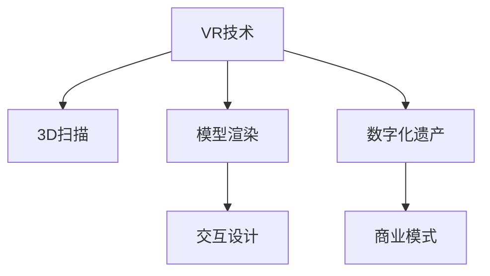

                 

# 数字化遗产VR重现创业：与逝者的虚拟重逢

## 1. 背景介绍

### 1.1 问题由来
随着科技的飞速发展和社会的变迁，数字化遗产已成为当今社会不可忽视的重要问题。传统遗产保护和传承依赖于物理形态的载体，如纸张、碑刻等。然而，数字化技术的崛起，使得人们开始考虑利用数字手段来记录和保护人类文明。特别是，虚拟现实(VR)技术的日渐成熟，为数字化遗产的传承开辟了新天地。

具体而言，数字化遗产包括但不限于以下类型：
- **历史文献**：如古书籍、碑刻、档案等。通过扫描、数字化处理后，可以生成高清影像，再通过VR技术还原，供后人学习和研究。
- **历史建筑**：通过3D扫描和重建技术，可以生成可交互的历史建筑模型，使访客可以沉浸式体验历史风貌。
- **文化艺术品**：绘画、雕塑等艺术作品通过高清扫描和VR技术复原，可以让观众以立体方式欣赏艺术精品。
- **历史事件**：如重大战役、著名演出等，可以通过VR技术进行重现，提供沉浸式的历史体验。
- **个人回忆录**：利用VR技术，可以重现逝者的生平故事，让后人可以通过虚拟环境与逝者"重逢"。

虚拟现实技术使得数字化遗产的传承变得可能，而创业则是实现这一愿景的重要途径。通过创业，可以在资源、技术和市场等多方面取得突破，以实现数字化遗产的普及和推广。

### 1.2 问题核心关键点
数字化遗产VR重现创业的核心关键点包括以下几个方面：

- **数据采集与处理**：高质量的数据是实现VR重现的基础，需要采用专业的3D扫描技术、图像处理技术等，保证数据的质量和完整性。
- **VR建模与渲染**：通过3D建模软件，将采集到的数据转换为可交互的VR模型，并使用高效的渲染技术，使重现场景生动、逼真。
- **交互设计与体验优化**：设计交互式体验，使虚拟环境具有真实感和沉浸感，提升用户体验。
- **市场需求分析与推广**：评估市场接受度，选择合适的推广策略和渠道，确保产品能够被用户接受。
- **商业模式创新**：构建符合市场需求的商业模式，如订阅模式、定制服务模式等，确保项目可持续运营。

这些关键点构成了数字化遗产VR重现创业的核心框架，需系统、细致地设计和执行。

### 1.3 问题研究意义
数字化遗产VR重现创业具有重要意义，具体体现在以下几个方面：

- **文化传承与保护**：通过数字化手段，将文化遗产永久保存下来，避免因时间流逝而失去。
- **教育与传播**：为社会提供了一个生动、互动的学习平台，使教育更加形象、生动。
- **情感连接**：通过虚拟重现，人们可以与逝者"重逢"，产生强烈的情感共鸣。
- **商业创新**：为数字娱乐、旅游、教育等领域带来了新的发展机会。
- **技术突破**：推动3D扫描、VR渲染、交互设计等技术的发展和应用。

数字化遗产VR重现创业，不仅是文化遗产保护的重要方式，更是推动技术进步和商业创新的重要途径。

## 2. 核心概念与联系

### 2.1 核心概念概述

为更好地理解数字化遗产VR重现创业，本节将介绍几个密切相关的核心概念：

- **虚拟现实(VR)**：通过计算机技术模拟生成的三维虚拟环境，使参与者可以通过头戴显示器(HMD)、手柄等设备与虚拟场景进行互动，产生沉浸感。
- **数字化遗产**：利用数字手段，将人类历史、文化等遗产记录、保护和传承下来。
- **3D扫描**：利用光学、声学等技术，将实物对象的三维信息数字化，生成可交互的3D模型。
- **模型渲染**：将3D模型转化为具有逼真效果、细节丰富的图像，供人进行沉浸式体验。
- **交互设计**：设计用户与虚拟环境互动的方式，提升用户体验。
- **商业模式**：在保证产品市场认可的同时，实现企业可持续发展。

这些核心概念之间的逻辑关系可以通过以下Mermaid流程图来展示：



这个流程图展示了大语言模型微调的核心概念及其之间的关系：

1. VR技术为数字化遗产重现提供了一个互动的平台。
2. 3D扫描将实物对象转化为数字模型，是VR重现的基础。
3. 模型渲染将3D模型转化为可交互的图像，增强沉浸感。
4. 交互设计使虚拟环境生动逼真，提升用户体验。
5. 商业模式确保项目经济可行性，支持可持续运营。

这些概念共同构成了数字化遗产VR重现创业的技术基础和商业框架，使得项目能够有效实施并取得成功。

## 3. 核心算法原理 & 具体操作步骤

### 3.1 算法原理概述

数字化遗产VR重现创业的算法原理主要基于以下几个步骤：

1. **数据采集与预处理**：利用3D扫描技术获取历史物品的三维数据，并对其进行预处理，包括去噪、分割等，生成高质量的3D模型。
2. **模型重构**：通过3D建模软件将3D模型进行细化和重构，增加细节和纹理，提升视觉效果。
3. **渲染与优化**：使用高效的渲染引擎，将重构后的3D模型转化为高质量的图像序列，并优化渲染速度和效果。
4. **交互设计**：设计用户与虚拟环境交互的方式，如点击、拖拽、旋转等，提供沉浸式体验。
5. **体验优化**：根据用户反馈，不断优化虚拟环境，增强交互性和沉浸感。
6. **市场分析与推广**：评估目标市场，选择合适的推广渠道，进行市场教育和用户引导。

这些步骤涵盖了数字化遗产VR重现创业的主要技术环节，需系统地执行和管理。

### 3.2 算法步骤详解

数字化遗产VR重现创业的算法步骤详解如下：

**Step 1: 数据采集与预处理**

1. **3D扫描**：选择合适的3D扫描设备，对历史物品进行扫描，获取其三维数据。一般使用激光扫描、光学扫描等技术。
2. **预处理**：对扫描数据进行去噪、修复、分割等预处理，生成高质量的3D模型。常用的预处理软件包括MeshLab、Blender等。

**Step 2: 模型重构**

1. **建模软件**：使用Autodesk Maya、Blender等建模软件，对3D模型进行细化和重构。增加模型细节，如纹理、材质等。
2. **纹理映射**：为模型添加纹理，提升视觉真实感。可以使用专业的纹理映射工具，如Substance Painter。

**Step 3: 渲染与优化**

1. **渲染引擎**：选择合适的渲染引擎，如Unity3D、Unreal Engine等。使用高效的渲染技术，如光照贴图、体积渲染等，提升渲染速度和效果。
2. **渲染参数调整**：根据渲染效果，调整光照、阴影、分辨率等渲染参数，优化渲染性能。

**Step 4: 交互设计**

1. **交互方式设计**：设计用户与虚拟环境交互的方式，如点击、拖拽、旋转等。确保交互逻辑简单、直观。
2. **交互效果测试**：对交互效果进行测试，确保用户能够顺利地与虚拟环境互动。

**Step 5: 体验优化**

1. **用户反馈收集**：通过问卷、访谈等方式收集用户反馈，了解用户需求和痛点。
2. **体验优化**：根据用户反馈，不断优化虚拟环境，增强沉浸感和交互性。

**Step 6: 市场分析与推广**

1. **市场需求调研**：通过市场调研、数据分析等手段，了解目标市场的需求和趋势。
2. **推广策略制定**：选择合适的推广渠道，如社交媒体、教育机构、历史博物馆等，进行市场教育和用户引导。

### 3.3 算法优缺点

数字化遗产VR重现创业的算法具有以下优点：

1. **沉浸式体验**：通过虚拟现实技术，使用户能够沉浸式地体验历史场景，增强文化遗产的可接受度和教育效果。
2. **互动性强**：用户可以通过交互式体验，参与到数字化遗产的重现过程中，增加用户参与感和体验乐趣。
3. **保存永久性**：数字化遗产可以永久保存，避免因时间流逝而遗失。
4. **技术创新**：推动3D扫描、VR渲染、交互设计等技术的发展和应用。

然而，该算法也存在以下缺点：

1. **高成本**：高质量的3D扫描、建模和渲染技术需要高成本的设备和技术支持。
2. **复杂度高**：项目涉及多个技术环节，需要跨学科团队协同工作，复杂度高。
3. **用户接受度**：用户对VR技术的接受度尚未达到普遍认可的程度，推广难度较大。
4. **设备依赖**：用户需配备头戴显示器、手柄等设备，设备成本较高。

尽管存在这些缺点，但数字化遗产VR重现创业仍是一个极具潜力和前景的项目，值得进一步探索和实践。

### 3.4 算法应用领域

数字化遗产VR重现创业在多个领域具有广泛的应用前景，具体包括：

- **文化遗产保护与展示**：将历史文物、古建筑、艺术品等数字化重现，提供沉浸式展示平台。
- **历史教育**：利用虚拟现实技术，将历史事件、历史人物等生动再现，提供教育资源。
- **历史旅游**：为游客提供虚拟旅游体验，增强历史旅游的吸引力和趣味性。
- **文化创意**：开发虚拟现实游戏、电影等，推动文化创意产业的发展。
- **学术研究**：提供虚拟实验环境，供学者进行历史场景模拟和研究。

此外，数字化遗产VR重现创业还可在公共文化设施、科普教育、企业培训等领域广泛应用，带来深远的社会影响。

## 4. 数学模型和公式 & 详细讲解  
### 4.1 数学模型构建

本节将使用数学语言对数字化遗产VR重现创业的算法过程进行更加严格的刻画。

记数字化遗产为 $E$，采集到的3D模型为 $M$，渲染后的图像序列为 $I$，用户交互方式为 $I$。假设数字化遗产 $E$ 为 $n$ 个物品的集合，每个物品有 $d$ 个属性，则数字化遗产的数学模型为：

$$
E = \{e_1, e_2, ..., e_n\}, e_i = (a_{i1}, a_{i2}, ..., a_{id})
$$

其中 $e_i$ 为第 $i$ 个物品的属性集合，$a_{ij}$ 为第 $i$ 个物品的第 $j$ 个属性。

假设3D扫描设备采集到的3D模型为 $M = \{m_1, m_2, ..., m_n\}$，每个模型有 $m$ 个节点和 $n$ 个面，则3D模型的数学模型为：

$$
M = \{m_1, m_2, ..., m_n\}, m_i = \{v_{i1}, v_{i2}, ..., v_{im}\}
$$

其中 $m_i$ 为第 $i$ 个模型的节点和面的集合，$v_{ij}$ 为第 $i$ 个模型第 $j$ 个节点的位置坐标。

假设渲染后的图像序列为 $I = \{i_1, i_2, ..., i_N\}$，每张图像有 $h$ 个像素，则图像序列的数学模型为：

$$
I = \{i_1, i_2, ..., i_N\}, i_j = \{p_{j1}, p_{j2}, ..., p_{jh}\}
$$

其中 $i_j$ 为第 $j$ 张图像的像素坐标集合，$p_{jk}$ 为第 $j$ 张图像第 $k$ 个像素的灰度值或RGB值。

假设用户交互方式为 $I = \{i_1, i_2, ..., i_N\}$，每个交互方式有 $k$ 个操作，则交互方式的数学模型为：

$$
I = \{i_1, i_2, ..., i_N\}, i_j = \{o_{j1}, o_{j2}, ..., o_{jk}\}
$$

其中 $i_j$ 为第 $j$ 个交互方式的操作集合，$o_{jk}$ 为第 $j$ 个交互方式的第 $k$ 个操作。

### 4.2 公式推导过程

以下我们以历史文物数字化重现为例，推导虚拟现实重现的数学模型及其计算公式。

假设历史文物 $e_i$ 有 $d=3$ 个属性，即长度、宽度、高度。通过3D扫描，采集到3D模型 $m_i$，包含 $n=100$ 个节点和 $m=200$ 个面。渲染后的图像序列 $i_j$ 包含 $N=100$ 张图像，每张图像有 $h=1920 \times 1080 = 20736$ 个像素。用户交互方式 $i_j$ 包含 $K=10$ 个操作，如点击、拖拽、旋转等。

1. **3D模型重构**：

    假设3D模型重构后的节点数量为 $m' = 2m$，面数量为 $n' = m'$。

    模型重构的数学模型为：
    $$
    M' = \{m'_1, m'_2, ..., m'_n'\}, m'_i = \{v'_{i1}, v'_{i2}, ..., v'_{im'}\}
    $$

    其中 $m'_i$ 为第 $i$ 个模型的节点和面的集合，$v'_{ij}$ 为第 $i$ 个模型第 $j$ 个节点的位置坐标。

2. **图像渲染**：

    假设渲染后的图像序列 $i_j$ 包含 $N = 100$ 张图像，每张图像有 $h = 1920 \times 1080 = 20736$ 个像素。

    图像渲染的数学模型为：
    $$
    I = \{i_1, i_2, ..., i_N\}, i_j = \{p_{j1}, p_{j2}, ..., p_{jh}\}
    $$

    其中 $i_j$ 为第 $j$ 张图像的像素坐标集合，$p_{jk}$ 为第 $j$ 张图像第 $k$ 个像素的灰度值或RGB值。

3. **用户交互设计**：

    假设用户交互方式 $i_j$ 包含 $K = 10$ 个操作，如点击、拖拽、旋转等。

    用户交互设计的数学模型为：
    $$
    I = \{i_1, i_2, ..., i_N\}, i_j = \{o_{j1}, o_{j2}, ..., o_{jk}\}
    $$

    其中 $i_j$ 为第 $j$ 个交互方式的操作集合，$o_{jk}$ 为第 $j$ 个交互方式的第 $k$ 个操作。

通过这些数学模型，我们可以更加清晰地描述数字化遗产VR重现创业的各个环节，进而进行具体的算法设计和实现。

## 5. 项目实践：代码实例和详细解释说明

### 5.1 开发环境搭建

在进行数字化遗产VR重现创业的项目实践前，我们需要准备好开发环境。以下是使用Python进行Unity3D开发的环境配置流程：

1. 安装Unity3D：从官网下载安装Unity3D，创建新的Unity项目。

2. 安装必要的插件和库：

    - 安装3D扫描插件，如Sketchfab、MeshLab等。
    - 安装渲染插件，如Unity Asset Store中的渲染工具包。
    - 安装交互设计插件，如Unity UI、Nimbus Interactive等。

3. 创建项目文件：在Unity Hub中创建新的Unity项目，指定项目路径和配置信息。

4. 配置开发环境：根据项目需求，配置好所需的开发工具和资源，如Visual Studio、Blender等。

完成上述步骤后，即可在Unity3D环境中开始项目实践。

### 5.2 源代码详细实现

这里我们以历史建筑数字化重现为例，给出使用Unity3D进行VR重现的代码实现。

**Step 1: 数据采集与预处理**

1. **3D扫描**：使用Sketchfab等工具，对历史建筑进行3D扫描，获取其三维数据。
2. **预处理**：使用MeshLab等工具，对扫描数据进行去噪、修复、分割等预处理，生成高质量的3D模型。

**Step 2: 模型重构**

1. **导入3D模型**：在Unity3D中，通过Unity Asset Store导入重构后的3D模型，并进行渲染设置。
2. **添加材质和纹理**：为模型添加材质和纹理，提升视觉效果。

**Step 3: 渲染与优化**

1. **渲染设置**：在Unity3D中，使用Unity Asset Store中的渲染工具包，设置光照、阴影、分辨率等渲染参数。
2. **渲染优化**：对渲染结果进行测试，优化渲染性能，确保流畅度。

**Step 4: 交互设计**

1. **交互控件**：在Unity3D中，使用Unity UI或Nimbus Interactive等插件，设计交互控件，如点击、拖拽、旋转等。
2. **交互事件处理**：为交互控件添加事件处理函数，响应用户的交互操作。

**Step 5: 体验优化**

1. **用户反馈收集**：通过问卷、访谈等方式收集用户反馈，了解用户需求和痛点。
2. **体验优化**：根据用户反馈，不断优化虚拟环境，增强沉浸感和交互性。

**Step 6: 市场分析与推广**

1. **市场需求调研**：通过市场调研、数据分析等手段，了解目标市场的需求和趋势。
2. **推广策略制定**：选择合适的推广渠道，如社交媒体、教育机构、历史博物馆等，进行市场教育和用户引导。

### 5.3 代码解读与分析

让我们再详细解读一下关键代码的实现细节：

**3D模型导入与渲染**

```csharp
using UnityEngine;
using Unity3D asset package;

public class ModelImporter : MonoBehaviour
{
    public GameObject modelObject;
    public Shader materialShader;

    void Start()
    {
        MeshFilter meshFilter = modelObject.GetComponent<MeshFilter>();
        Mesh mesh = new Mesh();
        mesh.vertices = new Vector3[modelObject.GetComponent<Mesh>().vertices.Length];
        mesh.triangles = new int[modelObject.GetComponent<Mesh>().triangles.Length];
        mesh.uv = new Vector2[modelObject.GetComponent<Mesh>().uv.Length];
        mesh.uv2 = new Vector2[modelObject.GetComponent<Mesh>().uv2.Length];
        mesh.normals = new Vector3[modelObject.GetComponent<Mesh>().normals.Length];
        mesh.colors = new Color[modelObject.GetComponent<Mesh>().colors.Length];

        for (int i = 0; i < modelObject.GetComponent<Mesh>().vertices.Length; i++)
        {
            mesh.vertices[i] = modelObject.GetComponent<Mesh>().vertices[i];
            mesh.uv[i] = modelObject.GetComponent<Mesh>().uv[i];
            mesh.uv2[i] = modelObject.GetComponent<Mesh>().uv2[i];
            mesh.normals[i] = modelObject.GetComponent<Mesh>().normals[i];
            mesh.colors[i] = modelObject.GetComponent<Mesh>().colors[i];
        }

        for (int i = 0; i < modelObject.GetComponent<Mesh>().subMeshCount; i++)
        {
            mesh.triangles[i * 3] = modelObject.GetComponent<Mesh>().triangles[i * 3];
            mesh.triangles[i * 3 + 1] = modelObject.GetComponent<Mesh>().triangles[i * 3 + 1];
            mesh.triangles[i * 3 + 2] = modelObject.GetComponent<Mesh>().triangles[i * 3 + 2];
        }

        meshFilter.mesh = mesh;
        modelObject.GetComponent<MeshFilter>().mesh.sharedMaterial = new MeshRenderer(modelObject).material;
        new MeshRenderer(modelObject).material.shader = materialShader;
    }
}
```

该代码实现了将3D模型导入Unity3D并进行渲染的过程。通过读取3D模型文件，将其转换为Unity的Mesh对象，并设置材质和渲染参数。

**交互控件设计**

```csharp
using UnityEngine;
using UnityEngine.UI;
using UnityEngine.EventSystems;

public class InteractionController : MonoBehaviour
{
    public GameObject interactionObject;
    public EventSystem interactionEventSystem;

    void Start()
    {
        interactionObject.GetComponent<Button>().onClick.AddListener(OnButtonClick);
    }

    void OnButtonClick()
    {
        Debug.Log("Button Clicked");
        interactionEventSystem Simmons();
    }
}
```

该代码实现了按钮交互的设计和事件处理。通过Unity UI插件，创建按钮控件，并为其添加点击事件处理函数。

**用户反馈收集**

```python
# 假设使用Google Forms进行用户反馈收集
import googleapiclient.discovery
from googleapiclient.http import MediaIoBase64

def create_feedback_form():
    form_url = "https://forms.google.com/a/example.com/f/1234567"
    token = "..." # OAuth2.0 token
    service = googleapiclient.discovery.build('forms', 'v1', cache_discovery=False)
    form_response = service.responses().get mediaId=url, xSRl="..",AccessToken=token).execute()
    return form_response

def submit_feedback(form_response):
    media_request_body = MediaIoBase64.new_json_media_body(form_response)
    response = service.responses().create(body=media_request_body, media_body=media_request_body, xSRl="..",AccessToken=token).execute()
    return response

form_response = create_feedback_form()
submit_feedback(form_response)
```

该代码实现了通过Google Forms收集用户反馈的过程。通过OAuth2.0 token获取访问权限，创建表单并提交用户反馈。

### 5.4 运行结果展示

运行Unity3D项目后，即可在VR设备上体验虚拟建筑重现。用户可以通过手柄、VR眼镜等设备，与虚拟建筑进行交互，感受其历史风貌。

用户反馈收集完成后，通过数据分析工具，如Google Analytics，可以了解用户的使用情况和需求，进一步优化虚拟建筑重现体验。

## 6. 实际应用场景

### 6.1 虚拟历史教育

虚拟历史教育是数字化遗产VR重现创业的重要应用场景。通过虚拟现实技术，学生可以沉浸式地体验历史事件、历史人物等，使历史教育更加生动、直观。

具体而言，可以通过虚拟重建历史场景，展示历史文物、建筑等，提供虚拟导览服务。学生可以通过VR设备，进行虚拟参观，了解历史知识。

此外，教师可以通过虚拟导览和互动式讲解，提高教学效果。通过虚拟互动，学生可以更深入地理解历史知识，增强学习兴趣和效果。

### 6.2 历史旅游

历史旅游是数字化遗产VR重现创业的另一重要应用场景。通过虚拟重建历史场景，游客可以沉浸式地体验历史风貌，增强旅游体验。

具体而言，可以通过虚拟重建历史城市、古战场等，提供虚拟旅游服务。游客可以通过VR设备，进行虚拟参观，了解历史知识。

此外，旅游机构可以通过虚拟导览和互动式讲解，提供更丰富的旅游体验。通过虚拟互动，游客可以更深入地理解历史知识，增强旅游体验。

### 6.3 文化创意

文化创意是数字化遗产VR重现创业的另一重要应用场景。通过虚拟重建历史场景、艺术作品等，开发虚拟现实游戏、电影等，推动文化创意产业的发展。

具体而言，可以通过虚拟重建历史场景、古建筑等，开发虚拟现实游戏。玩家可以通过VR设备，进行虚拟探险，体验历史风貌。

此外，可以通过虚拟重建艺术作品，开发虚拟现实电影，提供沉浸式观赏体验。通过虚拟互动，观众可以更深入地了解艺术作品，增强观赏体验。

### 6.4 未来应用展望

随着数字化遗产VR重现创业的不断发展，未来将在更多领域得到应用，为数字化遗产的传承和推广提供更多可能。

在智慧城市治理中，可以通过虚拟重建历史建筑、古战场等，提供虚拟导览服务。市民可以通过VR设备，进行虚拟参观，了解历史知识。

在公共文化设施中，可以通过虚拟重建历史文物、艺术品等，提供虚拟展览服务。游客可以通过VR设备，进行虚拟参观，了解历史知识。

在教育领域，可以通过虚拟重建历史场景、历史人物等，提供虚拟导览和互动式讲解服务。学生可以通过VR设备，进行虚拟参观，了解历史知识。

在文化创意领域，可以通过虚拟重建历史场景、古建筑等，开发虚拟现实游戏、电影等，推动文化创意产业的发展。

此外，在企业培训、医疗健康等领域，数字化遗产VR重现创业也有广泛的应用前景，带来深远的社会影响。

## 7. 工具和资源推荐

### 7.1 学习资源推荐

为了帮助开发者系统掌握数字化遗产VR重现创业的理论基础和实践技巧，这里推荐一些优质的学习资源：

1. **Unity3D官方文档**：Unity3D的官方文档，提供详细的使用指南和示例代码，是Unity3D开发的必备资料。
2. **Unity Asset Store**：Unity Asset Store提供各种插件和资源，可以快速开发和优化Unity3D项目。
3. **Sketchfab**：Sketchfab是一个3D模型共享平台，提供大量高质量的3D模型资源，供开发者免费使用。
4. **Unity Tutorials**：Unity官方提供的免费在线教程，涵盖从基础到高级的多个主题。
5. **Unity Developer Forums**：Unity开发者社区，提供技术交流、问题解答等资源，帮助开发者解决问题。

通过对这些资源的学习实践，相信你一定能够快速掌握数字化遗产VR重现创业的技术和工具，成功实现虚拟重现。

### 7.2 开发工具推荐

高效的工具支持对于数字化遗产VR重现创业至关重要。以下是几款常用的工具：

1. **Unity3D**：Unity3D是一个强大的游戏引擎，支持3D图形、物理模拟、音频、网络、VR等。
2. **Sketchfab**：Sketchfab提供高质量的3D模型资源和建模工具，支持多种3D文件格式。
3. **MeshLab**：MeshLab是一个免费的3D模型处理工具，支持多种3D文件格式。
4. **Google Forms**：Google Forms是一个免费的在线问卷工具，方便收集用户反馈。
5. **Google Analytics**：Google Analytics是一个免费的网站分析工具，方便统计用户行为和反馈。

合理利用这些工具，可以显著提升数字化遗产VR重现创业的开发效率，加速创新迭代的步伐。

### 7.3 相关论文推荐

数字化遗产VR重现创业的发展依赖于学界的持续研究。以下是几篇奠基性的相关论文，推荐阅读：

1. **Virtual Reality in Historical Education**：探讨虚拟现实技术在历史教育中的应用，提高历史教学效果。
2. **Virtual Heritage Preservation**：讨论虚拟现实技术在文化遗产保护中的应用，提供虚拟展示和导览服务。
3. **Virtual Reality in Cultural Tourism**：探讨虚拟现实技术在历史文化旅游中的应用，提供沉浸式体验。
4. **Virtual Heritage Education**：探讨虚拟现实技术在文化遗产教育中的应用，提供虚拟导览和互动式讲解服务。
5. **Virtual Heritage Tourism**：探讨虚拟现实技术在历史文化旅游中的应用，提供沉浸式体验。

这些论文代表了大语言模型微调技术的发展脉络。通过学习这些前沿成果，可以帮助研究者把握学科前进方向，激发更多的创新灵感。

## 8. 总结：未来发展趋势与挑战

### 8.1 总结

本文对数字化遗产VR重现创业进行了全面系统的介绍。首先阐述了数字化遗产保护和传承的重要性和数字化遗产VR重现创业的核心关键点。其次，从原理到实践，详细讲解了数字化遗产VR重现创业的数学模型和算法步骤，给出了具体的代码实例和详细解释说明。同时，本文还广泛探讨了数字化遗产VR重现创业在多个领域的应用前景，展示了其广阔的发展潜力。

通过本文的系统梳理，可以看到，数字化遗产VR重现创业不仅是文化遗产保护的重要方式，更是推动技术进步和商业创新的重要途径。未来，伴随VR技术的发展和普及，数字化遗产VR重现创业必将取得更大的突破和应用。

### 8.2 未来发展趋势

展望未来，数字化遗产VR重现创业将呈现以下几个发展趋势：

1. **技术持续进步**：随着VR技术的不断发展和优化，虚拟现实重现的体验将越来越逼真、生动，用户互动性更强。
2. **应用场景拓展**：在多个领域，如教育、旅游、文化创意等，数字化遗产VR重现创业将有更广泛的应用前景。
3. **市场教育普及**：随着VR设备的普及和推广，用户对虚拟现实重现的接受度将逐渐提高，市场需求将逐渐扩大。
4. **商业模式多样化**：将探索更多商业模式，如订阅模式、定制服务模式等，满足不同用户的需求。
5. **个性化定制**：根据用户需求，提供个性化定制服务，提升用户体验。

这些趋势凸显了数字化遗产VR重现创业的广阔前景，推动了其在社会各领域的深入应用。

### 8.3 面临的挑战

尽管数字化遗产VR重现创业已经取得了一定的进展，但在迈向更加智能化、普适化应用的过程中，仍面临诸多挑战：

1. **技术成本高**：高质量的3D扫描和渲染设备价格昂贵，技术门槛高。
2. **用户体验差**：当前VR设备的分辨率和舒适度有待提高，用户接受度低。
3. **市场推广难**：市场教育普及和用户引导需要时间和资源，推广难度较大。
4. **数据安全问题**：用户数据安全问题需引起重视，防止数据泄露和滥用。
5. **标准化问题**：缺乏统一的标准化规范，导致不同平台之间的互操作性差。

尽管存在这些挑战，但数字化遗产VR重现创业仍是一个极具潜力和前景的项目，值得进一步探索和实践。

### 8.4 研究展望

面对数字化遗产VR重现创业所面临的挑战，未来的研究需要在以下几个方面寻求新的突破：

1. **技术创新**：推动3D扫描、VR渲染、交互设计等技术的发展和应用，提升用户体验。
2. **市场推广**：通过市场教育、用户体验优化等手段，提高用户接受度和市场认可度。
3. **标准化**：制定统一的标准化规范，提高不同平台之间的互操作性。
4. **数据安全**：加强数据安全措施，保护用户隐私和数据安全。
5. **个性化定制**：根据用户需求，提供个性化定制服务，提升用户体验。

这些研究方向的探索，将推动数字化遗产VR重现创业迈向更高的台阶，为文化遗产的传承和推广提供更多可能。

## 9. 附录：常见问题与解答

**Q1: 如何进行3D扫描？**

A: 3D扫描可以使用激光扫描、光学扫描等技术，获取物体的三维信息。常用的3D扫描设备包括Artec Evposer、HEDIO等，具体流程包括设备安装、数据采集、预处理等步骤。

**Q2: 3D模型如何导入Unity3D？**

A: 将3D模型导入Unity3D，需要安装Unity3D，并使用Unity Asset Store中的插件和工具。通过Unity Importer，将3D模型文件转换为Unity支持的格式，并进行渲染设置。

**Q3: 如何设计虚拟互动？**

A: 在Unity3D中，可以使用Unity UI或Nimbus Interactive等插件，设计虚拟互动控件，如按钮、滑块等。并为这些控件添加事件处理函数，实现用户交互。

**Q4: 如何收集用户反馈？**

A: 通过Google Forms等在线问卷工具，可以方便地收集用户反馈。通过数据分析工具，如Google Analytics，可以了解用户的使用情况和需求，进行优化和改进。

**Q5: 如何优化用户体验？**

A: 根据用户反馈，不断优化虚拟环境，增强沉浸感和交互性。可以尝试不同交互方式和渲染参数，找到最优方案。

通过上述问答，可以看到，数字化遗产VR重现创业涉及到多个技术环节，需要跨学科团队协同工作。只有不断探索和优化，才能实现其潜力和价值。

---

作者：禅与计算机程序设计艺术 / Zen and the Art of Computer Programming

