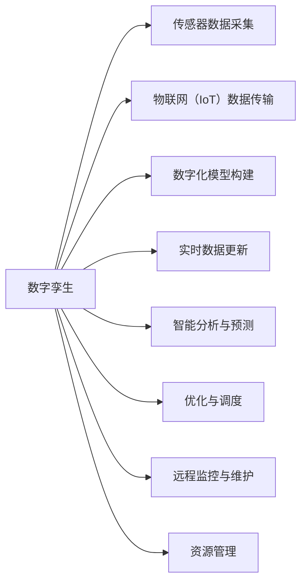

                 

# 数字实体与物理实体的自动化前景

> 关键词：
1. 数字孪生
2. 自动化生产
3. 智能制造
4. 物理模拟
5. 虚拟现实
6. 数字建模
7. 实体数字化

## 1. 背景介绍

在数字化转型的浪潮下，工业4.0的智能制造理念逐步成为各行各业转型升级的关键方向。数字孪生（Digital Twin）作为智能制造的重要支撑技术，正在重新定义物理实体与数字实体的关系，为物理实体的自动化与智能化提供了新的解决方案。本文将深入探讨数字孪生的核心概念与原理，通过实例分析其具体应用场景，展望其在自动化领域的前景。

## 2. 核心概念与联系

### 2.1 核心概念概述

数字孪生（Digital Twin）是一种实时映射物理实体在数字空间的虚拟模型。通过传感器、物联网（IoT）技术收集物理实体的实时数据，数字化模型实时更新，实现物理实体的全生命周期管理。数字孪生包含了虚拟与物理两个维度，既反映了物理实体的实际状态，又具备了智能分析和预测能力。

与传统制造相比，数字孪生实现了制造系统的智能化和自动化，通过虚拟与现实的融合，能够高效地进行模拟、预测、优化和诊断。在实际应用中，数字孪生技术广泛应用于生产调度、质量监控、设备预测维护、资源管理等多个领域。

### 2.2 核心概念联系（备注：必须给出核心概念原理和架构的 Mermaid 流程图(Mermaid 流程节点中不要有括号、逗号等特殊字符)


数字孪生从传感器采集数据开始，经过数据传输、模型构建、实时更新和智能分析等环节，最终实现对物理实体的全面自动化管理。其核心流程通过以下四个阶段：

1. **数据采集与传输**：利用传感器获取物理实体的实时数据，通过物联网技术传输到数字化模型。
2. **模型构建**：根据采集的数据，构建物理实体的数字孪生模型。
3. **实时更新**：通过不断收集新的数据，实时更新数字孪生模型，保持其与物理实体的同步。
4. **智能分析与优化**：利用机器学习和人工智能技术对数据进行分析，实现智能预测、优化和调度，提升生产效率和质量。

## 3. 核心算法原理 & 具体操作步骤
### 3.1 算法原理概述

数字孪生技术结合了数字建模、传感器网络、物联网技术、虚拟现实（VR）、增强现实（AR）以及人工智能（AI）等多种技术。其核心算法原理主要包括以下几个方面：

1. **数字建模**：通过数学模型或几何模型对物理实体进行数字化构建，生成虚拟模型。
2. **数据采集与传输**：通过传感器网络实时采集物理实体的状态数据，并通过物联网技术传输到数字孪生平台。
3. **数据融合与处理**：将实时采集的数据与虚拟模型进行融合，更新虚拟模型的状态。
4. **智能分析与优化**：利用机器学习和深度学习算法对数据进行分析，实现智能预测和优化。

### 3.2 算法步骤详解

数字孪生的构建和应用包括以下几个关键步骤：

**Step 1: 数据采集与传输**

- **传感器部署**：在物理实体上安装各种传感器，实时监测物理实体的状态数据。
- **数据传输**：通过物联网技术将传感器采集的数据传输到云端平台。

**Step 2: 模型构建**

- **数字建模**：根据物理实体的设计图纸、生产工艺等信息，构建数字模型。
- **虚拟与物理映射**：将数字模型与物理实体的传感器数据进行映射，建立虚拟与物理实体的关系。

**Step 3: 数据融合与处理**

- **实时更新**：根据传感器传输的实时数据，实时更新虚拟模型的状态。
- **数据融合**：将传感器数据与历史数据、操作指令等信息融合，更新虚拟模型的参数。

**Step 4: 智能分析与优化**

- **预测与诊断**：利用机器学习模型对虚拟模型的状态进行预测和诊断，识别潜在问题。
- **优化与调度**：根据预测结果，调整生产工艺、资源分配等参数，优化生产流程。

### 3.3 算法优缺点

数字孪生技术在工业自动化中的应用具有以下优点：

1. **提升生产效率**：通过实时监控和智能调度，数字孪生能够优化生产流程，减少浪费，提升生产效率。
2. **改善产品质量**：通过实时反馈和智能分析，数字孪生能够及时发现生产中的问题，提高产品质量。
3. **降低维护成本**：通过预测性维护，数字孪生能够提前发现设备故障，减少维护成本。
4. **增强决策支持**：通过提供全面的数据分析，数字孪生能够为决策者提供有力的支持。

同时，数字孪生技术也存在一些缺点：

1. **高成本投入**：传感器部署、数据传输、模型构建等需要较高的成本投入。
2. **数据安全风险**：大量数据的采集和传输可能带来数据泄露的风险。
3. **技术复杂性**：数字孪生涉及多种技术的集成，技术实现复杂度较高。
4. **依赖性问题**：高度依赖传感器和网络，设备故障或网络中断可能影响系统的稳定性。

### 3.4 算法应用领域

数字孪生技术在制造业、能源、建筑、物流等多个领域都有广泛的应用前景：

- **制造业**：用于生产调度、设备预测维护、质量监控、资源管理等领域。
- **能源行业**：用于电力系统的状态监测、故障预测、能源管理等。
- **建筑行业**：用于建筑物的结构分析、维护预测、能效优化等。
- **物流行业**：用于物流系统的实时监控、路径优化、货物追踪等。

## 4. 数学模型和公式 & 详细讲解 & 举例说明（备注：数学公式请使用latex格式，latex嵌入文中独立段落使用 $$，段落内使用 $)
### 4.1 数学模型构建

数字孪生模型主要由以下几个部分组成：

1. **物理实体模型**：表示物理实体的几何和物理特性，通过数学模型描述。
2. **传感器数据模型**：表示传感器对物理实体的监测特性，通过数学模型描述。
3. **通信网络模型**：表示数据传输的特性，通过数学模型描述。
4. **虚拟模型**：表示虚拟模型对物理实体的映射，通过数学模型描述。

### 4.2 公式推导过程

以下以一个简单的数字孪生模型为例，推导其实时更新过程。

假设物理实体的位置状态 $x(t)$ 可以通过以下微分方程描述：

$$
\dot{x}(t) = f(x(t),u(t),p(t))
$$

其中 $f$ 为系统函数，$u$ 为控制输入，$p$ 为系统参数。通过传感器获取物理实体的状态数据 $x(t)$，利用物联网技术传输到数字孪生平台。数字孪生模型 $X(t)$ 根据实时采集的数据，进行实时更新：

$$
X(t+\Delta t) = X(t) + \Delta X(t)
$$

其中 $\Delta X(t)$ 为数字孪生模型的状态更新量，通过以下公式计算：

$$
\Delta X(t) = g(X(t),\Delta x(t))
$$

其中 $g$ 为状态更新函数，$\Delta x(t)$ 为传感器传输的状态数据变化量。

### 4.3 案例分析与讲解

假设有一个生产车间，使用数字孪生技术进行设备预测维护。生产车间的设备状态 $x(t)$ 可以通过传感器网络实时监测，并通过物联网传输到数字孪生平台。数字孪生模型 $X(t)$ 根据实时采集的数据，进行状态更新：

$$
X(t+\Delta t) = X(t) + \Delta X(t)
$$

其中 $\Delta X(t)$ 表示设备状态的变化量，通过传感器数据计算得到：

$$
\Delta X(t) = g(X(t),\Delta x(t))
$$

其中 $g$ 为状态更新函数，可以表示为：

$$
g(X(t),\Delta x(t)) = \int_0^{\Delta t} f(X(t),u(t),p(t)) dt + \Delta x(t)
$$

通过数字孪生模型，实时监控设备状态，预测设备故障，提前进行维护，从而降低生产成本，提升生产效率。

## 5. 项目实践：代码实例和详细解释说明
### 5.1 开发环境搭建

在进行数字孪生项目开发前，需要准备好开发环境。以下是使用Python进行数字孪生项目开发的常见环境配置流程：

1. 安装Anaconda：从官网下载并安装Anaconda，用于创建独立的Python环境。

2. 创建并激活虚拟环境：
```bash
conda create -n digital_twin python=3.8 
conda activate digital_twin
```

3. 安装相关库：
```bash
conda install numpy scipy pandas scikit-learn tensorflow matplotlib jupyter notebook ipython
```

完成上述步骤后，即可在`digital_twin`环境中开始数字孪生项目开发。

### 5.2 源代码详细实现

下面以一个简单的数字孪生模型为例，使用TensorFlow实现其数据采集、数据传输、模型构建和状态更新的过程。

```python
import tensorflow as tf
import numpy as np

# 定义状态更新函数
def state_update(x, dx):
    return tf.integrate.odeint(tf.function(lambda x, t: f(x, t)), x, [0, 1])[1]

# 定义系统函数
def f(x, t):
    return np.array([x[0], 0.1*x[0]])

# 定义传感器数据变化量
def sensor_data(x, t):
    return np.array([x[0]+0.2*np.sin(t), 0.1*x[1]])

# 定义数字孪生模型状态更新函数
def digital_twin_state_update(x, dx):
    return state_update(x, dx)

# 模拟传感器数据
t = np.linspace(0, 10, 100)
x = np.array([0, 0])
dx = np.array([0.1*x[0]+0.2*np.sin(t), 0.1*x[1]])
X = np.zeros((100, 2))

for i in range(99):
    X[i+1, :] = digital_twin_state_update(X[i, :], dx[i])
```

以上代码实现了一个简单的数字孪生模型，通过传感器网络实时采集设备状态，并进行状态更新，模拟了设备的运动过程。

### 5.3 代码解读与分析

让我们再详细解读一下关键代码的实现细节：

**状态更新函数**：定义了设备状态的变化率函数 $f(x, t)$，用于计算设备状态的变化量。

**传感器数据变化量函数**：定义了传感器数据的变化量，用于模拟传感器对设备状态的变化监测。

**数字孪生模型状态更新函数**：将状态更新函数和传感器数据变化量结合，更新数字孪生模型的状态。

**模拟传感器数据**：通过numpy生成模拟的传感器数据，进行数字孪生模型的状态更新。

## 6. 实际应用场景

### 6.1 智能制造

数字孪生技术在智能制造领域具有广泛的应用。通过数字孪生模型实时监测生产设备的运行状态，预测设备故障，进行优化调度，能够显著提升生产效率和产品质量。

以一个汽车制造工厂为例，数字孪生技术可以通过传感器网络实时采集生产线的设备状态和生产数据，构建数字孪生模型。通过数字孪生模型进行实时监测和预测，及时发现设备故障，进行维护和优化调度，从而提升生产线的运行效率和产品质量。

### 6.2 智慧城市

数字孪生技术在智慧城市建设中也有广泛应用。通过数字孪生模型实时监测城市设施的状态，预测城市运行风险，进行智能调度和管理，能够提升城市的运营效率和管理水平。

以智慧交通为例，数字孪生技术可以通过传感器网络实时采集交通设施的状态数据，构建数字孪生模型。通过数字孪生模型进行实时监测和预测，及时发现交通问题，进行交通控制和优化调度，从而提升城市的交通运行效率。

### 6.3 资源管理

数字孪生技术在资源管理中也具有广泛的应用。通过数字孪生模型实时监测资源的状态，预测资源的使用情况，进行优化调度和管理，能够提升资源的使用效率和管理水平。

以一个智慧园区为例，数字孪生技术可以通过传感器网络实时采集资源的运行状态，构建数字孪生模型。通过数字孪生模型进行实时监测和预测，及时发现资源问题，进行资源优化调度和管理，从而提升园区的资源使用效率和管理水平。

### 6.4 未来应用展望

随着数字孪生技术的不断发展，其在自动化领域的应用前景将更加广阔。未来，数字孪生技术将进一步融合物联网、人工智能、大数据、虚拟现实等技术，实现更加智能和高效的自动化管理。

数字孪生技术将从传统的生产调度、设备维护等基础应用，扩展到智能制造、智慧城市、资源管理等更高级别的应用。通过数字孪生技术，实现物理实体的全生命周期管理，提升自动化管理的智能化和自动化水平。

## 7. 工具和资源推荐
### 7.1 学习资源推荐

为了帮助开发者系统掌握数字孪生的相关技术和应用，这里推荐一些优质的学习资源：

1. **《数字孪生技术及应用》书籍**：系统介绍了数字孪生的基本概念、原理、实现方法和应用场景，是数字孪生技术的入门必读书籍。

2. **数字孪生技术在线课程**：各大在线教育平台如Coursera、Udacity等提供的数字孪生技术相关课程，涵盖了从基础到高级的各个层次。

3. **数字孪生技术社区**：各大技术社区如Stack Overflow、GitHub等，提供了丰富的数字孪生技术资源和交流平台。

4. **数字孪生技术论文**：IEEE、ACM等学术期刊上发布的数字孪生技术相关论文，提供了最新的学术研究和进展。

通过对这些资源的学习实践，相信你一定能够快速掌握数字孪生的精髓，并用于解决实际的自动化问题。

### 7.2 开发工具推荐

数字孪生技术的实现需要依赖多种工具和框架，以下是几款常用的开发工具：

1. **TensorFlow**：Google开源的深度学习框架，支持分布式计算和高效的数据处理，适用于大规模数字孪生模型的实现。

2. **NumPy**：Python科学计算库，提供了高效的数组操作和数学函数，是数字孪生模型构建的基础。

3. **MATLAB**：Simulink和Modelsim等工具提供了强大的模型仿真和分析能力，适用于数字孪生模型的验证和优化。

4. **Jupyter Notebook**：轻量级数据科学和编程工具，支持代码交互式执行和可视化，适用于数字孪生模型的开发和测试。

5. **Simulink**：MATLAB提供的建模和仿真工具，适用于数字孪生模型的仿真和验证。

合理利用这些工具，可以显著提升数字孪生技术的开发效率，加快创新迭代的步伐。

### 7.3 相关论文推荐

数字孪生技术的发展源于学界的持续研究。以下是几篇奠基性的相关论文，推荐阅读：

1. **《数字孪生技术及应用综述》**：全面介绍了数字孪生的基本概念、实现方法和应用场景，是数字孪生技术的入门必读。

2. **《数字孪生技术在智能制造中的应用》**：探讨了数字孪生在智能制造中的具体应用，提出了多种应用场景和实现方法。

3. **《数字孪生技术在智慧城市中的应用》**：介绍了数字孪生在智慧城市建设中的应用，提供了多种实现方法和技术框架。

4. **《数字孪生技术在资源管理中的应用》**：探讨了数字孪生在资源管理中的应用，提出了多种优化和调度方法。

这些论文代表了大规模语言模型微调技术的发展脉络。通过学习这些前沿成果，可以帮助研究者把握学科前进方向，激发更多的创新灵感。

## 8. 总结：未来发展趋势与挑战

### 8.1 总结

本文对数字孪生技术进行了全面系统的介绍。首先阐述了数字孪生的核心概念与原理，明确了数字孪生在工业自动化中的应用价值。其次，从原理到实践，详细讲解了数字孪生的数学模型和关键步骤，给出了数字孪生项目开发的完整代码实例。同时，本文还广泛探讨了数字孪生技术在智能制造、智慧城市、资源管理等多个领域的应用前景，展示了数字孪生技术的巨大潜力。

通过本文的系统梳理，可以看到，数字孪生技术正在成为工业自动化自动化与智能化的重要支撑，极大地提升了生产效率和产品质量，为企业的数字化转型提供了有力保障。未来，随着技术的不断发展和应用场景的拓展，数字孪生技术必将在自动化领域取得更加广泛的应用，推动工业4.0的加速发展。

### 8.2 未来发展趋势

展望未来，数字孪生技术的发展呈现以下几个趋势：

1. **融合更多技术**：数字孪生将进一步融合物联网、人工智能、大数据、虚拟现实等技术，实现更加智能和高效的自动化管理。

2. **实现更高级别应用**：数字孪生将从传统的生产调度、设备维护等基础应用，扩展到智能制造、智慧城市、资源管理等更高级别的应用。

3. **提升数据处理能力**：数字孪生将引入更多的数据处理和分析技术，提高数据的处理能力和分析精度。

4. **提升模型仿真精度**：数字孪生将引入更先进的模型仿真技术，提高模型仿真精度，实现更真实的虚拟现实体验。

5. **优化实时更新策略**：数字孪生将引入更多的实时更新策略，提高实时更新的准确性和效率。

6. **提升用户交互体验**：数字孪生将引入更多的用户交互技术，提高用户的交互体验和参与度。

这些趋势将推动数字孪生技术在工业自动化领域的深度应用，为生产力的提升和经济的发展注入新的动力。

### 8.3 面临的挑战

尽管数字孪生技术在自动化领域取得了显著的进展，但在迈向更加智能化、普适化应用的过程中，仍面临诸多挑战：

1. **高成本投入**：传感器部署、数据传输、模型构建等需要较高的成本投入。

2. **数据安全风险**：大量数据的采集和传输可能带来数据泄露的风险。

3. **技术复杂性**：数字孪生涉及多种技术的集成，技术实现复杂度较高。

4. **依赖性问题**：高度依赖传感器和网络，设备故障或网络中断可能影响系统的稳定性。

5. **数据隐私问题**：数字孪生涉及大量的个人和企业数据，数据隐私保护问题亟需解决。

6. **伦理问题**：数字孪生技术在应用过程中可能涉及伦理问题，如隐私保护、数据安全等。

### 8.4 研究展望

面对数字孪生技术面临的挑战，未来的研究需要在以下几个方面寻求新的突破：

1. **优化数据采集与传输**：通过更高效的数据采集和传输技术，降低成本和风险。

2. **提高模型仿真精度**：引入更先进的模型仿真技术，提高模型仿真精度。

3. **降低技术复杂度**：开发更易用、更高效的数字孪生平台，降低技术实现难度。

4. **提升数据隐私保护**：引入更强大的数据隐私保护技术，保障数据安全。

5. **解决伦理问题**：引入伦理导向的评估指标，解决数字孪生技术应用中的伦理问题。

这些研究方向的探索，将推动数字孪生技术向更广泛的应用场景拓展，为工业4.0的加速发展提供有力保障。

## 9. 附录：常见问题与解答

**Q1：数字孪生与虚拟仿真有什么区别？**

A: 数字孪生与虚拟仿真类似，但更加强调物理实体的实时映射和动态更新。虚拟仿真侧重于基于模型进行仿真实验，不涉及实际物理实体。

**Q2：数字孪生技术需要哪些传感器？**

A: 数字孪生需要部署多种传感器，如温度传感器、压力传感器、位置传感器等，用于实时监测物理实体的状态数据。

**Q3：数字孪生技术如何保障数据安全？**

A: 数字孪生技术需要通过数据加密、访问控制、数据脱敏等技术手段，保障数据安全。

**Q4：数字孪生技术在哪些行业中具有应用前景？**

A: 数字孪生技术在制造业、能源、建筑、物流、智慧城市等多个行业中具有广泛的应用前景。

**Q5：数字孪生技术如何实现实时更新？**

A: 数字孪生技术通过传感器网络实时采集物理实体的状态数据，并利用物联网技术传输到数字孪生平台。数字孪生模型根据实时采集的数据，进行状态更新。

通过本文的系统梳理，可以看到，数字孪生技术正在成为工业自动化自动化与智能化的重要支撑，极大地提升了生产效率和产品质量，为企业的数字化转型提供了有力保障。未来，随着技术的不断发展和应用场景的拓展，数字孪生技术必将在自动化领域取得更加广泛的应用，推动工业4.0的加速发展。

---

作者：禅与计算机程序设计艺术 / Zen and the Art of Computer Programming

