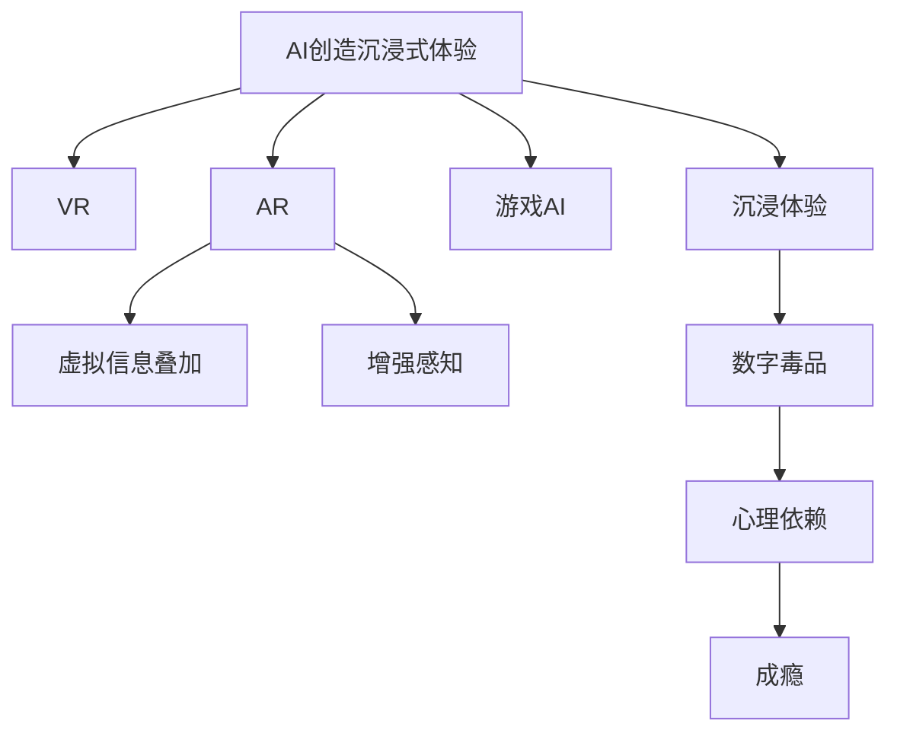

                 

# 数字毒品：AI创造的沉浸式体验

## 1. 背景介绍

### 1.1 问题由来

随着人工智能技术的飞速发展，AI在娱乐、教育、医疗等各个领域的应用越来越多。AI创造的沉浸式体验因其高度拟真和个性化，受到了大众的热烈欢迎。然而，过度沉浸的AI体验也被批评为一种“数字毒品”，因为它可能会导致用户无法自拔，甚至产生心理健康问题。

### 1.2 问题核心关键点

AI创造的沉浸式体验，以虚拟现实(VR)、增强现实(AR)和游戏等形式为代表，通过模拟真实世界或提供超出现实的虚拟体验，吸引用户长时间投入。这些沉浸式体验的共同特点是高度交互性和拟真性，使得用户容易产生强烈的情感依赖和生理依赖。

然而，过度的沉浸式体验可能带来负面影响，如社交隔离、心理依赖、成瘾等。这引起了公众对AI技术伦理和责任的广泛讨论。

### 1.3 问题研究意义

研究AI创造的沉浸式体验，对于提升用户体验、避免潜在的心理风险、推动AI技术健康发展具有重要意义：

1. 提升用户体验。通过优化沉浸式体验的设计，可以增强用户的参与感和满意度，提升产品的市场竞争力。
2. 避免心理风险。识别和预防沉浸式体验的负面影响，减少用户过度依赖和潜在心理问题，保障用户健康。
3. 推动技术健康发展。规范AI创造沉浸式体验的标准和伦理，促进AI技术的可持续发展。

## 2. 核心概念与联系

### 2.1 核心概念概述

为更好地理解AI创造的沉浸式体验，本节将介绍几个密切相关的核心概念：

- AI创造沉浸式体验：指通过人工智能技术，创造高度拟真、交互式的虚拟现实、增强现实和游戏等沉浸式体验。
- 数字毒品（Digital Drugs）：指过度沉浸的AI体验，可能带来心理依赖和成瘾，类似于传统毒品对生理的依赖。
- VR（Virtual Reality）：指虚拟现实技术，通过计算机生成逼真的三维虚拟环境，使用户感觉如同身临其境。
- AR（Augmented Reality）：指增强现实技术，通过将虚拟信息叠加到现实环境中，增强用户的感知体验。
- 游戏AI（Game AI）：指游戏中的人工智能，通过学习和适应玩家的行为，提供逼真的互动体验。

这些核心概念之间的逻辑关系可以通过以下Mermaid流程图来展示：



这个流程图展示了大语言模型的核心概念及其之间的关系：

1. AI创造沉浸式体验通过VR、AR和游戏AI等技术实现。
2. 这些技术通过模拟真实世界或提供虚拟信息，创造沉浸式体验。
3. 高度沉浸的体验可能被过度依赖，形成数字毒品。
4. 数字毒品可能导致心理依赖和成瘾。

这些核心概念共同构成了AI创造沉浸式体验的基础，使其能够在各种场景下提供高度拟真、互动的体验。通过理解这些核心概念，我们可以更好地把握AI技术的应用和潜在风险。

## 3. 核心算法原理 & 具体操作步骤

### 3.1 算法原理概述

AI创造沉浸式体验的算法原理，主要是通过机器学习和计算机图形学技术，实时生成逼真的虚拟环境和交互行为。其核心思想是：

1. 数据采集和处理：通过传感器、摄像头等设备采集用户的输入，包括位置、手势、语音等。
2. 环境模拟：使用计算机图形学技术，根据用户输入和虚拟环境模型，实时生成逼真的虚拟场景。
3. 交互行为计算：使用机器学习算法，学习用户的行为模式和偏好，动态调整虚拟环境的行为。
4. 多感官融合：将视觉、听觉、触觉等多种感官数据进行融合，提供更加逼真的沉浸体验。

### 3.2 算法步骤详解

AI创造沉浸式体验的算法步骤一般包括以下几个关键步骤：

**Step 1: 数据采集和预处理**
- 选择合适的传感器和设备，如动作捕捉设备、摄像头、麦克风等。
- 收集用户输入数据，包括位置、手势、语音等，并进行预处理，如去噪、标准化等。

**Step 2: 虚拟环境建模**
- 使用3D建模软件或工具，创建逼真的虚拟环境模型。
- 根据用户的输入，动态调整虚拟环境中的光线、材质、地形等参数，生成逼真的视觉场景。

**Step 3: 交互行为学习**
- 使用机器学习算法，如深度学习、强化学习等，学习用户的行为模式和偏好。
- 根据学习结果，动态调整虚拟环境中的物体行为、行为逻辑和交互方式。

**Step 4: 多感官融合**
- 将视觉、听觉、触觉等多种感官数据进行融合，提供更加逼真的沉浸体验。
- 使用多通道传感技术，实时获取和处理多感官数据，并进行协同处理和融合。

**Step 5: 系统集成和优化**
- 将虚拟环境、交互行为和多感官融合等模块进行集成，形成完整的沉浸式体验系统。
- 优化系统性能，如减少延迟、提高渲染速度、减少计算资源消耗等。

### 3.3 算法优缺点

AI创造沉浸式体验的算法具有以下优点：
1. 高度拟真。通过计算机图形学和机器学习技术，可以实时生成逼真的虚拟环境和交互行为。
2. 用户交互性强。用户可以通过动作捕捉、手势识别等方式，与虚拟环境进行实时交互，提供沉浸感。
3. 可扩展性强。通过增加传感器和设备，可以扩展多感官融合的覆盖范围，提供更加丰富的体验。

同时，该算法也存在一定的局限性：
1. 资源消耗大。高度拟真和实时交互需要大量的计算资源，如高性能GPU、服务器等。
2. 设备成本高。传感器和设备的成本较高，尤其是动作捕捉设备和高分辨率摄像头。
3. 技术复杂。需要跨学科知识，如计算机图形学、机器学习、传感器技术等，难度较大。
4. 数据隐私问题。大量传感器数据可能涉及用户隐私，需要严格的数据保护措施。

尽管存在这些局限性，但就目前而言，AI创造沉浸式体验的算法仍是大规模应用的重要基础。未来相关研究的重点在于如何进一步降低计算和设备成本，提高算法的易用性和可扩展性，同时兼顾数据隐私和安全。

### 3.4 算法应用领域

AI创造沉浸式体验的算法已经在娱乐、教育、医疗等领域得到了广泛应用，覆盖了几乎所有常见应用，例如：

- 虚拟现实游戏：如《Beat Saber》、《Half-Life: Alyx》等，通过高度拟真的虚拟环境，提供沉浸式的游戏体验。
- 虚拟旅游：如Google Earth VR，让用户可以虚拟旅游世界各地，感受真实环境的魅力。
- 虚拟培训：如飞行模拟器、医学模拟器等，通过逼真的虚拟环境，进行技能培训和实战演练。
- 虚拟展览：如数字博物馆、虚拟演唱会等，通过增强现实技术，提供互动式的参观体验。
- 虚拟会议：如Meta Horizon Workrooms，通过虚拟会议室，提供远程协作和沟通的新方式。

除了上述这些经典应用外，AI创造沉浸式体验还被创新性地应用到更多场景中，如虚拟宠物、虚拟现实社交等，为人们的日常生活带来了全新的体验。随着技术的日益成熟，相信AI创造沉浸式体验的应用场景将更加多样和丰富。

## 4. 数学模型和公式 & 详细讲解 & 举例说明

### 4.1 数学模型构建

本节将使用数学语言对AI创造沉浸式体验的算法进行更加严格的刻画。

记虚拟环境为 $E$，用户输入为 $I$，输出为 $O$。则AI创造沉浸式体验的数学模型为：

$$
O = f(E, I)
$$

其中 $f$ 为虚拟环境与用户输入的映射函数。

### 4.2 公式推导过程

以虚拟现实游戏为例，推导其数学模型和计算公式：

1. **输入采集**：用户通过动作捕捉设备、手柄、键盘、鼠标等设备，输入位置、手势、按键等。
2. **环境模拟**：根据用户输入和虚拟环境模型，实时计算虚拟环境中的位置、物体行为、碰撞检测等。
3. **行为学习**：使用深度学习算法，如神经网络、强化学习等，学习用户的行为模式和偏好。
4. **渲染渲染**：使用图形学技术，实时渲染虚拟环境中的物体、场景、光照等，生成逼真的视觉输出。

具体计算公式如下：

**输入采集**：

$$
I = \{(x,y,z), (p,q,r), \text{按键}, \text{手势} \}
$$

**环境模拟**：

$$
E = \{(x,y,z), \text{物体}, \text{光线}, \text{碰撞} \}
$$

**行为学习**：

$$
\theta = \mathop{\arg\min}_{\theta} \mathcal{L}(\theta)
$$

其中 $\theta$ 为模型参数，$\mathcal{L}$ 为损失函数。

**渲染渲染**：

$$
O = \{(x',y',z'), \text{颜色}, \text{纹理}, \text{光照} \}
$$

其中 $x', y', z'$ 为渲染后的位置坐标。

### 4.3 案例分析与讲解

以《Beat Saber》游戏为例，分析其沉浸式体验的数学模型和计算过程：

1. **输入采集**：玩家通过手柄输入位置、手势、按键等。
2. **环境模拟**：根据玩家输入，实时计算游戏场景中的道具位置、音乐节奏、难度等级等。
3. **行为学习**：使用神经网络学习玩家的行为模式，如节奏感、反应速度等。
4. **渲染渲染**：实时渲染游戏场景中的道具、音符、光影效果，生成逼真的视觉输出。

通过以上分析，我们可以看到，AI创造沉浸式体验的算法涉及多学科知识，包括计算机图形学、机器学习、传感器技术等。只有在多个学科的协同作用下，才能实现逼真的虚拟环境和实时交互，为用户提供沉浸式的体验。

## 5. 项目实践：代码实例和详细解释说明

### 5.1 开发环境搭建

在进行沉浸式体验开发前，我们需要准备好开发环境。以下是使用Python进行OpenVR开发的环境配置流程：

1. 安装Anaconda：从官网下载并安装Anaconda，用于创建独立的Python环境。

2. 创建并激活虚拟环境：
```bash
conda create -n openvr-env python=3.8 
conda activate openvr-env
```

3. 安装OpenVR库：
```bash
pip install openvr
```

4. 安装OpenCV库：
```bash
pip install opencv-python
```

5. 安装Pygame库：
```bash
pip install pygame
```

完成上述步骤后，即可在`openvr-env`环境中开始开发。

### 5.2 源代码详细实现

下面我们以虚拟现实游戏为例，给出使用OpenVR库开发虚拟现实游戏的PyTorch代码实现。

首先，定义虚拟环境类：

```python
import openvr
from openvr import HMDDevice, InputSource

class VREnvironment:
    def __init__(self, device_id):
        self.device = HMDDevice(device_id)
        self.input_source = InputSource(self.device)

    def update(self):
        self.device.update()
        self.input_source.update()

    def render(self):
        self.device.render()
```

然后，定义游戏逻辑类：

```python
class VRGame:
    def __init__(self):
        self.env = VREnvironment(openvr.get_headset()[0])

    def run(self):
        while True:
            self.env.update()
            self.env.render()
            self.game_logic()
```

接着，定义游戏逻辑函数：

```python
def game_logic(self):
    # 实时处理用户输入，调整游戏状态
    if self.env.input_source.is_pressed(openvr.HID_BUTTON_TRIGGER):
        self.game_state = "start"
    elif self.env.input_source.is_pressed(openvr.HID_BUTTON_LEFT):
        self.game_state = "pause"
    elif self.env.input_source.is_pressed(openvr.HID_BUTTON_RIGHT):
        self.game_state = "resume"
```

最后，启动游戏流程：

```python
game = VRGame()
game.run()
```

以上就是使用PyTorch和OpenVR库进行虚拟现实游戏开发的全代码实现。可以看到，使用OpenVR库可以方便地与VR设备进行交互，进行实时渲染和动态行为计算。

### 5.3 代码解读与分析

让我们再详细解读一下关键代码的实现细节：

**VREnvironment类**：
- `__init__`方法：初始化虚拟设备，获取VR设备ID。
- `update`方法：更新设备状态和用户输入，如位置、手势等。
- `render`方法：渲染虚拟环境，生成逼真的视觉输出。

**VRGame类**：
- `__init__`方法：初始化游戏环境，创建虚拟环境对象。
- `run`方法：无限循环，实时更新和渲染游戏环境，执行游戏逻辑。

**game_logic函数**：
- 实时处理用户输入，调整游戏状态，如开始游戏、暂停、恢复等。

**启动游戏流程**：
- 创建游戏对象，并运行游戏逻辑。

可以看到，使用OpenVR库可以方便地与VR设备进行交互，进行实时渲染和动态行为计算。这使得开发者可以更加专注于游戏逻辑的设计，而不必过多关注底层设备的细节。

当然，工业级的系统实现还需考虑更多因素，如模型的保存和部署、超参数的自动搜索、更灵活的游戏逻辑设计等。但核心的沉浸式体验开发流程基本与此类似。

## 6. 实际应用场景

### 6.1 虚拟现实游戏

虚拟现实游戏通过高度逼真的虚拟环境和实时交互，提供沉浸式的游戏体验。玩家可以在虚拟世界中探索、战斗、解谜等，享受逼真的视觉和听觉反馈。虚拟现实游戏已经广泛应用于家庭娱乐、竞技游戏和教育培训等领域，为用户带来全新的游戏体验。

### 6.2 虚拟旅游

虚拟旅游通过增强现实技术，将虚拟信息叠加到现实环境中，提供互动式的参观体验。用户可以通过移动设备或VR设备，实时探索虚拟景点，观看历史文物，与虚拟导游互动等。虚拟旅游为无法亲临现场的用户提供了丰富的旅游资源，增加了用户对旅游的兴趣和参与度。

### 6.3 虚拟培训

虚拟培训通过逼真的虚拟环境，提供技能培训和实战演练。如飞行模拟器、医学模拟器等，通过实时渲染和动态行为计算，训练用户的操作技能和决策能力。虚拟培训可以降低培训成本，提高培训效果，广泛应用于航空、医疗、军事等领域。

### 6.4 虚拟展览

虚拟展览通过增强现实技术，提供互动式的展览体验。用户可以通过移动设备或VR设备，实时参观虚拟展览，观看展品，了解展品信息，与虚拟解说员互动等。虚拟展览为无法亲临现场的用户提供了丰富的文化资源，增加了用户对文化艺术的兴趣和参与度。

### 6.5 虚拟会议

虚拟会议通过虚拟会议室，提供远程协作和沟通的新方式。用户可以在虚拟环境中进行视频会议、共享文件、实时讨论等，增强远程协作的互动性和沉浸感。虚拟会议在疫情期间得到了广泛应用，成为远程办公和教育的有效手段。

## 7. 工具和资源推荐

### 7.1 学习资源推荐

为了帮助开发者系统掌握AI创造沉浸式体验的理论基础和实践技巧，这里推荐一些优质的学习资源：

1. 《Virtual Reality Programming》系列博文：由VR技术专家撰写，深入浅出地介绍了VR技术的原理、开发工具和典型应用。

2. 《Unity VR开发教程》：Unity官方教程，提供从基础到高级的VR游戏开发教程，涵盖多种VR平台和工具。

3. 《AR基础与开发》书籍：AR技术的入门教程，介绍了AR技术的原理、应用场景和开发工具。

4. 《Game AI实战》书籍：Game AI的实践教程，介绍了游戏中的AI设计、开发和优化。

5. 《OpenVR官方文档》：OpenVR官方文档，提供了详细的VR开发指南和API接口。

通过对这些资源的学习实践，相信你一定能够快速掌握AI创造沉浸式体验的精髓，并用于解决实际的VR、AR、游戏等应用问题。

### 7.2 开发工具推荐

高效的开发离不开优秀的工具支持。以下是几款用于AI创造沉浸式体验开发的常用工具：

1. Unity：全球领先的VR/AR游戏引擎，支持多种平台和开发工具，适合开发复杂的多人在线游戏。

2. Unreal Engine：顶级的VR/AR游戏引擎，提供高度逼真的图形渲染和实时物理仿真，适合开发高端的视觉体验。

3. OpenVR：由Valve开发的VR开发工具，提供标准的API接口和设备支持，方便开发VR应用。

4. Oculus SDK：Oculus提供的VR开发工具，支持多种VR设备，提供丰富的交互功能。

5. ARKit：Apple提供的AR开发工具，支持iOS设备，提供丰富的增强现实功能。

6. ARCore：Google提供的AR开发工具，支持Android设备，提供跨平台的增强现实功能。

合理利用这些工具，可以显著提升AI创造沉浸式体验的开发效率，加快创新迭代的步伐。

### 7.3 相关论文推荐

AI创造沉浸式体验的发展源于学界的持续研究。以下是几篇奠基性的相关论文，推荐阅读：

1. "Head-mounted Display Support in Web Applications"：研究如何在Web应用程序中集成头显设备，实现虚拟现实和增强现实效果。

2. "Towards AI-Driven Entertainment"：讨论AI技术在娱乐领域的应用，包括虚拟现实游戏、虚拟角色等。

3. "Real-time Augmented Reality in the Workplace"：研究在职场中应用增强现实技术，提高员工的工作效率和参与度。

4. "Virtual Reality for Medical Training"：探讨虚拟现实技术在医学培训中的应用，包括手术模拟、医学知识可视化等。

5. "Towards Universal Virtual Reality"：研究虚拟现实技术的发展趋势和未来应用，包括全息投影、虚拟社交等。

这些论文代表了大语言模型微调技术的发展脉络。通过学习这些前沿成果，可以帮助研究者把握学科前进方向，激发更多的创新灵感。

## 8. 总结：未来发展趋势与挑战

### 8.1 总结

本文对AI创造沉浸式体验的方法进行了全面系统的介绍。首先阐述了AI创造沉浸式体验的研究背景和意义，明确了沉浸式体验在提升用户体验、避免心理风险、推动技术发展方面的独特价值。其次，从原理到实践，详细讲解了沉浸式体验的数学模型和关键步骤，给出了沉浸式体验开发的全代码实现。同时，本文还广泛探讨了沉浸式体验在虚拟现实游戏、虚拟旅游、虚拟培训等多个行业领域的应用前景，展示了沉浸式体验的巨大潜力。此外，本文精选了沉浸式体验技术的各类学习资源，力求为读者提供全方位的技术指引。

通过本文的系统梳理，可以看到，AI创造沉浸式体验已经成为娱乐、教育、医疗等领域的流行趋势，极大地提升了用户体验和应用价值。未来，伴随技术的不断进步和市场需求的扩大，AI创造沉浸式体验的应用场景将更加多样和丰富。

### 8.2 未来发展趋势

展望未来，AI创造沉浸式体验将呈现以下几个发展趋势：

1. 高度拟真。随着技术的发展，虚拟环境和交互行为的拟真度将不断提高，为用户提供更加逼真的体验。
2. 个性化体验。通过AI技术，可以个性化定制沉浸式体验，满足用户的独特需求和偏好。
3. 多感官融合。将视觉、听觉、触觉等多种感官数据进行融合，提供更加丰富的沉浸体验。
4. 高交互性。提高用户的参与度和互动性，实现更加自然、流畅的交互。
5. 大规模应用。沉浸式体验将广泛应用于教育、培训、医疗、娱乐等领域，成为新的应用范式。
6. 跨平台发展。沉浸式体验将从VR设备扩展到AR设备、移动设备等多种平台，实现跨平台的无缝体验。

以上趋势凸显了AI创造沉浸式体验的广阔前景。这些方向的探索发展，必将进一步提升沉浸式体验的品质和应用范围，为人们的日常生活带来全新的体验。

### 8.3 面临的挑战

尽管AI创造沉浸式体验已经取得了瞩目成就，但在迈向更加智能化、普适化应用的过程中，它仍面临诸多挑战：

1. 设备成本高。VR、AR设备的硬件成本较高，限制了市场的普及和应用。
2. 用户体验差。用户在使用过程中可能遇到设备佩戴不舒适、内容单调等问题，影响体验效果。
3. 内容生产难。高质量的沉浸式内容制作成本高、周期长，难以大规模生产。
4. 技术复杂。沉浸式体验开发涉及多学科知识，如计算机图形学、机器学习、传感器技术等，难度较大。
5. 数据隐私问题。大量传感器数据可能涉及用户隐私，需要严格的数据保护措施。

尽管存在这些挑战，但随着技术的不断进步和市场需求的扩大，AI创造沉浸式体验的应用前景依然广阔。未来相关研究需要在以下几个方面寻求新的突破：

1. 降低设备成本。开发轻便、低成本的VR、AR设备，降低用户获取门槛，扩大市场规模。
2. 提升用户体验。优化设备设计，改进内容制作，提高用户参与度和互动性。
3. 简化开发流程。提供简单易用的开发工具和API，降低开发者入门门槛，加速内容生产。
4. 探索新模式。结合多种感官数据和多平台设备，探索新的沉浸式体验模式，实现跨平台的无缝体验。

### 8.4 研究展望

面向未来，AI创造沉浸式体验的研究方向主要集中在以下几个方面：

1. 多感官融合。将视觉、听觉、触觉等多种感官数据进行融合，提供更加丰富的沉浸体验。
2. 多平台支持。开发支持多种平台和设备的沉浸式体验，实现跨平台的无缝体验。
3. 跨学科融合。结合人工智能、虚拟现实、增强现实、计算机图形学等多学科知识，实现沉浸式体验的深度融合。
4. 高交互性。提高用户的参与度和互动性，实现更加自然、流畅的交互。
5. 内容定制化。个性化定制沉浸式体验，满足用户的独特需求和偏好。
6. 跨学科应用。将沉浸式体验应用于更多领域，如医疗、教育、军事等，实现跨学科的应用价值。

这些研究方向将推动AI创造沉浸式体验的进一步发展，为人们的日常生活带来更多的创新和惊喜。相信随着技术的不断进步和应用的不断拓展，AI创造沉浸式体验将迎来更加广阔的发展前景。

## 9. 附录：常见问题与解答

**Q1: 如何防止AI创造沉浸式体验的过度依赖和成瘾？**

A: 防止过度依赖和成瘾是AI创造沉浸式体验的重要研究方向。以下是一些可能的方法：
1. 适度使用。规定使用时间，避免长时间沉浸在虚拟环境中。
2. 内容多样。提供多样化的内容，避免用户长时间暴露于单一环境中。
3. 数据监控。监控用户使用情况，及时发现过度依赖或成瘾迹象。
4. 心理干预。提供心理咨询和干预，帮助用户摆脱过度依赖。
5. 技术手段。开发可控性技术，如时间限制、行为干预等，限制用户的使用时间。

**Q2: 如何提高AI创造沉浸式体验的用户参与度和互动性？**

A: 提高用户参与度和互动性是AI创造沉浸式体验的关键。以下是一些可能的方法：
1. 实时反馈。提供实时反馈，增强用户对环境的感知和互动。
2. 多感官融合。将视觉、听觉、触觉等多种感官数据进行融合，提供更加丰富的沉浸体验。
3. 个性化定制。根据用户行为和偏好，个性化定制内容和互动方式。
4. 社交互动。提供多人互动功能，增强社交体验。
5. 动态调整。动态调整游戏难度和内容，保持用户的新鲜感和挑战性。

**Q3: 如何降低AI创造沉浸式体验的设备成本？**

A: 降低设备成本是AI创造沉浸式体验的重要研究方向。以下是一些可能的方法：
1. 技术进步。开发轻便、低成本的VR、AR设备，提高生产效率，降低硬件成本。
2. 开源社区。开发开源设备和技术，降低开发门槛，扩大市场规模。
3. 降低能耗。开发低功耗设备，提高设备续航能力，降低能源成本。
4. 多平台支持。开发支持多种平台和设备的沉浸式体验，减少设备购买成本。
5. 改进设计。优化设备设计和功能，提高用户体验，降低用户使用成本。

**Q4: 如何保护AI创造沉浸式体验的数据隐私？**

A: 保护数据隐私是AI创造沉浸式体验的重要研究方向。以下是一些可能的方法：
1. 数据匿名化。对用户数据进行匿名化处理，保护用户隐私。
2. 数据加密。对用户数据进行加密存储和传输，防止数据泄露。
3. 数据访问控制。限制数据访问权限，确保数据只能被授权人员访问。
4. 数据监控。监控数据访问和使用情况，及时发现和防止数据泄露。
5. 数据删除。提供数据删除功能，用户可以随时删除自己的数据，保护隐私。

通过这些措施，可以保护用户数据隐私，增强用户信任，促进AI创造沉浸式体验的健康发展。

---

作者：禅与计算机程序设计艺术 / Zen and the Art of Computer Programming

