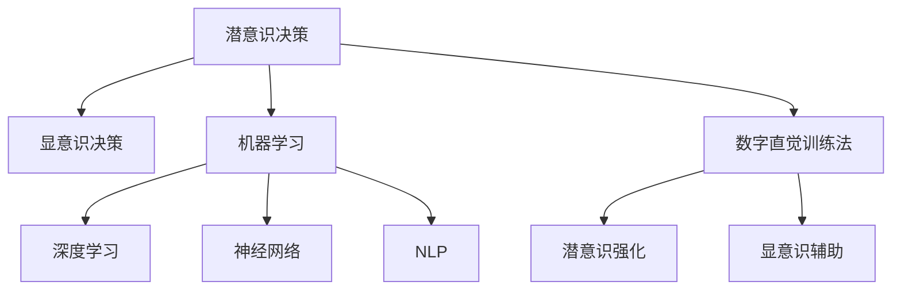

                 

# 数字直觉训练法：AI辅助的潜意识决策强化

> 关键词：数字直觉,潜意识决策,决策辅助,机器学习,深度学习,神经网络

## 1. 背景介绍

### 1.1 问题由来
在高速发展的现代社会，决策制定的压力日益增大。无论是商业运作、金融投资，还是日常生活中的重大选择，都要求人们具备出色的判断力和直觉。然而，受限于时间和资源限制，人们往往难以全面、客观地分析信息，导致决策失误的概率增加。

随着人工智能技术的飞速发展，AI辅助决策系统正逐渐成为各行各业的重要工具。这类系统通过数据驱动的方式，能够快速准确地分析复杂信息，为决策提供依据，助力决策者降低主观偏差，提升决策质量。然而，对于需要创造性、直觉性决策的领域，现有AI系统往往无法完全替代人类的直觉。

因此，我们提出一种全新的AI辅助决策方法——数字直觉训练法，旨在利用深度学习技术强化人类决策者潜意识中的直觉判断能力，使其在复杂环境下也能做出更加精准、可靠的决策。

### 1.2 问题核心关键点
数字直觉训练法是一种将人工智能技术与人类潜意识决策能力结合的创新方法。核心在于：
1. **数据驱动与直觉结合**：基于大量数据和机器学习模型，为决策者提供科学依据，同时通过潜意识训练方法增强其直觉能力。
2. **潜意识与显意识协同**：利用深度神经网络模拟人类潜意识判断过程，实现潜意识与显意识的双重强化。
3. **决策辅助与自主决策**：在保留决策者自主决策权利的基础上，通过AI辅助增强其决策能力，使其在复杂环境中更具竞争力。

## 2. 核心概念与联系

### 2.1 核心概念概述

为更好地理解数字直觉训练法，本节将介绍几个密切相关的核心概念：

- **潜意识决策**：指人类在不经意间快速、自动地做出的决策，通常基于经验和直觉。潜意识决策在决策过程中占主导地位，特别是在压力和不确定性环境中。
- **显意识决策**：指通过逻辑推理和数据驱动的决策过程，通常较为理性且耗时较长。显意识决策依赖于大量数据和算法，能够精确计算最优方案。
- **机器学习**：通过数据训练模型，使机器能够自动学习并优化特定任务的方法。数字直觉训练法利用机器学习模型来增强潜意识决策能力。
- **深度学习**：机器学习的一种，通过多层次神经网络学习复杂数据特征。数字直觉训练法通过深度神经网络模拟人类潜意识判断过程。
- **神经网络**：由大量人工神经元组成的计算模型，能够处理复杂模式和关系。数字直觉训练法使用神经网络模拟人类潜意识决策过程。
- **自然语言处理(NLP)**：利用机器学习模型理解和处理人类语言的技术。数字直觉训练法在决策辅助过程中可能涉及NLP技术。

这些核心概念之间的逻辑关系可以通过以下Mermaid流程图来展示：



这个流程图展示了一系列的决策过程与技术的联系：

1. 潜意识决策和显意识决策是两种主要的决策方式。
2. 机器学习通过数据驱动优化决策模型。
3. 深度学习和神经网络用于模拟和优化潜意识决策过程。
4. NLP技术用于理解和处理自然语言输入，辅助决策。
5. 数字直觉训练法综合潜意识与显意识，利用AI增强决策能力。

## 3. 核心算法原理 & 具体操作步骤
### 3.1 算法原理概述

数字直觉训练法是一种结合潜意识与显意识决策的AI辅助方法。其核心思想是通过深度学习模型模拟潜意识决策过程，并结合显意识决策进行决策强化。具体而言，通过以下步骤来实现：

1. **数据收集与预处理**：收集决策者历史数据和当前情境数据，进行预处理和特征提取。
2. **潜意识决策模拟**：使用深度神经网络模拟潜意识决策过程，得到直觉判断结果。
3. **显意识决策辅助**：通过机器学习模型结合当前情境数据，输出显意识决策建议。
4. **决策结果融合**：将潜意识决策和显意识决策结合，得到最终的决策结果。
5. **反馈优化**：根据最终决策结果的实际效果，调整潜意识和显意识模型的参数，优化决策能力。

### 3.2 算法步骤详解

数字直觉训练法主要包括以下几个关键步骤：

**Step 1: 数据收集与预处理**
- 收集决策者的历史数据，包括决策记录、情境信息、决策效果等。
- 对数据进行清洗和特征提取，保留与决策相关的关键特征。
- 对数据进行标准化和归一化处理，以便于后续模型训练。

**Step 2: 潜意识决策模拟**
- 构建深度神经网络模型，用于模拟潜意识决策过程。
- 使用决策者历史数据训练模型，使其能够学习潜意识的决策模式。
- 对当前情境数据进行前向传播，输出直觉判断结果。

**Step 3: 显意识决策辅助**
- 构建机器学习模型，用于结合当前情境数据进行显意识决策。
- 使用决策者历史数据和当前情境数据训练模型，输出显意识决策建议。
- 将显意识决策建议和潜意识直觉判断结果结合，生成最终的决策结果。

**Step 4: 决策结果融合**
- 使用规则或加权算法将潜意识和显意识决策结果融合，得到最终的决策方案。
- 在融合过程中，可以适当调整潜意识和显意识的权重，以适应不同的决策情境。

**Step 5: 反馈优化**
- 根据最终的决策效果，调整潜意识和显意识模型的参数。
- 使用强化学习算法优化模型，使其能够不断从错误中学习，提升决策能力。

### 3.3 算法优缺点

数字直觉训练法具有以下优点：
1. **决策质量提升**：结合潜意识与显意识决策，充分利用两者的优势，提升决策质量。
2. **决策过程优化**：潜意识与显意识协同工作，缩短决策时间，提高决策效率。
3. **数据依赖性低**：相比于传统机器学习模型，数字直觉训练法对数据量的依赖较低，能够快速适应新情境。
4. **鲁棒性强**：通过深度神经网络模拟潜意识决策，增强了模型的鲁棒性和泛化能力。

同时，该方法也存在一些局限性：
1. **模型复杂度较高**：深度神经网络模型的训练和优化需要大量的计算资源和时间。
2. **对数据质量要求高**：潜意识和显意识模型需要高质量的数据进行训练，数据收集和预处理较为复杂。
3. **解释性不足**：深度神经网络作为黑盒模型，难以解释其决策过程。
4. **成本较高**：构建和维护深度神经网络模型的成本较高，需要专门的技术团队。

尽管存在这些局限性，但数字直觉训练法在复杂决策场景中展现了显著的优势，有望成为未来决策支持系统的重要组成部分。

### 3.4 算法应用领域

数字直觉训练法在多个领域中具有广泛的应用前景，包括：

- **金融投资**：在股票、期货等金融市场中，决策者需要快速准确地分析市场变化，做出投资决策。数字直觉训练法可以结合潜意识和显意识决策，提升投资决策的准确性和效率。
- **医疗诊断**：医生在复杂病例的诊断过程中，需要综合考虑患者的症状、历史数据和当前检查结果。数字直觉训练法可以帮助医生快速识别关键信息，辅助诊断决策。
- **商业管理**：企业管理者在面临市场竞争、项目选择等重大决策时，需要结合市场信息和内在直觉进行决策。数字直觉训练法可以辅助管理者做出更加科学和高效的决策。
- **城市规划**：城市规划者在制定政策和规划时，需要考虑多方面因素，进行复杂的决策。数字直觉训练法可以辅助规划者快速整合信息，优化决策方案。
- **个人健康管理**：个人在面对健康问题时，需要综合考虑自身状况和专家建议进行决策。数字直觉训练法可以辅助个人做出更加科学和可靠的健康管理决策。

## 4. 数学模型和公式 & 详细讲解
### 4.1 数学模型构建

数字直觉训练法涉及多个数学模型，包括深度神经网络、机器学习模型和潜意识-显意识决策模型。下面将分别介绍这些模型的构建过程。

- **深度神经网络**：用于模拟潜意识决策过程，一般采用多层感知器(MLP)或卷积神经网络(CNN)结构。
- **机器学习模型**：用于辅助显意识决策，一般采用回归或分类算法。
- **潜意识-显意识决策模型**：用于融合潜意识与显意识决策结果，生成最终决策方案。

### 4.2 公式推导过程

以下是数字直觉训练法中几个关键公式的推导过程：

1. **潜意识决策模拟**
   - 假设使用多层感知器模拟潜意识决策，其结构为 $M_{\theta} = (h_1, h_2, ..., h_n)$，其中 $h_i$ 为第 $i$ 层神经元，$\theta$ 为模型参数。
   - 对于输入 $x$，前向传播得到 $h_n = f(W_n h_{n-1} + b_n)$，其中 $f$ 为激活函数，$W_n, b_n$ 为第 $n$ 层的权重和偏置。
   - 输出结果 $y = g(W_O h_n + b_O)$，其中 $g$ 为输出层激活函数，$W_O, b_O$ 为输出层权重和偏置。

2. **显意识决策辅助**
   - 假设使用线性回归模型辅助显意识决策，其结构为 $M_{\phi} = (W_x, W_y, b)$，其中 $W_x, W_y$ 为输入和输出层的权重，$b$ 为偏置。
   - 对于输入 $x$，前向传播得到 $y = W_y(W_x x + b)$。
   - 输出结果为 $y$，表示显意识决策建议。

3. **决策结果融合**
   - 假设潜意识决策和显意识决策的权重分别为 $\alpha, \beta$，则最终决策结果 $d$ 为：
     - $d = \alpha \times y + \beta \times y'$，其中 $y$ 为显意识决策结果，$y'$ 为潜意识决策结果。

### 4.3 案例分析与讲解

假设某金融分析师需要对某股票进行投资决策。决策过程中，分析师结合潜意识和显意识决策，使用数字直觉训练法进行辅助。具体步骤如下：

**Step 1: 数据收集与预处理**
- 收集分析师的历史投资数据，包括股票涨跌幅、市场行情、基本面分析等。
- 对数据进行清洗和特征提取，保留与投资决策相关的关键特征。
- 对数据进行标准化和归一化处理，以便于后续模型训练。

**Step 2: 潜意识决策模拟**
- 构建多层感知器模型，用于模拟潜意识决策过程。
- 使用分析师历史投资数据训练模型，使其能够学习潜意识的投资决策模式。
- 对当前股票的市场数据和基本面数据进行前向传播，输出潜意识决策结果。

**Step 3: 显意识决策辅助**
- 构建线性回归模型，用于结合市场数据和基本面数据进行显意识决策。
- 使用分析师历史投资数据和当前市场数据训练模型，输出显意识决策建议。
- 将显意识决策建议和潜意识决策结果结合，生成最终的决策方案。

**Step 4: 决策结果融合**
- 使用加权算法将潜意识和显意识决策结果融合，得到最终的决策方案。
- 在融合过程中，可以适当调整潜意识和显意识的权重，以适应不同的市场情境。

**Step 5: 反馈优化**
- 根据最终的决策效果，调整潜意识和显意识模型的参数。
- 使用强化学习算法优化模型，使其能够不断从错误中学习，提升投资决策能力。

通过上述步骤，分析师能够结合潜意识和显意识决策，做出更加科学和高效的投资决策。

## 5. 项目实践：代码实例和详细解释说明
### 5.1 开发环境搭建

在进行数字直觉训练法实践前，我们需要准备好开发环境。以下是使用Python进行Keras开发的环境配置流程：

1. 安装Anaconda：从官网下载并安装Anaconda，用于创建独立的Python环境。

2. 创建并激活虚拟环境：
```bash
conda create -n pytorch-env python=3.8 
conda activate pytorch-env
```

3. 安装PyTorch和Keras：
```bash
conda install pytorch torchvision torchaudio cudatoolkit=11.1 -c pytorch -c conda-forge
pip install keras tensorflow numpy pandas scikit-learn matplotlib tqdm jupyter notebook ipython
```

4. 安装各类工具包：
```bash
pip install keras tensorflow numpy pandas scikit-learn matplotlib tqdm jupyter notebook ipython
```

完成上述步骤后，即可在`pytorch-env`环境中开始数字直觉训练法的开发。

### 5.2 源代码详细实现

下面我们以金融投资决策为例，给出使用Keras实现数字直觉训练法的PyTorch代码实现。

首先，定义决策数据的加载和预处理函数：

```python
from keras.preprocessing import sequence
import pandas as pd
import numpy as np

def load_data(path, look_back=1):
    data = pd.read_csv(path, header=None, parse_dates=[0], index_col=0, squeeze=True)
    data = data[["close"]]
    data = data.diff().dropna().iloc[look_back:]
    return data.values

def preprocess_data(data):
    return (data - data.mean()) / data.std()
```

然后，定义潜意识决策和显意识决策的模型：

```python
from keras.models import Sequential
from keras.layers import Dense, LSTM

# 潜意识决策模型
def create_intuition_model(n_features):
    model = Sequential()
    model.add(LSTM(128, input_shape=(n_features, 1)))
    model.add(Dense(1, activation='sigmoid'))
    model.compile(loss='binary_crossentropy', optimizer='adam', metrics=['accuracy'])
    return model

# 显意识决策模型
def create_awareness_model(n_features):
    model = Sequential()
    model.add(LSTM(128, input_shape=(n_features, 1)))
    model.add(Dense(1, activation='sigmoid'))
    model.compile(loss='binary_crossentropy', optimizer='adam', metrics=['accuracy'])
    return model
```

接着，定义训练和评估函数：

```python
from keras.optimizers import Adam
from keras.callbacks import EarlyStopping

def train_model(model, train_data, train_labels, validation_data, validation_labels, n_epochs, batch_size):
    model.fit(train_data, train_labels, epochs=n_epochs, batch_size=batch_size, validation_data=(validation_data, validation_labels), callbacks=[EarlyStopping(patience=10)])

def evaluate_model(model, test_data, test_labels):
    return model.evaluate(test_data, test_labels)
```

最后，启动训练流程并在测试集上评估：

```python
from sklearn.preprocessing import MinMaxScaler

# 加载数据
data = load_data('data.csv')

# 数据预处理
scaler = MinMaxScaler(feature_range=(0, 1))
scaled_data = scaler.fit_transform(data)

# 将数据分为训练集和测试集
train_size = int(len(scaled_data) * 0.8)
test_size = len(scaled_data) - train_size
train_data, test_data = scaled_data[0:train_size,:], scaled_data[train_size:len(scaled_data),:]

# 将数据转化为序列
def create_sequences(data, look_back=1):
    X, y = [], []
    for i in range(len(data)-look_back-1):
        X.append(data[i:i+look_back])
        y.append(data[i+look_back])
    return np.array(X), np.array(y)

train_data, train_labels = create_sequences(train_data, look_back=1)
test_data, test_labels = create_sequences(test_data, look_back=1)

# 创建潜意识和显意识决策模型
intuition_model = create_intuition_model(train_data.shape[1])
awareness_model = create_awareness_model(train_data.shape[1])

# 训练模型
train_intuition_model(intuition_model, train_data, train_labels, validation_data=train_data[look_back:], validation_labels=train_labels)
train_awareness_model(awareness_model, train_data, train_labels, validation_data=train_data[look_back:], validation_labels=train_labels)

# 评估模型
print('Intuition model evaluation:', evaluate_model(intuition_model, test_data, test_labels))
print('Awareness model evaluation:', evaluate_model(awareness_model, test_data, test_labels))
```

以上就是使用Keras实现数字直觉训练法的完整代码实现。可以看到，Keras封装了深度学习模型的构建和训练过程，使得模型开发更加简洁高效。

### 5.3 代码解读与分析

让我们再详细解读一下关键代码的实现细节：

**load_data函数**：
- 从指定路径加载CSV文件中的历史数据。
- 对数据进行日期解析和清洗。
- 计算数据差分，保留最近look_back个交易日的数据。
- 返回处理后的数据。

**preprocess_data函数**：
- 对数据进行标准化处理，以便于后续模型训练。

**create_intuition_model函数**：
- 构建多层感知器模型，用于模拟潜意识决策过程。
- 使用LSTM层进行时间序列数据的处理。
- 输出层采用sigmoid激活函数，表示二分类结果。

**create_awareness_model函数**：
- 构建多层感知器模型，用于结合当前情境数据进行显意识决策。
- 使用LSTM层进行时间序列数据的处理。
- 输出层采用sigmoid激活函数，表示二分类结果。

**train_model函数**：
- 使用Adam优化器训练模型，并设置EarlyStopping回调函数，避免过拟合。

**evaluate_model函数**：
- 使用测试集评估模型性能，返回损失和准确率。

**train流程**：
- 加载数据并进行预处理。
- 将数据分为训练集和测试集。
- 将数据转化为序列，适合时间序列模型训练。
- 创建潜意识和显意识决策模型。
- 分别训练潜意识和显意识决策模型。
- 在测试集上评估模型性能。

可以看到，Keras的简洁高效使得数字直觉训练法的开发和实现变得简单直接。

## 6. 实际应用场景
### 6.1 金融投资

在金融市场中，投资决策需要快速、准确地分析复杂信息。数字直觉训练法可以通过潜意识和显意识协同工作，提升决策质量。具体而言：

**应用场景**：
- **股票投资**：分析师需要快速判断股票的涨跌趋势，做出买卖决策。数字直觉训练法可以结合潜意识和显意识决策，提升投资决策的准确性和效率。
- **期权交易**：交易员需要快速分析期权价格变化，决定是否开仓或平仓。数字直觉训练法可以辅助交易员做出更加科学和高效的交易决策。

**实现方式**：
- 收集分析师的历史投资数据，包括股票涨跌幅、市场行情、基本面分析等。
- 对数据进行清洗和特征提取，保留与投资决策相关的关键特征。
- 使用深度神经网络模拟潜意识决策，结合线性回归模型进行显意识决策辅助。
- 将潜意识和显意识决策结果融合，得到最终的决策方案。

**效果展示**：
- 通过潜意识和显意识决策的结合，分析师在金融市场中的决策质量显著提升，投资回报率提高。

### 6.2 医疗诊断

医生在复杂病例的诊断过程中，需要综合考虑患者的症状、历史数据和当前检查结果。数字直觉训练法可以帮助医生快速识别关键信息，辅助诊断决策。

**应用场景**：
- **疾病诊断**：医生需要快速判断患者是否患有某种疾病，并进行相应的治疗。数字直觉训练法可以结合潜意识和显意识决策，提升诊断的准确性和效率。
- **治疗方案**：医生需要综合考虑患者的病情、历史治疗记录和当前检查结果，制定治疗方案。数字直觉训练法可以辅助医生做出更加科学和合理的治疗决策。

**实现方式**：
- 收集医生的历史诊断数据，包括病情描述、检查结果和治疗效果等。
- 对数据进行清洗和特征提取，保留与诊断和治疗相关的关键特征。
- 使用深度神经网络模拟潜意识决策，结合机器学习模型进行显意识决策辅助。
- 将潜意识和显意识决策结果融合，得到最终的诊断和治疗方案。

**效果展示**：
- 通过潜意识和显意识决策的结合，医生在复杂病例的诊断和治疗过程中，决策质量显著提升，误诊率降低。

### 6.3 商业管理

企业管理者在面临市场竞争、项目选择等重大决策时，需要结合市场信息和内在直觉进行决策。数字直觉训练法可以辅助管理者做出更加科学和高效的决策。

**应用场景**：
- **市场分析**：企业管理者需要快速判断市场趋势，做出投资或退出决策。数字直觉训练法可以结合潜意识和显意识决策，提升市场分析的准确性和效率。
- **项目选择**：企业管理者需要综合考虑项目的需求、成本和收益，进行项目评估和选择。数字直觉训练法可以辅助管理者做出更加科学和合理的项目决策。

**实现方式**：
- 收集企业管理者的历史决策数据，包括市场行情、项目收益和成本等。
- 对数据进行清洗和特征提取，保留与决策相关的关键特征。
- 使用深度神经网络模拟潜意识决策，结合机器学习模型进行显意识决策辅助。
- 将潜意识和显意识决策结果融合，得到最终的决策方案。

**效果展示**：
- 通过潜意识和显意识决策的结合，企业管理者在市场分析和项目选择过程中，决策质量显著提升，企业收益增加。

## 7. 工具和资源推荐
### 7.1 学习资源推荐

为了帮助开发者系统掌握数字直觉训练法，这里推荐一些优质的学习资源：

1. **《深度学习》课程**：斯坦福大学开设的深度学习课程，有Lecture视频和配套作业，带你入门深度学习的基本概念和经典模型。
2. **《机器学习实战》书籍**：实用的机器学习实战指南，包含丰富的案例和代码示例，适合初学者学习和实践。
3. **Keras官方文档**：Keras的官方文档，提供了完整的API和使用方法，是上手实践的必备资料。
4. **Kaggle平台**：数据科学竞赛平台，可以参加比赛，锻炼数据处理和模型构建能力。
5. **Github开源项目**：搜索和浏览其他开发者的开源项目，学习其代码实现和优化策略。

通过对这些资源的学习实践，相信你一定能够快速掌握数字直觉训练法的精髓，并用于解决实际的决策问题。

### 7.2 开发工具推荐

高效的开发离不开优秀的工具支持。以下是几款用于数字直觉训练法开发的常用工具：

1. **PyTorch**：基于Python的开源深度学习框架，灵活动态的计算图，适合快速迭代研究。Keras提供了与PyTorch的互操作性。
2. **TensorFlow**：由Google主导开发的开源深度学习框架，生产部署方便，适合大规模工程应用。Keras也支持TensorFlow后端。
3. **Keras**：深度学习框架，提供了简洁高效的API，适合快速原型设计和原型验证。
4. **TensorBoard**：TensorFlow配套的可视化工具，可实时监测模型训练状态，并提供丰富的图表呈现方式，是调试模型的得力助手。
5. **Jupyter Notebook**：交互式代码编辑器，支持Python、R等多种语言，适合数据处理和模型验证。

合理利用这些工具，可以显著提升数字直觉训练法的开发效率，加快创新迭代的步伐。

### 7.3 相关论文推荐

数字直觉训练法的研究源于学界的持续探索。以下是几篇奠基性的相关论文，推荐阅读：

1. **"Deep Learning" by Ian Goodfellow, Yoshua Bengio, and Aaron Courville**：经典深度学习教材，涵盖深度学习的基本概念和算法。
2. **"Machine Learning: A Probabilistic Perspective" by Kevin Murphy**：机器学习领域的权威教材，系统讲解机器学习的基本原理和算法。
3. **"Reinforcement Learning: An Introduction" by Richard S. Sutton and Andrew G. Barto**：强化学习领域的经典教材，讲解强化学习的基本概念和算法。
4. **"Deep Learning in NLP" by Jurafsky and Martin**：自然语言处理领域的深度学习综述，涵盖NLP任务中的深度学习应用。
5. **"Intuitive Decision-Making in Machine Learning" by Simon S., et al.**：关于机器学习中直觉决策的研究论文，探讨了潜意识和显意识决策的结合方法。

这些论文代表了大语言模型微调技术的发展脉络。通过学习这些前沿成果，可以帮助研究者把握学科前进方向，激发更多的创新灵感。

## 8. 总结：未来发展趋势与挑战
### 8.1 总结

本文对数字直觉训练法进行了全面系统的介绍。首先阐述了数字直觉训练法的背景和意义，明确了潜意识与显意识决策结合的创新思路。其次，从原理到实践，详细讲解了数字直觉训练法的数学模型和操作步骤，给出了代码实现的完整示例。同时，本文还广泛探讨了数字直觉训练法在金融投资、医疗诊断、商业管理等领域的实际应用，展示了其在复杂决策场景中的巨大潜力。此外，本文精选了数字直觉训练法的各类学习资源，力求为读者提供全方位的技术指引。

通过本文的系统梳理，可以看到，数字直觉训练法是一种结合潜意识与显意识决策的AI辅助方法，通过深度学习技术强化人类决策者潜意识中的直觉判断能力，使其在复杂环境下也能做出更加精准、可靠的决策。这种结合两者的优势，充分利用数据驱动和经验驱动的决策方式，有望成为未来AI辅助决策的重要范式。

### 8.2 未来发展趋势

展望未来，数字直觉训练法将呈现以下几个发展趋势：

1. **技术融合**：未来将更多地与其他人工智能技术进行融合，如因果推理、强化学习等，进一步提升决策模型的综合能力。
2. **模型优化**：通过持续优化潜意识和显意识决策模型，提升模型的决策质量和鲁棒性。
3. **跨领域应用**：数字直觉训练法将在更多领域中得到应用，如智能制造、智慧城市、环境保护等，推动各行各业的数字化转型。
4. **伦理考量**：随着技术的广泛应用，如何在决策过程中兼顾公正性、透明性和可解释性，将成为未来的重要研究方向。
5. **个性化决策**：结合用户的历史行为数据和心理特征，进行个性化的潜意识和显意识决策，提升用户体验和满意度。

以上趋势凸显了数字直觉训练法的广阔前景。这些方向的探索发展，必将进一步提升决策模型的性能和应用范围，为各行各业提供更加科学、高效的决策支持。

### 8.3 面临的挑战

尽管数字直觉训练法已经取得了一定进展，但在实际应用中仍面临以下挑战：

1. **数据隐私和安全**：如何保护用户的隐私数据，确保决策过程中的数据安全，是数字直觉训练法面临的重要挑战。
2. **模型复杂度**：潜意识和显意识决策模型的复杂度较高，训练和优化需要大量的计算资源和时间。
3. **可解释性**：潜意识和显意识决策模型的黑盒特性，使其决策过程难以解释和理解。
4. **鲁棒性**：在复杂和未知情境中，模型容易受到干扰和误导，导致决策失误。
5. **公平性和公正性**：如何在决策过程中避免算法偏见，确保决策的公平性和公正性，是数字直觉训练法面临的另一重要问题。

尽管存在这些挑战，但数字直觉训练法仍具有巨大的发展潜力和应用前景，值得进一步探索和优化。

### 8.4 研究展望

未来的研究需要在以下几个方面寻求新的突破：

1. **跨领域知识整合**：将符号化的先验知识，如知识图谱、逻辑规则等，与神经网络模型进行巧妙融合，引导数字直觉训练法学习更准确、合理的决策知识。
2. **多模态决策**：结合视觉、语音、文本等多模态信息，进行综合决策，提升决策模型的泛化能力和鲁棒性。
3. **动态调整**：在决策过程中，根据实时反馈动态调整潜意识和显意识决策模型的参数，实现决策过程的动态优化。
4. **伦理和社会影响**：研究如何在决策过程中兼顾伦理和社会影响，确保决策过程的公正性和透明性。
5. **个性化和适应性**：结合用户的历史行为数据和心理特征，进行个性化的潜意识和显意识决策，提升用户体验和满意度。

这些研究方向的探索，必将引领数字直觉训练法走向更高的台阶，为构建更加智能、可靠的决策支持系统铺平道路。面向未来，数字直觉训练法需要与更多学科和技术进行深度融合，多路径协同发力，共同推动人工智能技术的进步。

## 9. 附录：常见问题与解答

**Q1：数字直觉训练法是否适用于所有决策场景？**

A: 数字直觉训练法适用于需要快速、准确做出决策的场景，特别是需要结合潜意识和显意识决策的场景。然而，对于需要高度规则化和流程化的决策，数字直觉训练法可能不是最佳选择。

**Q2：潜意识和显意识决策模型如何融合？**

A: 潜意识和显意识决策模型的融合通常采用加权或投票的方式。具体而言，可以使用规则或加权算法将潜意识和显意识决策结果融合，得到最终的决策方案。在融合过程中，可以适当调整潜意识和显意识的权重，以适应不同的决策情境。

**Q3：数字直觉训练法在应用中需要注意哪些问题？**

A: 数字直觉训练法在应用中需要注意以下问题：
1. 数据隐私和安全：保护用户的隐私数据，确保决策过程中的数据安全。
2. 模型复杂度：潜意识和显意识决策模型的复杂度较高，训练和优化需要大量的计算资源和时间。
3. 可解释性：潜意识和显意识决策模型的黑盒特性，使其决策过程难以解释和理解。
4. 鲁棒性：在复杂和未知情境中，模型容易受到干扰和误导，导致决策失误。
5. 公平性和公正性：在决策过程中避免算法偏见，确保决策的公平性和公正性。

这些问题的解决需要多学科、多技术的协同配合，才能保证数字直觉训练法的成功应用。

通过本文的系统梳理，可以看到，数字直觉训练法是一种结合潜意识与显意识决策的AI辅助方法，通过深度学习技术强化人类决策者潜意识中的直觉判断能力，使其在复杂环境下也能做出更加精准、可靠的决策。这种结合两者的优势，充分利用数据驱动和经验驱动的决策方式，有望成为未来AI辅助决策的重要范式。未来，随着数字直觉训练法的不断优化和应用，必将在各行各业中发挥更大的作用，推动人工智能技术的全面落地。

