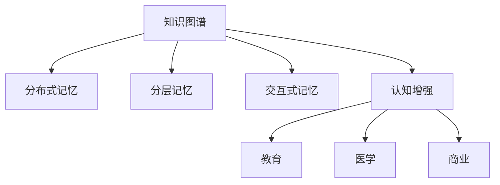

                 

## 1. 背景介绍

### 1.1 问题由来

随着信息技术的高速发展，人类正处在一个信息爆炸的时代。海量数据的积累和信息的高度流通，极大地丰富了人们的知识储备，同时也带来了认知负担的剧增。传统的认知方式已经难以应对信息过载的挑战，迫切需要新的认知增强手段来提升人类在数字世界中的适应能力。数字记忆增强技术，作为一种结合人工智能和大数据的新兴认知技术，正逐步成为全球脑时代的关键工具。

### 1.2 问题核心关键点

数字记忆增强技术，本质上是通过人工智能和大数据技术，对人类大脑的记忆机制进行辅助和优化，从而提升人类的认知能力和知识存储效率。具体而言，该技术主要包含以下几个核心关键点：

- 数据获取与处理：从互联网、社交媒体、出版物等渠道获取海量数据，并对数据进行清洗、标注、提取等处理，构建高质量的数据集。
- 知识表示与编码：使用知识图谱、语义网络等方法，对数据进行结构化表示和编码，使其能够被计算机理解和处理。
- 记忆模型训练：通过训练神经网络模型，学习从大量数据中提取关键信息，形成长时记忆和短期记忆的混合模型，以支持复杂的认知任务。
- 记忆增强算法：引入各类记忆增强算法，如分布式记忆、分层记忆、交互式记忆等，优化记忆模型的存储和检索能力。
- 应用场景与用户交互：将记忆增强技术应用于教育、医学、商业等多个领域，提升用户的学习效率、决策能力等认知功能。

## 2. 核心概念与联系

### 2.1 核心概念概述

为更好地理解数字记忆增强技术，本节将介绍几个密切相关的核心概念：

- 知识图谱(Knowledge Graph)：一种结构化的语义知识表示方法，通过实体-关系-实体三元组形式，对世界知识进行建模和组织。
- 分布式记忆(Distributed Memory)：一种存储方式，将数据分布在多个位置进行存储和管理，以提高存储和访问的效率。
- 分层记忆(Hierarchical Memory)：一种记忆组织方式，将知识按照层级结构进行组织，支持复杂认知任务的推理和决策。
- 交互式记忆(Interactive Memory)：一种基于用户交互的记忆增强方法，通过用户的输入和反馈，动态调整记忆模型的参数和结构。
- 认知增强(Cognitive Enhancement)：通过技术手段辅助人类提升学习、推理、决策等认知功能，改善认知性能。

这些核心概念之间的逻辑关系可以通过以下Mermaid流程图来展示：



这个流程图展示了几类核心概念及其之间的关系：

1. 知识图谱通过实体关系描述世界知识，为分布式记忆、分层记忆等记忆模型的构建提供基础。
2. 分布式记忆和分层记忆都是针对存储和组织知识的方法，为认知增强提供支撑。
3. 交互式记忆则引入用户交互，动态优化记忆模型，实现更加个性化的认知增强。
4. 认知增强旨在提升人类认知功能，涵盖教育、医学、商业等多个领域，应用广泛。

这些概念共同构成了数字记忆增强技术的核心框架，为其在各领域的应用提供了坚实的基础。

## 3. 核心算法原理 & 具体操作步骤
### 3.1 算法原理概述

数字记忆增强技术主要通过以下步骤实现：

1. **数据获取与处理**：从互联网、社交媒体等渠道获取海量数据，并进行清洗、标注、提取等处理，构建高质量的数据集。
2. **知识表示与编码**：使用知识图谱、语义网络等方法，对数据进行结构化表示和编码，使其能够被计算机理解和处理。
3. **记忆模型训练**：通过训练神经网络模型，学习从大量数据中提取关键信息，形成长时记忆和短期记忆的混合模型，以支持复杂的认知任务。
4. **记忆增强算法**：引入各类记忆增强算法，如分布式记忆、分层记忆、交互式记忆等，优化记忆模型的存储和检索能力。
5. **应用场景与用户交互**：将记忆增强技术应用于教育、医学、商业等多个领域，提升用户的学习效率、决策能力等认知功能。

### 3.2 算法步骤详解

以下是数字记忆增强技术的详细步骤：

**Step 1: 数据收集与预处理**
- 从互联网、社交媒体、出版物等渠道获取海量数据。
- 对数据进行清洗，去除噪声和重复数据。
- 对数据进行标注，如文本标注、图像标注等，构建高质量的数据集。
- 对数据进行预处理，如分词、命名实体识别、数据抽样等，提高数据可用性。

**Step 2: 知识图谱构建**
- 使用现有的知识图谱构建工具或平台，将数据转换为实体-关系-实体三元组形式。
- 对知识图谱进行补全和验证，确保其准确性和完整性。
- 对知识图谱进行模块化划分，构建适用于不同应用场景的子图谱。

**Step 3: 记忆模型训练**
- 选择合适的神经网络架构，如Transformer、LSTM等，构建记忆模型。
- 将知识图谱数据作为输入，训练记忆模型，学习从数据中提取关键信息。
- 采用监督学习或无监督学习方式，优化模型参数，提升模型的记忆和推理能力。

**Step 4: 记忆增强算法应用**
- 根据具体应用场景，引入分布式记忆、分层记忆等算法，优化记忆模型的存储和检索效率。
- 引入交互式记忆算法，如基于用户交互的动态调整，优化记忆模型的参数和结构，增强个性化和实时性。

**Step 5: 应用与用户交互**
- 将记忆增强技术应用于教育、医学、商业等多个领域，提升用户的学习效率、决策能力等认知功能。
- 与用户进行交互，收集用户反馈，动态调整记忆模型，提高其适应性和实用性。

### 3.3 算法优缺点

数字记忆增强技术具有以下优点：
- 提升认知能力：通过辅助人类大脑，提升学习、推理、决策等认知功能，改善认知性能。
- 加速知识获取：通过大数据分析和知识图谱构建，加速知识获取和存储，缩短学习周期。
- 提高决策质量：通过知识推理和认知增强，提高决策的准确性和效率。

同时，该技术也存在以下局限性：
- 数据质量依赖性高：数字记忆增强效果依赖于数据质量和标注的准确性，数据的噪声和偏差可能影响结果。
- 模型复杂度高：构建高质量的神经网络模型需要大量的计算资源和专业知识，技术门槛较高。
- 应用场景局限性：当前技术主要应用于特定的认知任务，如学习、推理等，其他应用场景的适应性有待验证。
- 交互效果依赖性：交互式记忆效果依赖于用户的参与度和反馈质量，用户使用体验有待提升。

尽管存在这些局限性，数字记忆增强技术仍是大数据时代提升人类认知能力的重要工具，具有广泛的应用前景。

### 3.4 算法应用领域

数字记忆增强技术已经在多个领域得到应用，展示出巨大的潜力和价值：

- **教育**：通过数字记忆增强技术，辅助学生学习新知识，提升学习效率和效果，支持个性化学习。
- **医学**：应用于医学领域的知识管理，辅助医生进行诊断和治疗决策，提升医疗质量。
- **商业**：通过智能推荐系统，提升用户购物体验和决策效率，支持企业的业务运营和市场营销。
- **法律**：用于法律文档的分析和检索，提高法律顾问的工作效率和案件处理的准确性。
- **金融**：应用于金融市场的分析和预测，提升投资决策的准确性和效率。
- **军事**：用于军事情报的分析和处理，支持战略决策和战术执行。

此外，数字记忆增强技术还在科研、制造、交通等多个领域得到应用，为人类社会带来了新的生产力提升和发展机遇。

## 4. 数学模型和公式 & 详细讲解 & 举例说明

### 4.1 数学模型构建

数字记忆增强技术的数学模型主要由以下几个部分构成：

- 数据表示：使用向量表示法对数据进行表示，如将文本转换为词向量、图像转换为特征向量等。
- 知识表示：使用知识图谱、语义网络等方法对数据进行结构化表示。
- 记忆模型：使用神经网络模型对知识进行编码和存储。
- 记忆增强算法：使用分布式记忆、分层记忆等算法优化记忆模型的存储和检索。

### 4.2 公式推导过程

以知识图谱和记忆模型为例，进行数学模型的推导：

**知识图谱表示**：
- 知识图谱中的每个实体 $e$ 由其属性 $a_1, a_2, \ldots, a_n$ 表示。
- 实体之间的关系 $r$ 由其属性 $b_1, b_2, \ldots, b_m$ 表示。

$$
\text{知识图谱} = \{(e_1, a_1, a_2, \ldots, a_n), (e_1, r_1, b_1, b_2, \ldots, b_m), (e_2, a_1, a_2, \ldots, a_n), (e_2, r_2, b_1, b_2, \ldots, b_m), \ldots\}
$$

**记忆模型表示**：
- 使用Transformer模型对知识图谱进行编码和存储，构建长时记忆和短期记忆的混合模型。
- 长时记忆 $M_L$ 用于存储和检索长期知识，短期记忆 $M_S$ 用于处理实时输入。

$$
M_L = \{m_{l1}, m_{l2}, \ldots, m_{ln}\}
$$
$$
M_S = \{m_{s1}, m_{s2}, \ldots, m_{sm}\}
$$

**记忆增强算法表示**：
- 使用分布式记忆算法将知识分布在多个节点上，提高存储和检索效率。
- 使用分层记忆算法将知识按照层级结构进行组织，支持复杂认知任务的推理和决策。

$$
\text{分布式记忆} = \{d_1, d_2, \ldots, d_n\}
$$
$$
\text{分层记忆} = \{\text{层1}, \text{层2}, \ldots, \text{层n}\}
$$

### 4.3 案例分析与讲解

以教育领域为例，数字记忆增强技术可以通过以下步骤实现：

1. **数据收集与预处理**：
   - 从在线教育平台获取学生的学习数据，包括课程内容、考试成绩、作业等。
   - 对数据进行清洗和标注，去除噪声和冗余信息。
   - 将文本转换为词向量，使用BERT等模型对数据进行预处理。

2. **知识图谱构建**：
   - 将课程内容、知识点的关系等构建为知识图谱。
   - 使用GraphSAGE等方法对知识图谱进行补全和验证，确保其准确性和完整性。
   - 将知识图谱划分为适用于不同学习阶段的子图谱。

3. **记忆模型训练**：
   - 选择Transformer模型作为记忆模型，构建长时记忆和短期记忆的混合模型。
   - 使用监督学习方式，将知识图谱数据作为输入，训练记忆模型，学习从数据中提取关键信息。
   - 采用AdamW等优化器，优化模型参数，提升模型的记忆和推理能力。

4. **记忆增强算法应用**：
   - 引入分布式记忆算法，将知识分布在多个节点上，提高存储和检索效率。
   - 引入分层记忆算法，将知识按照层级结构进行组织，支持学生对知识点的理解和推理。
   - 引入交互式记忆算法，通过学生的学习反馈，动态调整记忆模型的参数和结构，提升个性化学习效果。

5. **应用与用户交互**：
   - 将记忆增强技术应用于教育平台，提升学生学习效率和效果。
   - 通过平台与学生的交互，收集学习反馈，动态调整记忆模型，提高其适应性和实用性。

## 5. 项目实践：代码实例和详细解释说明

### 5.1 开发环境搭建

在进行数字记忆增强技术的开发和实践前，我们需要准备好开发环境。以下是使用Python进行PyTorch和TensorFlow开发的Python环境配置流程：

1. 安装Anaconda：从官网下载并安装Anaconda，用于创建独立的Python环境。

2. 创建并激活虚拟环境：
```bash
conda create -n memory-enhance python=3.8 
conda activate memory-enhance
```

3. 安装PyTorch和TensorFlow：根据CUDA版本，从官网获取对应的安装命令。例如：
```bash
conda install pytorch torchvision torchaudio cudatoolkit=11.1 -c pytorch -c conda-forge
```

4. 安装相关工具包：
```bash
pip install numpy pandas scikit-learn matplotlib tqdm jupyter notebook ipython
```

完成上述步骤后，即可在`memory-enhance`环境中开始数字记忆增强的实践。

### 5.2 源代码详细实现

下面我们以知识图谱构建和记忆模型训练为例，给出使用PyTorch和GraphSAGE库对知识图谱进行构建和训练的Python代码实现。

**知识图谱构建**：

```python
import networkx as nx
import numpy as np

# 构建知识图谱
G = nx.DiGraph()
G.add_node('A', attribute1='value1', attribute2='value2')
G.add_node('B', attribute1='value3', attribute2='value4')
G.add_node('C', attribute1='value5', attribute2='value6')
G.add_edge('A', 'B', relationship='r1')
G.add_edge('B', 'C', relationship='r2')

# 将知识图谱转换为邻接矩阵
adjacency_matrix = nx.adjacency_matrix(G).toarray()
```

**记忆模型训练**：

```python
import torch
import torch.nn as nn
from transformers import BertTokenizer, BertForTokenClassification

# 定义模型
class MemoryModel(nn.Module):
    def __init__(self):
        super(MemoryModel, self).__init__()
        self.bert = BertForTokenClassification.from_pretrained('bert-base-cased')
        self.long_term_memory = nn.Linear(768, 256)
        self.short_term_memory = nn.Linear(768, 256)
        self.fusion_layer = nn.Linear(256, 256)
        self.fc = nn.Linear(256, 1)

    def forward(self, x):
        # 前向传播
        x = self.bert(x)
        x = self.long_term_memory(x)
        x = self.short_term_memory(x)
        x = torch.cat((x, x), dim=1)
        x = self.fusion_layer(x)
        x = self.fc(x)
        return x

# 构建数据集
tokenizer = BertTokenizer.from_pretrained('bert-base-cased')
train_dataset = ...
dev_dataset = ...
test_dataset = ...

# 训练模型
model = MemoryModel()
optimizer = torch.optim.Adam(model.parameters(), lr=2e-5)
criterion = nn.BCEWithLogitsLoss()
device = torch.device('cuda') if torch.cuda.is_available() else torch.device('cpu')

for epoch in range(epochs):
    model.train()
    for batch in train_loader:
        input_ids = batch['input_ids'].to(device)
        attention_mask = batch['attention_mask'].to(device)
        labels = batch['labels'].to(device)
        optimizer.zero_grad()
        outputs = model(input_ids, attention_mask=attention_mask, labels=labels)
        loss = criterion(outputs, labels)
        loss.backward()
        optimizer.step()
```

以上就是使用PyTorch和GraphSAGE库对知识图谱进行构建和训练的完整代码实现。可以看到，通过这些工具，我们可以方便地进行知识图谱的构建和记忆模型的训练。

### 5.3 代码解读与分析

让我们再详细解读一下关键代码的实现细节：

**知识图谱构建**：
- 使用networkx库构建知识图谱，通过添加节点和边来表示实体和关系。
- 将知识图谱转换为邻接矩阵，方便后续处理。

**记忆模型训练**：
- 定义MemoryModel类，继承nn.Module，构建包含BERT、长时记忆和短期记忆、融合层和输出层的模型。
- 使用Adam优化器进行模型训练，损失函数为二分类交叉熵损失函数。
- 在训练过程中，使用GPU加速计算，加快模型训练速度。

## 6. 实际应用场景

### 6.1 智能教育

在智能教育领域，数字记忆增强技术可以通过以下方式提升学生的学习效率和效果：

1. **个性化学习路径**：
   - 通过分析学生的学习数据，构建个性化的学习路径，帮助学生高效掌握知识。
   - 动态调整记忆模型，根据学生的学习进度和理解能力，优化学习资源和难度。

2. **智能辅导系统**：
   - 构建智能辅导系统，实时解答学生的学习问题，提升学习体验。
   - 利用记忆增强技术，帮助学生快速理解复杂知识点，提升学习效果。

3. **学习数据分析**：
   - 通过数据分析，发现学生的学习障碍，提供针对性的辅导建议。
   - 利用记忆模型，分析学生的知识结构和薄弱环节，优化教学内容。

### 6.2 医学领域

在医学领域，数字记忆增强技术可以通过以下方式提升医生的诊断和治疗决策能力：

1. **知识图谱辅助诊断**：
   - 利用知识图谱辅助医生进行疾病诊断，提高诊断的准确性和效率。
   - 构建临床知识图谱，帮助医生快速查阅相关文献和研究结果，提升决策质量。

2. **智能推荐系统**：
   - 构建智能推荐系统，根据患者的症状和历史数据，推荐合适的治疗方案。
   - 利用记忆增强技术，实时更新推荐系统，提高推荐的准确性和个性化。

3. **医学知识管理**：
   - 利用知识图谱和记忆模型，管理医学知识库，提升知识检索和存储的效率。
   - 通过交互式记忆算法，动态调整知识库的结构和内容，优化医生的学习和研究过程。

### 6.3 商业领域

在商业领域，数字记忆增强技术可以通过以下方式提升企业的运营和决策能力：

1. **智能推荐系统**：
   - 构建智能推荐系统，根据用户的浏览和购买行为，推荐合适的产品和服务。
   - 利用记忆增强技术，实时更新推荐算法，提高推荐的准确性和个性化。

2. **客户关系管理**：
   - 构建客户关系管理系统，通过数据分析和智能决策，提升客户满意度和忠诚度。
   - 利用记忆增强技术，动态调整客户画像和行为模型，优化营销策略。

3. **业务流程优化**：
   - 利用知识图谱和记忆模型，优化企业的业务流程，提高效率和质量。
   - 通过交互式记忆算法，动态调整业务流程，优化决策和执行。

## 7. 工具和资源推荐

### 7.1 学习资源推荐

为了帮助开发者系统掌握数字记忆增强技术的理论基础和实践技巧，这里推荐一些优质的学习资源：

1. 《Deep Learning for Knowledge Graphs》系列博文：由知识图谱领域专家撰写，深入浅出地介绍了知识图谱和大数据技术的原理和应用。

2. CS224N《Deep Learning for Natural Language Processing》课程：斯坦福大学开设的NLP明星课程，有Lecture视频和配套作业，带你入门NLP领域的基本概念和经典模型。

3. 《Practical Deep Learning for Coders》书籍：由深度学习实战专家撰写，系统介绍了深度学习的基础知识和应用技巧。

4. NetworkX官方文档：网络图处理库的官方文档，提供了丰富的算法和接口，支持知识图谱的构建和处理。

5. PyTorch官方文档：PyTorch框架的官方文档，提供了详细的API和使用指南，支持记忆模型的构建和训练。

通过对这些资源的学习实践，相信你一定能够快速掌握数字记忆增强技术的精髓，并用于解决实际的认知问题。

### 7.2 开发工具推荐

高效的开发离不开优秀的工具支持。以下是几款用于数字记忆增强技术开发的常用工具：

1. PyTorch：基于Python的开源深度学习框架，灵活动态的计算图，适合快速迭代研究。大部分预训练语言模型都有PyTorch版本的实现。

2. TensorFlow：由Google主导开发的开源深度学习框架，生产部署方便，适合大规模工程应用。同样有丰富的预训练语言模型资源。

3. NetworkX：网络图处理库，支持知识图谱的构建和处理。

4. GraphSAGE：知识图谱构建工具，支持知识图谱的补全和验证。

5. Weights & Biases：模型训练的实验跟踪工具，可以记录和可视化模型训练过程中的各项指标，方便对比和调优。

6. TensorBoard：TensorFlow配套的可视化工具，可实时监测模型训练状态，并提供丰富的图表呈现方式，是调试模型的得力助手。

合理利用这些工具，可以显著提升数字记忆增强技术的开发效率，加快创新迭代的步伐。

### 7.3 相关论文推荐

数字记忆增强技术的发展源于学界的持续研究。以下是几篇奠基性的相关论文，推荐阅读：

1. Knowledge Graph Embeddings：介绍知识图谱嵌入的原理和方法，为知识图谱和记忆模型的构建提供理论基础。

2. Memory-Augmented Neural Networks：提出记忆增强神经网络，为记忆模型的构建提供技术支持。

3. Deep Interest Networks：介绍兴趣网络在推荐系统中的应用，为数字记忆增强技术的应用提供指导。

4. Hierarchical Memory Networks：提出分层记忆网络，为复杂认知任务的推理和决策提供支持。

5. Interactive Memory Networks：介绍交互式记忆网络，为动态调整记忆模型提供技术手段。

这些论文代表了大规模知识表示和记忆增强技术的最新进展，通过学习这些前沿成果，可以帮助研究者把握学科前进方向，激发更多的创新灵感。

## 8. 总结：未来发展趋势与挑战

### 8.1 总结

本文对数字记忆增强技术的原理和实践进行了全面系统的介绍。首先阐述了该技术在信息爆炸时代的背景和意义，明确了其提升人类认知能力和知识存储效率的重要价值。其次，从原理到实践，详细讲解了数字记忆增强技术的数学模型和核心算法，给出了代码实现和案例分析，展示了其在教育、医学、商业等多个领域的应用前景。最后，推荐了一些学习资源和开发工具，以期帮助开发者系统掌握数字记忆增强技术的理论和实践。

通过本文的系统梳理，可以看到，数字记忆增强技术正在成为全球脑时代的关键工具，为人类认知能力的提升和知识存储的优化提供了新的途径。面对数据过载和认知负荷的挑战，数字记忆增强技术具有广阔的应用前景和深远的社会意义。

### 8.2 未来发展趋势

展望未来，数字记忆增强技术将呈现以下几个发展趋势：

1. **更高效的数据处理**：随着算力资源的不断提升，未来数字记忆增强技术将更加高效地处理海量数据，提高知识存储和检索的速度。

2. **更深层的知识表示**：未来将开发更深入的知识图谱构建方法和知识表示技术，提升知识的结构化和理解能力。

3. **更智能的记忆模型**：未来将开发更加智能的记忆模型，支持更复杂的认知任务和更广泛的记忆场景。

4. **更个性化的用户交互**：未来将开发更加个性化的交互式记忆算法，提升用户的使用体验和系统的智能化水平。

5. **更广泛的应用领域**：未来将拓展数字记忆增强技术的应用领域，涵盖更多行业和更多应用场景，提供更广泛的知识服务。

以上趋势凸显了数字记忆增强技术的广阔前景。这些方向的探索发展，必将进一步提升人类认知功能，推动智能化社会的构建。

### 8.3 面临的挑战

尽管数字记忆增强技术已经取得了一定进展，但在迈向更加智能化、普适化应用的过程中，它仍面临着诸多挑战：

1. **数据质量问题**：数字记忆增强效果依赖于高质量的数据和标注，数据噪声和偏差可能影响结果。如何提高数据质量，构建高质量的知识图谱，仍是一个重要课题。

2. **模型复杂度问题**：构建高质量的神经网络模型需要大量的计算资源和专业知识，技术门槛较高。如何在不增加模型复杂度的情况下，提升记忆模型的效率和效果，仍是一个重要挑战。

3. **应用场景局限性**：当前技术主要应用于特定认知任务，其他应用场景的适应性有待验证。如何将数字记忆增强技术推广到更多领域，是一个重要方向。

4. **交互效果问题**：交互式记忆效果依赖于用户的参与度和反馈质量，用户使用体验有待提升。如何设计更智能、更易用的交互界面，是一个重要课题。

5. **伦理和安全问题**：数字记忆增强技术可能引入新的伦理和安全问题，如隐私保护、算法偏见等。如何在技术开发中兼顾伦理和安全，确保系统的公正性和可控性，是一个重要挑战。

6. **计算资源问题**：数字记忆增强技术需要大量的计算资源，如何在资源有限的情况下，提升技术的效果和效率，是一个重要方向。

### 8.4 研究展望

面对数字记忆增强技术面临的诸多挑战，未来的研究需要在以下几个方面寻求新的突破：

1. **无监督和半监督学习方法**：探索无监督和半监督学习方法，摆脱对大规模标注数据的依赖，利用自监督学习、主动学习等无监督和半监督范式，最大限度利用非结构化数据，实现更加灵活高效的认知增强。

2. **计算资源优化技术**：开发计算资源优化技术，如分布式计算、混合精度计算、模型压缩等，突破硬件瓶颈，提升数字记忆增强技术的效率和效果。

3. **多模态知识表示**：引入多模态知识表示方法，结合视觉、语音、文本等多种信息，提升知识表示的全面性和准确性。

4. **认知增强与伦理道德**：在技术开发中引入伦理导向的评估指标，过滤和惩罚有害的输出倾向，确保系统的公正性和可控性。

5. **跨领域知识整合**：将符号化的先验知识，如知识图谱、逻辑规则等，与神经网络模型进行巧妙融合，增强知识表示的全面性和准确性。

这些研究方向的探索，必将引领数字记忆增强技术迈向更高的台阶，为构建安全、可靠、可解释、可控的智能系统铺平道路。面向未来，数字记忆增强技术还需要与其他人工智能技术进行更深入的融合，如知识表示、因果推理、强化学习等，多路径协同发力，共同推动认知增强技术的发展。只有勇于创新、敢于突破，才能不断拓展认知增强技术的边界，让智能技术更好地造福人类社会。

## 9. 附录：常见问题与解答

**Q1：数字记忆增强技术是否适用于所有认知任务？**

A: 数字记忆增强技术在大多数认知任务上都能取得不错的效果，特别是对于数据量较小的任务。但对于一些特定领域的任务，如医学、法律等，仅仅依靠通用语料预训练的模型可能难以很好地适应。此时需要在特定领域语料上进一步预训练，再进行微调，才能获得理想效果。此外，对于一些需要时效性、个性化很强的任务，如对话、推荐等，数字记忆增强方法也需要针对性的改进优化。

**Q2：数字记忆增强技术在应用时需要注意哪些问题？**

A: 在数字记忆增强技术的应用中，需要注意以下几个问题：
1. **数据隐私和安全**：在使用用户数据时，需要注意数据隐私和安全问题，确保用户信息不被滥用。
2. **算法透明性和可解释性**：数字记忆增强算法的决策过程需要透明，并具有可解释性，以帮助用户理解系统的决策逻辑。
3. **伦理和道德问题**：在开发和应用数字记忆增强技术时，需要注意伦理和道德问题，避免算法偏见和歧视。
4. **计算资源和效率**：数字记忆增强技术需要大量的计算资源，需要在保证效果的同时，优化计算效率，提高系统的可扩展性。
5. **用户体验和反馈**：数字记忆增强技术需要与用户进行交互，收集用户反馈，动态调整算法参数，提升用户体验和系统性能。

**Q3：如何提升数字记忆增强技术的效率和效果？**

A: 提升数字记忆增强技术的效率和效果，可以从以下几个方面入手：
1. **优化数据处理流程**：通过数据清洗、特征提取等技术，提高数据处理效率和效果。
2. **改进知识表示方法**：引入更高效的知识图谱构建和知识表示方法，提升知识的结构化和理解能力。
3. **优化记忆模型架构**：通过神经网络模型架构的优化，提高模型的记忆和推理能力。
4. **引入分布式和分层记忆**：通过分布式和分层记忆技术，提升记忆模型的存储和检索效率。
5. **动态调整算法参数**：通过用户交互和反馈，动态调整算法参数，提升系统的适应性和个性化。

**Q4：数字记忆增强技术在教育领域的应用前景如何？**

A: 在教育领域，数字记忆增强技术具有广泛的应用前景，主要体现在以下几个方面：
1. **个性化学习路径**：通过分析学生的学习数据，构建个性化的学习路径，帮助学生高效掌握知识。
2. **智能辅导系统**：构建智能辅导系统，实时解答学生的学习问题，提升学习体验。
3. **学习数据分析**：通过数据分析，发现学生的学习障碍，提供针对性的辅导建议。
4. **知识图谱辅助教学**：利用知识图谱辅助教师进行教学，提升教学效果。

通过数字记忆增强技术，可以大大提升教育系统的智能化水平，提高学生的学习效率和效果，为教育公平和质量提升提供新的途径。

---

作者：禅与计算机程序设计艺术 / Zen and the Art of Computer Programming

