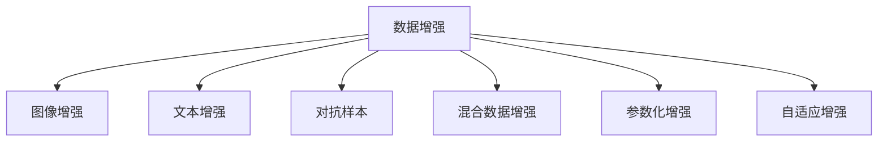

                 

## 1. 背景介绍

### 1.1 问题由来

随着深度学习模型的不断发展，其在图像、语音、自然语言处理等领域均取得了令人瞩目的进展。然而，尽管训练数据集规模不断增长，模型依然在泛化能力和鲁棒性方面面临挑战。一方面，标注数据集的获取成本高昂且样本数量有限，难以充分覆盖真实场景。另一方面，由于数据分布的复杂性，模型容易过拟合训练数据，导致在实际应用中的表现不佳。因此，数据增强技术应运而生，通过各种数据变换手段丰富训练样本的多样性，从而提升模型的泛化能力和鲁棒性。

数据增强（Data Augmentation）是指通过一系列图像变换、文本修改等手段，生成新的、更丰富的训练数据，以增强模型对数据分布的鲁棒性和泛化能力。常见的数据增强方法包括随机裁剪、旋转、翻转、颜色抖动等。这些方法可以有效地提高模型的泛化能力，使其在面对新的、未见过的数据时，仍然能够保持良好的表现。

然而，数据增强并非万能药。在实际应用中，过度依赖数据增强可能导致模型在训练数据上表现优异，但在实际应用中却难以泛化。此外，某些数据增强手段可能带来一定的偏差，影响模型的公平性和准确性。因此，如何在数据增强的过程中，兼顾经验驱动与想象力驱动，是一个值得深入探讨的问题。

### 1.2 问题核心关键点

数据增强的核心关键点在于如何在保证模型性能的前提下，尽可能地生成更多、更丰富的训练数据。这涉及到以下几个方面：

- **数据多样性**：如何通过变换生成更多样的数据，以覆盖更广泛的数据分布。
- **偏差控制**：如何在增强数据的同时，避免引入过多的偏差，影响模型的公平性和准确性。
- **计算效率**：如何在保证数据增强效果的同时，尽量减少计算资源消耗。
- **模型适应性**：如何根据具体的任务和数据集特点，选择最适合的数据增强方法。

这些问题共同构成了数据增强技术的研究核心，也是本文将重点探讨的内容。

## 2. 核心概念与联系

### 2.1 核心概念概述

为更好地理解数据增强技术，本文将介绍几个关键概念：

- **数据增强（Data Augmentation）**：指通过一系列变换手段，生成新的、更丰富的训练数据，以提升模型泛化能力。
- **图像增强（Image Augmentation）**：针对图像数据，通过随机裁剪、旋转、翻转等手段，生成更多样的训练样本。
- **文本增强（Text Augmentation）**：针对文本数据，通过同义词替换、回译等手段，生成更多样的训练样本。
- **对抗样本（Adversarial Examples）**：指通过小幅度扰动输入数据，生成对抗样本，以提高模型的鲁棒性。
- **混合数据增强（Hybrid Augmentation）**：指将图像、文本等多模态数据结合，生成更丰富的训练数据，以提升模型的泛化能力。
- **参数化增强（Parameterized Augmentation）**：指通过模型参数控制增强过程，实现更灵活、更高效的数据增强。
- **自适应增强（Adaptive Augmentation）**：指根据数据分布特点，动态调整增强策略，以更有效地生成训练数据。

这些概念之间存在密切联系，共同构成了数据增强技术的研究框架。

### 2.2 核心概念原理和架构的 Mermaid 流程图



这个流程图展示了数据增强技术的主要研究方向和子领域，每个子领域都有其特定的增强手段和应用场景。通过这些研究方向的协同作用，可以更全面地提升模型的泛化能力和鲁棒性。

## 3. 核心算法原理 & 具体操作步骤

### 3.1 算法原理概述

数据增强的原理是通过一系列变换手段，生成新的、更丰富的训练数据，以提高模型的泛化能力和鲁棒性。其核心思想是在不增加标注样本的情况下，通过数据变换生成更多的训练样本，从而降低模型过拟合的风险。

形式化地，设训练数据集为 $D = \{(x_i, y_i)\}_{i=1}^N$，其中 $x_i$ 为输入数据，$y_i$ 为标签。数据增强的目标是生成新的训练数据集 $D' = \{(x'_i, y'_i)\}_{i=1}^{N'}$，其中 $N'$ 为增强后的样本数量。增强后的样本应与原样本在统计分布上尽可能接近，以保证增强数据的泛化能力。

### 3.2 算法步骤详解

数据增强的具体步骤如下：

**Step 1: 选择增强策略**

根据数据的特点和任务的需求，选择合适的增强策略。常见的增强策略包括：

- **图像增强**：随机裁剪、旋转、翻转、颜色抖动等。
- **文本增强**：同义词替换、回译、插入、删除等。
- **对抗样本**：小幅度扰动输入数据，生成对抗样本。
- **混合数据增强**：将图像、文本等多模态数据结合，生成更丰富的训练数据。
- **参数化增强**：通过模型参数控制增强过程，实现更灵活、更高效的数据增强。
- **自适应增强**：根据数据分布特点，动态调整增强策略，以更有效地生成训练数据。

**Step 2: 生成增强数据**

根据选择的增强策略，生成新的训练数据。例如，对于图像数据，可以使用OpenCV等库进行随机裁剪、旋转等变换；对于文本数据，可以使用NLTK等库进行同义词替换、回译等变换。

**Step 3: 合并增强数据**

将生成的增强数据与原始数据集合并，形成新的训练数据集。例如，将原始数据集 $D$ 与增强数据集 $D'$ 合并，形成新的训练数据集 $D'' = D \cup D'$。

**Step 4: 训练模型**

使用合并后的训练数据集 $D''$ 训练模型，以提升模型的泛化能力和鲁棒性。

### 3.3 算法优缺点

数据增强技术具有以下优点：

- **提升泛化能力**：通过生成更多样的训练数据，模型能够更好地适应各种数据分布，提高泛化能力。
- **降低过拟合风险**：通过引入更多样化的训练数据，模型能够更好地泛化，降低过拟合的风险。
- **提高计算效率**：数据增强可以通过一些简单、高效的变换方法生成大量的训练数据，提高训练效率。

同时，数据增强技术也存在一些缺点：

- **引入偏差**：某些增强手段可能引入偏差，影响模型的公平性和准确性。
- **计算资源消耗大**：部分增强手段需要复杂的计算资源，可能带来计算瓶颈。
- **生成数据质量难以保证**：部分增强手段可能生成质量较低的训练数据，影响模型的性能。

### 3.4 算法应用领域

数据增强技术在图像、语音、自然语言处理等多个领域均得到了广泛应用。例如：

- **图像分类**：通过随机裁剪、旋转、翻转等增强手段，生成更多样的训练数据，提高模型的泛化能力。
- **目标检测**：通过随机裁剪、缩放、旋转等增强手段，生成更多样的训练数据，提高模型的鲁棒性。
- **语音识别**：通过改变音频的音量、速度、语调等特征，生成更多样的训练数据，提高模型的泛化能力。
- **文本分类**：通过同义词替换、回译等增强手段，生成更多样的训练数据，提高模型的泛化能力。
- **对话系统**：通过改变对话的历史信息、语言风格等特征，生成更多样的训练数据，提高模型的鲁棒性。
- **生成对抗网络（GAN）**：通过对抗样本生成，生成更丰富的训练数据，提高模型的鲁棒性。

## 4. 数学模型和公式 & 详细讲解 & 举例说明

### 4.1 数学模型构建

本节将使用数学语言对数据增强技术进行更加严格的刻画。

设原始训练数据集为 $D = \{(x_i, y_i)\}_{i=1}^N$，其中 $x_i$ 为输入数据，$y_i$ 为标签。设增强后的训练数据集为 $D' = \{(x'_i, y'_i)\}_{i=1}^{N'}$，其中 $x'_i$ 为增强后的输入数据，$y'_i$ 为增强后的标签。

定义模型 $M_{\theta}$ 在输入数据 $x$ 上的输出为 $M_{\theta}(x)$，损失函数为 $\mathcal{L}(M_{\theta}(x), y)$。定义增强后的模型 $M'_{\theta}$ 在增强后数据 $x'$ 上的输出为 $M'_{\theta}(x')$，损失函数为 $\mathcal{L}(M'_{\theta}(x'), y')$。

数据增强的目标是最大化训练数据集 $D$ 与增强数据集 $D'$ 的模型性能，即：

$$
\max_{\theta} \mathcal{L}(M_{\theta}(x), y) + \mathcal{L}(M'_{\theta}(x'), y')
$$

在实践中，我们通常使用梯度下降等优化算法来近似求解上述最优化问题。设 $\eta$ 为学习率，则模型参数 $\theta$ 的更新公式为：

$$
\theta \leftarrow \theta - \eta \nabla_{\theta}\mathcal{L}(M_{\theta}(x), y) - \eta \nabla_{\theta}\mathcal{L}(M'_{\theta}(x'), y')
$$

其中 $\nabla_{\theta}\mathcal{L}(M_{\theta}(x), y)$ 和 $\nabla_{\theta}\mathcal{L}(M'_{\theta}(x'), y')$ 分别为模型在原始数据和增强数据上的损失函数对模型参数的梯度，可通过反向传播算法高效计算。

### 4.2 公式推导过程

以下我们以图像分类任务为例，推导数据增强的损失函数及其梯度的计算公式。

设原始数据集 $D = \{(x_i, y_i)\}_{i=1}^N$，其中 $x_i$ 为 $M \times N \times C$ 的图像张量，$y_i \in \{1, \ldots, K\}$ 为标签。增强后的数据集 $D' = \{(x'_i, y'_i)\}_{i=1}^{N'}$，其中 $x'_i$ 为 $M' \times N' \times C$ 的图像张量，$y'_i \in \{1, \ldots, K\}$ 为标签。

增强后的图像 $x'_i$ 是通过一系列变换得到的，例如随机裁剪、旋转、翻转等。设 $x'_i = T(x_i)$，其中 $T$ 为变换函数。对于每个增强后的图像，其损失函数定义为：

$$
\mathcal{L}(M'_{\theta}(x'_i), y'_i) = \frac{1}{N'} \sum_{i=1}^{N'} \mathcal{L}(M'_{\theta}(x'_i), y'_i)
$$

其中 $\mathcal{L}$ 为交叉熵损失函数。增强后的模型 $M'_{\theta}$ 在增强后的图像 $x'_i$ 上的损失函数为：

$$
\mathcal{L}(M'_{\theta}(x'_i), y'_i) = -\sum_{k=1}^K y'_i \log \frac{\exp M'_{\theta}(x'_i)[k]}{\sum_{j=1}^K \exp M'_{\theta}(x'_i)[j]}
$$

将上述两个损失函数代入目标函数，得：

$$
\max_{\theta} \frac{1}{N} \sum_{i=1}^N -\sum_{k=1}^K y_i \log \frac{\exp M_{\theta}(x_i)[k]}{\sum_{j=1}^K \exp M_{\theta}(x_i)[j]} + \frac{1}{N'} \sum_{i=1}^{N'} -\sum_{k=1}^K y'_i \log \frac{\exp M'_{\theta}(x'_i)[k]}{\sum_{j=1}^K \exp M'_{\theta}(x'_i)[j]}
$$

在得到损失函数的梯度后，即可带入模型参数更新公式，完成模型的迭代优化。重复上述过程直至收敛，最终得到适应增强数据集的模型参数 $\theta$。

### 4.3 案例分析与讲解

假设我们使用随机裁剪和旋转两种增强手段，对原始图像数据进行增强。具体步骤如下：

1. **选择增强策略**：随机裁剪和旋转。
2. **生成增强数据**：使用OpenCV库对原始图像进行随机裁剪和旋转，生成新的训练数据。
3. **合并增强数据**：将原始数据集 $D$ 与增强数据集 $D'$ 合并，形成新的训练数据集 $D'' = D \cup D'$。
4. **训练模型**：使用合并后的训练数据集 $D''$ 训练模型，以提升模型的泛化能力和鲁棒性。

例如，对于原始图像 $x_i$，通过随机裁剪得到 $x'_i = \text{crop}(x_i)$，通过随机旋转得到 $x'_i = \text{rotate}(x'_i)$。最终的增强图像 $x'_i$ 被用于训练模型。

在实践中，为了提高增强数据的泛化能力，通常使用多个增强策略组合使用，并动态调整增强参数，以更有效地生成训练数据。例如，对于图像分类任务，可以使用随机裁剪、旋转、缩放、翻转等多种增强手段组合使用，并通过数据分布特点动态调整增强参数。

## 5. 项目实践：代码实例和详细解释说明

### 5.1 开发环境搭建

在进行数据增强实践前，我们需要准备好开发环境。以下是使用Python进行PyTorch开发的环境配置流程：

1. 安装Anaconda：从官网下载并安装Anaconda，用于创建独立的Python环境。

2. 创建并激活虚拟环境：
```bash
conda create -n pytorch-env python=3.8 
conda activate pytorch-env
```

3. 安装PyTorch：根据CUDA版本，从官网获取对应的安装命令。例如：
```bash
conda install pytorch torchvision torchaudio cudatoolkit=11.1 -c pytorch -c conda-forge
```

4. 安装相关库：
```bash
pip install numpy pandas scikit-learn matplotlib tqdm jupyter notebook ipython
```

5. 安装OpenCV：
```bash
pip install opencv-python
```

完成上述步骤后，即可在`pytorch-env`环境中开始数据增强实践。

### 5.2 源代码详细实现

下面我们以图像分类任务为例，给出使用PyTorch和OpenCV对图像数据进行增强的PyTorch代码实现。

首先，定义数据增强函数：

```python
import cv2
import numpy as np

def random_crop(image, size):
    h, w = image.shape[:2]
    crop_h, crop_w = size
    x1 = np.random.randint(0, w - crop_w + 1)
    y1 = np.random.randint(0, h - crop_h + 1)
    return image[y1:y1 + crop_h, x1:x1 + crop_w]

def random_rotation(image, max_angle):
    h, w = image.shape[:2]
    angle = np.random.uniform(-max_angle, max_angle)
    rows, cols = image.shape[:2]
    rotation_matrix = cv2.getRotationMatrix2D((w/2, h/2), angle, 1)
    return cv2.warpAffine(image, rotation_matrix, (w, h))

def random_flip(image, flip_prob):
    if np.random.rand() < flip_prob:
        return np.flip(image, axis=0)
    else:
        return image

def random_rescale(image, scale_range):
    scale = np.random.uniform(*scale_range)
    return cv2.resize(image, None, fx=scale, fy=scale, interpolation=cv2.INTER_LINEAR)
```

然后，定义训练函数：

```python
from torch.utils.data import DataLoader, Dataset
import torch.nn as nn
import torch.optim as optim
from torchvision import transforms

class ImageDataset(Dataset):
    def __init__(self, data, transform=None):
        self.data = data
        self.transform = transform
        
    def __len__(self):
        return len(self.data)
    
    def __getitem__(self, idx):
        image = self.data[idx]
        label = self.labels[idx]
        if self.transform:
            image = self.transform(image)
        return image, label

transform = transforms.Compose([
    transforms.ToTensor(),
    transforms.Normalize(mean=[0.5, 0.5, 0.5], std=[0.5, 0.5, 0.5]),
    transforms.RandomResizedCrop(224),
    transforms.RandomRotation(10),
    transforms.RandomHorizontalFlip(p=0.5),
    transforms.RandomRescaling(scale=(0.8, 1.2))
])

train_dataset = ImageDataset(train_data, transform=transform)
test_dataset = ImageDataset(test_data, transform=transform)

batch_size = 32
device = torch.device('cuda' if torch.cuda.is_available() else 'cpu')

model = torchvision.models.resnet18(pretrained=True)
model.fc = nn.Linear(512, num_classes)
model.to(device)

criterion = nn.CrossEntropyLoss()
optimizer = optim.Adam(model.parameters(), lr=0.001)

train_loader = DataLoader(train_dataset, batch_size=batch_size, shuffle=True)
test_loader = DataLoader(test_dataset, batch_size=batch_size, shuffle=False)

for epoch in range(num_epochs):
    model.train()
    for images, labels in train_loader:
        images = images.to(device)
        labels = labels.to(device)
        optimizer.zero_grad()
        outputs = model(images)
        loss = criterion(outputs, labels)
        loss.backward()
        optimizer.step()
        
    model.eval()
    with torch.no_grad():
        correct = 0
        total = 0
        for images, labels in test_loader:
            images = images.to(device)
            labels = labels.to(device)
            outputs = model(images)
            _, predicted = torch.max(outputs, 1)
            total += labels.size(0)
            correct += (predicted == labels).sum().item()
        print('Accuracy of the network on the 10000 test images: %d %%' % (100 * correct / total))
```

在这个例子中，我们使用OpenCV库对图像数据进行了随机裁剪、旋转、翻转、缩放等变换，并将变换后的图像用于训练模型。这些变换方法可以在`random_crop`、`random_rotation`、`random_flip`、`random_rescale`等函数中实现。

### 5.3 代码解读与分析

让我们再详细解读一下关键代码的实现细节：

**ImageDataset类**：
- `__init__`方法：初始化数据集和转换函数。
- `__len__`方法：返回数据集的样本数量。
- `__getitem__`方法：对单个样本进行处理，将图像输入转换为张量，并对其进行归一化。

**数据增强函数**：
- `random_crop`：使用随机裁剪生成新的训练数据。
- `random_rotation`：使用随机旋转生成新的训练数据。
- `random_flip`：使用随机翻转生成新的训练数据。
- `random_rescale`：使用随机缩放生成新的训练数据。

**训练函数**：
- 定义数据集类 `ImageDataset`，用于加载图像数据，并进行数据增强。
- 定义变换函数 `transform`，包含多种数据增强手段。
- 使用 `DataLoader` 加载数据集，并设置批量大小、设备等参数。
- 定义模型、损失函数、优化器等，并进行模型训练。

**模型训练**：
- 在每个epoch中，对训练集数据进行迭代训练。
- 在每个批次中，将输入图像和标签数据传递给模型，计算损失函数并反向传播更新模型参数。
- 在每个epoch结束时，在测试集上评估模型性能，输出准确率。

通过这个例子，我们可以看到，数据增强技术在大规模图像分类任务中的应用，可以通过一系列简单、高效的数据变换方法，生成更丰富的训练数据，从而提升模型的泛化能力和鲁棒性。

当然，实际应用中需要根据具体的任务和数据集特点，选择合适的增强策略，并进行参数调整，以获得最佳的增强效果。

## 6. 实际应用场景

### 6.1 图像分类

在图像分类任务中，数据增强技术通过随机裁剪、旋转、翻转等手段，生成更多样的训练数据，从而提升模型的泛化能力和鲁棒性。例如，在医疗影像分类任务中，可以通过随机旋转、缩放等手段，生成不同角度、不同大小的影像数据，提高模型的鲁棒性。

### 6.2 目标检测

在目标检测任务中，数据增强技术通过随机裁剪、缩放、旋转等手段，生成更多样的训练数据，从而提升模型的鲁棒性。例如，在交通标志检测任务中，可以通过随机裁剪、旋转等手段，生成不同角度、不同大小的标志图像，提高模型的鲁棒性。

### 6.3 语音识别

在语音识别任务中，数据增强技术通过改变音频的音量、速度、语调等特征，生成更多样的训练数据，从而提升模型的泛化能力和鲁棒性。例如，在语音识别任务中，可以通过变速、变调等手段，生成不同语速、不同语调的语音数据，提高模型的泛化能力。

### 6.4 自然语言处理

在自然语言处理任务中，数据增强技术通过同义词替换、回译等手段，生成更多样的训练数据，从而提升模型的泛化能力和鲁棒性。例如，在文本分类任务中，可以通过同义词替换、回译等手段，生成不同表达方式的训练数据，提高模型的泛化能力。

### 6.5 生成对抗网络（GAN）

在生成对抗网络（GAN）中，数据增强技术通过对抗样本生成，生成更丰富的训练数据，从而提升模型的鲁棒性。例如，在GAN中，可以通过对抗样本生成，生成更多样、更复杂的图像数据，提高模型的鲁棒性。

## 7. 工具和资源推荐

### 7.1 学习资源推荐

为了帮助开发者系统掌握数据增强技术，这里推荐一些优质的学习资源：

1. 《Data Augmentation in Deep Learning》博客系列：由深度学习领域专家撰写，深入浅出地介绍了数据增强技术的原理和实践。

2. 《Computer Vision: Fundamentals and Applications》教材：斯坦福大学推出的计算机视觉教材，涵盖数据增强技术的多种应用场景。

3. 《Hands-On Data Augmentation》课程：由Kaggle举办的线上课程，系统讲解数据增强技术的实现方法和应用场景。

4. 《Data Augmentation with Keras》教程：使用Keras框架实现数据增强的详细教程，适合初学者入门。

5. 《Deep Learning with Python》书籍：使用Keras和TensorFlow实现数据增强的详细示例，涵盖多种数据增强方法。

通过对这些资源的学习实践，相信你一定能够快速掌握数据增强技术的精髓，并用于解决实际的NLP问题。

### 7.2 开发工具推荐

高效的开发离不开优秀的工具支持。以下是几款用于数据增强开发的常用工具：

1. OpenCV：开源计算机视觉库，包含丰富的图像处理函数，适合数据增强的实现。

2. NLTK：Python自然语言处理库，包含丰富的文本处理函数，适合数据增强的实现。

3. Keras：高层次的深度学习框架，易于上手，适合快速实现数据增强。

4. PyTorch：基于Python的开源深度学习框架，灵活性强，适合实现复杂的数据增强方法。

5. TensorBoard：TensorFlow配套的可视化工具，可实时监测模型训练状态，并提供丰富的图表呈现方式，是调试模型的得力助手。

6. Weights & Biases：模型训练的实验跟踪工具，可以记录和可视化模型训练过程中的各项指标，方便对比和调优。

合理利用这些工具，可以显著提升数据增强任务的开发效率，加快创新迭代的步伐。

### 7.3 相关论文推荐

数据增强技术的发展源于学界的持续研究。以下是几篇奠基性的相关论文，推荐阅读：

1. "Data Augmentation in Deep Learning"（数据增强技术综述）：综述了多种数据增强方法，包括图像、文本、音频等领域的增强手段。

2. "Image Data Augmentation"（图像数据增强技术）：详细介绍多种图像数据增强方法，涵盖随机裁剪、旋转、翻转等手段。

3. "Text Data Augmentation"（文本数据增强技术）：详细介绍多种文本数据增强方法，涵盖同义词替换、回译等手段。

4. "Adversarial Examples and Adversarial Neural Networks"（对抗样本和对抗网络）：探讨了对抗样本的生成方法和应用场景，揭示了对抗样本的生成机理。

5. "Hybrid Data Augmentation"（混合数据增强技术）：探讨了将图像、文本等多模态数据结合，生成更丰富的训练数据，提高模型的泛化能力。

这些论文代表了大数据增强技术的研究脉络。通过学习这些前沿成果，可以帮助研究者把握学科前进方向，激发更多的创新灵感。

## 8. 总结：未来发展趋势与挑战

### 8.1 总结

本文对数据增强技术进行了全面系统的介绍。首先阐述了数据增强技术的背景和意义，明确了数据增强在提升模型泛化能力和鲁棒性方面的独特价值。其次，从原理到实践，详细讲解了数据增强的数学模型和关键步骤，给出了数据增强任务开发的完整代码实例。同时，本文还广泛探讨了数据增强技术在图像、语音、自然语言处理等多个领域的应用前景，展示了数据增强范式的巨大潜力。此外，本文精选了数据增强技术的各类学习资源，力求为读者提供全方位的技术指引。

通过本文的系统梳理，可以看到，数据增强技术正在成为深度学习模型训练的重要范式，极大地拓展了模型对数据分布的适应能力，提升模型泛化能力和鲁棒性。未来，伴随数据增强方法与深度学习技术的进一步融合，相信数据增强技术必将在更多领域大放异彩，推动人工智能技术向更深层次发展。

### 8.2 未来发展趋势

展望未来，数据增强技术将呈现以下几个发展趋势：

1. **数据增强方法的多样化**：随着深度学习模型和算法的不断演进，将涌现更多种类的数据增强方法，涵盖图像、文本、音频等多种模态。

2. **数据增强的参数化**：通过引入模型参数控制增强过程，实现更灵活、更高效的数据增强，降低计算资源的消耗。

3. **自适应增强**：根据数据分布特点，动态调整增强策略，以更有效地生成训练数据，提高模型的泛化能力。

4. **跨模态增强**：将图像、文本、音频等多种模态数据结合，生成更丰富的训练数据，提高模型的泛化能力和鲁棒性。

5. **对抗样本增强**：引入对抗样本生成，提高模型的鲁棒性，增强模型对攻击的防御能力。

6. **无监督和半监督增强**：利用自监督学习、主动学习等无监督和半监督范式，最大化利用非结构化数据，实现更高效的数据增强。

以上趋势凸显了数据增强技术的广阔前景。这些方向的探索发展，必将进一步提升深度学习模型的泛化能力和鲁棒性，为人工智能技术带来新的突破。

### 8.3 面临的挑战

尽管数据增强技术在提升模型泛化能力和鲁棒性方面取得了显著成效，但在实际应用中，仍面临一些挑战：

1. **增强数据质量**：部分增强手段可能生成质量较低的训练数据，影响模型的性能。
2. **计算资源消耗**：部分增强手段需要复杂的计算资源，可能带来计算瓶颈。
3. **增强策略选择**：如何根据具体的任务和数据集特点，选择最适合的数据增强方法，需要更多的研究和实践。
4. **增强数据公平性**：部分增强手段可能引入偏差，影响模型的公平性和准确性。

这些挑战需要进一步研究和探索，以实现更高效、更可靠的数据增强。

### 8.4 研究展望

未来的研究需要在以下几个方面寻求新的突破：

1. **无监督和半监督增强**：摆脱对大规模标注数据的依赖，利用自监督学习、主动学习等无监督和半监督范式，最大化利用非结构化数据，实现更高效的数据增强。

2. **混合数据增强**：将图像、文本等多模态数据结合，生成更丰富的训练数据，提高模型的泛化能力。

3. **对抗样本增强**：引入对抗样本生成，提高模型的鲁棒性，增强模型对攻击的防御能力。

4. **自适应增强**：根据数据分布特点，动态调整增强策略，以更有效地生成训练数据。

5. **参数化增强**：通过模型参数控制增强过程，实现更灵活、更高效的数据增强。

6. **伦理和安全**：在数据增强过程中，引入伦理和安全约束，确保模型输出符合人类价值观和伦理道德。

这些研究方向的探索，必将引领数据增强技术向更高的台阶发展，为深度学习模型带来新的突破。面向未来，数据增强技术还需要与其他人工智能技术进行更深入的融合，如知识表示、因果推理、强化学习等，多路径协同发力，共同推动深度学习模型的进步。只有勇于创新、敢于突破，才能不断拓展深度学习模型的边界，让人工智能技术更好地造福人类社会。

## 9. 附录：常见问题与解答

**Q1：什么是数据增强？**

A: 数据增强是指通过一系列变换手段，生成新的、更丰富的训练数据，以提高模型的泛化能力和鲁棒性。

**Q2：数据增强有哪些具体方法？**

A: 数据增强的具体方法包括图像增强（如随机裁剪、旋转、翻转）、文本增强（如同义词替换、回译）、对抗样本生成等。

**Q3：如何选择合适的数据增强策略？**

A: 根据具体的任务和数据集特点，选择合适的数据增强策略。例如，对于图像分类任务，可以选择随机裁剪、旋转、缩放等方法；对于文本分类任务，可以选择同义词替换、回译等方法。

**Q4：数据增强是否需要标注数据？**

A: 数据增强不需要标注数据，可以通过简单的数据变换方法生成新的训练数据，以提高模型的泛化能力。

**Q5：数据增强的计算资源消耗大吗？**

A: 部分数据增强手段需要复杂的计算资源，可能带来计算瓶颈。可以通过参数化增强等方法降低计算资源消耗。

**Q6：如何提高增强数据的质量？**

A: 选择合适的数据增强策略，并动态调整增强参数，以生成更高质量的数据。

通过这些问题的解答，相信读者对数据增强技术有了更深入的理解，能够更好地应用于实际的深度学习模型开发中。

---

作者：禅与计算机程序设计艺术 / Zen and the Art of Computer Programming

