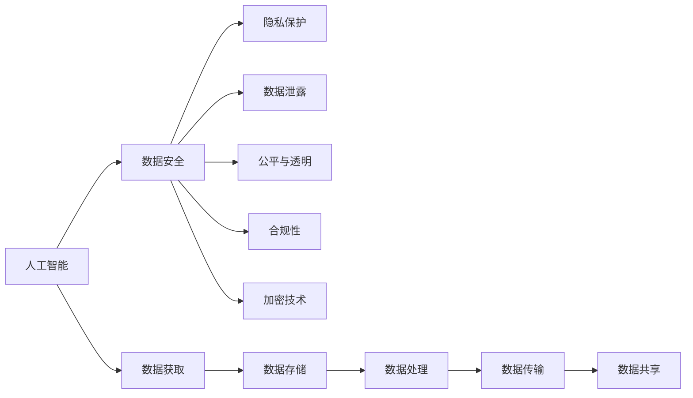

                 

# 数据安全：AI 时代的全球性挑战

## 1. 背景介绍

### 1.1 问题由来
随着人工智能(AI)技术的飞速发展，数据安全问题变得愈发严峻。AI系统在医疗、金融、交通、教育等多个领域的应用，涉及大量敏感的个人和商业数据，一旦遭受攻击或滥用，将带来巨大的社会和经济损失。近年来，涉及AI系统的数据泄露和隐私侵犯事件频发，如2019年Facebook 5000万用户数据泄露事件、2021年Zoom的隐私问题等，引发了广泛关注。

面对日益严峻的数据安全挑战，全球各大科技公司纷纷加强了数据保护措施。Google宣布对其广告数据进行严格的隐私保护，要求所有广告商使用符合隐私标准的数据。IBM推出了AI Fairness 360库，帮助开发者构建公平、透明的AI模型。微软承诺在所有AI产品中采用隐私设计原则，并推出了新的数据隐私平台。

在AI时代，数据安全已不再仅仅是技术问题，而是一项全球性的挑战，涉及法律、伦理、政策、技术等诸多方面。本文将从技术层面深入探讨AI时代的数据安全问题，剖析核心概念，揭示关键算法，并提出具体策略，以期为全球数据安全治理提供借鉴和参考。

## 2. 核心概念与联系

### 2.1 核心概念概述

为更好地理解AI时代的数据安全问题，本节将介绍几个关键概念：

- **人工智能（AI）**：利用机器学习、深度学习等技术，赋予机器一定的智能，使其能够在特定领域执行复杂任务。
- **数据安全**：保护数据的机密性、完整性和可用性，防止未经授权的访问、使用和泄露。
- **隐私保护**：保护个人或组织在数据处理过程中的隐私权，防止数据被滥用或泄露。
- **数据泄露**：指未经授权的个人或组织获取敏感数据的行为，可能导致严重后果。
- **公平与透明**：确保AI模型的决策过程公正、透明，避免偏见和歧视。
- **合规性**：符合法律法规、行业标准和道德规范，如GDPR（通用数据保护条例）、CCPA（加州消费者隐私法）等。
- **加密技术**：将数据转化为无意义的代码，只有授权用户才能解密读取，是保护数据安全的重要手段。

这些概念共同构成了AI时代数据安全的理论基础和实践指南，揭示了数据安全的多个维度，并指明了应对策略的方向。

### 2.2 核心概念原理和架构的 Mermaid 流程图



这个流程图展示了AI与数据安全之间的关系：

1. AI系统需要获取、处理、传输、共享数据，才能执行任务。
2. 数据安全涉及隐私保护、数据泄露、公平透明、合规性、加密技术等多个层面。
3. 数据获取、存储、处理、传输、共享过程中，必须严格遵循数据安全规范，确保数据在各个环节的安全。

## 3. 核心算法原理 & 具体操作步骤

### 3.1 算法原理概述

AI时代的数据安全涉及多种算法和技术，主要包括数据加密、隐私保护算法、模型公平透明算法等。这些算法共同构成了一个综合的数据安全体系，保障AI系统在各个环节的数据安全。

### 3.2 算法步骤详解

#### 3.2.1 数据加密算法

数据加密是保障数据安全的重要手段，通过将数据转化为无意义的代码，只有授权用户才能解密读取。常用的加密算法包括对称加密（如AES、DES）和非对称加密（如RSA、ECC）。以下是AES加密算法的详细步骤：

1. **密钥生成**：随机生成一个256位的密钥$k$。
2. **明文处理**：将明文$P$分成若干块，每个块长度为128位。
3. **加密过程**：
   - **初始化向量**：随机生成一个128位的初始化向量$IV$。
   - **轮函数**：对明文进行多次轮加密，每次轮函数包含四个步骤：子字节层、置换层、密钥加层、轮密钥加层。
4. **密文生成**：将加密后的密文$C$和初始化向量$IV$一起存储。

#### 3.2.2 隐私保护算法

隐私保护算法主要通过技术手段，在保护数据隐私的同时，确保数据的可用性和分析价值。以下是差分隐私算法的详细步骤：

1. **数据扰动**：对敏感数据$x$进行扰动，生成一个扰动后的数据$\tilde{x}$。
2. **隐私损失函数**：计算扰动后的数据与原始数据的差异，即隐私损失函数$\epsilon$。
3. **聚合**：将多个扰动后的数据进行聚合，生成一个聚合结果$\hat{x}$。
4. **发布**：发布聚合结果$\hat{x}$，同时公开隐私损失函数$\epsilon$。

#### 3.2.3 模型公平透明算法

公平透明算法主要通过技术手段，确保AI模型的决策过程公正、透明，避免偏见和歧视。以下是公平性算法（如Equalized Odds）的详细步骤：

1. **数据预处理**：对数据进行归一化、标准化等预处理操作。
2. **模型训练**：训练一个公平的AI模型$M$，使其满足平等机会、相同预测、差异均等的要求。
3. **公平性评估**：评估AI模型在不同人群上的预测差异，确保模型公平。

#### 3.2.4 合规性技术

合规性技术主要通过技术手段，确保AI系统的运行符合法律法规、行业标准和道德规范。以下是GDPR合规性的详细步骤：

1. **数据收集**：收集用户同意的数据，确保数据来源合法。
2. **数据处理**：对数据进行匿名化、去标识化等处理，确保数据隐私。
3. **数据存储**：将数据存储在安全的数据库中，确保数据安全。
4. **数据传输**：在数据传输过程中，使用加密技术保障数据安全。

### 3.3 算法优缺点

数据加密算法的优缺点如下：

- **优点**：
  - **安全性高**：只有授权用户才能解密数据，保障数据安全。
  - **计算效率高**：对称加密算法计算效率高，广泛用于数据存储和传输。
  - **算法成熟**：已有大量的算法实现和应用经验，技术成熟度较高。

- **缺点**：
  - **密钥管理复杂**：需要管理和分发密钥，密钥管理复杂。
  - **性能消耗**：加密和解密过程需要消耗大量计算资源。

隐私保护算法的优缺点如下：

- **优点**：
  - **隐私保护**：通过扰动和聚合，有效保护用户隐私。
  - **可操作性强**：在数据分析和模型训练过程中，可以直接应用隐私保护算法。

- **缺点**：
  - **精度损失**：扰动过程可能影响数据的准确性，降低模型性能。
  - **复杂度较高**：隐私保护算法实现较为复杂，需要考虑多方面因素。

模型公平透明算法的优缺点如下：

- **优点**：
  - **公平性**：确保模型在不同人群上的公平性，避免偏见和歧视。
  - **透明性**：公开模型训练和决策过程，增加模型透明度。

- **缺点**：
  - **复杂度高**：需要额外计算和处理，增加模型复杂度。
  - **效果有限**：公平透明算法不能完全消除模型的偏见和歧视。

合规性技术的优缺点如下：

- **优点**：
  - **符合法规**：确保AI系统符合法律法规和道德规范。
  - **提高可信度**：合规性技术可增强用户和社会的信任度。

- **缺点**：
  - **实现复杂**：合规性技术需要综合考虑多方面因素，实现复杂。
  - **成本高昂**：合规性技术需要投入大量资源和时间。

### 3.4 算法应用领域

数据安全算法在AI时代的应用领域非常广泛，涵盖以下几个方面：

- **医疗**：保障患者隐私，确保医疗数据安全。
- **金融**：保护客户隐私，防止金融数据泄露。
- **交通**：保护个人信息，确保交通数据安全。
- **教育**：保护学生隐私，确保教育数据安全。
- **智能家居**：保护用户隐私，确保智能设备数据安全。
- **智能制造**：保护工业数据，确保智能制造数据安全。

以上应用领域涵盖了AI系统的主要应用场景，数据安全算法在其中发挥着重要作用。

## 4. 数学模型和公式 & 详细讲解 & 举例说明

### 4.1 数学模型构建

在AI时代，数据安全问题涉及多个数学模型和公式，这里以差分隐私算法为例进行详细讲解。

**差分隐私算法**：保护用户隐私的同时，确保数据分析的可用性。

设原始数据集为$x = (x_1, x_2, ..., x_n)$，隐私损失函数为$\epsilon$，扰动后的数据为$\tilde{x} = (\tilde{x}_1, \tilde{x}_2, ..., \tilde{x}_n)$。则差分隐私算法的目标是最小化隐私损失函数：

$$
\min_{\tilde{x}} \epsilon
$$

其中，扰动后的数据$\tilde{x}$满足：

$$
\sum_{i=1}^n \left(\tilde{x}_i - x_i\right)^2 \leq \epsilon^2
$$

即扰动后的数据与原始数据之间的差异小于$\epsilon^2$。

### 4.2 公式推导过程

以下是差分隐私算法的详细推导过程：

1. **扰动过程**：对每个数据点$x_i$进行扰动，生成扰动后的数据$\tilde{x}_i$。
   - **Laplace噪声**：添加Laplace噪声$\mathcal{N}(0,\sigma^2)$，其中$\sigma$为噪声强度。
   - **高斯噪声**：添加高斯噪声$\mathcal{N}(0,\sigma^2)$，其中$\sigma$为噪声强度。

2. **隐私损失函数**：计算扰动后的数据与原始数据之间的差异。
   - **平方误差**：计算每个数据点的扰动误差，即$\left(\tilde{x}_i - x_i\right)^2$。
   - **Laplace噪声误差**：计算每个数据点的Laplace噪声误差，即$| \tilde{x}_i - x_i |$。
   - **高斯噪声误差**：计算每个数据点的高斯噪声误差，即$\sqrt{\left(\tilde{x}_i - x_i\right)^2}$。

3. **隐私保护目标**：最小化隐私损失函数，确保数据隐私。
   - **平方误差最小化**：$\sum_{i=1}^n \left(\tilde{x}_i - x_i\right)^2 \leq \epsilon^2$。
   - **Laplace噪声最小化**：$\sum_{i=1}^n | \tilde{x}_i - x_i | \leq \epsilon$。
   - **高斯噪声最小化**：$\sum_{i=1}^n \sqrt{\left(\tilde{x}_i - x_i\right)^2} \leq \epsilon$。

### 4.3 案例分析与讲解

以Laplace噪声为例，分析差分隐私算法在实际应用中的效果。

**案例背景**：某公司收集用户数据，需要计算用户的平均年龄。为了保护用户隐私，公司采用了差分隐私算法。

1. **数据扰动**：公司对每个用户的年龄进行扰动，生成扰动后的年龄$\tilde{x}_i = x_i + \mathcal{N}(0,\sigma^2)$。
2. **隐私损失函数**：计算扰动后的数据与原始数据之间的差异，即$\sum_{i=1}^n \left(\tilde{x}_i - x_i\right)^2 \leq \epsilon^2$。
3. **隐私保护目标**：最小化隐私损失函数，确保数据隐私。
   - **噪声强度**：$\sigma$应根据隐私需求进行调整，一般来说，$\sigma$越大，隐私保护效果越好，但数据准确性越低。
   - **隐私预算**：$\epsilon$应根据隐私需求进行调整，一般来说，$\epsilon$越小，隐私保护效果越好，但数据准确性越低。

## 5. 项目实践：代码实例和详细解释说明

### 5.1 开发环境搭建

在进行AI项目实践前，我们需要准备好开发环境。以下是使用Python进行PyTorch开发的环境配置流程：

1. 安装Anaconda：从官网下载并安装Anaconda，用于创建独立的Python环境。

2. 创建并激活虚拟环境：
```bash
conda create -n ai-env python=3.8 
conda activate ai-env
```

3. 安装PyTorch：根据CUDA版本，从官网获取对应的安装命令。例如：
```bash
conda install pytorch torchvision torchaudio cudatoolkit=11.1 -c pytorch -c conda-forge
```

4. 安装TensorFlow：
```bash
pip install tensorflow
```

5. 安装Keras：
```bash
pip install keras
```

6. 安装Flask：
```bash
pip install flask
```

完成上述步骤后，即可在`ai-env`环境中开始AI项目实践。

### 5.2 源代码详细实现

以下是使用PyTorch实现差分隐私算法的代码实例：

```python
import torch
import torch.nn as nn
import numpy as np
from sklearn.datasets import load_iris
from sklearn.model_selection import train_test_split

# 加载数据集
iris = load_iris()
X_train, X_test, y_train, y_test = train_test_split(iris.data, iris.target, test_size=0.2, random_state=42)

# 数据扰动
def laplace_noise(x, epsilon, delta):
    n = len(x)
    noise = np.random.laplace(0, epsilon/n) * delta
    return x + noise

# 训练模型
class LaplaceNoise(nn.Module):
    def __init__(self, epsilon, delta):
        super(LaplaceNoise, self).__init__()
        self.epsilon = epsilon
        self.delta = delta
    
    def forward(self, x):
        return laplace_noise(x, self.epsilon, self.delta)

# 定义模型
model = nn.Linear(4, 3)
noise_model = LaplaceNoise(epsilon=0.1, delta=1e-4)

# 训练模型
criterion = nn.CrossEntropyLoss()
optimizer = torch.optim.SGD(model.parameters(), lr=0.1)
for epoch in range(10):
    model.train()
    for batch_idx, (data, target) in enumerate(train_loader):
        data = noise_model(data)
        optimizer.zero_grad()
        output = model(data)
        loss = criterion(output, target)
        loss.backward()
        optimizer.step()
    print('Epoch [{}/{}], Loss: {:.4f}'.format(epoch+1, 10, loss.item()))

# 测试模型
model.eval()
correct = 0
total = 0
with torch.no_grad():
    for batch_idx, (data, target) in enumerate(test_loader):
        data = noise_model(data)
        output = model(data)
        _, predicted = torch.max(output.data, 1)
        total += target.size(0)
        correct += (predicted == target).sum().item()
print('Accuracy: {:.2f}%'.format(100 * correct / total))
```

### 5.3 代码解读与分析

让我们再详细解读一下关键代码的实现细节：

**LaplaceNoise类**：
- `__init__`方法：初始化噪声强度$\epsilon$和隐私预算$\delta$。
- `forward`方法：对输入数据进行扰动，生成扰动后的数据。

**训练模型**：
- `laplace_noise`函数：对数据进行扰动，生成扰动后的数据。
- `LaplaceNoise`类：封装扰动函数，方便在模型中复用。
- `nn.Linear`类：定义线性层模型。
- `nn.CrossEntropyLoss`类：定义交叉熵损失函数。
- `torch.optim.SGD`类：定义随机梯度下降优化器。
- `train_loader`和`test_loader`：定义训练集和测试集的加载器。
- `model.train()`和`model.eval()`：在训练和测试模式下切换模型。

**测试模型**：
- `test_loader`：定义测试集的加载器。
- `correct`和`total`：记录正确预测数和总预测数。
- `torch.no_grad()`：在测试模式下关闭梯度计算。

## 6. 实际应用场景

### 6.1 智能医疗

智能医疗领域对数据安全有着极高的要求。医疗机构需要保护患者的健康数据、病历记录等敏感信息，防止数据泄露和滥用。

#### 6.1.1 数据加密

医疗机构可以使用AES等对称加密算法，对患者的健康数据进行加密存储和传输。确保数据在存储和传输过程中不被未授权访问。

#### 6.1.2 隐私保护

医疗机构可以使用差分隐私算法，对患者的病历记录进行扰动处理。确保在数据分析和模型训练过程中，数据隐私得到保护。

#### 6.1.3 合规性

医疗机构需要确保数据处理符合GDPR等法律法规要求。记录数据收集、处理、传输、存储等全过程，并公开合规报告。

### 6.2 金融行业

金融行业对数据安全有着极高的要求。金融机构需要保护客户账户信息、交易记录等敏感数据，防止数据泄露和滥用。

#### 6.2.1 数据加密

金融机构可以使用AES等对称加密算法，对客户账户信息进行加密存储和传输。确保数据在存储和传输过程中不被未授权访问。

#### 6.2.2 隐私保护

金融机构可以使用差分隐私算法，对客户的交易记录进行扰动处理。确保在数据分析和模型训练过程中，数据隐私得到保护。

#### 6.2.3 合规性

金融机构需要确保数据处理符合GDPR等法律法规要求。记录数据收集、处理、传输、存储等全过程，并公开合规报告。

### 6.3 智能交通

智能交通领域对数据安全有着极高的要求。交通部门需要保护交通流量数据、车辆信息等敏感数据，防止数据泄露和滥用。

#### 6.3.1 数据加密

交通部门可以使用AES等对称加密算法，对交通流量数据进行加密存储和传输。确保数据在存储和传输过程中不被未授权访问。

#### 6.3.2 隐私保护

交通部门可以使用差分隐私算法，对车辆的地理位置信息进行扰动处理。确保在数据分析和模型训练过程中，数据隐私得到保护。

#### 6.3.3 合规性

交通部门需要确保数据处理符合GDPR等法律法规要求。记录数据收集、处理、传输、存储等全过程，并公开合规报告。

## 7. 工具和资源推荐

### 7.1 学习资源推荐

为了帮助开发者系统掌握AI时代的数据安全问题，这里推荐一些优质的学习资源：

1. **《数据安全与隐私保护》**：该书系统介绍了数据安全与隐私保护的基本概念、技术和应用，是数据安全领域的重要参考。
2. **Coursera《数据安全与隐私保护》课程**：由密歇根大学开设的在线课程，涵盖数据安全与隐私保护的基本概念、技术和应用。
3. **edX《数据隐私与保护》课程**：由MIT和Harvard大学联合开设的在线课程，介绍数据隐私与保护的基本概念、技术和应用。
4. **《差分隐私算法》书籍**：该书系统介绍了差分隐私算法的原理、实现和应用，是差分隐私领域的重要参考。
5. **Kaggle《数据安全与隐私保护》竞赛**：通过实际数据安全竞赛，实践数据安全与隐私保护技术。

通过对这些资源的学习实践，相信你一定能够快速掌握AI时代的数据安全问题，并用于解决实际的NLP问题。

### 7.2 开发工具推荐

高效的开发离不开优秀的工具支持。以下是几款用于AI项目开发的常用工具：

1. **PyTorch**：基于Python的开源深度学习框架，灵活动态的计算图，适合快速迭代研究。
2. **TensorFlow**：由Google主导开发的开源深度学习框架，生产部署方便，适合大规模工程应用。
3. **Flask**：Python开发的轻量级Web框架，适合快速开发和部署Web应用。
4. **Jupyter Notebook**：基于Python的交互式开发环境，支持代码编辑、可视化、调试等多种功能。
5. **Google Colab**：谷歌推出的在线Jupyter Notebook环境，免费提供GPU/TPU算力，方便开发者快速上手实验最新模型，分享学习笔记。

合理利用这些工具，可以显著提升AI项目开发的效率，加快创新迭代的步伐。

### 7.3 相关论文推荐

AI时代的数据安全问题涉及众多前沿研究，以下是几篇奠基性的相关论文，推荐阅读：

1. **《数据安全与隐私保护》**：该书系统介绍了数据安全与隐私保护的基本概念、技术和应用，是数据安全领域的重要参考。
2. **《差分隐私算法》**：该书系统介绍了差分隐私算法的原理、实现和应用，是差分隐私领域的重要参考。
3. **《数据加密技术综述》**：该文综述了数据加密技术的基本概念、算法和应用，是数据加密领域的重要参考。
4. **《AI公平与透明算法》**：该文介绍了公平与透明算法的基本概念、实现和应用，是AI公平与透明领域的重要参考。

这些论文代表了大数据时代数据安全研究的发展脉络。通过学习这些前沿成果，可以帮助研究者把握学科前进方向，激发更多的创新灵感。

## 8. 总结：未来发展趋势与挑战

### 8.1 研究成果总结

本文对AI时代的数据安全问题进行了全面系统的介绍。首先阐述了AI系统在各个领域的应用，明确了数据安全的重要性。其次，从技术层面深入探讨了数据加密、隐私保护、模型公平透明、合规性等核心概念，揭示了数据安全的多重维度。最后，提出了具体的策略和方法，以期为全球数据安全治理提供借鉴和参考。

通过本文的系统梳理，可以看到，AI时代的数据安全问题涉及众多技术手段和法律规范，需要多方面协同努力。在技术层面，数据加密、隐私保护、模型公平透明、合规性等算法和工具的应用，是保障数据安全的重要手段。在未来，这些技术手段将不断演进，与AI系统深度融合，推动数据安全技术的发展。

### 8.2 未来发展趋势

展望未来，AI时代的数据安全问题将呈现以下几个发展趋势：

1. **技术手段不断演进**：随着数据安全研究的深入，新技术、新方法不断涌现。如区块链技术、多方安全计算、同态加密等，将为数据安全提供新的技术保障。
2. **法律法规日益完善**：各国政府和国际组织将进一步完善数据安全法律法规，保障数据安全和隐私保护。如GDPR、CCPA等，将进一步规范数据处理行为。
3. **行业标准逐步统一**：数据安全标准逐步统一，企业间的数据交换和合作将更加安全可靠。
4. **跨界应用不断拓展**：数据安全技术将逐步应用于更多领域，如智能制造、智能家居等，提升数据安全的应用水平。
5. **数据安全人才培养**：数据安全成为热门专业，全球范围内培养更多高水平的数据安全人才，推动数据安全技术的发展。

这些趋势凸显了AI时代数据安全的广阔前景，需要各方共同努力，推动数据安全技术的全面发展。

### 8.3 面临的挑战

尽管AI时代的数据安全问题取得了一定进展，但仍面临诸多挑战：

1. **技术手段复杂度高**：数据加密、隐私保护、模型公平透明等技术手段实现复杂，需要综合考虑多方面因素。
2. **法律法规不完善**：各国政府和国际组织需要进一步完善数据安全法律法规，规范数据处理行为。
3. **数据共享困难**：数据共享涉及多方安全计算、隐私保护等技术难题，难以实现跨领域数据共享。
4. **数据隐私争议**：数据隐私问题引发社会争议，需要进一步探讨和解决。
5. **技术落地困难**：数据安全技术在实际应用中，面临部署复杂、资源消耗高等问题，需要进一步优化。

### 8.4 研究展望

面对数据安全面临的挑战，未来的研究需要在以下几个方面寻求新的突破：

1. **技术手段创新**：开发更加高效、可靠的数据安全技术，如区块链技术、多方安全计算、同态加密等，提高数据安全防护水平。
2. **法律法规完善**：进一步完善数据安全法律法规，规范数据处理行为，保护数据隐私和用户权益。
3. **跨领域数据共享**：研究数据共享技术，如多方安全计算、隐私计算等，解决跨领域数据共享难题。
4. **社会争议解决**：深入探讨数据隐私问题，寻找平衡用户隐私与数据应用的关系，解决数据隐私争议。
5. **技术优化**：优化数据安全技术，提高数据安全防护效率，降低数据安全技术落地难度。

这些研究方向的探索，必将引领数据安全技术迈向更高的台阶，为构建安全、可靠、可解释、可控的智能系统铺平道路。面向未来，数据安全技术还需要与其他人工智能技术进行更深入的融合，如知识表示、因果推理、强化学习等，多路径协同发力，共同推动数据安全技术的发展。只有勇于创新、敢于突破，才能不断拓展数据安全技术的边界，让数据安全技术更好地保障AI系统的安全运行。

## 9. 附录：常见问题与解答

**Q1：AI时代的数据安全问题如何解决？**

A: AI时代的数据安全问题可以通过多种手段解决。首先是数据加密，对敏感数据进行加密存储和传输，防止未授权访问。其次是隐私保护，通过差分隐私等技术，在保护数据隐私的同时，保障数据分析的可用性。再次是模型公平透明，确保AI模型的决策过程公正、透明，避免偏见和歧视。最后是合规性，确保AI系统符合法律法规和道德规范。这些手段需要综合应用，才能全面保障AI系统的数据安全。

**Q2：AI系统如何应对数据泄露风险？**

A: AI系统应对数据泄露风险需要从多个层面进行防范。首先是数据加密，对敏感数据进行加密存储和传输，防止未授权访问。其次是隐私保护，通过差分隐私等技术，在保护数据隐私的同时，保障数据分析的可用性。再次是安全审计，对数据处理过程进行审计，及时发现和修复漏洞。最后是应急响应，建立应急响应机制，快速应对数据泄露事件。这些措施需要综合应用，才能全面保障AI系统的数据安全。

**Q3：AI系统的合规性如何保障？**

A: AI系统的合规性保障需要从多个层面进行。首先是法律法规，确保AI系统符合法律法规要求。其次是道德规范，确保AI系统符合伦理道德要求。再次是内部治理，建立合规治理机制，规范数据处理行为。最后是第三方审计，定期进行第三方审计，确保合规性符合要求。这些措施需要综合应用，才能全面保障AI系统的合规性。

**Q4：AI系统的数据安全技术如何优化？**

A: AI系统的数据安全技术优化需要从多个层面进行。首先是技术手段创新，开发更加高效、可靠的数据安全技术，如区块链技术、多方安全计算、同态加密等，提高数据安全防护水平。其次是法律法规完善，进一步完善数据安全法律法规，规范数据处理行为。再次是跨领域数据共享，研究数据共享技术，解决跨领域数据共享难题。最后是技术落地优化，优化数据安全技术，提高数据安全防护效率，降低数据安全技术落地难度。这些措施需要综合应用，才能全面优化AI系统的数据安全技术。

---

作者：禅与计算机程序设计艺术 / Zen and the Art of Computer Programming

