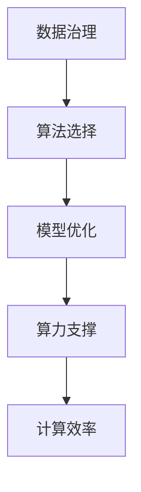

                 

## 1. 背景介绍

### 1.1 问题由来

在过去的十年里，人工智能(AI)和机器学习(ML)已经取得了显著的进步。从深度学习的兴起，到生成对抗网络(GANs)的创新，再到深度强化学习(DRL)的突破，AI技术的演进带来了前所未有的应用可能性。第二代AI，也称为人工智能2.0，是一个以深度学习为核心的时代，强调数据、算法和算力在AI系统中的应用。

在这个背景下，数据、算法和算力成为了推动AI技术进步的关键要素。数据提供了AI训练的基础，算法则定义了如何从数据中提取知识和规律，而算力则为这些复杂计算提供了可能。本文将详细探讨数据、算法和算力在第二代AI中的应用，揭示其背后的原理和实践方法。

### 1.2 问题核心关键点

数据、算法和算力在第二代AI中的应用主要体现在以下几个方面：

- **数据质量与数据治理**：高质量的数据是训练出高性能AI模型的基础。数据治理旨在确保数据的质量、一致性和可用性，包括数据收集、清洗、标注和整合。
- **算法选择与模型优化**：合适的算法和模型能够更好地捕捉数据中的模式和规律，优化模型的性能和泛化能力。
- **算力支撑与计算效率**：高效的计算能力和计算资源是处理大规模数据和复杂模型的必备条件。算力支撑包括GPU、TPU、云计算等多种计算平台。

这些问题紧密联系，共同构成了第二代AI应用的基石。本文将深入探讨这些关键点的具体实现方法和最佳实践。

### 1.3 问题研究意义

数据、算法和算力是AI系统设计和运行的核心组成部分。理解和掌握它们的应用原则，对于推动AI技术的不断进步和落地应用具有重要意义：

- **提升模型性能**：高质量的数据、先进的算法和充足的算力能够显著提升AI模型的精度和效率。
- **加速研发进程**：了解数据、算法和算力的应用方法，可以加速模型开发和部署，缩短项目周期。
- **降低开发成本**：有效的数据治理和高效的算法实现可以显著降低AI开发和运营的成本。
- **保障模型安全**：合理的数据处理和算法选择，能够减少模型偏见和潜在的伦理风险。

## 2. 核心概念与联系

### 2.1 核心概念概述

为了更好地理解数据、算法和算力在第二代AI中的应用，本文将介绍几个核心概念：

- **数据治理**：指数据的质量保证、数据清洗、数据标注和数据整合等，确保数据的一致性和可靠性。
- **算法选择**：指根据任务特点和数据特征，选择合适的算法或模型，并根据具体场景进行优化。
- **算力支撑**：指提供高效计算资源的平台和工具，包括GPU、TPU、云计算等。
- **模型优化**：指通过超参数调整、正则化、网络结构设计等手段，提升模型性能和泛化能力。
- **计算效率**：指在保证模型精度的同时，优化计算过程，减少资源消耗，提升系统响应速度。

这些概念之间的关系可以通过以下Mermaid流程图来展示：



这个流程图展示数据、算法、算力、模型优化和计算效率之间的联系：数据是基础，算法和模型优化是关键，算力提供计算支持，计算效率是最终目标。

## 3. 核心算法原理 & 具体操作步骤
### 3.1 算法原理概述

在第二代AI中，数据、算法和算力之间的协同作用至关重要。本文将从算法原理的角度，深入探讨数据、算法和算力如何共同作用于AI模型的设计和优化。

### 3.2 算法步骤详解

#### 数据处理

数据处理是AI系统应用中的重要环节。高质量的数据集是训练高性能AI模型的基础。数据处理包括数据收集、清洗、标注和整合等步骤。

1. **数据收集**：从不同的数据源收集原始数据，如社交媒体、传感器数据、医疗记录等。
2. **数据清洗**：去除噪声、处理缺失值和异常值，确保数据质量。
3. **数据标注**：为数据添加标签，如图像分类任务中的标签、文本分类任务中的类别等。
4. **数据整合**：将来自不同来源的数据整合在一起，形成统一的数据集。

#### 算法选择与模型优化

选择合适的算法和模型是提升AI系统性能的关键。不同的算法和模型适用于不同的任务，需要在具体应用场景中进行选择和优化。

1. **算法选择**：根据任务类型和数据特征，选择适合的算法或模型。例如，对于图像分类任务，可以选择卷积神经网络(CNN)；对于自然语言处理(NLP)任务，可以选择循环神经网络(RNN)或Transformer。
2. **模型优化**：通过超参数调整、正则化、网络结构设计等手段，提升模型性能和泛化能力。例如，在CNN模型中，可以通过调整卷积核大小、层数和激活函数等超参数，提升模型的准确性。

#### 算力支撑与计算效率

高效的计算资源是支持复杂算法和模型训练的必备条件。算力支撑包括GPU、TPU、云计算等多种计算平台。

1. **计算平台选择**：根据计算任务的需求，选择合适的计算平台。例如，对于深度学习模型，可以选择GPU进行训练；对于大规模数据分析，可以选择TPU或云计算平台。
2. **计算效率优化**：通过并行计算、分布式计算、模型压缩等手段，优化计算过程，减少资源消耗，提升系统响应速度。例如，使用深度可分离卷积网络，可以减少计算量，提升模型推理速度。

### 3.3 算法优缺点

数据、算法和算力在第二代AI中的应用具有以下优点和缺点：

#### 优点

1. **提升模型性能**：高质量的数据、先进的算法和充足的算力能够显著提升AI模型的精度和效率。
2. **加速研发进程**：了解数据、算法和算力的应用方法，可以加速模型开发和部署，缩短项目周期。
3. **降低开发成本**：有效的数据治理和高效的算法实现可以显著降低AI开发和运营的成本。
4. **保障模型安全**：合理的数据处理和算法选择，能够减少模型偏见和潜在的伦理风险。

#### 缺点

1. **数据获取难度高**：高质量的数据往往难以获得，特别是在特定的应用场景中。
2. **算法复杂度高**：复杂的算法和模型需要更多的计算资源和时间，增加了系统的复杂性。
3. **算力成本高**：高效的计算资源往往价格昂贵，增加了AI应用的成本。

### 3.4 算法应用领域

数据、算法和算力在第二代AI中的应用广泛，涵盖多个领域：

- **医疗诊断**：通过分析医疗影像和电子健康记录，AI模型可以辅助医生进行诊断和治疗决策。
- **金融风险管理**：利用历史交易数据和市场分析，AI模型可以预测股票价格和市场风险。
- **自动驾驶**：通过实时感知和决策，AI模型可以实现自动驾驶车辆的安全行驶。
- **自然语言处理(NLP)**：通过分析文本和语音数据，AI模型可以实现机器翻译、语音识别和情感分析等任务。
- **推荐系统**：通过分析用户行为数据，AI模型可以提供个性化的推荐服务，提升用户体验。

这些领域展示了数据、算法和算力在实际应用中的重要性和潜力。

## 4. 数学模型和公式 & 详细讲解  
### 4.1 数学模型构建

本节将使用数学语言对数据、算法和算力在第二代AI中的应用进行更加严格的刻画。

设原始数据集为 $D=\{x_i\}_{i=1}^N$，其中 $x_i$ 为数据点。数据预处理包括数据清洗、标注和整合，得到训练集 $D_{train}$、验证集 $D_{val}$ 和测试集 $D_{test}$。

定义模型为 $M$，通过训练集 $D_{train}$ 进行优化，得到模型参数 $\theta$。训练过程中，使用损失函数 $L$ 衡量模型输出与真实标签之间的差异。训练目标是最小化损失函数 $L$。

### 4.2 公式推导过程

以图像分类任务为例，介绍模型训练的数学公式。

1. **数据预处理**：假设原始图像数据为 $I=\{x_{ij}\}_{i=1}^{m}, j=1,2,\dots,n$，其中 $m$ 为样本数，$n$ 为图像尺寸。进行归一化和数据增强后，得到训练集 $D_{train}$。
2. **模型构建**：选择卷积神经网络(CNN)作为模型结构，包含卷积层、池化层、全连接层等。
3. **训练过程**：通过前向传播计算模型输出，反向传播计算损失函数的梯度，使用优化算法更新模型参数。训练目标是最小化交叉熵损失函数。

### 4.3 案例分析与讲解

以图像分类任务为例，展示数据、算法和算力在实际应用中的具体操作。

1. **数据收集**：从公开数据集如CIFAR-10、ImageNet等收集图像数据。
2. **数据清洗**：去除噪声和异常图像，确保数据质量。
3. **数据标注**：为每个图像添加类别标签，如汽车、飞机等。
4. **模型选择**：选择ResNet、Inception等深度神经网络结构。
5. **模型优化**：通过超参数调优和正则化技术，提升模型性能。
6. **算力支撑**：使用GPU进行模型训练和推理。

## 5. 项目实践：代码实例和详细解释说明
### 5.1 开发环境搭建

在进行AI系统开发前，需要准备相应的开发环境。以下是使用Python和TensorFlow进行AI开发的环境配置流程：

1. 安装Anaconda：从官网下载并安装Anaconda，用于创建独立的Python环境。
2. 创建并激活虚拟环境：
```bash
conda create -n tf-env python=3.8 
conda activate tf-env
```
3. 安装TensorFlow：根据CUDA版本，从官网获取对应的安装命令。例如：
```bash
conda install tensorflow -c tf -c conda-forge
```
4. 安装TensorBoard：用于可视化模型训练和推理过程。
5. 安装其他依赖库：
```bash
pip install numpy pandas scikit-learn matplotlib tqdm jupyter notebook ipython
```
完成上述步骤后，即可在`tf-env`环境中开始AI系统开发。

### 5.2 源代码详细实现

下面以图像分类任务为例，给出使用TensorFlow进行模型训练的PyTorch代码实现。

```python
import tensorflow as tf
from tensorflow.keras import layers, models
import numpy as np

# 定义模型
model = models.Sequential()
model.add(layers.Conv2D(32, (3,3), activation='relu', input_shape=(28, 28, 1)))
model.add(layers.MaxPooling2D((2,2)))
model.add(layers.Flatten())
model.add(layers.Dense(10, activation='softmax'))

# 编译模型
model.compile(optimizer='adam',
              loss='categorical_crossentropy',
              metrics=['accuracy'])

# 训练模型
train_images = ...
train_labels = ...
model.fit(train_images, train_labels, epochs=10, batch_size=32)

# 评估模型
test_images = ...
test_labels = ...
test_loss, test_acc = model.evaluate(test_images, test_labels)
print(f'Test accuracy: {test_acc}')
```

### 5.3 代码解读与分析

让我们再详细解读一下关键代码的实现细节：

**模型构建**：
- 使用TensorFlow的Keras API构建卷积神经网络，包含卷积层、池化层、全连接层。
- 输入数据的尺寸为28x28，通道数为1。
- 使用softmax激活函数，输出10个类别的概率分布。

**模型编译**：
- 使用Adam优化器进行参数更新。
- 使用交叉熵损失函数衡量模型预测与真实标签之间的差异。
- 记录训练过程中的精度作为评估指标。

**模型训练**：
- 使用`fit`方法进行模型训练，设置训练轮数为10，批大小为32。
- `train_images`和`train_labels`为训练集数据和标签。

**模型评估**：
- 使用`evaluate`方法计算模型在测试集上的损失和精度。
- 输出测试集上的精度。

可以看到，TensorFlow的Keras API使得模型构建和训练的过程变得简洁高效。开发者可以将更多精力放在数据处理和模型优化等高层逻辑上，而不必过多关注底层的实现细节。

## 6. 实际应用场景
### 6.1 医疗诊断

在医疗诊断领域，AI技术可以显著提升诊断效率和准确性。通过分析医疗影像和电子健康记录，AI模型可以辅助医生进行诊断和治疗决策。

在技术实现上，可以收集医院内部的历史诊断数据，将影像和病历信息标注成标签，构建监督数据集。在此基础上对预训练模型进行微调，使其能够自动理解影像和病历信息，提供诊断建议。对于新的病人影像和病历，模型可以实时分析，辅助医生做出诊断决策。

### 6.2 金融风险管理

金融行业需要实时监测市场风险，预测股票价格和市场波动。利用历史交易数据和市场分析，AI模型可以提供风险评估和预测服务。

在实际应用中，可以收集历史交易数据和市场分析报告，构建标注数据集。在此基础上对预训练模型进行微调，使其能够分析交易数据和市场趋势，预测股票价格和市场风险。通过实时监测和预警，金融企业可以及时应对市场变化，规避潜在风险。

### 6.3 自动驾驶

自动驾驶技术需要实时感知和决策，以实现车辆的安全行驶。利用计算机视觉和深度学习技术，AI模型可以实现图像识别和场景理解，辅助车辆进行自主决策。

在技术实现上，可以收集自动驾驶车辆采集的图像和传感器数据，标注成交通标志、行人、车辆等标签。在此基础上对预训练模型进行微调，使其能够识别交通场景中的各种元素，提供决策支持。通过实时感知和决策，自动驾驶车辆可以自主导航，确保行车安全。

### 6.4 自然语言处理(NLP)

NLP技术可以处理文本和语音数据，实现机器翻译、语音识别和情感分析等任务。通过分析文本和语音数据，AI模型可以提供智能交互和信息处理服务。

在实际应用中，可以收集社交媒体和语音助手的数据，标注成文本和语音标签。在此基础上对预训练模型进行微调，使其能够处理自然语言和语音数据，实现翻译、识别和情感分析等任务。通过智能交互和信息处理，AI系统可以提供更高效、更个性化的服务。

### 6.5 推荐系统

推荐系统可以根据用户行为数据，提供个性化的推荐服务，提升用户体验。利用历史行为数据和用户画像，AI模型可以分析用户偏好和需求，提供精准推荐。

在技术实现上，可以收集用户的浏览、点击、购买等行为数据，构建标注数据集。在此基础上对预训练模型进行微调，使其能够分析用户行为数据，提供个性化推荐服务。通过实时推荐，电商平台可以提升用户粘性和满意度，增加销售收入。

### 6.6 未来应用展望

随着数据、算法和算力的不断发展，第二代AI的应用场景将更加广泛和深入。

在智慧医疗领域，AI技术可以提升诊断和治疗的精准度，辅助医生进行复杂的治疗决策。在金融风险管理中，AI模型可以实时监测市场波动，提供精准的风险预警。在自动驾驶中，AI技术可以实现更高级别的自主驾驶，提升行车安全。在NLP中，AI模型可以实现更高级别的翻译和情感分析，提供更高效的信息处理服务。

在推荐系统中，AI技术可以提供更精准的用户画像和推荐策略，提升用户的满意度。未来，随着数据、算法和算力的不断进步，AI技术将在更多领域得到应用，为人类社会带来深远影响。

## 7. 工具和资源推荐
### 7.1 学习资源推荐

为了帮助开发者系统掌握数据、算法和算力在AI中的应用，这里推荐一些优质的学习资源：

1. **《深度学习》课程**：斯坦福大学开设的深度学习课程，涵盖深度学习的基本概念和前沿技术，适合初学者和进阶者。
2. **《TensorFlow官方文档》**：TensorFlow的官方文档，提供了详细的API参考和样例代码，是TensorFlow学习的必备资料。
3. **Kaggle竞赛平台**：全球知名的数据科学竞赛平台，提供大量数据集和模型竞赛，适合实战学习和数据科学研究。
4. **《机器学习实战》书籍**：适合初学者的机器学习实战书籍，涵盖机器学习的基本算法和实际应用案例。
5. **PyTorch官方文档**：PyTorch的官方文档，提供了详细的API参考和样例代码，是PyTorch学习的必备资料。

通过对这些资源的学习实践，相信你一定能够快速掌握数据、算法和算力在AI中的应用，并用于解决实际的AI问题。

### 7.2 开发工具推荐

高效的开发离不开优秀的工具支持。以下是几款用于AI开发和研究的常用工具：

1. **PyTorch**：基于Python的开源深度学习框架，灵活动态的计算图，适合快速迭代研究。
2. **TensorFlow**：由Google主导开发的开源深度学习框架，生产部署方便，适合大规模工程应用。
3. **Keras**：基于TensorFlow和Theano等框架的高级API，适合快速搭建模型。
4. **Jupyter Notebook**：用于数据处理和模型开发的交互式环境，支持代码块和Markdown格式，适合做文档记录。
5. **Anaconda**：用于创建和管理Python环境的软件，支持多种Python版本和依赖库。

合理利用这些工具，可以显著提升AI系统开发的效率，加快创新迭代的步伐。

### 7.3 相关论文推荐

数据、算法和算力在AI中的应用是一个活跃的研究领域，以下是几篇奠基性的相关论文，推荐阅读：

1. **《深度学习》（Goodfellow et al. 2016）**：深度学习的经典教材，详细介绍了深度学习的基本算法和应用。
2. **《TensorFlow官方文档》（TensorFlow团队 2015）**：TensorFlow的官方文档，提供了详细的API参考和样例代码，是TensorFlow学习的必备资料。
3. **《PyTorch官方文档》（PyTorch团队 2018）**：PyTorch的官方文档，提供了详细的API参考和样例代码，是PyTorch学习的必备资料。
4. **《Keras官方文档》（François Chollet 2015）**：Keras的官方文档，提供了详细的API参考和样例代码，是Keras学习的必备资料。

这些论文代表了大规模AI应用的发展脉络。通过学习这些前沿成果，可以帮助研究者把握学科前进方向，激发更多的创新灵感。

## 8. 总结：未来发展趋势与挑战
### 8.1 总结

本文对数据、算法和算力在第二代AI中的应用进行了全面系统的介绍。首先阐述了数据、算法和算力在AI系统设计和运行中的重要地位，明确了其在推动AI技术进步和落地应用中的独特价值。其次，从原理到实践，详细讲解了数据、算法和算力的应用方法和最佳实践。同时，本文还探讨了数据、算法和算力在多个领域的实际应用，展示了其在推动行业数字化转型中的巨大潜力。

通过本文的系统梳理，可以看到，数据、算法和算力是AI系统设计和运行的核心组成部分。理解和掌握它们的应用原则，对于推动AI技术的不断进步和落地应用具有重要意义。

### 8.2 未来发展趋势

展望未来，数据、算法和算力在AI中的应用将呈现以下几个发展趋势：

1. **数据质量提升**：高质量的数据将推动AI模型的精度和泛化能力不断提升。数据治理和标注技术将不断进步，数据集的质量和多样性将不断提升。
2. **算法多样性**：未来的AI应用将涌现更多高效的算法和模型结构。深度学习、强化学习、生成对抗网络等前沿技术将不断成熟，并应用于实际问题。
3. **算力扩展**：随着云计算和边缘计算的发展，算力资源将更加丰富和高效。GPU、TPU等高效计算资源将广泛应用于AI应用中。
4. **模型通用性**：未来的AI模型将具备更强的跨领域迁移能力，能够在更多场景中得到应用。模型泛化能力和可解释性将不断提升。
5. **模型可解释性**：未来的AI模型将具备更好的可解释性和可解释性。模型决策的因果逻辑将更加透明和可理解，减少人类对AI的误解和恐惧。

这些趋势凸显了数据、算法和算力在AI系统中的应用潜力。这些方向的探索发展，必将进一步提升AI技术的性能和应用范围，为人类认知智能的进化带来深远影响。

### 8.3 面临的挑战

尽管数据、算法和算力在AI中的应用取得了显著进展，但在迈向更加智能化、普适化应用的过程中，仍面临诸多挑战：

1. **数据获取难度高**：高质量的数据往往难以获得，特别是在特定的应用场景中。如何高效获取和处理数据，是未来AI应用需要解决的重要问题。
2. **算法复杂度高**：复杂的算法和模型需要更多的计算资源和时间，增加了系统的复杂性。如何降低模型复杂度，提高计算效率，是未来AI应用需要优化的关键方向。
3. **算力成本高**：高效的计算资源往往价格昂贵，增加了AI应用的成本。如何降低算力成本，提高算力资源的利用效率，是未来AI应用需要解决的重要问题。
4. **模型可解释性不足**：未来的AI模型将具备更好的可解释性和可解释性。如何提高模型的可解释性，减少人类对AI的误解和恐惧，是未来AI应用需要解决的重要问题。

这些挑战需要在技术、经济、伦理等多个维度进行协同解决。只有不断突破这些难题，才能推动AI技术不断进步，实现更广泛的应用。

### 8.4 研究展望

面对数据、算法和算力在AI应用中的挑战，未来的研究需要在以下几个方面寻求新的突破：

1. **数据获取技术**：开发高效的数据获取和处理技术，如自动化数据标注、数据增强等，提高数据质量和多样性。
2. **算法优化**：开发高效、易用的算法和模型结构，如模型压缩、知识蒸馏等，降低模型复杂度，提高计算效率。
3. **算力优化**：开发高效、低成本的算力资源，如云计算、边缘计算等，提高算力资源的利用效率。
4. **模型可解释性**：开发可解释性强的AI模型，如因果推断、符号推理等，提高模型的可解释性和透明性。
5. **伦理规范**：建立AI应用的伦理规范和法规体系，保障数据隐私和安全，减少AI应用中的潜在风险。

这些研究方向的探索，必将引领AI技术不断进步，实现更加智能化、普适化、透明化的应用。面向未来，数据、算法和算力在AI中的应用将不断深入，为人类认知智能的进化带来深远影响。

## 9. 附录：常见问题与解答

**Q1：数据、算法和算力在AI中的应用是否需要考虑数据的隐私和安全问题？**

A: 是的，数据、算法和算力在AI中的应用需要严格考虑数据的隐私和安全问题。特别是在医疗、金融等高敏感领域，数据的隐私和安全问题尤为重要。如何保障数据的隐私和安全性，减少数据泄露和滥用风险，是未来AI应用需要解决的重要问题。

**Q2：如何评估AI模型的性能和效果？**

A: 评估AI模型的性能和效果是AI应用中的重要环节。常用的评估指标包括精度、召回率、F1分数、ROC曲线等。通过评估指标，可以全面了解模型的优劣，进行模型调优和改进。此外，还可以进行交叉验证、A/B测试等手段，评估模型的鲁棒性和泛化能力。

**Q3：如何降低AI模型的计算成本？**

A: 降低AI模型的计算成本是未来AI应用需要解决的重要问题。可以通过优化算法、压缩模型、分布式计算等手段，降低计算资源的消耗，提高计算效率。此外，还可以利用边缘计算、云计算等技术，降低算力成本，提高算力资源的利用效率。

**Q4：如何提高AI模型的可解释性？**

A: 提高AI模型的可解释性是未来AI应用需要解决的重要问题。可以通过引入因果推断、符号推理等技术，提高模型的可解释性和透明性。此外，还可以使用可视化工具，展示模型的决策过程和推理逻辑，帮助用户理解和信任AI系统。

**Q5：如何保障AI系统的鲁棒性和安全性？**

A: 保障AI系统的鲁棒性和安全性是未来AI应用需要解决的重要问题。可以通过引入对抗训练、鲁棒优化等技术，提高模型的鲁棒性和抗干扰能力。此外，还可以建立系统的监控和预警机制，及时发现和应对潜在的安全威胁。

总之，数据、算法和算力在AI中的应用需要综合考虑多个因素，只有在技术、经济、伦理等多个维度协同解决，才能推动AI技术的不断进步，实现更广泛的应用。

