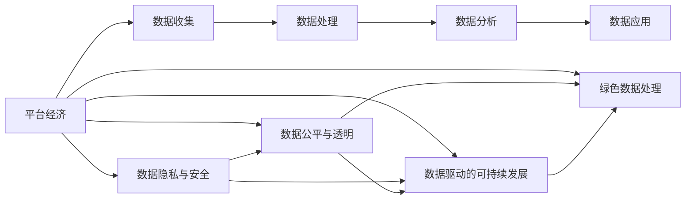

                 

# 数据驱动平台经济发展：如何实现可持续发展？

## 1. 背景介绍

### 1.1 问题由来

在数字经济时代，数据已经成为驱动平台经济发展的核心要素。平台企业通过收集、分析和应用海量数据，为用户提供便捷的服务，创造巨大的经济价值。然而，平台经济的高速发展也带来了数据安全、隐私保护、公平竞争等诸多问题，亟需探索一种可持续的数据驱动发展模式。

### 1.2 问题核心关键点

当前平台经济发展面临的核心问题主要包括：
- 数据隐私和安全问题。用户数据泄露、滥用等事件频发，引发社会广泛关注。
- 数据公平和透明问题。平台数据利用存在不公平现象，用户数据权利难以保障。
- 数据过度集中风险。数据过度集中可能导致市场垄断，损害消费者利益。
- 数据驱动的可持续发展问题。如何在数据利用中实现经济效益、社会效益和环境效益的平衡。

这些问题需要在数据驱动平台经济发展的过程中予以重视和解决，以实现平台的长期稳定发展。

### 1.3 问题研究意义

探索数据驱动平台经济可持续发展的路径，具有重要的理论和现实意义：
1. 保障用户权益。通过合理的数据使用和管理，确保用户数据的安全和隐私。
2. 促进市场公平。建立透明的数据使用规则，避免数据垄断带来的不公平现象。
3. 提升数据价值。通过高效的数据利用，最大化数据价值，推动经济发展。
4. 促进环境友好。采用绿色数据处理技术，降低数据处理的能源消耗，实现可持续发展。

## 2. 核心概念与联系

### 2.1 核心概念概述

为更好地理解平台经济数据驱动的可持续模式，本节将介绍几个关键概念及其联系：

- **平台经济**：以互联网为媒介，通过大规模网络效应和用户交互，形成稳定的生态系统。平台企业通过收集和分析用户数据，为用户提供多样化的服务，创造价值。

- **数据隐私与安全**：平台经济中用户数据的收集、存储、使用等环节，需要严格遵守法律法规，确保用户数据的安全和隐私。

- **数据公平与透明**：平台需要建立透明的数据使用规则，确保用户数据的使用公平、合理。

- **数据驱动的可持续发展**：在数据利用过程中，结合经济效益、社会效益和环境效益，探索实现长期稳定发展的路径。

- **绿色数据处理**：采用节能减排的数据处理技术，降低数据处理的能耗，推动绿色发展。

这些概念之间存在紧密联系，共同构成了数据驱动平台经济发展的核心框架。

### 2.2 核心概念原理和架构的 Mermaid 流程图



此流程图展示了平台经济中数据从收集到应用的全过程，以及数据隐私、公平、可持续和绿色处理的相关联系。平台经济的发展需要综合考虑这些关键要素，才能实现可持续的数据驱动。

## 3. 核心算法原理 & 具体操作步骤

### 3.1 算法原理概述

数据驱动平台经济可持续发展涉及多个方面的算法原理，包括数据隐私保护、数据公平透明、数据驱动效益、绿色数据处理等。本文重点介绍以下几方面的核心算法原理：

1. **数据隐私保护算法**：
   - 差分隐私：通过在数据中引入噪声，确保个体数据无法被直接识别。
   - 同态加密：在加密数据上直接执行计算，得到解密后相同的计算结果。

2. **数据公平透明算法**：
   - 联邦学习：多方在各自本地数据上训练模型，避免数据集中到单方。
   - 区块链技术：通过分布式账本，确保数据使用过程的透明和可追溯。

3. **数据驱动效益算法**：
   - 强化学习：通过智能体与环境的互动，最大化长期累积奖励。
   - 增量学习：利用新数据不断更新模型，提高模型性能。

4. **绿色数据处理算法**：
   - 数据压缩：减小数据传输和存储的能耗。
   - 分布式计算：利用多台计算资源的协同处理，降低单台设备的能耗。

### 3.2 算法步骤详解

1. **数据隐私保护算法**：
   - 数据收集：平台通过合规的途径收集用户数据，确保数据来源的合法性。
   - 数据预处理：对收集的数据进行去标识化处理，如模糊化、数据分割等。
   - 差分隐私或同态加密：在数据处理过程中，引入噪声或加密保护措施，确保数据隐私。

2. **数据公平透明算法**：
   - 数据划分：将数据划分为训练集、验证集和测试集，确保数据划分的公平性。
   - 联邦学习：多方在各自本地数据上训练模型，确保数据使用的公平和透明。
   - 区块链技术：建立分布式账本，记录数据使用过程，确保可追溯性和透明性。

3. **数据驱动效益算法**：
   - 强化学习：通过智能体与环境的互动，调整策略，最大化长期累积奖励。
   - 增量学习：利用新数据不断更新模型，提高模型性能。
   - 模型优化：通过超参数调优、正则化等技术，提升模型效果。

4. **绿色数据处理算法**：
   - 数据压缩：减小数据传输和存储的能耗，提高处理效率。
   - 分布式计算：利用多台计算资源的协同处理，降低单台设备的能耗。
   - 绿色算力：采用节能降耗的计算硬件，如GPU、TPU等。

### 3.3 算法优缺点

数据驱动平台经济可持续发展算法具有以下优点：
1. **保障数据隐私**：通过差分隐私和同态加密等技术，确保数据隐私不被泄露。
2. **提高数据公平性**：联邦学习和区块链等技术，确保数据使用的公平和透明。
3. **提升模型性能**：强化学习和增量学习等技术，提升模型性能，提高决策效率。
4. **降低能耗**：数据压缩、分布式计算等技术，降低数据处理的能耗，实现绿色发展。

然而，这些算法也存在一些局限性：
1. **计算复杂度高**：差分隐私和同态加密等算法计算复杂度高，可能影响数据处理的实时性。
2. **数据分割难度大**：数据公平透明需要分割数据，但实际分割过程中可能存在数据不平衡的问题。
3. **模型优化困难**：强化学习等算法的模型优化复杂，需要大量试验和调整。
4. **硬件要求高**：绿色数据处理需要高效率的计算硬件，可能增加基础设施成本。

### 3.4 算法应用领域

数据驱动平台经济可持续发展算法在多个领域都有广泛应用，例如：

- **金融领域**：通过差分隐私和同态加密保护用户交易数据，确保数据安全。
- **医疗领域**：通过联邦学习和区块链技术，确保患者数据隐私和公平使用。
- **电子商务**：通过绿色数据处理和分布式计算，降低系统能耗，实现可持续发展。
- **智能交通**：通过强化学习优化交通信号灯控制，提升交通效率，减少碳排放。
- **智能制造**：通过增量学习和大数据分析，优化生产流程，降低能源消耗。

这些应用场景展示了数据驱动平台经济可持续发展的广泛前景和重要价值。

## 4. 数学模型和公式 & 详细讲解 & 举例说明

### 4.1 数学模型构建

数据驱动平台经济可持续发展的数学模型，主要包括以下几个方面：

1. **数据隐私保护**：
   - 差分隐私模型：确保个体数据隐私，公式如下：
     $$
     \mathcal{L}_{\epsilon}(f) = \frac{1}{\epsilon} \sum_{x \in \mathcal{X}} \|f(x) - f(x')\|_2 \exp \left(-\frac{\|x-x'\|}{\epsilon}\right)
     $$
   其中，$\mathcal{L}_{\epsilon}$ 为差分隐私损失，$f$ 为模型函数，$\epsilon$ 为隐私参数，$\|.\|_2$ 为L2范数。

2. **数据公平透明**：
   - 联邦学习模型：多边在本地数据上训练模型，公式如下：
     $$
     f^* = \arg\min_{f \in \mathcal{F}} \frac{1}{N} \sum_{i=1}^N \ell_i(f(x_i), y_i)
     $$
   其中，$f$ 为模型函数，$\ell_i$ 为损失函数，$x_i, y_i$ 为第$i$个用户的本地数据和标签，$N$ 为用户数。

3. **数据驱动效益**：
   - 强化学习模型：通过智能体与环境的互动，公式如下：
     $$
     \max_{\theta} \sum_{t=1}^{T} \gamma^t r_t(s_t, a_t, s_{t+1})
     $$
   其中，$\theta$ 为智能体参数，$T$ 为时间步数，$\gamma$ 为折扣因子，$r_t$ 为在第$t$步的奖励，$s_t, a_t, s_{t+1}$ 分别为状态、动作和下一个状态。

4. **绿色数据处理**：
   - 数据压缩模型：减少数据传输和存储的能耗，公式如下：
     $$
     C = \sum_{i=1}^N (C_i - \Delta C_i)
     $$
   其中，$C$ 为压缩前后数据总大小，$C_i$ 为第$i$个数据的大小，$\Delta C_i$ 为压缩后第$i$个数据大小。

### 4.2 公式推导过程

1. **差分隐私损失公式推导**：
   - 差分隐私损失 $\mathcal{L}_{\epsilon}$ 为对隐私参数 $\epsilon$ 的函数，其计算基于L2范数和数据间距离的指数衰减。具体推导过程如下：
     设数据集 $\mathcal{X}$ 中的两个相邻数据点 $x, x'$，假设模型函数 $f$ 在 $x$ 和 $x'$ 上的输出分别为 $f(x)$ 和 $f(x')$，差分隐私损失 $\mathcal{L}_{\epsilon}$ 的计算公式如下：
     \begin{equation}
     \mathcal{L}_{\epsilon}(f) = \frac{1}{\epsilon} \sum_{x \in \mathcal{X}} \|f(x) - f(x')\|_2 \exp \left(-\frac{\|x-x'\|}{\epsilon}\right)
     \end{equation}

2. **联邦学习目标函数推导**：
   - 联邦学习目标函数 $\mathcal{L}(f)$ 为最小化所有用户本地损失的总和，具体推导如下：
     \begin{equation}
     \min_{f} \frac{1}{N} \sum_{i=1}^N \ell_i(f(x_i), y_i)
     \end{equation}
   其中，$\ell_i$ 为第$i$个用户的数据损失函数，$x_i, y_i$ 分别为第$i$个用户的数据和标签。

3. **强化学习目标函数推导**：
   - 强化学习目标函数为最大化长期累积奖励，具体推导如下：
     \begin{equation}
     \max_{\theta} \sum_{t=1}^{T} \gamma^t r_t(s_t, a_t, s_{t+1})
     \end{equation}
   其中，$\theta$ 为智能体参数，$T$ 为时间步数，$\gamma$ 为折扣因子，$r_t$ 为在第$t$步的奖励，$s_t, a_t, s_{t+1}$ 分别为状态、动作和下一个状态。

4. **数据压缩模型推导**：
   - 数据压缩模型 $C$ 为压缩前后数据总大小之差，具体推导如下：
     \begin{equation}
     C = \sum_{i=1}^N (C_i - \Delta C_i)
     \end{equation}
   其中，$C$ 为压缩前后数据总大小，$C_i$ 为第$i$个数据的大小，$\Delta C_i$ 为压缩后第$i$个数据大小。

### 4.3 案例分析与讲解

1. **差分隐私案例**：
   - 案例背景：某电商平台收集用户交易数据，用于市场分析。用户数据隐私受到关注，需采用差分隐私保护。
   - 解决方案：在数据预处理阶段，对交易数据添加随机噪声，确保个体数据无法被识别。具体实现如下：
     \begin{equation}
     \epsilon = 0.1, \quad \delta = 0.05
     \end{equation}
   其中，$\epsilon$ 为隐私参数，$\delta$ 为隐私失真率。

2. **联邦学习案例**：
   - 案例背景：某金融机构需要联合多家银行的数据进行信用风险评估，数据需安全共享。
   - 解决方案：采用联邦学习技术，各银行在本地数据上训练模型，仅共享模型参数，不共享原始数据。具体实现如下：
     \begin{equation}
     f^* = \arg\min_{f \in \mathcal{F}} \frac{1}{N} \sum_{i=1}^N \ell_i(f(x_i), y_i)
     \end{equation}

3. **强化学习案例**：
   - 案例背景：某智能交通系统需要优化交通信号灯控制，提高交通效率。
   - 解决方案：采用强化学习算法，训练智能体在各个时间步上选择最佳动作，最大化交通效率。具体实现如下：
     \begin{equation}
     \max_{\theta} \sum_{t=1}^{T} \gamma^t r_t(s_t, a_t, s_{t+1})
     \end{equation}

4. **数据压缩案例**：
   - 案例背景：某云存储系统需降低数据传输和存储的能耗。
   - 解决方案：采用数据压缩技术，减小数据传输和存储的能耗。具体实现如下：
     \begin{equation}
     C = \sum_{i=1}^N (C_i - \Delta C_i)
     \end{equation}

## 5. 项目实践：代码实例和详细解释说明

### 5.1 开发环境搭建

在进行数据驱动平台经济可持续发展实践前，需要先准备好开发环境。以下是使用Python进行PyTorch开发的环境配置流程：

1. 安装Anaconda：从官网下载并安装Anaconda，用于创建独立的Python环境。

2. 创建并激活虚拟环境：
```bash
conda create -n pytorch-env python=3.8 
conda activate pytorch-env
```

3. 安装PyTorch：根据CUDA版本，从官网获取对应的安装命令。例如：
```bash
conda install pytorch torchvision torchaudio cudatoolkit=11.1 -c pytorch -c conda-forge
```

4. 安装TensorFlow：
```bash
pip install tensorflow
```

5. 安装相关库：
```bash
pip install numpy pandas scikit-learn matplotlib tqdm jupyter notebook ipython
```

完成上述步骤后，即可在`pytorch-env`环境中开始开发实践。

### 5.2 源代码详细实现

下面以差分隐私为例，给出使用PyTorch实现差分隐私保护的代码实现。

首先，定义差分隐私参数：

```python
import torch
import torch.nn as nn
import torch.optim as optim
import torch.distributions as dist

epsilon = 0.1
delta = 0.05
```

然后，定义差分隐私损失函数：

```python
class DifferentialPrivacyLoss(nn.Module):
    def __init__(self, epsilon):
        super(DifferentialPrivacyLoss, self).__init__()
        self.epsilon = epsilon
    
    def forward(self, x, y):
        dp_loss = 0
        for i in range(len(x)):
            dp_loss += self.dp_loss(x[i], y[i])
        return dp_loss
    
    def dp_loss(self, x, y):
        dp_loss = 0
        for i in range(len(x)):
            dp_loss += self.dp_dp_loss(x[i], y[i])
        return dp_loss
    
    def dp_dp_loss(self, x, y):
        x_diff = x - y
        x_norm = x_diff.norm() / 2
        dp_loss = self.epsilon * dist.kl_divergence(dist.Normal(x_diff, 1), dist.Normal(x_diff, 1))
        return dp_loss
```

接着，定义模型和训练过程：

```python
# 假设数据为整数
x = torch.tensor([1, 2, 3, 4], dtype=torch.int)
y = torch.tensor([1, 2, 3, 4], dtype=torch.int)

# 构建差分隐私损失函数
loss = DifferentialPrivacyLoss(epsilon)
loss = loss(x, y)

# 定义模型和优化器
model = nn.Linear(1, 1)
optimizer = optim.SGD(model.parameters(), lr=0.01)

# 定义训练过程
def train():
    for epoch in range(100):
        optimizer.zero_grad()
        loss = loss(x, y)
        loss.backward()
        optimizer.step()
        if epoch % 10 == 0:
            print(f"Epoch {epoch+1}, Loss: {loss:.4f}")

train()
```

以上代码实现了在训练过程中添加差分隐私保护的示例。可以看到，差分隐私保护的实现主要通过在数据间计算L2范数，并添加噪声来实现隐私保护。

### 5.3 代码解读与分析

下面对代码进行详细解读：

**DifferentialPrivacyLoss类**：
- `__init__`方法：初始化差分隐私参数。
- `forward`方法：计算差分隐私损失。
- `dp_loss`方法：计算差分隐私损失的每一项。
- `dp_dp_loss`方法：计算差分隐私损失的每一项的差分隐私部分。

**模型和训练过程**：
- 假设数据为整数，定义差分隐私损失函数。
- 定义模型和优化器，使用线性回归模型。
- 定义训练过程，使用SGD优化器。
- 在每一轮训练中，计算差分隐私损失，并反向传播更新模型参数。

## 6. 实际应用场景

### 6.1 金融领域

金融领域的数据驱动平台经济发展面临严峻的数据隐私和安全挑战。金融机构需收集大量的用户交易数据，用于风险评估和用户画像。然而，用户数据泄露、滥用等事件频发，需采用差分隐私和同态加密等技术保障数据隐私。

具体应用如下：
- 采用差分隐私技术，在数据预处理阶段添加噪声，确保用户数据无法被直接识别。
- 使用同态加密技术，在加密数据上直接执行计算，确保数据计算过程的隐私性。

### 6.2 医疗领域

医疗领域的数据驱动平台经济发展同样面临数据隐私和安全的挑战。医疗机构需收集大量的患者数据，用于疾病分析和个性化治疗。然而，患者数据隐私受到高度关注，需采用差分隐私和同态加密等技术保障数据隐私。

具体应用如下：
- 采用差分隐私技术，在数据预处理阶段添加噪声，确保患者数据无法被直接识别。
- 使用同态加密技术，在加密数据上直接执行计算，确保数据计算过程的隐私性。

### 6.3 电子商务

电子商务领域的数据驱动平台经济发展需要处理大量的用户交易数据。然而，用户数据泄露、滥用等事件频发，需采用差分隐私和同态加密等技术保障数据隐私。

具体应用如下：
- 采用差分隐私技术，在数据预处理阶段添加噪声，确保用户数据无法被直接识别。
- 使用同态加密技术，在加密数据上直接执行计算，确保数据计算过程的隐私性。

### 6.4 未来应用展望

未来，数据驱动平台经济发展将继续在多个领域得到应用，为社会经济发展带来新的动力。

在智慧城市领域，智能交通、智能安防等应用将继续受益于数据驱动的发展模式。通过优化交通信号灯控制、视频监控分析等，提高城市运行效率和安全性。

在智能制造领域，通过大数据分析优化生产流程，提升生产效率和质量。结合工业互联网技术，实现生产过程的智能化和绿色化。

在智能医疗领域，通过智能分析患者数据，提供个性化的医疗服务。结合AI辅助诊疗系统，提高诊断准确率和效率。

以上应用场景展示了数据驱动平台经济可持续发展的广阔前景和重要价值。

## 7. 工具和资源推荐

### 7.1 学习资源推荐

为了帮助开发者系统掌握数据驱动平台经济可持续发展的理论和实践，这里推荐一些优质的学习资源：

1. **《数据科学与机器学习》课程**：由斯坦福大学开设的在线课程，涵盖数据科学、机器学习、数据隐私保护等核心内容。

2. **《数据隐私保护》书籍**：详细介绍了差分隐私、同态加密等隐私保护技术，适合开发者深入学习。

3. **《数据驱动的可持续发展》论文**：多篇文章介绍了如何在数据利用中实现经济效益、社会效益和环境效益的平衡。

4. **《区块链技术与应用》书籍**：详细介绍了区块链技术在数据共享和透明化中的应用。

5. **《数据驱动的智能城市》书籍**：介绍了数据驱动的智能城市建设，涵盖了智能交通、智能安防等应用。

通过对这些资源的学习实践，相信你一定能够掌握数据驱动平台经济可持续发展的精髓，并用于解决实际问题。

### 7.2 开发工具推荐

高效的数据驱动平台经济发展开发离不开优秀的工具支持。以下是几款常用的开发工具：

1. **Jupyter Notebook**：一个强大的交互式编程环境，适合数据驱动平台的开发和实验。

2. **TensorFlow**：谷歌开发的深度学习框架，支持分布式计算和模型优化。

3. **PyTorch**：Facebook开发的深度学习框架，支持动态计算图和高效的数据处理。

4. **Keras**：谷歌开发的高级深度学习框架，支持快速搭建和训练模型。

5. **OpenCV**：开源计算机视觉库，支持图像处理和视频分析。

6. **Pandas**：开源数据处理库，支持高效的数据读写和分析。

这些工具为数据驱动平台经济可持续发展的开发提供了坚实的基础。

### 7.3 相关论文推荐

数据驱动平台经济可持续发展涉及多方面的前沿研究。以下是几篇重要的相关论文，推荐阅读：

1. **《数据隐私保护的差分隐私算法》**：详细介绍了差分隐私算法的基本原理和应用实例。

2. **《区块链技术在数据共享中的应用》**：探讨了区块链技术在数据透明化和共享中的应用。

3. **《强化学习在智能交通中的应用》**：介绍了强化学习在交通信号灯控制中的应用。

4. **《数据驱动的智能城市建设》**：讨论了数据驱动的智能城市建设，包括智能交通、智能安防等应用。

5. **《绿色数据处理技术的研究进展》**：综述了绿色数据处理技术的研究进展和应用前景。

这些论文展示了数据驱动平台经济可持续发展的最新研究成果和前沿技术。

## 8. 总结：未来发展趋势与挑战

### 8.1 研究成果总结

数据驱动平台经济可持续发展已成为学术界和工业界的热门研究领域。当前，该领域的研究主要集中在以下几个方面：

1. **差分隐私和同态加密**：确保用户数据隐私，防止数据泄露和滥用。
2. **联邦学习和区块链**：保障数据使用的公平和透明，防止数据集中。
3. **强化学习和大数据分析**：提升数据利用效率，优化平台运营和决策。
4. **绿色数据处理技术**：降低数据处理的能耗，推动可持续发展。

这些研究为平台经济的可持续发展提供了重要的理论和技术支持。

### 8.2 未来发展趋势

展望未来，数据驱动平台经济可持续发展将继续在多个领域得到应用和发展：

1. **数据隐私保护的进步**：差分隐私和同态加密技术将不断进步，提高数据隐私保护的性能和效率。

2. **数据公平透明的应用**：联邦学习和区块链技术将在更多场景中得到应用，确保数据使用的公平和透明。

3. **数据驱动效益的提升**：强化学习和增量学习等技术将不断优化，提升数据驱动效益，推动平台经济高质量发展。

4. **绿色数据处理技术的发展**：绿色数据处理技术将不断进步，降低数据处理的能耗，推动绿色发展。

### 8.3 面临的挑战

尽管数据驱动平台经济可持续发展取得了一定的进展，但仍面临以下挑战：

1. **数据隐私保护的挑战**：差分隐私和同态加密技术的计算复杂度高，可能影响数据处理的实时性。

2. **数据公平透明的问题**：联邦学习和区块链技术在实现过程中可能存在数据不平衡的问题，需进一步优化。

3. **模型优化困难**：强化学习和增量学习等算法的模型优化复杂，需要大量试验和调整。

4. **硬件要求高**：绿色数据处理技术需要高效率的计算硬件，可能增加基础设施成本。

### 8.4 研究展望

未来，需要在以下方面进一步探索和突破：

1. **差分隐私和同态加密**：开发更加高效的差分隐私和同态加密算法，降低计算复杂度，提高数据隐私保护的实时性。

2. **联邦学习和区块链**：优化联邦学习和区块链技术，解决数据不平衡的问题，确保数据使用的公平和透明。

3. **强化学习和增量学习**：开发更加高效、鲁棒的强化学习和增量学习算法，提升数据驱动效益。

4. **绿色数据处理技术**：开发更加节能、高效的数据压缩和分布式计算技术，降低数据处理的能耗，推动绿色发展。

这些研究方向的探索，将引领数据驱动平台经济可持续发展的未来。

## 9. 附录：常见问题与解答

**Q1：数据驱动平台经济发展是否适用于所有行业？**

A: 数据驱动平台经济发展适用于大部分行业，但需要结合具体业务场景进行优化。例如，金融、医疗、智能制造等行业有特定需求，需要采用差异化的数据保护和处理技术。

**Q2：如何衡量数据驱动平台经济的效果？**

A: 数据驱动平台经济的效果可以通过以下指标衡量：
1. 经济效益：数据利用带来的商业价值增长。
2. 社会效益：数据利用带来的社会贡献，如公共服务优化、社会治理等。
3. 环境效益：数据利用带来的环境保护，如节能减排、资源利用效率提升等。

**Q3：数据驱动平台经济可持续发展面临哪些挑战？**

A: 数据驱动平台经济可持续发展面临以下挑战：
1. 数据隐私保护的挑战：差分隐私和同态加密技术的计算复杂度高，可能影响数据处理的实时性。
2. 数据公平透明的问题：联邦学习和区块链技术在实现过程中可能存在数据不平衡的问题，需进一步优化。
3. 模型优化困难：强化学习和增量学习等算法的模型优化复杂，需要大量试验和调整。
4. 硬件要求高：绿色数据处理技术需要高效率的计算硬件，可能增加基础设施成本。

**Q4：如何实现数据驱动平台经济的高效发展？**

A: 实现数据驱动平台经济的高效发展需要：
1. 采用高效的数据隐私保护技术，如差分隐私和同态加密。
2. 应用数据公平透明技术，如联邦学习和区块链。
3. 优化数据驱动效益算法，如强化学习和增量学习。
4. 采用节能、高效的数据处理技术，如数据压缩和分布式计算。

**Q5：数据驱动平台经济可持续发展需要哪些技术支持？**

A: 数据驱动平台经济可持续发展需要以下技术支持：
1. 差分隐私和同态加密：确保数据隐私，防止数据泄露和滥用。
2. 联邦学习和区块链：保障数据使用的公平和透明。
3. 强化学习和增量学习：提升数据利用效率，优化平台运营和决策。
4. 绿色数据处理技术：降低数据处理的能耗，推动可持续发展。

**Q6：数据驱动平台经济可持续发展的未来展望？**

A: 数据驱动平台经济可持续发展的未来展望包括：
1. 差分隐私和同态加密技术将不断进步，提高数据隐私保护的性能和效率。
2. 联邦学习和区块链技术将在更多场景中得到应用，确保数据使用的公平和透明。
3. 强化学习和增量学习等技术将不断优化，提升数据驱动效益。
4. 绿色数据处理技术将不断进步，降低数据处理的能耗，推动绿色发展。

这些技术的发展将为数据驱动平台经济可持续发展提供坚实的保障。

---

作者：禅与计算机程序设计艺术 / Zen and the Art of Computer Programming

