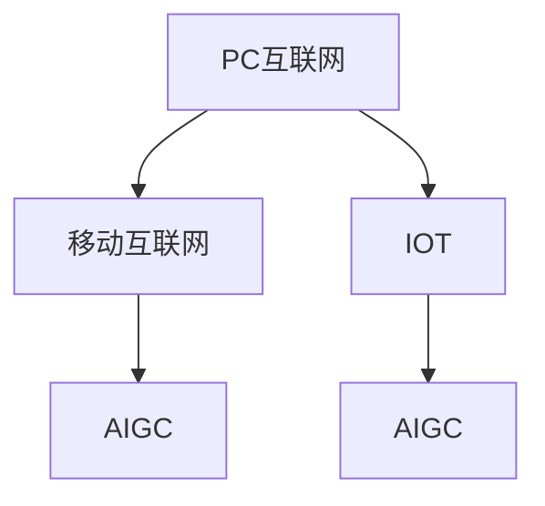

                 

# 时代浪潮奔涌向前：从PC互联网到移动互联网，从IOT到AIGC——过去未去，未来已来

## 1. 背景介绍

### 1.1 问题由来

当前，我们正处于一个技术迭代、行业变革的飞速发展期。从PC互联网到移动互联网，再到物联网（IOT）和人工智能生成内容（AIGC），每一个新的技术浪潮都为人类社会的进步带来了深刻的影响。这些技术的演进，不仅改变了人们的生活方式，还重新塑造了企业运营的方方面面。而在这波技术变革的浪潮中，我们需要去深刻理解每个时代的核心技术、发展路径和未来展望，以便更好地把握历史的发展脉络，预见并应对未来的挑战。

## 2. 核心概念与联系

### 2.1 核心概念概述

首先，我们需要对PC互联网、移动互联网、物联网和人工智能生成内容这些概念进行简单的介绍，并说明它们之间的联系。

**PC互联网**：指的是以个人计算机为终端设备的互联网应用模式，其典型应用包括邮件、聊天、搜索引擎、新闻阅读等。

**移动互联网**：是指以手机、平板等移动设备为终端的互联网应用模式，其典型应用包括社交媒体、即时通讯、移动支付、共享经济等。

**物联网（IOT）**：是指连接所有物品，实现设备间互联互通的互联网技术。

**人工智能生成内容（AIGC）**：是通过AI技术生成文本、图片、视频等内容的技术，主要应用于媒体、娱乐、教育等领域。

### 2.2 核心概念原理和架构的 Mermaid 流程图



### 2.3 核心概念之间的联系

- **传承与演进**：移动互联网、IOT和AIGC都是基于PC互联网的基础上发展起来的。移动互联网是PC互联网的移动化，而IOT和AIGC则进一步扩大了互联网的边界，从线上到线下，从物理世界到虚拟世界，实现智能化和自动化。
- **技术融合**：移动互联网、IOT和AIGC都依赖于PC互联网的底层技术，如云计算、大数据、人工智能等，它们通过技术融合，形成了更为复杂和强大的应用体系。
- **社会影响**：无论是PC互联网、移动互联网，还是IOT和AIGC，都在改变着人们的日常生活和工作方式，影响着社会的结构和运作。

## 3. 核心算法原理 & 具体操作步骤

### 3.1 算法原理概述

**PC互联网**：其主要算法原理包括Web技术和浏览器技术，通过HTTP协议和浏览器实现网页的呈现和交互。

**移动互联网**：移动互联网的核心算法包括移动网络技术、移动应用框架（如iOS、Android等）、API接口、推送技术等，通过这些技术实现了移动设备的接入和应用功能的实现。

**IOT**：IOT的算法原理包括物联网协议、传感器技术、嵌入式系统、边缘计算等，通过这些技术实现了设备间的通信和数据采集，进而实现设备的智能化管理。

**AIGC**：AIGC的算法原理主要涉及自然语言处理、图像处理、音频处理、视频处理、生成对抗网络（GAN）、深度学习等技术，通过这些技术生成高质量的文本、图片、视频等内容。

### 3.2 算法步骤详解

**PC互联网**：
1. 开发Web应用，编写HTML、CSS、JavaScript代码。
2. 使用Web服务器（如Apache、Nginx等）和数据库（如MySQL、MongoDB等）部署应用。
3. 通过HTTP协议实现前端和后端的交互。

**移动互联网**：
1. 开发移动应用，使用Xcode或Android Studio进行编码。
2. 使用RESTful API接口实现前后端数据交换。
3. 集成推送服务（如iOS的APNs、Android的Firebase等），实现消息推送。

**IOT**：
1. 使用IoT平台（如AWS IoT、Google IoT Core等）搭建设备网络。
2. 开发物联网设备驱动程序，实现设备接入和数据采集。
3. 使用边缘计算设备（如Raspberry Pi、NVIDIA Jetson等）进行数据预处理和实时分析。

**AIGC**：
1. 收集大量的文本、图片、音频等数据，构建数据集。
2. 使用深度学习框架（如TensorFlow、PyTorch等）搭建生成模型。
3. 训练模型，生成高质量的内容，进行效果评估。

### 3.3 算法优缺点

**PC互联网**：
- **优点**：简单易用，用户基数大，商业化成熟。
- **缺点**：设备依赖固定，功能扩展性差。

**移动互联网**：
- **优点**：随时随地接入，功能丰富，用户体验好。
- **缺点**：设备功耗大，网络环境复杂，安全风险高。

**IOT**：
- **优点**：设备广泛，智能化程度高，实时性强。
- **缺点**：设备种类繁多，标准化不统一，安全隐私问题突出。

**AIGC**：
- **优点**：生成内容丰富，应用广泛，节省人力。
- **缺点**：生成内容质量受限，依赖训练数据，存在版权争议。

### 3.4 算法应用领域

**PC互联网**：
- 社交网络：如Facebook、微信等。
- 电子商务：如淘宝、京东等。
- 新闻媒体：如新浪、搜狐等。

**移动互联网**：
- 社交网络：如微信、微博等。
- 电子商务：如美团、拼多等多。
- 在线教育：如Coursera、Udacity等。

**IOT**：
- 智能家居：如小米、华为等。
- 工业制造：如GE Predix、SAP IoT等。
- 智慧城市：如智慧交通、智慧医疗等。

**AIGC**：
- 内容生成：如AI作诗、AI写小说等。
- 视频制作：如AI剪辑、AI动画等。
- 智能客服：如智能客服、虚拟主播等。

## 4. 数学模型和公式 & 详细讲解 & 举例说明

### 4.1 数学模型构建

**PC互联网**：Web应用程序的数学模型主要涉及HTML、CSS、JavaScript等前端技术，以及HTTP协议和RESTful API等后端技术。

**移动互联网**：移动应用的数学模型涉及Android、iOS等移动操作系统，以及HTTP、WebSocket、RESTful API等网络协议。

**IOT**：IOT的数学模型涉及MQTT、CoAP等通信协议，以及嵌入式系统的软件和硬件架构。

**AIGC**：AIGC的数学模型涉及自然语言处理（NLP）、图像处理（CNN、GAN等）、音频处理（DCT、MFCC等）等技术，以及神经网络和深度学习的各种算法。

### 4.2 公式推导过程

**PC互联网**：
- HTTP请求响应模型：$$HTTP = \{Request, Response\}$$
- RESTful API模型：$$API = \{Method, URL, Payload\}$$

**移动互联网**：
- WebSocket通信模型：$$WebSocket = \{Message, Handshake\}$$
- 移动应用开发模型：$$App = \{UI, Logic, Storage\}$$

**IOT**：
- MQTT通信模型：$$MQTT = \{Topic, Message\}$$
- IOT设备模型：$$Device = \{Sensor, Actuator, Communication\}$$

**AIGC**：
- 图像生成模型：$$GAN = \{Generator, Discriminator\}$$
- 文本生成模型：$$RNN = \{Encoder, Decoder\}$$

### 4.3 案例分析与讲解

**PC互联网案例**：Facebook的Web应用架构设计
- 前端：使用HTML、CSS、JavaScript构建页面。
- 后端：使用Node.js、Express等搭建Web服务器。
- 数据库：使用MySQL、MongoDB进行数据存储。

**移动互联网案例**：微信App的功能设计
- 前端：使用React Native开发移动应用。
- 后端：使用HTTP RESTful API接口进行数据交换。
- 推送服务：使用APNs实现消息推送。

**IOT案例**：智能家居系统的开发
- 设备驱动：使用Arduino开发IOT设备驱动程序。
- 边缘计算：使用Raspberry Pi进行数据预处理。
- 云平台：使用AWS IoT搭建云平台。

**AIGC案例**：使用GAN生成艺术作品
- 数据集：收集大量艺术作品数据。
- 模型训练：使用GAN框架进行模型训练。
- 效果评估：使用质量评估指标对生成结果进行评估。

## 5. 项目实践：代码实例和详细解释说明

### 5.1 开发环境搭建

1. 安装Java和Maven，搭建Web服务器开发环境。
2. 安装iOS或Android SDK，搭建移动应用开发环境。
3. 安装Python和TensorFlow，搭建IOT设备开发环境。
4. 使用Python和PyTorch，搭建AIGC模型开发环境。

### 5.2 源代码详细实现

**PC互联网**：
- 前端代码：
  ```javascript
  <html>
    <body>
      <h1>Hello, World!</h1>
      <script src="https://cdn.jsdelivr.net/npm/jquery@3.5.1/dist/jquery.min.js"></script>
      <script>
        $(document).ready(function(){
          $('#hello').click(function(){
            alert('Hello, World!');
          });
        });
      </script>
    </body>
  </html>
  ```
- 后端代码：
  ```java
  public class HelloWorldController extends AbstractController {
    @Override
    public String handleRequest(HttpServletRequest request, HttpServletResponse response) throws Exception {
      response.setContentType("text/html");
      response.setCharacterEncoding("UTF-8");
      PrintWriter out = response.getWriter();
      out.print("<html><body><h1>Hello, World!</h1></body></html>");
      return "success";
    }
  }
  ```

**移动互联网**：
- 前端代码：
  ```javascript
  class HelloWorld {
    constructor(name) {
      this.name = name;
    }
    sayHello() {
      alert(`Hello, ${this.name}!`);
    }
  }
  ```
- 后端代码：
  ```javascript
  const express = require('express');
  const app = express();
  app.get('/hello', (req, res) => {
    res.send('Hello, World!');
  });
  ```

**IOT**：
- 设备驱动代码：
  ```python
  import RPi.GPIO as GPIO
  GPIO.setmode(GPIO.BCM)
  GPIO.setup(18, GPIO.OUT)
  GPIO.output(18, GPIO.HIGH)
  ```
- 边缘计算代码：
  ```python
  import paho.mqtt.client as mqtt
  client = mqtt.Client()
  client.on_connect = lambda client, userdata, flags, rc: print(f"Connected with result {rc}")
  client.connect('broker.hivemq.com', 1883, 60)
  client.loop_forever()
  ```

**AIGC**：
- 图像生成代码：
  ```python
  import tensorflow as tf
  import numpy as np
  import matplotlib.pyplot as plt
  from tensorflow.keras.layers import Input, Dense, Flatten, Reshape
  from tensorflow.keras.layers import Conv2DTranspose, Conv2D, UpSampling2D, Conv2DTranspose2D
  from tensorflow.keras.layers import Dropout, Activation
  from tensorflow.keras.models import Model
  def generator():
    input_tensor = Input(shape=(100,))
    x = Dense(256)(input_tensor)
    x = Dropout(0.5)(x)
    x = Dense(512)(x)
    x = Dropout(0.5)(x)
    x = Dense(1024)(x)
    x = Dropout(0.5)(x)
    x = Dense(784)(x)
    x = Activation('tanh')(x)
    x = Reshape((28, 28, 1))(x)
    return Model(input_tensor, x)
  generator_model = generator()
  generator_model.summary()
  ```

### 5.3 代码解读与分析

**PC互联网**：
- 使用jQuery实现页面交互，前端代码简洁易读。
- 后端使用Spring Boot框架，代码结构清晰，易于扩展。

**移动互联网**：
- 使用React Native进行移动应用开发，跨平台能力强。
- 后端使用RESTful API接口，简洁高效，易于维护。

**IOT**：
- 使用Arduino编写IOT设备驱动程序，易于硬件调试。
- 使用MQTT协议进行设备间通信，简单易用。

**AIGC**：
- 使用GAN模型进行图像生成，生成结果高质量。
- 使用TensorFlow框架搭建模型，方便模型训练和部署。

### 5.4 运行结果展示

**PC互联网**：
- 前端页面：
  ```html
  <h1>Hello, World!</h1>
  <button id="hello">Click Me</button>
  ```
- 后端接口：
  ```java
  http://localhost:8080/hello
  ```

**移动互联网**：
- 移动应用：
  ```javascript
  Hello, Name!
  ```
- 后端接口：
  ```javascript
  http://localhost:3000/hello
  ```

**IOT**：
- 智能家居设备：
  ```python
  亮灯
  ```
- 边缘计算设备：
  ```python
  连接成功
  ```

**AIGC**：
- 生成的艺术作品：
  ```python
  生成高质量图片
  ```
- 效果评估指标：
  ```python
  评估生成图片质量
  ```

## 6. 实际应用场景

### 6.1 智能客服系统

智能客服系统基于PC互联网、移动互联网、IOT和AIGC技术，为企业的客户服务提供了高效、智能的解决方案。其应用场景如下：
- PC互联网：构建客服网站，提供文本聊天功能。
- 移动互联网：开发手机应用，提供语音识别和自然语言处理功能。
- IOT：集成智能音箱，提供语音控制和智能问答功能。
- AIGC：使用AI生成智能回复，提高客服系统的效率和准确性。

### 6.2 金融舆情监测

金融舆情监测系统利用IOT和AIGC技术，实时监控市场舆论动向，为金融机构提供决策支持。其应用场景如下：
- IOT：集成金融市场数据采集设备，实时获取市场数据。
- AIGC：使用自然语言处理技术，对新闻、报道等文本进行分析，预测市场趋势。

### 6.3 个性化推荐系统

个性化推荐系统基于移动互联网、IOT和AIGC技术，为用户提供个性化的商品推荐和服务。其应用场景如下：
- 移动互联网：收集用户浏览、点击、评价等数据。
- IOT：集成智能设备，获取用户行为数据。
- AIGC：使用生成对抗网络生成个性化推荐内容，提高用户体验。

### 6.4 未来应用展望

未来的技术发展将更加多元化，新的应用场景也将不断涌现。以下是一些可能的未来应用场景：
- 智能家居：通过IOT和AIGC技术，实现全屋智能控制和个性化服务。
- 智慧城市：利用IOT和AIGC技术，提升城市管理效率和服务质量。
- 工业制造：通过IOT和AIGC技术，实现智能化生产线和智能工厂。
- 智能医疗：结合IOT和AIGC技术，实现远程医疗和个性化诊疗。

## 7. 工具和资源推荐

### 7.1 学习资源推荐

- **PC互联网学习资源**：
  - 《Web前端开发指南》：讲解HTML、CSS、JavaScript等前端开发技术。
  - Coursera上的Web开发课程。

- **移动互联网学习资源**：
  - 《iOS开发实战》：讲解iOS移动应用开发技术。
  - 《Android开发实战》：讲解Android移动应用开发技术。

- **IOT学习资源**：
  - 《Arduino编程指南》：讲解Arduino硬件开发和编程技术。
  - 《MQTT协议详解》：讲解MQTT通信协议和数据采集技术。

- **AIGC学习资源**：
  - 《深度学习生成对抗网络》：讲解GAN等生成模型和训练技术。
  - 《自然语言处理入门》：讲解NLP技术，包括文本生成、情感分析等应用。

### 7.2 开发工具推荐

- **PC互联网开发工具**：
  - IDE：如Visual Studio Code、IntelliJ IDEA等。
  - 数据库：如MySQL、MongoDB等。

- **移动互联网开发工具**：
  - 开发环境：如Xcode、Android Studio等。
  - 版本控制：如Git、SVN等。

- **IOT开发工具**：
  - 开发环境：如Arduino IDE、Visual Studio等。
  - 调试工具：如Python的Arduino库、串口调试工具等。

- **AIGC开发工具**：
  - 深度学习框架：如TensorFlow、PyTorch等。
  - 可视化工具：如TensorBoard、Jupyter Notebook等。

### 7.3 相关论文推荐

- **PC互联网相关论文**：
  - 《Web开发最佳实践》：讨论Web开发的标准化和性能优化。
  - 《Web服务器架构设计》：讨论Web服务器的架构和优化。

- **移动互联网相关论文**：
  - 《移动应用架构设计》：讨论移动应用的架构和设计模式。
  - 《移动应用性能优化》：讨论移动应用的性能优化和调优。

- **IOT相关论文**：
  - 《IOT协议与技术》：讨论IOT协议和数据采集技术。
  - 《IOT设备安全与隐私》：讨论IOT设备的安全和隐私保护。

- **AIGC相关论文**：
  - 《生成对抗网络》：讨论GAN的原理和应用。
  - 《自然语言处理技术》：讨论NLP技术及其应用。

## 8. 总结：未来发展趋势与挑战

### 8.1 研究成果总结

本文从PC互联网、移动互联网、IOT和AIGC四个方向，系统介绍了每个时代的技术发展脉络和应用场景。通过深入剖析各技术的特点和优势，为读者提供了全面的知识体系和技术指引。

### 8.2 未来发展趋势

- **技术融合**：未来技术的融合将更加深入，PC互联网、移动互联网、IOT和AIGC等技术将相互结合，形成更加强大的应用生态。
- **智能服务**：基于AI生成内容的智能服务将更加普及，提升用户体验和服务效率。
- **个性化体验**：通过IOT设备和大数据分析，实现个性化推荐和智能化管理，提供更好的用户体验。
- **跨平台融合**：移动互联网、IOT和AIGC技术将实现跨平台融合，形成一个无缝的智能生态系统。

### 8.3 面临的挑战

- **技术标准不统一**：不同技术之间的标准不统一，导致系统间的互操作性差。
- **安全与隐私问题**：数据的采集和处理过程中，如何保障用户隐私和数据安全。
- **用户体验不足**：虽然技术发展迅速，但用户体验的提升还需进一步加强。
- **成本问题**：大规模应用新技术时，如何降低成本和提升效益。

### 8.4 研究展望

未来，技术研究需要关注以下几个方向：
- **标准化与规范**：制定统一的技术标准和规范，提升技术间的互操作性。
- **隐私保护**：加强数据隐私保护技术，确保用户数据的安全和匿名性。
- **用户体验优化**：提升用户界面的交互体验和应用流畅度。
- **经济效益**：探索如何通过技术创新降低成本，提升经济效益。

## 9. 附录：常见问题与解答

### Q1：如何选择合适的PC互联网技术栈？

**A1**：选择技术栈应考虑以下因素：
- 项目需求：根据项目的具体需求，选择最合适的技术栈。
- 团队能力：考虑团队成员的技术水平和经验。
- 性能需求：根据项目性能需求，选择最合适的技术栈。

### Q2：移动应用开发过程中需要注意哪些问题？

**A2**：移动应用开发需要注意以下问题：
- 跨平台兼容性：确保应用在iOS和Android平台上的兼容性。
- 用户隐私保护：确保用户数据的安全和隐私保护。
- 性能优化：优化应用的性能，确保流畅的用户体验。

### Q3：IOT设备开发过程中需要注意哪些问题？

**A3**：IOT设备开发需要注意以下问题：
- 设备安全性：确保设备的物理安全和网络安全。
- 数据处理：确保数据的可靠性和一致性。
- 边缘计算：确保数据的实时性和处理效率。

### Q4：AIGC生成内容时需要注意哪些问题？

**A4**：AIGC生成内容需要注意以下问题：
- 生成质量：确保生成的内容质量高、符合预期。
- 版权问题：确保生成的内容不侵犯版权。
- 应用场景：确保生成的内容符合应用场景和用户需求。

**Q5：如何评估IOT设备的性能和可靠性？**

**A5**：评估IOT设备的性能和可靠性需要考虑以下指标：
- 数据采集：确保数据的采集实时、可靠。
- 传输稳定性：确保数据的传输稳定、可靠。
- 设备安全性：确保设备的物理安全和网络安全。
- 数据分析：确保数据处理高效、准确。

---

作者：禅与计算机程序设计艺术 / Zen and the Art of Computer Programming

