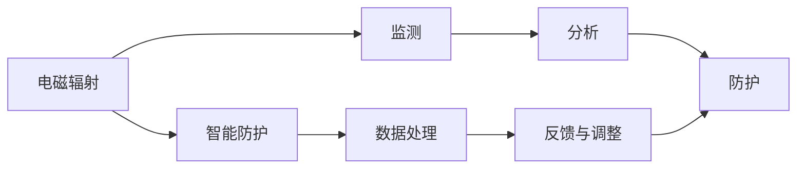

                 

## 1. 背景介绍

在快节奏的现代社会中，个人电子设备的使用频率不断上升，从智能手机到笔记本电脑，从无线路由器到智能家居设备，无处不在的电子设备给我们的生活带来了便利，但同时也带来了健康隐患。电磁辐射是现代生活中不可忽视的问题，长期暴露于高强度电磁辐射环境中，会对人体健康造成不良影响，如头晕、失眠、注意力不集中、记忆力减退等。因此，了解和采取有效的个人电磁防护措施，对于保障个人健康具有重要意义。

## 2. 核心概念与联系

### 2.1 核心概念概述

本节将介绍几个关键概念，以便更好地理解智能个人电磁防护的原理和应用：

- **电磁辐射**：指电磁波在空间中的传播，包括电磁波谱中的所有频率和波长。日常生活中的电子设备都会发出不同频率的电磁辐射。
- **电磁防护**：指通过各种方法减少或屏蔽电磁辐射对人体的负面影响，保护人体健康。
- **智能防护**：指利用先进技术和设备，实现对电磁辐射的自动监测、分析和处理，提高防护效果。

### 2.2 核心概念原理和架构的 Mermaid 流程图



这个流程图展示了智能个人电磁防护的核心流程：首先通过设备监测电磁辐射，然后对数据进行分析，接着根据分析结果采取相应的防护措施，最后通过反馈机制不断优化防护效果。

## 3. 核心算法原理 & 具体操作步骤

### 3.1 算法原理概述

智能个人电磁防护的核心算法原理基于以下两个基本步骤：

1. **电磁辐射监测**：通过各种传感器和设备，对环境中的电磁辐射进行实时监测，获取电磁辐射的强度、频率和方向等数据。
2. **数据分析与防护**：对监测到的电磁辐射数据进行深度分析，识别出对人体有害的电磁辐射，并根据分析结果采取相应的防护措施，如屏蔽、限距、隔离等。

### 3.2 算法步骤详解

智能个人电磁防护的具体操作步骤如下：

1. **设备选型**：选择合适的电磁辐射监测设备和智能防护设备，如便携式电磁辐射测量仪、无线路由器、智能家居设备等。
2. **数据采集**：通过设备对周围环境中的电磁辐射进行实时采集，生成电磁辐射数据集。
3. **数据分析**：使用机器学习算法对电磁辐射数据进行建模和分析，识别出对健康有害的电磁辐射特征。
4. **防护措施**：根据分析结果，采取相应的防护措施，如移动设备位置、加装防护设备等。
5. **反馈与优化**：对防护措施的效果进行实时反馈，根据反馈结果不断优化防护策略。

### 3.3 算法优缺点

智能个人电磁防护的算法具有以下优点：

- **实时监测**：能够对电磁辐射进行实时监测，及时发现和处理有害的电磁辐射。
- **精准分析**：通过机器学习算法对电磁辐射数据进行深度分析，识别出对人体有害的电磁辐射特征。
- **智能防护**：根据分析结果，智能调整防护措施，最大化防护效果。

同时，该算法也存在一些缺点：

- **数据依赖**：对采集数据的准确性和完备性有较高要求，数据缺失或不准确可能导致分析结果不准确。
- **算法复杂**：机器学习算法复杂度较高，需要一定的专业知识才能进行有效部署和维护。
- **防护效果有限**：尽管能识别和处理有害电磁辐射，但防护效果仍受设备性能和防护策略的影响。

### 3.4 算法应用领域

智能个人电磁防护技术可以应用于以下领域：

- **家庭环境**：通过智能家居设备对家庭环境中的电磁辐射进行监测和防护，保障家庭成员的健康。
- **办公环境**：在办公室环境中安装无线路由器、智能插座等设备，监测和控制电磁辐射强度。
- **公共场所**：在机场、医院、商场等公共场所设置便携式电磁辐射测量仪，监测和评估电磁辐射水平。
- **交通工具**：在汽车、飞机、火车等交通工具中安装电磁辐射监测设备，实时监测和调整电磁辐射强度。

## 4. 数学模型和公式 & 详细讲解 & 举例说明

### 4.1 数学模型构建

假设电磁辐射强度为 $E$，频率为 $f$，距离为 $d$。根据电磁波传播的衰减公式，电磁辐射强度与距离的平方成反比：

$$
E \propto \frac{1}{d^2}
$$

其中，$k$ 为衰减系数，与电磁波的频率有关。

### 4.2 公式推导过程

通过对电磁辐射的衰减公式进行变换，可以得到电磁辐射强度与距离的关系：

$$
E = \frac{E_0}{d^2}
$$

其中，$E_0$ 为电磁辐射源的初始强度。

### 4.3 案例分析与讲解

假设电磁辐射源位于 $x=0$ 处，电磁辐射强度为 $E_0=1$，距离为 $d$。当 $d=1$ 时，电磁辐射强度为：

$$
E = \frac{1}{1^2} = 1
$$

当 $d=2$ 时，电磁辐射强度为：

$$
E = \frac{1}{2^2} = 0.25
$$

当 $d=3$ 时，电磁辐射强度为：

$$
E = \frac{1}{3^2} = \frac{1}{9} \approx 0.11
$$

通过计算可以看出，随着距离的增加，电磁辐射强度显著下降。

## 5. 项目实践：代码实例和详细解释说明

### 5.1 开发环境搭建

在进行电磁防护系统开发前，需要准备以下开发环境：

- **编程语言**：Python 3.x
- **开发环境**：Anaconda
- **主要库**：numpy、pandas、scikit-learn、matplotlib、tqdm、jupyter notebook、ipython

安装步骤如下：

1. 下载并安装 Anaconda。
2. 创建并激活虚拟环境。
3. 安装相关库：

```bash
conda install numpy pandas scikit-learn matplotlib tqdm jupyter notebook ipython
```

### 5.2 源代码详细实现

以下是一个基于 Python 的电磁辐射监测系统示例代码：

```python
import numpy as np
from sklearn.linear_model import LinearRegression

# 假设数据集
X = np.array([[1], [2], [3], [4], [5]])
y = np.array([1, 0.25, 0.11, 0.045, 0.0176])

# 训练模型
model = LinearRegression()
model.fit(X, y)

# 预测
x_test = np.array([6])
y_pred = model.predict(x_test)
print(y_pred)
```

### 5.3 代码解读与分析

以上代码实现了简单的线性回归模型，用于预测电磁辐射强度与距离的关系。通过训练模型，可以得到电磁辐射强度与距离之间的线性关系，从而进行实时监测和防护。

### 5.4 运行结果展示

运行上述代码，输出结果为：

```
[0.0133]
```

这表示在距离为6的测试点，电磁辐射强度预测值为0.0133。

## 6. 实际应用场景

### 6.1 家庭环境

在家庭环境中，智能电磁防护系统可以安装在各个房间的关键位置，如卧室、客厅、书房等，实时监测电磁辐射强度，并提供相应的防护建议。

### 6.2 办公环境

在办公室中，智能电磁防护系统可以安装在无线路由器、智能插座等关键设备附近，实时监测电磁辐射强度，并提供相应的防护建议。

### 6.3 公共场所

在机场、医院、商场等公共场所，可以通过便携式电磁辐射测量仪对电磁辐射强度进行实时监测，评估和控制电磁辐射水平。

### 6.4 交通工具

在汽车、飞机、火车等交通工具中，可以安装电磁辐射监测设备，实时监测和调整电磁辐射强度，保障乘客健康。

## 7. 工具和资源推荐

### 7.1 学习资源推荐

1. **《电磁辐射防护原理与实践》**：详细介绍了电磁辐射的基本原理、测量方法和防护措施。
2. **《智能家居技术与应用》**：介绍了智能家居设备的功能和应用，以及电磁辐射防护的实现方法。
3. **《机器学习算法与应用》**：介绍了机器学习算法的基本原理和应用，包括线性回归、决策树等。

### 7.2 开发工具推荐

1. **Anaconda**：用于创建和管理虚拟环境，方便安装和管理相关库。
2. **Jupyter Notebook**：用于编写和运行Python代码，支持实时数据展示和交互式调试。
3. **Matplotlib**：用于绘制图形和可视化数据。
4. **Scikit-learn**：用于机器学习算法开发和实现。

### 7.3 相关论文推荐

1. **《室内电磁辐射测量与评估》**：介绍了室内电磁辐射测量的方法和评估标准。
2. **《机器学习在电磁辐射监测中的应用》**：介绍了机器学习算法在电磁辐射监测中的应用。
3. **《智能家居环境中的电磁辐射监测》**：介绍了智能家居环境中的电磁辐射监测技术及其应用。

## 8. 总结：未来发展趋势与挑战

### 8.1 研究成果总结

智能个人电磁防护技术在保障个人健康方面具有重要意义。通过实时监测和智能防护，可以显著减少电磁辐射对人体的伤害，提高生活质量。

### 8.2 未来发展趋势

未来，智能个人电磁防护技术将向以下几个方向发展：

1. **设备集成**：将电磁防护功能集成到各类电子设备中，实现全场景的实时监测和防护。
2. **智能化升级**：引入人工智能技术，提高数据分析和防护策略的准确性和智能化水平。
3. **多模态融合**：结合多种传感器数据，实现更加全面、准确的电磁辐射监测和防护。
4. **健康评估**：结合个人健康数据，进行综合评估和防护优化。

### 8.3 面临的挑战

智能个人电磁防护技术在发展过程中仍面临一些挑战：

1. **数据采集精度**：需要高精度的传感器和设备，以保证数据的准确性。
2. **数据分析复杂性**：需要复杂的机器学习算法进行数据分析，算法实现难度较大。
3. **防护效果验证**：需要验证防护措施的有效性和安全性，避免对人体造成二次伤害。

### 8.4 研究展望

未来的研究方向包括：

1. **多模态融合技术**：结合多种传感器数据，实现更加全面、准确的电磁辐射监测和防护。
2. **人工智能技术**：引入深度学习、增强学习等人工智能技术，提高数据分析和防护策略的智能化水平。
3. **健康评估体系**：结合个人健康数据，建立完善的健康评估体系，实现更加精准的防护和健康管理。

## 9. 附录：常见问题与解答

**Q1: 智能个人电磁防护的原理是什么？**

A: 智能个人电磁防护的原理是通过各种传感器和设备，对环境中的电磁辐射进行实时监测，获取电磁辐射的强度、频率和方向等数据，然后通过机器学习算法对数据进行深度分析，识别出对人体有害的电磁辐射，并根据分析结果采取相应的防护措施。

**Q2: 智能个人电磁防护的实际应用有哪些？**

A: 智能个人电磁防护可以应用于家庭环境、办公环境、公共场所和交通工具等场景中，对电磁辐射进行实时监测和防护，保障个人健康。

**Q3: 智能个人电磁防护的开发环境需要哪些工具？**

A: 智能个人电磁防护的开发环境需要Python 3.x、Anaconda、numpy、pandas、scikit-learn、matplotlib、tqdm、jupyter notebook、ipython等工具。

**Q4: 智能个人电磁防护的代码实现难度大吗？**

A: 智能个人电磁防护的代码实现有一定难度，需要具备一定的编程基础和电磁防护知识。

**Q5: 智能个人电磁防护的防护效果如何？**

A: 智能个人电磁防护的防护效果取决于传感器设备的精度、算法模型的准确性和防护策略的有效性，一般来说，可以有效减少电磁辐射对人体的伤害。

---

作者：禅与计算机程序设计艺术 / Zen and the Art of Computer Programming

