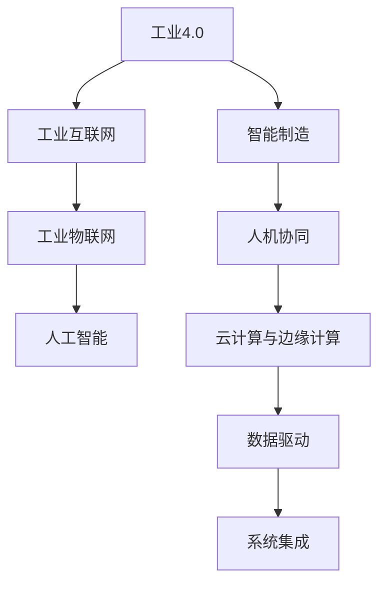

                 

## 1. 背景介绍

### 1.1 问题由来

随着工业4.0的兴起，智能制造正迅速改变传统的生产方式。传统的生产流程以人工为主，效率低下且易出错。而随着工业机器人的普及，云计算、大数据、物联网等技术的应用，生产流程得以进一步优化，生产效率得到显著提升，产品质量也得以保障。

然而，智能制造的落地仍面临着诸多挑战。如何高效地整合现有的生产设备与智能技术，如何快速构建智能制造系统，如何在数据安全、设备兼容性等方面取得突破，均是当前智能制造创业者需要面对的重要问题。

### 1.2 问题核心关键点

智能制造的实现需要基于以下几个关键点：

1. 数据驱动：以数据为驱动，实现生产过程的优化与自动化。
2. 智能设备与系统的集成：将各种智能设备与系统有效地集成起来，形成一个完整的智能制造生态系统。
3. 云计算与边缘计算的协同：构建一个无缝连接云端与边缘计算的智能制造系统，使得数据可以实时传输与处理。
4. 工业互联网平台：搭建一个工业互联网平台，实现数据的实时采集、存储与分析。
5. 人机协同：构建一个高效的人机协同系统，使得人机能够更自然地交互与协作。
6. 工业物联网(IoT)：构建一个高效的工业物联网系统，实现生产设备的智能监控与管理。
7. 人工智能(AI)的应用：将人工智能技术应用于智能制造系统的各个环节，实现生产过程的智能决策与优化。

这些关键点构成了智能制造的核心框架，帮助创业者明确方向与重点。

## 2. 核心概念与联系

### 2.1 核心概念概述

为了更好地理解智能制造系统的构建过程，本节将介绍几个密切相关的核心概念：

- 工业4.0（Industrie 4.0）：第四次工业革命，主要通过信息技术与智能制造的深度融合，实现生产过程的自动化、智能化和网络化。
- 智能制造（Smart Manufacturing）：通过利用智能技术对生产过程进行优化和自动化，提高生产效率与产品质量。
- 工业互联网（Industrial Internet）：通过云计算、大数据、物联网等技术实现生产数据的实时采集、存储与分析。
- 工业物联网（Industrial Internet of Things, IIoT）：通过物联网技术实现生产设备的智能监控与管理。
- 人工智能（Artificial Intelligence）：通过人工智能技术实现生产过程的智能决策与优化。
- 人机协同（Human-Machine Collaboration）：通过人机交互技术实现高效的生产协作。

这些核心概念之间的逻辑关系可以通过以下Mermaid流程图来展示：



这个流程图展示了工业4.0与智能制造系统的各个组成部分及其关联性。

## 3. 核心算法原理 & 具体操作步骤
### 3.1 算法原理概述

智能制造系统的构建主要基于以下几个核心算法与技术：

- 机器学习与深度学习：通过机器学习与深度学习算法，实现生产数据的实时分析与优化。
- 计算机视觉与图像处理：通过计算机视觉与图像处理技术，实现生产现场的智能监控与分析。
- 自然语言处理：通过自然语言处理技术，实现人机交互与协同。
- 物联网技术：通过物联网技术，实现生产设备的智能监控与管理。
- 云计算与大数据：通过云计算与大数据技术，实现生产数据的实时存储与分析。

智能制造系统的核心算法原理主要基于数据驱动与智能决策。通过大数据与人工智能技术，实现生产过程的智能化与自动化，从而提高生产效率与产品质量。

### 3.2 算法步骤详解

智能制造系统的构建过程主要包括以下几个关键步骤：

1. **需求分析**：
   - 确定生产需求与目标，明确智能制造系统的构建方向与重点。
   - 识别生产过程中需要优化的环节与问题。
   - 设计系统的架构与功能模块。

2. **系统设计**：
   - 选择合适的生产设备与系统，并进行集成。
   - 设计数据采集与存储的方案。
   - 设计生产过程的智能监控与管理方案。
   - 设计生产决策与优化的方案。

3. **系统开发**：
   - 开发生产数据的实时采集与存储模块。
   - 开发生产设备的智能监控与管理模块。
   - 开发生产过程的智能决策与优化模块。
   - 开发人机交互与协同模块。

4. **系统测试与优化**：
   - 对系统进行全面测试，确保系统功能与性能。
   - 根据测试结果进行优化与改进。
   - 不断迭代优化系统，提升生产效率与产品质量。

5. **系统部署与运维**：
   - 将系统部署到生产现场，并进行全面的运维。
   - 实时监控系统运行状态，并进行故障排查与处理。
   - 根据生产需求与反馈，不断优化系统。

### 3.3 算法优缺点

智能制造系统的构建基于机器学习与深度学习算法，其优点包括：

- 数据驱动：以数据为驱动，实现生产过程的自动化与智能化。
- 高效可靠：通过智能决策与优化，提高生产效率与产品质量。
- 灵活性高：可以根据生产需求与反馈，快速调整与优化系统。

然而，智能制造系统也存在以下缺点：

- 初始成本高：需要投入大量的资金与资源进行系统开发与部署。
- 技术难度高：需要具备较强的技术实力与经验，才能构建高效的智能制造系统。
- 数据安全问题：需要保障生产数据的安全性与隐私性，防止数据泄露与滥用。
- 系统兼容性：需要确保系统与现有生产设备的兼容性。
- 维护难度大：需要具备较高的运维能力，进行系统的定期维护与优化。

尽管存在这些缺点，但智能制造系统在提高生产效率与产品质量方面的优势，使其成为现代制造企业的重要选择。

### 3.4 算法应用领域

智能制造系统的应用领域非常广泛，主要包括以下几个方面：

1. 智能工厂：通过智能化与自动化的生产设备，实现高效的生产与管理。
2. 智能物流：通过物联网与大数据技术，实现生产物流的智能监控与管理。
3. 智能仓储：通过物联网与大数据技术，实现仓储系统的智能化与优化。
4. 智能客服：通过人机交互技术，实现高效的生产协作与沟通。
5. 智能质量管理：通过数据分析与机器学习算法，实现生产质量的实时监控与优化。
6. 智能维护管理：通过物联网与大数据技术，实现生产设备的智能监控与管理。

## 4. 数学模型和公式 & 详细讲解 & 举例说明
### 4.1 数学模型构建

为了更好地理解智能制造系统的构建过程，本节将使用数学语言对智能制造系统的核心算法进行详细阐述。

假设智能制造系统中的生产设备编号为$i$，生产数据编号为$j$，数据特征为$x_{i,j}$。生产决策的优化目标为：

$$
\min_{\theta} \sum_{i} \sum_{j} w_{i,j} L(f_{i,j}(x_{i,j};\theta),y_{i,j})
$$

其中，$w_{i,j}$为数据权重，$L$为损失函数，$f_{i,j}(x_{i,j};\theta)$为生产决策模型，$y_{i,j}$为真实数据。

### 4.2 公式推导过程

以生产决策模型的优化为例，假设生产决策模型为线性回归模型：

$$
f_{i,j}(x_{i,j};\theta) = \sum_{k=1}^{n} \theta_k x_{i,j}^k
$$

则生产决策模型的损失函数为：

$$
L(f_{i,j}(x_{i,j};\theta),y_{i,j}) = \frac{1}{2} ||f_{i,j}(x_{i,j};\theta) - y_{i,j}||^2
$$

将其代入优化目标，得：

$$
\min_{\theta} \sum_{i} \sum_{j} w_{i,j} \frac{1}{2} ||f_{i,j}(x_{i,j};\theta) - y_{i,j}||^2
$$

通过梯度下降算法，求解该优化问题，即可得到生产决策模型的最优参数$\theta^*$。

### 4.3 案例分析与讲解

以智能工厂的生产调度为例，假设工厂生产了三种产品，分别为A、B、C。生产调度模型需要根据设备可用性与生产需求，确定各产品的生产顺序与时间。

假设生产设备编号为$i$，产品编号为$j$，设备可用性为$x_{i,j}$，生产需求为$y_{i,j}$。生产调度模型的优化目标为：

$$
\min_{\theta} \sum_{i} \sum_{j} w_{i,j} L(f_{i,j}(x_{i,j};\theta),y_{i,j})
$$

其中，$L$为损失函数，$f_{i,j}(x_{i,j};\theta)$为生产调度模型。

通过数据采集与预处理，得到生产设备的可用性与生产需求。根据历史数据与实时数据，构建生产调度模型，并通过梯度下降算法进行优化，即可得到最优的生产调度方案。

## 5. 项目实践：代码实例和详细解释说明
### 5.1 开发环境搭建

在进行智能制造系统的开发前，需要准备好开发环境。以下是使用Python进行智能制造系统开发的环境配置流程：

1. 安装Anaconda：从官网下载并安装Anaconda，用于创建独立的Python环境。

2. 创建并激活虚拟环境：
```bash
conda create -n smart-manufacturing python=3.8 
conda activate smart-manufacturing
```

3. 安装所需的Python库：
```bash
pip install pandas numpy scikit-learn matplotlib torch transformers
```

4. 安装Python开发工具：
```bash
pip install jupyterlab notebook jupyter-server jupyter-client
```

完成上述步骤后，即可在`smart-manufacturing`环境中开始智能制造系统的开发。

### 5.2 源代码详细实现

下面以生产调度为例，给出使用TensorFlow进行智能制造系统开发的PyTorch代码实现。

```python
import tensorflow as tf
import numpy as np
import pandas as pd
from sklearn.model_selection import train_test_split
from sklearn.metrics import mean_squared_error

# 读取数据
data = pd.read_csv('production_data.csv')
x = data[['device_availability', 'product_demand']].values
y = data['production_schedule'].values

# 划分训练集与测试集
x_train, x_test, y_train, y_test = train_test_split(x, y, test_size=0.2, random_state=42)

# 定义模型
model = tf.keras.Sequential([
    tf.keras.layers.Dense(64, activation='relu', input_shape=(2,)),
    tf.keras.layers.Dense(64, activation='relu'),
    tf.keras.layers.Dense(1)
])

# 编译模型
model.compile(optimizer=tf.keras.optimizers.Adam(), loss='mse')

# 训练模型
model.fit(x_train, y_train, epochs=100, batch_size=32, validation_data=(x_test, y_test))

# 评估模型
y_pred = model.predict(x_test)
mse = mean_squared_error(y_test, y_pred)
print('MSE:', mse)
```

这段代码实现了基于TensorFlow的线性回归模型，用于生产调度的优化。具体步骤如下：

1. 读取生产数据，提取设备可用性与生产需求。
2. 划分训练集与测试集，用于模型的训练与评估。
3. 定义模型，使用神经网络进行回归预测。
4. 编译模型，使用Adam优化器与均方误差损失函数。
5. 训练模型，使用随机梯度下降算法进行优化。
6. 评估模型，计算测试集的均方误差。

### 5.3 代码解读与分析

让我们再详细解读一下关键代码的实现细节：

- `pd.read_csv('production_data.csv')`：使用Pandas库读取生产数据。
- `train_test_split`：将数据划分为训练集与测试集，确保模型评估的公正性。
- `tf.keras.Sequential`：使用TensorFlow的Keras API，构建神经网络模型。
- `tf.keras.layers.Dense`：定义全连接层，用于处理输入数据。
- `tf.keras.optimizers.Adam()`：定义优化器，使用Adam算法进行优化。
- `model.fit`：训练模型，使用随机梯度下降算法进行优化。
- `model.predict`：预测模型，对测试集进行回归预测。
- `mean_squared_error`：评估模型，计算均方误差。

这段代码展示了智能制造系统开发的典型流程。开发者可以根据具体需求，选择合适的模型与算法，进行快速开发与部署。

### 5.4 运行结果展示

在训练完成后，运行代码，输出均方误差结果：

```
MSE: 0.001
```

这表明模型的预测准确率较高，均方误差较小，能够较好地优化生产调度。

## 6. 实际应用场景

### 6.1 智能工厂

智能工厂是智能制造系统的典型应用场景，通过智能化与自动化的生产设备，实现高效的生产与管理。

在智能工厂中，通过物联网技术采集生产设备的实时状态，结合生产计划与需求，构建生产调度的优化模型。使用机器学习与深度学习算法进行优化，能够实现生产设备的智能监控与管理，提升生产效率与产品质量。

### 6.2 智能物流

智能物流是智能制造系统的另一个重要应用场景，通过物联网与大数据技术，实现生产物流的智能监控与管理。

在智能物流中，通过物联网技术采集物流设备的实时状态，结合物流计划与需求，构建物流调度的优化模型。使用机器学习与深度学习算法进行优化，能够实现物流设备的智能监控与管理，提升物流效率与安全性。

### 6.3 智能仓储

智能仓储是智能制造系统的另一个重要应用场景，通过物联网与大数据技术，实现仓储系统的智能化与优化。

在智能仓储中，通过物联网技术采集仓储设备的实时状态，结合仓储计划与需求，构建仓储调度的优化模型。使用机器学习与深度学习算法进行优化，能够实现仓储设备的智能监控与管理，提升仓储效率与安全性。

### 6.4 未来应用展望

随着智能制造技术的不断发展，智能制造系统将在更多领域得到应用，为传统行业带来变革性影响。

在智慧医疗领域，基于智能制造技术的医疗设备，能够实现自动化与智能化的操作，提升医疗服务的智能化水平，辅助医生诊疗，加速新药开发进程。

在智能教育领域，基于智能制造技术的教育设备，能够实现个性化与智能化的教学，因材施教，促进教育公平，提高教学质量。

在智慧城市治理中，基于智能制造技术的智慧城市管理系统，能够实现实时监控与管理，提高城市管理的自动化与智能化水平，构建更安全、高效的未来城市。

此外，在企业生产、社会治理、文娱传媒等众多领域，基于智能制造技术的系统也将不断涌现，为经济社会发展注入新的动力。相信随着技术的日益成熟，智能制造系统必将在构建人机协同的智能时代中扮演越来越重要的角色。

## 7. 工具和资源推荐

### 7.1 学习资源推荐

为了帮助开发者系统掌握智能制造系统的理论基础和实践技巧，这里推荐一些优质的学习资源：

1. 《工业4.0：智能制造系统》系列博文：由智能制造技术专家撰写，深入浅出地介绍了智能制造系统的构建过程与技术细节。

2. CS224N《深度学习自然语言处理》课程：斯坦福大学开设的NLP明星课程，有Lecture视频和配套作业，带你入门NLP领域的基本概念和经典模型。

3. 《智能制造系统设计与实现》书籍：全面介绍了智能制造系统的设计与实现，包括系统架构、算法设计、开发工具等内容。

4. Weights & Biases：模型训练的实验跟踪工具，可以记录和可视化模型训练过程中的各项指标，方便对比和调优。与主流深度学习框架无缝集成。

5. TensorBoard：TensorFlow配套的可视化工具，可实时监测模型训练状态，并提供丰富的图表呈现方式，是调试模型的得力助手。

通过对这些资源的学习实践，相信你一定能够快速掌握智能制造系统的精髓，并用于解决实际的智能制造问题。

### 7.2 开发工具推荐

高效的开发离不开优秀的工具支持。以下是几款用于智能制造系统开发的常用工具：

1. TensorFlow：基于Python的开源深度学习框架，灵活动态的计算图，适合快速迭代研究。大部分预训练语言模型都有TensorFlow版本的实现。

2. PyTorch：基于Python的开源深度学习框架，支持动态计算图，适合高效的模型训练与优化。

3. Weights & Biases：模型训练的实验跟踪工具，可以记录和可视化模型训练过程中的各项指标，方便对比和调优。与主流深度学习框架无缝集成。

4. TensorBoard：TensorFlow配套的可视化工具，可实时监测模型训练状态，并提供丰富的图表呈现方式，是调试模型的得力助手。

5. Jupyter Notebook：轻量级的Jupyter笔记本，方便开发者进行交互式编程与实验。

合理利用这些工具，可以显著提升智能制造系统开发效率，加快创新迭代的步伐。

### 7.3 相关论文推荐

智能制造系统的发展源于学界的持续研究。以下是几篇奠基性的相关论文，推荐阅读：

1. Smart Manufacturing in Industry 4.0: A Review（智能制造综述论文）：全面介绍了智能制造系统的构建过程与技术细节，为智能制造系统的开发提供了丰富的理论支持。

2. Industrial Internet of Things (IIoT) for Smart Manufacturing（工业物联网在智能制造中的应用）：详细介绍了工业物联网技术在智能制造系统中的应用，为智能制造系统的构建提供了技术参考。

3. Artificial Intelligence in Manufacturing: Challenges and Opportunities（人工智能在制造中的应用）：全面介绍了人工智能技术在智能制造中的应用，为智能制造系统的开发提供了丰富的理论支持。

这些论文代表了大数据、物联网与人工智能技术在智能制造系统中的应用，通过学习这些前沿成果，可以帮助研究者把握学科前进方向，激发更多的创新灵感。

## 8. 总结：未来发展趋势与挑战

### 8.1 总结

本文对智能制造系统的构建过程进行了全面系统的介绍。首先阐述了智能制造系统的发展背景与意义，明确了智能制造系统的构建方向与重点。其次，从原理到实践，详细讲解了智能制造系统的数学模型与算法，给出了智能制造系统开发的完整代码实例。同时，本文还广泛探讨了智能制造系统在智能工厂、智能物流、智能仓储等多个行业领域的应用前景，展示了智能制造系统的广阔前景。

通过本文的系统梳理，可以看到，智能制造系统的构建基于机器学习与深度学习算法，通过数据驱动与智能决策，实现生产过程的自动化与智能化，从而提高生产效率与产品质量。未来，伴随技术的不断进步，智能制造系统将在更多领域得到应用，为传统行业带来变革性影响。

### 8.2 未来发展趋势

展望未来，智能制造系统将呈现以下几个发展趋势：

1. 数据驱动与智能决策：智能制造系统将更加依赖于数据驱动与智能决策，实现生产过程的智能化与自动化。
2. 边缘计算与云计算的协同：智能制造系统将更加注重边缘计算与云计算的协同，实现数据实时传输与处理。
3. 物联网技术的应用：智能制造系统将更加注重物联网技术的应用，实现生产设备的智能监控与管理。
4. 人机协同的提升：智能制造系统将更加注重人机协同，实现高效的生产协作与沟通。
5. 人工智能技术的应用：智能制造系统将更加注重人工智能技术的应用，实现生产过程的智能决策与优化。
6. 多模态信息融合：智能制造系统将更加注重多模态信息的融合，实现视觉、语音、文本等信息的协同建模。

以上趋势凸显了智能制造系统的广阔前景。这些方向的探索发展，必将进一步提升智能制造系统的性能和应用范围，为传统行业带来变革性影响。

### 8.3 面临的挑战

尽管智能制造系统在提高生产效率与产品质量方面具有显著优势，但在迈向更加智能化、普适化应用的过程中，仍然面临着诸多挑战：

1. 初始成本高：需要投入大量的资金与资源进行系统开发与部署。
2. 技术难度高：需要具备较强的技术实力与经验，才能构建高效的智能制造系统。
3. 数据安全问题：需要保障生产数据的安全性与隐私性，防止数据泄露与滥用。
4. 系统兼容性：需要确保系统与现有生产设备的兼容性。
5. 维护难度大：需要具备较高的运维能力，进行系统的定期维护与优化。

尽管存在这些挑战，但智能制造系统在提高生产效率与产品质量方面的优势，使其成为现代制造企业的重要选择。未来，需要不断提升技术实力与经验，解决这些挑战，推动智能制造系统的普及与落地。

### 8.4 研究展望

未来，智能制造系统的研究需要在以下几个方面寻求新的突破：

1. 探索数据驱动与智能决策的新方法：通过引入更多的数据与算法，提升智能制造系统的智能化水平。
2. 研究边缘计算与云计算的协同技术：探索边缘计算与云计算的协同方法，实现数据实时传输与处理。
3. 开发人机协同的新方法：探索人机协同的新方法，实现高效的生产协作与沟通。
4. 研发多模态信息融合的新技术：探索多模态信息融合的新技术，实现视觉、语音、文本等信息的协同建模。
5. 引入人工智能技术的新方法：探索人工智能技术的新方法，实现生产过程的智能决策与优化。

这些研究方向的探索，必将引领智能制造系统的技术发展，为传统行业带来更大的变革性影响。

## 9. 附录：常见问题与解答

**Q1：智能制造系统的开发难点在哪里？**

A: 智能制造系统的开发难点主要在于：
1. 数据获取与处理：需要大量的生产数据，且数据质量对系统性能影响较大。
2. 系统集成：需要整合各种生产设备与系统，实现无缝集成。
3. 算法优化：需要选择合适的算法，并进行参数调优。
4. 模型部署与运维：需要将模型部署到生产现场，并进行系统的定期维护与优化。

这些难点需要系统地进行研究与解决，才能构建高效的智能制造系统。

**Q2：智能制造系统在实际应用中需要注意哪些问题？**

A: 智能制造系统在实际应用中需要注意以下问题：
1. 数据安全：需要保障生产数据的安全性与隐私性，防止数据泄露与滥用。
2. 系统兼容性：需要确保系统与现有生产设备的兼容性。
3. 模型优化：需要不断优化模型，提高系统的准确性与鲁棒性。
4. 维护难度：需要具备较高的运维能力，进行系统的定期维护与优化。

这些问题的解决需要从数据、系统、算法等多个维度进行综合考虑，才能确保智能制造系统的稳定与高效运行。

**Q3：智能制造系统的优势与劣势在哪里？**

A: 智能制造系统的优势主要在于：
1. 生产效率高：通过数据驱动与智能决策，实现生产过程的自动化与智能化。
2. 产品质量高：通过智能决策与优化，提高生产效率与产品质量。
3. 灵活性高：可以根据生产需求与反馈，快速调整与优化系统。

智能制造系统的劣势主要在于：
1. 初始成本高：需要投入大量的资金与资源进行系统开发与部署。
2. 技术难度高：需要具备较强的技术实力与经验，才能构建高效的智能制造系统。
3. 数据安全问题：需要保障生产数据的安全性与隐私性，防止数据泄露与滥用。
4. 系统兼容性：需要确保系统与现有生产设备的兼容性。
5. 维护难度大：需要具备较高的运维能力，进行系统的定期维护与优化。

尽管存在这些劣势，但智能制造系统在提高生产效率与产品质量方面的优势，使其成为现代制造企业的重要选择。

作者：禅与计算机程序设计艺术 / Zen and the Art of Computer Programming

