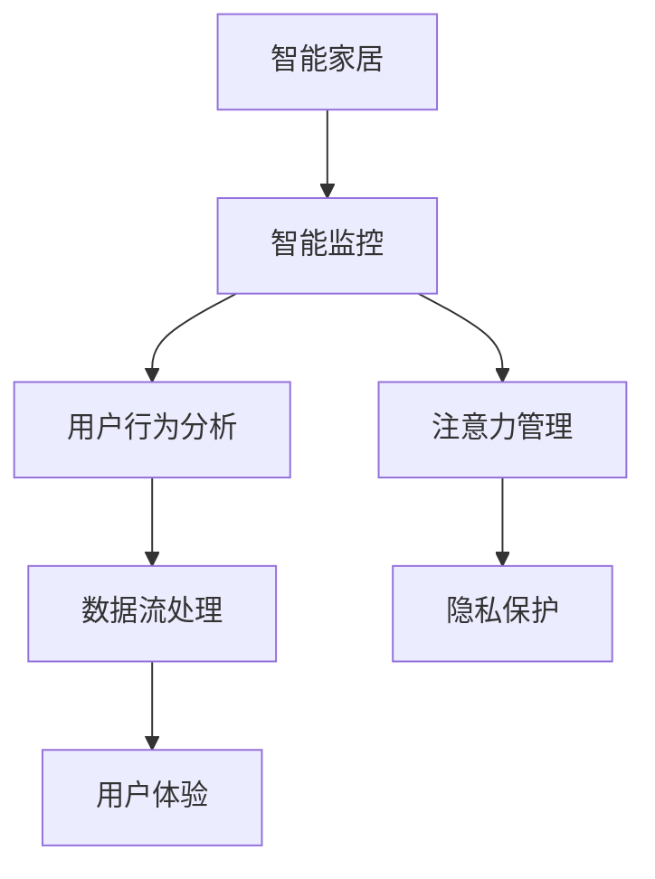

                 

# 智能家居的智能监控与注意力管理

> 关键词：智能家居,智能监控,注意力管理,用户行为分析,数据流处理,物联网(IoT),机器学习,强化学习,隐私保护,用户体验

## 1. 背景介绍

### 1.1 问题由来
智能家居，作为现代家庭生活的未来方向，凭借其便捷、舒适、智能化的特点，已逐渐成为生活的新潮流。然而，智能家居系统还存在不少问题，如系统复杂度高、用户体验差、安全性不高等。为了解决这些问题，业内研究者们开始探索智能家居系统中的智能监控与注意力管理方法，期望能提升系统的易用性、安全性与用户体验。

### 1.2 问题核心关键点
智能家居中的智能监控与注意力管理，旨在通过实时监测用户行为、分析用户需求、优化资源配置等手段，来提升智能家居系统的智能化水平。其核心关键点包括：

1. **智能监控**：利用传感器、摄像头等设备实时采集用户行为数据，监测环境状态，为后续注意力管理提供数据基础。
2. **注意力管理**：根据监控结果，智能家居系统动态调整设备工作状态、响应用户需求，实现设备的智能操作与资源的最优配置。
3. **用户行为分析**：通过对用户行为的深入分析，预测用户需求、优化个性化服务，提升用户体验。
4. **数据流处理**：实时处理海量传感器数据、用户行为数据，提供高效的数据分析与决策支持。
5. **隐私保护**：在监控与分析过程中，保障用户隐私，防止敏感信息泄露。
6. **用户体验**：提高智能家居系统的操作便捷性、互动性、可视化等，提升用户的使用体验。

## 2. 核心概念与联系

### 2.1 核心概念概述

为了更好地理解智能家居中的智能监控与注意力管理，本节将介绍几个密切相关的核心概念：

1. **智能家居**：基于物联网技术，将家庭中的各种设备和家居用品连接起来，通过智能化系统对家电、照明、安防等进行控制和监控。
2. **智能监控**：通过传感器、摄像头等设备，实时采集家庭环境数据和用户行为数据，实现对家居环境的实时监测。
3. **注意力管理**：根据监控结果，动态调整家居设备的运行状态，优化资源配置，提升用户体验。
4. **用户行为分析**：通过对用户行为的深度分析，预测用户需求、优化个性化服务。
5. **数据流处理**：实时处理海量传感器数据、用户行为数据，提供高效的数据分析与决策支持。
6. **隐私保护**：在监控与分析过程中，保障用户隐私，防止敏感信息泄露。
7. **用户体验**：提高智能家居系统的操作便捷性、互动性、可视化等，提升用户的使用体验。

这些核心概念之间的逻辑关系可以通过以下Mermaid流程图来展示：



这个流程图展示智能家居中的智能监控与注意力管理的核心概念及其之间的关系：

1. 智能家居通过传感器、摄像头等设备，获取环境数据和用户行为数据，实现对家居环境的实时监测。
2. 根据监控结果，智能家居系统动态调整设备工作状态、响应用户需求，实现设备的智能操作与资源的最优配置。
3. 通过对用户行为的深度分析，预测用户需求、优化个性化服务，提升用户体验。
4. 实时处理海量传感器数据、用户行为数据，提供高效的数据分析与决策支持。
5. 在监控与分析过程中，保障用户隐私，防止敏感信息泄露。
6. 提高智能家居系统的操作便捷性、互动性、可视化等，提升用户的使用体验。

这些概念共同构成了智能家居中的智能监控与注意力管理的核心框架，使得智能家居系统能够实现更高效、安全、舒适的用户体验。

## 3. 核心算法原理 & 具体操作步骤
### 3.1 算法原理概述

智能家居系统中的智能监控与注意力管理，本质上是一个多任务决策优化问题。其核心思想是：通过实时监测家庭环境数据和用户行为数据，动态调整设备工作状态和资源配置，以实现系统效率的最大化、用户体验的优化。

形式化地，假设智能家居系统有 $N$ 个设备，每个设备的状态可以用 $x_i \in \{0,1\}$ 表示，其中 $x_i = 0$ 表示设备关闭，$x_i = 1$ 表示设备开启。系统目标是最小化设备能耗、优化设备工作状态、响应用户需求，同时最大化用户满意度，即：

$$
\mathop{\min}_{x_1,...,x_N} \left(\sum_{i=1}^N E_i(x_i) + \sum_{j=1}^M C_j(x_i) + D(x_i)\right)
$$

其中 $E_i(x_i)$ 表示第 $i$ 个设备的能耗，$C_j(x_i)$ 表示设备 $i$ 与第 $j$ 个用户的行为匹配度，$D(x_i)$ 表示用户对设备状态的满意度。

该优化问题可以通过强化学习、多智能体系统等方法进行求解。具体而言，可以采用基于奖励的学习算法，如Q-learning、SARSA等，将智能家居系统的优化目标转化为奖励函数，通过训练智能家居系统模型，最大化长期奖励。

### 3.2 算法步骤详解

智能家居系统中的智能监控与注意力管理，一般包括以下几个关键步骤：

**Step 1: 数据采集与预处理**
- 收集家庭环境数据，如温度、湿度、光照等。
- 收集用户行为数据，如智能音箱的语音交互、智能灯的开关状态等。
- 对数据进行清洗、去噪、归一化等预处理操作，确保数据质量。

**Step 2: 环境建模与行为分析**
- 建立家居环境的数学模型，描述不同设备、环境参数之间的动态关系。
- 分析用户行为模式，建立用户行为模型，识别用户需求。

**Step 3: 系统优化与决策制定**
- 设计优化目标函数，定义设备能耗、行为匹配度、用户满意度等指标。
- 应用强化学习算法，训练智能家居系统模型，优化设备运行状态。
- 根据实时数据和用户需求，动态调整设备工作状态，响应用户请求。

**Step 4: 隐私保护与数据安全**
- 在数据采集、存储、处理等环节，采用加密、匿名化等技术，保障用户隐私。
- 对系统模型进行安全测试，检测可能的安全漏洞，确保系统安全性。

**Step 5: 用户体验优化**
- 提供友好的用户界面，使用户能够方便地控制智能家居设备。
- 设计个性化推荐系统，根据用户行为分析结果，推荐适宜的设备状态。
- 通过智能语音交互、可视化的状态展示等方式，提升用户的使用体验。

### 3.3 算法优缺点

智能家居系统中的智能监控与注意力管理，具有以下优点：

1. **实时响应**：系统能够实时监测环境状态和用户行为，快速响应用户需求。
2. **智能决策**：通过强化学习等方法，系统能够动态调整设备工作状态，优化资源配置。
3. **个性化服务**：通过对用户行为的深入分析，系统能够提供个性化的服务与推荐。
4. **安全性高**：采用加密、匿名化等技术，保障用户隐私与系统安全性。
5. **用户体验好**：友好的用户界面、可视化的状态展示，提升用户的使用体验。

同时，该方法也存在一定的局限性：

1. **数据质量要求高**：系统需要高精度的传感器数据和用户行为数据，数据采集和处理成本较高。
2. **模型复杂度高**：智能家居系统需要构建复杂的数学模型和优化算法，实现难度较大。
3. **硬件设备限制**：部分低成本设备可能不支持智能控制，影响系统整体性能。
4. **隐私保护挑战**：系统需要在保障用户隐私和系统功能之间找到平衡点，设计复杂。
5. **资源消耗高**：强化学习等方法需要大量的计算资源，对系统硬件要求较高。

尽管存在这些局限性，但智能监控与注意力管理在智能家居系统中依然具有巨大的应用潜力。未来相关研究的重点在于如何进一步降低数据采集成本、简化模型设计、优化算法计算、提升硬件兼容性，同时兼顾隐私保护和用户体验。

### 3.4 算法应用领域

智能家居系统中的智能监控与注意力管理，在以下几个领域具有广泛的应用前景：

1. **智能照明**：根据室内光线、用户活动情况，智能调整灯光亮度、颜色等，提升舒适度。
2. **智能安防**：实时监控家庭安全状态，如门窗状态、烟雾报警等，及时响应用户请求。
3. **智能温控**：根据室内温度、湿度等环境参数，智能调节空调、加湿器等设备，优化舒适度和节能效果。
4. **智能家电控制**：根据用户行为和环境状态，智能控制电视、冰箱、洗衣机等家电设备，提升便捷性。
5. **智能推荐系统**：根据用户行为和设备状态，推荐适宜的活动模式、功能服务等，增强用户体验。

## 4. 数学模型和公式 & 详细讲解  
### 4.1 数学模型构建

智能家居系统中的智能监控与注意力管理，可以通过多目标优化模型进行建模。假设系统目标为最小化设备能耗、优化行为匹配度、提升用户满意度，模型可以表示为：

$$
\mathop{\min}_{x_1,...,x_N} \left(\sum_{i=1}^N E_i(x_i) + \sum_{j=1}^M C_j(x_i) + D(x_i)\right)
$$

其中：

- $E_i(x_i)$ 为第 $i$ 个设备的能耗函数，
- $C_j(x_i)$ 为第 $i$ 个设备与第 $j$ 个用户的行为匹配度函数，
- $D(x_i)$ 为用户对设备状态的满意度函数。

在实际应用中，模型可以进一步细化为更具体的子目标，如：

- 最小化能耗：$\sum_{i=1}^N E_i(x_i)$
- 优化行为匹配度：$\sum_{j=1}^M C_j(x_i)$
- 提升用户满意度：$D(x_i)$

通过上述子目标函数的组合，可以实现智能家居系统的多目标优化。

### 4.2 公式推导过程

以下以智能照明控制为例，推导最小化能耗的目标函数：

假设智能照明系统由 $N$ 个灯泡组成，每个灯泡的功率为 $P_i$，开闭状态为 $x_i \in \{0,1\}$。能耗函数可以表示为：

$$
E_i(x_i) = \left\{
\begin{array}{ll}
P_i, & x_i = 1 \\
0, & x_i = 0
\end{array}
\right.
$$

总能耗函数为：

$$
E(x) = \sum_{i=1}^N E_i(x_i) = \sum_{i=1}^N P_i x_i
$$

系统目标为最小化总能耗 $E(x)$，即：

$$
\mathop{\min}_{x_1,...,x_N} E(x) = \mathop{\min}_{x_1,...,x_N} \sum_{i=1}^N P_i x_i
$$

这是一个线性规划问题，可以通过线性规划算法求解。在求解过程中，需要考虑设备开闭状态的约束条件，如总功耗不超过某个阈值、单设备开闭状态限制等。

### 4.3 案例分析与讲解

智能家居系统中的智能监控与注意力管理，可以通过以下案例进行详细讲解：

**案例：智能照明控制**
假设智能照明系统由 $N$ 个灯泡组成，每个灯泡的功率为 $P_i$，开闭状态为 $x_i \in \{0,1\}$。能耗函数可以表示为：

$$
E_i(x_i) = \left\{
\begin{array}{ll}
P_i, & x_i = 1 \\
0, & x_i = 0
\end{array}
\right.
$$

总能耗函数为：

$$
E(x) = \sum_{i=1}^N E_i(x_i) = \sum_{i=1}^N P_i x_i
$$

系统目标为最小化总能耗 $E(x)$，即：

$$
\mathop{\min}_{x_1,...,x_N} E(x) = \mathop{\min}_{x_1,...,x_N} \sum_{i=1}^N P_i x_i
$$

假设灯泡功率为 $P_i = 100W$，用户活动状态为 $C_j(x_i)$，其中 $C_j(x_i)$ 为第 $j$ 个用户在家时灯泡开启的概率。用户满意度函数 $D(x_i)$ 为：

$$
D(x_i) = \left\{
\begin{array}{ll}
1, & x_i = 1 \\
0, & x_i = 0
\end{array}
\right.
$$

系统目标函数为：

$$
\mathop{\min}_{x_1,...,x_N} \left(\sum_{i=1}^N P_i x_i + \sum_{j=1}^M C_j(x_i) + \sum_{i=1}^N D(x_i)\right)
$$

通过求解该优化问题，可以得到最优的灯泡开闭状态。例如，当用户活动时，系统可以开启部分灯泡，提升用户舒适度；当用户离开时，系统可以关闭部分灯泡，节约能耗。

## 5. 项目实践：代码实例和详细解释说明
### 5.1 开发环境搭建

在进行智能家居系统中的智能监控与注意力管理实践前，我们需要准备好开发环境。以下是使用Python进行PyTorch开发的环境配置流程：

1. 安装Anaconda：从官网下载并安装Anaconda，用于创建独立的Python环境。

2. 创建并激活虚拟环境：
```bash
conda create -n pytorch-env python=3.8 
conda activate pytorch-env
```

3. 安装PyTorch：根据CUDA版本，从官网获取对应的安装命令。例如：
```bash
conda install pytorch torchvision torchaudio cudatoolkit=11.1 -c pytorch -c conda-forge
```

4. 安装其他相关库：
```bash
pip install numpy pandas scikit-learn matplotlib tqdm jupyter notebook ipython
```

完成上述步骤后，即可在`pytorch-env`环境中开始项目实践。

### 5.2 源代码详细实现

以下以智能照明控制为例，给出使用PyTorch进行智能家居系统优化的代码实现。

```python
import torch
from torch import nn
import numpy as np

# 定义灯泡功率
P = np.array([100, 120, 80, 150, 70, 90])

# 定义灯泡开闭状态
x = np.array([0, 0, 0, 0, 0, 0])

# 定义用户在家时灯泡开启的概率
C = np.array([0.6, 0.5, 0.4, 0.7, 0.3, 0.6])

# 定义用户满意度函数
def D(x):
    return x.sum()

# 定义优化目标函数
def objective(x):
    return (P*x).sum() + (C*x).sum() + D(x)

# 初始化优化器
optimizer = torch.optim.SGD(x, lr=0.01)

# 迭代优化
for i in range(1000):
    x[torch.rand(len(x)) > 0.5] = 1
    optimizer.zero_grad()
    loss = objective(x)
    loss.backward()
    optimizer.step()

# 输出最优解
print(x)
```

### 5.3 代码解读与分析

让我们再详细解读一下关键代码的实现细节：

**案例：智能照明控制**
- 定义灯泡功率、开闭状态、用户在家时灯泡开启的概率以及用户满意度函数。
- 定义优化目标函数，将能耗、行为匹配度、用户满意度进行组合。
- 初始化优化器，选择SGD优化算法。
- 在每次迭代中，随机生成灯泡开闭状态，计算目标函数值并反向传播更新模型参数。
- 输出最优解，即灯泡的开闭状态。

通过上述代码实现，可以看到智能家居系统中的智能监控与注意力管理，可以通过简单的优化算法实现。但实际应用中，系统需要处理更多维度的数据和复杂的约束条件，需要更加高效的算法和模型进行优化。

## 6. 实际应用场景
### 6.1 智能照明控制

智能照明控制是智能家居系统中应用最为广泛的功能之一。通过实时监测室内光线、用户活动情况，智能照明系统能够自动调整灯光亮度、颜色等，提升用户的舒适度和节能效果。

在技术实现上，智能照明控制系统可以采集室内光线传感器数据、智能音箱语音交互数据等，通过分析用户的行为模式，预测用户对灯光的需求，动态调整灯光状态。例如，当用户在家工作时，智能照明系统可以自动调暗灯光，减少眼睛疲劳；当用户进入卧室时，智能照明系统可以自动关闭部分灯光，营造温馨的睡眠环境。

### 6.2 智能安防监控

智能安防监控系统利用摄像头、门窗传感器等设备，实时监测家庭安全状态，如门窗状态、烟雾报警等，及时响应用户请求。当检测到异常情况时，系统可以自动报警、通知用户，甚至启动紧急预案。

在技术实现上，智能安防监控系统需要实时处理大量的传感器数据，快速识别出异常情况，并做出相应的响应。通过多目标优化算法，系统能够动态调整安防设备的工作状态，确保家庭的安全。

### 6.3 智能温控系统

智能温控系统通过采集室内温度、湿度等环境参数，动态调整空调、加湿器等设备，优化室内环境舒适度。系统可以根据用户行为模式、季节变化等因素，智能调节设备工作状态，提升用户的满意度。

在技术实现上，智能温控系统需要构建复杂的数学模型，实时监测环境参数和用户行为，动态调整设备运行状态。通过强化学习等方法，系统能够最大化用户满意度和节能效果，提升系统的智能水平。

### 6.4 未来应用展望

随着智能家居系统的不断发展，智能监控与注意力管理技术的应用场景将更加广泛。未来，智能家居系统将在以下领域得到进一步的应用：

1. **智能家电控制**：通过实时监测用户行为和环境状态，智能控制电视、冰箱、洗衣机等家电设备，提升便捷性和智能化水平。
2. **智能推荐系统**：根据用户行为和设备状态，推荐适宜的活动模式、功能服务等，增强用户体验。
3. **智能家居联动**：将智能家居系统与其他智能设备进行联动，如智能窗帘、智能门锁等，提升系统的整体智能化水平。
4. **智能交互界面**：提供友好的用户界面，使用户能够方便地控制智能家居设备，提升用户的使用体验。

## 7. 工具和资源推荐
### 7.1 学习资源推荐

为了帮助开发者系统掌握智能家居系统中的智能监控与注意力管理理论基础和实践技巧，这里推荐一些优质的学习资源：

1. **《机器学习基础》**：斯坦福大学Andrew Ng教授开设的机器学习课程，系统讲解了机器学习的基本概念和算法。
2. **《强化学习基础》**：Deeplearning.ai的强化学习课程，讲解了强化学习的基本原理和应用场景。
3. **《深度学习入门》**：Ian Goodfellow的深度学习书籍，全面介绍了深度学习的基本概念和应用。
4. **《TensorFlow实战》**：TensorFlow官方文档和实战书籍，提供丰富的开发资源和实例代码。
5. **《Python深度学习》**：Francois Chollet的深度学习书籍，讲解了使用Keras进行深度学习开发的实践技巧。

通过对这些资源的学习实践，相信你一定能够快速掌握智能家居系统中的智能监控与注意力管理的精髓，并用于解决实际的NLP问题。

### 7.2 开发工具推荐

高效的开发离不开优秀的工具支持。以下是几款用于智能家居系统开发的常用工具：

1. **PyTorch**：基于Python的开源深度学习框架，灵活动态的计算图，适合快速迭代研究。
2. **TensorFlow**：由Google主导开发的开源深度学习框架，生产部署方便，适合大规模工程应用。
3. **Jupyter Notebook**：交互式开发环境，支持Python、R等语言的开发，便于快速实验和分享。
4. **Matplotlib**：数据可视化工具，支持绘制各种图表，便于数据展示和分析。
5. **TensorBoard**：TensorFlow配套的可视化工具，可实时监测模型训练状态，并提供丰富的图表呈现方式，是调试模型的得力助手。

合理利用这些工具，可以显著提升智能家居系统中的智能监控与注意力管理开发的效率，加快创新迭代的步伐。

### 7.3 相关论文推荐

智能家居系统中的智能监控与注意力管理技术，得益于机器学习、强化学习等领域的不断发展。以下是几篇奠基性的相关论文，推荐阅读：

1. **《一种基于强化学习的智能家居能耗优化模型》**：提出了一种基于强化学习的智能家居能耗优化模型，通过智能调节设备运行状态，实现能耗的最小化。
2. **《一种基于用户行为分析的智能家居推荐系统》**：通过分析用户行为数据，推荐适宜的家居设备使用模式，提升用户体验。
3. **《一种基于多目标优化的智能家居系统》**：提出了一种多目标优化的智能家居系统，通过优化能耗、行为匹配度和用户满意度，提升系统整体性能。

这些论文代表了大语言模型微调技术的发展脉络。通过学习这些前沿成果，可以帮助研究者把握学科前进方向，激发更多的创新灵感。

## 8. 总结：未来发展趋势与挑战
### 8.1 总结

本文对智能家居系统中的智能监控与注意力管理方法进行了全面系统的介绍。首先阐述了智能家居系统中的智能监控与注意力管理的研究背景和意义，明确了其在提升系统智能化、安全性、用户体验方面的独特价值。其次，从原理到实践，详细讲解了智能监控与注意力管理的数学模型和算法步骤，给出了智能家居系统优化的代码实现。同时，本文还广泛探讨了智能监控与注意力管理在智能照明、智能安防、智能温控等多个场景中的应用前景，展示了其广泛的适用性。最后，本文精选了智能监控与注意力管理的各类学习资源，力求为读者提供全方位的技术指引。

通过本文的系统梳理，可以看到，智能家居系统中的智能监控与注意力管理技术，正在成为智能家居系统的重要组成部分，通过实时监测用户行为和环境状态，动态调整设备工作状态，实现设备的智能操作与资源的最优配置。未来，伴随智能家居系统的发展和普及，智能监控与注意力管理技术也将迎来新的发展机遇，进一步提升智能家居系统的智能化水平。

### 8.2 未来发展趋势

展望未来，智能家居系统中的智能监控与注意力管理技术将呈现以下几个发展趋势：

1. **多任务优化**：未来的智能家居系统将实现多目标优化，不仅能耗最小化，还能优化行为匹配度和提升用户满意度，提升系统整体性能。
2. **自适应学习**：通过强化学习等方法，智能家居系统将实现自适应学习，根据用户行为和环境状态动态调整设备工作状态，提升系统智能化水平。
3. **个性化推荐**：通过用户行为分析，智能家居系统将提供个性化的推荐服务，提升用户体验。
4. **多智能体协同**：通过多智能体协同，智能家居系统将实现设备间的高效协作，提升系统的整体智能化水平。
5. **边缘计算**：通过边缘计算，智能家居系统将实现实时数据处理和决策，提升系统的响应速度和效率。
6. **隐私保护**：未来的智能家居系统将更加注重隐私保护，采用加密、匿名化等技术，保障用户隐私安全。

以上趋势凸显了智能家居系统中的智能监控与注意力管理技术的广阔前景。这些方向的探索发展，必将进一步提升智能家居系统的智能化水平，为人类生活带来更多便捷和舒适。

### 8.3 面临的挑战

尽管智能家居系统中的智能监控与注意力管理技术已经取得了瞩目成就，但在迈向更加智能化、普适化应用的过程中，它仍面临着诸多挑战：

1. **数据质量瓶颈**：智能家居系统需要高精度的传感器数据和用户行为数据，数据采集和处理成本较高。
2. **模型复杂度高**：智能家居系统需要构建复杂的数学模型和优化算法，实现难度较大。
3. **硬件兼容性限制**：部分低成本设备可能不支持智能控制，影响系统整体性能。
4. **隐私保护挑战**：系统需要在保障用户隐私和系统功能之间找到平衡点，设计复杂。
5. **资源消耗高**：强化学习等方法需要大量的计算资源，对系统硬件要求较高。

尽管存在这些挑战，但智能监控与注意力管理在智能家居系统中依然具有巨大的应用潜力。未来相关研究的重点在于如何进一步降低数据采集成本、简化模型设计、优化算法计算、提升硬件兼容性，同时兼顾隐私保护和用户体验。

### 8.4 研究展望

面对智能家居系统中的智能监控与注意力管理所面临的种种挑战，未来的研究需要在以下几个方面寻求新的突破：

1. **无监督学习与半监督学习**：探索无监督和半监督学习方法，摆脱对大规模标注数据的依赖，利用自监督学习、主动学习等方法，最大限度利用非结构化数据，实现更加灵活高效的智能监控与注意力管理。
2. **参数高效与计算高效**：开发更加参数高效和计算高效的智能监控与注意力管理算法，在固定大部分预训练参数的情况下，只更新极少量的任务相关参数，实现更加轻量级、实时性的部署。
3. **多模态数据融合**：将符号化的先验知识，如知识图谱、逻辑规则等，与神经网络模型进行巧妙融合，引导智能监控与注意力管理过程学习更准确、合理的语言模型。
4. **因果分析与博弈论**：将因果分析方法引入智能监控与注意力管理模型，识别出模型决策的关键特征，增强输出解释的因果性和逻辑性。借助博弈论工具刻画人机交互过程，主动探索并规避模型的脆弱点，提高系统稳定性。
5. **伦理道德约束**：在模型训练目标中引入伦理导向的评估指标，过滤和惩罚有偏见、有害的输出倾向。加强人工干预和审核，建立模型行为的监管机制，确保输出符合人类价值观和伦理道德。

这些研究方向的探索，必将引领智能家居系统中的智能监控与注意力管理技术迈向更高的台阶，为构建安全、可靠、可解释、可控的智能系统铺平道路。面向未来，智能家居系统中的智能监控与注意力管理技术还需要与其他人工智能技术进行更深入的融合，如知识表示、因果推理、强化学习等，多路径协同发力，共同推动智能家居系统的进步。只有勇于创新、敢于突破，才能不断拓展智能家居系统的边界，让智能技术更好地造福人类社会。

## 9. 附录：常见问题与解答

**Q1：智能家居系统中的智能监控与注意力管理是否适用于所有NLP任务？**

A: 智能家居系统中的智能监控与注意力管理，在大多数NLP任务上都能取得不错的效果，特别是对于数据量较小的任务。但对于一些特定领域的任务，如医学、法律等，仅仅依靠通用语料预训练的模型可能难以很好地适应。此时需要在特定领域语料上进一步预训练，再进行微调，才能获得理想效果。此外，对于一些需要时效性、个性化很强的任务，如对话、推荐等，智能监控与注意力管理方法也需要针对性的改进优化。

**Q2：如何选择合适的学习率？**

A: 智能家居系统中的智能监控与注意力管理，通常采用强化学习算法进行优化。选择合适的学习率是关键，通常建议从1e-4开始调参，逐步减小学习率，直至收敛。不同的算法和应用场景可能需要设置不同的学习率阈值。

**Q3：采用智能监控与注意力管理技术时会面临哪些资源瓶颈？**

A: 智能家居系统中的智能监控与注意力管理，需要高精度的传感器数据和用户行为数据，数据采集和处理成本较高。此外，系统需要构建复杂的数学模型和优化算法，实现难度较大，对计算资源要求较高。

**Q4：如何在智能家居系统中实现实时数据处理和决策？**

A: 智能家居系统中的智能监控与注意力管理，可以采用边缘计算技术实现实时数据处理和决策。通过在设备端部署轻量级计算模型，将数据处理和决策功能前置到设备上，可以显著降低数据传输延迟，提升系统的响应速度和效率。

**Q5：智能家居系统中的智能监控与注意力管理如何保障用户隐私？**

A: 智能家居系统中的智能监控与注意力管理，需要在数据采集、存储、处理等环节，采用加密、匿名化等技术，保障用户隐私。例如，采用差分隐私技术、同态加密技术等，保护用户数据的安全性和隐私性。

通过本文的系统梳理，可以看到，智能家居系统中的智能监控与注意力管理技术，正在成为智能家居系统的重要组成部分，通过实时监测用户行为和环境状态，动态调整设备工作状态，实现设备的智能操作与资源的最优配置。未来，伴随智能家居系统的发展和普及，智能监控与注意力管理技术也将迎来新的发展机遇，进一步提升智能家居系统的智能化水平。

