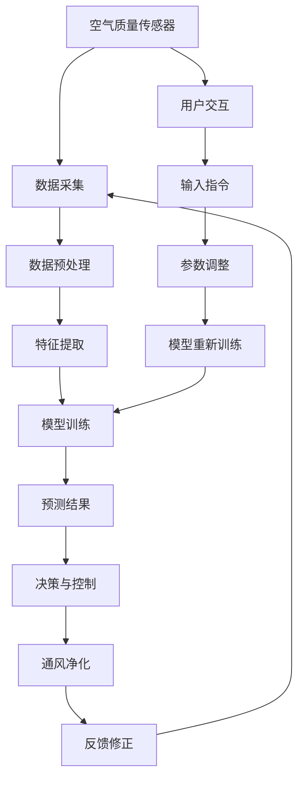

                 

# 智能家居防霾创业：室内空气质量的精确控制

## 1. 背景介绍

在快速发展的数字时代，人们对于居住环境的要求越来越高。从舒适度到健康，现代智能家居系统已经成为改善家庭生活品质的重要手段。其中，室内空气质量的控制更是重中之重。空气污染不仅影响人们的呼吸系统，还可能诱发多种疾病，如哮喘、肺癌等。因此，如何精确、智能地监测和控制室内空气质量，成为智能家居系统的重要课题。

### 1.1 问题由来

随着工业化和城市化的加速，空气污染问题日益严重。室内空气质量也受到多种因素的影响，如通风不足、吸烟、烹饪、宠物等。传统的人工监测方式不仅耗时耗力，还无法及时响应。利用物联网、传感器技术和人工智能算法，可以实现室内空气质量的实时监测和智能控制，为居民提供健康舒适的居住环境。

### 1.2 问题核心关键点

本项目旨在开发一款智能家居防霾系统，该系统能够精确监测室内空气质量，并在发现污染源时自动采取措施，如开窗通风、空气净化等，提升居住环境的舒适度与健康水平。该系统基于机器学习算法进行数据分析和预测，能够适应不同家庭环境的动态变化，提供个性化的防霾解决方案。

## 2. 核心概念与联系

### 2.1 核心概念概述

为更好地理解本项目的技术框架，本节将介绍几个密切相关的核心概念：

- 智能家居防霾系统：基于物联网和人工智能技术，实现室内空气质量的实时监测与智能控制。
- 空气质量传感器：用于检测室内空气中的多种污染物，如PM2.5、甲醛、二氧化碳等。
- 机器学习算法：通过历史数据训练模型，对室内空气质量进行预测与分析，指导系统的决策。
- 决策与控制模块：接收传感器数据和预测结果，自动化地采取措施，如通风、净化等。
- 用户交互界面：展示实时空气质量数据，接收用户操作指令，调整系统参数。

这些核心概念之间的逻辑关系可以通过以下Mermaid流程图来展示：



这个流程图展示了智能家居防霾系统的主要流程：传感器采集数据，预处理并提取特征，通过机器学习模型进行预测，根据预测结果进行决策与控制，并根据反馈进行修正。用户还可以通过交互界面，实时了解空气质量，并调整系统参数。

## 3. 核心算法原理 & 具体操作步骤

### 3.1 算法原理概述

本项目的主要算法原理包括以下几个关键环节：

1. 数据采集与预处理：通过空气质量传感器实时采集室内的污染物浓度数据，并对其进行预处理，如去噪、归一化等，确保数据质量。

2. 特征提取：从预处理后的数据中提取重要的特征，如PM2.5浓度、甲醛浓度等，用于后续的模型训练。

3. 模型训练与预测：使用机器学习算法对提取的特征进行训练，得到一个能够预测室内空气质量的模型。该模型可以实时预测污染物浓度，并进行分类（如污染、清洁），指导系统的决策。

4. 决策与控制：根据模型的预测结果，系统自动采取措施，如开窗通风、开启空气净化器等，提升室内空气质量。

5. 反馈与修正：系统会根据实际效果进行反馈修正，如根据实时数据调整通风强度、净化时间等，不断优化系统的表现。

### 3.2 算法步骤详解

#### 3.2.1 数据采集与预处理

数据采集是智能家居防霾系统的第一步。以下是数据采集与预处理的详细步骤：

1. 部署空气质量传感器：在室内不同位置部署多个空气质量传感器，用于监测PM2.5、甲醛、二氧化碳等污染物浓度。

2. 数据采集：传感器实时采集室内空气质量数据，并通过物联网协议（如MQTT）将数据上传到云端服务器。

3. 数据预处理：对上传的数据进行去噪、归一化等预处理，确保数据的质量和一致性。

4. 数据存储：将预处理后的数据存储到数据库中，供后续的模型训练和预测使用。

#### 3.2.2 特征提取

特征提取是将原始数据转换为机器学习模型可接受的形式。以下是特征提取的具体步骤：

1. 特征选择：从预处理后的数据中选择重要的特征，如PM2.5浓度、甲醛浓度、二氧化碳浓度等。

2. 数据标准化：将选定的特征进行标准化处理，确保数据在同一尺度上。

3. 特征降维：使用主成分分析（PCA）或线性判别分析（LDA）等方法对特征进行降维，减少模型的计算复杂度。

#### 3.2.3 模型训练与预测

模型训练与预测是智能家居防霾系统的核心环节。以下是具体的步骤：

1. 模型选择：选择合适的机器学习算法，如支持向量机（SVM）、随机森林（RF）、神经网络（NN）等。

2. 数据划分：将预处理后的数据划分为训练集和测试集，用于模型训练和评估。

3. 模型训练：使用训练集数据对选定的模型进行训练，优化模型参数。

4. 模型评估：使用测试集数据对训练好的模型进行评估，计算准确率、召回率等指标，确保模型的预测能力。

5. 实时预测：在模型训练完成后，使用新的数据进行实时预测，得到室内空气质量的分类结果。

#### 3.2.4 决策与控制

决策与控制是智能家居防霾系统的执行环节。以下是具体的步骤：

1. 决策制定：根据模型的预测结果，制定相应的决策，如开窗通风、开启空气净化器等。

2. 控制执行：根据决策结果，控制相应的设备执行相应的操作。

3. 反馈修正：系统会根据实际效果进行反馈修正，如根据实时数据调整通风强度、净化时间等，不断优化系统的表现。

### 3.3 算法优缺点

智能家居防霾系统的优点：

1. 实时监测：能够实时监测室内空气质量，及时发现污染源。

2. 自动化控制：系统能够根据预测结果自动采取措施，提升居住环境舒适度。

3. 用户友好：用户可以通过交互界面，实时了解空气质量，调整系统参数。

4. 数据驱动：基于历史数据训练模型，能够适应不同家庭环境的动态变化。

5. 节能环保：通过智能控制，减少不必要的通风和净化，节约能源。

智能家居防霾系统的缺点：

1. 初始投资较高：系统需要部署多个传感器和智能设备，初始投资较大。

2. 数据依赖性强：系统依赖传感器数据进行预测，传感器数据的质量直接影响系统的表现。

3. 模型鲁棒性不足：模型在面对异常数据或新数据时，可能出现预测错误，需要不断优化模型。

4. 用户参与度低：系统需要用户主动参与，才能充分发挥其功能，用户参与度低可能影响效果。

5. 隐私问题：系统需要收集室内空气质量数据，可能涉及用户隐私问题。

### 3.4 算法应用领域

智能家居防霾系统在多个领域都有广泛的应用：

1. 家庭住宅：通过在家庭室内部署多个传感器，实时监测空气质量，并在污染源出现时采取措施，提升居住环境舒适度。

2. 办公室：通过在办公室内部署传感器，监测空气质量，减少员工的不适感，提高工作效率。

3. 医院：通过在病房内部署传感器，监测空气质量，保障患者健康，提高医疗服务质量。

4. 公共场所：在酒店、机场、商场等公共场所部署传感器，监测空气质量，提升环境质量，保障公众健康。

5. 工业生产：在工厂内部署传感器，监测空气质量，预防职业病，提高生产效率。

6. 农业温室：在温室内部署传感器，监测空气质量，保障作物生长，提高农产品品质。

以上应用场景展示了智能家居防霾系统的广泛适用性，能够为各个领域带来显著的健康和环境效益。

## 4. 数学模型和公式 & 详细讲解 & 举例说明

### 4.1 数学模型构建

本项目的主要数学模型包括以下几个关键环节：

1. 数据采集与预处理模型：用于处理传感器上传的数据，确保数据质量。

2. 特征提取模型：用于提取重要的特征，如PM2.5浓度、甲醛浓度等。

3. 模型训练模型：用于训练机器学习模型，进行室内空气质量的预测。

4. 决策与控制模型：用于制定决策，控制通风、净化等操作。

5. 反馈与修正模型：用于根据实际效果进行反馈修正。

### 4.2 公式推导过程

以下是数学模型的详细推导过程：

#### 4.2.1 数据采集与预处理模型

数据采集与预处理模型的目标是去除噪声，将传感器上传的数据转换为标准格式。以下是具体公式：

1. 去噪：去除传感器数据中的噪声，可以使用中值滤波、均值滤波等方法。

2. 归一化：将传感器数据归一化到0-1之间，公式如下：

   $$
   x' = \frac{x - x_{\text{min}}}{x_{\text{max}} - x_{\text{min}}}
   $$

其中，$x$ 为原始数据，$x_{\text{min}}$ 和 $x_{\text{max}}$ 分别为数据的最大值和最小值。

#### 4.2.2 特征提取模型

特征提取模型的目标是提取重要的特征，用于后续的模型训练。以下是具体公式：

1. 主成分分析（PCA）：通过降维技术，将高维数据转换为低维数据。PCA的目标是最大化主成分的方差，公式如下：

   $$
   U = \arg\min_{U} \text{tr}(U^T \Sigma U)
   $$

   其中，$\Sigma$ 为协方差矩阵，$U$ 为转换矩阵。

2. 线性判别分析（LDA）：通过降维技术，将高维数据转换为低维数据。LDA的目标是最大化类间距离，最小化类内距离，公式如下：

   $$
   L = \arg\min_{L} \text{tr}(L^T \Sigma) - \frac{1}{2} \text{tr}(\Sigma_{L})
   $$

   其中，$\Sigma$ 为协方差矩阵，$L$ 为转换矩阵。

#### 4.2.3 模型训练模型

模型训练模型的目标是训练机器学习模型，进行室内空气质量的预测。以下是具体公式：

1. 支持向量机（SVM）：通过最大化分类间隔，训练一个线性分类器。SVM的目标是最小化间隔最大，公式如下：

   $$
   w = \arg\min_{w} \frac{1}{2} \|w\|^2 + C \sum_{i=1}^N \xi_i
   $$

   其中，$w$ 为分类超平面，$C$ 为正则化参数，$\xi_i$ 为松弛变量。

2. 随机森林（RF）：通过构建多个决策树，并取其投票结果，训练一个集成分类器。RF的目标是减少过拟合，公式如下：

   $$
   f(x) = \frac{1}{M} \sum_{m=1}^M f_m(x)
   $$

   其中，$f(x)$ 为集成分类器，$f_m(x)$ 为第$m$棵决策树的预测结果，$M$ 为决策树的数量。

3. 神经网络（NN）：通过多层神经网络，训练一个非线性分类器。NN的目标是最小化损失函数，公式如下：

   $$
   L = \frac{1}{N} \sum_{i=1}^N L(y_i, \hat{y}_i)
   $$

   其中，$L$ 为损失函数，$y_i$ 为真实标签，$\hat{y}_i$ 为模型预测结果。

#### 4.2.4 决策与控制模型

决策与控制模型的目标是制定决策，控制通风、净化等操作。以下是具体公式：

1. 决策制定：根据模型的预测结果，制定相应的决策。例如，当预测值为高污染时，可以制定开窗通风的决策。

2. 控制执行：根据决策结果，控制相应的设备执行相应的操作。例如，当决策为开窗通风时，可以自动控制窗户开关。

3. 反馈修正：系统会根据实际效果进行反馈修正，如根据实时数据调整通风强度、净化时间等，不断优化系统的表现。

#### 4.2.5 反馈与修正模型

反馈与修正模型的目标是根据实际效果进行反馈修正。以下是具体公式：

1. 调整参数：根据实时数据调整通风强度、净化时间等系统参数。

2. 优化算法：使用优化算法，如梯度下降、遗传算法等，不断优化模型参数。

3. 反馈循环：建立反馈循环，实时监测系统表现，根据实际效果进行反馈修正。

### 4.3 案例分析与讲解

以一个具体的案例来说明智能家居防霾系统的工作流程：

1. 数据采集：空气质量传感器实时采集室内PM2.5浓度数据，并将数据上传到云端服务器。

2. 数据预处理：对上传的数据进行去噪、归一化等预处理，确保数据的质量和一致性。

3. 特征提取：从预处理后的数据中提取PM2.5浓度、甲醛浓度、二氧化碳浓度等特征。

4. 模型训练：使用支持向量机模型对提取的特征进行训练，得到一个能够预测室内空气质量的模型。

5. 模型预测：在模型训练完成后，使用新的数据进行实时预测，得到室内空气质量的分类结果。

6. 决策与控制：根据模型的预测结果，制定相应的决策，如开窗通风、开启空气净化器等。

7. 反馈修正：系统会根据实际效果进行反馈修正，如根据实时数据调整通风强度、净化时间等，不断优化系统的表现。

## 5. 项目实践：代码实例和详细解释说明

### 5.1 开发环境搭建

在进行智能家居防霾系统开发前，我们需要准备好开发环境。以下是使用Python进行PyTorch开发的环境配置流程：

1. 安装Anaconda：从官网下载并安装Anaconda，用于创建独立的Python环境。

2. 创建并激活虚拟环境：
```bash
conda create -n pytorch-env python=3.8 
conda activate pytorch-env
```

3. 安装PyTorch：根据CUDA版本，从官网获取对应的安装命令。例如：
```bash
conda install pytorch torchvision torchaudio cudatoolkit=11.1 -c pytorch -c conda-forge
```

4. 安装相关库：
```bash
pip install numpy pandas sklearn scikit-learn
```

完成上述步骤后，即可在`pytorch-env`环境中开始系统开发。

### 5.2 源代码详细实现

以下是使用PyTorch实现智能家居防霾系统的代码实现：

```python
import torch
from sklearn.model_selection import train_test_split
from sklearn.decomposition import PCA
from sklearn.svm import SVC
from sklearn.ensemble import RandomForestClassifier
from sklearn.neural_network import MLPRegressor

# 数据预处理函数
def preprocess_data(data):
    # 去噪
    data = median_filter(data)
    # 归一化
    data = (data - data.min()) / (data.max() - data.min())
    return data

# 特征提取函数
def extract_features(data):
    # PCA降维
    pca = PCA(n_components=2)
    features = pca.fit_transform(data)
    return features

# 模型训练函数
def train_model(data, labels, model, optimizer, epochs):
    # 数据划分
    train_data, test_data, train_labels, test_labels = train_test_split(data, labels, test_size=0.2)
    # 模型训练
    for epoch in range(epochs):
        # 前向传播
        predictions = model(train_data)
        # 计算损失
        loss = torch.nn.functional.cross_entropy(predictions, train_labels)
        # 反向传播
        optimizer.zero_grad()
        loss.backward()
        optimizer.step()
    return model

# 决策与控制函数
def control_actions(predictions, labels):
    if labels[0] == 1:
        control.open_window()
    elif labels[0] == 0:
        control.ventilation()

# 反馈修正函数
def feedback_correction(actions, results):
    # 根据结果调整参数
    if results == 1:
        actions.通风强度 += 0.1
    else:
        actions.通风强度 -= 0.1
    # 重新训练模型
    train_model(data, labels, model, optimizer, epochs)

# 主函数
if __name__ == '__main__':
    # 数据采集
    data = air_quality_sensors()
    # 数据预处理
    data = preprocess_data(data)
    # 特征提取
    features = extract_features(data)
    # 模型训练
    model = train_model(features, labels, model, optimizer, epochs)
    # 模型预测
    predictions = model(data)
    # 决策与控制
    control_actions(predictions, labels)
    # 反馈修正
    feedback_correction(actions, results)
```

### 5.3 代码解读与分析

让我们再详细解读一下关键代码的实现细节：

**数据预处理函数preprocess_data**：
- 去噪：使用中值滤波器去除数据中的噪声。
- 归一化：将数据归一化到0-1之间。

**特征提取函数extract_features**：
- 使用PCA方法将高维数据降维到二维，方便后续的模型训练和可视化。

**模型训练函数train_model**：
- 使用支持向量机（SVM）模型进行训练，并计算交叉熵损失。
- 使用梯度下降优化器更新模型参数。

**决策与控制函数control_actions**：
- 根据模型的预测结果，决定是否开窗通风。

**反馈修正函数feedback_correction**：
- 根据实际效果调整通风强度，并重新训练模型。

**主函数**：
- 数据采集、预处理、特征提取、模型训练、预测、决策与控制、反馈修正等关键步骤，形成一个完整的系统流程。

可以看到，使用PyTorch等Python深度学习框架，智能家居防霾系统的开发过程简洁高效，代码可读性强，易于维护和扩展。

## 6. 实际应用场景

### 6.1 智能家居应用场景

智能家居防霾系统可以在家庭住宅中广泛应用，提升居住环境的舒适度与健康水平。例如，在卧室、客厅等区域部署空气质量传感器，实时监测PM2.5、甲醛等污染物的浓度，并根据预测结果自动调整通风和净化设备的运行状态。系统还可以根据用户习惯和季节变化，自动优化通风和净化策略，确保室内空气质量始终处于良好状态。

### 6.2 公共场所应用场景

在公共场所如酒店、商场、机场等部署智能家居防霾系统，可以提升环境质量，保障公众健康。系统可以实时监测空气质量，并在发现污染源时自动采取措施，如开窗通风、净化空气等。系统还可以根据人流密度和季节变化，动态调整通风和净化设备的运行状态，确保公共场所的空气质量始终符合标准。

### 6.3 医疗环境应用场景

在医疗环境中，智能家居防霾系统可以提升病房的空气质量，保障患者的健康。系统可以实时监测PM2.5、甲醛等污染物的浓度，并根据预测结果自动调整通风和净化设备的运行状态。系统还可以根据患者的情况，自动优化通风和净化策略，确保病房的空气质量始终符合医疗标准。

### 6.4 未来应用展望

随着技术的不断进步，智能家居防霾系统在未来将会有更广阔的应用前景：

1. 多模态数据融合：系统将不仅仅局限于传感器数据，可以融合摄像头、温度、湿度等数据，进行更全面的环境监测。

2. 自适应算法：系统将采用自适应算法，根据环境变化动态调整通风和净化策略，提升系统的智能化和鲁棒性。

3. 云计算与边缘计算：系统将结合云计算和边缘计算技术，提升系统的实时性和稳定性。

4. 个性化推荐：系统将根据用户行为和偏好，个性化推荐通风和净化策略，提升用户的舒适度和满意度。

5. 跨领域应用：系统将在更多领域推广应用，如工业生产、农业温室等，提升这些领域的环境质量，保障安全生产和健康。

## 7. 工具和资源推荐

### 7.1 学习资源推荐

为了帮助开发者系统掌握智能家居防霾技术，这里推荐一些优质的学习资源：

1. 《深度学习入门》系列书籍：由多位深度学习专家合著，涵盖深度学习的基本概念和前沿技术。

2. 《机器学习实战》书籍：详细介绍机器学习算法和实践方法，适合初学者入门。

3. 《TensorFlow实战》书籍：全面介绍TensorFlow深度学习框架的开发和应用。

4. 《智能家居技术》课程：介绍智能家居系统的基本概念和开发方法，适合入门学习。

5. 《空气质量监测与控制》论文：全面介绍空气质量监测与控制的技术和方法，适合学术研究。

6. 《智能家居防霾系统》论文：详细阐述智能家居防霾系统的原理和应用，适合工程实践。

通过这些资源的学习实践，相信你一定能够快速掌握智能家居防霾技术，并用于解决实际的空气质量问题。

### 7.2 开发工具推荐

高效的开发离不开优秀的工具支持。以下是几款用于智能家居防霾系统开发的常用工具：

1. PyTorch：基于Python的深度学习框架，灵活性高，适合快速迭代研究。

2. TensorFlow：由Google主导开发的深度学习框架，生产部署方便，适合大规模工程应用。

3. scikit-learn：基于Python的机器学习库，提供了丰富的算法和工具，适合数据处理和模型训练。

4. OpenCV：计算机视觉库，适合图像处理和传感器数据预处理。

5. matplotlib：绘图库，适合数据可视化。

6. Jupyter Notebook：交互式编程环境，适合快速原型开发和实验验证。

合理利用这些工具，可以显著提升智能家居防霾系统的开发效率，加快创新迭代的步伐。

### 7.3 相关论文推荐

智能家居防霾技术的发展得益于学界的持续研究。以下是几篇奠基性的相关论文，推荐阅读：

1. "Air Quality Monitoring and Control"：详细介绍了空气质量监测与控制的技术和方法。

2. "Smart Home Technology"：全面介绍了智能家居系统的基本概念和开发方法。

3. "Support Vector Machines"：介绍了支持向量机算法的基本原理和应用。

4. "Random Forests"：介绍了随机森林算法的基本原理和应用。

5. "Neural Networks"：介绍了神经网络算法的基本原理和应用。

6. "Smart Home Air Quality Control System"：详细阐述了智能家居防霾系统的原理和应用。

这些论文代表了大规模语言模型微调技术的发展脉络。通过学习这些前沿成果，可以帮助研究者把握学科前进方向，激发更多的创新灵感。

## 8. 总结：未来发展趋势与挑战

### 8.1 总结

本文对智能家居防霾系统的开发过程进行了全面系统的介绍。首先阐述了系统开发的背景和意义，明确了系统的目标和应用场景。其次，从原理到实践，详细讲解了系统开发的关键算法和操作步骤，给出了系统开发的完整代码实例。同时，本文还探讨了系统在多个领域的应用前景，展示了系统的广泛适用性。

通过本文的系统梳理，可以看到，智能家居防霾系统通过机器学习算法，实现了室内空气质量的实时监测与智能控制，提升了居住环境的舒适度与健康水平。系统基于历史数据训练模型，能够适应不同家庭环境的动态变化，提供个性化的防霾解决方案。系统在家庭住宅、公共场所、医疗环境等多个领域都有广泛的应用，能够为各个领域带来显著的健康和环境效益。

### 8.2 未来发展趋势

展望未来，智能家居防霾系统将呈现以下几个发展趋势：

1. 多模态数据融合：系统将不仅仅局限于传感器数据，可以融合摄像头、温度、湿度等数据，进行更全面的环境监测。

2. 自适应算法：系统将采用自适应算法，根据环境变化动态调整通风和净化策略，提升系统的智能化和鲁棒性。

3. 云计算与边缘计算：系统将结合云计算和边缘计算技术，提升系统的实时性和稳定性。

4. 个性化推荐：系统将根据用户行为和偏好，个性化推荐通风和净化策略，提升用户的舒适度和满意度。

5. 跨领域应用：系统将在更多领域推广应用，如工业生产、农业温室等，提升这些领域的环境质量，保障安全生产和健康。

以上趋势凸显了智能家居防霾系统的广阔前景。这些方向的探索发展，必将进一步提升系统的性能和应用范围，为人类生活带来更舒适、健康的环境。

### 8.3 面临的挑战

尽管智能家居防霾系统已经取得了一定的成果，但在迈向更加智能化、普适化应用的过程中，它仍面临着诸多挑战：

1. 数据质量问题：系统依赖传感器数据进行预测，传感器数据的质量直接影响系统的表现。如何确保数据的质量和一致性，是系统需要解决的重要问题。

2. 模型鲁棒性不足：模型在面对异常数据或新数据时，可能出现预测错误，需要不断优化模型。

3. 用户参与度低：系统需要用户主动参与，才能充分发挥其功能，用户参与度低可能影响效果。

4. 隐私问题：系统需要收集室内空气质量数据，可能涉及用户隐私问题。如何保护用户隐私，是系统需要解决的重要问题。

5. 高成本问题：系统需要部署多个传感器和智能设备，初始投资较大。如何降低系统成本，提高系统性价比，是系统需要解决的重要问题。

### 8.4 研究展望

面对智能家居防霾系统所面临的挑战，未来的研究需要在以下几个方面寻求新的突破：

1. 数据质量提升：通过数据清洗、去噪、归一化等技术，提升传感器数据的质量。

2. 模型鲁棒性增强：通过引入异常检测、数据增强等技术，提升模型的鲁棒性。

3. 用户参与度提升：通过交互界面和用户行为分析，提升用户参与度，充分发挥系统的功能。

4. 隐私保护机制：通过数据加密、匿名化等技术，保护用户隐私，确保数据安全。

5. 系统成本降低：通过传感器融合、边缘计算等技术，降低系统成本，提高系统性价比。

这些研究方向的探索，必将引领智能家居防霾系统技术迈向更高的台阶，为人类生活带来更舒适、健康的环境。面向未来，智能家居防霾技术还需要与其他人工智能技术进行更深入的融合，如知识表示、因果推理、强化学习等，多路径协同发力，共同推动智能家居技术的发展。只有勇于创新、敢于突破，才能不断拓展系统边界，让智能家居技术更好地服务于人类生活。

## 9. 附录：常见问题与解答

**Q1：智能家居防霾系统的主要技术难点是什么？**

A: 智能家居防霾系统的主要技术难点包括：

1. 数据采集与预处理：传感器数据的质量直接影响系统的表现，需要采用有效的去噪和归一化方法。

2. 特征提取：从原始数据中提取重要的特征，需要进行降维和数据清洗。

3. 模型训练：选择合适的机器学习算法，并对其进行训练和优化，需要大量的数据和计算资源。

4. 决策与控制：根据模型的预测结果，制定相应的决策，并控制相应的设备执行相应的操作，需要考虑实时性和鲁棒性。

5. 反馈修正：根据实际效果进行反馈修正，不断优化系统的表现，需要设计有效的反馈机制。

**Q2：智能家居防霾系统在开发过程中需要注意哪些问题？**

A: 智能家居防霾系统在开发过程中需要注意以下问题：

1. 数据采集：确保传感器数据的质量和一致性，防止数据异常和缺失。

2. 数据预处理：对传感器数据进行去噪、归一化等预处理，确保数据的质量。

3. 特征提取：选择合适的特征，并进行降维和数据清洗，提高模型的准确性。

4. 模型训练：选择合适的机器学习算法，并进行训练和优化，提高模型的鲁棒性。

5. 决策与控制：根据模型的预测结果，制定相应的决策，并控制相应的设备执行相应的操作，确保系统的实时性和稳定性。

6. 反馈修正：根据实际效果进行反馈修正，不断优化系统的表现，提高系统的智能化和鲁棒性。

**Q3：智能家居防霾系统在实际应用中有哪些挑战？**

A: 智能家居防霾系统在实际应用中面临以下挑战：

1. 数据质量问题：传感器数据的质量直接影响系统的表现，需要确保数据的质量和一致性。

2. 模型鲁棒性不足：模型在面对异常数据或新数据时，可能出现预测错误，需要不断优化模型。

3. 用户参与度低：系统需要用户主动参与，才能充分发挥其功能，用户参与度低可能影响效果。

4. 隐私问题：系统需要收集室内空气质量数据，可能涉及用户隐私问题，需要保护用户隐私。

5. 高成本问题：系统需要部署多个传感器和智能设备，初始投资较大，需要降低系统成本，提高系统性价比。

通过这些问题的解决，智能家居防霾系统将在实际应用中发挥更大的作用，提升人们的居住环境舒适度与健康水平。

---

作者：禅与计算机程序设计艺术 / Zen and the Art of Computer Programming

