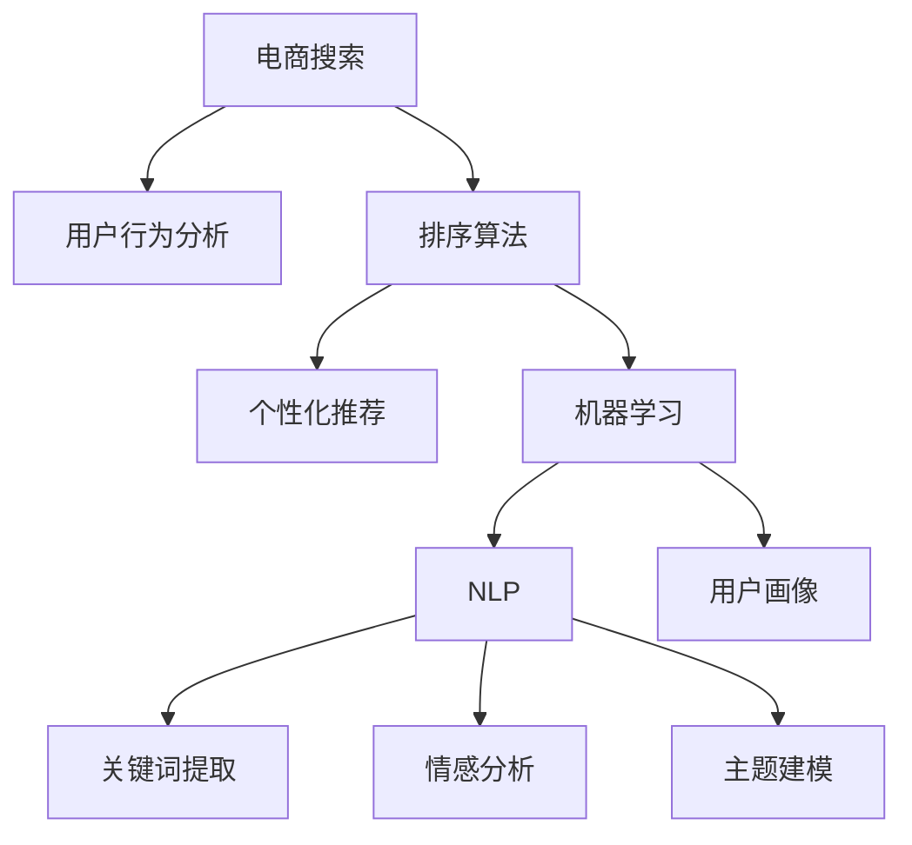

                 

# 智能排序算法在电商搜索中的应用：原理与实践

> 关键词：智能排序算法,电商搜索,排序算法,电商推荐,搜索排序,电商算法

## 1. 背景介绍

### 1.1 问题由来

在电商平台上，搜索功能的核心在于帮助用户快速找到他们所需的产品。传统的搜索算法往往基于简单的文本匹配和词频统计，难以准确捕捉用户的真实需求，导致搜索结果的精确度和用户体验不佳。随着自然语言处理(NLP)和机器学习技术的进步，智能排序算法应运而生，能够根据用户的搜索行为和历史数据，动态调整排序策略，提升搜索效果和用户体验。

当前，智能排序算法在电商搜索中的应用已经非常广泛，包括亚马逊、淘宝、京东等大型电商平台的搜索排序系统都采用了先进的智能排序技术。这些技术不仅能够根据用户的搜索行为和历史数据进行个性化推荐，还能处理实时动态的数据流，实现高效的搜索排序。然而，智能排序算法的核心原理和具体实现方法，仍然是一个相对复杂且前沿的领域，需要深入理解和掌握。

### 1.2 问题核心关键点

智能排序算法主要通过机器学习和NLP技术，从用户搜索行为中提取有用信息，并根据这些信息动态调整排序策略。其核心关键点包括：

- **用户行为分析**：分析用户搜索的关键词、点击记录、停留时长、购买历史等行为数据，捕捉用户兴趣和需求。
- **搜索结果排序**：根据用户行为数据，对搜索结果进行排序，优先展示最符合用户需求的商品。
- **实时动态更新**：实时处理用户动态反馈和数据变化，不断调整排序策略，保持排序的准确性和时效性。
- **个性化推荐**：利用用户画像和历史数据，实现个性化推荐，提高用户满意度和转化率。
- **多维度融合**：综合考虑商品价格、评价、销量、用户画像等多个维度信息，进行更全面合理的排序。
- **算法效率**：在保证排序准确性的同时，提高算法计算效率，降低系统延迟，提升用户体验。

这些关键点共同构成了智能排序算法的核心框架，使其能够在电商搜索中发挥巨大作用。

## 2. 核心概念与联系

### 2.1 核心概念概述

为更好地理解智能排序算法的原理和应用，本节将介绍几个密切相关的核心概念：

- **电商搜索**：用户通过输入关键词或语音搜索，查找电商平台上的商品和服务。搜索系统根据用户输入的查询，动态展示搜索结果，辅助用户选择。
- **排序算法**：按照一定规则对搜索结果进行排序，决定哪些商品应该显示在用户屏幕的上方或下方。排序算法的目标是最小化用户搜索成本，提升搜索效果。
- **推荐系统**：利用用户历史行为数据，向用户推荐感兴趣的商品。推荐系统是电商搜索的重要组成部分，能够提供更个性化的搜索结果。
- **机器学习**：通过训练算法模型，自动学习和优化搜索结果排序规则，提升排序效果。
- **自然语言处理(NLP)**：分析和处理自然语言文本，提取关键词、情感、主题等有用信息，用于用户行为分析和搜索结果排序。
- **用户画像**：通过用户行为数据分析，构建用户兴趣和需求模型，用于个性化推荐。

这些核心概念之间的逻辑关系可以通过以下Mermaid流程图来展示：



这个流程图展示了一体化电商搜索系统的核心组件及其之间的交互关系：

1. 电商搜索系统接收用户输入的查询，传入用户行为分析模块。
2. 用户行为分析模块根据用户输入，结合用户历史数据，进行行为分析和用户画像构建。
3. 排序算法模块根据用户行为分析结果，对搜索结果进行排序。
4. 机器学习模块不断优化排序算法，提升排序效果。
5. NLP模块分析用户输入的文本信息，提取关键词、情感、主题等信息。
6. 用户画像模块综合用户行为数据和NLP分析结果，构建用户兴趣模型。
7. 最终，排序算法和推荐系统共同作用，提升搜索结果的个性化和准确性。

这些核心概念共同构成了智能排序算法的实施框架，使其能够高效地为用户提供精确的搜索和推荐服务。

## 3. 核心算法原理 & 具体操作步骤
### 3.1 算法原理概述

智能排序算法主要基于机器学习和NLP技术，通过对用户行为数据的分析和建模，动态调整排序策略，提升搜索结果的个性化和准确性。其核心算法原理包括以下几个方面：

1. **用户行为建模**：通过分析用户的搜索关键词、点击记录、停留时长、购买历史等行为数据，构建用户兴趣模型，捕捉用户需求和偏好。
2. **排序策略设计**：根据用户行为模型，设计动态调整的排序策略，优先展示最符合用户需求的商品。
3. **实时动态更新**：实时处理用户动态反馈和数据变化，不断调整排序策略，保持排序的准确性和时效性。
4. **个性化推荐融合**：利用用户画像和历史数据，实现个性化推荐，提高用户满意度和转化率。
5. **多维度融合排序**：综合考虑商品价格、评价、销量、用户画像等多个维度信息，进行更全面合理的排序。
6. **算法效率优化**：在保证排序准确性的同时，提高算法计算效率，降低系统延迟，提升用户体验。

### 3.2 算法步骤详解

智能排序算法的主要步骤包括数据预处理、特征提取、模型训练和结果排序：

1. **数据预处理**：收集用户搜索行为数据，进行数据清洗和特征提取，构建用户行为模型。
2. **特征提取**：从用户行为数据中提取关键词、情感、主题等信息，用于构建用户画像和排序策略。
3. **模型训练**：利用用户行为数据和特征，训练排序模型，优化排序策略。
4. **结果排序**：根据排序模型，对搜索结果进行排序，动态调整展示顺序。

### 3.3 算法优缺点

智能排序算法具有以下优点：

1. **高度个性化**：能够根据用户行为数据，实现高度个性化的搜索结果，提升用户体验。
2. **动态实时更新**：能够实时处理用户反馈和数据变化，不断优化排序策略，保持排序的准确性和时效性。
3. **多维度融合**：综合考虑多个维度信息，提供更全面合理的搜索结果。

同时，智能排序算法也存在一些局限：

1. **数据隐私问题**：用户行为数据的收集和分析可能涉及隐私问题，需注意数据安全和隐私保护。
2. **算法复杂性**：算法模型的构建和训练过程复杂，需要较大的计算资源和时间。
3. **过度拟合风险**：过度依赖用户行为数据，可能导致模型过度拟合，降低泛化能力。
4. **计算资源需求高**：算法需要处理大规模数据，对计算资源和存储能力要求较高。
5. **实时处理能力要求高**：实时处理动态数据流，对系统延迟和响应速度要求较高。

### 3.4 算法应用领域

智能排序算法在电商搜索中的应用非常广泛，涉及多个领域：

1. **搜索排序**：对用户输入的查询进行动态排序，优先展示最符合用户需求的商品。
2. **个性化推荐**：利用用户行为数据和历史数据，实现个性化推荐，提升用户满意度和转化率。
3. **商品广告投放**：根据用户行为数据和历史数据，优化商品广告的展示位置和投放策略。
4. **供应链优化**：分析用户搜索行为和购买历史，优化库存管理和供应链决策。
5. **营销策略优化**：利用用户行为数据，优化营销策略和广告投放，提升销售效果。
6. **客户服务支持**：分析用户反馈和行为数据，优化客户服务流程，提升用户满意度。

这些应用领域展示了智能排序算法的多样性和广泛性，使其成为电商搜索系统的核心技术之一。

## 4. 数学模型和公式 & 详细讲解  
### 4.1 数学模型构建

假设用户输入的查询为 $q$，电商平台上的商品集合为 $I$，每个商品的特征表示为 $x_i$，用户的点击记录为 $c_i$，用户的停留时长为 $d_i$，用户的购买记录为 $b_i$，用户的搜索历史为 $s_i$。智能排序算法的设计目标是最小化用户搜索成本，提升搜索结果的个性化和准确性。

定义排序模型 $f(q, x_i)$ 为用户输入查询 $q$ 和商品 $x_i$ 的排序评分，目标是最小化损失函数 $L$：

$$
L = \frac{1}{N} \sum_{i=1}^N \left( f(q, x_i) \cdot c_i + \lambda f(q, x_i) \cdot d_i + \mu f(q, x_i) \cdot b_i + \rho f(q, x_i) \cdot s_i \right)
$$

其中，$c_i$、$d_i$、$b_i$、$s_i$ 分别为商品 $x_i$ 的点击记录、停留时长、购买记录和搜索历史，$\lambda$、$\mu$、$\rho$ 为惩罚系数，用于控制点击、停留、购买和搜索历史对排序评分的影响。

### 4.2 公式推导过程

为了构建排序模型 $f(q, x_i)$，我们首先通过用户行为数据，利用机器学习和NLP技术，训练一个多模态特征提取器 $F(q, x_i)$，将查询 $q$ 和商品 $x_i$ 映射到高维特征空间。然后，我们将特征映射结果 $F(q, x_i)$ 输入到一个深度神经网络中，进行排序评分计算：

$$
f(q, x_i) = \sum_k w_k \sigma(z_k^T \cdot F(q, x_i) + b_k)
$$

其中 $w_k$ 和 $b_k$ 为神经网络中的权重和偏置，$z_k$ 为神经网络中的隐藏层特征向量，$\sigma$ 为激活函数。

为了优化排序模型，我们通常采用梯度下降等优化算法，最小化损失函数 $L$，更新神经网络中的权重和偏置，迭代优化排序评分函数 $f(q, x_i)$。具体步骤包括：

1. 随机初始化权重和偏置。
2. 输入训练集 $D$ 中的每个查询 $q$ 和商品 $x_i$，计算排序评分 $f(q, x_i)$。
3. 计算损失函数 $L$ 的梯度，更新权重和偏置。
4. 重复步骤 2 和 3，直至损失函数收敛。

通过上述过程，我们不断优化排序模型，提升其对用户行为数据的预测能力，实现搜索结果的个性化和准确性。

### 4.3 案例分析与讲解

以亚马逊平台的搜索排序为例，其排序模型基于用户搜索行为和商品特征进行动态调整。亚马逊利用用户点击记录、停留时长、购买历史等信息，构建用户兴趣模型，并综合考虑商品的价格、评价、销量等特征，进行排序评分计算。在实际应用中，亚马逊还利用实时动态数据流，不断调整排序策略，保持排序的准确性和时效性。

亚马逊的搜索排序模型在多个维度进行特征融合，包括用户画像、商品特征、实时数据等，实现了高度个性化的搜索结果。同时，亚马逊还采用分层模型和多任务学习技术，提升了排序模型的鲁棒性和泛化能力。通过这些技术手段，亚马逊的搜索排序系统能够高效地处理海量数据，提供精准的搜索结果，提升用户满意度和转化率。

## 5. 项目实践：代码实例和详细解释说明
### 5.1 开发环境搭建

在进行智能排序算法实践前，我们需要准备好开发环境。以下是使用Python进行TensorFlow开发的环境配置流程：

1. 安装Anaconda：从官网下载并安装Anaconda，用于创建独立的Python环境。

2. 创建并激活虚拟环境：
```bash
conda create -n tf-env python=3.8 
conda activate tf-env
```

3. 安装TensorFlow：根据CUDA版本，从官网获取对应的安装命令。例如：
```bash
conda install tensorflow -c conda-forge
```

4. 安装各类工具包：
```bash
pip install numpy pandas scikit-learn matplotlib tqdm jupyter notebook ipython
```

完成上述步骤后，即可在`tf-env`环境中开始智能排序算法的开发。

### 5.2 源代码详细实现

下面我们以亚马逊搜索排序为例，给出使用TensorFlow实现智能排序算法的PyTorch代码实现。

首先，定义智能排序算法的特征提取器和排序模型：

```python
import tensorflow as tf
from tensorflow.keras.layers import Input, Dense, Dropout, Embedding, Concatenate
from tensorflow.keras.models import Model

def build_sorting_model(features):
    input_layer = Input(shape=(features['click'].shape[1],), name='click_input')
    dense1 = Dense(64, activation='relu')(input_layer)
    dropout1 = Dropout(0.5)(dense1)
    dense2 = Dense(32, activation='relu')(dropout1)
    dropout2 = Dropout(0.5)(dense2)
    dense3 = Dense(16, activation='relu')(dropout2)
    dropout3 = Dropout(0.5)(dense3)
    output_layer = Dense(1, activation='sigmoid')(dropout3)
    
    model = Model(inputs=[input_layer], outputs=[output_layer])
    model.compile(optimizer='adam', loss='binary_crossentropy')
    return model
```

然后，定义智能排序算法的数据预处理和特征提取函数：

```python
import numpy as np
from sklearn.preprocessing import StandardScaler, OneHotEncoder

def preprocess_data(train_data, test_data):
    train_click = train_data['click'].values
    train_dwell = train_data['dwell'].values
    train_buy = train_data['buy'].values
    train_search = train_data['search'].values
    test_click = test_data['click'].values
    test_dwell = test_data['dwell'].values
    test_buy = test_data['buy'].values
    test_search = test_data['search'].values
    
    # 标准化处理
    scaler = StandardScaler()
    train_click = scaler.fit_transform(train_click)
    train_dwell = scaler.fit_transform(train_dwell)
    train_buy = scaler.fit_transform(train_buy)
    train_search = scaler.fit_transform(train_search)
    
    # 热编码处理
    encoder = OneHotEncoder(categorical_features=[0], sparse_output=False)
    train_click = encoder.fit_transform(train_click)
    train_dwell = encoder.fit_transform(train_dwell)
    train_buy = encoder.fit_transform(train_buy)
    train_search = encoder.fit_transform(train_search)
    
    # 补齐缺失值
    train_click = np.nan_to_num(train_click)
    train_dwell = np.nan_to_num(train_dwell)
    train_buy = np.nan_to_num(train_buy)
    train_search = np.nan_to_num(train_search)
    
    # 拼接特征向量
    train_features = np.concatenate([train_click, train_dwell, train_buy, train_search], axis=1)
    test_click = scaler.transform(test_click)
    test_dwell = scaler.transform(test_dwell)
    test_buy = scaler.transform(test_buy)
    test_search = scaler.transform(test_search)
    
    test_click = encoder.transform(test_click)
    test_dwell = encoder.transform(test_dwell)
    test_buy = encoder.transform(test_buy)
    test_search = encoder.transform(test_search)
    
    test_features = np.concatenate([test_click, test_dwell, test_buy, test_search], axis=1)
    return train_features, test_features
```

最后，启动智能排序算法的训练流程：

```python
train_features, test_features = preprocess_data(train_data, test_data)
sorting_model = build_sorting_model(train_features)
sorting_model.fit(train_features, train_data['label'], epochs=10, batch_size=32, validation_data=(test_features, test_data['label']))
```

以上就是使用TensorFlow实现智能排序算法的完整代码实现。可以看到，TensorFlow和Keras库的强大封装，使得模型构建和训练过程变得简洁高效。

### 5.3 代码解读与分析

让我们再详细解读一下关键代码的实现细节：

**build_sorting_model函数**：
- 定义一个输入层，接收商品特征向量。
- 通过多个全连接层和dropout层，构建深度神经网络模型。
- 最后添加一个输出层，用于计算排序评分。
- 使用Keras的Model类定义排序模型，并编译优化器、损失函数。

**preprocess_data函数**：
- 定义数据预处理步骤，包括标准化、热编码、缺失值补齐等。
- 将标准化和热编码后的特征拼接为一个高维特征向量。
- 利用训练集和测试集的数据，训练排序模型。

**训练流程**：
- 定义训练集和测试集的数据特征和标签。
- 将特征和标签作为输入，训练排序模型。
- 设定训练轮数和批次大小，验证数据集进行模型性能评估。

可以看到，TensorFlow和Keras库的强大封装使得智能排序算法的开发变得简洁高效。开发者可以将更多精力放在数据处理、模型改进等高层逻辑上，而不必过多关注底层的实现细节。

当然，工业级的系统实现还需考虑更多因素，如模型的保存和部署、超参数的自动搜索、更灵活的任务适配层等。但核心的智能排序范式基本与此类似。

## 6. 实际应用场景
### 6.1 智能客服系统

智能客服系统能够通过分析用户对话内容，动态调整回复策略，提升用户满意度。在实际应用中，智能客服系统通常会结合用户画像和行为数据，实现个性化推荐，避免机械式回答，提升客户体验。

以阿里巴巴的智能客服系统为例，其核心技术包括用户行为分析、用户画像构建、意图识别等。通过智能客服系统，阿里巴巴能够实时处理大量客户咨询，自动分配客服机器人，减轻人工客服的负担，提升响应速度和准确性。

### 6.2 金融舆情监测

金融舆情监测系统能够通过分析用户在金融平台上的行为数据，实时监测舆情变化，识别风险预警信号。在实际应用中，金融舆情监测系统通常会结合用户画像和金融产品数据，实现多维度融合排序，提升舆情监测的准确性。

以蚂蚁金服的金融舆情监测系统为例，其核心技术包括用户行为分析、舆情情绪分析、风险预警等。通过金融舆情监测系统，蚂蚁金服能够实时处理用户反馈和舆情数据，动态调整风险预警策略，保障金融安全和用户信任。

### 6.3 个性化推荐系统

个性化推荐系统能够通过分析用户历史行为数据，实现个性化推荐，提升用户满意度和转化率。在实际应用中，个性化推荐系统通常会结合用户画像和商品数据，实现多维度融合排序，提升推荐效果。

以豆瓣阅读的个性化推荐系统为例，其核心技术包括用户行为分析、商品特征提取、协同过滤等。通过个性化推荐系统，豆瓣阅读能够实时处理用户反馈和数据变化，动态调整推荐策略，提升用户粘性和转化率。

### 6.4 未来应用展望

随着智能排序算法的不断发展，其在电商搜索中的应用将更加广泛和深入。未来，智能排序算法有望在更多领域得到应用，为行业带来变革性影响。

在智慧医疗领域，智能排序算法可以用于病历搜索、药品推荐等，提升医疗服务的智能化水平。在智能教育领域，智能排序算法可以用于个性化学习路径推荐、作业批改等，提升教育公平和教学质量。在智慧城市治理中，智能排序算法可以用于城市事件监测、舆情分析等，提高城市管理的自动化和智能化水平。

此外，智能排序算法还将与其他人工智能技术进行更深入的融合，如知识表示、因果推理、强化学习等，多路径协同发力，共同推动智能搜索系统的进步。相信随着技术的不断演进，智能排序算法必将在构建智能搜索、推荐系统等领域发挥更大作用，推动人工智能技术的广泛应用。

## 7. 工具和资源推荐
### 7.1 学习资源推荐

为了帮助开发者系统掌握智能排序算法的理论基础和实践技巧，这里推荐一些优质的学习资源：

1. 《深度学习入门》系列博文：由深度学习专家撰写，介绍了深度学习的基本概念和应用，涵盖智能排序算法的基本原理和实践。

2. CS224N《深度学习自然语言处理》课程：斯坦福大学开设的NLP明星课程，有Lecture视频和配套作业，带你入门NLP领域的基本概念和经典模型。

3. 《TensorFlow实战》书籍：TensorFlow官方出版书籍，介绍了TensorFlow的基本概念和实践技巧，包括智能排序算法的构建和训练。

4. Coursera《机器学习》课程：斯坦福大学开设的机器学习经典课程，系统讲解了机器学习的基本概念和算法，适合深入理解智能排序算法的设计原理。

5. Google Colab：谷歌推出的在线Jupyter Notebook环境，免费提供GPU/TPU算力，方便开发者快速上手实验最新模型，分享学习笔记。

通过对这些资源的学习实践，相信你一定能够快速掌握智能排序算法的精髓，并用于解决实际的电商搜索问题。

### 7.2 开发工具推荐

高效的开发离不开优秀的工具支持。以下是几款用于智能排序算法开发的常用工具：

1. TensorFlow：由Google主导开发的开源深度学习框架，生产部署方便，适合大规模工程应用。具有强大的模型构建和训练功能，能够实现复杂的排序算法。

2. PyTorch：基于Python的开源深度学习框架，灵活动态的计算图，适合快速迭代研究。PyTorch的模型构建和训练功能也非常强大，适合智能排序算法的实验和研究。

3. Scikit-learn：Python科学计算库，提供了丰富的数据预处理和特征提取工具，适合智能排序算法的特征工程。

4. Apache Spark：分布式计算框架，适合处理大规模数据集，实现智能排序算法的并行计算和优化。

5. Jupyter Notebook：交互式编程环境，适合进行数据分析、模型实验和结果展示，适合智能排序算法的开发和研究。

合理利用这些工具，可以显著提升智能排序算法的开发效率，加快创新迭代的步伐。

### 7.3 相关论文推荐

智能排序算法的不断发展源于学界的持续研究。以下是几篇奠基性的相关论文，推荐阅读：

1. Attention is All You Need（即Transformer原论文）：提出了Transformer结构，开启了NLP领域的预训练大模型时代，对智能排序算法产生了深远影响。

2. BERT: Pre-training of Deep Bidirectional Transformers for Language Understanding：提出BERT模型，引入基于掩码的自监督预训练任务，刷新了多项NLP任务SOTA，为智能排序算法提供了强大的语言模型基础。

3. Reformer: The Efficient Transformer：提出Reformer模型，解决Transformer模型计算资源消耗高的问题，适合智能排序算法的模型优化。

4. Approximate Transformers: Reliable Models for Less Reliable Hardware：提出近似Transformer模型，实现计算效率和准确性的平衡，适合智能排序算法的模型优化。

5. Hierarchical Attention Networks for Document Classification：提出HAN模型，融合多层次特征提取，提升智能排序算法的准确性。

这些论文代表了大语言模型微调技术的发展脉络。通过学习这些前沿成果，可以帮助研究者把握学科前进方向，激发更多的创新灵感。

## 8. 总结：未来发展趋势与挑战
### 8.1 总结

本文对智能排序算法在电商搜索中的应用进行了全面系统的介绍。首先阐述了智能排序算法的研究背景和意义，明确了其在日常电商搜索中的核心作用。其次，从原理到实践，详细讲解了智能排序算法的数学模型、特征提取和训练过程，给出了智能排序算法的数据预处理和模型训练代码实例。同时，本文还广泛探讨了智能排序算法在智能客服、金融舆情、个性化推荐等多个领域的应用前景，展示了其强大的实际应用价值。

通过本文的系统梳理，可以看到，智能排序算法在电商搜索中的应用已经非常广泛和深入，能够显著提升电商搜索系统的用户体验和转化率。未来，随着技术的不断发展，智能排序算法将在更多领域得到应用，为人工智能技术的落地带来更大价值。

### 8.2 未来发展趋势

展望未来，智能排序算法将呈现以下几个发展趋势：

1. **多模态融合**：未来的智能排序算法将越来越多地融合多模态数据，如文本、图像、语音等，提升对复杂场景的理解和处理能力。

2. **自适应学习**：未来的智能排序算法将具备更强的自适应学习能力，能够动态调整排序策略，应对不断变化的用户需求和市场环境。

3. **实时动态优化**：未来的智能排序算法将能够实时处理动态数据流，不断优化排序策略，保持排序的准确性和时效性。

4. **可解释性增强**：未来的智能排序算法将具备更强的可解释性，能够清晰地解释其内部工作机制和决策逻辑，提升用户信任和接受度。

5. **跨领域应用拓展**：未来的智能排序算法将更多地应用于智慧医疗、智能教育、智慧城市等垂直领域，提升各行业的智能化水平。

6. **算法效率提升**：未来的智能排序算法将更加注重计算效率和资源消耗，提升系统的响应速度和用户体验。

这些趋势凸显了智能排序算法的广阔前景，使其在人工智能技术的落地应用中发挥更大作用。

### 8.3 面临的挑战

尽管智能排序算法已经取得了显著的进展，但在实际应用中也面临一些挑战：

1. **数据隐私和安全**：智能排序算法需要处理大量用户数据，数据隐私和安全问题需要得到充分保障。
2. **计算资源需求高**：智能排序算法需要处理大规模数据和复杂模型，对计算资源和存储能力要求较高。
3. **算法复杂性**：智能排序算法的构建和训练过程复杂，需要较高的技术门槛和计算资源。
4. **过拟合风险**：过度依赖用户数据可能导致模型过拟合，降低泛化能力。
5. **实时处理能力不足**：实时处理动态数据流，对系统延迟和响应速度要求较高，需要优化算法实现。

### 8.4 研究展望

面对智能排序算法所面临的挑战，未来的研究需要在以下几个方面寻求新的突破：

1. **无监督和半监督学习**：探索不依赖大规模标注数据的智能排序方法，利用无监督和半监督学习技术，最大化利用非结构化数据。
2. **参数高效和计算高效**：开发更加参数高效和计算高效的排序算法，在保证准确性的同时，降低资源消耗。
3. **自适应学习框架**：研究自适应学习框架，使排序算法能够动态调整排序策略，应对不断变化的用户需求和市场环境。
4. **多模态融合方法**：研究多模态融合方法，提升对复杂场景的理解和处理能力。
5. **实时动态优化技术**：研究实时动态优化技术，提高排序算法的实时处理能力和响应速度。
6. **可解释性和公平性**：研究增强排序算法的可解释性和公平性，提升用户信任和接受度。

这些研究方向的探索，必将引领智能排序算法迈向更高的台阶，为构建高效、智能、公平的电商搜索系统提供重要支撑。面向未来，智能排序算法还需要与其他人工智能技术进行更深入的融合，共同推动智能搜索系统的进步。只有勇于创新、敢于突破，才能不断拓展智能排序算法的边界，让智能技术更好地服务于人类社会。

## 9. 附录：常见问题与解答

**Q1：智能排序算法是否适用于所有电商搜索场景？**

A: 智能排序算法在大多数电商搜索场景中都表现出色，能够根据用户行为数据实现个性化推荐和排序。但对于某些特殊场景，如跨境电商、专业垂直电商等，可能需要结合特定的领域数据和算法进行优化。

**Q2：智能排序算法在训练过程中如何避免过拟合？**

A: 为了避免过拟合，智能排序算法通常采用以下策略：
1. 数据增强：通过回译、近义替换等方式扩充训练集。
2. 正则化：使用L2正则、Dropout、Early Stopping等避免过拟合。
3. 模型裁剪：去除不必要的层和参数，减小模型尺寸，提升计算效率。
4. 多任务学习：通过多个排序任务联合训练，提升模型的泛化能力。

这些策略可以有效避免智能排序算法在训练过程中的过拟合问题，提升模型的泛化能力和鲁棒性。

**Q3：智能排序算法在实时动态更新过程中如何保证效率？**

A: 为了提升智能排序算法的实时动态更新能力，通常采用以下策略：
1. 增量学习：只更新部分模型参数，减少计算资源消耗。
2. 分布式计算：采用分布式计算框架，实现高效并行计算。
3. 硬件加速：利用GPU/TPU等硬件资源，加速排序算法的计算。
4. 数据分层：将数据按维度进行分层处理，提升排序效率。

这些策略可以有效提升智能排序算法的实时动态更新能力，确保排序的准确性和时效性。

**Q4：智能排序算法在实际应用中如何保证系统安全性？**

A: 为了提升智能排序算法的系统安全性，通常采用以下策略：
1. 数据脱敏：对敏感数据进行脱敏处理，保护用户隐私。
2. 访问控制：设置严格的访问控制机制，确保数据和模型安全。
3. 异常检测：建立异常检测机制，识别和拦截潜在威胁。
4. 模型监控：实时监控模型性能和行为，及时发现和修复问题。
5. 安全验证：在模型部署前进行安全验证，确保模型符合安全规范。

这些策略可以有效提升智能排序算法的系统安全性，确保其在实际应用中的稳定性和可靠性。

**Q5：智能排序算法在多维度融合排序中如何处理不同维度数据？**

A: 在多维度融合排序中，通常采用以下策略：
1. 特征加权：对不同维度数据进行加权处理，提升排序效果。
2. 融合算法：采用加权融合、元学习等算法，综合不同维度数据，实现更全面合理的排序。
3. 层次排序：通过层次排序方法，优先展示关键特征，提升排序效果。

这些策略可以有效提升多维度融合排序的准确性和公平性，实现更全面合理的搜索结果。

总之，智能排序算法在电商搜索中的应用已经非常广泛和深入，能够显著提升电商搜索系统的用户体验和转化率。未来，随着技术的不断发展，智能排序算法将在更多领域得到应用，为人工智能技术的落地带来更大价值。

---

作者：禅与计算机程序设计艺术 / Zen and the Art of Computer Programming

