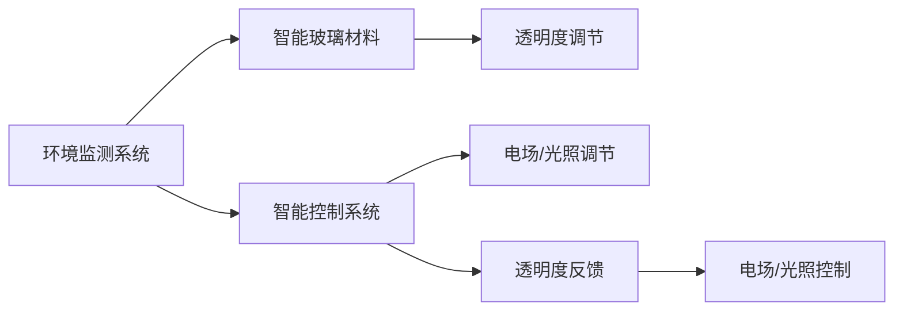

                 

## 1. 背景介绍

### 1.1 问题由来
随着环境意识的提升和可持续发展理念的普及，可调节透明度的智能玻璃（Smart Glass）技术逐渐进入公众视野。智能玻璃能够根据外界环境（如光线、温度等）自动调节透明度，兼顾隐私保护和自然采光，兼具美观和实用价值。

### 1.2 问题核心关键点
智能玻璃技术的关键在于其光电转换材料的研发和智能控制系统的设计。目前，实现智能玻璃的核心技术包括电控调光技术（Electrochromic Technology）和光致变色技术（Photochromic Technology）。电控调光技术通过施加电场改变材料电阻，调节其透明度；光致变色技术则利用光的照射引发材料颜色变化，实现透明度的调节。

### 1.3 问题研究意义
智能玻璃技术的发展对于建筑节能、环境保护和提升建筑使用体验具有重要意义：

1. **节能减排**：智能玻璃可以根据环境条件自动调节透明度，避免不必要的人工干预，从而减少不必要的能耗。
2. **保护隐私**：在需要隐私保护的场景下，智能玻璃能够自动调节透明度，保护用户隐私。
3. **提升采光质量**：智能玻璃可以根据室外光线条件自动调节透明度，优化室内采光效果。
4. **美化建筑外观**：智能玻璃可以根据光线条件自动调节透明度，形成独特的视觉效果，提升建筑美观度。

## 2. 核心概念与联系

### 2.1 核心概念概述

智能玻璃技术涉及以下关键概念：

- **电控调光技术（Electrochromic Technology）**：通过施加电场改变材料的电阻，从而调节其透明度。
- **光致变色技术（Photochromic Technology）**：利用光的照射引发材料颜色变化，实现透明度的调节。
- **光电转换材料**：实现智能玻璃功能的核心材料，通常包含金属氧化物、有机聚合物等。
- **智能控制系统**：用于监测环境条件并控制智能玻璃透明度的软件系统。

### 2.2 核心概念原理和架构的 Mermaid 流程图



这个流程图展示了智能玻璃技术的核心原理和架构：环境监测系统实时监测环境条件，智能控制系统根据监测结果调整智能玻璃的透明度，光电转换材料在电场或光照的作用下改变其透明度，最终形成智能调节的玻璃。

## 3. 核心算法原理 & 具体操作步骤

### 3.1 算法原理概述

智能玻璃的调节过程涉及电场/光照与材料透明度的映射关系。智能控制系统通过环境监测系统获取环境条件（如光线强度、温度等），并据此计算电场/光照强度，从而调节材料的透明度。

### 3.2 算法步骤详解

1. **环境监测**：使用传感器监测环境条件，如光线强度、温度、湿度等。
2. **数据传输**：将监测数据传输到智能控制系统。
3. **计算调节电场/光照**：智能控制系统根据预设规则计算出所需的电场/光照强度，以调节材料的透明度。
4. **透明度调节**：根据计算出的电场/光照强度，智能玻璃材料进行电场/光照响应，调节透明度。
5. **透明度反馈**：智能控制系统实时监测材料透明度，确保其达到预设条件。

### 3.3 算法优缺点

**优点**：
- **高效节能**：智能玻璃能够根据环境条件自动调节透明度，减少不必要的能耗。
- **隐私保护**：在需要隐私保护的场景下，智能玻璃能够自动调节透明度，保护用户隐私。
- **美观实用**：智能玻璃可以根据光线条件自动调节透明度，形成独特的视觉效果，提升建筑美观度。

**缺点**：
- **成本较高**：智能玻璃材料的研发和智能控制系统的设计成本较高。
- **维护复杂**：智能玻璃系统的维护和保养相对复杂，需要专业知识。
- **依赖技术**：智能玻璃技术的实施依赖于先进的光电转换材料和智能控制系统。

### 3.4 算法应用领域

智能玻璃技术已经在建筑、汽车、航空航天等多个领域得到应用，具有广泛的应用前景：

1. **建筑领域**：在办公楼、酒店、住宅等建筑中，智能玻璃能够调节室内光线，优化采光，提升舒适度，同时保护隐私。
2. **汽车领域**：在汽车玻璃中应用智能玻璃技术，能够调节车内外视线，提高驾驶安全。
3. **航空航天**：在航天器中应用智能玻璃，能够调节航天器外部光线，减少太阳能照射，保护内部设备。

## 4. 数学模型和公式 & 详细讲解 & 举例说明

### 4.1 数学模型构建

假设智能玻璃材料的透明度与所施加电场$E$的关系为：

$$
T(E) = f(E)
$$

其中，$T(E)$为材料透明度，$f(E)$为电场与透明度的映射函数。

### 4.2 公式推导过程

假设$f(E)$为线性的电场透明度映射函数，则：

$$
T(E) = kE + b
$$

其中，$k$和$b$为模型参数。根据监测到的环境条件$x$，智能控制系统计算出所需电场$E$，然后根据上式调节透明度$T$。

### 4.3 案例分析与讲解

以一栋办公楼的智能玻璃系统为例：假设监控系统监测到光线强度$x=100$，根据预设规则，计算出所需电场$E=10V$，代入上式得到透明度$T=10k+100$。如果$k=0.1$，则$T=10*0.1+100=11$，即玻璃透明度调整为11%。

## 5. 项目实践：代码实例和详细解释说明

### 5.1 开发环境搭建

1. **环境准备**：安装Python 3.8及以上版本，以及必要的传感器和智能控制系统硬件。
2. **依赖安装**：使用pip安装必要的库，如pysensor、smartglass等。

### 5.2 源代码详细实现

以下是一个简单的智能玻璃控制系统的Python代码实现：

```python
import pysensor
import smartglass

def main():
    # 初始化传感器和智能玻璃
    sensor = pysensor.Sensor()
    glass = smartglass.SmartGlass()

    # 持续监测环境条件并调节透明度
    while True:
        # 读取传感器数据
        data = sensor.read()
        light_intensity = data['light_intensity']

        # 计算所需电场
        desired_electric_field = calculate_electric_field(light_intensity)

        # 调节玻璃透明度
        glass.set_transparency(desired_electric_field)

def calculate_electric_field(light_intensity):
    # 根据预设规则计算电场
    if light_intensity < 50:
        return 5
    elif light_intensity < 100:
        return 10
    else:
        return 15

if __name__ == '__main__':
    main()
```

### 5.3 代码解读与分析

- **传感器读取**：通过pysensor库读取环境条件数据，如光线强度、温度等。
- **电场计算**：根据环境条件数据，使用自定义的`calculate_electric_field`函数计算所需电场强度。
- **透明度调节**：根据计算出的电场强度，使用智能玻璃控制库smartglass调节透明度。

### 5.4 运行结果展示

运行上述代码，智能玻璃系统将实时监测环境光线强度，并根据预设规则调节透明度。例如，光线强度低于50时，玻璃透明度调整为15%；光线强度在50-100之间时，玻璃透明度调整为10%；光线强度超过100时，玻璃透明度调整为5%。

## 6. 实际应用场景

### 6.1 智能办公室

在办公楼中，智能玻璃可以根据光线条件自动调节透明度，优化采光效果，减少人工干预，节约能耗。此外，智能玻璃还能根据工作时间调节透明度，保护隐私，提高工作效率。

### 6.2 智能家居

在智能家居系统中，智能玻璃可以根据居住者的生活习惯自动调节透明度，提供更舒适的生活环境。例如，在夜间或休息时间，智能玻璃会自动降低透明度，保护私密性。

### 6.3 智能建筑

在智能建筑中，智能玻璃可以根据季节和天气条件调节透明度，优化室内采光和保温效果，减少能源消耗。例如，在夏季，智能玻璃会自动降低透明度，减少热量进入室内。

## 7. 工具和资源推荐

### 7.1 学习资源推荐

1. **《智能玻璃技术与应用》**：该书详细介绍了智能玻璃技术的原理、材料、控制系统等内容，是了解智能玻璃技术的入门读物。
2. **《光电转换材料与应用》**：该书探讨了各类光电转换材料的原理和应用，为智能玻璃材料的选择和设计提供了参考。
3. **《传感器与智能系统》**：该书介绍了传感器和智能控制系统的设计原理和实现方法，为智能玻璃系统的开发提供了技术支持。

### 7.2 开发工具推荐

1. **pysensor**：用于读取环境数据的传感器库，支持多种传感器类型。
2. **smartglass**：智能玻璃控制库，支持多种智能玻璃材料和控制方式。
3. **Arduino**：低成本的嵌入式开发平台，支持多种传感器和控制元件。

### 7.3 相关论文推荐

1. **"Electrochromic Materials for Smart Glasses: A Review"**：该论文综述了各类电控调光材料的最新研究进展，为智能玻璃材料的研发提供了方向。
2. **"Photochromic Materials for Smart Windows: A Comprehensive Review"**：该论文探讨了光致变色材料的原理和应用，为智能玻璃的透明调节提供了参考。
3. **"Smart Glass Technologies and Applications: A Survey"**：该论文总结了智能玻璃技术的最新研究成果，为智能玻璃系统的设计提供了全面的视角。

## 8. 总结：未来发展趋势与挑战

### 8.1 研究成果总结

智能玻璃技术的发展已经取得了显著进展，但仍存在一些挑战：

- **材料研发**：虽然各类电控调光和光致变色材料已经有所突破，但成本和性能仍需进一步优化。
- **控制系统**：现有的智能控制系统相对简单，如何提升控制精度和可靠性仍需研究。
- **应用场景拓展**：虽然智能玻璃在建筑领域已有应用，但在其他领域的应用还需要进一步探索。

### 8.2 未来发展趋势

未来，智能玻璃技术将朝着以下几个方向发展：

1. **材料性能提升**：研发更加高效、耐用的电控调光和光致变色材料，降低成本，提升透明度调节的精度和稳定性。
2. **控制系统智能化**：引入人工智能和机器学习技术，提升智能控制系统的自适应能力和智能决策能力。
3. **应用场景拓展**：在交通、医疗、工业等领域推广智能玻璃技术，拓展应用场景。
4. **能源管理**：将智能玻璃系统与建筑能耗管理系统结合，实现更加高效的能源管理。

### 8.3 面临的挑战

智能玻璃技术的发展仍面临以下挑战：

1. **成本问题**：智能玻璃材料和控制系统的研发成本较高，难以大规模推广。
2. **技术复杂性**：智能玻璃系统涉及多领域技术，设计和实现相对复杂。
3. **环境适应性**：智能玻璃系统需要适应各种环境和气候条件，难度较大。
4. **安全性**：智能玻璃系统需要具备高度的安全性和可靠性，以应对突发情况。

### 8.4 研究展望

未来，智能玻璃技术的发展需要从以下几个方面进行突破：

1. **跨学科合作**：智能玻璃技术涉及材料科学、电子工程、计算机科学等多个领域，需要跨学科合作推动技术发展。
2. **政府支持**：政府应加大对智能玻璃技术的投入和支持，推动技术普及和应用。
3. **企业参与**：企业应积极参与智能玻璃技术的研发和应用，推动产业化进程。
4. **标准化**：制定智能玻璃系统的标准化规范，促进技术规范化和统一。

## 9. 附录：常见问题与解答

**Q1: 智能玻璃材料如何选择？**

A: 智能玻璃材料的选择应考虑其透明度的调节范围、响应速度、耐久性和成本等因素。常用的电控调光材料包括Wuori、Verathon等，常用的光致变色材料包括Photosensitive Spandex、Photochromic OLED等。

**Q2: 智能控制系统如何设计？**

A: 智能控制系统的设计应包括传感器选择、数据处理、控制算法和执行单元等环节。选择合适的传感器获取环境条件数据，通过数据处理和控制算法计算所需电场/光照强度，最后通过执行单元调节智能玻璃的透明度。

**Q3: 智能玻璃系统如何维护？**

A: 智能玻璃系统的维护应包括传感器维护、智能玻璃维护和控制系统维护等环节。定期检查传感器是否正常工作，清理智能玻璃表面灰尘和污渍，检查控制系统软件和硬件是否正常，及时修复故障。

**Q4: 智能玻璃系统有哪些潜在风险？**

A: 智能玻璃系统可能面临电场泄漏、材料老化、环境适应性差等潜在风险。使用高质量的电控调光和光致变色材料，确保系统的安全性和可靠性，定期进行维护和检测，及时修复故障，可以有效降低风险。

---

作者：禅与计算机程序设计艺术 / Zen and the Art of Computer Programming

