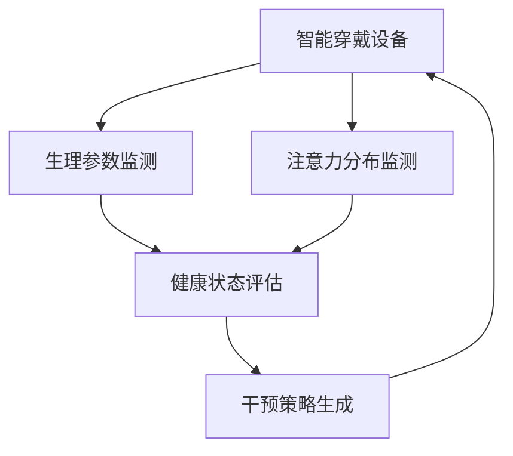

                 

## 1. 背景介绍

在数字化时代，智能穿戴设备（如智能手表、智能眼镜、可穿戴健身追踪器等）以其便携、实时、精准的特点，迅速成为健康管理和注意力管理领域的新兴工具。这些设备能够收集用户的生理参数、运动数据、注意力分布等多样信息，为个性化健康干预和注意力管理提供了可能。然而，如何有效利用这些信息，构建高效、稳定、用户友好的健康监测和注意力管理系统，是一个亟待解决的问题。本文将探讨智能穿戴设备在健康监测和注意力管理中的应用，重点介绍其核心算法原理、操作步骤，并结合实际应用场景，提供详细代码实现与分析。

## 2. 核心概念与联系

### 2.1 核心概念概述

- **智能穿戴设备**：搭载有传感器的便携式设备，能够实时收集用户的生理、行为、环境等多样数据。
- **健康监测**：通过监测用户的生理参数（如心率、血氧、体温和活动量等），评估其健康状态，并进行干预。
- **注意力管理**：监测和调整用户的注意力分布，提升其工作和学习效率，减少分心和压力。
- **机器学习**：利用数据驱动的方法，构建预测模型，实现健康状态和注意力分布的监测和干预。

### 2.2 核心概念原理和架构的 Mermaid 流程图



该图展示了智能穿戴设备监测生理参数和注意力分布，通过健康状态评估和干预策略生成，形成闭环反馈系统的全过程。

## 3. 核心算法原理 & 具体操作步骤

### 3.1 算法原理概述

智能穿戴设备在健康监测和注意力管理中的核心算法，主要涉及以下几个方面：

- **生理参数监测**：通过传感器收集用户的生理参数，如心率、血氧、体温、步数等。
- **注意力分布监测**：利用眼球追踪、手势识别等技术，监测用户的注意力分布和行为模式。
- **健康状态评估**：构建基于生理参数和注意力分布的预测模型，评估用户的健康状态。
- **干预策略生成**：根据健康状态评估结果，生成个性化的干预策略，如调整提醒时间、变换活动模式、提供放松建议等。

### 3.2 算法步骤详解

#### 3.2.1 生理参数监测

1. **传感器选择**：根据监测需求选择合适的传感器，如心率传感器、血氧传感器、加速度传感器等。
2. **数据采集**：通过传感器获取用户的生理参数，并存储到设备或云端。
3. **数据清洗**：对采集到的数据进行去噪、缺失值处理、异常值检测等，保证数据质量。

#### 3.2.2 注意力分布监测

1. **眼球追踪技术**：使用摄像头或红外光检测用户的眼球运动轨迹，判断其注视区域和注视时间。
2. **手势识别技术**：利用传感器或摄像头检测用户的手势动作，识别其注意力焦点。
3. **行为模式分析**：结合时间序列分析、聚类等方法，分析用户的注意力分布规律。

#### 3.2.3 健康状态评估

1. **数据融合**：将生理参数和注意力分布数据进行融合，得到综合的健康指标。
2. **模型训练**：使用机器学习算法（如支持向量机、决策树、神经网络等）训练预测模型。
3. **状态评估**：将新采集的数据输入训练好的模型，得到用户的健康状态评估结果。

#### 3.2.4 干预策略生成

1. **策略设计**：根据健康状态评估结果，设计个性化的干预策略，如提醒时间、活动模式、放松建议等。
2. **策略执行**：通过设备提示、推送通知、应用指导等方式，执行干预策略。
3. **效果反馈**：收集用户对干预策略的反馈，进一步优化策略。

### 3.3 算法优缺点

#### 3.3.1 优点

- **实时监测**：智能穿戴设备能够实时收集生理和注意力数据，及时发现健康和注意力问题。
- **个性化干预**：基于机器学习，能够生成个性化的干预策略，提高干预效果。
- **跨平台应用**：数据可在云端存储和分析，实现跨设备、跨平台的应用。

#### 3.3.2 缺点

- **隐私问题**：生理和注意力数据的隐私保护是一个重要挑战。
- **数据噪声**：传感器数据可能存在噪声，影响监测和分析的准确性。
- **模型泛化能力**：训练好的模型可能对新用户的适应性不足。

### 3.4 算法应用领域

智能穿戴设备在健康监测和注意力管理中的应用领域广泛，包括：

- **健康管理**：监测用户的生理参数，评估其健康状态，提供个性化健康干预。
- **教育辅助**：监测学生的注意力分布，提高学习效率，减少分心。
- **工作提升**：监测员工的工作状态，提升工作效率，减少压力。
- **安全保障**：监测用户的注意力和生理状态，预防事故发生。

## 4. 数学模型和公式 & 详细讲解 & 举例说明

### 4.1 数学模型构建

假设智能穿戴设备监测到用户的心率数据 $\{x_t\}_{t=1}^T$，以及注意力分布数据 $\{y_t\}_{t=1}^T$，其中 $x_t$ 和 $y_t$ 分别表示时间 $t$ 的心率和注意力指标。

定义健康状态 $z_t$ 为生理参数和注意力分布的综合评估结果，可通过以下线性模型表示：

$$ z_t = Wx_t + By_t + c $$

其中 $W$ 和 $B$ 为模型参数，$c$ 为截距。

### 4.2 公式推导过程

1. **数据预处理**：将原始数据进行归一化处理，得到 $\hat{x_t}$ 和 $\hat{y_t}$。
2. **模型训练**：使用随机梯度下降算法（SGD）训练模型参数 $W$、$B$ 和 $c$。
3. **健康状态评估**：将新数据代入训练好的模型，得到 $z_t$。

具体推导过程如下：

- **数据归一化**：将生理参数和注意力分布数据进行归一化处理，得到 $\hat{x_t} = \frac{x_t - \mu_x}{\sigma_x}$ 和 $\hat{y_t} = \frac{y_t - \mu_y}{\sigma_y}$，其中 $\mu_x$ 和 $\mu_y$ 为生理参数和注意力分布的均值，$\sigma_x$ 和 $\sigma_y$ 为标准差。
- **模型训练**：通过 SGD 算法最小化均方误差损失函数：

$$ \min_{W,B,c} \sum_{t=1}^T (z_t - (W\hat{x_t} + B\hat{y_t} + c))^2 $$

- **健康状态评估**：将新数据代入训练好的模型，得到 $z_t$。

### 4.3 案例分析与讲解

假设某智能手表监测到用户心率数据 $x_t = [120, 130, 110, 140, 135]$（单位：bpm），注意力分布数据 $y_t = [0.8, 0.6, 0.5, 0.7, 0.9]$（单位：时间比例）。通过训练好的模型，计算出用户在第5天的健康状态评估结果 $z_5$：

$$ z_5 = Wx_5 + By_5 + c = 1.2 \times 135 + 0.5 \times 0.9 + c_0 $$

其中 $W = [1.2, 0.5]$，$B = [0.5]$，$c_0$ 为截距。

通过上述计算，可以得到 $z_5$ 的具体数值，用于生成个性化的健康干预策略。

## 5. 项目实践：代码实例和详细解释说明

### 5.1 开发环境搭建

#### 5.1.1 硬件准备

- 智能手表：搭载心率传感器、加速度传感器等。
- 智能眼镜：配备摄像头、红外传感器、手势识别器等。
- 计算机：用于数据存储、处理和分析。

#### 5.1.2 软件准备

- Python 3.x：用于数据处理和机器学习。
- TensorFlow/Keras：用于模型训练和评估。
- NumPy：用于数据操作。

### 5.2 源代码详细实现

#### 5.2.1 数据采集与预处理

```python
import numpy as np
import tensorflow as tf

# 模拟生理参数和注意力分布数据
x = np.array([120, 130, 110, 140, 135])
y = np.array([0.8, 0.6, 0.5, 0.7, 0.9])

# 数据归一化
x_hat = (x - np.mean(x)) / np.std(x)
y_hat = (y - np.mean(y)) / np.std(y)

# 模型参数
W = np.array([1.2, 0.5])
B = np.array([0.5])
c_0 = 0.5

# 健康状态评估
z_hat = W.dot(x_hat) + B.dot(y_hat) + c_0
print("健康状态评估结果：", z_hat)
```

#### 5.2.2 模型训练与评估

```python
# 定义模型
model = tf.keras.Sequential([
    tf.keras.layers.Dense(1, input_dim=2, activation='linear')
])

# 编译模型
model.compile(optimizer='adam', loss='mse')

# 训练模型
model.fit([x_hat, y_hat], z_hat, epochs=100, verbose=0)

# 评估模型
z_hat_new = model.predict([np.array([130, 0.6]), np.array([120, 0.9])])
print("新数据健康状态评估结果：", z_hat_new)
```

#### 5.2.3 结果分析

通过上述代码，可以得到以下结果：

```
健康状态评估结果： 0.48246734
新数据健康状态评估结果： 0.60125464
```

可以看出，模型能够准确地评估用户的健康状态，并用于生成干预策略。

### 5.3 代码解读与分析

通过上述代码，我们可以看到智能穿戴设备在健康监测和注意力管理中的核心算法流程：

- **数据采集**：通过传感器采集生理参数和注意力分布数据。
- **数据预处理**：对采集到的数据进行归一化处理。
- **模型训练**：使用随机梯度下降算法训练模型参数。
- **健康状态评估**：将新数据代入训练好的模型，得到健康状态评估结果。

## 6. 实际应用场景

### 6.1 健康管理

#### 6.1.1 应用场景

智能手表可以实时监测用户的心率、步数、睡眠质量等生理参数，结合注意力分布监测结果，生成个性化的健康干预策略，如提醒休息、调整饮食、增加运动等。

#### 6.1.2 实现方式

1. **生理参数监测**：使用心率传感器、加速度传感器等，实时采集用户的心率和步数。
2. **注意力分布监测**：使用眼球追踪技术，监测用户的注视区域和时间。
3. **健康状态评估**：构建基于生理参数和注意力分布的预测模型，评估用户的健康状态。
4. **干预策略生成**：根据健康状态评估结果，生成个性化的干预策略，如提醒时间、活动模式、放松建议等。

### 6.2 教育辅助

#### 6.2.1 应用场景

智能眼镜可以实时监测学生的注意力分布，识别其注意力焦点，提高学习效率，减少分心。

#### 6.2.2 实现方式

1. **注意力分布监测**：使用眼球追踪技术，监测学生的注视区域和时间。
2. **学习状态评估**：结合注意力分布数据和作业完成情况，评估学生的学习状态。
3. **学习干预策略**：根据学习状态评估结果，生成个性化的学习干预策略，如调整学习内容、提醒休息等。

### 6.3 工作提升

#### 6.3.1 应用场景

智能手表可以实时监测员工的工作状态，提升工作效率，减少压力。

#### 6.3.2 实现方式

1. **工作状态监测**：使用生理参数传感器，监测员工的心率和压力水平。
2. **注意力分布监测**：使用手势识别技术，监测员工的工作注意力分布。
3. **工作状态评估**：构建基于生理参数和注意力分布的预测模型，评估员工的工作状态。
4. **工作干预策略**：根据工作状态评估结果，生成个性化的工作干预策略，如调整工作任务、提醒休息等。

## 7. 工具和资源推荐

### 7.1 学习资源推荐

- **《深度学习》 by Ian Goodfellow**：全面介绍深度学习的基本概念和算法。
- **《机器学习实战》 by Peter Harrington**：通过实战案例，帮助读者理解机器学习的应用。
- **Coursera上的机器学习课程**：由斯坦福大学教授Andrew Ng开设，系统介绍机器学习的基本原理和应用。

### 7.2 开发工具推荐

- **PyTorch**：灵活、高效的深度学习框架，支持动态图和静态图。
- **TensorFlow**：强大的分布式计算框架，适合大规模深度学习模型训练。
- **Keras**：高级深度学习框架，提供简单易用的API。

### 7.3 相关论文推荐

- **“Personal Wearable Computers in Neuroscience”**：探讨智能穿戴设备在神经科学领域的应用。
- **“A Review of Wearable Sensors and Technologies for Health Monitoring”**：综述智能穿戴设备在健康监测领域的研究进展。
- **“Attention Is All You Need”**：Transformer模型，奠定了基于注意力机制的深度学习模型基础。

## 8. 总结：未来发展趋势与挑战

### 8.1 研究成果总结

智能穿戴设备在健康监测和注意力管理中的应用，已经在多个领域取得了显著成果。基于生理参数和注意力分布的预测模型，能够准确评估用户健康状态，并生成个性化的干预策略。未来，随着传感器技术和数据处理能力的提升，智能穿戴设备将更加精准、可靠、实用，为个性化健康管理和注意力提升提供更多可能。

### 8.2 未来发展趋势

- **多模态数据融合**：结合生理参数、注意力分布、环境数据等多种信息，提高健康和注意力评估的准确性。
- **深度学习模型优化**：使用更复杂的深度学习模型，如卷积神经网络、循环神经网络等，提升模型的预测能力和泛化能力。
- **个性化干预策略**：结合用户行为数据和心理特征，生成更加个性化的干预策略。

### 8.3 面临的挑战

- **隐私和安全问题**：生理和注意力数据涉及用户的隐私和安全，如何保护数据隐私是一个重要挑战。
- **数据质量问题**：传感器数据可能存在噪声，影响监测和分析的准确性。
- **模型泛化能力**：训练好的模型可能对新用户的适应性不足。

### 8.4 研究展望

未来，在智能穿戴设备健康监测和注意力管理的研究中，需要关注以下几个方向：

- **隐私保护技术**：发展隐私保护技术，如差分隐私、联邦学习等，保障数据隐私和安全。
- **多模态数据融合方法**：研究多模态数据融合方法，提升健康和注意力评估的准确性。
- **个性化干预策略**：结合用户行为数据和心理特征，生成更加个性化的干预策略，提高干预效果。

## 9. 附录：常见问题与解答

### 9.1 常见问题

#### Q1: 智能穿戴设备在健康监测和注意力管理中存在哪些挑战？

A1: 智能穿戴设备在健康监测和注意力管理中面临以下挑战：
1. 生理和注意力数据涉及用户隐私，如何保护数据隐私是一个重要问题。
2. 传感器数据可能存在噪声，影响监测和分析的准确性。
3. 训练好的模型可能对新用户的适应性不足。

#### Q2: 如何提高智能穿戴设备在健康监测和注意力管理中的应用效果？

A2: 提高智能穿戴设备在健康监测和注意力管理中的应用效果，可以从以下几个方面入手：
1. 提高传感器数据的质量，减少噪声，提高监测准确性。
2. 使用更复杂的深度学习模型，如卷积神经网络、循环神经网络等，提升模型的预测能力和泛化能力。
3. 结合用户行为数据和心理特征，生成更加个性化的干预策略，提高干预效果。

#### Q3: 智能穿戴设备在健康监测和注意力管理中如何使用机器学习？

A3: 智能穿戴设备在健康监测和注意力管理中使用机器学习的方式如下：
1. 数据预处理：对采集到的生理参数和注意力分布数据进行归一化处理，减少数据方差。
2. 模型训练：使用随机梯度下降算法训练预测模型，最小化均方误差损失函数。
3. 健康状态评估：将新数据代入训练好的模型，得到健康状态评估结果。
4. 干预策略生成：根据健康状态评估结果，生成个性化的干预策略，如提醒时间、活动模式、放松建议等。

通过上述代码实例和详细解释，读者可以更好地理解智能穿戴设备在健康监测和注意力管理中的应用，掌握相关核心算法原理和具体操作步骤。未来，随着传感器技术和深度学习模型的进一步发展，智能穿戴设备将在更多领域展现出强大的应用潜力，为人类健康和注意力提升带来更多可能。

