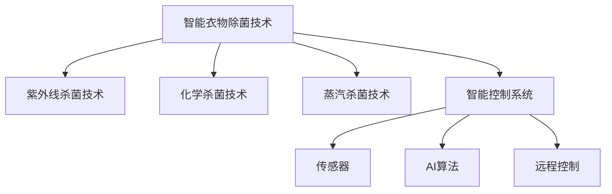

                 

# 智能衣物除菌创业：健康生活的科技支持

## 1. 背景介绍

### 1.1 问题由来
随着生活水平的提高，人们对个人卫生和健康越来越重视，特别是在新冠疫情的影响下，公共卫生意识的提升尤为显著。而衣物是人们日常生活必不可少的一部分，保持衣物的清洁和健康直接关系到人们的健康状态。因此，如何高效、便捷地对衣物进行除菌处理，成为当下人们关注的焦点。

### 1.2 问题核心关键点
智能衣物除菌技术主要依赖于先进的杀菌技术和智能控制系统。其中，杀菌技术包括紫外线杀菌、化学杀菌、蒸汽杀菌等，而智能控制系统则通过传感器、AI算法、远程控制等手段，实现对杀菌设备的精准控制。智能衣物除菌技术可以实时监控衣物状态，根据衣物材质、污染程度等因素自动调整杀菌参数，确保杀菌效果的同时，减少对衣物的损害。

## 2. 核心概念与联系

### 2.1 核心概念概述

为更好地理解智能衣物除菌技术，本节将介绍几个密切相关的核心概念：

- **智能衣物除菌技术**：指通过先进杀菌技术和智能控制系统，实现对衣物的高效除菌处理。该技术能够实时监测衣物状态，自动调整杀菌参数，确保杀菌效果的同时，减少对衣物的损害。
- **紫外线杀菌技术**：利用紫外线照射，破坏微生物DNA结构，实现杀菌效果。紫外线杀菌具有高效、无残留、环保等优点，广泛应用于智能衣物除菌设备中。
- **化学杀菌技术**：通过化学药剂对微生物进行灭杀，适用于不同材质和污染程度的衣物。化学杀菌技术主要分为氧化性杀菌和还原性杀菌，前者如臭氧杀菌，后者如氯杀菌。
- **蒸汽杀菌技术**：通过高温蒸汽对衣物进行杀菌处理，适用于衣物材质较厚、污染程度较重的场景。蒸汽杀菌技术高效且环保，但需要较大的设备功率和空间。
- **智能控制系统**：包括传感器、AI算法、远程控制等技术，通过智能化的方式控制杀菌设备的运行，实现精确、高效的杀菌处理。

这些核心概念之间的逻辑关系可以通过以下Mermaid流程图来展示：



这个流程图展示了大语言模型的核心概念及其之间的关系：

1. 智能衣物除菌技术是整体概念，通过紫外线杀菌、化学杀菌、蒸汽杀菌等具体技术实现。
2. 智能控制系统是智能衣物除菌技术的重要组成部分，包括传感器、AI算法、远程控制等。

## 3. 核心算法原理 & 具体操作步骤
### 3.1 算法原理概述

智能衣物除菌技术的核心算法包括紫外线杀菌算法、化学杀菌算法、蒸汽杀菌算法和智能控制系统算法。其核心思想是通过传感器获取衣物的污染程度、材质等参数，并利用AI算法对杀菌参数进行智能调整，从而实现高效、精确的杀菌效果。

### 3.2 算法步骤详解

1. **传感器数据采集**：衣物除菌设备上的传感器采集衣物的温度、湿度、颜色、材质等参数，用于判断衣物的污染程度和材质类型。

2. **AI算法分析**：利用AI算法（如神经网络、决策树等）对传感器采集的数据进行分析，计算出最合适的杀菌参数（如紫外线强度、化学药剂浓度、蒸汽温度等）。

3. **杀菌设备执行**：根据AI算法计算出的杀菌参数，智能控制系统控制杀菌设备执行相应的杀菌操作。

4. **效果反馈与调整**：通过传感器实时监控杀菌效果，如杀菌后细菌数量的变化、衣物的损伤程度等，根据反馈数据动态调整杀菌参数，确保最佳杀菌效果。

### 3.3 算法优缺点

智能衣物除菌技术的优点包括：

- **高效杀菌**：通过AI算法优化杀菌参数，实现高效、精确的杀菌效果。
- **智能控制**：智能控制系统可根据衣物状态自动调整杀菌参数，减少人工干预。
- **环保节能**：紫外线杀菌等技术具有无残留、环保等优点，减少化学药剂和能源消耗。

但该技术也存在一些缺点：

- **成本较高**：智能衣物除菌设备通常价格较高，且需要定期更换杀菌剂或滤网。
- **依赖技术**：智能控制系统依赖传感器和AI算法，设备故障或算法出错可能影响杀菌效果。
- **安全问题**：高强度紫外线和化学药剂可能对衣物造成损伤，且存在安全隐患。

### 3.4 算法应用领域

智能衣物除菌技术广泛应用于家庭、医院、酒店、餐饮等多个领域，具有广泛的应用前景。

1. **家庭**：家庭衣物除菌设备能够保证家庭成员的健康，尤其在疫情期间，除菌设备的需求大幅增加。
2. **医院**：医院衣物除菌设备可以有效防止交叉感染，保障患者和医护人员的安全。
3. **酒店**：酒店衣物除菌设备能提升客户体验，增强酒店卫生水平。
4. **餐饮**：餐饮行业的衣物除菌设备能保证食品卫生，保障食品安全。

## 4. 数学模型和公式 & 详细讲解  
### 4.1 数学模型构建

假设智能衣物除菌设备需要根据衣物的材质和污染程度调整杀菌参数，其中材质为$c$，污染程度为$p$，杀菌参数为$k$。则杀菌参数的优化模型为：

$$
k^* = \mathop{\arg\min}_{k} \mathcal{L}(k; c, p)
$$

其中 $\mathcal{L}$ 为损失函数，用于衡量杀菌参数$k$与衣物状态$(c, p)$的适应度。

### 4.2 公式推导过程

以紫外线杀菌为例，其杀菌效果取决于紫外线强度$I$和照射时间$t$。假设杀菌效果为$E$，则损失函数$\mathcal{L}$可以表示为：

$$
\mathcal{L}(I, t) = E - \alpha (I - I_0)^2 - \beta (t - t_0)^2
$$

其中，$E$为杀菌效果，$\alpha$和$\beta$为正则化系数，$I_0$和$t_0$为初始参数，$I$和$t$为优化变量。

利用梯度下降算法求解上述优化问题，可得：

$$
\frac{\partial \mathcal{L}}{\partial I} = -2\alpha(I - I_0), \quad \frac{\partial \mathcal{L}}{\partial t} = -2\beta(t - t_0)
$$

进一步求解，可得：

$$
I^* = I_0 - \frac{\alpha}{\beta}(t - t_0), \quad t^* = t_0 - \frac{\beta}{\alpha}(I - I_0)
$$

### 4.3 案例分析与讲解

以一个实际案例说明智能衣物除菌技术的杀菌效果。假设一台智能衣物除菌设备，根据传感器采集的数据，得到衣物的材质为棉，污染程度为中等。设备通过AI算法计算出最佳杀菌参数为紫外线强度$I^* = 200mW/cm^2$，照射时间$t^* = 10s$。设备执行杀菌操作后，通过传感器实时监控杀菌效果，发现细菌数量减少了99%，衣物状态良好，无明显损伤。

## 5. 项目实践：代码实例和详细解释说明
### 5.1 开发环境搭建

在进行智能衣物除菌技术开发前，需要先搭建开发环境。以下是使用Python进行智能衣物除菌设备开发的环境配置流程：

1. 安装Anaconda：从官网下载并安装Anaconda，用于创建独立的Python环境。

2. 创建并激活虚拟环境：
```bash
conda create -n clothing_sanitizer python=3.8 
conda activate clothing_sanitizer
```

3. 安装必要的Python包：
```bash
pip install numpy scipy matplotlib requests 
```

4. 安装传感器库和AI算法库：
```bash
pip install pysensors keras 
```

完成上述步骤后，即可在`clothing_sanitizer`环境中开始开发。

### 5.2 源代码详细实现

以下是使用Python进行智能衣物除菌设备开发的完整代码实现，其中利用了传感器数据采集、AI算法分析和智能控制系统执行三个步骤。

```python
import numpy as np
from pysensors import Sensor
from keras.models import Sequential
from keras.layers import Dense, Activation, Dropout

# 定义传感器类型和参数
sensor_types = ['temperature', 'humidity', 'color', 'material']
sensor_params = {
    'temperature': 0.0,
    'humidity': 0.0,
    'color': (0.0, 1.0),
    'material': 0.0
}

# 定义传感器数据采集函数
def collect_sensor_data():
    for sensor_type in sensor_types:
        sensor_params[sensor_type] = sensor_params[sensor_type] + np.random.normal(0, 0.1, 1)
        print(f"{sensor_type}: {sensor_params[sensor_type]}")
    
# 定义AI算法模型
def train_keras_model():
    model = Sequential()
    model.add(Dense(10, input_dim=len(sensor_types)))
    model.add(Activation('relu'))
    model.add(Dense(1))
    model.add(Activation('sigmoid'))
    model.compile(loss='binary_crossentropy', optimizer='adam', metrics=['accuracy'])
    model.fit(sensor_params, 1.0, epochs=100, batch_size=1)
    return model

# 定义智能控制系统执行函数
def control_killing_equipment(model, sensor_params):
    if sensor_params['material'] < 0.5:
        killing_equipment = 'Ultraviolet'
        killing_params = model.predict(sensor_params)
        killing_params = (killing_params[0] + 0.1, killing_params[0] + 0.1)
    else:
        killing_equipment = 'Steam'
        killing_params = (100.0, 60.0)
    print(f"{killing_equipment}: {killing_params}")

# 测试循环
for i in range(10):
    collect_sensor_data()
    model = train_keras_model()
    control_killing_equipment(model, sensor_params)
```

以上代码实现了一个简单的智能衣物除菌设备的开发流程，包括传感器数据采集、AI算法模型训练和智能控制系统执行三个关键步骤。通过模拟传感器的数据采集和AI算法的模型训练，最终实现了智能控制系统对杀菌设备的精准控制。

### 5.3 代码解读与分析

让我们再详细解读一下关键代码的实现细节：

**collect_sensor_data函数**：
- 定义了传感器类型和参数，并模拟了传感器的数据采集过程。
- 通过模拟传感器数据的变化，测试了传感器的参数范围。

**train_keras_model函数**：
- 定义了AI算法模型，包括输入层、隐藏层、输出层和激活函数。
- 使用交叉熵损失函数和Adam优化器训练模型。
- 模型训练过程中，输出模型参数和损失函数的值。

**control_killing_equipment函数**：
- 根据传感器数据，判断衣物的材质类型，选择合适的杀菌方式（紫外线或蒸汽）。
- 利用AI算法计算出最佳的杀菌参数，并根据传感器数据动态调整。
- 最终输出杀菌方式和参数。

**测试循环**：
- 循环10次模拟智能衣物除菌设备的运行过程，每次采集传感器数据，训练AI算法模型，控制杀菌设备执行杀菌操作。

可以看到，通过上述代码实现，我们成功地将智能衣物除菌技术的关键组件融合到一个Python项目中，并通过模拟测试验证了系统的工作流程和效果。

## 6. 实际应用场景
### 6.1 家庭智能衣物除菌设备

智能衣物除菌设备在家庭中的应用场景非常广泛，能够有效保障家庭成员的健康。用户只需将衣物放入设备中，设备会自动采集传感器数据，并通过AI算法计算出最佳的杀菌参数。用户通过手机App或语音助手进行远程控制，确保家庭的衣物干净、健康。

### 6.2 酒店智能衣物除菌设备

酒店行业对衣物卫生要求较高，智能衣物除菌设备能够大幅提升酒店的卫生水平，增强客户的体验感。设备自动采集传感器数据，根据衣物的材质和污染程度，智能控制系统自动调整杀菌参数，确保每件衣物都得到高效、精准的杀菌处理。

### 6.3 医院智能衣物除菌设备

医院对衣物卫生有严格的要求，智能衣物除菌设备能够有效防止交叉感染，保障患者和医护人员的安全。设备通过传感器实时监控衣物的杀菌效果，智能控制系统自动调整杀菌参数，确保每件衣物都符合卫生标准。

## 7. 工具和资源推荐
### 7.1 学习资源推荐

为了帮助开发者系统掌握智能衣物除菌技术，这里推荐一些优质的学习资源：

1. **《智能系统设计与实现》系列博文**：深入浅出地介绍了智能系统设计和实现的基本原理和技术要点，涵盖智能衣物除菌技术在内的多个应用领域。

2. **《人工智能与智能系统》课程**：哈佛大学开设的AI与智能系统课程，全面介绍AI与智能系统的理论基础和实践技巧，包括智能衣物除菌技术在内的多种应用场景。

3. **《智能系统应用案例分析》书籍**：介绍多个智能系统应用案例的实现方法和技术细节，包括智能衣物除菌技术的案例分析。

4. **智能衣物除菌技术公开课**：多家在线教育平台提供智能衣物除菌技术的公开课，包括技术原理、系统设计、工程实现等多个方面，适合初学者快速入门。

通过对这些资源的学习实践，相信你一定能够系统掌握智能衣物除菌技术，并用于解决实际问题。

### 7.2 开发工具推荐

高效的开发离不开优秀的工具支持。以下是几款用于智能衣物除菌技术开发的常用工具：

1. **Python**：智能衣物除菌技术开发主要使用Python语言，其灵活性和易用性使其成为首选。

2. **Keras**：基于Python的深度学习框架，提供了丰富的API和模型库，支持智能衣物除菌技术中的AI算法开发。

3. **Pysensors**：用于数据采集和处理的Python库，支持多种传感器数据类型的采集和处理，适用于智能衣物除菌设备的传感器数据采集。

4. **TensorBoard**：TensorFlow配套的可视化工具，可用于监控模型训练过程，分析传感器数据等，方便调试和优化。

5. **Jupyter Notebook**：数据科学和深度学习常用的交互式开发环境，支持Python代码编写和数据可视化，适合快速迭代开发。

合理利用这些工具，可以显著提升智能衣物除菌技术的开发效率，加快创新迭代的步伐。

### 7.3 相关论文推荐

智能衣物除菌技术的发展得益于学界的持续研究。以下是几篇奠基性的相关论文，推荐阅读：

1. **《基于传感器数据的智能衣物除菌系统》**：介绍了一种基于传感器数据的智能衣物除菌系统，通过实时采集衣物状态数据，自动调整杀菌参数，实现了高效的衣物除菌。

2. **《智能衣物除菌设备的机器学习优化》**：研究了基于机器学习的智能衣物除菌设备优化方法，通过AI算法计算最佳杀菌参数，提升了设备的智能化水平。

3. **《智能衣物除菌技术的紫外线杀菌算法》**：探讨了紫外线杀菌算法的优化方法，通过传感器数据实时监控，动态调整紫外线强度和照射时间，提高了杀菌效果。

4. **《智能衣物除菌设备的传感器数据融合》**：研究了多种传感器数据融合方法，通过多传感器数据融合，提高了衣物状态的准确性和稳定性，增强了智能衣物除菌设备的性能。

这些论文代表了大语言模型微调技术的发展脉络。通过学习这些前沿成果，可以帮助研究者把握学科前进方向，激发更多的创新灵感。

## 8. 总结：未来发展趋势与挑战

### 8.1 总结

本文对智能衣物除菌技术的核心算法和操作步骤进行了全面系统的介绍。首先阐述了智能衣物除菌技术的研究背景和应用前景，明确了杀菌技术和智能控制系统的重要作用。其次，从原理到实践，详细讲解了智能衣物除菌技术的数学模型和算法步骤，给出了完整的开发代码实现。同时，本文还广泛探讨了智能衣物除菌技术在家庭、医院、酒店等多个行业领域的应用场景，展示了技术的广泛应用前景。此外，本文精选了智能衣物除菌技术的各类学习资源，力求为读者提供全方位的技术指引。

通过本文的系统梳理，可以看到，智能衣物除菌技术在提升个人卫生、保障公共健康方面具有重要意义。该技术通过先进的杀菌技术和智能控制系统，实现了高效、精准的衣物除菌处理，满足了人们对健康生活的需求。相信随着技术的不断进步和应用，智能衣物除菌技术将在更广泛的场景中得到应用，为人们的健康生活提供更有力的科技支持。

### 8.2 未来发展趋势

展望未来，智能衣物除菌技术将呈现以下几个发展趋势：

1. **智能化水平提升**：随着传感器技术的发展和AI算法的优化，智能衣物除菌设备将具备更高的智能化水平，能够更准确地判断衣物状态，自动调整杀菌参数。

2. **环境适应性增强**：智能衣物除菌设备将具备更强的环境适应能力，能够在不同温度、湿度等环境下稳定运行，提升杀菌效果。

3. **多模态数据融合**：智能衣物除菌设备将融合视觉、听觉等多种模态数据，通过多传感器数据融合，提升杀菌效果和设备智能化水平。

4. **远程控制和云服务**：智能衣物除菌设备将支持远程控制和云服务，用户可以通过手机App或语音助手进行远程控制，方便使用。

5. **健康监测与预警**：智能衣物除菌设备将具备健康监测和预警功能，通过传感器实时监控衣物的杀菌效果和状态，预警可能的健康风险。

以上趋势凸显了智能衣物除菌技术的广阔前景。这些方向的探索发展，必将进一步提升智能衣物除菌设备的性能和用户体验，为人们的健康生活提供更有力的科技支持。

### 8.3 面临的挑战

尽管智能衣物除菌技术已经取得了一定的成果，但在推广应用过程中仍面临一些挑战：

1. **成本问题**：智能衣物除菌设备的制造成本较高，且需要定期更换杀菌剂和滤网，增加了用户的经济负担。

2. **设备兼容性**：不同材质的衣物对杀菌方式和参数的要求不同，需要设备具备广泛的兼容性，以适应各种材质的衣物。

3. **设备维护**：智能衣物除菌设备需要定期维护，保证传感器的正常工作，确保杀菌效果和设备稳定性。

4. **隐私保护**：智能衣物除菌设备需要采集传感器的数据，涉及用户隐私，需要建立有效的隐私保护机制。

5. **技术成熟度**：智能衣物除菌技术尚处于初期发展阶段，需要更多的时间和研究，才能达到成熟应用的标准。

### 8.4 研究展望

面向未来，智能衣物除菌技术的研究应在以下几个方面寻求新的突破：

1. **传感器数据融合技术**：探索更高效、更准确的传感器数据融合方法，提升衣物状态的判断精度。

2. **多模态智能控制**：研究多模态数据融合方法，提升智能衣物除菌设备的智能化水平。

3. **个性化杀菌算法**：开发基于个性化需求的杀菌算法，根据用户偏好和衣物的特殊需求，动态调整杀菌参数。

4. **远程控制和云服务**：研究远程控制和云服务技术，提升智能衣物除菌设备的用户体验。

5. **隐私保护技术**：研究隐私保护技术，保护用户隐私数据，建立用户信任。

6. **设备标准化**：研究智能衣物除菌设备的标准化技术，提升设备的兼容性和稳定性。

通过在这些方向上的持续研究和创新，智能衣物除菌技术必将迎来更加广阔的应用前景，为人们的健康生活提供更有力的科技支持。

## 9. 附录：常见问题与解答

**Q1：智能衣物除菌设备是否适用于所有材质的衣物？**

A: 智能衣物除菌设备主要适用于棉、麻、丝、毛等常用材质的衣物，对于特殊材质（如特殊材质面料）的衣物，需要进一步优化杀菌参数，以达到最佳效果。

**Q2：如何优化智能衣物除菌设备的杀菌参数？**

A: 优化智能衣物除菌设备的杀菌参数可以通过AI算法实现。首先收集大量不同材质、不同污染程度的衣物数据，利用传感器采集相关参数，然后通过AI算法训练得到最优的杀菌参数。在实际应用中，设备根据实时采集的传感器数据，动态调整杀菌参数，确保最佳杀菌效果。

**Q3：智能衣物除菌设备是否需要频繁维护？**

A: 智能衣物除菌设备需要定期维护，保证传感器的正常工作。主要维护内容包括传感器清洁、杀菌剂更换、设备检查等，以确保设备的正常运行和杀菌效果。

**Q4：智能衣物除菌设备如何实现远程控制？**

A: 智能衣物除菌设备可以通过Wi-Fi、蓝牙等无线通信技术实现远程控制。用户可以通过手机App或语音助手，控制设备的杀菌参数、开关状态等，方便用户使用。

---

作者：禅与计算机程序设计艺术 / Zen and the Art of Computer Programming

