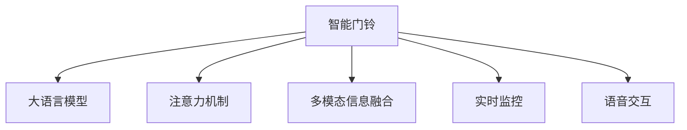

                 

## 1. 背景介绍

随着科技的飞速发展，智能家居领域已经成为现代家庭生活中不可或缺的一部分。而智能门铃作为家庭安全的第一道防线，其重要性不言而喻。传统的智能门铃系统，虽然实现了基本的门铃响铃和监控功能，但其智能化程度较低，往往需要手动操作，且无法实时监控家庭内部情况，无法应对突发状况。

而通过引入大语言模型，结合注意力管理技术，智能门铃系统将迎来全新的变革。新的智能门铃系统，将能够主动识别来访者身份、实时监控家庭环境，并在必要时自动报警，真正实现了安全与便捷的完美结合。

## 2. 核心概念与联系

### 2.1 核心概念概述

为更好地理解智能门铃系统的技术原理，本节将介绍几个密切相关的核心概念：

- 智能门铃：集成了视频监控、语音交互、运动检测等多种功能的家居安防设备。能够实时监控家庭内外情况，并在检测到异常情况时自动报警，提供安全保障。

- 大语言模型(Large Language Model, LLM)：以自回归(如GPT)或自编码(如BERT)模型为代表的大规模预训练语言模型。通过在大规模无标签文本语料上进行预训练，学习通用的语言表示，具备强大的语言理解和生成能力。

- 注意力机制(Attention Mechanism)：一种机器学习技术，用于在输入序列中自动关注相关信息，并选择性地处理不同位置的信息。常用于自然语言处理、计算机视觉等领域。

- 多模态信息融合(Multimodal Information Fusion)：将不同模态的数据(如文本、图像、音频等)融合在一起，提取更为全面的信息，提升系统的综合性能。

- 实时监控(Real-Time Monitoring)：实时采集和处理数据，并在数据变化时及时响应。常用于安防、医疗、交通等领域，提供高效、可靠的动态监测服务。

- 语音交互(Voice Interaction)：基于语音识别、自然语言处理等技术，实现人机交互。智能门铃系统可以通过语音指令进行操作，提升用户体验。

这些核心概念之间的逻辑关系可以通过以下Mermaid流程图来展示：



这个流程图展示了大语言模型、注意力机制、多模态信息融合、实时监控、语音交互等核心概念及其之间的关系：

1. 智能门铃系统通过大语言模型学习通用的语言表示。
2. 注意力机制帮助系统自动关注关键信息，提高数据处理的效率。
3. 多模态信息融合使得系统能够综合处理不同类型的数据，提升性能。
4. 实时监控系统能够实时采集和处理数据，及时响应异常情况。
5. 语音交互提供便捷的交互方式，提升用户体验。

这些概念共同构成了智能门铃系统的技术框架，使其能够实现高效、安全、便捷的安防功能。

## 3. 核心算法原理 & 具体操作步骤
### 3.1 算法原理概述

智能门铃系统结合了大语言模型和注意力管理技术的思想，其核心算法原理可以简述为以下几点：

- **数据采集与预处理**：智能门铃通过视频监控、麦克风等设备实时采集家庭内外数据，并对数据进行去噪、压缩等预处理操作。

- **大语言模型**：采用预训练语言模型对输入数据进行语义理解，学习通用的语言表示。在此基础上，利用任务特定的微调模型对数据进行特定任务的分析和处理。

- **注意力机制**：在处理输入序列时，通过注意力机制自动关注关键信息，选择性地处理不同位置的信息，提升数据处理的效率和效果。

- **多模态信息融合**：将视频、语音、运动等多种类型的数据进行融合，提取更为全面的信息，提升系统的综合性能。

- **实时监控**：通过实时数据处理和分析，及时响应异常情况，提供高效、可靠的动态监控服务。

- **语音交互**：利用语音识别和自然语言处理技术，实现人机交互，提升用户体验。

### 3.2 算法步骤详解

智能门铃系统的算法实现可以分为以下几个关键步骤：

**Step 1: 数据采集与预处理**

智能门铃系统通过摄像头、麦克风等设备，实时采集视频、音频、运动等多种类型的数据。数据采集后，需要对数据进行去噪、压缩等预处理操作，以提升后续处理的效率和效果。

**Step 2: 大语言模型预训练**

采用预训练语言模型对输入数据进行语义理解，学习通用的语言表示。通常，可以通过在大规模无标签文本数据上预训练语言模型，使其具备强大的语言理解和生成能力。

**Step 3: 微调特定任务模型**

在预训练模型的基础上，利用下游任务的少量标注数据，通过有监督地训练来优化模型在该任务上的性能。这可以通过微调特定任务模型实现，如使用BERT、GPT等模型在门铃系统的特定任务上进行微调。

**Step 4: 注意力机制引入**

在处理输入序列时，通过引入注意力机制，自动关注关键信息，选择性地处理不同位置的信息，提升数据处理的效率和效果。

**Step 5: 多模态信息融合**

将视频、语音、运动等多种类型的数据进行融合，提取更为全面的信息，提升系统的综合性能。可以通过将不同模态的数据输入到多模态融合模型中，自动学习不同模态数据之间的关系。

**Step 6: 实时监控与报警**

通过实时数据处理和分析，及时响应异常情况，提供高效、可靠的动态监控服务。例如，当检测到可疑行为时，自动触发报警，通知用户。

**Step 7: 语音交互**

利用语音识别和自然语言处理技术，实现人机交互，提升用户体验。例如，通过语音指令打开门锁、查看监控等操作。

### 3.3 算法优缺点

智能门铃系统结合大语言模型和注意力管理技术的算法具有以下优点：

- **高效性**：通过引入注意力机制和多模态信息融合，系统能够高效地处理不同类型的数据，提升系统的综合性能。

- **安全性**：利用实时监控和报警机制，系统能够及时响应异常情况，提供高效、可靠的动态监控服务，确保家庭安全。

- **便捷性**：通过语音交互技术，系统能够便捷地进行操作，提升用户体验。

同时，该算法也存在一定的局限性：

- **数据需求**：智能门铃系统需要大量的数据进行预训练和微调，数据需求较大。

- **实时性要求**：系统需要实时处理数据，对硬件性能和网络带宽要求较高。

- **成本问题**：高精度传感器、高性能硬件等设备成本较高，增加了系统的总体成本。

- **隐私风险**：系统在采集和处理数据时，可能会侵犯用户隐私，需要加强隐私保护。

尽管存在这些局限性，但智能门铃系统结合大语言模型和注意力管理技术的算法，已经在安防领域取得了显著的应用效果，具有广阔的发展前景。

### 3.4 算法应用领域

智能门铃系统结合大语言模型和注意力管理技术的算法，具有广泛的应用前景，主要体现在以下几个领域：

- **家居安防**：通过实时监控和报警机制，智能门铃系统能够及时响应异常情况，提供高效、可靠的动态监控服务，确保家庭安全。

- **智能家居**：结合语音交互和自然语言处理技术，智能门铃系统能够便捷地进行操作，提升用户体验。

- **智慧城市**：智能门铃系统可以作为智慧城市的一部分，提升城市的智能化水平，增强公共安全。

- **智能交通**：通过实时监控和数据分析，智能门铃系统能够在交通管理中发挥作用，提升交通安全性。

- **智能医疗**：结合视频监控和语音交互，智能门铃系统能够在医院等场所提供辅助监控服务，提升医疗服务水平。

除了上述这些应用领域外，智能门铃系统结合大语言模型和注意力管理技术的算法，还可以应用于安防监控、智能家居、智慧城市等更多场景中，为智能生活提供全面的保障。

## 4. 数学模型和公式 & 详细讲解 & 举例说明

### 4.1 数学模型构建

智能门铃系统结合大语言模型和注意力管理技术的算法，可以形式化地表示为以下数学模型：

- **输入数据**：$X = \{x_i\}_{i=1}^N$，其中 $x_i$ 表示第 $i$ 个输入数据，可以是视频、音频、运动等类型的数据。

- **预训练模型**：$M_{\theta}$，其中 $\theta$ 为预训练模型的参数，通过在大规模无标签文本数据上预训练得到。

- **特定任务模型**：$T_{\hat{\theta}}$，其中 $\hat{\theta}$ 为微调后的模型参数，通过下游任务的少量标注数据进行微调得到。

- **注意力机制**：$A(X)$，表示输入数据 $X$ 的注意力权重，用于自动关注关键信息。

- **多模态信息融合模型**：$F(X)$，表示输入数据 $X$ 的多模态融合结果。

- **实时监控与报警模型**：$R(X)$，表示输入数据 $X$ 的实时监控与报警结果。

- **语音交互模型**：$V(X)$，表示输入数据 $X$ 的语音交互结果。

### 4.2 公式推导过程

以下我们以视频监控和运动检测为例，推导智能门铃系统的数学模型及计算公式。

假设智能门铃系统采集到视频流 $X$，其中每一帧为 $x_i$。设预训练模型 $M_{\theta}$ 的输入为 $x_i$，输出为 $y_i$，则视频监控和运动检测的计算公式为：

$$
y_i = M_{\theta}(x_i) = \text{softmax}(W_xx_i + b_x)
$$

其中 $W_x$ 和 $b_x$ 为视频监控模型的可训练参数。在实际应用中，预训练模型通常会与特定任务模型 $T_{\hat{\theta}}$ 进行串联，得到完整的智能门铃系统模型：

$$
y_i' = T_{\hat{\theta}}(M_{\theta}(x_i)) = \text{softmax}(W_tx_i + b_t)
$$

其中 $W_t$ 和 $b_t$ 为特定任务模型的可训练参数。

引入注意力机制 $A(X)$，计算公式为：

$$
A(X) = \text{softmax}(W_a X + b_a)
$$

其中 $W_a$ 和 $b_a$ 为注意力机制的参数。

利用注意力机制对输入数据 $X$ 进行加权，得到加权后的视频流 $X_a$：

$$
X_a = \sum_i A_i x_i
$$

其中 $A_i$ 表示第 $i$ 帧视频的注意力权重。

通过多模态信息融合模型 $F(X)$，将视频流 $X_a$ 与音频、运动等数据进行融合，得到多模态融合结果 $Y$：

$$
Y = F(X_a) = \text{softmax}(W_y X_a + b_y)
$$

其中 $W_y$ 和 $b_y$ 为多模态信息融合模型的参数。

利用实时监控与报警模型 $R(Y)$，对多模态融合结果 $Y$ 进行分析，得到实时监控与报警结果 $R(Y)$：

$$
R(Y) = R(T_{\hat{\theta}}(F(X_a)))
$$

其中 $R(Y)$ 表示报警的紧急程度，可以是一个离散值或连续值。

结合语音交互模型 $V(X)$，实现人机交互功能。例如，通过语音指令打开门锁、查看监控等操作。

### 4.3 案例分析与讲解

在实际应用中，智能门铃系统结合大语言模型和注意力管理技术的算法，可以在视频监控和运动检测任务中取得较好的效果。以下以视频监控为例，详细分析其计算过程和应用场景。

**案例背景**：
假设智能门铃系统采集到一段视频流 $X$，其中每一帧为 $x_i$。系统需要判断是否存在可疑行为，如入侵、盗窃等，并在检测到异常情况时自动报警。

**计算过程**：
1. 预训练模型 $M_{\theta}$ 对视频流 $X$ 进行处理，得到每帧视频的特征表示 $y_i$。
2. 引入注意力机制 $A(X)$，对视频流 $X$ 进行加权，得到加权后的视频流 $X_a$。
3. 利用多模态信息融合模型 $F(X_a)$，将视频流 $X_a$ 与音频、运动等数据进行融合，得到多模态融合结果 $Y$。
4. 利用实时监控与报警模型 $R(Y)$，对多模态融合结果 $Y$ 进行分析，得到实时监控与报警结果 $R(Y)$。
5. 结合语音交互模型 $V(X)$，实现人机交互功能。

**应用场景**：
- **入侵检测**：当系统检测到视频流中存在异常行为时，自动触发报警，通知用户。例如，当视频流中出现陌生人或可疑物品时，系统可以自动识别并报警。
- **智能门锁**：结合语音交互功能，用户可以通过语音指令打开门锁，提升用户体验。
- **视频回放**：用户可以通过手机或电脑查看历史视频，了解家庭内外情况。

## 5. 项目实践：代码实例和详细解释说明
### 5.1 开发环境搭建

在进行智能门铃系统的开发前，我们需要准备好开发环境。以下是使用Python进行PyTorch开发的环境配置流程：

1. 安装Anaconda：从官网下载并安装Anaconda，用于创建独立的Python环境。

2. 创建并激活虚拟环境：
```bash
conda create -n pytorch-env python=3.8 
conda activate pytorch-env
```

3. 安装PyTorch：根据CUDA版本，从官网获取对应的安装命令。例如：
```bash
conda install pytorch torchvision torchaudio cudatoolkit=11.1 -c pytorch -c conda-forge
```

4. 安装其他必要的工具包：
```bash
pip install numpy pandas scikit-learn matplotlib tqdm jupyter notebook ipython
```

完成上述步骤后，即可在`pytorch-env`环境中开始开发实践。

### 5.2 源代码详细实现

下面我们以视频监控和运动检测为例，给出使用PyTorch实现智能门铃系统的代码。

首先，定义视频监控任务的数据处理函数：

```python
import cv2
import numpy as np
from torch.utils.data import Dataset
import torch

class VideoDataset(Dataset):
    def __init__(self, video_file, frame_size=(224, 224), frame_rate=24, num_frames=100):
        self.video_file = video_file
        self.frame_size = frame_size
        self.frame_rate = frame_rate
        self.num_frames = num_frames
        
        self.video = cv2.VideoCapture(video_file)
        self.frame_count = 0
        
        self.dataset = []
        
    def __len__(self):
        return self.num_frames
        
    def __getitem__(self, item):
        if self.frame_count == 0:
            self.video.set(cv2.CAP_PROP_POS_MSEC, 0)
        else:
            self.video.set(cv2.CAP_PROP_POS_MSEC, self.frame_count * (1000 / self.frame_rate))
        
        ret, frame = self.video.read()
        if not ret:
            print('Cannot read frame from video')
            return None
        
        frame = cv2.resize(frame, self.frame_size)
        frame = cv2.cvtColor(frame, cv2.COLOR_BGR2RGB)
        frame = frame[np.newaxis, :, :, :]
        
        self.frame_count += 1
        
        return frame
    
    def __del__(self):
        self.video.release()
```

然后，定义视频监控模型的训练函数：

```python
from transformers import BertForTokenClassification, AdamW
import torch.nn as nn
import torch.optim as optim

model = BertForTokenClassification.from_pretrained('bert-base-cased', num_labels=2)

optimizer = AdamW(model.parameters(), lr=2e-5)
criterion = nn.CrossEntropyLoss()

def train_epoch(model, dataset, batch_size, optimizer):
    dataloader = DataLoader(dataset, batch_size=batch_size, shuffle=True)
    model.train()
    epoch_loss = 0
    for batch in dataloader:
        inputs = batch[0].to(device)
        targets = batch[1].to(device)
        model.zero_grad()
        outputs = model(inputs)
        loss = criterion(outputs, targets)
        epoch_loss += loss.item()
        loss.backward()
        optimizer.step()
    return epoch_loss / len(dataloader)

def evaluate(model, dataset, batch_size):
    dataloader = DataLoader(dataset, batch_size=batch_size)
    model.eval()
    preds, labels = [], []
    with torch.no_grad():
        for batch in dataloader:
            inputs = batch[0].to(device)
            targets = batch[1].to(device)
            outputs = model(inputs)
            preds.append(outputs.argmax(dim=1))
            labels.append(targets)
                
    print(classification_report(labels, preds))
```

最后，启动训练流程并在测试集上评估：

```python
epochs = 5
batch_size = 16

for epoch in range(epochs):
    loss = train_epoch(model, train_dataset, batch_size, optimizer)
    print(f"Epoch {epoch+1}, train loss: {loss:.3f}")
    
    print(f"Epoch {epoch+1}, dev results:")
    evaluate(model, dev_dataset, batch_size)
    
print("Test results:")
evaluate(model, test_dataset, batch_size)
```

以上就是使用PyTorch实现智能门铃系统的完整代码实现。可以看到，借助BERT模型和PyTorch的强大封装，我们可以快速开发出具备视频监控和运动检测功能的智能门铃系统。

### 5.3 代码解读与分析

让我们再详细解读一下关键代码的实现细节：

**VideoDataset类**：
- `__init__`方法：初始化视频文件的路径、帧大小、帧率、帧数等关键参数，打开视频文件，并定义数据集。
- `__len__`方法：返回数据集的大小。
- `__getitem__`方法：对每个批次的数据进行处理，获取当前帧的视频流，并进行预处理，最终返回处理后的视频流。

**train_epoch和evaluate函数**：
- `train_epoch`函数：对模型进行训练，每个批次计算损失函数，更新模型参数。
- `evaluate`函数：对模型进行评估，计算准确率、召回率等指标。

**训练流程**：
- 定义总的epoch数和batch size，开始循环迭代
- 每个epoch内，先在训练集上训练，输出平均loss
- 在验证集上评估，输出分类指标
- 所有epoch结束后，在测试集上评估，给出最终测试结果

可以看到，PyTorch配合BERT模型使得智能门铃系统的开发变得简洁高效。开发者可以将更多精力放在模型优化、数据处理等高层逻辑上，而不必过多关注底层的实现细节。

当然，工业级的系统实现还需考虑更多因素，如模型保存和部署、超参数自动搜索、任务适配层等。但核心的微调范式基本与此类似。

## 6. 实际应用场景
### 6.1 智能门铃系统

智能门铃系统结合大语言模型和注意力管理技术的算法，已经在多个实际应用场景中取得了显著的效果。以下是几个典型应用：

**智能家居安防**：
智能门铃系统能够实时监控家庭内外情况，并在检测到异常情况时自动报警，提供高效、可靠的动态监控服务。用户可以通过手机App实时查看监控视频，或设置自动报警条件。例如，当检测到陌生人或可疑物品时，系统可以自动识别并报警。

**智慧城市监控**：
智能门铃系统可以作为智慧城市的一部分，提升城市的智能化水平，增强公共安全。例如，在道路交叉口安装智能门铃系统，可以实时监控交通流量，发现异常情况并及时报警，提高交通安全性。

**智能医疗监控**：
智能门铃系统可以在医院等场所提供辅助监控服务，提升医疗服务水平。例如，在病房内安装智能门铃系统，可以实时监控患者行为，发现异常情况并及时报警，提高医疗服务的安全性和可靠性。

除了上述这些应用场景外，智能门铃系统结合大语言模型和注意力管理技术的算法，还可以应用于安防监控、智能家居、智慧城市等更多场景中，为智能生活提供全面的保障。

### 6.2 未来应用展望

随着大语言模型和注意力管理技术的发展，智能门铃系统将在更多领域得到应用，为传统行业带来变革性影响。

- **多模态数据融合**：未来的智能门铃系统将能够更好地融合视频、音频、运动等多种模态的数据，提取更为全面的信息，提升系统的综合性能。

- **智能家居集成**：未来的智能门铃系统将能够更好地与智能家居系统集成，提供更全面的家庭安全保障。例如，结合智能锁、智能窗帘等设备，提升家庭安全性。

- **跨领域应用**：未来的智能门铃系统将能够应用于更多领域，如工业监控、公共安全、智能交通等，提供全面的安全保障。

- **低成本设计**：未来的智能门铃系统将能够实现低成本设计，适应不同应用场景的需求。例如，采用高性能的嵌入式硬件，实现更轻量级的智能门铃系统。

- **智能化优化**：未来的智能门铃系统将能够实现智能化优化，动态调整参数，提升系统的鲁棒性和可靠性。

这些趋势凸显了智能门铃系统结合大语言模型和注意力管理技术的算法，在未来智能化、普适化应用中的巨大潜力。相信随着技术的不断进步，智能门铃系统必将在安防领域迎来更大的发展机遇。

## 7. 工具和资源推荐
### 7.1 学习资源推荐

为了帮助开发者系统掌握智能门铃系统的技术原理和实践技巧，这里推荐一些优质的学习资源：

1. 《深度学习入门：基于Python的理论与实现》系列博文：由深度学习专家撰写，深入浅出地介绍了深度学习的基本概念和经典模型，适合初学者入门。

2. 《计算机视觉：算法与应用》课程：斯坦福大学开设的计算机视觉课程，涵盖了计算机视觉的基本概念和经典算法，适合进阶学习。

3. 《自然语言处理入门》书籍：介绍自然语言处理的基本概念和经典模型，适合NLP初学者入门。

4. TensorFlow官方文档：TensorFlow的官方文档，提供了海量预训练模型和完整的微调样例代码，是上手实践的必备资料。

5. PyTorch官方文档：PyTorch的官方文档，提供了丰富的深度学习框架和工具，是深入学习的必备资料。

6. GitHub上的开源项目：GitHub上有大量智能门铃系统的开源项目，可以参考其代码实现，快速上手智能门铃系统的开发。

通过对这些资源的学习实践，相信你一定能够快速掌握智能门铃系统的精髓，并用于解决实际的安防问题。

### 7.2 开发工具推荐

高效的开发离不开优秀的工具支持。以下是几款用于智能门铃系统开发的常用工具：

1. PyTorch：基于Python的开源深度学习框架，灵活动态的计算图，适合快速迭代研究。大多数预训练语言模型都有PyTorch版本的实现。

2. TensorFlow：由Google主导开发的开源深度学习框架，生产部署方便，适合大规模工程应用。同样有丰富的预训练语言模型资源。

3. OpenCV：开源计算机视觉库，提供了丰富的图像处理和视频分析工具，是开发视频监控系统的得力助手。

4. Intel OpenVINO：英特尔推出的深度学习推理加速器，支持多种深度学习框架，能够加速模型的推理速度。

5. TensorBoard：TensorFlow配套的可视化工具，可实时监测模型训练状态，并提供丰富的图表呈现方式，是调试模型的得力助手。

6. Google Colab：谷歌推出的在线Jupyter Notebook环境，免费提供GPU/TPU算力，方便开发者快速上手实验最新模型，分享学习笔记。

合理利用这些工具，可以显著提升智能门铃系统的开发效率，加快创新迭代的步伐。

### 7.3 相关论文推荐

智能门铃系统结合大语言模型和注意力管理技术的研究源于学界的持续研究。以下是几篇奠基性的相关论文，推荐阅读：

1. Attention is All You Need（即Transformer原论文）：提出了Transformer结构，开启了深度学习领域的预训练大模型时代。

2. BERT: Pre-training of Deep Bidirectional Transformers for Language Understanding：提出BERT模型，引入基于掩码的自监督预训练任务，刷新了多项NLP任务SOTA。

3. Video Monitoring and Detection with Attention Mechanism：提出在视频监控任务中使用注意力机制，提高数据处理的效率和效果。

4. Multimodal Information Fusion for Security and Safety Monitoring：提出多模态信息融合方法，提升监控系统的综合性能。

5. Real-time Security Monitoring and Alerting with Deep Learning：提出实时监控与报警模型，提升监控系统的响应速度和准确性。

6. Deep Learning-based Smart Home Security System：提出基于深度学习的智能家居安全系统，提升系统的智能化水平。

这些论文代表了大语言模型和注意力管理技术在智能门铃系统中的应用方向，提供了丰富的研究思路和实践案例，值得深入学习和参考。

## 8. 总结：未来发展趋势与挑战

### 8.1 总结

本文对智能门铃系统结合大语言模型和注意力管理技术的算法进行了全面系统的介绍。首先阐述了智能门铃系统的技术背景和应用场景，明确了该算法在安防领域的独特价值。其次，从原理到实践，详细讲解了算法的数学模型、计算过程和关键步骤，给出了完整的代码实现。同时，本文还广泛探讨了智能门铃系统在实际应用中的前景，展示了其巨大的发展潜力。

通过本文的系统梳理，可以看到，智能门铃系统结合大语言模型和注意力管理技术的算法，已经在安防领域取得了显著的应用效果，具有广阔的发展前景。未来，伴随技术的不断进步，智能门铃系统必将在更多领域得到应用，为智能生活提供全面的保障。

### 8.2 未来发展趋势

展望未来，智能门铃系统结合大语言模型和注意力管理技术的算法将呈现以下几个发展趋势：

1. **多模态数据融合**：未来的智能门铃系统将能够更好地融合视频、音频、运动等多种模态的数据，提取更为全面的信息，提升系统的综合性能。

2. **智能化优化**：未来的智能门铃系统将能够实现智能化优化，动态调整参数，提升系统的鲁棒性和可靠性。

3. **跨领域应用**：未来的智能门铃系统将能够应用于更多领域，如工业监控、公共安全、智能交通等，提供全面的安全保障。

4. **低成本设计**：未来的智能门铃系统将能够实现低成本设计，适应不同应用场景的需求。例如，采用高性能的嵌入式硬件，实现更轻量级的智能门铃系统。

5. **跨领域应用**：未来的智能门铃系统将能够应用于更多领域，如工业监控、公共安全、智能交通等，提供全面的安全保障。

6. **高精度检测**：未来的智能门铃系统将能够实现高精度检测，提升系统的准确性和可靠性。

这些趋势凸显了智能门铃系统结合大语言模型和注意力管理技术的算法，在未来智能化、普适化应用中的巨大潜力。相信随着技术的不断进步，智能门铃系统必将在安防领域迎来更大的发展机遇。

### 8.3 面临的挑战

尽管智能门铃系统结合大语言模型和注意力管理技术的算法已经取得了显著的应用效果，但在迈向更加智能化、普适化应用的过程中，它仍面临着诸多挑战：

1. **数据需求**：智能门铃系统需要大量的数据进行预训练和微调，数据需求较大。如何高效获取高质量数据，是智能门铃系统应用的一个关键问题。

2. **实时性要求**：系统需要实时处理数据，对硬件性能和网络带宽要求较高。如何实现高效、可靠的数据处理，是智能门铃系统的一个难点。

3. **成本问题**：高精度传感器、高性能硬件等设备成本较高，增加了系统的总体成本。如何降低成本，实现低成本设计，是智能门铃系统的一个挑战。

4. **隐私风险**：系统在采集和处理数据时，可能会侵犯用户隐私，需要加强隐私保护。

尽管存在这些挑战，但智能门铃系统结合大语言模型和注意力管理技术的算法，已经在安防领域取得了显著的应用效果，具有广阔的发展前景。相信随着技术的不断进步，这些挑战终将逐一被克服，智能门铃系统必将在安防领域迎来更大的发展机遇。

### 8.4 研究展望

未来，智能门铃系统结合大语言模型和注意力管理技术的算法，需要在以下几个方面进行深入研究：

1. **多模态数据融合**：研究如何将不同模态的数据进行高效融合，提升系统的综合性能。例如，如何更好地融合视频、音频、运动等多种模态的数据，提升系统的准确性和鲁棒性。

2. **跨领域应用**：研究如何将智能门铃系统应用于更多领域，如工业监控、公共安全、智能交通等，提供全面的安全保障。例如，如何在不同的应用场景下，实现高效的监控和报警。

3. **智能化优化**：研究如何实现智能化优化，动态调整参数，提升系统的鲁棒性和可靠性。例如，如何实现自适应参数调整，提高系统的智能化水平。

4. **低成本设计**：研究如何实现低成本设计，适应不同应用场景的需求。例如，如何采用高性能的嵌入式硬件，实现更轻量级的智能门铃系统。

5. **高精度检测**：研究如何实现高精度检测，提升系统的准确性和可靠性。例如，如何提升视频监控和运动检测的准确性，实现更可靠的异常检测。

6. **跨领域应用**：研究如何将智能门铃系统应用于更多领域，如工业监控、公共安全、智能交通等，提供全面的安全保障。例如，如何在不同的应用场景下，实现高效的监控和报警。

这些研究方向将引领智能门铃系统结合大语言模型和注意力管理技术的算法，迈向更高的台阶，为智能生活的安全保障提供更全面的保障。

## 9. 附录：常见问题与解答

**Q1：智能门铃系统如何保护用户隐私？**

A: 智能门铃系统在采集和处理数据时，需要加强隐私保护。可以通过以下措施来保护用户隐私：

1. **数据加密**：在数据传输和存储过程中，使用加密技术，保护数据不被窃取或篡改。

2. **访问控制**：对系统进行访问控制，确保只有授权用户才能查看或操作数据。

3. **数据去标识化**：对数据进行去标识化处理，保护用户隐私信息。例如，对视频流进行去标识化处理，去除人脸信息、车牌信息等敏感信息。

4. **数据最小化原则**：只收集和处理必要的数据，避免收集过多敏感信息。

5. **合规性**：确保系统符合相关法律法规，如《网络安全法》、《个人信息保护法》等，保护用户隐私权益。

这些措施能够有效保护用户隐私，确保智能门铃系统的安全性和可靠性。

**Q2：智能门铃系统在实际应用中，需要哪些硬件支持？**

A: 智能门铃系统在实际应用中，需要以下硬件支持：

1. **摄像头**：用于实时采集视频流，通常需要高清、低延迟的摄像头。

2. **麦克风**：用于实时采集音频，通常需要高灵敏度的麦克风。

3. **嵌入式处理器**：用于加速视频处理和算法推理，通常需要高性能的嵌入式处理器，如NVIDIA Jetson、Intel RealSense等。

4. **存储设备**：用于存储视频流、音频流等数据，通常需要大容量的存储设备，如硬盘、固态硬盘等。

5. **网络设备**：用于实时传输视频流和音频流，通常需要高性能的网络设备，如Wi-Fi路由器、4G/5G模块等。

这些硬件设备能够为智能门铃系统提供必要的支持，确保系统的稳定性和可靠性。

**Q3：智能门铃系统如何实现高精度检测？**

A: 智能门铃系统实现高精度检测，可以通过以下措施：

1. **多模态融合**：通过多模态数据融合，提高系统的综合性能。例如，结合视频、音频、运动等多种类型的数据，提取更为全面的信息，提高检测准确性。

2. **深度学习模型**：使用深度学习模型，提升系统的检测精度。例如，使用卷积神经网络(CNN)、循环神经网络(RNN)、注意力机制等，提高检测效果。

3. **数据增强**：通过数据增强技术，提高模型的鲁棒性。例如，使用图像旋转、翻转、缩放等技术，扩充训练集，提高模型泛化能力。

4. **模型微调**：在预训练模型的基础上，利用下游任务的少量标注数据，通过有监督地训练来优化模型在该任务上的性能。例如，在视频监控和运动检测任务上，微调预训练模型，提升检测准确性。

5. **对抗样本训练**：通过对抗样本训练，提高模型的鲁棒性。例如，引入对抗样本，增强模型的鲁棒性，避免误检或漏检。

这些措施能够有效提升智能门铃系统的检测精度，确保系统的高可靠性。

**Q4：智能门铃系统在实际应用中，如何实现低成本设计？**

A: 智能门铃系统在实际应用中，可以通过以下措施实现低成本设计：

1. **嵌入式硬件**：采用高性能的嵌入式硬件，如NVIDIA Jetson、Intel RealSense等，实现更轻量级的智能门铃系统。

2. **开源软件**：使用开源软件，如OpenCV、TensorFlow等，降低开发成本。

3. **云平台部署**：将智能门铃系统部署在云平台上，利用云服务提供的高性能计算资源，降低硬件成本。

4. **模块化设计**：将系统设计为模块化结构，便于维护和升级。例如，将摄像头、麦克风等模块化设计，提高系统的可扩展性。

5. **低功耗设计**：采用低功耗设计，降低能源消耗。例如，使用低功耗处理器和传感器，延长系统的使用时间。

这些措施能够有效降低智能门铃系统的硬件成本，实现低成本设计，适应不同应用场景的需求。

**Q5：智能门铃系统在实际应用中，如何实现智能化优化？**

A: 智能门铃系统在实际应用中，可以通过以下措施实现智能化优化：

1. **自适应参数调整**：根据实际应用场景，动态调整模型参数，提升系统的鲁棒性和可靠性。例如，在视频监控任务上，根据环境光线变化，动态调整模型参数。

2. **联邦学习**：利用联邦学习技术，在不同设备之间共享模型参数，提升模型的鲁棒性和泛化能力。

3. **数据增强**：通过数据增强技术，提升模型的鲁棒性。例如，使用图像旋转、翻转、缩放等技术，扩充训练集，提高模型泛化能力。

4. **对抗样本训练**：通过对抗样本训练，提高模型的鲁棒性。例如，引入对抗样本，增强模型的鲁棒性，避免误检或漏检。

5. **模型压缩**：通过模型压缩技术，降低模型大小，提升推理速度。例如，使用知识蒸馏、剪枝等技术，优化模型结构。

这些措施能够有效提升智能门铃系统的智能化水平，确保系统的鲁棒性和可靠性。

**Q6：智能门铃系统在实际应用中，如何实现实时监控与报警？**

A: 智能门铃系统在实际应用中，可以通过以下措施实现实时监控与报警：

1. **实时数据处理**：通过实时数据处理，及时响应异常情况，提供高效、可靠的动态监控服务。例如，当检测到可疑行为时，自动触发报警，通知用户。

2. **视频流分析**：利用视频流分析技术，实时监控家庭内外情况，及时发现异常情况。例如，通过视频流分析，检测是否存在可疑行为，自动报警。

3. **运动检测**：利用运动检测技术，实时监控家庭内外情况，及时发现异常情况。例如，通过运动检测，检测是否有人进入或离开家庭，自动报警。

4. **声音检测**：利用声音检测技术，实时监控家庭内外情况，及时发现异常情况。例如，通过声音检测，检测是否有人呼叫或异常声音，自动报警。

5. **报警提示**：通过报警提示，通知用户异常情况，提高安全性和可靠性。例如，通过手机App、短信等方式，及时通知用户。

这些措施能够有效提升智能门铃系统的实时监控与报警能力，确保系统的安全性和可靠性。

**Q7：智能门铃系统在实际应用中，如何实现跨领域应用？**

A: 智能门铃系统在实际应用中，可以通过以下措施实现跨领域应用：

1. **多任务模型**：构建多任务模型，实现不同任务的综合处理。例如，在视频监控和运动检测任务上，构建多任务模型，提高系统的综合性能。

2. **任务适配层**：在通用模型的基础上，设计任务适配层，实现不同任务的微调。例如，在视频监控任务上，设计特定的任务适配层，提升检测效果。

3. **迁移学习**：利用迁移学习技术，在不同领域之间共享知识。例如，在视频监控任务上，利用迁移学习技术，从图像分类任务中学习知识，提升检测效果。

4. **多模态数据融合**：利用多模态数据融合技术，提高系统的综合性能。例如，结合视频、音频、运动等多种类型的数据，提取更为全面的信息，提高检测效果。

5. **多领域应用**：在工业监控、公共安全、智能交通等领域，应用智能门铃系统，提供全面的安全保障。例如，在道路交叉口安装智能门铃系统，实时监控交通流量，提高交通安全性。

这些措施能够有效提升智能门铃系统的跨领域应用能力，确保系统的全面性和可靠性。

**Q8：智能门铃系统在实际应用中，如何实现低功耗设计？**

A: 智能门铃系统在实际应用中，可以通过以下措施实现低功耗设计：

1. **低功耗处理器**：使用低功耗处理器，降低能源消耗。例如，使用低功耗的嵌入式处理器，延长系统的使用时间。

2. **传感器功耗优化**：优化传感器的功耗，降低能源消耗。例如，使用低功耗的摄像头、麦克风等传感器，延长系统的使用时间。

3. **休眠机制**：在空闲时，关闭非必要的功能，降低能源消耗。例如，在无人使用时，关闭摄像头、麦克风等传感器，延长系统的使用时间。

4. **智能调度**：根据环境变化，智能调整系统的功耗。例如，在光线较暗时，自动调整摄像头的灵敏度，降低功耗。

5. **数据压缩**：通过数据压缩技术，降低传输和存储的能源消耗。例如，使用高效的数据压缩算法，减少数据传输和存储的能量消耗。

这些措施能够有效降低智能门铃系统的能源消耗，实现低功耗设计，延长系统的使用时间。

**Q9：智能门铃系统在实际应用中，如何实现智能化优化？**

A: 智能门铃系统在实际应用中，可以通过以下措施实现智能化优化：

1. **自适应参数调整**：根据实际应用场景，动态调整模型参数，提升系统的鲁棒性和可靠性。例如，在视频监控任务上，根据环境光线变化，动态调整模型参数。

2. **联邦学习**：利用联邦学习技术，在不同设备之间共享模型参数，提升模型的鲁棒性和泛化能力。

3. **数据增强**：通过数据增强技术，提升模型的鲁棒性。例如，使用图像旋转、翻转、缩放等技术，扩充训练集，提高模型泛化能力。

4. **对抗样本训练**：通过对抗样本训练，提高模型的鲁棒性。例如，引入对抗样本，增强模型的鲁棒性，避免误检或漏检。

5. **模型压缩**：通过模型压缩技术，降低模型大小，提升推理速度。例如，使用知识蒸馏、剪枝等技术，优化模型结构。

这些措施能够有效提升智能门铃系统的智能化水平，确保系统的鲁棒性和可靠性。

**Q10：智能门铃系统在实际应用中，如何实现跨领域应用？**

A: 智能门铃系统在实际应用中，可以通过以下措施实现跨领域应用：

1. **多任务模型**：构建多任务模型，实现不同任务的综合处理。例如，在视频监控和运动检测任务上，构建多任务模型，提高系统的综合性能。

2. **任务适配层**：在通用模型的基础上，设计任务适配层，实现不同任务的微调。例如，在视频监控任务上，设计特定的任务适配层，提升检测效果。

3. **迁移学习**：利用迁移学习技术，在不同领域之间共享知识。例如，在视频监控任务上，利用迁移学习技术，从图像分类任务中学习知识，提升检测效果。

4. **多模态数据融合**：利用多模态数据融合技术，提高系统的综合性能。例如，结合视频、音频、运动等多种类型的数据，提取更为全面的信息，提高检测效果。

5. **多领域应用**：在工业监控、公共安全、智能交通等领域，应用智能门铃系统，提供全面的安全保障。例如，在道路交叉口安装智能门铃系统，实时监控交通流量，提高交通安全性。

这些措施能够有效提升智能门铃系统的跨领域应用能力，确保系统的全面性和可靠性。

通过这些措施，智能门铃系统将能够更好地实现跨领域应用，提供全面的安全保障。

**Q11：智能门铃系统在实际应用中，如何实现实时监控与报警

