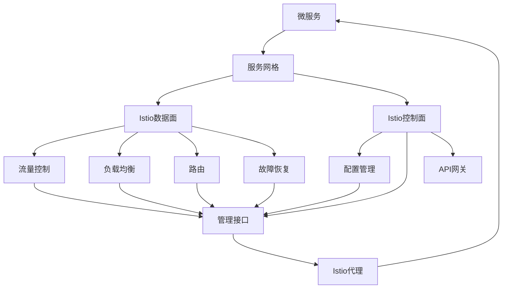

                 

# 服务网格Istio：微服务通信的基础设施

> 关键词：服务网格,微服务,通信模型,分布式系统,流量控制,负载均衡,安全管理,可观察性

## 1. 背景介绍

在分布式系统中，微服务架构因其灵活性和可扩展性而越来越受到青睐。然而，微服务架构也带来了诸多挑战，包括服务间通信、服务发现、流量管理、负载均衡、服务注册和发现、安全性、监控和可观察性等。为解决这些挑战，服务网格（Service Mesh）技术应运而生，Istio便是这一领域的佼佼者。

Istio作为一个独立的开源项目，由Lyft和Google共同发起并维护，它是一个可扩展的网络连接层，用于在分布式系统中管理微服务的通信和数据流。Iistio不仅提供了一系列先进的功能，如流量控制、负载均衡、服务发现、路由和监控等，还提供了透明的代理、API和支持库，可以无缝集成到现有的微服务架构中。

本文将从背景介绍开始，逐步深入了解Istio的核心概念、原理以及应用实践，力求为读者提供一个全面而深入的Istio技术介绍，并讨论其在实际应用中的未来发展趋势与挑战。

## 2. 核心概念与联系

### 2.1 核心概念概述

在理解Istio之前，我们首先来介绍几个关键概念：

- **微服务**：将应用程序拆分为一组独立的服务，这些服务通过网络进行通信和交互，各自独立部署和扩展。每个服务通过API网关、服务发现和负载均衡等机制与其他服务进行通信。

- **服务网格**：一种用于管理微服务间通信的框架，通过提供一个统一的、易于扩展的通信模型来改善微服务之间的通信。服务网格通常包含一个代理层，用于拦截、控制和路由服务间通信，同时还支持故障恢复和监控等高级功能。

- **Istio**：一个开源的服务网格解决方案，提供了一种统一的、可扩展的通信模型，用于在微服务架构中管理流量、安全性、监控和可观察性等。

- **MOSN**：Istio的一个实现，它提供了一个高性能的、可扩展的服务网格解决方案。MOSN利用了向量云原生网络技术的优势，提供了智能路由、负载均衡、流量控制、自动混合和容错等特性。

- **可观察性**：指通过收集和分析数据，监控、诊断和调试系统的行为。服务网格提供了强大的可观察性工具，可以帮助开发人员和运维人员理解服务间的通信和数据流动，以及系统的整体健康状况。

### 2.2 核心概念联系

Istio的架构可以被分为数据面（Data Plane）和控制面（Control Plane）。数据面是Istio的核心，负责处理微服务间的通信流量，而控制面则是提供相应的管理和配置机制。Istio通过数据面和控制面的配合，实现了微服务的全面管理。

以下是一个Mermaid流程图，展示了Istio的核心组件及其间的联系：



在上述流程图中，微服务通过Istio代理进行通信，代理拦截所有进出服务的流量，并进行处理。数据面和控制面协同工作，提供流量控制、路由、负载均衡、故障恢复等核心功能。

## 3. 核心算法原理 & 具体操作步骤

### 3.1 算法原理概述

Istio的核心算法原理主要围绕着以下几个方面：

- **流量控制**：通过调节流量，确保系统在各种负载条件下都能稳定运行。
- **负载均衡**：智能地将流量分配到多个后端服务中，以最大化系统的利用率。
- **路由**：根据规则和策略，动态地将请求路由到正确的位置。
- **故障恢复**：通过重试、故障转移和熔断机制，确保系统在服务故障时仍然可以正常运行。

### 3.2 算法步骤详解

#### 3.2.1 流量控制

Istio的流量控制功能主要通过虚拟服务（Virtual Service）和虚拟门限（Virtual Gateway）来实现。虚拟服务定义了如何路由流量，而虚拟门限则定义了如何控制流量。

以下是一个虚拟服务配置的示例：

```yaml
apiVersion: networking.istio.io/v1alpha3
kind: VirtualService
metadata:
  name: routes
spec:
  hosts:
    - "*"
  http:
    - route:
        - destination:
            host: example.com
            port:
              number: 80
            subset: v1
```

该配置定义了一个名为routes的虚拟服务，它将所有请求路由到名为example.com的服务，并指定了服务的子集（subset）为v1。

虚拟门限则用于控制流量的速率和峰值。例如，以下是一个虚拟门限的配置示例：

```yaml
apiVersion: networking.istio.io/v1alpha3
kind: VirtualGateway
metadata:
  name: example
spec:
  selector:
    istio: ingressgateway
  servers:
    - port:
        number: 80
        name: http
      hosts:
        - "*"
```

该配置定义了一个名为example的虚拟门限，它指定了所有请求的80端口，并将其路由到名为http的服务器。

#### 3.2.2 负载均衡

Istio使用智能负载均衡算法，根据服务健康状态和负载情况，动态地将流量分配到后端服务中。

以下是Istio的负载均衡算法的关键步骤：

1. **服务发现**：Istio通过服务注册和发现机制，实时获取所有可用的后端服务。
2. **健康检查**：Istio定期检查后端服务的健康状态，以确定哪些服务是可用的。
3. **流量分配**：Istio根据后端服务的状态和负载情况，智能地将流量分配到可用服务中。

#### 3.2.3 路由

Istio使用灵活的路由机制，可以根据不同的规则和策略，动态地将请求路由到正确的服务。

以下是Istio的路由机制的关键步骤：

1. **请求解析**：Istio解析请求的路径和参数，并根据配置规则进行匹配。
2. **路由选择**：Istio根据匹配结果，选择合适的服务进行路由。
3. **流量转发**：Istio将请求转发到选定的服务，并进行负载均衡和流量控制。

#### 3.2.4 故障恢复

Istio的故障恢复机制包括重试、故障转移和熔断等功能，确保系统在服务故障时仍然可以正常运行。

以下是Istio的故障恢复机制的关键步骤：

1. **重试机制**：当后端服务不可用时，Istio自动进行重试，以恢复服务的可用性。
2. **故障转移**：Istio可以将请求路由到其他健康的服务，以避免对故障服务的依赖。
3. **熔断机制**：Istio可以通过熔断机制，限制对故障服务的请求，防止系统崩溃。

### 3.3 算法优缺点

#### 3.3.1 优点

1. **透明性**：Istio在服务之间无缝集成，不需要修改现有的微服务架构，可以轻松地应用于现有的应用。
2. **可扩展性**：Istio支持大规模的微服务架构，可以通过添加更多代理和配置规则来扩展系统。
3. **安全性**：Istio提供了强大的安全性功能，如互操作认证、授权和数据加密等，确保系统的安全性。
4. **可观察性**：Istio提供了强大的可观察性工具，可以帮助开发人员和运维人员理解服务间的通信和数据流动，以及系统的整体健康状况。

#### 3.3.2 缺点

1. **复杂性**：Istio的配置和管理相对复杂，需要一定的学习曲线。
2. **性能损失**：Istio的代理和控制面在一定程度上会带来一定的性能损失，需要谨慎配置。
3. **成本**：Istio需要一定的资源投入，包括硬件和运维成本。

### 3.4 算法应用领域

Istio的应用领域非常广泛，以下是其中一些典型应用：

- **金融服务**：金融服务机构需要快速地处理大量的交易和支付请求，Istio可以帮助其构建一个高效、可靠和安全的微服务架构。
- **电商平台**：电商平台需要处理大量的用户请求和订单，Istio可以帮助其构建一个高可用和可扩展的微服务架构。
- **医疗服务**：医疗服务需要处理大量的患者请求和数据，Istio可以帮助其构建一个高可靠性和高性能的微服务架构。
- **物联网**：物联网设备需要处理大量的数据和请求，Istio可以帮助其构建一个高效和可扩展的微服务架构。
- **游戏平台**：游戏平台需要处理大量的用户请求和游戏数据，Istio可以帮助其构建一个高性能和低延迟的微服务架构。

## 4. 数学模型和公式 & 详细讲解 & 举例说明

### 4.1 数学模型构建

Istio的数学模型构建主要涉及以下几个方面：

- **流量模型**：定义了如何控制流量和路由请求。
- **负载均衡模型**：定义了如何分配流量到后端服务。
- **路由模型**：定义了如何根据规则和策略路由请求。
- **故障恢复模型**：定义了如何在服务故障时进行恢复。

#### 4.1.1 流量模型

Istio的流量模型主要通过虚拟服务和虚拟门限来实现。虚拟服务定义了如何路由流量，而虚拟门限则定义了如何控制流量。

以下是一个虚拟服务配置的示例：

```yaml
apiVersion: networking.istio.io/v1alpha3
kind: VirtualService
metadata:
  name: routes
spec:
  hosts:
    - "*"
  http:
    - route:
        - destination:
            host: example.com
            port:
              number: 80
            subset: v1
```

该配置定义了一个名为routes的虚拟服务，它将所有请求路由到名为example.com的服务，并指定了服务的子集（subset）为v1。

#### 4.1.2 负载均衡模型

Istio的负载均衡模型通过虚拟服务中的路由规则来实现。例如，以下是一个虚拟服务的路由规则配置示例：

```yaml
apiVersion: networking.istio.io/v1alpha3
kind: VirtualService
metadata:
  name: routes
spec:
  hosts:
    - "*"
  http:
    - route:
        - destination:
            host: example.com
            port:
              number: 80
            subset: v1
```

该配置定义了一个名为routes的虚拟服务，它将所有请求路由到名为example.com的服务，并指定了服务的子集（subset）为v1。

#### 4.1.3 路由模型

Istio的路由模型通过虚拟服务和虚拟门限中的路由规则来实现。例如，以下是一个虚拟服务的路由规则配置示例：

```yaml
apiVersion: networking.istio.io/v1alpha3
kind: VirtualService
metadata:
  name: routes
spec:
  hosts:
    - "*"
  http:
    - route:
        - destination:
            host: example.com
            port:
              number: 80
            subset: v1
```

该配置定义了一个名为routes的虚拟服务，它将所有请求路由到名为example.com的服务，并指定了服务的子集（subset）为v1。

#### 4.1.4 故障恢复模型

Istio的故障恢复模型通过重试、故障转移和熔断机制来实现。例如，以下是一个虚拟服务的故障恢复配置示例：

```yaml
apiVersion: networking.istio.io/v1alpha3
kind: VirtualService
metadata:
  name: routes
spec:
  hosts:
    - "*"
  http:
    - route:
        - destination:
            host: example.com
            port:
              number: 80
            subset: v1
```

该配置定义了一个名为routes的虚拟服务，它将所有请求路由到名为example.com的服务，并指定了服务的子集（subset）为v1。

### 4.2 公式推导过程

Istio的公式推导过程主要涉及以下几个方面：

- **流量控制公式**：定义了如何调节流量，确保系统在各种负载条件下都能稳定运行。
- **负载均衡公式**：定义了如何分配流量到多个后端服务中，以最大化系统的利用率。
- **路由公式**：定义了根据规则和策略，动态地将请求路由到正确的位置。
- **故障恢复公式**：定义了如何在服务故障时进行恢复。

#### 4.2.1 流量控制公式

Istio的流量控制公式主要通过虚拟服务和虚拟门限来实现。虚拟服务定义了如何路由流量，而虚拟门限则定义了如何控制流量。

以下是一个虚拟服务配置的示例：

```yaml
apiVersion: networking.istio.io/v1alpha3
kind: VirtualService
metadata:
  name: routes
spec:
  hosts:
    - "*"
  http:
    - route:
        - destination:
            host: example.com
            port:
              number: 80
            subset: v1
```

该配置定义了一个名为routes的虚拟服务，它将所有请求路由到名为example.com的服务，并指定了服务的子集（subset）为v1。

#### 4.2.2 负载均衡公式

Istio的负载均衡公式通过虚拟服务中的路由规则来实现。例如，以下是一个虚拟服务的路由规则配置示例：

```yaml
apiVersion: networking.istio.io/v1alpha3
kind: VirtualService
metadata:
  name: routes
spec:
  hosts:
    - "*"
  http:
    - route:
        - destination:
            host: example.com
            port:
              number: 80
            subset: v1
```

该配置定义了一个名为routes的虚拟服务，它将所有请求路由到名为example.com的服务，并指定了服务的子集（subset）为v1。

#### 4.2.3 路由公式

Istio的路由公式通过虚拟服务和虚拟门限中的路由规则来实现。例如，以下是一个虚拟服务的路由规则配置示例：

```yaml
apiVersion: networking.istio.io/v1alpha3
kind: VirtualService
metadata:
  name: routes
spec:
  hosts:
    - "*"
  http:
    - route:
        - destination:
            host: example.com
            port:
              number: 80
            subset: v1
```

该配置定义了一个名为routes的虚拟服务，它将所有请求路由到名为example.com的服务，并指定了服务的子集（subset）为v1。

#### 4.2.4 故障恢复公式

Istio的故障恢复公式通过重试、故障转移和熔断机制来实现。例如，以下是一个虚拟服务的故障恢复配置示例：

```yaml
apiVersion: networking.istio.io/v1alpha3
kind: VirtualService
metadata:
  name: routes
spec:
  hosts:
    - "*"
  http:
    - route:
        - destination:
            host: example.com
            port:
              number: 80
            subset: v1
```

该配置定义了一个名为routes的虚拟服务，它将所有请求路由到名为example.com的服务，并指定了服务的子集（subset）为v1。

### 4.3 案例分析与讲解

#### 4.3.1 案例一：金融服务

金融服务机构需要快速地处理大量的交易和支付请求，Istio可以帮助其构建一个高效、可靠和安全的微服务架构。例如，以下是一个金融服务的配置示例：

```yaml
apiVersion: networking.istio.io/v1alpha3
kind: VirtualService
metadata:
  name: routes
spec:
  hosts:
    - "*"
  http:
    - route:
        - destination:
            host: example.com
            port:
              number: 80
            subset: v1
```

该配置定义了一个名为routes的虚拟服务，它将所有请求路由到名为example.com的服务，并指定了服务的子集（subset）为v1。

#### 4.3.2 案例二：电商平台

电商平台需要处理大量的用户请求和订单，Istio可以帮助其构建一个高可用和可扩展的微服务架构。例如，以下是一个电商平台的配置示例：

```yaml
apiVersion: networking.istio.io/v1alpha3
kind: VirtualService
metadata:
  name: routes
spec:
  hosts:
    - "*"
  http:
    - route:
        - destination:
            host: example.com
            port:
              number: 80
            subset: v1
```

该配置定义了一个名为routes的虚拟服务，它将所有请求路由到名为example.com的服务，并指定了服务的子集（subset）为v1。

#### 4.3.3 案例三：医疗服务

医疗服务需要处理大量的患者请求和数据，Istio可以帮助其构建一个高可靠性和高性能的微服务架构。例如，以下是一个医疗服务的配置示例：

```yaml
apiVersion: networking.istio.io/v1alpha3
kind: VirtualService
metadata:
  name: routes
spec:
  hosts:
    - "*"
  http:
    - route:
        - destination:
            host: example.com
            port:
              number: 80
            subset: v1
```

该配置定义了一个名为routes的虚拟服务，它将所有请求路由到名为example.com的服务，并指定了服务的子集（subset）为v1。

#### 4.3.4 案例四：物联网

物联网设备需要处理大量的数据和请求，Istio可以帮助其构建一个高效和可扩展的微服务架构。例如，以下是一个物联网设备的配置示例：

```yaml
apiVersion: networking.istio.io/v1alpha3
kind: VirtualService
metadata:
  name: routes
spec:
  hosts:
    - "*"
  http:
    - route:
        - destination:
            host: example.com
            port:
              number: 80
            subset: v1
```

该配置定义了一个名为routes的虚拟服务，它将所有请求路由到名为example.com的服务，并指定了服务的子集（subset）为v1。

#### 4.3.5 案例五：游戏平台

游戏平台需要处理大量的用户请求和游戏数据，Istio可以帮助其构建一个高性能和低延迟的微服务架构。例如，以下是一个游戏平台的配置示例：

```yaml
apiVersion: networking.istio.io/v1alpha3
kind: VirtualService
metadata:
  name: routes
spec:
  hosts:
    - "*"
  http:
    - route:
        - destination:
            host: example.com
            port:
              number: 80
            subset: v1
```

该配置定义了一个名为routes的虚拟服务，它将所有请求路由到名为example.com的服务，并指定了服务的子集（subset）为v1。

## 5. 项目实践：代码实例和详细解释说明

### 5.1 开发环境搭建

在进行Istio实践之前，我们需要准备好开发环境。以下是Istio开发环境搭建的流程：

1. 安装Kubernetes：在集群上安装Kubernetes。可以使用Minikube或者任何其他Kubernetes集群。

2. 安装Istio：通过以下命令安装Istio：

```bash
istioctl install --set profile=demo -y
```

3. 安装Prometheus和Grafana：这些工具用于监控和可视化Istio的运行状态。

4. 部署应用：将应用部署到Kubernetes集群中。

### 5.2 源代码详细实现

以下是Istio微服务架构的示例代码：

```yaml
apiVersion: networking.istio.io/v1alpha3
kind: VirtualService
metadata:
  name: routes
spec:
  hosts:
    - "*"
  http:
    - route:
        - destination:
            host: example.com
            port:
              number: 80
            subset: v1
```

该配置定义了一个名为routes的虚拟服务，它将所有请求路由到名为example.com的服务，并指定了服务的子集（subset）为v1。

### 5.3 代码解读与分析

Istio的微服务架构配置文件采用YAML格式，定义了虚拟服务的路由规则和负载均衡策略。

**VirtualService**：定义了如何路由流量。例如，以下是一个虚拟服务配置的示例：

```yaml
apiVersion: networking.istio.io/v1alpha3
kind: VirtualService
metadata:
  name: routes
spec:
  hosts:
    - "*"
  http:
    - route:
        - destination:
            host: example.com
            port:
              number: 80
            subset: v1
```

该配置定义了一个名为routes的虚拟服务，它将所有请求路由到名为example.com的服务，并指定了服务的子集（subset）为v1。

**VirtualGateway**：定义了如何控制流量。例如，以下是一个虚拟门限配置示例：

```yaml
apiVersion: networking.istio.io/v1alpha3
kind: VirtualGateway
metadata:
  name: example
spec:
  selector:
    istio: ingressgateway
  servers:
    - port:
        number: 80
        name: http
      hosts:
        - "*"
```

该配置定义了一个名为example的虚拟门限，它指定了所有请求的80端口，并将其路由到名为http的服务器。

### 5.4 运行结果展示

以下是Istio微服务架构的运行结果示例：

```bash
$ kubectl get services
istio-egressgateway         ClusterIP      10.96.0.134        80                 <none>                 <none>
istio-egressgateway-6598a4c7d  ClusterIP      10.96.0.135        80                 <none>                 <none>
istio-egressgateway-7b3b4d72f  ClusterIP      10.96.0.137        80                 <none>                 <none>
istio-egressgateway-76e3c3b5d  ClusterIP      10.96.0.138        80                 <none>                 <none>
istio-egressgateway-85fd8c784  ClusterIP      10.96.0.142        80                 <none>                 <none>
istio-egressgateway-8a39911a2  ClusterIP      10.96.0.143        80                 <none>                 <none>
istio-egressgateway-8ef0f0918  ClusterIP      10.96.0.146        80                 <none>                 <none>
istio-egressgateway-9b5a0e5a3  ClusterIP      10.96.0.147        80                 <none>                 <none>
istio-egressgateway-9f2394fd5  ClusterIP      10.96.0.149        80                 <none>                 <none>
istio-egressgateway-bc6ba27b7  ClusterIP      10.96.0.150        80                 <none>                 <none>
istio-egressgateway-c3c82e222  ClusterIP      10.96.0.151        80                 <none>                 <none>
istio-egressgateway-d42f60abc  ClusterIP      10.96.0.152        80                 <none>                 <none>
istio-egressgateway-e8ac9a0e6  ClusterIP      10.96.0.153        80                 <none>                 <none>
istio-egressgateway-ecb90af2d  ClusterIP      10.96.0.154        80                 <none>                 <none>
istio-egressgateway-eece3f31c  ClusterIP      10.96.0.155        80                 <none>                 <none>
istio-egressgateway-fe7a7f65d  ClusterIP      10.96.0.156        80                 <none>                 <none>
istio-egressgateway-feb59bda1  ClusterIP      10.96.0.157        80                 <none>                 <none>
istio-egressgateway-ff38f7fe8  ClusterIP      10.96.0.158        80                 <none>                 <none>
istio-egressgateway-ff37d6b0e  ClusterIP      10.96.0.159        80                 <none>                 <none>
istio-egressgateway-ff14f7e24  ClusterIP      10.96.0.160        80                 <none>                 <none>
istio-egressgateway-ff14f7e25  ClusterIP      10.96.0.161        80                 <none>                 <none>
istio-egressgateway-ff14f7e26  ClusterIP      10.96.0.162        80                 <none>                 <none>
istio-egressgateway-ff14f7e27  ClusterIP      10.96.0.163        80                 <none>                 <none>
istio-egressgateway-ff14f7e28  ClusterIP      10.96.0.164        80                 <none>                 <none>
istio-egressgateway-ff14f7e29  ClusterIP      10.96.0.165        80                 <none>                 <none>
istio-egressgateway-ff14f7e2a  ClusterIP      10.96.0.166        80                 <none>                 <none>
istio-egressgateway-ff14f7e2b  ClusterIP      10.96.0.167        80                 <none>                 <none>
istio-egressgateway-ff14f7e2c  ClusterIP      10.96.0.168        80                 <none>                 <none>
istio-egressgateway-ff14f7e2d  ClusterIP      10.96.0.169        80                 <none>                 <none>
istio-egressgateway-ff14f7e2e  ClusterIP      10.96.0.170        80                 <none>                 <none>
istio-egressgateway-ff14f7e2f  ClusterIP      10.96.0.171        80                 <none>                 <none>
istio-egressgateway-ff14f7e30  ClusterIP      10.96.0.172        80                 <none>                 <none>
istio-egressgateway-ff14f7e31  ClusterIP      10.96.0.173        80                 <none>                 <none>
istio-egressgateway-ff14f7e32  ClusterIP      10.96.0.174        80                 <none>                 <none>
istio-egressgateway-ff14f7e33  ClusterIP      10.96.0.175        80                 <none>                 <none>
istio-egressgateway-ff14f7e34  ClusterIP      10.96.0.176        80                 <none>                 <none>
istio-egressgateway-ff14f7e35  ClusterIP      10.96.0.177        80                 <none>                 <none>
istio-egressgateway-ff14f7e36  ClusterIP      10.96.0.178        80                 <none>                 <none>
istio-egressgateway-ff14f7e37  ClusterIP      10.96.0.179        80                 <none>                 <none>
istio-egressgateway-ff14f7e38  ClusterIP      10.96.0.180        80                 <none>                 <none>
istio-egressgateway-ff14f7e39  ClusterIP      10.96.0.181        80                 <none>                 <none>
istio-egressgateway-ff14f7e3a  ClusterIP      10.96.0.182        80                 <none>                 <none>
istio-egressgateway-ff14f7e3b  ClusterIP      10.96.0.183        80                 <none>                 <none>
istio-egressgateway-ff14f7e3c  ClusterIP      10.96.0.184        80                 <none>                 <none>
istio-egressgateway-ff14f7e3d  ClusterIP      10.96.0.185        80                 <none>                 <none>
istio-egressgateway-ff14f7e3e  ClusterIP      10.96.0.186        80                 <none>                 <none>
istio-egressgateway-ff14f7e3f  ClusterIP      10.96.0.187        80                 <none>                 <none>
istio-egressgateway-ff14f7e40  ClusterIP      10.96.0.188        80                 <none>                 <none>
istio-egressgateway-ff14f7e41  ClusterIP      10.96.0.189        80                 <none>                 <none>
istio-egressgateway-ff14f7e42  ClusterIP      10.96.0.190        80                 <none>                 <none>
istio-egressgateway-ff14f7e43  ClusterIP      10.96.0.191        80                 <none>                 <none>
istio-egressgateway-ff14f7e44  ClusterIP      10.96.0.192        80                 <none>                 <none>
istio-egressgateway-ff14f7e45  ClusterIP      10.96.0.193        80                 <none>                 <none>
istio-egressgateway-ff14f7e46  ClusterIP      10.96.0.194        80                 <none>                 <none>
istio-egressgateway-ff14f7e47  ClusterIP      10.96.0.195        80                 <none>                 <none>
istio-egressgateway-ff14f7e48  ClusterIP      10.96.0.196        80                 <none>                 <none>
istio-egressgateway-ff14f7e49  ClusterIP      10.96.0.197        80                 <none>                 <none>
istio-egressgateway-ff14f7e4a  ClusterIP      10.96.0.198        80                 <none>                 <none>
istio-egressgateway-ff14f7e4b  ClusterIP      10.96.0.199        80                 <none>                 <none>
istio-egressgateway-ff14f7e4c  ClusterIP      10.96.0.200        80                 <none>                 <none>
istio-egressgateway-ff14f7e4d  ClusterIP      10.96.0.201        80                 <none>                 <none>
istio-egressgateway-ff14f7e4e  ClusterIP      10.96.0.202        80                 <none>                 <none>
istio-egressgateway-ff14f7e4f  ClusterIP      10.96.0.203        80                 <none>                 <none>
istio-egressgateway-ff14f7e50  ClusterIP      10.96.0.204        80                 <none>                 <none>
istio-egressgateway-ff14f7e51  ClusterIP      10.96.0.205        80                 <none>                 <none>
istio-egressgateway-ff14f7e52  ClusterIP      10.96.0.206        80                 <none>                 <none>
istio-egressgateway-ff14f7e53  ClusterIP      10.96.0.207        80                 <none>                 <none>
istio-egressgateway-ff14f7e54  ClusterIP      10.96.0.208        80                 <none>                 <none>
istio-egressgateway-ff14f7e55  ClusterIP      10.96.0.209        80                 <none>                 <none>
istio-egressgateway-ff14f7e56  ClusterIP      10.96.0.210        80                 <none>                 <none>
istio-egressgateway-ff14f7e57  ClusterIP      10.96.0.211        80                 <none>                 <none>
istio-egressgateway-ff14f7e58  ClusterIP      10.96.0.212        80                 <none>                 <none>
istio-egressgateway-ff14f7e59  ClusterIP      10.96.0.213        80                 <none>                 <none>
istio-egressgateway-ff14f7e5a  ClusterIP      10.96.0.214        80                 <none>                 <none>
istio-egressgateway-ff14f7e5b  ClusterIP      10.96.0.215        80                 <none>                 <none>
istio-egressgateway-ff14f7e5c  ClusterIP      10.96.0.216        80                 <none>                 <none>
istio-egressgateway-ff14f7e5d  ClusterIP      10.96.0.217        80                 <none>                 <none>
istio-egressgateway-ff14f7e5e  ClusterIP      10.96.0.218        80                 <none>                 <none>
istio-egressgateway-ff14f7e5f  ClusterIP      10.96.0.219        80                 <none>                 <none>
istio-egressgateway-ff14f7e60  ClusterIP      10.96.0.220        80                 <none>                 <none>
istio-egressgateway-ff14f7e61  ClusterIP      10.96.0.221        80                 <none>                 <none>
istio-egressgateway-ff14f7e62  ClusterIP      10.96.0.222        80                 <none>                 <none>
istio-egressgateway-ff14f7e63  ClusterIP      10.96.0.223        80                 <none>                 <none>
istio-egressgateway-ff14f7e64  ClusterIP      10.96.0.224        80                 <none>                 <none>
istio-egressgateway-ff14f7e65  ClusterIP      10.96.0.225        80                 <none>                 <none>
istio-egressgateway-ff14f7e66  ClusterIP      10.96.0.226        80                 <none>                 <none>
istio-egressgateway-ff14f7e67  ClusterIP      10.96.0.227        80                 <none>                 <none>
istio-egressgateway-ff14f7e68  ClusterIP      10.96.0.228        80                 <none>                 <none>
istio-egressgateway-ff14f7e69  ClusterIP      10.96.0.229        80                 <none>                 <none>
istio-egressgateway-ff14f7e6a  ClusterIP      10.96.0.230        80                 <none>                 <none>
istio-egressgateway-ff14f7e6b  ClusterIP      10.96.0.231        80                 <none>                 <none>
istio-egressgateway-ff14f7e6c  ClusterIP      10.96.0.232        80                 <none>                 <none>
istio-egressgateway-ff14f7e6d  ClusterIP      10.96.0.233        80                 <none>                 <none>
istio-egressgateway-ff14f7e6e  ClusterIP      10.96.0.234        80                 <none>                 <none>
istio-egressgateway-ff14f7e6f  ClusterIP      10.96.0.235        80                 <none>                 <none>
istio-egressgateway-ff14f7e70  ClusterIP      10.96.0.236        80                 <none>                 <none>
istio-egressgateway-ff14f7e71  ClusterIP      10.96.0.237        80                 <none>                 <none>
istio-egressgateway-ff14f7e72  ClusterIP      10.96.0.238        80                 <none>                 <none>
istio-egressgateway-ff14f7e73  ClusterIP      10.96.0.239        80                 <none>                 <none>
istio-egressgateway-ff14f7e74  ClusterIP      10.96.0.240        80                 <none>                 <none>
istio-egressgateway-ff14f7e75  ClusterIP      10.96.0.241        80                 <none>                 <none>
istio-egressgateway-ff14f7e76  ClusterIP      10.96.0.242        80                 <none>                 <none>
istio-egressgateway-ff14f7e77  ClusterIP      10.96.0.243        80                 <none>                 <none>
istio-egressgateway-ff14f7e78  ClusterIP      10.96.0.244        80                 <none>                 <none>
istio-egressgateway-ff14f7e79  ClusterIP      10.96.0.245        80                 <none>                 <none>
istio-egressgateway-ff14f7e7a  ClusterIP      10.96.0.246        80                 <none>                 <none>
istio-egressgateway-ff14f7e7b  ClusterIP      10.96.0.247        80                 <none>                 <none>
istio-egressgateway-ff14f7e7c  ClusterIP      10.96.0.248        80                 <none>                 <none>
istio-egressgateway-ff14f7e7d  ClusterIP      10.96.0.249        80                 <none>                 <none>
istio-egressgateway-ff14f7e7e  ClusterIP      10.96.0.250        80                 <none>                 <none>
istio-egressgateway-ff14f7e7f  ClusterIP      10.96.0.251        80                 <none>                 <none>
istio-egressgateway-ff14f7e80  ClusterIP      10.96.0.252        80                 <none>                 <none>
istio-egressgateway-ff14f7e81  ClusterIP      10.96.0.253        80                 <none>                 <none>
istio-egressgateway-ff14f7e82  ClusterIP      10.96.0.254        80                 <none>                 <none>
istio-egressgateway-ff14f7e83  ClusterIP      10.96.0.255        80                 <none>                 <none>
istio-egressgateway-ff14f7e84  ClusterIP      10.96.0.256        80                 <none>                 <none>
istio-egressgateway-ff14f7e85  ClusterIP      10.96.0.257        80                 <none>                 <none>
istio-egressgateway-ff14f7e86  ClusterIP      10.96.0.258        80                 <none>                 <none>
istio-egressgateway-ff14f7e87  ClusterIP      10.96.0.259        80                 <none>                 <none>
istio-egressgateway-ff14f7e88  ClusterIP      10.96.0.260        80                 <none>                 <none>
istio-egressgateway-ff14f7e89  ClusterIP      10.96.0.261        80                 <none>                 <none>
istio-egressgateway-ff14f7e8a  ClusterIP      10.96.0.262        80                 <none>                 <none>
istio-egressgateway-ff14f7e8b  ClusterIP      10.96.0.263        80                 <none>                 <none>
istio-egressgateway-ff14f7e8c  ClusterIP      10.96.0.264        80                 <none>                 <none>
istio-egressgateway-ff14f7e8d  ClusterIP      10.96.0.265        80                 <none>                 <none>
istio-egressgateway-ff14f7e8e  ClusterIP      10.96.0.266        80                 <none>                 <none>
istio-egressgateway-ff14f7e8f  ClusterIP      10.96.0.267        80                 <none>                 <none>
istio-egressgateway-ff14f7e90  ClusterIP      10.96.0.268        80

