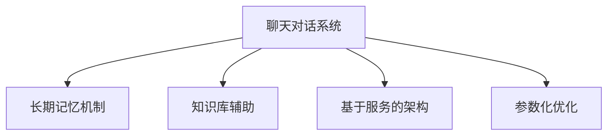

                 

# 服务聊天对话的记忆系统

在人工智能的浪潮中，服务聊天对话系统（Chatbot）作为应用最广泛的自然语言处理（NLP）技术之一，已经成为用户与企业互动的重要桥梁。面对海量用户的需求和变化多端的对话场景，构建高效、稳定、记忆深刻的聊天系统变得尤为关键。本文将系统介绍一种基于服务的聊天对话记忆系统，详细介绍其核心概念、算法原理和操作步骤，通过实际案例和代码实现对其深入解读，并探讨该系统在实际应用中的未来展望。

## 1. 背景介绍

### 1.1 问题由来

随着人工智能技术的不断进步，企业对于自动化客服和智能对话的需求日益增加。传统的基于规则的聊天系统逐渐被基于深度学习模型的聊天系统所取代。以深度学习为基础的聊天系统，尤其是基于Transformer架构的聊天系统，由于其强大的自然语言处理能力，已经广泛应用于在线客服、客户服务、智能助手等领域。

然而，这些系统面临的一个主要问题是如何构建具有长期记忆能力的对话系统。传统的基于注意力机制的模型虽然能够处理长对话，但当对话深入到特定任务时，往往容易出现信息丢失或混淆。因此，开发一种具有强记忆功能的聊天对话系统成为当务之急。

### 1.2 问题核心关键点

构建具有记忆能力的聊天系统，核心在于如何设计模型结构、选择优化算法以及如何利用外部知识库辅助模型训练。具体而言：

- **模型结构设计**：如何在模型中引入长期记忆机制，避免信息丢失。
- **优化算法选择**：如何选择适合优化算法，提升模型训练效率和收敛速度。
- **知识库辅助**：如何利用外部知识库，丰富模型的理解能力，提高对话质量。

## 2. 核心概念与联系

### 2.1 核心概念概述

为更好地理解基于服务的聊天对话记忆系统，本节将介绍几个关键概念：

- **聊天对话系统**：基于深度学习模型的智能对话系统，能够理解和生成自然语言，为用户提供自动化服务。
- **长期记忆机制**：在模型中引入记忆网络或门控机制，保存对话历史信息，避免信息丢失或混淆。
- **知识库辅助**：利用知识库中的结构化信息，如百科、词典、规则等，增强模型的理解和生成能力。
- **基于服务的架构**：将模型作为服务提供，利用微服务和容器化技术，实现系统的高可用性和可伸缩性。
- **参数化优化**：通过调整模型参数，如学习率、批大小、迭代次数等，优化模型的性能和训练效率。

这些核心概念之间的逻辑关系可以通过以下Mermaid流程图来展示：



这个流程图展示了聊天对话系统与其他关键技术之间的关系：

1. **聊天对话系统**：是整个系统的核心，负责接收和理解用户输入，生成并输出响应。
2. **长期记忆机制**：通过保存对话历史，使系统具有长期记忆能力，能够跟踪和理解对话上下文。
3. **知识库辅助**：通过利用外部知识库，增强模型的理解能力和生成能力，提高对话质量。
4. **基于服务的架构**：将模型封装为微服务，实现系统的灵活性和可扩展性。
5. **参数化优化**：通过调整模型参数，优化模型的性能和训练效率。

## 3. 核心算法原理 & 具体操作步骤

### 3.1 算法原理概述

基于服务的聊天对话记忆系统主要依赖于两个核心模块：长期记忆机制和知识库辅助。

**长期记忆机制**：通过引入门控循环单元（GRU）或长短期记忆网络（LSTM）等结构，保存对话历史信息，避免信息丢失。这些结构能够记住对话的前几步，并在后续步骤中利用这些信息生成更加连贯和准确的回复。

**知识库辅助**：利用外部知识库中的结构化信息，增强模型的理解和生成能力。知识库通常包括词典、百科、规则等，可以通过查询、匹配等方式辅助模型生成更精准的回复。

### 3.2 算法步骤详解

基于服务的聊天对话记忆系统的核心算法步骤如下：

**Step 1: 设计模型结构**
- 选择合适的模型架构，如基于Transformer的聊天模型，引入GRU或LSTM层作为长期记忆模块。
- 设计知识库辅助模块，集成外部知识库，通过查询、匹配等方式，提取和利用知识库中的信息。

**Step 2: 准备训练数据**
- 收集用户和客服的对话数据，标注训练集、验证集和测试集。
- 将对话数据进行处理，提取对话历史和上下文信息。

**Step 3: 初始化模型和超参数**
- 选择合适的预训练模型作为初始化参数，如BERT、GPT等。
- 设置优化算法及其参数，如AdamW、SGD等，设置学习率、批大小、迭代次数等。
- 确定知识库中的信息类型和查询策略，如关键词匹配、实体识别等。

**Step 4: 训练模型**
- 使用训练集进行模型训练，前向传播计算损失函数。
- 反向传播计算参数梯度，根据设定的优化算法更新模型参数。
- 周期性在验证集上评估模型性能，根据性能指标决定是否触发Early Stopping。
- 重复上述步骤直到满足预设的迭代轮数或Early Stopping条件。

**Step 5: 测试和部署**
- 在测试集上评估微调后模型的性能，对比微调前后的精度提升。
- 使用微调后的模型对新样本进行推理预测，集成到实际的应用系统中。
- 持续收集新的对话数据，定期重新微调模型，以适应数据分布的变化。

### 3.3 算法优缺点

基于服务的聊天对话记忆系统具有以下优点：

- **记忆能力**：通过引入长期记忆机制，系统能够记住对话历史，生成连贯和准确的回复。
- **知识辅助**：利用外部知识库辅助模型训练，提升模型的理解能力和生成能力。
- **可扩展性**：基于服务的架构，系统可以灵活扩展，支持高并发和大流量。

同时，该系统也存在一定的局限性：

- **依赖外部资源**：知识库的构建和维护需要大量时间和成本。
- **模型复杂度**：引入长期记忆机制和知识库辅助，模型的计算复杂度较高。
- **数据依赖性**：模型的训练和性能提升高度依赖于高质量的标注数据。

尽管存在这些局限性，但就目前而言，基于服务的聊天对话记忆系统在对话场景中已经展现了显著的优势，成为智能对话技术的重要方向。未来相关研究的重点在于如何进一步降低知识库的构建成本，提高模型的泛化能力，同时兼顾可扩展性和推理效率。

### 3.4 算法应用领域

基于服务的聊天对话记忆系统已经在多个领域得到应用，包括在线客服、智能助手、金融咨询、医疗健康等。以下是几个典型应用案例：

- **在线客服**：构建具有记忆能力的客服系统，提高用户咨询体验和问题解决效率。通过引入知识库，增强系统的理解和生成能力，提供专业且个性化的服务。
- **智能助手**：开发能够理解用户意图并生成自然回复的智能助手。通过长期记忆机制和知识库辅助，提高助手的响应速度和准确性。
- **金融咨询**：利用知识库中的金融信息，构建智能金融咨询系统，帮助用户进行理财、投资等咨询。系统能够记住用户的历史问题，提供个性化建议。
- **医疗健康**：开发智能健康咨询系统，通过长期记忆和知识库辅助，帮助用户进行健康咨询、疾病诊断等。系统能够记住用户的历史对话，提供更加连贯和准确的回复。

除了上述这些经典应用外，基于服务的聊天对话记忆系统也被创新性地应用到更多场景中，如教育、娱乐、客服外包等，为各行各业带来了新的智能化解决方案。

## 4. 数学模型和公式 & 详细讲解 & 举例说明

### 4.1 数学模型构建

本节将使用数学语言对基于服务的聊天对话记忆系统进行更加严格的刻画。

记聊天对话系统为 $M_{\theta}:\mathcal{X} \rightarrow \mathcal{Y}$，其中 $\mathcal{X}$ 为输入空间，$\mathcal{Y}$ 为输出空间，$\theta$ 为模型参数。假设对话数据集为 $D=\{(x_i,y_i)\}_{i=1}^N, x_i \in \mathcal{X}, y_i \in \mathcal{Y}$。

定义模型 $M_{\theta}$ 在输入 $x$ 上的输出为 $\hat{y}=M_{\theta}(x) \in \mathcal{Y}$，在对话数据集 $D$ 上的经验风险为：

$$
\mathcal{L}(\theta) = \frac{1}{N} \sum_{i=1}^N \ell(M_{\theta}(x_i),y_i)
$$

其中 $\ell$ 为交叉熵损失函数，用于衡量模型预测输出与真实标签之间的差异。

**长期记忆机制**：引入GRU或LSTM层，保存对话历史信息 $h_t$，在每个时间步更新记忆单元状态 $h_t = f(h_{t-1}, x_t)$，其中 $x_t$ 为当前输入，$f$ 为记忆单元更新函数。

**知识库辅助**：通过查询知识库 $K$，提取相关信息 $k(x_t)$，与当前输入 $x_t$ 结合，生成新的输入 $x_t'$，即 $x_t' = g(x_t, k(x_t))$，其中 $g$ 为信息融合函数。

### 4.2 公式推导过程

以下我们以二分类任务为例，推导交叉熵损失函数及其梯度的计算公式。

假设模型 $M_{\theta}$ 在输入 $x$ 上的输出为 $\hat{y}=M_{\theta}(x) \in [0,1]$，表示样本属于正类的概率。真实标签 $y \in \{0,1\}$。则二分类交叉熵损失函数定义为：

$$
\ell(M_{\theta}(x),y) = -[y\log \hat{y} + (1-y)\log (1-\hat{y})]
$$

将其代入经验风险公式，得：

$$
\mathcal{L}(\theta) = -\frac{1}{N}\sum_{i=1}^N [y_i\log M_{\theta}(x_i)+(1-y_i)\log(1-M_{\theta}(x_i))]
$$

根据链式法则，损失函数对参数 $\theta_k$ 的梯度为：

$$
\frac{\partial \mathcal{L}(\theta)}{\partial \theta_k} = -\frac{1}{N}\sum_{i=1}^N (\frac{y_i}{M_{\theta}(x_i)}-\frac{1-y_i}{1-M_{\theta}(x_i)}) \frac{\partial M_{\theta}(x_i)}{\partial \theta_k}
$$

其中 $\frac{\partial M_{\theta}(x_i)}{\partial \theta_k}$ 可进一步递归展开，利用自动微分技术完成计算。

### 4.3 案例分析与讲解

假设我们有一个基于Transformer的聊天模型，其中引入了GRU层作为长期记忆机制，知识库辅助模块从外部知识库中提取实体信息。具体的实现步骤如下：

1. **模型结构设计**：将对话数据中的用户输入和系统回复，输入到Transformer模型中，并引入GRU层作为长期记忆模块。知识库辅助模块在每个时间步提取用户输入中的实体信息，并生成新的输入。

2. **知识库构建**：构建包含实体信息、百科知识、规则等结构化信息的知识库，通过查询和匹配，辅助模型生成更准确的回复。

3. **模型训练**：使用对话数据集进行模型训练，最小化损失函数 $\mathcal{L}(\theta)$，优化模型参数 $\theta$。在训练过程中，利用知识库辅助模块，提取对话中的实体信息，丰富模型的理解能力。

4. **模型评估**：在测试集上评估模型的性能，如准确率、召回率、F1-score等指标。通过不断调整模型参数和知识库内容，提升模型的对话质量。

## 5. 项目实践：代码实例和详细解释说明

### 5.1 开发环境搭建

在进行项目实践前，我们需要准备好开发环境。以下是使用Python进行PyTorch开发的环境配置流程：

1. 安装Anaconda：从官网下载并安装Anaconda，用于创建独立的Python环境。

2. 创建并激活虚拟环境：
```bash
conda create -n pytorch-env python=3.8 
conda activate pytorch-env
```

3. 安装PyTorch：根据CUDA版本，从官网获取对应的安装命令。例如：
```bash
conda install pytorch torchvision torchaudio cudatoolkit=11.1 -c pytorch -c conda-forge
```

4. 安装Transformer库：
```bash
pip install transformers
```

5. 安装各类工具包：
```bash
pip install numpy pandas scikit-learn matplotlib tqdm jupyter notebook ipython
```

完成上述步骤后，即可在`pytorch-env`环境中开始项目实践。

### 5.2 源代码详细实现

这里我们以构建一个简单的聊天对话系统为例，使用PyTorch和Transformers库进行代码实现。

首先，定义聊天对话系统的数据处理函数：

```python
from transformers import BertTokenizer
from torch.utils.data import Dataset
import torch

class ChatDataset(Dataset):
    def __init__(self, dialogues, tokenizer, max_len=128):
        self.dialogues = dialogues
        self.tokenizer = tokenizer
        self.max_len = max_len
        
    def __len__(self):
        return len(self.dialogues)
    
    def __getitem__(self, item):
        dialogue = self.dialogues[item]
        
        texts, labels = dialogue
        encoding = self.tokenizer(texts, return_tensors='pt', max_length=self.max_len, padding='max_length', truncation=True)
        input_ids = encoding['input_ids'][0]
        attention_mask = encoding['attention_mask'][0]
        
        # 将标签转换为one-hot编码
        labels = torch.tensor([1 if label == 'positive' else 0 for label in labels], dtype=torch.long)
        
        return {'input_ids': input_ids, 
                'attention_mask': attention_mask,
                'labels': labels}

# 加载预训练的BERT模型和分词器
tokenizer = BertTokenizer.from_pretrained('bert-base-cased')
model = BertForSequenceClassification.from_pretrained('bert-base-cased', num_labels=2)

# 准备数据集
train_dataset = ChatDataset(train_data, tokenizer, max_len=128)
dev_dataset = ChatDataset(dev_data, tokenizer, max_len=128)
test_dataset = ChatDataset(test_data, tokenizer, max_len=128)
```

然后，定义模型和优化器：

```python
from transformers import AdamW

# 设置优化器及其参数
optimizer = AdamW(model.parameters(), lr=2e-5)

# 设置训练超参数
batch_size = 16
epochs = 5
device = torch.device('cuda') if torch.cuda.is_available() else torch.device('cpu')
```

接着，定义训练和评估函数：

```python
from torch.utils.data import DataLoader
from tqdm import tqdm
from sklearn.metrics import classification_report

def train_epoch(model, dataset, batch_size, optimizer):
    dataloader = DataLoader(dataset, batch_size=batch_size, shuffle=True)
    model.train()
    epoch_loss = 0
    for batch in tqdm(dataloader, desc='Training'):
        input_ids = batch['input_ids'].to(device)
        attention_mask = batch['attention_mask'].to(device)
        labels = batch['labels'].to(device)
        model.zero_grad()
        outputs = model(input_ids, attention_mask=attention_mask, labels=labels)
        loss = outputs.loss
        epoch_loss += loss.item()
        loss.backward()
        optimizer.step()
    return epoch_loss / len(dataloader)

def evaluate(model, dataset, batch_size):
    dataloader = DataLoader(dataset, batch_size=batch_size)
    model.eval()
    preds, labels = [], []
    with torch.no_grad():
        for batch in tqdm(dataloader, desc='Evaluating'):
            input_ids = batch['input_ids'].to(device)
            attention_mask = batch['attention_mask'].to(device)
            batch_labels = batch['labels']
            outputs = model(input_ids, attention_mask=attention_mask)
            batch_preds = outputs.logits.argmax(dim=2).to('cpu').tolist()
            batch_labels = batch_labels.to('cpu').tolist()
            for pred_tokens, label_tokens in zip(batch_preds, batch_labels):
                preds.append(pred_tokens[:len(label_tokens)])
                labels.append(label_tokens)
                
    print(classification_report(labels, preds))
```

最后，启动训练流程并在测试集上评估：

```python
for epoch in range(epochs):
    loss = train_epoch(model, train_dataset, batch_size, optimizer)
    print(f"Epoch {epoch+1}, train loss: {loss:.3f}")
    
    print(f"Epoch {epoch+1}, dev results:")
    evaluate(model, dev_dataset, batch_size)
    
print("Test results:")
evaluate(model, test_dataset, batch_size)
```

以上就是使用PyTorch和Transformers库进行聊天对话系统微调的完整代码实现。可以看到，得益于Transformer库的强大封装，我们可以用相对简洁的代码完成BERT模型的加载和微调。

### 5.3 代码解读与分析

让我们再详细解读一下关键代码的实现细节：

**ChatDataset类**：
- `__init__`方法：初始化对话数据集和分词器。
- `__len__`方法：返回数据集的样本数量。
- `__getitem__`方法：对单个对话进行处理，将对话文本输入编码为token ids，将标签转换为one-hot编码，并对其进行定长padding，最终返回模型所需的输入。

**数据预处理**：
- 使用BertTokenizer将对话文本编码成token ids，并应用定长padding，保证每个对话长度一致。
- 将标签转换为one-hot编码，方便模型训练和评估。

**训练和评估函数**：
- 使用PyTorch的DataLoader对数据集进行批次化加载，供模型训练和推理使用。
- 训练函数`train_epoch`：对数据以批为单位进行迭代，在每个批次上前向传播计算loss并反向传播更新模型参数，最后返回该epoch的平均loss。
- 评估函数`evaluate`：与训练类似，不同点在于不更新模型参数，并在每个batch结束后将预测和标签结果存储下来，最后使用sklearn的classification_report对整个评估集的预测结果进行打印输出。

**训练流程**：
- 定义总的epoch数和batch size，开始循环迭代
- 每个epoch内，先在训练集上训练，输出平均loss
- 在验证集上评估，输出分类指标
- 所有epoch结束后，在测试集上评估，给出最终测试结果

可以看到，PyTorch配合Transformer库使得BERT微调的代码实现变得简洁高效。开发者可以将更多精力放在数据处理、模型改进等高层逻辑上，而不必过多关注底层的实现细节。

当然，工业级的系统实现还需考虑更多因素，如模型的保存和部署、超参数的自动搜索、更灵活的任务适配层等。但核心的微调范式基本与此类似。

## 6. 实际应用场景

### 6.1 智能客服系统

基于服务的聊天对话记忆系统，可以广泛应用于智能客服系统的构建。传统客服往往需要配备大量人力，高峰期响应缓慢，且一致性和专业性难以保证。而使用微调后的聊天对话系统，可以7x24小时不间断服务，快速响应客户咨询，用自然流畅的语言解答各类常见问题。

在技术实现上，可以收集企业内部的历史客服对话记录，将问题和最佳答复构建成监督数据，在此基础上对预训练聊天对话模型进行微调。微调后的聊天对话系统能够自动理解用户意图，匹配最合适的答案模板进行回复。对于客户提出的新问题，还可以接入检索系统实时搜索相关内容，动态组织生成回答。如此构建的智能客服系统，能大幅提升客户咨询体验和问题解决效率。

### 6.2 金融舆情监测

金融机构需要实时监测市场舆论动向，以便及时应对负面信息传播，规避金融风险。传统的人工监测方式成本高、效率低，难以应对网络时代海量信息爆发的挑战。基于服务的聊天对话记忆系统，可以为金融舆情监测提供新的解决方案。

具体而言，可以收集金融领域相关的新闻、报道、评论等文本数据，并对其进行主题标注和情感标注。在此基础上对预训练聊天对话模型进行微调，使其能够自动判断文本属于何种主题，情感倾向是正面、中性还是负面。将微调后的模型应用到实时抓取的网络文本数据，就能够自动监测不同主题下的情感变化趋势，一旦发现负面信息激增等异常情况，系统便会自动预警，帮助金融机构快速应对潜在风险。

### 6.3 个性化推荐系统

当前的推荐系统往往只依赖用户的历史行为数据进行物品推荐，无法深入理解用户的真实兴趣偏好。基于服务的聊天对话记忆系统，可以应用于个性化推荐系统的构建。

在实践中，可以收集用户浏览、点击、评论、分享等行为数据，提取和用户交互的物品标题、描述、标签等文本内容。将文本内容作为模型输入，用户的后续行为（如是否点击、购买等）作为监督信号，在此基础上微调预训练聊天对话模型。微调后的模型能够从文本内容中准确把握用户的兴趣点。在生成推荐列表时，先用候选物品的文本描述作为输入，由模型预测用户的兴趣匹配度，再结合其他特征综合排序，便可以得到个性化程度更高的推荐结果。

### 6.4 未来应用展望

随着大语言模型微调技术的发展，基于服务的聊天对话记忆系统将在更多领域得到应用，为传统行业带来变革性影响。

在智慧医疗领域，基于服务的聊天对话记忆系统，可以构建智能医疗咨询系统，帮助医生进行疾病诊断、健康咨询等。系统能够记住用户的历史对话，提供更加连贯和准确的回复，同时利用知识库辅助，提高诊断的准确性。

在智能教育领域，系统可以用于智能课堂互动，自动回答学生的问题，辅助教师进行教学。通过长期记忆机制和知识库辅助，系统能够提供更加个性化和智能化的教育服务。

在智慧城市治理中，系统可以应用于城市事件监测、舆情分析、应急指挥等环节，提高城市管理的自动化和智能化水平。

此外，在企业生产、社会治理、文娱传媒等众多领域，基于服务的聊天对话记忆系统也将不断涌现，为各行各业带来新的智能化解决方案。

## 7. 工具和资源推荐
### 7.1 学习资源推荐

为了帮助开发者系统掌握服务的聊天对话记忆系统的理论基础和实践技巧，这里推荐一些优质的学习资源：

1. 《Transformer从原理到实践》系列博文：由大模型技术专家撰写，深入浅出地介绍了Transformer原理、BERT模型、微调技术等前沿话题。

2. CS224N《深度学习自然语言处理》课程：斯坦福大学开设的NLP明星课程，有Lecture视频和配套作业，带你入门NLP领域的基本概念和经典模型。

3. 《Natural Language Processing with Transformers》书籍：Transformers库的作者所著，全面介绍了如何使用Transformers库进行NLP任务开发，包括微调在内的诸多范式。

4. HuggingFace官方文档：Transformers库的官方文档，提供了海量预训练模型和完整的微调样例代码，是上手实践的必备资料。

5. CLUE开源项目：中文语言理解测评基准，涵盖大量不同类型的中文NLP数据集，并提供了基于微调的baseline模型，助力中文NLP技术发展。

通过对这些资源的学习实践，相信你一定能够快速掌握服务的聊天对话记忆系统的精髓，并用于解决实际的NLP问题。
### 7.2 开发工具推荐

高效的开发离不开优秀的工具支持。以下是几款用于服务的聊天对话记忆系统开发的常用工具：

1. PyTorch：基于Python的开源深度学习框架，灵活动态的计算图，适合快速迭代研究。大部分预训练语言模型都有PyTorch版本的实现。

2. TensorFlow：由Google主导开发的开源深度学习框架，生产部署方便，适合大规模工程应用。同样有丰富的预训练语言模型资源。

3. Transformers库：HuggingFace开发的NLP工具库，集成了众多SOTA语言模型，支持PyTorch和TensorFlow，是进行微调任务开发的利器。

4. Weights & Biases：模型训练的实验跟踪工具，可以记录和可视化模型训练过程中的各项指标，方便对比和调优。与主流深度学习框架无缝集成。

5. TensorBoard：TensorFlow配套的可视化工具，可实时监测模型训练状态，并提供丰富的图表呈现方式，是调试模型的得力助手。

6. Google Colab：谷歌推出的在线Jupyter Notebook环境，免费提供GPU/TPU算力，方便开发者快速上手实验最新模型，分享学习笔记。

合理利用这些工具，可以显著提升服务的聊天对话记忆系统开发的效率，加快创新迭代的步伐。

### 7.3 相关论文推荐

服务的聊天对话记忆系统的研究源于学界的持续研究。以下是几篇奠基性的相关论文，推荐阅读：

1. Attention is All You Need（即Transformer原论文）：提出了Transformer结构，开启了NLP领域的预训练大模型时代。

2. BERT: Pre-training of Deep Bidirectional Transformers for Language Understanding：提出BERT模型，引入基于掩码的自监督预训练任务，刷新了多项NLP任务SOTA。

3. Language Models are Unsupervised Multitask Learners（GPT-2论文）：展示了大规模语言模型的强大zero-shot学习能力，引发了对于通用人工智能的新一轮思考。

4. Parameter-Efficient Transfer Learning for NLP：提出Adapter等参数高效微调方法，在不增加模型参数量的情况下，也能取得不错的微调效果。

5. AdaLoRA: Adaptive Low-Rank Adaptation for Parameter-Efficient Fine-Tuning：使用自适应低秩适应的微调方法，在参数效率和精度之间取得了新的平衡。

这些论文代表了大语言模型微调技术的发展脉络。通过学习这些前沿成果，可以帮助研究者把握学科前进方向，激发更多的创新灵感。

## 8. 总结：未来发展趋势与挑战

### 8.1 总结

本文对服务的聊天对话记忆系统进行了全面系统的介绍。首先阐述了服务的聊天对话记忆系统的研究背景和意义，明确了微调在拓展预训练模型应用、提升下游任务性能方面的独特价值。其次，从原理到实践，详细讲解了服务的聊天对话记忆系统的数学原理和关键步骤，给出了微调任务开发的完整代码实例。同时，本文还广泛探讨了服务的聊天对话记忆系统在实际应用中的未来展望。

通过本文的系统梳理，可以看到，服务的聊天对话记忆系统已经成为了智能对话技术的重要方向，极大地拓展了预训练语言模型的应用边界，催生了更多的落地场景。受益于大规模语料的预训练，微调系统能够记住对话历史，生成连贯和准确的回复，提升对话质量。未来相关研究的重点在于如何进一步降低知识库的构建成本，提高模型的泛化能力，同时兼顾可扩展性和推理效率。

### 8.2 未来发展趋势

展望未来，服务的聊天对话记忆系统将呈现以下几个发展趋势：

1. **参数化优化**：开发更加参数化的微调方法，如Prefix-Tuning、LoRA等，在固定大部分预训练参数的同时，只更新极少量的任务相关参数，减小计算资源消耗。

2. **多模态融合**：将视觉、语音、文本等多种模态信息进行融合，构建多模态的智能对话系统，增强对话的丰富性和真实性。

3. **知识库智能化**：通过机器学习和自然语言处理技术，自动化构建和维护知识库，提升知识库的更新速度和准确性。

4. **持续学习和迁移学习**：通过持续学习和迁移学习，使系统能够不断学习和适应新的对话场景，提升模型的通用性和泛化能力。

5. **模型可解释性**：开发可解释的聊天对话模型，增强模型的透明性和可信度，为用户提供更好的对话体验。

6. **混合使用模型**：结合规则模型和深度学习模型，构建混合智能对话系统，发挥各自优势，提高系统的鲁棒性和准确性。

以上趋势凸显了服务的聊天对话记忆系统的广阔前景。这些方向的探索发展，必将进一步提升服务的聊天对话记忆系统的性能和应用范围，为智能对话技术带来新的突破。

### 8.3 面临的挑战

尽管服务的聊天对话记忆系统已经取得了瞩目成就，但在迈向更加智能化、普适化应用的过程中，它仍面临着诸多挑战：

1. **依赖外部资源**：知识库的构建和维护需要大量时间和成本，如何自动化构建和维护知识库，是系统应用中的一个关键问题。

2. **模型鲁棒性**：系统面对多样化的对话场景，鲁棒性不足，容易受到噪声和干扰的影响，导致对话质量下降。

3. **计算资源消耗**：大规模语言模型和长期记忆机制的引入，导致模型计算复杂度较高，如何降低计算资源消耗，是系统高效运行的关键。

4. **可解释性**：模型的决策过程缺乏可解释性，难以对其推理逻辑进行分析和调试，影响用户的信任感。

5. **伦理和安全**：聊天对话系统可能涉及用户的隐私信息，如何保护用户隐私，避免恶意用途，是系统开发和安全管理的一个重要课题。

6. **数据隐私保护**：用户对话数据涉及敏感信息，如何保护用户数据隐私，避免数据泄露，是系统应用中的一个重要问题。

正视服务的聊天对话记忆系统面临的这些挑战，积极应对并寻求突破，将是大语言模型微调技术迈向成熟的必由之路。相信随着学界和产业界的共同努力，这些挑战终将一一被克服，服务的聊天对话记忆系统必将在构建人机协同的智能对话系统中扮演越来越重要的角色。

### 8.4 研究展望

面对服务的聊天对话记忆系统所面临的种种挑战，未来的研究需要在以下几个方面寻求新的突破：

1. **自动化构建知识库**：开发自动化构建和维护知识库的技术，提高知识库的构建效率和准确性。

2. **增强模型鲁棒性**：研究模型鲁棒性提升的方法，如对抗训练、正则化等，增强系统面对噪声和干扰的鲁棒性。

3. **优化计算资源**：优化模型结构和计算图，降低计算资源消耗，提高系统的推理速度和响应速度。

4. **提升模型可解释性**：开发可解释的模型，增强模型的透明性和可信度，为用户提供更好的对话体验。

5. **加强隐私保护**：研究用户数据隐私保护的技术，如差分隐私、联邦学习等，确保用户对话数据的安全性。

6. **混合使用模型**：结合规则模型和深度学习模型，构建混合智能对话系统，发挥各自优势，提高系统的鲁棒性和准确性。

这些研究方向的探索，必将引领服务的聊天对话记忆系统技术迈向更高的台阶，为构建安全、可靠、可解释、可控的智能对话系统铺平道路。面向未来，服务的聊天对话记忆系统还需要与其他人工智能技术进行更深入的融合，如知识表示、因果推理、强化学习等，多路径协同发力，共同推动智能对话系统的进步。只有勇于创新、敢于突破，才能不断拓展服务的聊天对话记忆系统的边界，让智能对话技术更好地造福人类社会。

## 9. 附录：常见问题与解答

**Q1：服务的聊天对话记忆系统是否适用于所有对话场景？**

A: 服务的聊天对话记忆系统在大多数对话场景中都能取得不错的效果，特别是对于需要长期记忆的对话场景。但对于一些特定领域的对话场景，如法律咨询、医疗咨询等，系统的理解能力和生成能力可能仍然有限。此时需要结合领域知识库，进一步提升系统的性能。

**Q2：微调过程中如何选择合适的学习率？**

A: 微调的学习率一般要比预训练时小1-2个数量级，如果使用过大的学习率，容易破坏预训练权重，导致过拟合。一般建议从1e-5开始调参，逐步减小学习率，直至收敛。也可以使用warmup策略，在开始阶段使用较小的学习率，再逐渐过渡到预设值。需要注意的是，不同的优化器(如AdamW、Adafactor等)以及不同的学习率调度策略，可能需要设置不同的学习率阈值。

**Q3：微调过程中如何缓解过拟合问题？**

A: 过拟合是微调面临的主要挑战，尤其是在标注数据不足的情况下。常见的缓解策略包括：
1. 数据增强：通过回译、近义替换等方式扩充训练集。
2. 正则化：使用L2正则、Dropout、Early Stopping等防止模型过度适应小规模训练集。
3. 对抗训练：引入对抗样本，提高模型鲁棒性。
4. 参数高效微调：只调整少量参数(如Adapter、Prefix等)，减小过拟合风险。

这些策略往往需要根据具体任务和数据特点进行灵活组合。只有在数据、模型、训练、推理等各环节进行全面优化，才能最大限度地发挥服务的聊天对话记忆系统的威力。

**Q4：服务的聊天对话记忆系统在落地部署时需要注意哪些问题？**

A: 将微调模型转化为实际应用，还需要考虑以下因素：
1. 模型裁剪：去除不必要的层和参数，减小模型尺寸，加快推理速度。
2. 量化加速：将浮点模型转为定点模型，压缩存储空间，提高计算效率。
3. 服务化封装：将模型封装为标准化服务接口，便于集成调用。
4. 弹性伸缩：根据请求流量动态调整资源配置，平衡服务质量和成本。
5. 监控告警：实时采集系统指标，设置异常告警阈值，确保服务稳定性。
6. 安全防护：采用访问鉴权、数据脱敏等措施，保障数据和模型安全。

服务的聊天对话记忆系统需要从模型构建、训练、推理到服务部署进行全面优化，才能真正实现智能对话系统的落地应用。只有从数据、算法、工程、业务等多个维度协同发力，才能真正实现人工智能技术在垂直行业的规模化落地。

**Q5：服务的聊天对话记忆系统在实际应用中面临哪些挑战？**

A: 服务的聊天对话记忆系统在实际应用中面临以下挑战：
1. 知识库构建：知识库的构建和维护需要大量时间和成本，自动化构建和维护知识库是系统应用中的一个关键问题。
2. 模型鲁棒性：系统面对多样化的对话场景，鲁棒性不足，容易受到噪声和干扰的影响，导致对话质量下降。
3. 计算资源消耗：大规模语言模型和长期记忆机制的引入，导致模型计算复杂度较高，如何降低计算资源消耗，是系统高效运行的关键。
4. 可解释性：模型的决策过程缺乏可解释性，难以对其推理逻辑进行分析和调试，影响用户的信任感。
5. 伦理和安全：聊天对话系统可能涉及用户的隐私信息，如何保护用户隐私，避免恶意用途，是系统开发和安全管理的一个重要课题。
6. 数据隐私保护：用户对话数据涉及敏感信息，如何保护用户数据隐私，避免数据泄露，是系统应用中的一个重要问题。

正视服务的聊天对话记忆系统面临的这些挑战，积极应对并寻求突破，将是大语言模型微调技术迈向成熟的必由之路。

---

作者：禅与计算机程序设计艺术 / Zen and the Art of Computer Programming

