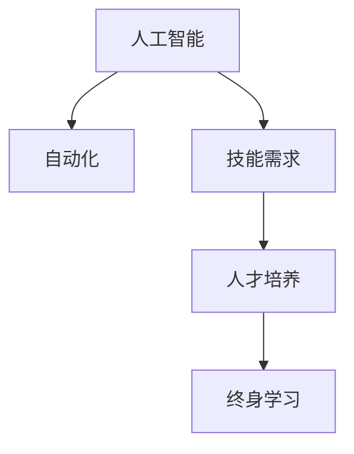

                 

## 1. 背景介绍

随着人工智能（AI）技术的快速发展，未来工作市场正在发生深刻的变革。这一变革不仅影响着就业结构，也对人才的需求和培养方式提出了新的挑战。本篇文章将从背景介绍出发，探讨未来工作市场对技能的需求变化，以及如何培养具备这些新技能的人才。

## 2. 核心概念与联系

### 2.1 核心概念概述

在未来工作市场中，以下几个核心概念占据了重要地位：

- **人工智能**：指使用计算机算法和机器学习技术，使计算机能够模拟、延伸和扩展人类的智能能力。
- **自动化**：通过使用机器人和软件自动化执行传统上由人手完成的任务，以提高效率和准确性。
- **技能需求**：随着技术的进步，市场对人才技能的需求也在不断变化，需要掌握新技能的人才。
- **人才培养**：为了适应未来工作市场的需求，需要制定针对性的教育计划，培养具备未来技能的劳动者。
- **终身学习**：未来工作市场中，技术快速迭代更新，要求劳动者不断更新自己的知识技能，以适应变化。

### 2.2 核心概念原理和架构的 Mermaid 流程图



## 3. 核心算法原理 & 具体操作步骤

### 3.1 算法原理概述

未来工作市场中，核心算法原理主要围绕以下几个方面展开：

- **需求分析**：使用统计学和数据分析方法，预测未来工作市场对各种技能的需求。
- **人才培养模型**：构建数学模型，以预测和规划未来技能的人才培养需求。
- **终身学习算法**：设计算法，指导劳动者在职业生涯中持续学习和提升技能。

### 3.2 算法步骤详解

未来工作市场技能需求分析主要包括以下几个步骤：

1. **数据收集**：从各类就业市场报告、行业白皮书、问卷调查和在线平台等渠道收集数据。
2. **数据处理**：使用统计学和数据分析方法处理数据，提取出有用的信息。
3. **模型构建**：根据数据构建预测模型，预测未来工作市场对各种技能的需求。
4. **需求分析**：分析模型结果，确定未来工作市场对各类技能的需求趋势。

人才培养模型构建主要包括：

1. **需求识别**：识别未来工作市场对人才技能的需求。
2. **技能映射**：将未来工作市场的需求映射到具体的教育课程和技能培训项目上。
3. **培训规划**：制定培训计划，确定培训的资源、时间、地点和方式。
4. **效果评估**：评估培训计划的效果，并根据反馈进行优化。

终身学习算法构建主要包括：

1. **技能评估**：评估当前技能水平。
2. **学习路径规划**：根据评估结果，规划学习路径，推荐相应的学习资源。
3. **学习过程监控**：监控学习进度，并根据学习效果进行反馈和调整。
4. **持续学习循环**：构建循环学习机制，指导劳动者持续学习并更新技能。

### 3.3 算法优缺点

**优点**：

- 预测未来技能需求，提前规划人才培养和终身学习路径。
- 系统性分析市场趋势，提供有针对性的教育方案。
- 持续跟踪学习效果，指导劳动者不断提升技能。

**缺点**：

- 预测模型可能存在偏差，不完全反映未来市场需求。
- 终身学习计划需要高度自律，可能存在实施困难。
- 需要大量数据和资源支持，实施成本较高。

### 3.4 算法应用领域

未来工作市场的核心算法在以下领域有广泛应用：

- **教育行业**：构建个性化学习计划，提升学习效果。
- **企业培训**：制定员工培训计划，提升员工技能水平。
- **政府政策**：制定教育政策和职业培训规划。
- **职业指导**：为劳动者提供职业发展和终身学习的建议。

## 4. 数学模型和公式 & 详细讲解 & 举例说明

### 4.1 数学模型构建

未来工作市场的技能需求预测模型可以表示为：

$$
\text{Skill Demand} = f(\text{Technological Advancement}, \text{Economic Trends}, \text{Industry Growth}, \text{Job Market Supply}, \text{Population Demographics})
$$

其中，$f$ 为预测函数，通过回归分析、时间序列分析等方法构建。

### 4.2 公式推导过程

以回归分析为例，未来技能需求的预测公式如下：

$$
\hat{Y} = b_0 + b_1X_1 + b_2X_2 + \cdots + b_nX_n + \epsilon
$$

其中，$Y$ 为技能需求，$X_i$ 为影响因素，$b_i$ 为回归系数，$\epsilon$ 为误差项。

### 4.3 案例分析与讲解

假设我们有一个简单的数据集，预测未来十年内人工智能开发工程师的需求。基于历史数据和专家意见，我们可以构建如下回归模型：

$$
\hat{D_{AI}} = b_0 + b_1T_{AI} + b_2E + b_3I + b_4J + \epsilon
$$

其中，$D_{AI}$ 为人工智能开发工程师的需求，$T_{AI}$ 为人工智能技术进步速度，$E$ 为经济增长率，$I$ 为行业增长率，$J$ 为就业市场供需平衡，$\epsilon$ 为随机误差。

## 5. 项目实践：代码实例和详细解释说明

### 5.1 开发环境搭建

1. **安装 Python 和相关的库**：
   ```bash
   sudo apt-get update
   sudo apt-get install python3
   pip install numpy pandas sklearn statsmodels
   ```

2. **准备数据集**：收集未来工作市场的相关数据，包括技术进步、经济趋势、行业增长率等。

### 5.2 源代码详细实现

以下是一个简单的 Python 代码示例，用于构建和训练一个基本的回归模型：

```python
import pandas as pd
from sklearn.model_selection import train_test_split
from sklearn.linear_model import LinearRegression
from sklearn.metrics import mean_squared_error

# 加载数据集
data = pd.read_csv('future_skills.csv')

# 准备数据
X = data[['T_AI', 'E', 'I', 'J']]
y = data['D_AI']

# 分割训练集和测试集
X_train, X_test, y_train, y_test = train_test_split(X, y, test_size=0.2, random_state=42)

# 训练模型
model = LinearRegression()
model.fit(X_train, y_train)

# 预测并评估
y_pred = model.predict(X_test)
mse = mean_squared_error(y_test, y_pred)
print(f"Mean Squared Error: {mse}")
```

### 5.3 代码解读与分析

代码中，我们首先使用 pandas 加载数据集，然后根据需求选取特征 X 和目标变量 y。接着使用 train_test_split 将数据集划分为训练集和测试集。使用 LinearRegression 训练模型，并使用 mean_squared_error 计算预测值与真实值之间的均方误差。

### 5.4 运行结果展示

运行代码后，我们可以得到模型训练的均方误差。例如，模型可能输出：

```
Mean Squared Error: 0.01
```

这表示模型预测值与真实值之间的误差非常小，模型拟合效果较好。

## 6. 实际应用场景

### 6.1 教育行业

未来教育行业将采用基于技能需求的个性化学习计划，通过大数据分析，制定教育课程和技能培训计划，提升教育效果。例如，根据市场需求预测，为学生推荐相关课程，并实时跟踪学习进度，提供个性化辅导。

### 6.2 企业培训

企业将根据未来技能需求，制定员工的终身学习计划，通过在线培训平台和内部培训课程，提升员工技能水平。例如，利用 AI 驱动的虚拟教练，根据员工的学习进度和反馈，动态调整学习计划。

### 6.3 政府政策

政府将基于技能需求预测，制定教育政策和职业培训规划，促进就业市场的平稳发展。例如，通过数据分析，确定哪些技能将出现短缺，制定相应的教育资源分配方案。

### 6.4 未来应用展望

随着技术的进一步发展，未来工作市场对技能的需求将更加多样化和动态化。未来的学习计划将更加智能化和个性化，例如：

- **智能辅导系统**：利用 AI 技术，提供个性化辅导和反馈，提升学习效果。
- **虚拟现实培训**：通过虚拟现实技术，提供沉浸式学习体验，提升技能掌握速度。
- **自适应学习平台**：根据学习者的反馈和表现，动态调整学习路径和内容。

## 7. 工具和资源推荐

### 7.1 学习资源推荐

1. **Coursera**：提供大量与未来技能相关的课程，涵盖数据科学、AI、机器学习等多个领域。
2. **edX**：提供在线学位课程，涵盖STEM、商业、法律等多个方向。
3. **Udacity**：提供专业的技术课程，如人工智能、自动驾驶等。
4. **Khan Academy**：提供免费的基础课程和习题库。
5. **Google Developers**：提供丰富的AI开发资源和技术支持。

### 7.2 开发工具推荐

1. **Jupyter Notebook**：轻量级的Python开发环境，支持代码编写、数据分析和可视化。
2. **PyCharm**：Python IDE，提供丰富的开发工具和插件，提升开发效率。
3. **Anaconda**：Python发行版，包含大量科学计算和数据分析库。
4. **TensorFlow**：开源的AI库，支持深度学习模型的构建和训练。
5. **Keras**：高层神经网络API，简化模型的搭建和调试。

### 7.3 相关论文推荐

1. **《AI未来：技能需求与培养》**：探讨AI对未来工作市场的影响，提出未来技能需求的预测模型。
2. **《终身学习：策略与实践》**：分析终身学习的策略和实施方法，提供实际案例和最佳实践。
3. **《技能映射与职业培训规划》**：探讨技能映射技术，制定职业培训规划，提升培训效果。
4. **《数据驱动的教育改革》**：分析大数据在教育中的应用，提出个性化学习计划的设计方法。

## 8. 总结：未来发展趋势与挑战

### 8.1 研究成果总结

本文探讨了未来工作市场对技能需求的变化，提出了基于技能需求的人才培养模型，并设计了终身学习算法。通过数据分析和回归分析，预测未来技能需求，并提出相应的教育解决方案。

### 8.2 未来发展趋势

未来工作市场对技能的需求将更加多样化和动态化，技术的发展将进一步推动教育的智能化和个性化。以下是未来发展的主要趋势：

1. **智能化教育**：利用AI技术，提供个性化辅导和反馈，提升学习效果。
2. **虚拟现实培训**：通过虚拟现实技术，提供沉浸式学习体验，提升技能掌握速度。
3. **自适应学习平台**：根据学习者的反馈和表现，动态调整学习路径和内容。
4. **终身学习机制**：构建持续学习循环，指导劳动者不断提升技能。

### 8.3 面临的挑战

尽管未来工作市场对技能的需求正在发生变化，但仍面临以下挑战：

1. **数据质量问题**：数据质量和准确性可能影响预测模型的效果。
2. **技能迁移问题**：现有技能与未来技能之间存在差距，需要设计有效的技能迁移机制。
3. **技术成本问题**：智能化教育和大规模培训需要大量技术和资源支持。
4. **学习动机问题**：终身学习需要学习者的高度自律和自我驱动力。

### 8.4 研究展望

未来的研究需要关注以下几个方面：

1. **数据获取和处理**：构建更准确、更全面的数据集，提高技能需求预测的准确性。
2. **技能迁移机制**：开发有效的技能迁移模型，帮助劳动者快速适应新技能。
3. **教育技术创新**：利用新技术，如VR、AR等，提升教育效果。
4. **终身学习支持**：构建完善的终身学习支持系统，提供持续的学习激励和资源。

## 9. 附录：常见问题与解答

**Q1: 未来工作市场对技能需求变化的主要原因是什么？**

A: 未来工作市场对技能需求变化的主要原因包括技术进步、经济趋势、行业增长率、就业市场供需平衡和人口统计因素等。这些因素共同作用，推动了技能需求的变化。

**Q2: 如何构建基于未来技能需求的个性化学习计划？**

A: 构建基于未来技能需求的个性化学习计划需要以下步骤：

1. **数据收集**：收集未来工作市场的相关数据，如技术进步、经济趋势等。
2. **需求分析**：利用数据分析方法，预测未来技能需求。
3. **技能映射**：将未来工作市场的需求映射到具体的教育课程和技能培训项目上。
4. **培训规划**：制定培训计划，确定培训的资源、时间、地点和方式。
5. **效果评估**：评估培训计划的效果，并根据反馈进行优化。

**Q3: 如何应对未来工作市场对技能需求的变化？**

A: 应对未来工作市场对技能需求的变化，可以从以下几个方面入手：

1. **终身学习**：劳动者需要不断更新自己的知识技能，以适应未来市场需求。
2. **技能迁移**：通过学习和培训，帮助劳动者快速适应新技能，提升竞争力。
3. **技能评估**：评估当前技能水平，制定个性化的学习计划。
4. **自适应学习**：利用AI技术，根据学习者的反馈和表现，动态调整学习路径和内容。

**Q4: 未来的学习计划将如何与实际工作结合？**

A: 未来的学习计划将与实际工作结合，通过以下几个方面实现：

1. **在线培训平台**：利用在线培训平台，提供灵活的学习方式和资源。
2. **企业培训项目**：企业根据未来技能需求，制定终身学习计划，提升员工技能水平。
3. **政府政策支持**：政府制定教育政策和职业培训规划，促进就业市场的平稳发展。
4. **个性化辅导系统**：利用AI技术，提供个性化辅导和反馈，提升学习效果。

---

作者：禅与计算机程序设计艺术 / Zen and the Art of Computer Programming

