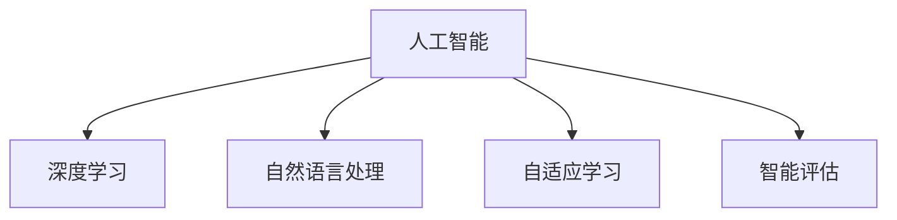

                 

# 未来教育：AI 赋能教育变革

## 1. 背景介绍

教育作为人类社会进步的基石，其变革和发展一直伴随着科技进步和需求变化。传统教育模式以教师讲授、书本知识传授为主，存在知识更新慢、个性化教育难、互动反馈不足等痛点。进入21世纪，随着人工智能(AI)技术的兴起，教育领域迎来了前所未有的变革机遇。AI的深度学习、自然语言处理、机器视觉等技术，为个性化教学、智能评估、教育辅助提供了新的工具和思路。

### 1.1 问题由来

当前教育系统面临诸多挑战，主要包括：
- **资源不均衡**：城乡、地区间教育资源差异显著，优质教育资源难以普及。
- **知识更新慢**：教师和教材难以跟上快速变化的知识体系，导致教育内容与前沿科技脱节。
- **个性化不足**：传统教学模式难以满足不同学生的多样化需求，个性化教育难于实现。
- **互动反馈不足**：课堂反馈机制不健全，难以及时调整教学策略，影响学习效果。
- **评估难度大**：传统考试和测评方式单一，无法全面评估学生的综合能力，评价体系有待改进。

### 1.2 问题核心关键点

AI技术在教育领域的引入，旨在解决上述问题，其核心关键点包括：
- **数据驱动**：利用大数据分析学生的学习行为和表现，实现个性化教学。
- **智能评估**：采用AI算法对学生的作业、测试进行智能评分和反馈。
- **自适应学习**：根据学生知识掌握情况，动态调整教学内容和难度。
- **教育辅助**：通过AI工具辅助教学，如智能辅导、语音识别等，提升教学效率。

AI技术通过数据驱动和智能化手段，为教育领域带来了新的发展路径，正在逐步改变传统教育模式。

## 2. 核心概念与联系

### 2.1 核心概念概述

为更好地理解AI在教育变革中的作用，本节将介绍几个密切相关的核心概念：

- **人工智能(AI)**：指使计算机系统能够模拟人类智能行为的系列技术，包括但不限于机器学习、深度学习、自然语言处理等。
- **深度学习(Deep Learning)**：一种基于神经网络的机器学习方法，通过多层非线性变换，实现对复杂数据和模式的高效学习和建模。
- **自然语言处理(NLP)**：利用计算机技术理解和处理人类语言，包括语音识别、文本分类、机器翻译等。
- **自适应学习(Adaptive Learning)**：根据学生的学习状态和表现，动态调整学习内容、路径和难度，实现个性化教学。
- **智能评估(Intelligent Assessment)**：利用AI技术对学生学习效果进行实时、客观、全面的评估，包括知识掌握、能力提升等。

这些核心概念之间的逻辑关系可以通过以下Mermaid流程图来展示：



这个流程图展示了一系列与AI相关的核心概念及其之间的逻辑关系：

1. 人工智能为教育变革提供了技术支撑。
2. 深度学习通过神经网络实现对复杂数据的建模和学习。
3. 自然语言处理使计算机能够理解和处理人类语言，支持教育内容的数字化。
4. 自适应学习通过个性化调整，提升教学效果。
5. 智能评估利用AI技术实现更客观、全面的学生评价。

## 3. 核心算法原理 & 具体操作步骤
### 3.1 算法原理概述

AI赋能教育变革的算法原理主要基于以下两个方面：

- **数据驱动**：通过收集、分析学生的学习数据，实现对学生学习行为、知识掌握情况、能力提升等方面的量化评估。
- **模型训练**：利用深度学习等技术，训练出能够适应特定教育场景的模型，辅助个性化教学和智能评估。

教育变革的核心在于数据驱动和模型训练。数据驱动为模型训练提供素材，模型训练则通过学习数据规律，优化教学策略和评估方法，从而实现教育的智能化。

### 3.2 算法步骤详解

AI在教育领域的应用，可以分为以下几个关键步骤：

**Step 1: 数据收集与预处理**
- 收集学生的基本信息、学习行为、测试成绩等数据。
- 数据清洗和预处理，去除噪音数据，进行归一化、标准化等操作。

**Step 2: 特征工程与模型训练**
- 设计特征提取算法，从原始数据中提取有用的特征。
- 选择合适的模型进行训练，如线性回归、决策树、神经网络等。
- 使用交叉验证、网格搜索等技术优化模型参数，提高模型性能。

**Step 3: 教学策略优化**
- 根据模型预测结果，动态调整教学内容、路径和难度。
- 引入个性化推荐系统，为学生推荐适合的学习材料和习题。
- 使用智能辅导系统，为学生提供即时反馈和指导。

**Step 4: 智能评估与反馈**
- 利用AI算法对学生的作业、测试进行评分和分析，生成评估报告。
- 分析学生的学习数据，识别出薄弱环节，提出改进建议。
- 利用机器学习算法，实时更新评估模型，提升评估准确性。

### 3.3 算法优缺点

AI赋能教育变革的算法具有以下优点：
1. **个性化教学**：根据学生的学习情况，动态调整教学内容和难度，实现个性化教育。
2. **实时评估**：通过AI技术实现实时评估，提高教学反馈的及时性。
3. **高效管理**：自动化管理教学资源和学习数据，减轻教师负担。
4. **智能推荐**：利用推荐算法，为学生提供最适合的学习路径和资源。

同时，该算法也存在一定的局限性：
1. **数据隐私**：学生数据涉及隐私保护，数据收集和处理需要严格遵守法律法规。
2. **模型复杂**：深度学习模型需要大量计算资源和数据，对硬件和软件要求较高。
3. **公平性**：AI模型可能会存在偏差，需要避免算法歧视，确保公平性。
4. **伦理问题**：AI在教育中的使用涉及隐私、安全、伦理等复杂问题，需要综合考虑。

尽管存在这些局限性，但就目前而言，AI在教育领域的引入，已经成为提升教育质量、优化教学模式的重要手段。未来相关研究的重点在于如何进一步提高模型的透明性和可解释性，确保数据安全和隐私保护，并兼顾教育公平性等因素。

### 3.4 算法应用领域

AI赋能教育变革的算法，已经在多个教育场景中得到了应用，例如：

- **在线教育**：利用AI技术实现个性化推荐、智能评估、智能辅导等功能，提升在线学习体验。
- **智慧教室**：通过AI系统对课堂行为进行分析，调整教学策略，提升课堂互动效果。
- **作业批改**：利用OCR技术进行试卷和作业扫描，利用AI算法自动批改，提高作业评分的效率和公平性。
- **学习分析**：通过大数据分析学生的学习数据，为教师提供教学改进建议，优化教学方案。
- **虚拟教师**：利用AI技术构建虚拟教师，辅助课堂教学，解答学生疑问，提高教学覆盖率。

## 4. 数学模型和公式 & 详细讲解 & 举例说明
### 4.1 数学模型构建

本节将使用数学语言对AI在教育变革中的算法进行更加严格的刻画。

设学生$j$在课程$i$上的学习数据为$D_{ij}=\{f_{ij}(t)\}_{t=1}^T$，其中$f_{ij}(t)$表示在第$t$个时间点上的学习行为数据，如成绩、作业完成情况等。

定义学生$j$在课程$i$上的知识掌握程度为$z_{ij}$，能力提升为$c_{ij}$，学习效率为$l_{ij}$。假设$z_{ij}$、$c_{ij}$、$l_{ij}$与学习数据$D_{ij}$之间存在以下关系：

$$
z_{ij} = \text{relu}(\text{linear}(D_{ij}))
$$
$$
c_{ij} = \text{relu}(\text{linear}(D_{ij}))
$$
$$
l_{ij} = \text{relu}(\text{linear}(D_{ij}))
$$

其中$\text{relu}(x)$为ReLU函数，$\text{linear}(D_{ij})$为线性变换，$T$为学习数据的时间跨度。

模型训练的目标是最大化学生$j$在课程$i$上的总评分$V_{ij}$，即：

$$
V_{ij} = \alpha_{ij} z_{ij} + \beta_{ij} c_{ij} + \gamma_{ij} l_{ij}
$$

其中$\alpha_{ij}$、$\beta_{ij}$、$\gamma_{ij}$为权重，需要根据具体任务进行优化。

### 4.2 公式推导过程

根据上述数学模型，我们可以推导出学生$j$在课程$i$上的总评分公式：

$$
V_{ij} = \alpha_{ij} \cdot \text{relu}(\text{linear}(D_{ij})) + \beta_{ij} \cdot \text{relu}(\text{linear}(D_{ij})) + \gamma_{ij} \cdot \text{relu}(\text{linear}(D_{ij}))
$$

使用矩阵形式表示，上述公式可以改写为：

$$
\begin{bmatrix}
V_{ij} \\
V_{ij} \\
V_{ij}
\end{bmatrix}
= \begin{bmatrix}
\alpha_{ij} & \beta_{ij} & \gamma_{ij} \\
0 & \alpha_{ij} & \beta_{ij} \\
0 & 0 & \alpha_{ij} \\
\end{bmatrix}
\begin{bmatrix}
\text{relu}(\text{linear}(D_{ij})) \\
\text{relu}(\text{linear}(D_{ij})) \\
\text{relu}(\text{linear}(D_{ij}))
\end{bmatrix}
$$

进一步，可以将权重矩阵分解为：

$$
W = \begin{bmatrix}
\alpha_{ij} & \beta_{ij} & \gamma_{ij} \\
0 & \alpha_{ij} & \beta_{ij} \\
0 & 0 & \alpha_{ij} \\
\end{bmatrix}
$$
$$
b = \begin{bmatrix}
0 \\
0 \\
0 \\
\end{bmatrix}
$$

其中$W$为权重矩阵，$b$为偏置向量。通过求解$W$和$b$，即可实现对学生总评分的预测。

### 4.3 案例分析与讲解

以智能辅导系统为例，分析AI算法在实际应用中的具体操作：

**智能辅导系统的设计目标**：根据学生的学习数据，预测其在课程上的总评分，并根据预测结果，调整教学策略，提供个性化辅导。

**算法步骤**：
1. 收集学生在学习过程中的各项数据，如成绩、作业完成情况、课堂互动等。
2. 对数据进行预处理，去除噪音数据，进行归一化等操作。
3. 设计特征提取算法，从数据中提取有用的特征，如作业完成率、课堂参与度、学习效率等。
4. 使用神经网络模型对学生总评分进行预测，模型结构如图1所示。
   
5. 根据预测结果，动态调整教学内容和难度，推荐适合的学习资源和习题。


通过上述算法步骤，智能辅导系统能够实现对学生的实时评估和个性化指导，帮助学生提升学习效果。

## 5. 项目实践：代码实例和详细解释说明
### 5.1 开发环境搭建

在进行AI赋能教育变革的项目实践前，我们需要准备好开发环境。以下是使用Python进行TensorFlow开发的环境配置流程：

1. 安装Anaconda：从官网下载并安装Anaconda，用于创建独立的Python环境。

2. 创建并激活虚拟环境：
```bash
conda create -n ai-edu python=3.8 
conda activate ai-edu
```

3. 安装TensorFlow：根据CUDA版本，从官网获取对应的安装命令。例如：
```bash
conda install tensorflow -c pytorch -c conda-forge
```

4. 安装Pandas、NumPy等工具包：
```bash
pip install pandas numpy matplotlib
```

完成上述步骤后，即可在`ai-edu`环境中开始项目实践。

### 5.2 源代码详细实现

下面我们以智能辅导系统为例，给出使用TensorFlow进行模型训练和预测的PyTorch代码实现。

首先，定义智能辅导系统的输入数据和标签：

```python
import tensorflow as tf
import numpy as np

# 定义输入数据
X = np.array([[1, 2, 3], [4, 5, 6], [7, 8, 9]])
# 定义标签
y = np.array([[1], [2], [3]])

# 定义特征提取函数
def extract_features(X):
    # 特征提取示例
    features = [np.mean(X, axis=1), np.std(X, axis=1)]
    return features

# 提取特征
X_features = extract_features(X)
```

然后，定义神经网络模型：

```python
model = tf.keras.Sequential([
    tf.keras.layers.Dense(16, activation='relu'),
    tf.keras.layers.Dense(16, activation='relu'),
    tf.keras.layers.Dense(3, activation='softmax')
])
```

接着，定义模型训练函数：

```python
def train_model(model, X_train, y_train, X_test, y_test, epochs):
    # 编译模型
    model.compile(optimizer='adam', loss='categorical_crossentropy', metrics=['accuracy'])
    # 训练模型
    history = model.fit(X_train, y_train, epochs=epochs, validation_data=(X_test, y_test))
    return history

# 训练模型
history = train_model(model, X_features, y, X_features, y, epochs=10)
```

最后，定义模型评估函数：

```python
def evaluate_model(model, X_test, y_test):
    # 评估模型
    loss, accuracy = model.evaluate(X_test, y_test)
    print('Test loss:', loss)
    print('Test accuracy:', accuracy)

# 评估模型
evaluate_model(model, X_features, y)
```

以上就是使用TensorFlow对智能辅导系统进行模型训练和预测的完整代码实现。可以看到，TensorFlow提供了丰富的高级API，使得模型构建、训练和评估变得相对简单和高效。

### 5.3 代码解读与分析

让我们再详细解读一下关键代码的实现细节：

**智能辅导系统的输入数据**：
- `X`：学生在学习过程中的各项数据，如成绩、作业完成情况、课堂互动等。
- `y`：学生的课程总评分。

**特征提取函数**：
- 从输入数据中提取有用的特征，如平均成绩、标准差等，用于训练模型。

**神经网络模型**：
- 使用Sequential模型定义多层神经网络，包含两个隐藏层和一个输出层，每个隐藏层包含16个神经元，使用ReLU激活函数。输出层包含3个神经元，使用Softmax激活函数，用于多分类预测。

**训练函数**：
- 使用`compile`方法编译模型，指定优化器、损失函数和评估指标。
- 使用`fit`方法训练模型，指定训练数据和测试数据，训练轮数，并返回训练历史。

**评估函数**：
- 使用`evaluate`方法评估模型在测试集上的表现，输出损失和准确率。

通过以上步骤，智能辅导系统能够根据学生的学习数据，预测其在课程上的总评分，并根据预测结果调整教学策略，提供个性化辅导。

当然，工业级的系统实现还需考虑更多因素，如模型的保存和部署、超参数的自动搜索、更加灵活的特征提取算法等。但核心的算法思想基本与此类似。

## 6. 实际应用场景
### 6.1 在线教育

在线教育领域，AI技术可以通过个性化推荐、智能评估、学习分析等功能，提升在线学习体验和效果。

**个性化推荐**：利用推荐算法，根据学生的学习数据和行为，推荐适合的学习内容和资源。

**智能评估**：通过AI技术对学生的作业和测试进行智能评分，提供及时反馈和改进建议。

**学习分析**：通过大数据分析学生的学习数据，为教师提供教学改进建议，优化教学方案。

**虚拟教师**：利用AI技术构建虚拟教师，辅助课堂教学，解答学生疑问，提高教学覆盖率。

### 6.2 智慧教室

智慧教室中，AI技术可以通过课堂行为分析、教学策略优化、学习数据采集等功能，提升课堂教学效果。

**课堂行为分析**：通过摄像头和传感器，采集学生的课堂行为数据，分析学生的注意力集中情况和参与度。

**教学策略优化**：根据课堂行为分析结果，动态调整教学内容和难度，提高课堂互动效果。

**学习数据采集**：通过智能设备，实时采集学生的学习数据，为教学评估和改进提供依据。

### 6.3 作业批改

作业批改是教育管理中的一项重要环节，利用AI技术可以大幅提升作业评分的效率和公平性。

**OCR技术**：利用OCR技术对试卷和作业进行扫描，自动提取文本内容。

**AI评分模型**：利用深度学习等技术，训练出能够自动评分的模型，减少教师负担。

**智能评估**：根据评分结果，分析学生的学习情况，提出改进建议。

### 6.4 未来应用展望

随着AI技术的不断发展，其在教育领域的潜力将进一步释放。未来，AI将有望实现更精准、更全面的教育评估和个性化教学，具体包括：

1. **自适应学习系统**：根据学生的学习情况，动态调整教学内容和难度，实现个性化教育。
2. **智能辅导系统**：利用AI技术构建虚拟教师，提供实时反馈和指导，提升学习效果。
3. **学习数据分析**：通过大数据分析学生的学习数据，为教师提供教学改进建议，优化教学方案。
4. **教育辅助工具**：利用AI技术辅助教学，如智能出题、语音识别等，提升教学效率和覆盖率。

随着AI技术的不断成熟，未来教育模式将更加智能化、个性化，AI将逐步成为教育系统的重要组成部分。

## 7. 工具和资源推荐
### 7.1 学习资源推荐

为了帮助开发者系统掌握AI在教育变革中的应用，这里推荐一些优质的学习资源：

1. **机器学习与深度学习课程**：如吴恩达的机器学习课程、李宏毅的深度学习课程，涵盖AI技术的基本概念和经典模型。

2. **NLP与自然语言处理课程**：如斯坦福大学的NLP课程、北京大学自然语言处理课程，深入介绍NLP技术及其在教育中的应用。

3. **TensorFlow官方文档**：提供丰富的学习资料和样例代码，帮助你快速上手TensorFlow进行模型训练和部署。

4. **Pandas和NumPy官方文档**：提供数据处理和数学计算工具的详细使用指南，帮助你高效处理教育数据。

5. **Kaggle竞赛平台**：提供各种教育相关的数据集和竞赛任务，帮助开发者提升模型训练和评估能力。

通过对这些资源的学习实践，相信你一定能够系统掌握AI在教育变革中的应用，并用于解决实际的教育问题。

### 7.2 开发工具推荐

高效的开发离不开优秀的工具支持。以下是几款用于AI教育应用开发的常用工具：

1. **TensorFlow**：由Google主导开发的开源深度学习框架，生产部署方便，适合大规模工程应用。

2. **PyTorch**：由Facebook开发的开源深度学习框架，灵活高效，适合快速迭代研究。

3. **Jupyter Notebook**：免费的交互式编程环境，支持Python、R等语言，方便开发者进行模型训练和可视化。

4. **Wealth & Biases**：模型训练的实验跟踪工具，可以记录和可视化模型训练过程中的各项指标，方便对比和调优。

5. **Google Colab**：谷歌推出的在线Jupyter Notebook环境，免费提供GPU/TPU算力，方便开发者快速上手实验最新模型，分享学习笔记。

合理利用这些工具，可以显著提升AI教育应用的开发效率，加快创新迭代的步伐。

### 7.3 相关论文推荐

AI技术在教育领域的引入，源于学界的持续研究。以下是几篇奠基性的相关论文，推荐阅读：

1. **Deep Learning for Self-supervised and Semi-supervised Learning of Dialogue Acts**：提出基于深度学习的对话系统，利用自监督和半监督学习任务，提升对话效果。

2. **A Survey on AI Applications in Education**：全面综述AI在教育领域的各类应用，包括个性化教学、智能评估、学习分析等。

3. **Adaptive Learning in Education: A Survey**：介绍自适应学习在教育中的应用，包括学习模型、教学策略和评估方法等。

4. **Towards an Intelligent Personalized Education System**：探讨智能个性化教育系统的设计和实现，利用AI技术提升教学效果。

5. **Educational Data Mining: A Comparative Study of Deep Learning Models for Student Modeling**：比较不同深度学习模型在学生建模中的应用，探讨其效果和优缺点。

这些论文代表了大规模AI在教育领域的研究进展，通过学习这些前沿成果，可以帮助研究者把握学科前进方向，激发更多的创新灵感。

## 8. 总结：未来发展趋势与挑战

### 8.1 研究成果总结

AI技术在教育领域的引入，为个性化教学、智能评估、教育辅助提供了新的工具和思路。通过数据驱动和模型训练，AI实现了对学生的实时评估和个性化指导，提升了教学效果和覆盖率。目前，AI在教育领域的应用已经取得了显著成效，但仍然面临数据隐私、模型复杂、公平性等问题。未来研究需要在提高模型透明性和可解释性、确保数据安全和隐私保护、兼顾教育公平性等方面进行深入探索。

### 8.2 未来发展趋势

未来，AI在教育领域的潜力将进一步释放，具体包括：

1. **更加智能的学习系统**：自适应学习系统将实现更加精准、个性化的教学，提升学生的学习效果。
2. **更加智能的评估工具**：智能评估工具将实现更客观、全面的学生评价，帮助教师及时调整教学策略。
3. **更加智能的教育辅助**：教育辅助工具将帮助教师更高效地完成教学任务，提升教学覆盖率。
4. **更加智能的教育管理**：通过大数据分析，教育管理将更加智能化、科学化，提升教育质量。

### 8.3 面临的挑战

尽管AI在教育领域的应用取得了显著进展，但仍然面临诸多挑战：

1. **数据隐私问题**：学生数据涉及隐私保护，数据收集和处理需要严格遵守法律法规。
2. **模型复杂性**：深度学习模型需要大量计算资源和数据，对硬件和软件要求较高。
3. **公平性问题**：AI模型可能会存在偏差，需要避免算法歧视，确保公平性。
4. **伦理问题**：AI在教育中的使用涉及隐私、安全、伦理等复杂问题，需要综合考虑。

### 8.4 研究展望

面对这些挑战，未来的研究需要在以下几个方面进行深入探索：

1. **提高模型透明性和可解释性**：开发更加透明、可解释的AI模型，便于教师和学生理解其内部机制和决策逻辑。
2. **确保数据安全和隐私保护**：采用加密、匿名化等技术，确保学生数据的隐私和安全。
3. **兼顾教育公平性**：设计公平、无偏差的AI算法，确保不同背景学生的平等权益。
4. **融合教育学科知识**：将符号化的先验知识，如知识图谱、逻辑规则等，与神经网络模型进行巧妙融合，提升教学效果。

## 9. 附录：常见问题与解答

**Q1：AI技术在教育中的应用是否会取代教师？**

A: AI技术在教育中的应用，是为了辅助教师进行教学，提升教学效果和覆盖率。AI无法完全取代教师，但可以分担部分重复性工作，让教师有更多时间进行个性化教学和学生辅导。

**Q2：AI技术在教育中的应用是否会加剧教育不公？**

A: AI技术的应用，应该遵循公平、公正的原则，避免算法歧视，确保不同背景学生的平等权益。需要设计合理的评估和推荐算法，避免偏见和歧视。

**Q3：AI技术在教育中的应用是否会影响学生的隐私保护？**

A: AI技术在教育中的应用，需要严格遵守相关法律法规，确保学生数据的隐私和安全。采用加密、匿名化等技术，避免数据泄露和滥用。

**Q4：AI技术在教育中的应用是否会影响学生的学习动机？**

A: 研究表明，AI技术的应用可以提高学生的学习动机，特别是对于自主学习、个性化学习等方面。AI技术可以为学生提供更加丰富、有趣的学习资源和互动方式，激发学习兴趣。

通过系统梳理AI在教育领域的应用，可以看到其带来的巨大潜力和变革性影响。未来，随着AI技术的不断发展和教育理念的更新，AI将逐步成为教育系统的重要组成部分，为构建更加智能化、个性化的教育环境提供有力支持。

---

作者：禅与计算机程序设计艺术 / Zen and the Art of Computer Programming

