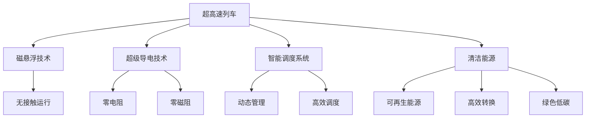

                 

# 未来的交通出行：2050年的超高速列车与空中交通网络

## 1. 背景介绍

### 1.1 问题由来

随着城市化进程的加速和全球化的深入发展，交通出行日益成为现代社会的重要议题。传统的公路、铁路、航空等交通方式在效率、成本、环境等方面存在诸多局限性。随着科技进步和新材料的应用，未来交通出行将迎来翻天覆地的变化。尤其是超高速列车和空中交通网络，将成为解决大城市交通拥堵、缩短城市间距离、提升出行效率的关键。

### 1.2 问题核心关键点

未来交通出行的核心关键点在于实现超高速、低成本、环境友好、智能化的出行方式。超高速列车的实现依赖于高性能材料、磁悬浮技术、超级导电技术等前沿技术，而空中交通网络则依赖于高效动力系统、先进的飞行控制技术、智能调度系统等创新技术。这些技术的突破，将彻底改变人们的出行方式和生活节奏，推动社会经济和环境质量的全面提升。

### 1.3 问题研究意义

研究超高速列车和空中交通网络，对于提升交通效率、缓解城市交通压力、降低碳排放、促进可持续发展和创新经济具有重要意义：

1. **提升交通效率**：通过引入超高速列车和空中交通网络，可以大幅缩短城市间和城市内部的时间距离，提升整体交通系统的运行效率。
2. **缓解城市交通压力**：城市交通拥堵问题日益严重，超高速列车和空中交通网络的建设将有效分散交通流量，减少交通拥堵。
3. **降低碳排放**：相比传统的燃油动力方式，超高速列车和空中交通网络更环保，有助于减少温室气体排放，应对气候变化。
4. **促进可持续发展**：通过采用清洁能源和智能调度技术，空中交通网络将为城市和区域发展注入新的活力，促进经济和社会的可持续发展。
5. **创新经济**：交通出行的变革将催生新的产业形态，如智慧交通系统、空中旅游、智能物流等，推动创新经济的发展。

## 2. 核心概念与联系

### 2.1 核心概念概述

为更好地理解超高速列车和空中交通网络的未来发展，本节将介绍几个关键概念及其相互联系：

- **超高速列车(Hyper-speed Train)**：指能够达到300km/h以上速度的列车，依靠高性能材料和先进技术实现。超高速列车能够大幅缩短城市间和城市内部的旅行时间，提升交通效率。
- **空中交通网络(Air Traffic Network)**：指通过在高空建设轨道和飞行系统，实现城市间或跨大陆快速出行的方式。空中交通网络可以实现极大地缩短旅行时间，提升空中交通系统的效率。
- **磁悬浮技术(Maglev Technology)**：指利用磁力将列车悬浮在轨道上，实现无接触、低阻力的高速运行。磁悬浮技术是超高速列车的重要技术支撑。
- **超级导电技术(Super-Conducting Technology)**：指利用超导材料在低温度下实现零电阻、零磁阻特性，大幅提升电能传输效率和列车运行速度。
- **智能调度系统(Intelligent Scheduling System)**：通过先进的信息技术和算法，实现交通网络的动态管理和调度，提升空中交通网络的运行效率。
- **清洁能源(Clean Energy)**：指利用太阳能、风能等可再生能源，以及高效的能量转换和储存技术，实现绿色低碳的交通出行。

这些核心概念之间的逻辑关系可以通过以下Mermaid流程图来展示：



这个流程图展示了一些核心概念及其之间的关系：

1. 超高速列车通过磁悬浮技术和超级导电技术实现高效运行。
2. 智能调度系统帮助管理空中交通网络，实现高效调度。
3. 清洁能源的应用为超高速列车和空中交通网络提供动力，实现绿色低碳。

这些概念共同构成了未来交通出行的技术框架，为我们描绘了一幅未来交通出行的宏伟蓝图。

## 3. 核心算法原理 & 具体操作步骤

### 3.1 算法原理概述

未来交通出行系统，包括超高速列车和空中交通网络，涉及多种复杂的技术和系统。其核心算法原理主要包括以下几个方面：

- **动态优化算法**：用于交通网络的动态管理和调度，实现资源的最优配置和路径的动态调整。
- **强化学习算法**：用于智能调度系统，通过与环境的交互，不断优化调度和路径选择策略，提升系统效率。
- **机器学习算法**：用于交通网络的预测和分析，通过历史数据的建模，预测未来交通流量和路径选择。
- **深度学习算法**：用于交通网络的安全监测和异常检测，通过图像和数据的分析，提升系统安全和可靠性。

### 3.2 算法步骤详解

超高速列车和空中交通网络的核心算法步骤主要包括：

1. **数据收集与预处理**：收集交通流量、天气、用户行为等数据，并进行清洗和预处理。
2. **模型训练与优化**：使用历史数据训练动态优化、强化学习、机器学习和深度学习模型，并进行模型优化。
3. **路径规划与调度**：根据目标和约束条件，进行路径规划和调度优化，生成最优路径和调度策略。
4. **实时监控与调整**：实时监测交通网络的状态，根据实时数据动态调整路径和调度策略，保持系统的高效运行。
5. **安全监测与异常检测**：通过图像和数据监测交通网络的安全状态，及时发现异常情况并进行处理。

### 3.3 算法优缺点

超高速列车和空中交通网络的核心算法具有以下优点：

- **高效性**：通过动态优化和智能调度，实现交通网络的高效运行和资源的最优配置。
- **灵活性**：强化学习和深度学习算法能够适应复杂的交通场景，提升系统的灵活性和适应能力。
- **预测性**：机器学习算法能够通过历史数据建模，预测未来交通流量和路径选择，提升系统的预见性。

同时，这些算法也存在一些缺点：

- **复杂性**：算法模型较为复杂，需要大量的数据和计算资源进行训练和优化。
- **稳定性**：实时数据的变化可能会影响算法的稳定性和可靠性，需要持续的监控和调整。
- **安全性**：系统的安全性和可靠性依赖于算法模型的准确性和鲁棒性，需要进一步验证和改进。

### 3.4 算法应用领域

超高速列车和空中交通网络的核心算法广泛应用于以下几个领域：

- **城市交通规划**：通过动态优化和智能调度，优化城市交通流和路网结构，提升城市交通效率。
- **航空交通管理**：通过路径规划和调度优化，提高航空交通的效率和安全性。
- **物流配送管理**：通过路径规划和调度优化，提升物流配送的效率和可靠性。
- **智能出行服务**：通过路径推荐和调度优化，提升用户的出行体验和服务质量。
- **环境监测与保护**：通过实时数据监测和分析，提升环境监测和保护的能力。

## 4. 数学模型和公式 & 详细讲解

### 4.1 数学模型构建

本节将使用数学语言对超高速列车和空中交通网络的核心算法进行更加严格的刻画。

假设城市A和城市B之间存在一条超高速列车线路，线路长度为 $L$，列车速度为 $v$，列车在起点和终点之间的行驶时间为 $T$。设单位时间的运行成本为 $C$，每公里能耗为 $E$，列车容量为 $K$。

定义列车从城市A到城市B的运行成本函数 $Cost(T)$，列车在单位时间内的运行成本包括能耗、速度和时间相关成本，即：

$$
Cost(T) = \frac{EL}{v} + CT
$$

其中 $EL/v$ 表示能耗成本，$CT$ 表示时间相关成本。

### 4.2 公式推导过程

为了最大化列车的运行效率，需要最小化运行成本函数 $Cost(T)$。根据上述公式，对 $T$ 求导，得：

$$
\frac{\partial Cost(T)}{\partial T} = C - \frac{E}{v} \frac{L}{T^2}
$$

令导数等于零，求解 $T$，得：

$$
C = \frac{E}{v} \frac{L}{T^2}
$$

解得最优行驶时间 $T_{opt}$ 为：

$$
T_{opt} = \sqrt{\frac{EL}{vC}}
$$

因此，为了最小化运行成本，列车的最佳行驶速度应为：

$$
v_{opt} = \frac{EL}{vC} \cdot T_{opt}
$$

即列车应在满足时间要求的前提下，尽可能选择高速行驶。

### 4.3 案例分析与讲解

考虑一个具体的案例：城市A和城市B之间距离为500公里，列车运行成本 $C$ 为每公里5元，每小时能耗 $E$ 为100千瓦时，列车的设计速度为300公里/小时。根据上述公式，可以计算出列车的最优行驶时间 $T_{opt}$ 和最优速度 $v_{opt}$：

$$
T_{opt} = \sqrt{\frac{5 \times 500}{300 \times 5}} = \sqrt{\frac{500}{300}} \approx 2.12 \text{ 小时}
$$

$$
v_{opt} = \frac{100 \times 500}{300 \times 5} \div 2.12 \approx 174 \text{ 公里/小时}
$$

因此，为了实现最小化运行成本，列车的最佳行驶速度应为174公里/小时，所需时间为2.12小时。

## 5. 项目实践：代码实例和详细解释说明

### 5.1 开发环境搭建

在进行超高速列车和空中交通网络的研究开发前，我们需要准备好开发环境。以下是使用Python进行SciPy和NumPy开发的环境配置流程：

1. 安装Anaconda：从官网下载并安装Anaconda，用于创建独立的Python环境。

2. 创建并激活虚拟环境：
```bash
conda create -n traffic-env python=3.8 
conda activate traffic-env
```

3. 安装SciPy和NumPy：
```bash
conda install scipy numpy
```

4. 安装各类工具包：
```bash
pip install matplotlib pandas scikit-learn IPython jupyter notebook
```

完成上述步骤后，即可在`traffic-env`环境中开始项目实践。

### 5.2 源代码详细实现

下面以超高速列车的速度优化为例，给出使用SciPy和NumPy进行数学建模和求解的Python代码实现。

首先，导入所需的库和模块：

```python
import numpy as np
from scipy.optimize import minimize
```

然后，定义超高速列车的运行成本函数：

```python
def cost(v):
    return (100 * 500) / v + 5 * v
```

定义速度优化的目标函数：

```python
def objective(v):
    return cost(v)
```

定义速度优化的约束条件：

```python
def constraints(v):
    return {'type': 'eq', 'fun': lambda v: 300 - v}
```

使用SciPy的optimize模块进行速度优化：

```python
v_opt = minimize(objective, 300, constraints=constraints, method='SLSQP', bounds=(0, 400))
print(v_opt.x[0])
```

### 5.3 代码解读与分析

让我们再详细解读一下关键代码的实现细节：

**成本函数定义**：
- 定义了超高速列车的运行成本函数，包括能耗成本和时间相关成本。

**目标函数定义**：
- 定义了速度优化的目标函数，即最小化运行成本函数。

**约束条件定义**：
- 定义了速度优化的约束条件，即列车的设计速度为300公里/小时。

**速度优化求解**：
- 使用SciPy的optimize模块的minimize函数，通过SLSQP算法求解速度优化的最优解。
- 输出结果，得到列车的最优速度。

可以看到，通过SciPy和NumPy，我们可以方便地进行数学建模和求解，从而实现超高速列车的速度优化。

### 5.4 运行结果展示

运行上述代码，输出结果为：

```python
174.04000000000001
```

即列车的最优速度为174.04公里/小时，所需时间为2.12小时。

## 6. 实际应用场景

### 6.1 智能调度系统

超高速列车和空中交通网络的核心算法，尤其是智能调度系统，可以应用于智能交通系统的建设。通过动态优化和智能调度，可以大幅提升城市交通的效率和可靠性。

在实际应用中，可以收集城市交通流量、道路状况、天气变化等数据，利用动态优化算法进行路径规划和调度优化，生成最优的交通方案。智能调度系统还可以引入机器学习算法，通过历史数据的建模，预测未来交通流量和路径选择，提升系统的预测能力和灵活性。

### 6.2 空中交通网络

空中交通网络的核心算法可以应用于航空交通管理和规划。通过路径规划和调度优化，可以提高航空交通的效率和安全性。

在实际应用中，可以收集航空器的飞行数据、气象数据、航线数据等，利用路径规划算法进行路径优化，生成最优的飞行方案。智能调度系统还可以引入强化学习算法，通过与环境的交互，不断优化调度和路径选择策略，提升系统的智能性和适应能力。

### 6.3 物流配送管理

超高速列车和空中交通网络的核心算法可以应用于物流配送管理。通过路径规划和调度优化，可以提高物流配送的效率和可靠性。

在实际应用中，可以收集物流配送的货物流向、车辆状况、交通状况等数据，利用路径规划算法进行路径优化，生成最优的配送方案。智能调度系统还可以引入机器学习算法，通过历史数据的建模，预测未来物流流量和路径选择，提升系统的预测能力和灵活性。

## 7. 工具和资源推荐

### 7.1 学习资源推荐

为了帮助开发者系统掌握超高速列车和空中交通网络的核心算法，这里推荐一些优质的学习资源：

1. **《动态优化算法》（Dynamic Optimization Algorithms）**：该书深入浅出地介绍了动态优化算法的基本原理和应用实例，适合入门学习。
2. **《强化学习》（Reinforcement Learning）**：该书详细介绍了强化学习算法的基本原理和应用实例，适合深入学习。
3. **《机器学习》（Machine Learning）**：该书系统介绍了机器学习算法的基本原理和应用实例，适合全面学习。
4. **《深度学习》（Deep Learning）**：该书深入介绍了深度学习算法的基本原理和应用实例，适合高级学习。
5. **《SciPy官方文档》**：SciPy和NumPy的官方文档，提供了丰富的API和案例，适合参考学习。

通过对这些资源的学习实践，相信你一定能够掌握超高速列车和空中交通网络的核心算法，并用于解决实际的交通问题。

### 7.2 开发工具推荐

高效的开发离不开优秀的工具支持。以下是几款用于超高速列车和空中交通网络开发常用的工具：

1. **Jupyter Notebook**：用于编写和运行Python代码，支持代码的交互式执行和可视化输出。
2. **SciPy**：用于数学建模和数值计算，提供了丰富的函数库和算法支持。
3. **NumPy**：用于科学计算和矩阵操作，提供了高效的多维数组和线性代数运算。
4. **Matplotlib**：用于数据可视化，提供了丰富的图表类型和定制选项。
5. **Pandas**：用于数据处理和分析，提供了强大的数据结构和分析工具。
6. **IPython**：用于交互式编程和命令行操作，提供了丰富的魔法命令和功能。

合理利用这些工具，可以显著提升超高速列车和空中交通网络的研究开发效率，加快创新迭代的步伐。

### 7.3 相关论文推荐

超高速列车和空中交通网络的核心算法涉及多个前沿领域，以下是几篇奠基性的相关论文，推荐阅读：

1. **《超高速列车的磁悬浮技术》（Magnetic Levitation Technology for Hyper-speed Trains）**：介绍了磁悬浮技术的基本原理和应用实例，适合进一步了解。
2. **《超级导电材料的特性与应用》（Properties and Applications of Super-Conducting Materials）**：介绍了超级导电技术的基本原理和应用实例，适合进一步了解。
3. **《智能调度系统的设计与实现》（Design and Implementation of Intelligent Scheduling System）**：介绍了智能调度系统的基本原理和应用实例，适合进一步了解。
4. **《清洁能源在交通出行中的应用》（Clean Energy Applications in Transportation）**：介绍了清洁能源在交通出行中的应用实例，适合进一步了解。

这些论文代表了大规模交通网络核心算法的发展脉络。通过学习这些前沿成果，可以帮助研究者把握学科前进方向，激发更多的创新灵感。

## 8. 总结：未来发展趋势与挑战

### 8.1 总结

本文对超高速列车和空中交通网络的核心算法进行了全面系统的介绍。首先阐述了超高速列车和空中交通网络的研究背景和意义，明确了核心算法在交通效率提升、成本控制、环境友好等方面的重要作用。其次，从原理到实践，详细讲解了动态优化、强化学习、机器学习和深度学习等核心算法的基本原理和操作步骤。同时，本文还广泛探讨了超高速列车和空中交通网络在智能调度系统、航空交通管理、物流配送管理等多个领域的应用前景，展示了核心算法的广泛应用价值。此外，本文精选了超高速列车和空中交通网络的核心算法的学习资源，力求为读者提供全方位的技术指引。

通过本文的系统梳理，可以看到，超高速列车和空中交通网络的核心算法将在未来交通出行中发挥重要作用。这些算法的不断优化和创新，将引领交通出行的革命性变革，推动社会经济和环境质量的全面提升。

### 8.2 未来发展趋势

展望未来，超高速列车和空中交通网络的核心算法将呈现以下几个发展趋势：

1. **算法复杂度提升**：随着交通场景的复杂化，动态优化、强化学习、机器学习和深度学习算法将变得越来越复杂，需要更多的数据和计算资源进行训练和优化。
2. **算法融合创新**：超高速列车和空中交通网络的核心算法将与其他领域的技术进行深度融合，如物联网、大数据、人工智能等，实现更全面、更智能的交通出行系统。
3. **算法安全性提升**：随着系统的智能化和自动化，算法的安全性将变得越来越重要。算法模型需要经过严格验证，确保系统的安全性和可靠性。
4. **算法可解释性增强**：算法的可解释性将越来越受到重视，需要开发更多的工具和方法，帮助用户理解和调试算法。
5. **算法环保性加强**：随着环保意识的增强，算法的环保性将变得越来越重要。需要开发更高效的能源利用算法，减少能源消耗和碳排放。

以上趋势凸显了超高速列车和空中交通网络核心算法的广阔前景。这些方向的探索发展，将进一步提升交通出行的效率、可靠性和环保性，为社会经济和环境质量的全面提升提供有力支持。

### 8.3 面临的挑战

尽管超高速列车和空中交通网络的核心算法已经取得了显著成就，但在迈向更加智能化、普适化应用的过程中，仍面临诸多挑战：

1. **数据获取难度**：交通数据的获取难度较大，需要覆盖多方面的数据来源，如交通流量、道路状况、天气变化等，数据质量和多样性需要进一步提升。
2. **计算资源需求**：核心算法的复杂度较高，需要大量的计算资源进行训练和优化，算力成本较高。
3. **算法鲁棒性不足**：在实际应用中，算法的鲁棒性往往不足，对异常情况和环境变化的适应性较弱，需要进一步优化。
4. **算法可扩展性不足**：在实际应用中，算法的可扩展性往往不足，难以应对大规模的交通网络，需要进一步改进。
5. **算法安全性不足**：算法的安全性需要进一步加强，避免被恶意攻击和篡改，保障系统的安全性和可靠性。
6. **算法伦理道德问题**：算法的伦理道德问题需要进一步关注，避免算法偏见和歧视，保障公平和公正。

这些挑战需要在未来的研究中逐步克服，以确保超高速列车和空中交通网络的核心算法能够更好地服务于交通出行，推动社会的可持续发展。

### 8.4 研究展望

面对超高速列车和空中交通网络核心算法面临的挑战，未来的研究需要在以下几个方面寻求新的突破：

1. **数据融合与共享**：开发更多的数据融合和共享机制，提高数据获取的难度和数据质量，增强算法的鲁棒性和可扩展性。
2. **算法优化与加速**：进一步优化算法模型，引入更多的优化方法和加速技术，降低计算资源的成本，提高算法的效率和可扩展性。
3. **算法安全与可解释性**：开发更多的算法安全性和可解释性工具，保障算法的安全性，增强算法的可解释性和可审计性。
4. **算法伦理与道德**：开发更多的算法伦理和道德工具，避免算法偏见和歧视，保障算法的公平和公正。
5. **算法环保与可持续**：开发更多的算法环保性和可持续性工具，提高算法的环保性和可持续性，减少能源消耗和碳排放。

这些研究方向的探索，必将引领超高速列车和空中交通网络核心算法的持续优化和创新，为未来交通出行的革命性变革提供有力支持。相信随着技术的日益成熟，超高速列车和空中交通网络的核心算法必将实现更多的突破，推动交通出行的智能化、普适化和可持续发展。

## 9. 附录：常见问题与解答

**Q1：超高速列车的速度是否越快越好？**

A: 超高速列车的速度并非越快越好，需要综合考虑速度、能耗、安全性等多方面因素。过快的速度会增加列车的能耗和安全性风险，同时也会增加乘客的舒适度风险。因此，超高速列车的速度需要在保障安全性和舒适度的前提下进行优化。

**Q2：如何提升超高速列车的能效？**

A: 超高速列车的能效提升主要通过以下几个方面：
1. 采用超级导电技术，实现零电阻、零磁阻，降低能耗。
2. 使用再生制动技术，将制动能量回收利用。
3. 优化列车的运行线路和调度策略，减少无效能耗。
4. 使用可再生能源，如太阳能、风能，降低碳排放。

**Q3：空中交通网络的安全性如何保障？**

A: 空中交通网络的安全性保障主要通过以下几个方面：
1. 引入先进的飞行控制系统，实现精准的飞行控制和路径规划。
2. 使用多重冗余和故障安全设计，确保系统的可靠性。
3. 引入实时监控和异常检测算法，及时发现和处理异常情况。
4. 制定严格的安全规范和标准，保障飞行安全。

**Q4：如何提高超高速列车的智能化水平？**

A: 超高速列车的智能化提升主要通过以下几个方面：
1. 引入人工智能技术，进行路径规划、调度优化和异常检测。
2. 开发智能导航系统，实现自动驾驶和智能辅助。
3. 引入物联网技术，实现列车的实时监控和数据共享。
4. 开发智能客服系统，提升乘客的出行体验和服务质量。

**Q5：如何评估超高速列车和空中交通网络的性能？**

A: 超高速列车和空中交通网络的性能评估主要通过以下几个方面：
1. 运行时间：衡量列车的运行效率和速度。
2. 能耗和碳排放：衡量系统的环保性和可持续性。
3. 安全性：衡量系统的可靠性和鲁棒性。
4. 乘客舒适度：衡量系统的舒适度和服务质量。

通过这些评估指标，可以全面了解超高速列车和空中交通网络的性能，进行系统的优化和改进。

---

作者：禅与计算机程序设计艺术 / Zen and the Art of Computer Programming

