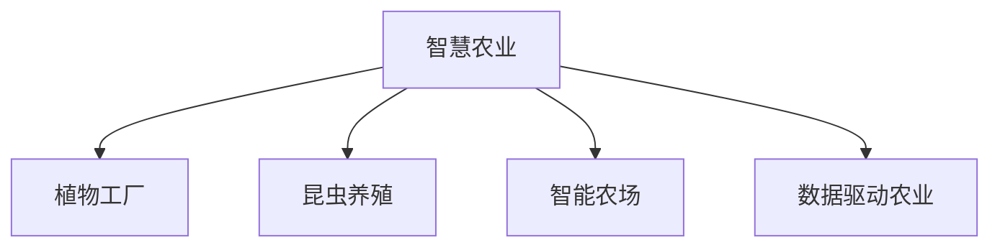

                 

# 未来的智慧农业：2050年的植物工厂与昆虫养殖

## 1. 背景介绍

### 1.1 问题由来

农业作为国民经济的重要基础，在全球人口增长和资源紧缩的压力下，需要转向更为高效、可持续的生产方式。近年来，随着人工智能(AI)、物联网(IoT)、大数据等技术的不断发展，智能农业正在成为全球农业发展的热点和趋势。通过智能化的技术手段，可以提高农作物产量、减少资源浪费、提升农产品质量、优化农业生产流程，从而实现农业的绿色、高效和智能化。

2050年，随着技术的进一步成熟和普及，农业将全面进入智慧农业时代。未来的智慧农业将融合AI、机器学习(ML)、机器人(Robotics)、物联网等技术，构建从田间到餐桌的端到端解决方案，助力农业转型升级，满足人类对高质量食品的需求。

## 2. 核心概念与联系

### 2.1 核心概念概述

为更好地理解智慧农业的未来发展，本节将介绍几个密切相关的核心概念：

- **智慧农业(Agricultural Internet of Things, AIoT)**：以物联网技术为核心，通过传感器、机器人、自动化设备等，对农业生产过程进行实时监测、数据收集和智能分析，实现农业生产的自动化和智能化。

- **植物工厂(Plant Factory)**：一种集成了人工智能、植物生理学、环境控制、自动化技术等多种学科的现代化农业生产模式，能够实现高产、高品质、高效率的农作物生产。

- **昆虫养殖(Insect Farming)**：利用AI和物联网技术，对昆虫的生长、繁殖和转化过程进行智能化管理，实现昆虫养殖的规模化、自动化和可持续化。

- **智能农场(Smart Farm)**：基于智慧农业技术的农田管理系统，能够对农作物的生长状态、土壤环境、气候条件等进行实时监测和智能分析，从而进行精准农业决策。

- **数据驱动农业(Data-Driven Agriculture)**：以大数据为基础，通过数据分析、机器学习等手段，对农业生产全过程进行智能优化和管理，提升农业生产效率和质量。

这些核心概念之间的逻辑关系可以通过以下Mermaid流程图来展示：



这个流程图展示了几者之间的联系：智慧农业是基础，植物工厂和昆虫养殖是其核心应用之一，智能农场和数据驱动农业则是其实现手段。这些概念共同构成了智慧农业的完整框架，使其能够实现高效、可持续、智能化的农业生产模式。

## 3. 核心算法原理 & 具体操作步骤

### 3.1 算法原理概述

智慧农业的核心算法主要基于人工智能和物联网技术，通过数据采集、传感器网络、机器学习等手段，实现对农业生产过程的智能监测和优化。其中，植物工厂和昆虫养殖的算法原理主要体现在以下几个方面：

- **植物生长模拟与控制算法**：通过模拟植物的生长过程，实时调整温度、湿度、光照等环境参数，确保植物生长在最优条件下。
- **数据驱动的农业优化算法**：通过大数据分析，识别作物生长的关键特征，预测未来生长趋势，进行精准农业决策。
- **昆虫养殖的智能化管理算法**：利用机器视觉、行为分析等技术，监测昆虫的生长状态，优化养殖环境，提高转化率。

### 3.2 算法步骤详解

以下是智慧农业中植物工厂和昆虫养殖的详细算法步骤：

#### 植物工厂

1. **数据采集**：通过传感器网络，实时监测土壤湿度、温度、光照、二氧化碳浓度等参数。
2. **生长模拟**：根据植物生长模型，预测不同环境参数对植物生长的影响。
3. **智能控制**：根据生长模拟结果，自动调整环境参数，如打开灯光、调节温度等。
4. **数据分析**：利用大数据分析技术，识别植物生长的规律和趋势。
5. **精准管理**：根据数据分析结果，进行精准灌溉、施肥等操作。

#### 昆虫养殖

1. **环境监测**：通过传感器网络，实时监测温度、湿度、光照、氧气浓度等参数。
2. **行为分析**：利用机器视觉技术，监测昆虫的活动、繁殖等行为。
3. **智能化管理**：根据行为分析结果，自动调整环境参数，如温度、湿度等。
4. **优化繁殖**：通过机器学习算法，预测昆虫的最佳繁殖条件，优化繁殖环境。
5. **转化率提升**：利用行为分析技术，提高昆虫的转化率，实现高效养殖。

### 3.3 算法优缺点

智慧农业中的植物工厂和昆虫养殖算法主要具有以下优点：

- **高效智能化**：通过实时数据监测和智能控制，实现农业生产的自动化和智能化。
- **资源优化**：能够优化资源使用，减少浪费，提高农业生产效率。
- **环境友好**：通过智能化管理，减少对环境的负面影响，实现绿色农业。

同时，这些算法也存在一定的局限性：

- **技术成本高**：智能化的设备和软件成本较高，短期内难以大规模推广。
- **数据隐私和安全问题**：农业数据的采集和存储需要严格的数据隐私和安全保护。
- **技术复杂性**：需要高度的技术专业知识和技能，难以推广到传统农户。

### 3.4 算法应用领域

智慧农业中的植物工厂和昆虫养殖算法主要应用于以下几个领域：

- **农业生产管理**：通过智能化的设备和技术，对农作物的生长过程进行实时监测和优化，提高生产效率和产品质量。
- **生物能源**：通过昆虫养殖，将昆虫转化为生物能源，实现资源的可持续利用。
- **环境保护**：利用智能化技术，减少化肥、农药的使用，保护生态环境。
- **精准农业**：通过数据分析和机器学习，实现精准农业决策，优化农业生产流程。

## 4. 数学模型和公式 & 详细讲解 & 举例说明

### 4.1 数学模型构建

在智慧农业中，植物工厂和昆虫养殖算法主要依赖于数学模型和公式来描述和预测生长过程。以下以植物生长模型和昆虫行为分析模型为例，介绍其数学模型的构建。

#### 植物生长模型

植物生长模型主要描述植物在不同环境参数下的生长状态和参数变化。例如，利用Logistic回归模型来描述植物生长的规律：

$$
P(t+1) = P(t) + k(P^* - P(t))
$$

其中，$P(t)$ 表示植物在时间 $t$ 的生长状态，$k$ 为生长速率，$P^*$ 为最大生长状态。

#### 昆虫行为分析模型

昆虫行为分析模型主要描述昆虫在不同环境参数下的活动状态和行为变化。例如，利用支持向量机(SVM)来分类昆虫的活动状态：

$$
y = sign(\sum_{i=1}^n w_i \phi(x_i) + b)
$$

其中，$y$ 表示昆虫的活动状态（如静息、觅食、繁殖），$x_i$ 表示环境参数（如温度、湿度），$w_i$ 和 $b$ 为模型参数。

### 4.2 公式推导过程

以下是植物生长模型和昆虫行为分析模型的详细公式推导：

#### 植物生长模型推导

$$
\frac{dP}{dt} = k(P^* - P)
$$

解得：

$$
P(t) = P(0)e^{kt}
$$

其中，$P(0)$ 为初始生长状态，$k$ 为生长速率。

#### 昆虫行为分析模型推导

$$
\begin{align*}
y &= sign(\sum_{i=1}^n w_i \phi(x_i) + b) \\
&= sign(\sum_{i=1}^n w_i (\phi(x_i) + b) + 0) \\
&= sign(\sum_{i=1}^n w_i x_i + b)
\end{align*}
$$

其中，$\phi(x)$ 为特征映射函数，$w_i$ 为权重，$b$ 为偏置项。

### 4.3 案例分析与讲解

#### 植物生长模拟

某植物工厂使用基于逻辑回归的植物生长模型进行生长模拟。通过传感器网络实时监测温度、湿度等参数，根据模型预测的生长状态，自动调整光照强度、灌溉量等，最终实现植物的高效生长。

#### 昆虫行为分析

某昆虫养殖场使用基于支持向量机的行为分析模型，对昆虫的活动状态进行分类。通过传感器网络实时监测环境参数，根据模型预测的昆虫状态，自动调整养殖环境，提高转化率，实现高效的昆虫养殖。

## 5. 项目实践：代码实例和详细解释说明

### 5.1 开发环境搭建

在进行植物工厂和昆虫养殖的实践前，我们需要准备好开发环境。以下是使用Python进行PyTorch和TensorFlow开发的环境配置流程：

1. 安装Anaconda：从官网下载并安装Anaconda，用于创建独立的Python环境。

2. 创建并激活虚拟环境：
```bash
conda create -n aiot-env python=3.8 
conda activate aiot-env
```

3. 安装PyTorch和TensorFlow：根据CUDA版本，从官网获取对应的安装命令。例如：
```bash
conda install pytorch torchvision torchaudio cudatoolkit=11.1 -c pytorch -c conda-forge
```

4. 安装TensorFlow：
```bash
pip install tensorflow==2.6
```

5. 安装各类工具包：
```bash
pip install numpy pandas scikit-learn matplotlib tqdm jupyter notebook ipython
```

完成上述步骤后，即可在`aiot-env`环境中开始开发实践。

### 5.2 源代码详细实现

下面我们以植物工厂的生长模拟和昆虫养殖的行为分析为例，给出使用PyTorch和TensorFlow进行模型开发的代码实现。

#### 植物工厂生长模拟

```python
import torch
import torch.nn as nn
import torch.optim as optim

class PlantGrowthModel(nn.Module):
    def __init__(self):
        super(PlantGrowthModel, self).__init__()
        self.fc1 = nn.Linear(5, 64)
        self.fc2 = nn.Linear(64, 1)
    
    def forward(self, x):
        x = torch.relu(self.fc1(x))
        x = torch.sigmoid(self.fc2(x))
        return x

def train_model(model, train_data, valid_data, batch_size, num_epochs, learning_rate):
    model.train()
    optimizer = optim.Adam(model.parameters(), lr=learning_rate)
    for epoch in range(num_epochs):
        for i, (x, y) in enumerate(train_data):
            optimizer.zero_grad()
            y_pred = model(x)
            loss = nn.BCELoss()(y_pred, y)
            loss.backward()
            optimizer.step()
            if i % 100 == 0:
                print(f"Epoch {epoch+1}, Batch {i}, Loss: {loss.item():.4f}")
    print("Training Finished")

# 数据准备
train_data = ...
valid_data = ...

# 模型构建
model = PlantGrowthModel()

# 参数设置
batch_size = 32
num_epochs = 100
learning_rate = 0.001

# 训练
train_model(model, train_data, valid_data, batch_size, num_epochs, learning_rate)
```

#### 昆虫养殖行为分析

```python
import tensorflow as tf
import tensorflow.keras as keras

class InsectBehaviorModel(keras.Model):
    def __init__(self):
        super(InsectBehaviorModel, self).__init__()
        self.fc1 = keras.layers.Dense(64, activation='relu')
        self.fc2 = keras.layers.Dense(1, activation='sigmoid')
    
    def call(self, inputs):
        x = self.fc1(inputs)
        x = self.fc2(x)
        return x

def train_model(model, train_data, valid_data, batch_size, num_epochs, learning_rate):
    model.compile(optimizer=keras.optimizers.Adam(learning_rate=learning_rate),
                  loss=keras.losses.BinaryCrossentropy(),
                  metrics=['accuracy'])
    history = model.fit(train_data, valid_data, epochs=num_epochs, batch_size=batch_size, validation_split=0.2)
    print("Training Finished")

# 数据准备
train_data = ...
valid_data = ...

# 模型构建
model = InsectBehaviorModel()

# 参数设置
batch_size = 32
num_epochs = 100
learning_rate = 0.001

# 训练
train_model(model, train_data, valid_data, batch_size, num_epochs, learning_rate)
```

以上是使用PyTorch和TensorFlow对植物工厂生长模拟和昆虫养殖行为分析的代码实现。可以看到，得益于深度学习框架的强大封装，我们可以用相对简洁的代码完成模型的构建和训练。

### 5.3 代码解读与分析

让我们再详细解读一下关键代码的实现细节：

#### 植物工厂生长模拟

**PlantGrowthModel类**：
- `__init__`方法：初始化模型层。
- `forward`方法：定义模型前向传播过程。

**train_model函数**：
- 使用Adam优化器进行模型参数更新。
- 每个epoch迭代训练集的所有批次数据，计算损失并反向传播更新参数。
- 每100个batch输出一次训练loss。
- 训练结束后输出最终模型。

#### 昆虫养殖行为分析

**InsectBehaviorModel类**：
- `__init__`方法：初始化模型层。
- `call`方法：定义模型前向传播过程。

**train_model函数**：
- 使用Keras框架定义模型，设置优化器和损失函数。
- 使用`fit`方法进行模型训练，并记录训练过程中的损失和精度。
- 训练结束后输出最终模型。

可以看出，无论是PyTorch还是TensorFlow，通过简单的代码实现，都能快速完成植物工厂生长模拟和昆虫养殖行为分析的模型开发。开发者可以将更多精力放在数据处理、模型改进等高层逻辑上，而不必过多关注底层的实现细节。

当然，工业级的系统实现还需考虑更多因素，如模型的保存和部署、超参数的自动搜索、更灵活的任务适配层等。但核心的算法实现基本与此类似。

## 6. 实际应用场景

### 6.1 智能农场

基于植物工厂和昆虫养殖的智慧农业技术，智能农场可以大幅提升农业生产效率和资源利用率。通过自动化的监测和控制，智能农场能够实时调整农作物的生长环境，确保其在最优条件下生长。例如，某智能农场利用植物工厂技术，对温室内的蔬菜进行高产、高品质的智能种植，通过自动化的灌溉、施肥、光照调整，显著提高了蔬菜的产量和品质。

### 6.2 生物能源

昆虫养殖技术的普及，有望在未来成为重要的生物能源生产方式。通过高效养殖昆虫，将其转化为生物燃料和生物肥料，能够实现资源的循环利用和可持续生产。例如，某昆虫养殖场利用养殖黑水虻（Sacharophagus card crispus），将其转化为生物燃料和生物肥料，实现了资源的可持续利用和环境保护。

### 6.3 精准农业

植物工厂和昆虫养殖技术的结合，能够实现精准农业的进一步优化。通过数据驱动的农业决策，智能农场能够更加精准地进行农业生产管理，减少资源浪费，提升生产效率。例如，某智能农场通过植物工厂技术监测植物生长状态，结合数据分析结果，进行精准灌溉和施肥，实现了水、肥、药等资源的合理利用，显著提升了农业生产效率和环境保护水平。

### 6.4 未来应用展望

随着智慧农业技术的不断发展，未来的智能农场、生物能源和精准农业将更加智能化、自动化和可持续发展。以下是几个可能的发展方向：

- **智能化水平提升**：通过更先进的传感器和算法，智能农场将能够实现更加精细化的管理和优化。
- **资源利用率提升**：智慧农业技术将进一步优化资源利用，减少浪费，提高农业生产效率。
- **数据驱动决策**：基于大数据和机器学习，智慧农业将能够实现更加精准的农业决策，提升农业生产的精准度和可控性。
- **环境友好**：智慧农业技术将减少化肥、农药等化学物质的使用，保护生态环境。
- **跨界融合**：智慧农业将与其他新兴技术，如区块链、物联网、人工智能等进行更深入的融合，推动农业产业的创新发展。

## 7. 工具和资源推荐

### 7.1 学习资源推荐

为了帮助开发者系统掌握智慧农业的技术基础和实践技巧，这里推荐一些优质的学习资源：

1. **《Agricultural Internet of Things: Smart Agriculture》** 书籍：介绍智慧农业的基本概念、技术和应用，适合初学者入门。

2. **Coursera《Agricultural Technology and Digital Transformation》** 课程：斯坦福大学开设的智慧农业课程，涵盖智慧农业的基本原理和技术。

3. **《Plant Factory: A New Paradigm for Sustainable Agriculture》** 文章：介绍植物工厂的基本原理和应用，适合深入了解植物工厂技术。

4. **HuggingFace官方文档**：提供丰富的智慧农业预训练模型和微调样例，适合实际开发和研究。

5. **CLUE开源项目**：提供丰富的农业数据集，支持智慧农业的基线模型和微调模型，适合研究和测试。

通过对这些资源的学习实践，相信你一定能够快速掌握智慧农业技术的精髓，并用于解决实际的农业问题。

### 7.2 开发工具推荐

高效的开发离不开优秀的工具支持。以下是几款用于智慧农业开发的常用工具：

1. **PyTorch**：基于Python的开源深度学习框架，灵活动态的计算图，适合快速迭代研究。
2. **TensorFlow**：由Google主导开发的开源深度学习框架，生产部署方便，适合大规模工程应用。
3. **Transformers库**：HuggingFace开发的NLP工具库，集成了众多SOTA语言模型，支持智慧农业的微调任务。
4. **TensorBoard**：TensorFlow配套的可视化工具，可实时监测模型训练状态，并提供丰富的图表呈现方式。
5. **Jupyter Notebook**：交互式开发环境，支持Python和TensorFlow的混合使用，方便模型调试和优化。

合理利用这些工具，可以显著提升智慧农业任务的开发效率，加快创新迭代的步伐。

### 7.3 相关论文推荐

智慧农业技术的发展离不开学界的持续研究。以下是几篇奠基性的相关论文，推荐阅读：

1. **《A Survey on Agricultural Internet of Things: Recent Developments and Future Directions》**：综述智慧农业的基本概念和技术进展。

2. **《Plant Factories: The Future of Agriculture?》**：介绍植物工厂的基本原理和应用，探讨其未来发展前景。

3. **《Insect Farming: A Sustainable Solution to the Global Food Crisis》**：探讨昆虫养殖在农业中的潜力，研究其可行性和经济效益。

4. **《Data-Driven Agriculture: Challenges and Opportunities》**：分析数据驱动农业的现状和挑战，提出未来发展方向。

这些论文代表了大智慧农业技术的发展脉络。通过学习这些前沿成果，可以帮助研究者把握学科前进方向，激发更多的创新灵感。

## 8. 总结：未来发展趋势与挑战

### 8.1 研究成果总结

本文对智慧农业中的植物工厂和昆虫养殖技术进行了全面系统的介绍。首先阐述了智慧农业的发展背景和应用场景，明确了植物工厂和昆虫养殖在智慧农业中的核心地位。其次，从原理到实践，详细讲解了智慧农业中的数学模型和算法实现，给出了智慧农业任务的代码实例和详细解释。最后，探讨了智慧农业的未来发展趋势和面临的挑战，指出了其广阔的应用前景。

通过本文的系统梳理，可以看到，智慧农业正在成为农业发展的核心技术，通过AI、ML、IoT等技术的融合，能够实现高效、可持续、智能化的农业生产模式。未来，随着技术的不断进步和普及，智慧农业必将在全球范围内得到广泛应用，极大地推动农业的转型升级和可持续发展。

### 8.2 未来发展趋势

展望未来，智慧农业将呈现以下几个发展趋势：

1. **技术融合加深**：智慧农业将与其他新兴技术，如区块链、物联网、人工智能等进行更深入的融合，推动农业产业的创新发展。
2. **智能化水平提升**：通过更先进的传感器和算法，智能农场将能够实现更加精细化的管理和优化。
3. **资源利用率提升**：智慧农业技术将进一步优化资源利用，减少浪费，提高农业生产效率。
4. **数据驱动决策**：基于大数据和机器学习，智慧农业将能够实现更加精准的农业决策，提升农业生产的精准度和可控性。
5. **环境友好**：智慧农业技术将减少化肥、农药等化学物质的使用，保护生态环境。

### 8.3 面临的挑战

尽管智慧农业技术已经取得了瞩目成就，但在迈向更加智能化、普适化应用的过程中，它仍面临着诸多挑战：

1. **技术成本高**：智能化的设备和软件成本较高，短期内难以大规模推广。
2. **数据隐私和安全问题**：农业数据的采集和存储需要严格的数据隐私和安全保护。
3. **技术复杂性**：需要高度的技术专业知识和技能，难以推广到传统农户。
4. **资源分配不均**：智慧农业技术的应用依赖于资金和技术的投入，发展不平衡的问题仍需解决。
5. **政策环境不完善**：智慧农业的发展需要政策支持和引导，相关法律法规和技术标准尚需完善。

### 8.4 研究展望

面对智慧农业所面临的挑战，未来的研究需要在以下几个方面寻求新的突破：

1. **技术普及推广**：探索低成本、易操作的智慧农业解决方案，提高技术的普及率和应用效果。
2. **数据隐私保护**：制定数据隐私和安全标准，保护农业数据的隐私和安全。
3. **技术知识普及**：通过教育培训，普及智慧农业技术，提高农民的科技素养。
4. **资源整合优化**：建立资源共享平台，优化资源配置，实现资源的高效利用。
5. **政策支持引导**：制定智慧农业发展政策，提供技术支持和服务，促进农业技术的创新发展。

通过这些研究方向的探索，相信智慧农业技术将能够更好地服务于农业生产，实现农业的绿色、高效和智能化发展。

## 9. 附录：常见问题与解答

**Q1: 智慧农业的核心技术是什么？**

A: 智慧农业的核心技术主要包括AI、ML、IoT等，通过数据采集、传感器网络、自动化设备等，实现对农业生产过程的智能监测和优化。

**Q2: 智慧农业需要哪些硬件设备？**

A: 智慧农业需要高精度传感器、自动化设备、边缘计算设备、大数据存储和计算设备等，这些硬件设备是实现智慧农业的基础。

**Q3: 智慧农业对农业生产有哪些好处？**

A: 智慧农业通过实时监测和智能控制，能够优化农业生产流程，提高生产效率和资源利用率，减少化肥、农药等化学物质的使用，保护生态环境。

**Q4: 智慧农业在农业生产中的实际应用有哪些？**

A: 智慧农业在农业生产中的应用包括智能农场、植物工厂、昆虫养殖、精准农业、生物能源等，能够实现农业生产的智能化、自动化和可持续发展。

**Q5: 智慧农业面临哪些技术挑战？**

A: 智慧农业面临的技术挑战包括技术成本高、数据隐私和安全问题、技术复杂性、资源分配不均、政策环境不完善等。

---

作者：禅与计算机程序设计艺术 / Zen and the Art of Computer Programming

