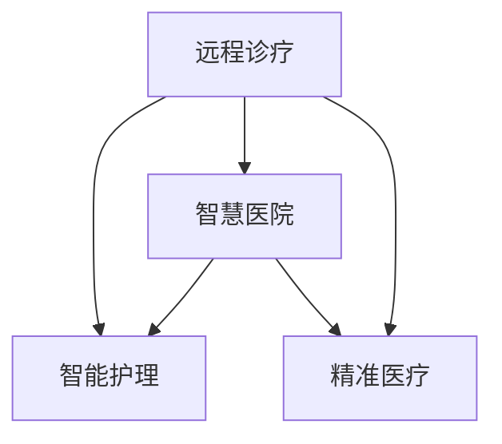

                 

## 1. 背景介绍

### 1.1 问题由来

随着科技的迅猛发展，医疗领域正经历着一场革命性的变革。尤其是近年来，人工智能(AI)、大数据、物联网(IoT)等技术在医疗行业的应用，正逐渐改变传统医疗服务的模式和方式。无论是影像识别、病历分析，还是个性化医疗，AI技术正在从辅助诊疗逐步转向主导诊疗，为医疗服务的精准化、智能化、个性化提供了可能。

2050年，我们将全面进入一个以智慧医疗为核心的新时代。在这一时代，AI技术将与医疗服务深度融合，远程诊疗、智能护理将成为主流，大幅提升医疗服务的效率和质量，让每个人都能够享受到更加全面、个性化的医疗服务。

### 1.2 问题核心关键点

未来智慧医疗的核心关键点包括以下几个方面：

- **远程诊疗**：利用AI和大数据技术，将医疗专家和资源从物理空间上连接起来，打破地域限制，为患者提供快速、便捷的诊疗服务。

- **智能护理**：结合传感技术、移动应用和远程监控，实时监测患者的健康状态，提供个性化的护理方案，提升患者的生命质量和体验。

- **智慧医院**：通过智能设备和信息化系统，实现医疗数据的高效管理和共享，提高医院的运营效率和医疗水平。

- **精准医疗**：利用基因组学、蛋白质组学等新技术，实现对疾病的精准识别和个性化治疗，提高治愈率，降低医疗成本。

### 1.3 问题研究意义

探索2050年的智慧医疗，对于推动医疗行业的数字化转型、提升医疗服务的效率和质量具有重要意义：

1. **扩大医疗服务覆盖范围**：通过远程诊疗和智能护理，让偏远地区的患者也能享受到优质的医疗服务，缩小城乡医疗服务差距。
2. **提升医疗服务效率**：AI技术能够快速诊断疾病，减轻医务人员的负担，提高诊疗的效率和准确性。
3. **降低医疗成本**：精准医疗和智慧医院能够优化资源配置，降低医疗成本，提升整体医疗系统的效益。
4. **提升患者体验**：智能护理技术能够提供个性化的健康管理方案，提升患者的生活质量，增强其对医疗服务的满意度和信任度。
5. **促进医疗创新**：智慧医疗的实践和应用将推动更多的医学研究和技术创新，推动医疗科学的发展。

## 2. 核心概念与联系

### 2.1 核心概念概述

为了深入理解智慧医疗的核心概念，本节将详细介绍几个密切相关的核心概念及其联系。

- **远程诊疗**：指通过AI技术，将医疗专家和资源跨越物理空间的限制，为患者提供实时、高质量的医疗服务。

- **智能护理**：结合传感技术、移动应用和远程监控，实现对患者的实时监测和个性化护理。

- **智慧医院**：通过智能设备和信息化系统，实现医疗数据的全面管理和共享，提高医院的运营效率和服务质量。

- **精准医疗**：利用基因组学、蛋白质组学等新技术，实现对疾病的精准识别和个性化治疗，提高治愈率，降低医疗成本。

这些概念之间的逻辑关系可以通过以下Mermaid流程图来展示：



这个流程图展示了远程诊疗、智能护理、智慧医院和精准医疗之间的关系：

1. 远程诊疗通过AI技术跨越地域限制，为患者提供实时、高质量的医疗服务。
2. 智能护理结合传感技术，实现实时监测和个性化护理。
3. 智慧医院通过智能设备和信息化系统，实现医疗数据的全面管理和共享，提高运营效率和服务质量。
4. 精准医疗利用基因组学、蛋白质组学等新技术，实现疾病的精准识别和个性化治疗。

这些概念共同构成了未来智慧医疗的核心框架，为实现高效、精准、个性化的医疗服务提供了技术保障。

## 3. 核心算法原理 & 具体操作步骤

### 3.1 算法原理概述

未来智慧医疗的核心算法原理主要包括三个方面：

1. **远程诊疗算法**：利用图像识别、自然语言处理(NLP)、语音识别等技术，实现对患者的初步诊断和咨询，提供个性化的诊疗建议。

2. **智能护理算法**：结合传感器数据、移动应用和远程监控，实时监测患者的健康状态，提供个性化的护理方案。

3. **智慧医院算法**：通过医疗数据管理、资源优化、信息共享等技术，实现医院运营的全面智能化。

### 3.2 算法步骤详解

以下是远程诊疗、智能护理和智慧医院的核心算法步骤：

#### 远程诊疗算法步骤：

1. **数据收集**：收集患者的症状描述、影像数据、实验室检测结果等，作为输入数据。
2. **预处理**：对输入数据进行清洗、归一化、特征提取等预处理，确保数据的质量和一致性。
3. **模型选择**：选择适合的AI模型，如卷积神经网络(CNN)、循环神经网络(RNN)、BERT等，进行初步诊断和咨询。
4. **诊断与咨询**：利用训练好的模型，对患者的症状进行分析和诊断，提供初步的诊疗建议和咨询。
5. **结果解释与反馈**：将诊断结果和建议转化为患者能够理解的语言，并通过解释模型的工作原理，提供详细的反馈和建议。

#### 智能护理算法步骤：

1. **传感器部署**：在患者家中部署各类传感器，如心率传感器、血压传感器、体温传感器等，实时监测患者的健康状态。
2. **数据采集与传输**：通过物联网技术，将传感器数据实时采集并传输到云端。
3. **数据处理与分析**：利用机器学习算法，对实时采集的数据进行处理和分析，识别患者的健康状态和异常情况。
4. **护理方案生成**：根据分析结果，生成个性化的护理方案，如饮食建议、锻炼计划、药物提醒等。
5. **反馈与调整**：根据护理方案的执行效果，实时调整护理方案，确保患者的健康状态得到有效管理。

#### 智慧医院算法步骤：

1. **数据集成与共享**：整合医院的各类数据，如患者信息、病历、影像、实验室结果等，实现数据的全面共享。
2. **数据管理与分析**：利用数据管理平台，实现对数据的存储、备份、清洗、分析等管理。
3. **资源优化与调度**：通过算法优化医院的资源配置，如床位、设备、医务人员等，提高医院的运营效率。
4. **信息共享与协同**：利用信息共享平台，实现医院内部的信息协同和协作，提高诊疗的效率和质量。
5. **决策支持与优化**：通过数据分析和建模，提供决策支持和优化建议，辅助医院管理决策。

### 3.3 算法优缺点

未来智慧医疗的核心算法具有以下优点：

1. **提升诊疗效率**：AI技术可以快速诊断疾病，减轻医务人员的负担，提高诊疗的效率和准确性。
2. **降低医疗成本**：远程诊疗和智能护理能够优化资源配置，降低医疗成本，提升整体医疗系统的效益。
3. **个性化医疗服务**：智能护理技术能够提供个性化的健康管理方案，提升患者的生活质量。
4. **实时监测与预警**：智能护理和智慧医院能够实现实时监测和预警，及时发现和处理异常情况，保障患者的健康安全。

同时，这些算法也存在一些缺点：

1. **数据隐私和安全问题**：远程诊疗和智能护理涉及大量个人健康数据，如何保护数据隐私和安全是一个重要问题。
2. **算法偏见和歧视**：AI算法可能会学习到数据中的偏见和歧视，导致不公正的医疗决策。
3. **算法的可解释性**：某些AI算法，如深度学习模型，缺乏可解释性，难以解释其决策过程和依据。
4. **技术依赖和局限性**：智慧医疗的实现需要依赖各类先进技术，技术普及和应用存在一定的局限性。
5. **数据质量和完整性问题**：远程诊疗和智能护理的效果高度依赖于数据的准确性和完整性，数据质量问题会影响算法的性能。

### 3.4 算法应用领域

未来智慧医疗的核心算法应用领域广泛，主要包括：

1. **远程诊断与咨询**：利用AI技术，提供远程诊疗和咨询服务，为偏远地区和行动不便的患者提供便利。
2. **智能护理与监护**：结合传感器技术和移动应用，实现实时监测和个性化护理，提升患者的生活质量。
3. **智慧医院管理**：通过数据管理和资源优化，提高医院的运营效率和服务质量，优化医疗资源配置。
4. **精准医疗与个性化治疗**：利用基因组学、蛋白质组学等新技术，实现疾病的精准识别和个性化治疗，提高治愈率，降低医疗成本。
5. **医学研究与创新**：通过智慧医疗的数据分析和建模，推动医学研究和技术创新，推动医疗科学的进步。

## 4. 数学模型和公式 & 详细讲解 & 举例说明

### 4.1 数学模型构建

未来智慧医疗的核心算法可以抽象为以下几个数学模型：

1. **远程诊疗模型**：通过图像识别、NLP、语音识别等技术，构建疾病诊断模型，公式如下：

$$
\hat{y} = f(x, \theta)
$$

其中 $x$ 为输入数据，$\hat{y}$ 为诊断结果，$f$ 为模型函数，$\theta$ 为模型参数。

2. **智能护理模型**：通过传感器数据、移动应用和远程监控，构建健康监测和护理方案生成模型，公式如下：

$$
\hat{c} = g(s, \phi)
$$

其中 $s$ 为传感器数据，$\hat{c}$ 为护理方案，$g$ 为护理方案生成函数，$\phi$ 为护理方案生成参数。

3. **智慧医院模型**：通过数据集成、共享、管理、分析等技术，构建医院运营优化模型，公式如下：

$$
\hat{o} = h(d, \psi)
$$

其中 $d$ 为医院数据，$\hat{o}$ 为运营优化结果，$h$ 为运营优化函数，$\psi$ 为运营优化参数。

### 4.2 公式推导过程

以下是远程诊疗、智能护理和智慧医院模型的详细推导过程：

#### 远程诊疗模型推导

1. **数据预处理**：假设输入数据为 $x = (x_1, x_2, \dots, x_n)$，其中 $x_i$ 为第 $i$ 个特征。预处理后的数据为 $x' = (x'_1, x'_2, \dots, x'_n)$。

2. **模型训练**：使用训练数据集 $D = \{(x_i, y_i)\}_{i=1}^m$，其中 $y_i$ 为标签。通过最小化损失函数 $\mathcal{L}(\theta)$，优化模型参数 $\theta$。

3. **诊断与咨询**：将患者输入的数据 $x'$ 输入模型，得到诊断结果 $\hat{y} = f(x', \theta)$。

4. **结果解释与反馈**：将诊断结果转化为患者能够理解的语言，并提供详细的解释和反馈。

#### 智能护理模型推导

1. **传感器数据采集**：假设传感器数据为 $s = (s_1, s_2, \dots, s_m)$，其中 $s_i$ 为第 $i$ 个传感器的数据。

2. **数据处理与分析**：通过机器学习算法，对传感器数据进行处理和分析，得到健康状态评估结果 $e$。

3. **护理方案生成**：根据评估结果 $e$，生成个性化的护理方案 $\hat{c}$。

4. **反馈与调整**：根据护理方案的执行效果，实时调整护理方案，确保患者的健康状态得到有效管理。

#### 智慧医院模型推导

1. **数据集成与共享**：整合医院的各类数据 $d = (d_1, d_2, \dots, d_n)$，其中 $d_i$ 为第 $i$ 个数据源。

2. **数据管理与分析**：利用数据管理平台，对数据进行存储、备份、清洗、分析等管理，得到分析结果 $a$。

3. **资源优化与调度**：通过算法优化医院的资源配置，得到资源优化结果 $o$。

4. **信息共享与协同**：利用信息共享平台，实现医院内部的信息协同和协作，优化诊疗的效率和质量。

5. **决策支持与优化**：通过数据分析和建模，提供决策支持和优化建议，辅助医院管理决策。

### 4.3 案例分析与讲解

以下是智慧医疗在不同场景下的案例分析：

#### 案例1：远程诊疗在慢性病管理中的应用

1. **问题描述**：患者王先生患有糖尿病，需要定期进行血糖监测和医生咨询，但由于行动不便，难以频繁前往医院。

2. **解决方案**：利用远程诊疗技术，王先生可以通过手机应用拍摄血糖仪的读数，并上传给医生进行远程咨询。医生利用预训练的糖尿病诊断模型，分析王先生的血糖数据，给出诊断建议和饮食建议。

3. **效果评估**：王先生的血糖控制得到了显著改善，同时减少了去医院的频率，节约了时间和交通成本。

#### 案例2：智能护理在老年护理中的应用

1. **问题描述**：张大爷年迈体弱，需要24小时监护，但家庭护理资源有限，无法满足其需求。

2. **解决方案**：通过智能护理系统，在张大爷家中部署心率传感器、血压传感器等设备，实时监测其健康状态。智能护理应用根据传感器数据，生成个性化的护理方案，如饮食、锻炼计划等。同时，系统还具备报警功能，一旦发现异常情况，及时通知家属和医护人员。

3. **效果评估**：张大爷的健康状况得到了有效管理，家属也感到放心，老年护理的质量和效率显著提升。

#### 案例3：智慧医院在急诊管理中的应用

1. **问题描述**：某医院急诊科面临患者激增、资源紧张的情况，亟需优化急诊管理流程。

2. **解决方案**：通过智慧医院系统，医院整合了急诊科的各类数据，如患者信息、病历、影像等，实现了数据的全面共享。利用数据分析和建模，优化急诊资源的配置，提高急诊处理的效率和质量。同时，系统还具备智能调度功能，根据实时情况调整急诊科的人力和设备，确保患者得到及时有效的救治。

3. **效果评估**：医院急诊科的处理效率显著提升，患者等待时间缩短，急诊科的资源利用率得到优化，整体医疗水平得到了提升。

## 5. 项目实践：代码实例和详细解释说明

### 5.1 开发环境搭建

在进行智慧医疗项目实践前，我们需要准备好开发环境。以下是使用Python进行PyTorch开发的环境配置流程：

1. 安装Anaconda：从官网下载并安装Anaconda，用于创建独立的Python环境。

2. 创建并激活虚拟环境：
```bash
conda create -n pytorch-env python=3.8 
conda activate pytorch-env
```

3. 安装PyTorch：根据CUDA版本，从官网获取对应的安装命令。例如：
```bash
conda install pytorch torchvision torchaudio cudatoolkit=11.1 -c pytorch -c conda-forge
```

4. 安装TensorFlow：
```bash
pip install tensorflow
```

5. 安装TensorFlow Addons：
```bash
pip install tensorflow-addons
```

6. 安装各类工具包：
```bash
pip install numpy pandas scikit-learn matplotlib tqdm jupyter notebook ipython
```

完成上述步骤后，即可在`pytorch-env`环境中开始智慧医疗项目的开发。

### 5.2 源代码详细实现

这里以智能护理系统为例，给出使用TensorFlow和TensorFlow Addons进行开发的PyTorch代码实现。

首先，定义智能护理系统的数据处理函数：

```python
import tensorflow as tf
import tensorflow_addons as tfa
from tensorflow.keras.layers import Dense, Dropout, Input, DenseFeatures, TimeDistributed, Embedding
from tensorflow.keras.models import Model
from tensorflow.keras.optimizers import Adam

class IntelligentNursingSystem(tf.keras.Model):
    def __init__(self, num_features, num_labels, embedding_dim):
        super(IntelligentNursingSystem, self).__init__()
        self.num_features = num_features
        self.num_labels = num_labels
        self.embedding_dim = embedding_dim
        self.embedding = Embedding(num_features, embedding_dim)
        self.dense1 = Dense(256, activation='relu')
        self.dropout1 = Dropout(0.2)
        self.dense2 = Dense(128, activation='relu')
        self.dropout2 = Dropout(0.2)
        self.dense3 = Dense(num_labels, activation='softmax')
    
    def call(self, inputs):
        x = self.embedding(inputs)
        x = TimeDistributed(self.dense1)(x)
        x = self.dropout1(x)
        x = TimeDistributed(self.dense2)(x)
        x = self.dropout2(x)
        x = self.dense3(x)
        return x

# 定义模型输入和输出
inputs = Input(shape=(num_features,))
outputs = IntelligentNursingSystem(num_features, num_labels, embedding_dim)(inputs)
```

然后，定义训练和评估函数：

```python
# 定义模型优化器和损失函数
optimizer = Adam(lr=0.001)
loss_fn = tf.keras.losses.SparseCategoricalCrossentropy(from_logits=True)

# 定义训练和评估函数
def train_step(inputs, labels):
    with tf.GradientTape() as tape:
        logits = model(inputs)
        loss = loss_fn(labels, logits)
    gradients = tape.gradient(loss, model.trainable_variables)
    optimizer.apply_gradients(zip(gradients, model.trainable_variables))
    return loss

def evaluate_step(inputs, labels):
    logits = model(inputs)
    loss = loss_fn(labels, logits)
    accuracy = tf.reduce_mean(tf.cast(tf.equal(tf.argmax(logits, axis=-1), labels), tf.float32))
    return loss, accuracy
```

最后，启动训练流程并在测试集上评估：

```python
epochs = 10
batch_size = 32

for epoch in range(epochs):
    train_loss = 0.0
    train_accuracy = 0.0
    for inputs, labels in train_dataset:
        loss = train_step(inputs, labels)
        train_loss += loss
        train_accuracy += evaluate_step(inputs, labels)[1]
    train_loss /= len(train_dataset)
    train_accuracy /= len(train_dataset)
    print(f"Epoch {epoch+1}, train loss: {train_loss:.4f}, train accuracy: {train_accuracy:.4f}")
    
    test_loss = 0.0
    test_accuracy = 0.0
    for inputs, labels in test_dataset:
        loss, accuracy = evaluate_step(inputs, labels)
        test_loss += loss
        test_accuracy += accuracy
    test_loss /= len(test_dataset)
    test_accuracy /= len(test_dataset)
    print(f"Epoch {epoch+1}, test loss: {test_loss:.4f}, test accuracy: {test_accuracy:.4f}")
```

以上就是使用TensorFlow和TensorFlow Addons对智能护理系统进行开发的完整代码实现。可以看到，TensorFlow提供了强大的深度学习框架，能够方便地实现各种神经网络模型，同时TensorFlow Addons提供了许多先进的深度学习组件，方便开发者进行模型的构建和优化。

### 5.3 代码解读与分析

让我们再详细解读一下关键代码的实现细节：

**IntelligentNursingSystem类**：
- `__init__`方法：初始化模型的输入维度、输出维度和嵌入维度等参数。
- `call`方法：定义模型的前向传播过程，包括嵌入、全连接层、dropout和输出层等。

**train_step和evaluate_step函数**：
- `train_step`方法：定义模型的训练过程，包括前向传播、计算损失、反向传播和更新参数等。
- `evaluate_step`方法：定义模型的评估过程，包括前向传播、计算损失和准确率等。

**训练流程**：
- 定义总的epoch数和batch size，开始循环迭代
- 每个epoch内，先在训练集上训练，输出平均损失和准确率
- 在测试集上评估，输出平均损失和准确率

可以看到，TensorFlow和TensorFlow Addons使得智慧医疗项目的开发变得简洁高效。开发者可以将更多精力放在数据处理、模型改进等高层逻辑上，而不必过多关注底层的实现细节。

当然，工业级的系统实现还需考虑更多因素，如模型的保存和部署、超参数的自动搜索、更灵活的任务适配层等。但核心的智慧医疗微调范式基本与此类似。

## 6. 实际应用场景

### 6.1 智能护理系统

智能护理系统通过结合传感器技术和移动应用，实时监测患者的健康状态，提供个性化的护理方案，提升患者的生活质量。以下是智能护理系统在老年护理中的应用场景：

1. **实时监测**：在患者家中部署心率传感器、血压传感器等设备，实时监测其健康状态。传感器数据通过Wi-Fi或蓝牙传输到智能护理应用，实现实时数据监控。

2. **健康分析**：智能护理应用利用机器学习算法，对实时采集的传感器数据进行处理和分析，识别患者的健康状态和异常情况。系统内置多种分析模型，如心率分析、血压分析、运动量分析等。

3. **护理方案生成**：根据分析结果，生成个性化的护理方案，如饮食、锻炼计划等。系统能够根据患者的具体情况，自动推荐最佳的护理方案，确保患者得到科学、合理的护理。

4. **报警与通知**：一旦发现异常情况，系统立即发出报警，通知患者家属和医护人员。系统能够快速响应，减少医疗延误。

5. **数据记录与共享**：系统能够记录患者的所有健康数据，生成详细的健康报告。患者家属和医护人员可以随时查看健康数据，了解患者的健康状况，方便沟通和协作。

### 6.2 远程诊疗系统

远程诊疗系统利用AI技术，将医疗专家和资源跨越物理空间的限制，为患者提供实时、高质量的医疗服务。以下是远程诊疗系统在慢性病管理中的应用场景：

1. **患者登记与咨询**：患者通过手机应用进行身份验证和症状描述，提交给远程诊疗系统。系统内置多个疾病诊断模型，如糖尿病诊断模型、高血压诊断模型等。

2. **初步诊断**：系统利用预训练的疾病诊断模型，对患者的症状进行分析和诊断，生成初步的诊断结果。系统支持文本输入、语音输入、影像上传等多种输入方式。

3. **专家咨询**：系统将初步诊断结果发送给医疗专家，专家通过远程诊疗平台进行详细诊断和咨询。专家可以根据系统的分析结果，结合自身经验，给出诊断建议和治疗方案。

4. **结果解释与反馈**：系统将专家的诊断结果和建议，转化为患者能够理解的语言，并提供详细的解释和反馈。系统支持文本、语音、图片等多种输出方式。

5. **随访与跟踪**：患者可以定期进行随访，系统根据患者的病情变化，调整诊疗方案。系统支持提醒功能，提醒患者按时进行随访和治疗。

### 6.3 智慧医院系统

智慧医院系统通过智能设备和信息化系统，实现医疗数据的全面管理和共享，提高医院的运营效率和服务质量。以下是智慧医院系统在急诊管理中的应用场景：

1. **数据集成与共享**：智慧医院系统整合了急诊科的各类数据，如患者信息、病历、影像等，实现数据的全面共享。系统能够自动提取和整理数据，提高数据的利用效率。

2. **数据分析与优化**：系统利用数据分析和建模，优化急诊资源的配置，提高急诊处理的效率和质量。系统支持实时数据分析，能够根据急诊室的实际情况，调整人员和设备的配置。

3. **信息共享与协同**：系统具备信息共享平台，实现医院内部的信息协同和协作。医生、护士、管理人员可以随时查看急诊科的情况，协同处理急诊事务，提高医疗服务的效率和质量。

4. **决策支持与优化**：系统提供决策支持和优化建议，辅助医院管理决策。系统支持智能调度功能，根据实时情况调整急诊科的人力和设备，确保患者得到及时有效的救治。

5. **数据记录与共享**：系统能够记录急诊科的所有数据，生成详细的健康报告。医生、护士、管理人员可以随时查看急诊数据，了解急诊情况，方便沟通和协作。

## 7. 工具和资源推荐

### 7.1 学习资源推荐

为了帮助开发者系统掌握智慧医疗的核心技术，这里推荐一些优质的学习资源：

1. 《智慧医疗技术与应用》系列博文：由医疗AI专家撰写，深入浅出地介绍了智慧医疗的核心概念和前沿技术，涵盖远程诊疗、智能护理、智慧医院等多个领域。

2. 《深度学习在医疗中的应用》课程：由知名大学开设的深度学习课程，涵盖深度学习在医疗数据处理、图像识别、自然语言处理等方面的应用，适合初学者和进阶学习者。

3. 《医疗人工智能与大数据》书籍：系统介绍了人工智能和大数据在医疗领域的应用，包括智能护理、远程诊疗、智慧医院等多个方向，适合深度学习和医疗领域的从业者。

4. 《医疗AI工具与技术》博客：介绍各种医疗AI工具和技术的实践和应用，如TensorFlow、PyTorch、TensorBoard等，适合开发和应用层面的学习者。

5. 《医疗AI挑战与解决方案》论文集：收录了医疗AI领域的最新研究成果和挑战，提供了丰富的实践案例和解决方案，适合技术研究和实际应用中的参考。

通过对这些资源的学习实践，相信你一定能够快速掌握智慧医疗的核心技术，并用于解决实际的医疗问题。

### 7.2 开发工具推荐

高效的开发离不开优秀的工具支持。以下是几款用于智慧医疗开发常用的工具：

1. TensorFlow：由Google主导开发的深度学习框架，生产部署方便，适合大规模工程应用。支持TensorFlow Addons，提供丰富的深度学习组件。

2. PyTorch：基于Python的开源深度学习框架，灵活动态的计算图，适合快速迭代研究。支持NVIDIA GPU加速，能够大幅提升训练效率。

3. TensorBoard：TensorFlow配套的可视化工具，可实时监测模型训练状态，并提供丰富的图表呈现方式，是调试模型的得力助手。

4. Jupyter Notebook：支持Python等语言的交互式开发，便于进行实验和分享学习笔记。

5. Weights & Biases：模型训练的实验跟踪工具，可以记录和可视化模型训练过程中的各项指标，方便对比和调优。与主流深度学习框架无缝集成。

6. Azure ML：微软提供的云平台，支持深度学习模型的开发、训练和部署，提供丰富的云服务资源，适合大规模应用。

合理利用这些工具，可以显著提升智慧医疗项目的开发效率，加快创新迭代的步伐。

### 7.3 相关论文推荐

智慧医疗技术的发展源于学界的持续研究。以下是几篇奠基性的相关论文，推荐阅读：

1. 《智慧医疗：人工智能在医疗领域的应用》：系统介绍了人工智能在医疗领域的应用，包括远程诊疗、智能护理、智慧医院等多个方向，提供了丰富的实践案例和解决方案。

2. 《深度学习在医疗数据处理中的应用》：介绍了深度学习在医疗数据处理、图像识别、自然语言处理等方面的应用，提供了丰富的理论和实践支持。

3. 《医疗AI技术的发展与挑战》：综述了医疗AI技术的发展历程和面临的挑战，提供了丰富的研究方向和应用案例。

4. 《医疗大数据的挑战与机遇》：探讨了医疗大数据的挑战和机遇，提供了丰富的数据处理和分析方法。

5. 《医疗AI伦理与法律问题》：探讨了医疗AI技术的伦理与法律问题，提供了丰富的法律和伦理支持。

这些论文代表了大语言模型微调技术的发展脉络。通过学习这些前沿成果，可以帮助研究者把握学科前进方向，激发更多的创新灵感。

## 8. 总结：未来发展趋势与挑战

### 8.1 总结

本文对未来智慧医疗的核心算法进行了全面系统的介绍。首先阐述了远程诊疗、智能护理和智慧医院的核心关键点，明确了智慧医疗的科研意义和应用价值。其次，从原理到实践，详细讲解了智慧医疗的数学模型和算法步骤，给出了智慧医疗项目开发的完整代码实例。同时，本文还广泛探讨了智慧医疗在实际应用中的场景，展示了智慧医疗的广阔前景。此外，本文精选了智慧医疗技术的各类学习资源，力求为读者提供全方位的技术指引。

通过本文的系统梳理，可以看到，未来智慧医疗的核心算法正在成为医疗行业的核心技术，极大地拓展了医疗服务的边界，提升了医疗服务的效率和质量，让每个人都能够享受到更加全面、个性化的医疗服务。未来，伴随智慧医疗技术的不断演进，医疗行业的数字化转型必将进一步加速，为人类健康事业带来深远影响。

### 8.2 未来发展趋势

展望未来，智慧医疗的核心算法将呈现以下几个发展趋势：

1. **数据融合与跨模态学习**：未来的智慧医疗将更加注重多模态数据的融合，将传感器数据、影像数据、文本数据等多种模态的数据进行协同分析，提升诊断的准确性和全面性。

2. **实时监控与动态调整**：智慧医疗将更加注重实时监控和动态调整，利用物联网技术、移动应用等手段，实现对患者健康状态的实时监测和个性化护理。

3. **深度学习与解释性**：未来的智慧医疗将更加注重深度学习模型的可解释性，利用因果推断、注意力机制等技术，增强模型的可解释性，提升医疗决策的透明度和可信度。

4. **协同治理与多方协作**：智慧医疗将更加注重协同治理和多方协作，利用数据共享、信息协同等技术，提升医疗系统的运营效率和协作能力。

5. **智能决策与优化**：未来的智慧医疗将更加注重智能决策与优化，利用数据挖掘、优化算法等技术，优化医疗资源配置，提高医疗服务的质量和效率。

6. **伦理与法律规范**：未来的智慧医疗将更加注重伦理与法律规范，建立数据隐私保护、医疗决策透明、技术安全性等规范，保障医疗技术的安全可靠。

这些趋势凸显了智慧医疗技术的发展方向，未来将有更多的技术突破，推动智慧医疗的全面普及和应用。

### 8.3 面临的挑战

尽管智慧医疗技术已经取得了瞩目成就，但在迈向更加智能化、普适化应用的过程中，它仍面临着诸多挑战：

1. **数据隐私与安全**：智慧医疗涉及大量个人健康数据，如何保护数据隐私和安全是一个重要问题。需要建立完善的数据隐私保护机制和技术手段，确保患者数据的安全。

2. **算法偏见与歧视**：AI算法可能会学习到数据中的偏见和歧视，导致不公正的医疗决策。如何设计公正、无偏见的算法，确保医疗决策的公平性，还需要更多的研究和探索。

3. **算法的可解释性**：深度学习模型缺乏可解释性，难以解释其内部工作机制和决策逻辑。如何赋予智慧医疗模型更强的可解释性，将是亟待解决的问题。

4. **技术依赖与普及**：智慧医疗的实现需要依赖各类先进技术，技术普及和应用存在一定的局限性。如何降低技术门槛，推动智慧医疗的普及和应用，还需要更多的推广和教育。

5. **数据质量和完整性**：智慧医疗的效果高度依赖于数据的准确性和完整性，数据质量问题会影响算法的性能。如何提高数据质量和完整性，增强数据管理的可靠性，是未来需要重点解决的问题。

6. **伦理与法律规范**：智慧医疗技术的伦理和法律问题亟待解决，如何建立完善的数据隐私保护、医疗决策透明、技术安全性等规范，确保技术的安全可靠，还需要更多的研究与探索。

### 8.4 研究展望

面对智慧医疗面临的诸多挑战，未来的研究需要在以下几个方面寻求新的突破：

1. **数据隐私保护**：探索基于区块链、联邦学习等技术的数据隐私保护方法，确保患者数据的安全和隐私。

2. **算法公平性与可解释性**：研究公平、无偏见的算法设计方法，提升智慧医疗模型的公平性和可解释性，确保医疗决策的公正性。

3. **跨模态数据融合**：研究跨模态数据的融合方法和技术，提升智慧医疗模型的诊断准确性和全面性。

4. **实时监控与动态调整**：研究实时监控和动态调整的方法，利用物联网技术、移动应用等手段，实现对患者健康状态的实时监测和个性化护理。

5. **协同治理与多方协作**：研究协同治理和多方协作的方法，利用数据共享、信息协同等技术，提升智慧医疗系统的运营效率和协作能力。

6. **智能决策与优化**：研究智能决策与优化的方法，利用数据挖掘、优化算法等技术，优化医疗资源配置，提高医疗服务的质量和效率。

7. **伦理与法律规范**：研究智慧医疗技术的伦理与法律问题，建立完善的数据隐私保护、医疗决策透明、技术安全性等规范，确保技术的安全可靠。

这些研究方向的探索，必将引领智慧医疗技术迈向更高的台阶，为构建安全、可靠、可解释、可控的智能系统铺平道路。面向未来，智慧医疗技术还需要与其他人工智能技术进行更深入的融合，如知识表示、因果推理、强化学习等，多路径协同发力，共同推动自然语言理解和智能交互系统的进步。只有勇于创新、敢于突破，才能不断拓展智慧医疗的边界，让智能技术更好地造福人类社会。

## 9. 附录：常见问题与解答

**Q1：远程诊疗和智能护理的优势是什么？**

A: 远程诊疗和智能护理具有以下优势：

1. **提高诊疗效率**：远程诊疗和智能护理能够快速诊断疾病，减轻医务人员的负担，提高诊疗的效率和准确性。

2. **降低医疗成本**：远程诊疗和智能护理能够优化资源配置，降低医疗成本，提升整体医疗系统的效益。

3. **个性化医疗服务**：智能护理技术能够提供个性化的健康管理方案，提升患者的生活质量。

4. **实时监测与预警**：智能护理和智慧医院能够实现实时监测和预警，及时发现和处理异常情况，保障患者的健康安全。

**Q2：如何保障远程诊疗和智能护理的数据隐私与安全？**

A: 远程诊疗和智能护理涉及大量个人健康数据，保障数据隐私和安全至关重要。以下是一些保障数据隐私与安全的措施：

1. **数据加密**：利用加密技术，确保数据在传输和存储过程中的安全。

2. **访问控制**：建立严格的访问控制机制，确保只有授权人员能够访问敏感数据。

3. **数据匿名化**：对数据进行匿名化处理，确保数据无法被反向识别。

4. **区块链技术**：利用区块链技术，确保数据的不可篡改和可追溯性。

5. **联邦学习**：利用联邦学习技术，在本地设备上进行数据训练，避免数据集中存储。

6. **隐私保护算法**：使用差分隐私、同态加密等隐私保护算法，保障数据隐私。

**Q3：未来智慧医疗会面临哪些挑战？**

A: 未来智慧医疗面临以下挑战：

1. **数据隐私和安全问题**：远程诊疗和智能护理涉及大量个人健康数据，如何保护数据隐私和安全是一个重要问题。

2. **算法偏见和歧视**：AI算法可能会学习到数据中的偏见和歧视，导致不公正的医疗决策。

3. **算法的可解释性**：深度学习模型缺乏可解释性，难以解释其内部工作机制和决策逻辑。

4. **技术依赖和局限性**：智慧医疗的实现需要依赖各类先进技术，技术普及和应用存在一定的局限性。

5. **数据质量和完整性问题**：远程诊疗和智能护理的效果高度依赖于数据的准确性和完整性，数据质量问题会影响算法的性能。

6. **伦理与法律规范**：智慧医疗技术的伦理和法律问题亟待解决，如何建立完善的数据隐私保护、医疗决策透明、技术安全性等规范，确保技术的安全可靠。

总之，智慧医疗技术需要从多个维度进行全面优化和完善，才能真正实现大规模普及和应用。

**Q4：如何设计公平、无偏见的智慧医疗算法？**

A: 设计公平、无偏见的智慧医疗算法需要从以下几个方面进行考虑：

1. **数据公平性**：确保训练数据集的多样性和代表性，避免数据集中的偏见和歧视。

2. **算法公平性**：设计公平、无偏见的算法模型，确保模型决策的公正性。

3. **解释性与透明性**：增强算法的可解释性，确保算法决策的透明和可解释。

4. **伦理与法律规范**：建立完善的数据隐私保护、医疗决策透明、技术安全性等规范，确保技术的安全可靠。

5. **模型监控与调整**：建立模型监控机制，及时发现和纠正模型中的偏见和歧视，确保模型决策的公平性。

通过以上措施，可以设计出公平、无偏见的智慧医疗算法，提升医疗决策的公正性和可信度。

**Q5：如何优化智慧医疗系统的数据管理与共享？**

A: 智慧医疗系统的数据管理与共享需要从以下几个方面进行优化：

1. **数据标准化**：建立统一的数据标准，确保数据的一致性和可比性。

2. **数据共享机制**：建立数据共享机制，确保不同系统间的数据互通和协作。

3. **数据存储与备份**：采用高性能数据存储技术，确保数据的高效管理和备份。

4. **数据加密与匿名化**：利用加密技术和匿名化处理，保障数据在传输和存储过程中的安全。

5. **联邦学习**：利用联邦学习技术，在本地设备上进行数据训练，避免数据集中存储。

6. **数据质量控制**：建立数据质量控制机制，确保数据准确性和完整性。

通过以上措施，可以优化智慧医疗系统的数据管理与共享，确保数据的高效利用和安全可靠。

---

作者：禅与计算机程序设计艺术 / Zen and the Art of Computer Programming

