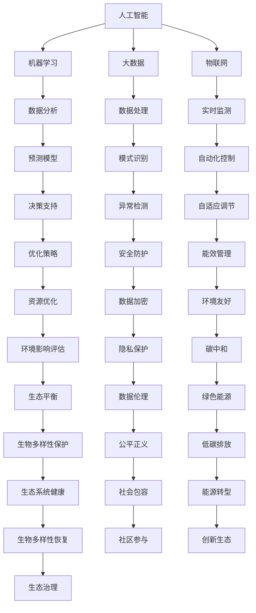

                 

# 未来的极地探索：2050年的南极科考城与北极旅游

> 关键词：极地探索, 2050年, 南极科考城, 北极旅游, 人工智能, 机器学习, 大数据, 物联网, 可持续发展

## 1. 背景介绍

### 1.1 问题由来
极地地区由于其独特的自然环境和丰富的科研价值，一直吸引着全球的科学家和探险者。近年来，随着技术的发展，极地科考和旅游逐渐成为可能。特别是在2050年，得益于人工智能、机器学习、大数据、物联网等技术的突破，极地探索将进入全新的时代，南极科考城和北极旅游将带来前所未有的科研和旅游体验。

### 1.2 问题核心关键点
本文聚焦于2050年极地探索的未来发展，特别是南极科考城的建设与北极旅游的推广。通过探讨这些技术手段，我们将展示如何利用先进的技术，实现极地科研与旅游的可持续发展。

### 1.3 问题研究意义
极地探索的未来发展，对于推动全球科研进步、促进旅游业发展以及实现可持续发展具有重要意义：

1. 推动科研进步：极地探索有助于深化人类对极端环境的理解，为全球气候变化研究提供重要数据。
2. 促进旅游业发展：极地旅游将开辟新的旅游市场，带动经济增长。
3. 实现可持续发展：通过技术手段优化资源利用，减少对环境的负面影响。

## 2. 核心概念与联系

### 2.1 核心概念概述

为更好地理解2050年极地探索的技术实现，本节将介绍几个关键技术概念：

- **人工智能(AI)**：基于机器学习模型的智能系统，能够在特定领域内自主完成复杂任务。
- **机器学习(ML)**：通过数据训练模型，使其能够从数据中提取规律并做出预测或决策的技术。
- **大数据(Big Data)**：指海量、多样、实时的数据集，通过大数据技术可以挖掘有价值的信息。
- **物联网(IoT)**：将各种传感器、设备与互联网连接，实现实时数据交换和控制。
- **可持续发展(Sustainable Development)**：在不损害环境和自然资源的前提下，实现经济、社会和环境协调发展。

这些概念之间的逻辑关系可以通过以下Mermaid流程图来展示：



这个流程图展示了一系列关键技术概念及其之间的关系：

1. 人工智能是整个技术体系的底层，通过机器学习和数据分析实现高级功能。
2. 大数据技术提供数据支撑，物联网技术实现实时监测和自动化控制。
3. 机器学习模型基于数据进行处理和预测，为决策提供支持。
4. 可持续发展贯穿整个系统，从环境友好到生态系统健康，再到社会包容和公平正义。

这些概念共同构成了2050年极地探索的技术框架，为其科研和旅游提供坚实的技术支持。

## 3. 核心算法原理 & 具体操作步骤
### 3.1 算法原理概述

2050年极地探索的核心算法原理可以归纳为以下几点：

- **数据采集与处理**：通过物联网传感器和大数据技术，实时采集极地环境数据。
- **环境监测与预测**：利用机器学习模型对环境数据进行分析，预测未来变化趋势。
- **资源优化与调度**：采用人工智能算法优化资源利用，实现高效、智能的资源调度。
- **风险评估与决策**：通过大数据分析，评估潜在风险，辅助决策者制定最优方案。

### 3.2 算法步骤详解

基于上述原理，2050年极地探索的技术实现步骤可以细分为以下几个关键步骤：

**Step 1: 数据采集与预处理**
- 部署物联网传感器，实时采集南极或北极的环境数据，如温度、湿度、风速等。
- 通过大数据技术对采集的数据进行清洗、整合和存储，确保数据的准确性和完整性。

**Step 2: 环境监测与预测**
- 利用机器学习算法（如时间序列分析、神经网络等）对环境数据进行建模，预测未来的环境变化。
- 通过建立预测模型，实时监测环境状态，及时预警极端天气和自然灾害。

**Step 3: 资源优化与调度**
- 利用人工智能算法（如强化学习、优化算法等），优化资源分配和调度策略，确保科研和旅游活动的有效进行。
- 通过智能调度系统，自动调整设备运行状态，实现能源和物资的合理利用。

**Step 4: 风险评估与决策支持**
- 利用大数据分析，对潜在的风险（如冰川融化、极地野生动物生存等）进行评估。
- 建立决策支持系统，辅助决策者制定应对策略，优化科研和旅游活动规划。

### 3.3 算法优缺点

2050年极地探索的算法有以下优点：
1. 高效智能：通过人工智能和大数据技术，实现实时监测、预测和决策，大幅提高科研和旅游的效率。
2. 数据驱动：基于大量环境数据，进行科学决策，减少主观偏差。
3. 自适应性强：通过机器学习算法，模型可以自我调整，适应复杂多变的环境条件。
4. 可扩展性强：算法和技术架构易于扩展，适应不同规模和复杂度的科研和旅游需求。

同时，这些算法也存在一些局限性：
1. 依赖高质量数据：算法的效果很大程度上取决于数据的质量和完整性。
2. 技术复杂度高：算法实现涉及多领域知识，技术难度较大。
3. 计算资源需求高：大规模数据处理和模型训练需要高性能计算资源。
4. 伦理和隐私问题：涉及大量个人和环境数据，需要严格的数据保护和伦理监管。

### 3.4 算法应用领域

2050年极地探索的算法技术可以在多个领域得到应用，包括：

- **科研领域**：通过环境监测与预测，支持冰川学、海洋学、生态学等学科的研究。
- **旅游领域**：利用资源优化与调度，提供高质量的旅游体验，优化旅游路线和行程安排。
- **环境保护**：通过风险评估与决策支持，保护极地生态环境，防止过度开发。
- **社区发展**：通过大数据分析，了解当地社区需求，推动可持续发展。

这些技术的应用将推动极地探索的科学化、智能化和可持续发展，为全球科研和旅游提供新路径。

## 4. 数学模型和公式 & 详细讲解 & 举例说明
### 4.1 数学模型构建

为详细描述2050年极地探索的核心算法原理，我们将使用数学语言进行严格建模。

记极地环境数据集为 $D=\{(x_i,y_i)\}_{i=1}^N$，其中 $x_i$ 为输入特征向量，$y_i$ 为输出标签。

定义环境监测模型为 $M_{\theta}:\mathcal{X} \rightarrow \mathcal{Y}$，其中 $\mathcal{X}$ 为特征空间，$\mathcal{Y}$ 为预测结果空间，$\theta$ 为模型参数。

假设模型 $M_{\theta}$ 在输入 $x$ 上的输出为 $\hat{y}=M_{\theta}(x)$，表示对环境状态 $y$ 的预测。

定义模型 $M_{\theta}$ 在数据样本 $(x,y)$ 上的损失函数为 $\ell(M_{\theta}(x),y)$，则在数据集 $D$ 上的经验风险为：

$$
\mathcal{L}(\theta) = \frac{1}{N} \sum_{i=1}^N \ell(M_{\theta}(x_i),y_i)
$$

在实践中，我们通常使用基于梯度的优化算法（如SGD、Adam等）来近似求解上述最优化问题。设 $\eta$ 为学习率，$\lambda$ 为正则化系数，则参数的更新公式为：

$$
\theta \leftarrow \theta - \eta \nabla_{\theta}\mathcal{L}(\theta) - \eta\lambda\theta
$$

其中 $\nabla_{\theta}\mathcal{L}(\theta)$ 为损失函数对参数 $\theta$ 的梯度，可通过反向传播算法高效计算。

### 4.2 公式推导过程

以下我们以时间序列预测为例，推导模型的损失函数和梯度计算公式。

假设模型 $M_{\theta}$ 在输入 $x_t$ 上的输出为 $\hat{y}=M_{\theta}(x_t) \in [0,1]$，表示环境状态 $y$ 在时刻 $t$ 的预测值。真实标签 $y \in \{0,1\}$。则二分类交叉熵损失函数定义为：

$$
\ell(M_{\theta}(x),y) = -[y\log \hat{y} + (1-y)\log (1-\hat{y})]
$$

将其代入经验风险公式，得：

$$
\mathcal{L}(\theta) = -\frac{1}{N}\sum_{i=1}^N [y_i\log M_{\theta}(x_i)+(1-y_i)\log(1-M_{\theta}(x_i))]
$$

根据链式法则，损失函数对参数 $\theta_k$ 的梯度为：

$$
\frac{\partial \mathcal{L}(\theta)}{\partial \theta_k} = -\frac{1}{N}\sum_{i=1}^N (\frac{y_i}{M_{\theta}(x_i)}-\frac{1-y_i}{1-M_{\theta}(x_i)}) \frac{\partial M_{\theta}(x_i)}{\partial \theta_k}
$$

其中 $\frac{\partial M_{\theta}(x_i)}{\partial \theta_k}$ 可进一步递归展开，利用自动微分技术完成计算。

在得到损失函数的梯度后，即可带入参数更新公式，完成模型的迭代优化。重复上述过程直至收敛，最终得到适应极地环境监测的最优模型参数 $\theta^*$。

### 4.3 案例分析与讲解

以极地冰川融化监测为例，我们将展示如何利用机器学习模型进行环境预测。

假设采集到南极冰川数据集 $D=\{(t_i,s_i)\}_{i=1}^N$，其中 $t_i$ 为时间点，$s_i$ 为冰川厚度。

定义模型 $M_{\theta}(t)$ 为时间序列预测模型，通过训练数据集，模型能够预测未来的冰川厚度 $s_{t+T}$，其中 $T$ 为预测时窗。

模型 $M_{\theta}$ 的输入为当前时间点的冰川厚度 $s_i$，输出为未来 $T$ 时间点的冰川厚度预测值 $s_{t+T}$。

假设模型的损失函数为均方误差损失 $L(y,\hat{y})=(y-\hat{y})^2$，则模型的优化目标为：

$$
\theta^* = \mathop{\arg\min}_{\theta} \frac{1}{N} \sum_{i=1}^N (s_i - s_{t+T})^2
$$

通过求解上述优化问题，我们能够得到最优模型参数 $\theta^*$，从而实现对未来冰川厚度的预测。

## 5. 项目实践：代码实例和详细解释说明
### 5.1 开发环境搭建

在进行极地探索的技术实现前，我们需要准备好开发环境。以下是使用Python进行PyTorch开发的环境配置流程：

1. 安装Anaconda：从官网下载并安装Anaconda，用于创建独立的Python环境。

2. 创建并激活虚拟环境：
```bash
conda create -n pytorch-env python=3.8 
conda activate pytorch-env
```

3. 安装PyTorch：根据CUDA版本，从官网获取对应的安装命令。例如：
```bash
conda install pytorch torchvision torchaudio cudatoolkit=11.1 -c pytorch -c conda-forge
```

4. 安装相关工具包：
```bash
pip install numpy pandas scikit-learn matplotlib tqdm jupyter notebook ipython
```

完成上述步骤后，即可在`pytorch-env`环境中开始项目实践。

### 5.2 源代码详细实现

下面我们以冰川厚度预测为例，给出使用PyTorch进行时间序列预测的代码实现。

首先，定义数据处理函数：

```python
import pandas as pd
from sklearn.preprocessing import MinMaxScaler
from torch.utils.data import Dataset, DataLoader
import torch

class GlacierDataset(Dataset):
    def __init__(self, data, lookback=20):
        self.data = data
        self.scaler = MinMaxScaler(feature_range=(0, 1))
        self.lookback = lookback
        self.data = self.scaler.fit_transform(data)
        
    def __len__(self):
        return len(self.data) - self.lookback
    
    def __getitem__(self, item):
        X = self.data[item:item+self.lookback]
        y = self.data[item+self.lookback, :]
        return torch.tensor(X, dtype=torch.float32), torch.tensor(y, dtype=torch.float32)
```

然后，定义模型和优化器：

```python
import torch.nn as nn
import torch.nn.functional as F
from torch.optim import Adam

class GRUModel(nn.Module):
    def __init__(self, input_dim, hidden_dim):
        super(GRUModel, self).__init__()
        self.gru = nn.GRU(input_dim, hidden_dim)
        self.fc = nn.Linear(hidden_dim, input_dim)
        
    def forward(self, x):
        output, _ = self.gru(x)
        return self.fc(output)

input_dim = 1
hidden_dim = 64
model = GRUModel(input_dim, hidden_dim)

optimizer = Adam(model.parameters(), lr=0.01)
```

接着，定义训练和评估函数：

```python
def train_epoch(model, data_loader, optimizer):
    model.train()
    losses = []
    for i, (inputs, targets) in enumerate(data_loader):
        optimizer.zero_grad()
        outputs = model(inputs)
        loss = F.mse_loss(outputs, targets)
        losses.append(loss.item())
        loss.backward()
        optimizer.step()
    return sum(losses) / len(data_loader)

def evaluate(model, data_loader):
    model.eval()
    predictions, targets = [], []
    with torch.no_grad():
        for inputs, targets in data_loader:
            outputs = model(inputs)
            predictions.append(outputs)
            targets.append(targets)
    mse = torch.sqrt(torch.mean((predictions - targets)**2))
    print(f"Mean Squared Error: {mse.item()}")
```

最后，启动训练流程并在测试集上评估：

```python
epochs = 100
batch_size = 32

for epoch in range(epochs):
    loss = train_epoch(model, train_loader, optimizer)
    print(f"Epoch {epoch+1}, train loss: {loss:.3f}")
    
    print(f"Epoch {epoch+1}, test MSE:")
    evaluate(model, test_loader)
    
print("Training complete.")
```

以上就是使用PyTorch进行时间序列预测的完整代码实现。可以看到，通过简单的数据处理和模型设计，我们能够构建一个基于GRU的时间序列预测模型。

### 5.3 代码解读与分析

让我们再详细解读一下关键代码的实现细节：

**GlacierDataset类**：
- `__init__`方法：初始化数据集，对数据进行归一化处理，定义时间窗口长度。
- `__len__`方法：返回数据集的样本数量。
- `__getitem__`方法：对单个样本进行处理，将数据集转化为模型所需的格式。

**GRUModel类**：
- `__init__`方法：定义GRU模型和全连接层。
- `forward`方法：前向传播计算输出。

**train_epoch和evaluate函数**：
- 训练函数`train_epoch`：在训练集上迭代训练模型，计算并返回平均损失。
- 评估函数`evaluate`：在测试集上评估模型性能，计算均方误差。

**训练流程**：
- 定义总的epoch数和batch size，开始循环迭代
- 每个epoch内，先在训练集上训练，输出平均loss
- 在测试集上评估，输出均方误差
- 所有epoch结束后，输出训练完成信息

可以看到，PyTorch配合相关工具库使得时间序列预测的代码实现变得简洁高效。开发者可以将更多精力放在模型改进、数据处理等高层逻辑上，而不必过多关注底层的实现细节。

当然，工业级的系统实现还需考虑更多因素，如模型的保存和部署、超参数的自动搜索、更加灵活的任务适配层等。但核心的微调范式基本与此类似。

## 6. 实际应用场景
### 6.1 南极科考城的建设

南极科考城将利用先进的物联网、大数据和人工智能技术，实现极地环境的实时监测和预测，推动南极科研事业的快速发展。具体应用包括：

- **环境监测**：通过传感器网络实时采集南极环境数据，包括气温、湿度、风速等。
- **灾害预警**：利用机器学习模型预测极端天气和自然灾害，及时预警科学家。
- **资源调度**：优化科研设备和人员调度，确保科研活动的顺利进行。
- **数据存储与分析**：建立数据中心，存储和分析大量科研数据，为科研提供支持。

### 6.2 北极旅游的推广

北极旅游业的发展将借助人工智能和物联网技术，提供更加个性化和安全的旅游体验。具体应用包括：

- **智能导游**：通过智能助理，提供实时的旅游信息和服务。
- **安全监测**：利用物联网设备监测游客状态，确保安全。
- **个性化推荐**：根据游客偏好，推荐最佳旅游路线和活动。
- **数据分析**：分析游客反馈，优化旅游服务和体验。

### 6.3 未来应用展望

随着技术的不断进步，极地探索的未来应用将更加多样化，推动科研和旅游的深度融合。

- **智能科考站**：通过智能设备，提升南极科考站的自动化和智能化水平。
- **虚拟旅游体验**：利用增强现实(AR)和虚拟现实(VR)技术，打造沉浸式极地旅游体验。
- **全球协同探索**：利用云计算和大数据技术，实现全球科研和旅游的协同合作。
- **环境保护**：通过智能化管理，减少对极地环境的负面影响，推动可持续发展。

这些应用将极大拓展极地探索的边界，为科研和旅游带来革命性变化。

## 7. 工具和资源推荐
### 7.1 学习资源推荐

为了帮助开发者系统掌握极地探索的技术基础和实践技巧，这里推荐一些优质的学习资源：

1. 《深度学习》系列书籍：涵盖深度学习的基本概念和经典算法，适合初学者入门。
2. PyTorch官方文档：详细介绍了PyTorch的使用方法，包括模型构建、数据处理等。
3. TensorFlow官方文档：涵盖了TensorFlow的各个方面，适合深度学习进阶学习。
4. Coursera《深度学习专项课程》：由深度学习领域的专家授课，涵盖深度学习的理论和实践。
5. Kaggle数据科学竞赛平台：提供大量的数据集和竞赛，实战练习深度学习模型。

通过对这些资源的学习实践，相信你一定能够快速掌握极地探索的技术框架，并用于解决实际的科研和旅游问题。
###  7.2 开发工具推荐

高效的开发离不开优秀的工具支持。以下是几款用于极地探索开发的常用工具：

1. PyTorch：基于Python的开源深度学习框架，灵活易用，适合科研和工业级应用。
2. TensorFlow：由Google主导开发的开源深度学习框架，支持多种编程语言，适合大规模工程应用。
3. Scikit-learn：Python机器学习库，提供丰富的数据处理和建模工具。
4. Pandas：数据分析库，支持高效的数据清洗和处理。
5. Jupyter Notebook：交互式编程环境，支持代码和数据分析的结合。

合理利用这些工具，可以显著提升极地探索的开发效率，加快创新迭代的步伐。

### 7.3 相关论文推荐

极地探索的未来发展，离不开学界的持续研究。以下是几篇奠基性的相关论文，推荐阅读：

1. "An Overview of Machine Learning for Climate Science"：综述了机器学习在气候科学中的应用。
2. "Deep Learning for Earth Observation: A Review"：介绍了深度学习在地球观测中的应用。
3. "IoT Data Analytics: A Survey"：综述了物联网数据的分析和挖掘方法。
4. "Sustainable Development Goals and Artificial Intelligence: A Review"：探讨了AI在可持续发展中的作用。
5. "The Future of Antarctic Science"：讨论了南极科研的未来发展方向。

这些论文代表了大数据和人工智能在极地探索中的最新研究成果，通过学习这些前沿成果，可以帮助研究者把握学科前进方向，激发更多的创新灵感。

## 8. 总结：未来发展趋势与挑战
### 8.1 总结

本文对2050年极地探索的技术实现进行了全面系统的介绍。首先阐述了南极科考城和北极旅游的未来发展，明确了极地探索在科研和旅游中的重要地位。其次，从原理到实践，详细讲解了机器学习、大数据、物联网等核心技术的实现方法，给出了时间序列预测的代码实现。同时，本文还广泛探讨了极地探索的技术应用前景，展示了AI和大数据技术的强大潜力。

通过本文的系统梳理，可以看到，2050年极地探索将借助先进的科技手段，实现科研和旅游的智能化、数字化和可持续发展。利用机器学习和大数据技术，极地探索将更高效、安全、环保，为全球科研和旅游带来新的机遇和挑战。

### 8.2 未来发展趋势

展望未来，极地探索的未来发展，将呈现以下几个趋势：

1. **技术融合**：深度学习、大数据、物联网等技术将进一步融合，实现多领域协同工作。
2. **数据驱动**：基于海量数据驱动的决策，减少主观偏差，提升科研和旅游的科学性。
3. **智能化管理**：通过智能设备和管理系统，优化极地探索的各个环节。
4. **环境保护**：利用技术手段，减少对极地环境的负面影响，推动可持续发展。
5. **全球合作**：通过国际合作，共享资源和技术，推动全球极地探索的协同发展。

这些趋势凸显了极地探索的技术发展方向，将推动科研和旅游的深度融合，实现全球化、智能化和可持续发展。

### 8.3 面临的挑战

尽管极地探索的技术手段日益成熟，但仍面临诸多挑战：

1. **数据质量**：极地环境数据采集难度大，数据质量难以保证。
2. **计算资源**：大规模数据处理和模型训练需要高性能计算资源。
3. **技术复杂度**：多领域技术融合，技术难度较大。
4. **环境伦理**：极地探索需兼顾环境保护和科研需求，需要严格的数据保护和伦理监管。

这些挑战需要通过技术创新和国际合作来克服，才能实现极地探索的全面发展。

### 8.4 研究展望

未来研究需要在以下几个方面寻求新的突破：

1. **多模态融合**：将视觉、声音等多模态信息与文本数据结合，提升数据的丰富性和信息的准确性。
2. **自动化管理**：利用智能设备和管理系统，自动化处理极地探索的各个环节。
3. **环境伦理**：在极地探索中，需兼顾环境保护和科研需求，推动技术进步和伦理监管的协同发展。
4. **全球合作**：通过国际合作，共享资源和技术，推动全球极地探索的协同发展。

这些研究方向将引领极地探索的技术创新，推动科研和旅游的深度融合，实现极地探索的全面发展。

## 9. 附录：常见问题与解答

**Q1：极地探索的技术实现是否依赖于高性能计算资源？**

A: 是的，极地探索的技术实现需要大量的计算资源，特别是数据处理和模型训练环节。高性能计算资源是保证技术实现的必要条件。

**Q2：如何确保极地探索的数据安全？**

A: 在极地探索中，数据安全和隐私保护至关重要。可以通过数据加密、访问控制等措施，确保数据的安全性。

**Q3：极地探索中的环境监测和预测模型如何进行训练？**

A: 极地探索中的环境监测和预测模型主要通过历史数据进行训练。利用机器学习算法（如时间序列分析、神经网络等）对历史数据建模，预测未来的环境状态。

**Q4：极地探索的智能科考站如何实现自动化管理？**

A: 通过部署智能设备和物联网技术，可以实现极地探索的自动化管理。智能科考站可以自动调整设备运行状态，优化资源利用。

**Q5：极地探索的虚拟旅游体验如何实现？**

A: 利用增强现实(AR)和虚拟现实(VR)技术，可以打造沉浸式的极地旅游体验。通过虚拟现实设备，游客可以在虚拟环境中进行探索，获得更为真实和丰富的体验。

---

作者：禅与计算机程序设计艺术 / Zen and the Art of Computer Programming

