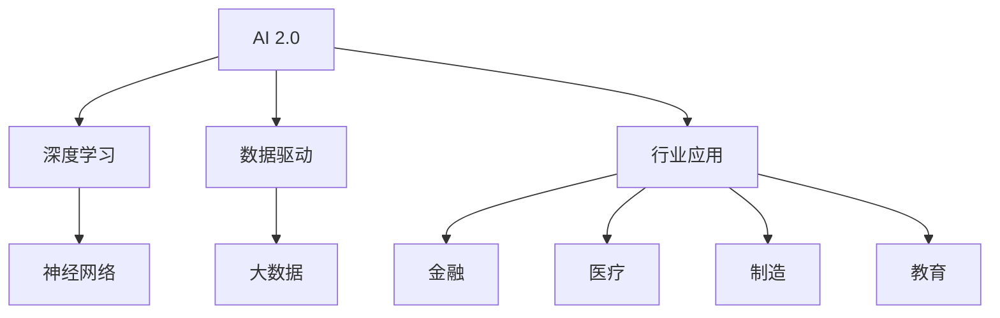

                 

# 李开复：AI 2.0 时代的市场前景

> 关键词：人工智能, AI 2.0, 未来市场, 技术变革, 数据驱动, 创新应用, 行业变革, 投资机遇

## 1. 背景介绍

### 1.1 人工智能的兴起

在过去的十年中，人工智能（AI）技术取得了前所未有的进步，特别是在深度学习和大数据驱动的机器学习领域。从语音识别到图像处理，从自然语言处理到机器人技术，人工智能的应用场景不断扩展，已经渗透到生活的方方面面。而AI 2.0时代的到来，更是将这一波技术变革推向了新的高度。

### 1.2 AI 2.0时代的定义

AI 2.0时代的核心特征是深度学习和数据驱动的全面融合，技术突破不再局限于特定领域，而是广泛应用到各个行业。AI 2.0代表了人工智能技术的全面成熟和商业化，其定义不仅包括了技术的进步，更包括市场的成熟和产业化的加速。

## 2. 核心概念与联系

### 2.1 核心概念概述

为了深入理解AI 2.0时代的市场前景，首先需要明确几个关键概念：

- **AI 2.0**：AI 2.0时代的核心，强调深度学习和数据驱动技术的全面应用和商业化。
- **深度学习**：通过神经网络等方法，使机器能够从大量数据中学习，自动提取特征，从而实现高精度预测和决策。
- **数据驱动**：通过收集、存储、分析和利用数据，驱动机器学习和决策的过程。
- **行业应用**：AI 2.0技术在各个行业的应用，如金融、医疗、制造、教育等。

这些概念之间的联系可以通过以下Mermaid流程图来展示：



该流程图展示了AI 2.0时代的技术栈和应用场景：深度学习是AI 2.0的核心，数据驱动提供了必要的支持，行业应用则是最终的目标。

## 3. 核心算法原理 & 具体操作步骤

### 3.1 算法原理概述

AI 2.0时代的核心算法是深度学习，其中神经网络是主要的技术手段。深度学习通过多层神经网络结构，能够从大量数据中自动提取特征，并通过反向传播算法不断优化模型参数，从而实现对复杂问题的精确预测和决策。

### 3.2 算法步骤详解

AI 2.0时代的深度学习模型构建和训练流程如下：

**Step 1: 数据预处理**
- 收集和清洗数据，去除噪声和异常值。
- 数据划分训练集、验证集和测试集。

**Step 2: 模型构建**
- 设计多层神经网络结构，包括输入层、隐藏层和输出层。
- 选择合适的激活函数和损失函数。

**Step 3: 模型训练**
- 使用反向传播算法优化模型参数。
- 通过小批量随机梯度下降（SGD）更新权重和偏置。
- 在验证集上监控模型性能，防止过拟合。

**Step 4: 模型评估**
- 在测试集上评估模型性能，计算准确率、召回率、F1-score等指标。
- 通过交叉验证等方法，进一步优化模型。

**Step 5: 模型应用**
- 将模型集成到实际应用系统中，进行推理预测。
- 持续收集新数据，更新模型以适应变化。

### 3.3 算法优缺点

**优点**
- 高精度：深度学习模型能够处理复杂、高维度的数据，实现高精度的预测和决策。
- 自动化：通过自动化的特征提取和学习，减少了人工干预的复杂度。
- 可扩展性：深度学习模型可以并行计算，在大数据环境下具有很好的扩展性。

**缺点**
- 数据依赖：深度学习模型需要大量的标注数据进行训练，数据获取成本高。
- 过拟合：深度学习模型容易在训练集上过拟合，需要复杂的正则化技术进行防止。
- 模型复杂：深度学习模型结构复杂，难以解释和调试。

### 3.4 算法应用领域

AI 2.0时代的深度学习模型在多个领域得到了广泛应用：

- **金融**：风险评估、投资策略、反欺诈检测等。
- **医疗**：疾病诊断、药物研发、健康监测等。
- **制造**：质量检测、生产优化、设备维护等。
- **教育**：个性化推荐、智能辅导、学习分析等。
- **零售**：客户分析、产品推荐、库存管理等。

## 4. 数学模型和公式 & 详细讲解

### 4.1 数学模型构建

AI 2.0时代的深度学习模型通常包括输入层、隐藏层和输出层。以神经网络为例，其数学模型为：

$$
y = \sum_{i=1}^{n} w_i x_i + b
$$

其中，$y$ 表示输出，$x_i$ 表示输入，$w_i$ 表示权重，$b$ 表示偏置。

### 4.2 公式推导过程

神经网络的训练过程主要通过反向传播算法进行。以二分类问题为例，损失函数通常使用交叉熵损失：

$$
\mathcal{L}(y, \hat{y}) = -y\log \hat{y} - (1-y)\log(1-\hat{y})
$$

其中，$y$ 表示真实标签，$\hat{y}$ 表示模型预测的标签。通过反向传播算法，计算梯度并更新权重和偏置：

$$
w_i \leftarrow w_i - \eta \frac{\partial \mathcal{L}}{\partial w_i}
$$

其中，$\eta$ 为学习率。

### 4.3 案例分析与讲解

以图像识别为例，深度学习模型可以从大量图像数据中学习到特征，并在新的图像上进行预测。通过卷积神经网络（CNN），模型可以自动提取图像的局部特征，并在池化层中进行特征聚合，最终输出识别结果。

## 5. 项目实践：代码实例和详细解释说明

### 5.1 开发环境搭建

在进行AI 2.0模型的开发和应用前，需要先搭建好开发环境。以下是在Python中使用PyTorch进行开发的示例：

1. 安装Anaconda：
```bash
conda install anaconda
```

2. 创建虚拟环境：
```bash
conda create --name pytorch-env python=3.8
conda activate pytorch-env
```

3. 安装PyTorch和其他库：
```bash
pip install torch torchvision torchaudio transformers numpy scipy scikit-learn matplotlib
```

4. 安装TensorBoard：
```bash
pip install tensorboard
```

5. 安装Transformers库：
```bash
pip install transformers
```

### 5.2 源代码详细实现

以下是一个使用PyTorch和Transformers库进行图像分类的示例代码：

```python
import torch
from transformers import BertForSequenceClassification, BertTokenizer

# 加载预训练模型和分词器
model = BertForSequenceClassification.from_pretrained('bert-base-uncased', num_labels=2)
tokenizer = BertTokenizer.from_pretrained('bert-base-uncased')

# 数据预处理
def preprocess(text):
    tokens = tokenizer(text, max_length=512, padding='max_length', truncation=True)
    input_ids = tokens['input_ids']
    attention_mask = tokens['attention_mask']
    return input_ids, attention_mask

# 模型训练
def train_epoch(model, data_loader, optimizer):
    model.train()
    for batch in data_loader:
        input_ids, attention_mask = batch
        labels = batch['labels']
        optimizer.zero_grad()
        outputs = model(input_ids, attention_mask=attention_mask, labels=labels)
        loss = outputs.loss
        loss.backward()
        optimizer.step()

# 模型评估
def evaluate(model, data_loader):
    model.eval()
    correct = 0
    total = 0
    with torch.no_grad():
        for batch in data_loader:
            input_ids, attention_mask = batch
            labels = batch['labels']
            outputs = model(input_ids, attention_mask=attention_mask)
            _, predicted = torch.max(outputs.logits, dim=1)
            correct += (predicted == labels).sum().item()
            total += labels.size(0)
    accuracy = correct / total
    return accuracy

# 训练模型
epochs = 10
batch_size = 32

train_data_loader = ...
val_data_loader = ...

optimizer = torch.optim.Adam(model.parameters(), lr=1e-5)

for epoch in range(epochs):
    train_epoch(model, train_data_loader, optimizer)
    val_accuracy = evaluate(model, val_data_loader)
    print(f"Epoch {epoch+1}, validation accuracy: {val_accuracy:.3f}")

```

### 5.3 代码解读与分析

在上述代码中，我们首先加载了预训练的BERT模型和分词器，然后定义了数据预处理和模型训练的函数。通过TensorBoard等工具，可以可视化模型训练过程中的损失函数和精度变化。

## 6. 实际应用场景

### 6.1 金融

AI 2.0在金融领域的应用主要集中在风险评估、投资策略和反欺诈检测等方面。通过深度学习模型，金融机构可以自动化分析客户的信用风险，预测市场走势，识别异常交易行为。例如，银行可以利用AI 2.0模型对贷款申请进行快速审批，提高审批效率，同时降低违约风险。

### 6.2 医疗

在医疗领域，AI 2.0的应用主要集中在疾病诊断、药物研发和健康监测等方面。深度学习模型可以通过分析患者的电子病历和基因数据，辅助医生进行诊断和治疗方案选择。例如，AI 2.0可以帮助医生识别出早期癌症患者，提高治疗成功率。

### 6.3 制造

AI 2.0在制造领域的应用主要集中在质量检测、生产优化和设备维护等方面。通过深度学习模型，制造企业可以实现自动化检测生产线上的缺陷，优化生产流程，预测设备故障，减少停机时间。例如，AI 2.0可以帮助工厂检测产品的质量问题，同时预测设备故障，提前进行维护，降低生产成本。

### 6.4 教育

在教育领域，AI 2.0的应用主要集中在个性化推荐、智能辅导和学习分析等方面。深度学习模型可以通过分析学生的学习行为和成绩数据，推荐个性化的学习内容，提供智能辅导，分析学生的学习效果。例如，AI 2.0可以帮助学生自动生成学习计划，提供个性化的作业推荐，提高学习效率。

## 7. 工具和资源推荐

### 7.1 学习资源推荐

为了帮助开发者系统掌握AI 2.0技术的理论基础和实践技巧，以下是一些优质的学习资源：

- **Deep Learning Specialization by Andrew Ng**：由Coursera提供的深度学习专业课程，由深度学习领域的权威专家Andrew Ng讲授。
- **TensorFlow官方文档**：谷歌推出的深度学习框架TensorFlow的官方文档，提供了详细的API和教程。
- **PyTorch官方文档**：Facebook开源的深度学习框架PyTorch的官方文档，提供了丰富的示例和教程。
- **Transformers官方文档**：HuggingFace推出的自然语言处理工具库Transformers的官方文档，提供了丰富的预训练模型和微调样例。

### 7.2 开发工具推荐

以下是几款用于AI 2.0开发和研究的常用工具：

- **Jupyter Notebook**：一个免费的交互式编程环境，可以轻松地进行数据可视化、代码调试和论文写作。
- **TensorBoard**：谷歌推出的可视化工具，可以实时监测模型训练状态，生成详细的图表和报告。
- **Colab**：谷歌提供的在线Jupyter Notebook环境，支持GPU计算，方便快速实验和分享。
- **Keras**：一个高级神经网络API，可以方便地构建和训练深度学习模型。

### 7.3 相关论文推荐

以下是几篇奠基性的AI 2.0相关论文，推荐阅读：

- **ImageNet Classification with Deep Convolutional Neural Networks**：AlexNet论文，首次展示了深度卷积神经网络在图像分类任务上的强大能力。
- **Efficient Backprop**：BP算法论文，奠定了反向传播算法的基础。
- **Convolutional Neural Networks for Learning Face Representations**：Google提出的基于卷积神经网络的面部识别系统，展示了深度学习在计算机视觉领域的潜力。
- **Attention is All You Need**：Transformer论文，提出了自注意力机制，开创了Transformer模型的新纪元。

## 8. 总结：未来发展趋势与挑战

### 8.1 研究成果总结

AI 2.0时代的深度学习技术已经取得了巨大的进展，在多个领域得到了广泛应用。深度学习模型的高精度和自动化，大大提高了各行业的运营效率和决策质量。同时，AI 2.0技术也在不断扩展其应用范围，推动了社会的全面数字化转型。

### 8.2 未来发展趋势

AI 2.0时代的未来发展趋势主要集中在以下几个方面：

- **数据驱动的全面普及**：数据获取和处理技术的进步，将进一步推动深度学习模型在更多领域的应用。
- **模型可解释性的提升**：通过引入可解释性技术，如因果分析和解释模型，提高AI 2.0模型的透明度和可理解性。
- **跨模态学习的探索**：将深度学习模型应用于多种数据模态，如文本、图像、声音等，提升综合决策能力。
- **边缘计算的引入**：将AI 2.0技术部署到边缘设备，提高实时性、降低延迟，实现更灵活的决策和分析。
- **伦理和隐私的保护**：在AI 2.0技术的应用中，加强伦理和隐私保护，确保技术应用的安全性和可靠性。

### 8.3 面临的挑战

尽管AI 2.0技术在许多领域取得了显著进展，但仍面临一些挑战：

- **数据获取的难度**：深度学习模型需要大量的标注数据，而获取高质量数据成本高昂。
- **模型的复杂性和可解释性**：深度学习模型的复杂结构使得其难以解释和调试，需要更多可解释性技术。
- **算力的需求**：深度学习模型训练和推理需要大量的计算资源，对算力提出了很高的要求。
- **伦理和隐私问题**：AI 2.0技术在应用过程中可能带来隐私泄露和偏见，需要严格的伦理和隐私保护措施。

### 8.4 研究展望

为了克服AI 2.0技术面临的挑战，未来的研究方向可能包括以下几个方面：

- **无监督和半监督学习**：通过无监督和半监督学习，减少对标注数据的依赖，利用未标注数据进行模型训练。
- **参数高效的学习**：开发更多参数高效的学习方法，减少模型复杂性，降低计算资源消耗。
- **跨模态学习和融合**：将文本、图像、声音等不同模态的数据进行融合，提高综合决策能力。
- **可解释性和透明性**：通过引入可解释性技术，提高AI 2.0模型的透明度和可理解性。
- **伦理和隐私保护**：在AI 2.0技术的应用中，加强伦理和隐私保护，确保技术应用的安全性和可靠性。

## 9. 附录：常见问题与解答

**Q1: AI 2.0时代的核心技术是什么？**

A: AI 2.0时代的核心技术是深度学习和数据驱动技术。深度学习通过多层神经网络结构，能够从大量数据中自动提取特征，并进行高精度预测和决策。

**Q2: AI 2.0技术在金融领域的应用有哪些？**

A: AI 2.0技术在金融领域的应用包括风险评估、投资策略和反欺诈检测等。深度学习模型可以自动化分析客户的信用风险，预测市场走势，识别异常交易行为。

**Q3: AI 2.0技术在医疗领域的应用有哪些？**

A: AI 2.0技术在医疗领域的应用包括疾病诊断、药物研发和健康监测等。深度学习模型可以辅助医生进行诊断和治疗方案选择。

**Q4: AI 2.0技术在制造领域的应用有哪些？**

A: AI 2.0技术在制造领域的应用包括质量检测、生产优化和设备维护等。通过深度学习模型，制造企业可以实现自动化检测生产线上的缺陷，优化生产流程，预测设备故障，减少停机时间。

**Q5: AI 2.0技术在教育领域的应用有哪些？**

A: AI 2.0技术在教育领域的应用包括个性化推荐、智能辅导和学习分析等。深度学习模型可以分析学生的学习行为和成绩数据，推荐个性化的学习内容，提供智能辅导，分析学生的学习效果。

---

作者：禅与计算机程序设计艺术 / Zen and the Art of Computer Programming

