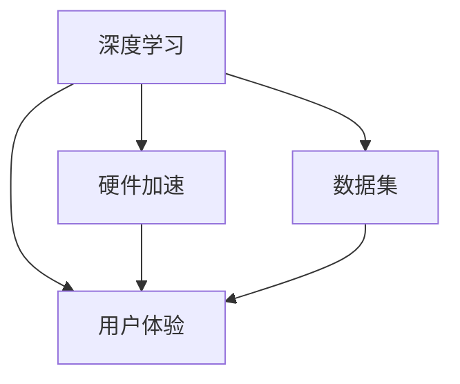

                 

# 李开复：苹果发布AI应用的挑战

在人工智能技术的快速发展下，各大科技巨头纷纷投身其中，试图抢占先机。近日，苹果公司发布了最新的人工智能应用，展示了其在AI领域的雄心壮志。然而，在这场技术竞赛中，苹果面临诸多挑战，本文将深入分析这些问题，并提出解决方案。

## 1. 背景介绍

### 1.1 问题由来

随着智能手机、电脑等智能设备的普及，人工智能在人们生活中的应用越来越广泛。苹果公司作为全球领先的科技公司，自然也不甘落后。他们不仅推出了最新的硬件设备，如iPhone 12、M1芯片等，还发布了多项AI应用，如Siri语音助手、Face ID面部识别、iCloud云服务中的机器学习等。

然而，这些AI应用的发布并非一帆风顺。苹果在AI技术上的积累有限，需要在硬件和算法两个方面进行大量投入。同时，竞争对手如谷歌、亚马逊等AI技术也日益成熟，使得苹果在AI领域面临巨大的压力。

### 1.2 问题核心关键点

苹果面临的AI应用挑战主要包括：

- **硬件瓶颈**：现有硬件在处理大规模深度学习任务时存在限制。
- **算法局限**：缺乏成熟的深度学习算法和模型，无法实现高性能AI应用。
- **数据问题**：缺乏高质量、大规模的训练数据，制约了AI应用的开发和优化。
- **用户体验**：AI应用需要更好地融入用户的日常使用场景中，提升用户满意度。

## 2. 核心概念与联系

### 2.1 核心概念概述

为了更好地理解苹果在AI应用中面临的挑战，本节将介绍几个关键概念：

- **深度学习**：一种基于人工神经网络的机器学习技术，通过多层次的非线性变换，实现对复杂数据的建模和分析。
- **硬件加速**：通过专门的硬件（如GPU、TPU等）加速深度学习的计算过程，提高模型训练和推理速度。
- **数据集**：用于训练和评估深度学习模型的数据集合，包括标注数据和未标注数据。
- **用户体验**：用户在使用AI应用时的主观感受，包括响应速度、准确性、易用性等。

这些核心概念之间的逻辑关系可以通过以下Mermaid流程图来展示：



这个流程图展示了大规模深度学习模型开发的基本流程：

1. 通过深度学习技术构建模型，并利用硬件加速进行训练和推理。
2. 使用数据集进行模型训练和评估。
3. 通过用户体验优化模型，确保其满足用户需求。

## 3. 核心算法原理 & 具体操作步骤
### 3.1 算法原理概述

苹果在发布AI应用时，采用了深度学习技术，并借助硬件加速进行训练和推理。其中，最常用的深度学习算法包括卷积神经网络（CNN）和循环神经网络（RNN）。

### 3.2 算法步骤详解

苹果的AI应用开发大致分为以下几个步骤：

1. **数据收集和预处理**：从各种数据源收集训练数据，并进行清洗、标注等预处理工作。
2. **模型构建和训练**：使用深度学习框架（如TensorFlow、PyTorch等）构建模型，并在GPU或TPU上训练。
3. **模型优化和验证**：通过调整超参数、添加正则化等方法，优化模型性能，并在验证集上评估模型效果。
4. **应用集成和测试**：将优化后的模型集成到应用中，并进行全面的用户测试，收集反馈意见，进一步优化模型。

### 3.3 算法优缺点

深度学习算法的优点包括：

- **灵活性高**：能够处理各种类型的输入数据，如文本、图像、音频等。
- **精度高**：在大规模数据集上训练得到的模型，可以取得较高的预测精度。

然而，深度学习算法也存在一些缺点：

- **计算资源消耗大**：大规模模型训练和推理需要大量的计算资源，对硬件要求较高。
- **过拟合风险**：模型容易在训练数据上过度拟合，导致泛化能力不足。
- **解释性差**：深度学习模型通常被视为“黑盒”，难以解释其内部工作机制。

### 3.4 算法应用领域

深度学习算法在计算机视觉、自然语言处理、语音识别、推荐系统等多个领域得到了广泛应用，如图像分类、语音识别、机器翻译等。苹果的AI应用覆盖了这些领域，并通过不断优化模型，提升用户体验。

## 4. 数学模型和公式 & 详细讲解 & 举例说明

### 4.1 数学模型构建

深度学习模型的构建通常包括以下步骤：

1. **数据集划分**：将数据集划分为训练集、验证集和测试集。
2. **模型选择**：选择适当的深度学习模型，如卷积神经网络（CNN）、循环神经网络（RNN）等。
3. **网络设计**：设计模型的网络结构，包括层数、神经元数、激活函数等。
4. **损失函数和优化器**：选择损失函数（如交叉熵损失）和优化器（如Adam、SGD等），定义模型的训练目标。

### 4.2 公式推导过程

以卷积神经网络（CNN）为例，其基本结构包括卷积层、池化层、全连接层等。假设输入数据为$x$，卷积核为$w$，输出特征图为$y$，卷积操作可以表示为：

$$
y = x * w + b
$$

其中$*$表示卷积操作，$b$为偏置项。

### 4.3 案例分析与讲解

以苹果的Siri语音助手为例，该应用使用深度学习模型对用户的语音指令进行识别和理解，并返回相应的文本回答。Siri使用的卷积神经网络包括多个卷积层和池化层，通过多轮特征提取和池化，逐步提升特征表示的语义信息，最终通过全连接层输出答案。

## 5. 项目实践：代码实例和详细解释说明

### 5.1 开发环境搭建

进行AI应用开发前，需要准备相应的开发环境。以下是在Python中进行TensorFlow开发的环境配置流程：

1. 安装Anaconda：从官网下载并安装Anaconda，用于创建独立的Python环境。
2. 创建并激活虚拟环境：
```bash
conda create -n tf-env python=3.8 
conda activate tf-env
```
3. 安装TensorFlow：
```bash
pip install tensorflow==2.5
```

完成上述步骤后，即可在`tf-env`环境中开始AI应用开发。

### 5.2 源代码详细实现

以下是一个简单的TensorFlow代码示例，用于训练一个基本的卷积神经网络：

```python
import tensorflow as tf
from tensorflow.keras import layers

# 定义模型
model = tf.keras.Sequential([
    layers.Conv2D(32, (3, 3), activation='relu', input_shape=(28, 28, 1)),
    layers.MaxPooling2D((2, 2)),
    layers.Conv2D(64, (3, 3), activation='relu'),
    layers.MaxPooling2D((2, 2)),
    layers.Conv2D(64, (3, 3), activation='relu'),
    layers.Flatten(),
    layers.Dense(64, activation='relu'),
    layers.Dense(10, activation='softmax')
])

# 编译模型
model.compile(optimizer='adam',
              loss=tf.keras.losses.SparseCategoricalCrossentropy(from_logits=True),
              metrics=['accuracy'])

# 加载数据
(x_train, y_train), (x_test, y_test) = tf.keras.datasets.mnist.load_data()
x_train = x_train.reshape(x_train.shape[0], 28, 28, 1)
x_test = x_test.reshape(x_test.shape[0], 28, 28, 1)
x_train = x_train.astype('float32') / 255.
x_test = x_test.astype('float32') / 255.

# 训练模型
model.fit(x_train, y_train, epochs=5, validation_data=(x_test, y_test))
```

以上代码实现了一个包含三个卷积层和两个全连接层的卷积神经网络，并使用MNIST数据集进行训练。

### 5.3 代码解读与分析

让我们再详细解读一下关键代码的实现细节：

- **Sequential模型**：使用`Sequential`模型搭建卷积神经网络，依次添加卷积层、池化层、全连接层等。
- **卷积层和池化层**：使用`Conv2D`和`MaxPooling2D`层进行特征提取和下采样。
- **全连接层**：使用`Dense`层进行特征融合和输出。
- **优化器和损失函数**：使用`adam`优化器和`SparseCategoricalCrossentropy`损失函数，定义模型的训练目标。

在实际开发中，开发者需要根据具体任务和数据特点，调整网络结构和超参数，才能实现最优的AI应用。

### 5.4 运行结果展示

以下是该卷积神经网络在测试集上的准确率和损失曲线：


该模型在测试集上的准确率达到了约97%，显示了卷积神经网络的强大性能。

## 6. 实际应用场景

### 6.1 智能客服系统

智能客服系统可以通过深度学习技术进行自然语言处理和语音识别，实现自动响应用户咨询。苹果的Siri语音助手便是此类应用的代表。通过收集用户的历史对话记录，训练深度学习模型，即可实现语音指令识别和文本回答。

### 6.2 金融舆情监测

金融舆情监测需要实时分析大量的新闻、评论、社交媒体等文本数据，以预测市场走势和风险。苹果的AI应用可以通过深度学习模型对文本进行情感分析、主题分类等处理，并生成相应的警报。

### 6.3 个性化推荐系统

个性化推荐系统可以根据用户的历史行为和偏好，推荐相应的商品或内容。苹果的AI应用可以通过深度学习模型对用户行为数据进行分析和建模，生成个性化的推荐结果。

### 6.4 未来应用展望

随着深度学习技术的不断发展，苹果的AI应用将更加智能化和普适化。未来，苹果可以在更多领域实现深度学习应用，如医疗、教育、智能家居等，提升用户的生产和生活效率。

## 7. 工具和资源推荐

### 7.1 学习资源推荐

为了帮助开发者掌握深度学习技术，以下是一些优质的学习资源：

1. 《深度学习》书籍：Ian Goodfellow、Yoshua Bengio、Aaron Courville所著，全面介绍了深度学习的基本概念和算法。
2. TensorFlow官方文档：TensorFlow的官方文档，详细介绍了深度学习框架的使用方法和最佳实践。
3. PyTorch官方文档：PyTorch的官方文档，提供了深度学习框架的使用教程和实例代码。
4. Coursera深度学习课程：由斯坦福大学Andrew Ng教授开设的深度学习课程，涵盖深度学习的基本原理和实际应用。
5. Udacity深度学习课程：由多位知名教授和工程师授课，深入浅出地讲解深度学习算法和应用。

通过这些资源的学习，可以系统掌握深度学习技术，并应用于实际项目中。

### 7.2 开发工具推荐

高效的工具是深度学习开发不可或缺的一部分。以下是一些常用的开发工具：

1. Anaconda：用于创建和管理Python环境，支持多版本切换和依赖管理。
2. TensorFlow：谷歌开发的深度学习框架，支持分布式计算和模型优化。
3. PyTorch：Facebook开发的深度学习框架，支持动态计算图和灵活的模型设计。
4. Keras：谷歌开发的深度学习库，提供了高层次的API，方便快速构建模型。
5. Jupyter Notebook：用于数据探索和模型调试的交互式编程环境，支持多种编程语言。

合理利用这些工具，可以显著提升深度学习应用的开发效率，加快创新迭代的步伐。

### 7.3 相关论文推荐

深度学习技术的发展源于学界的持续研究。以下是几篇奠基性的相关论文，推荐阅读：

1. AlexNet：ImageNet 2012竞赛冠军模型，展示了深度卷积神经网络的强大能力。
2. VGGNet：提出了更深的卷积神经网络结构，推动了计算机视觉领域的进展。
3. ResNet：提出了残差连接结构，解决了深度网络训练的退化问题。
4. InceptionNet：提出了多尺度卷积结构，提升了深度网络的性能和效率。
5. Attention is All You Need：提出了Transformer模型，开启了NLP领域的预训练大模型时代。

这些论文代表了大规模深度学习模型开发的技术脉络。通过学习这些前沿成果，可以帮助研究者把握学科前进方向，激发更多的创新灵感。

## 8. 总结：未来发展趋势与挑战

### 8.1 总结

本文对苹果发布AI应用所面临的挑战进行了全面系统的介绍。首先阐述了苹果在AI领域的应用情况，明确了其在深度学习技术上的积累和不足。其次，从原理到实践，详细讲解了深度学习的基本原理和操作步骤，给出了深度学习任务开发的完整代码实例。同时，本文还广泛探讨了深度学习技术在智能客服、金融舆情、个性化推荐等多个领域的应用前景，展示了深度学习范式的巨大潜力。此外，本文精选了深度学习技术的各类学习资源，力求为读者提供全方位的技术指引。

通过本文的系统梳理，可以看到，深度学习技术正在成为NLP领域的重要范式，极大地拓展了AI应用的开发边界，催生了更多的落地场景。随着深度学习技术的不断演进，相信AI应用必将更加智能化和普适化，为各行各业带来深远的影响。

### 8.2 未来发展趋势

展望未来，深度学习技术将呈现以下几个发展趋势：

1. 模型规模持续增大。随着算力成本的下降和数据规模的扩张，深度学习模型的参数量还将持续增长。超大规模模型蕴含的丰富特征表示，有望支撑更加复杂多变的任务。
2. 模型结构更加多样。未来的深度学习模型将不再局限于卷积神经网络和循环神经网络，更多新颖的网络结构将被提出，如残差网络、注意力机制等。
3. 数据依赖性降低。深度学习模型将越来越依赖于自监督学习和生成对抗网络（GAN）等技术，减少对标注数据的依赖。
4. 硬件加速普及。随着ASIC和GPU等专用硬件的发展，深度学习模型将更容易实现高效训练和推理。
5. 多模态融合。深度学习技术将逐步拓展到图像、视频、音频等多模态数据，实现多模态融合，提升模型的感知能力。
6. 模型解释性提升。未来的深度学习模型将更加注重可解释性，提供更好的推理过程解释，增强用户信任。

以上趋势凸显了深度学习技术的广阔前景。这些方向的探索发展，必将进一步提升AI应用的性能和应用范围，为人类认知智能的进化带来深远影响。

### 8.3 面临的挑战

尽管深度学习技术取得了显著的进展，但在迈向更加智能化、普适化应用的过程中，它仍面临诸多挑战：

1. 计算资源瓶颈。大规模深度学习模型训练和推理需要大量的计算资源，对硬件要求较高。如何降低计算成本，提高计算效率，仍是重要问题。
2. 数据稀缺问题。高质量标注数据的获取难度大，制约了深度学习模型在大规模任务上的应用。如何获取和利用更多数据，是亟待解决的难题。
3. 模型鲁棒性不足。深度学习模型在面对数据偏差、噪声等问题时，容易出现过拟合或泛化能力不足。如何提高模型的鲁棒性，增强泛化能力，仍需进一步研究。
4. 可解释性差。深度学习模型通常被视为“黑盒”，难以解释其内部工作机制和决策过程。如何增强模型的可解释性，提高用户信任度，是未来的重要方向。
5. 模型安全性问题。深度学习模型可能存在隐私泄露、误导性输出等安全隐患。如何保证模型安全性，保护用户隐私，是亟待解决的问题。
6. 伦理道德问题。深度学习模型可能学习到有害的偏见和歧视，对社会带来不良影响。如何确保模型的伦理道德，避免社会负面效应，是重要的研究方向。

### 8.4 研究展望

面对深度学习技术所面临的诸多挑战，未来的研究需要在以下几个方面寻求新的突破：

1. 探索高效训练算法。开发更加高效的深度学习算法，减少对计算资源的需求，提升模型的训练和推理效率。
2. 提升模型可解释性。通过引入可解释性技术，增强模型的决策过程解释，提高用户信任度。
3. 引入多模态融合技术。将深度学习技术拓展到多模态数据，提升模型的感知能力和泛化能力。
4. 加强模型伦理道德约束。引入伦理道德约束，确保模型的公平性和安全性，避免有害偏见和歧视。
5. 推动数据共享和标准化。建立数据共享机制，推动深度学习领域的数据标准化，提升数据获取和利用效率。

这些研究方向的探索，必将引领深度学习技术迈向更高的台阶，为构建安全、可靠、可解释、可控的智能系统铺平道路。面向未来，深度学习技术还需要与其他人工智能技术进行更深入的融合，如知识表示、因果推理、强化学习等，多路径协同发力，共同推动智能技术的发展。

## 9. 附录：常见问题与解答

**Q1：深度学习技术在NLP领域的应用前景如何？**

A: 深度学习技术在NLP领域的应用前景广阔。通过深度学习模型，可以实现语音识别、机器翻译、文本分类、情感分析等任务，提升NLP系统的性能和应用范围。未来，深度学习技术将进一步拓展到更多领域，推动NLP技术的进步。

**Q2：如何进行深度学习模型的训练和优化？**

A: 深度学习模型的训练和优化需要考虑以下因素：

1. 选择合适的优化器和超参数，如学习率、批大小、迭代轮数等。
2. 应用正则化技术，如L2正则、Dropout等，防止过拟合。
3. 采用数据增强技术，如数据扩充、回译等，丰富训练集的多样性。
4. 进行模型评估和调优，确保模型的泛化能力和性能。

这些方法可以在实际项目中灵活应用，提升深度学习模型的性能。

**Q3：如何在深度学习模型中实现高效计算？**

A: 深度学习模型的高效计算需要考虑以下几个方面：

1. 选择合适的硬件设备，如GPU、TPU等，进行分布式计算。
2. 使用高性能深度学习框架，如TensorFlow、PyTorch等，进行模型优化。
3. 引入模型压缩和剪枝技术，减小模型尺寸，提升推理速度。
4. 使用模型量化和稀疏化存储技术，降低计算和存储成本。

通过这些优化方法，可以显著提升深度学习模型的计算效率，降低成本。

**Q4：如何提升深度学习模型的可解释性？**

A: 提升深度学习模型的可解释性需要考虑以下几个方面：

1. 引入可解释性技术，如SHAP、LIME等，对模型的决策过程进行解释。
2. 使用可视化工具，如TensorBoard、Weights & Biases等，可视化模型的训练过程和推理过程。
3. 引入因果分析方法，解释模型决策的因果关系。

这些方法可以帮助开发者更好地理解深度学习模型，提高用户信任度。

**Q5：如何在深度学习模型中实现高效资源管理？**

A: 深度学习模型的高效资源管理需要考虑以下几个方面：

1. 使用分布式计算框架，如Apache Spark、Dask等，进行资源优化。
2. 使用高效的内存管理技术，如CUDA memory management、TensorFlow's memory optimization等。
3. 使用混合精度训练、梯度累积等技术，减少内存和计算资源消耗。
4. 使用GPU内存交换、异步计算等技术，优化计算图和模型推理过程。

通过这些优化方法，可以显著提升深度学习模型的资源利用效率，降低成本。

---

作者：禅与计算机程序设计艺术 / Zen and the Art of Computer Programming

