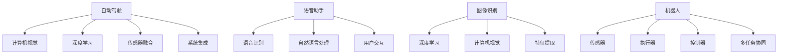

                 

# 李开复：苹果发布AI应用的机会

> 关键词：苹果, AI应用, 自动驾驶, 语音助手, 图像识别, 机器人

## 1. 背景介绍

### 1.1 问题由来
随着人工智能技术的迅猛发展，AI已经成为驱动未来科技和经济变革的重要力量。各大科技巨头纷纷布局AI领域，推出各类AI应用。而苹果公司作为科技行业的佼佼者，近年来也在积极推动AI技术的研发与应用。

在此背景下，李开复教授在最新发表的一篇文章中，探讨了苹果公司未来在AI应用领域的机遇与挑战。他指出，苹果在自动驾驶、语音助手、图像识别、机器人等领域具有巨大的发展潜力，但同时也面临着来自Google、亚马逊等竞争对手的激烈竞争。

### 1.2 问题核心关键点
苹果公司发布AI应用的核心关键点在于以下几个方面：
1. 如何整合现有的硬件与软件生态系统，推动AI应用的落地。
2. 如何利用其庞大的用户基础和数据资源，提升AI应用的性能与用户体验。
3. 如何应对来自Google、亚马逊等竞争对手的压力，保持市场竞争力。

## 2. 核心概念与联系

### 2.1 核心概念概述

为更好地理解苹果公司发布AI应用的机会，本节将介绍几个密切相关的核心概念：

- **自动驾驶(Autonomous Driving)**：指利用计算机视觉、深度学习、传感器融合等技术，实现车辆自主导航的系统。自动驾驶技术有望改变出行方式，提升交通安全。
- **语音助手(Virtual Assistant)**：如Siri等，通过语音识别、自然语言处理等技术，实现用户与计算机的语音交互。语音助手极大地提升了用户体验，广泛应用于智能手机、智能家居等领域。
- **图像识别(Image Recognition)**：指通过深度学习算法，将图像转换为计算机可理解的数据，应用于图像搜索、人脸识别、医疗诊断等领域。图像识别技术推动了视觉搜索的普及。
- **机器人(Robotics)**：指集成了传感器、执行器、控制器等部件的自主移动机器人，应用于制造、物流、医疗、教育等众多领域。机器人技术有望实现大规模的工业自动化。

这些核心概念之间的逻辑关系可以通过以下Mermaid流程图来展示：



这个流程图展示了几类AI应用的核心技术及其相互关系：

1. 自动驾驶依赖于计算机视觉、深度学习、传感器融合等技术，实现车辆自主导航。
2. 语音助手通过语音识别、自然语言处理等技术，实现语音交互。
3. 图像识别运用深度学习和计算机视觉技术，提取图像特征。
4. 机器人结合传感器、执行器、控制器等部件，实现自主移动和任务执行。

这些核心概念共同构成了AI应用的生态系统，支撑了苹果公司在这些领域的研发与创新。

## 3. 核心算法原理 & 具体操作步骤
### 3.1 算法原理概述

苹果公司发布AI应用，主要依赖于深度学习、计算机视觉、自然语言处理等核心算法。以下详细介绍这些算法的原理：

- **深度学习**：基于神经网络模型，通过大量数据训练，实现从输入到输出的映射。深度学习模型包括卷积神经网络(CNN)、循环神经网络(RNN)、变分自编码器(VAE)等，可以应用于图像识别、自然语言处理等领域。

- **计算机视觉**：通过摄像头、传感器等设备，获取现实世界的图像信息，利用深度学习模型进行特征提取和识别。计算机视觉技术广泛应用于自动驾驶、图像识别等领域。

- **自然语言处理**：通过语言模型、文本分类、情感分析等技术，实现对文本数据的理解与处理。自然语言处理技术是语音助手、聊天机器人等应用的基础。

### 3.2 算法步骤详解

苹果公司在发布AI应用时，通常会经历以下几个关键步骤：

**Step 1: 收集和准备数据**
- 收集与应用程序相关的数据，如自动驾驶的地图、语音助手的对话记录、图像识别的图片库等。
- 对数据进行预处理，包括去噪、归一化、标签标注等，确保数据的质量和可用性。

**Step 2: 模型训练**
- 选择合适的深度学习模型，如卷积神经网络、循环神经网络等，设计合适的损失函数。
- 将数据划分为训练集、验证集和测试集，使用训练集对模型进行迭代训练，通过验证集调整超参数。
- 使用测试集评估模型性能，确保模型泛化性能良好。

**Step 3: 模型优化**
- 根据实际应用场景，进行模型剪枝、量化等优化操作，减少模型大小和计算量。
- 使用GPU或TPU等硬件加速设备，提高模型推理速度。
- 结合硬件和算法，实现模型在边缘设备上的高效部署。

**Step 4: 模型集成和应用**
- 将优化后的模型集成到实际应用中，如自动驾驶系统、语音助手、图像识别平台等。
- 对模型进行持续监测和优化，确保其稳定性和可靠性。
- 发布API接口，方便开发者调用和集成。

### 3.3 算法优缺点

苹果公司发布AI应用的优势包括：
1. 强大的硬件和软件生态系统：苹果拥有iOS、macOS等操作系统，硬件设备如iPhone、iPad等，这些资源为其AI应用提供了良好的环境。
2. 庞大的用户基础和数据资源：苹果拥有数十亿活跃用户，拥有大量的应用场景和数据资源。
3. 优秀的技术团队：苹果拥有一支技术实力强大的研发团队，能够快速推动AI技术的落地应用。

同时，苹果公司发布AI应用也面临以下挑战：
1. 竞争激烈：Google、亚马逊等公司在AI领域同样投入巨资，拥有强大的技术实力和市场影响力。
2. 数据隐私问题：AI应用需要大量的用户数据支持，如何保护用户隐私成为一个重要问题。
3. 伦理道德问题：AI应用可能会带来一些伦理道德问题，如偏见、歧视等，需要慎重处理。

### 3.4 算法应用领域

苹果公司发布的AI应用涵盖了多个领域，包括：

- **自动驾驶**：利用计算机视觉、深度学习等技术，实现车辆的自主导航和环境感知。苹果通过收购Waymo等公司，在自动驾驶领域迈出了重要一步。
- **语音助手**：如Siri等，通过语音识别、自然语言处理等技术，实现用户与计算机的语音交互。语音助手被广泛应用于智能手机、智能家居等领域。
- **图像识别**：应用于图像搜索、人脸识别、医疗诊断等领域。苹果的相机应用通过深度学习算法，提升了图像识别能力。
- **机器人**：苹果在机器人领域也有布局，如家庭机器人、医疗机器人等，通过传感器、执行器、控制器等部件，实现自主移动和任务执行。

除了上述这些核心领域外，苹果还在虚拟现实(VR)、增强现实(AR)、自然语言处理等领域积极探索AI应用。通过整合硬件与软件生态系统，苹果有望在AI领域取得更多的突破。

## 4. 数学模型和公式 & 详细讲解 & 举例说明

### 4.1 数学模型构建

苹果公司发布AI应用时，通常会使用深度学习模型进行训练和优化。以下以卷积神经网络(CNN)为例，介绍其数学模型构建：

记卷积神经网络模型为 $M_{\theta}:\mathcal{X} \rightarrow \mathcal{Y}$，其中 $\mathcal{X}$ 为输入空间，$\mathcal{Y}$ 为输出空间，$\theta$ 为模型参数。假设训练集为 $D=\{(x_i,y_i)\}_{i=1}^N, x_i \in \mathcal{X}, y_i \in \mathcal{Y}$。

定义模型 $M_{\theta}$ 在输入 $x$ 上的损失函数为 $\ell(M_{\theta}(x),y)$，则在数据集 $D$ 上的经验风险为：

$$
\mathcal{L}(\theta) = \frac{1}{N} \sum_{i=1}^N \ell(M_{\theta}(x_i),y_i)
$$

在实践中，我们通常使用交叉熵损失函数，其定义如下：

$$
\ell(M_{\theta}(x),y) = -y \log M_{\theta}(x) - (1-y) \log (1-M_{\theta}(x))
$$

其中 $M_{\theta}(x)$ 表示模型对输入 $x$ 的预测输出，$y$ 表示真实标签。

### 4.2 公式推导过程

以下我们以二分类任务为例，推导交叉熵损失函数及其梯度的计算公式。

假设模型 $M_{\theta}$ 在输入 $x$ 上的输出为 $\hat{y}=M_{\theta}(x) \in [0,1]$，表示样本属于正类的概率。真实标签 $y \in \{0,1\}$。则二分类交叉熵损失函数定义为：

$$
\ell(M_{\theta}(x),y) = -[y\log \hat{y} + (1-y)\log (1-\hat{y})]
$$

将其代入经验风险公式，得：

$$
\mathcal{L}(\theta) = -\frac{1}{N}\sum_{i=1}^N [y_i\log M_{\theta}(x_i)+(1-y_i)\log(1-M_{\theta}(x_i))]
$$

根据链式法则，损失函数对参数 $\theta_k$ 的梯度为：

$$
\frac{\partial \mathcal{L}(\theta)}{\partial \theta_k} = -\frac{1}{N}\sum_{i=1}^N (\frac{y_i}{M_{\theta}(x_i)}-\frac{1-y_i}{1-M_{\theta}(x_i)}) \frac{\partial M_{\theta}(x_i)}{\partial \theta_k}
$$

其中 $\frac{\partial M_{\theta}(x_i)}{\partial \theta_k}$ 可进一步递归展开，利用自动微分技术完成计算。

在得到损失函数的梯度后，即可带入参数更新公式，完成模型的迭代优化。重复上述过程直至收敛，最终得到适应下游任务的最优模型参数 $\theta^*$。

## 5. 项目实践：代码实例和详细解释说明
### 5.1 开发环境搭建

在进行AI应用开发前，我们需要准备好开发环境。以下是使用Python进行TensorFlow开发的环境配置流程：

1. 安装Anaconda：从官网下载并安装Anaconda，用于创建独立的Python环境。

2. 创建并激活虚拟环境：
```bash
conda create -n tf-env python=3.8 
conda activate tf-env
```

3. 安装TensorFlow：根据CUDA版本，从官网获取对应的安装命令。例如：
```bash
conda install tensorflow -c tf -c conda-forge
```

4. 安装TensorFlow所需库：
```bash
pip install numpy pandas scikit-learn matplotlib tqdm jupyter notebook ipython
```

5. 安装TensorFlow Addons：
```bash
pip install tensorflow-addons
```

完成上述步骤后，即可在`tf-env`环境中开始AI应用的开发。

### 5.2 源代码详细实现

这里我们以苹果的图像识别应用为例，给出使用TensorFlow实现图像识别的PyTorch代码实现。

首先，定义图像识别任务的数据处理函数：

```python
import tensorflow as tf
from tensorflow import keras

def preprocess_image(image, target_size=(224, 224)):
    image = tf.image.resize(image, target_size)
    image = tf.image.per_image_standardization(image)
    return image

def load_image(file_path):
    image = tf.io.read_file(file_path)
    image = tf.image.decode_jpeg(image, channels=3)
    image = preprocess_image(image)
    return image
```

然后，定义模型和优化器：

```python
model = keras.applications.resnet50.ResNet50(weights='imagenet', include_top=False, input_shape=(224, 224, 3))

model.compile(optimizer='adam', loss=tf.keras.losses.SparseCategoricalCrossentropy(from_logits=True), metrics=['accuracy'])

for layer in model.layers:
    layer.trainable = False
```

接着，定义训练和评估函数：

```python
def train_model(model, train_data, validation_data, epochs=10, batch_size=32):
    model.fit(train_data, epochs=epochs, batch_size=batch_size, validation_data=validation_data)

def evaluate_model(model, test_data, batch_size=32):
    test_loss, test_acc = model.evaluate(test_data, batch_size=batch_size)
    print(f'Test Loss: {test_loss:.4f}')
    print(f'Test Accuracy: {test_acc:.4f}')
```

最后，启动训练流程并在测试集上评估：

```python
train_data = ...
validation_data = ...
test_data = ...

train_model(model, train_data, validation_data)
evaluate_model(model, test_data)
```

以上就是使用TensorFlow对图像识别应用进行开发的完整代码实现。可以看到，TensorFlow提供了丰富的API和工具，使得模型训练和推理过程变得更加便捷。

### 5.3 代码解读与分析

让我们再详细解读一下关键代码的实现细节：

**preprocess_image函数**：
- 对输入图像进行预处理，包括调整大小、标准化等操作，确保图像数据格式符合模型要求。

**load_image函数**：
- 读取图像文件，解码成RGB格式，并进行预处理，最终返回模型所需的输入格式。

**模型定义**：
- 使用keras.applications模块加载预训练的ResNet50模型，冻结所有层，只训练顶层分类器。
- 定义优化器、损失函数和评价指标。

**训练和评估函数**：
- 使用Keras的fit方法进行模型训练，在每个epoch后评估模型性能。
- 使用evaluate方法在测试集上评估模型效果。

可以看到，TensorFlow提供了便捷的API和工具，使得模型训练和推理过程变得更加简洁高效。开发者可以将更多精力放在模型设计和优化上，而不必过多关注底层的实现细节。

当然，工业级的系统实现还需考虑更多因素，如模型的保存和部署、超参数的自动搜索、更灵活的任务适配层等。但核心的模型训练和评估过程基本与此类似。

## 6. 实际应用场景
### 6.1 自动驾驶

苹果在自动驾驶领域具有巨大的发展潜力。通过整合计算机视觉、深度学习等技术，苹果有望在自动驾驶领域取得重要突破。

具体而言，苹果可以利用其强大的硬件生态系统，如iPhone、iPad等，采集车辆周围的环境信息。结合GPU/TPU等高性能设备，对环境数据进行实时处理和分析，实现车辆的自主导航和环境感知。此外，苹果还可以通过收购Waymo等公司，进一步加速自动驾驶技术的研发与应用。

### 6.2 语音助手

苹果的语音助手Siri在市场上已经占据了一席之地。通过语音识别和自然语言处理技术，Siri能够识别用户的语音指令，并提供相应的响应。未来，苹果可以通过进一步优化Siri的性能和用户体验，提升其在智能家居、车载等场景中的应用价值。

例如，苹果可以将Siri集成到智能家居系统中，实现语音控制家电、调节环境参数等功能。通过优化语音识别模型，提升其对多语言、口音的识别能力，Siri将能够更好地服务于全球用户。

### 6.3 图像识别

苹果的相机应用通过深度学习算法，已经显著提升了图像识别能力。未来，苹果可以利用其庞大的用户数据，进一步优化图像识别模型，实现更精准、更智能的图像识别应用。

例如，苹果可以通过采集用户照片，利用图像识别技术进行面部识别、物体识别等操作，提升用户的安全性和隐私保护能力。此外，苹果还可以利用图像识别技术，在医疗、零售等场景中进行产品推荐、客户识别等操作，提升用户体验和商家运营效率。

### 6.4 机器人

苹果在机器人领域也有布局。通过整合传感器、执行器、控制器等部件，苹果有望实现自主移动和任务执行的机器人。

例如，苹果可以利用其强大的硬件生态系统，如iPhone、iPad等，采集周围环境信息，实现机器人的自主导航和任务执行。通过优化机器人的控制算法，提升其任务执行能力和环境适应能力，苹果的机器人将能够更好地服务于工业、物流等领域。

## 7. 工具和资源推荐
### 7.1 学习资源推荐

为了帮助开发者系统掌握AI应用的开发技巧，这里推荐一些优质的学习资源：

1. TensorFlow官方文档：TensorFlow的官方文档，提供了丰富的API和工具，是入门和进阶学习的好材料。
2. Keras官方文档：Keras的官方文档，提供了简单易用的API，适合初学者上手。
3. Coursera《深度学习》课程：由深度学习领域的知名专家Andrew Ng主讲，系统介绍了深度学习的基本概念和前沿技术。
4. Fast.ai课程：Fast.ai提供了免费的深度学习课程，适合快速入门和实战训练。
5. PyTorch官方文档：PyTorch的官方文档，提供了丰富的API和工具，是深度学习开发的好助手。

通过对这些资源的学习实践，相信你一定能够快速掌握AI应用的开发技巧，并用于解决实际的NLP问题。

### 7.2 开发工具推荐

高效的开发离不开优秀的工具支持。以下是几款用于AI应用开发的常用工具：

1. TensorFlow：由Google主导开发的深度学习框架，生产部署方便，适合大规模工程应用。
2. Keras：Keras提供了简单易用的API，适合快速迭代研究。
3. PyTorch：基于Python的开源深度学习框架，灵活动态的计算图，适合快速迭代研究。
4. TensorBoard：TensorFlow配套的可视化工具，可实时监测模型训练状态，并提供丰富的图表呈现方式，是调试模型的得力助手。
5. Weights & Biases：模型训练的实验跟踪工具，可以记录和可视化模型训练过程中的各项指标，方便对比和调优。

合理利用这些工具，可以显著提升AI应用的开发效率，加快创新迭代的步伐。

### 7.3 相关论文推荐

AI应用的发展源于学界的持续研究。以下是几篇奠基性的相关论文，推荐阅读：

1. AlexNet: ImageNet Classification with Deep Convolutional Neural Networks：提出了卷积神经网络(CNN)，广泛应用于图像识别领域。
2. ResNet: Deep Residual Learning for Image Recognition：提出了残差网络(RNN)，进一步提升了深度神经网络的训练效果。
3. EfficientNet: Rethinking Model Scaling for Convolutional Neural Networks：提出了EfficientNet模型，在保持较高精度的同时，大幅减小了模型规模。
4. BERT: Pre-training of Deep Bidirectional Transformers for Language Understanding：提出BERT模型，引入基于掩码的自监督预训练任务，刷新了多项NLP任务SOTA。

这些论文代表了大模型微调技术的发展脉络。通过学习这些前沿成果，可以帮助研究者把握学科前进方向，激发更多的创新灵感。

## 8. 总结：未来发展趋势与挑战
### 8.1 总结

本文对苹果公司在AI应用领域的机遇与挑战进行了全面系统的介绍。首先阐述了苹果在自动驾驶、语音助手、图像识别、机器人等领域的发展潜力，明确了AI应用在未来的广阔前景。其次，从原理到实践，详细讲解了深度学习、计算机视觉、自然语言处理等核心算法的原理和实现，给出了AI应用开发的完整代码实例。同时，本文还探讨了苹果公司在AI应用领域的竞争优势和潜在风险，展示了AI应用的巨大潜力。

通过本文的系统梳理，可以看到，苹果在AI应用领域的布局已经取得初步成效，但未来仍需克服诸多挑战，才能在激烈的市场竞争中保持领先地位。

### 8.2 未来发展趋势

展望未来，苹果在AI应用领域的趋势将呈现以下几个方向：

1. 技术集成：苹果将继续整合其硬件和软件生态系统，推动AI应用的落地。通过整合iPhone、iPad、Apple Watch等设备，实现跨设备数据共享和协同，提升AI应用的用户体验。
2. 应用拓展：苹果将在更多领域探索AI应用，如智能家居、医疗健康、智能制造等，拓展AI应用的市场空间。
3. 产品创新：苹果将通过AI技术，提升其产品在各个领域的性能和智能化水平，增强市场竞争力。
4. 开源生态：苹果可能会逐步开放其AI技术，吸引更多开发者和合作伙伴，共同推动AI技术的发展。

这些趋势将使苹果在AI领域保持强劲的发展势头，进一步拓展其市场份额和技术影响力。

### 8.3 面临的挑战

尽管苹果在AI应用领域具有很大的发展潜力，但在迈向更加智能化、普适化应用的过程中，它仍面临着诸多挑战：

1. 技术壁垒：AI应用需要依赖深度学习、计算机视觉等核心技术，技术门槛较高，需要持续投入研发资源。
2. 数据隐私：AI应用需要大量的用户数据支持，如何保护用户隐私成为一个重要问题。
3. 伦理道德：AI应用可能会带来一些伦理道德问题，如偏见、歧视等，需要慎重处理。
4. 市场竞争：Google、亚马逊等公司在AI领域同样投入巨资，拥有强大的技术实力和市场影响力。

这些挑战需要苹果在技术、法律、伦理等方面进行全面考虑，才能确保AI应用的稳定发展。

### 8.4 研究展望

未来，苹果需要在以下几个方面进行进一步的研究和优化：

1. 技术创新：通过引入新技术，如自然语言处理、机器人技术等，提升AI应用的性能和应用范围。
2. 数据保护：加强数据保护和隐私控制，确保用户数据的安全和合规。
3. 伦理道德：建立伦理道德规范，避免AI应用带来的负面影响。
4. 市场拓展：在更多领域探索AI应用，拓展市场空间，提升用户覆盖率。

这些研究方向的探索将有助于苹果在AI应用领域取得更大的突破，为人类社会带来更多的价值。

## 9. 附录：常见问题与解答
**Q1：苹果公司发布AI应用的优势和劣势是什么？**

A: 苹果公司发布AI应用的优势包括：
1. 强大的硬件和软件生态系统：苹果拥有iOS、macOS等操作系统，硬件设备如iPhone、iPad等，这些资源为其AI应用提供了良好的环境。
2. 庞大的用户基础和数据资源：苹果拥有数十亿活跃用户，拥有大量的应用场景和数据资源。
3. 优秀的技术团队：苹果拥有一支技术实力强大的研发团队，能够快速推动AI技术的落地应用。

同时，苹果公司发布AI应用也面临以下挑战：
1. 竞争激烈：Google、亚马逊等公司在AI领域同样投入巨资，拥有强大的技术实力和市场影响力。
2. 数据隐私问题：AI应用需要大量的用户数据支持，如何保护用户隐私成为一个重要问题。
3. 伦理道德问题：AI应用可能会带来一些伦理道德问题，如偏见、歧视等，需要慎重处理。

**Q2：苹果公司如何在AI应用中提升用户体验？**

A: 苹果可以通过以下几个方面提升AI应用的用户体验：
1. 优化算法和模型：通过优化深度学习模型，提升AI应用的性能和精度，减少延迟和资源消耗。
2. 用户界面设计：设计简洁、易用的用户界面，提升用户的操作体验。
3. 多设备协同：通过整合iPhone、iPad、Apple Watch等设备，实现跨设备数据共享和协同，提升AI应用的用户体验。
4. 个性化推荐：利用AI技术，实现个性化推荐和智能服务，提升用户的使用粘性。

**Q3：苹果公司如何应对市场竞争？**

A: 苹果可以采取以下策略应对市场竞争：
1. 技术创新：通过引入新技术，如自然语言处理、机器人技术等，提升AI应用的性能和应用范围。
2. 生态系统建设：通过整合硬件和软件生态系统，推动AI应用的落地。通过开放API接口，吸引更多开发者和合作伙伴，共同推动AI技术的发展。
3. 市场拓展：在更多领域探索AI应用，拓展市场空间，提升用户覆盖率。
4. 用户体验优化：通过优化用户体验，增强用户粘性和品牌忠诚度，提升市场竞争力。

这些策略将有助于苹果在AI应用领域保持强劲的发展势头，进一步拓展其市场份额和技术影响力。

---

作者：禅与计算机程序设计艺术 / Zen and the Art of Computer Programming

