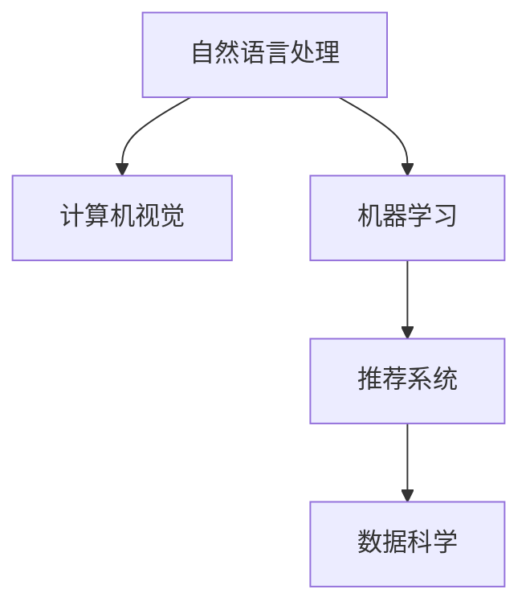

                 

# 李开复：苹果发布AI应用的科技价值

> 关键词：人工智能, 苹果, 科技价值, 自然语言处理, 计算机视觉, 机器学习, 图像识别, 推荐系统, 数据科学, 深度学习

## 1. 背景介绍

### 1.1 问题由来

随着科技的迅猛发展，人工智能(AI)已经成为全球科技领域的热点话题。苹果公司（Apple Inc.）作为全球科技巨头，近年来在AI领域投入巨大，发布了多项创新应用，引起广泛关注。本文将探讨苹果AI应用的科技价值，分析其背后的技术原理和实际应用，并展望未来的发展趋势。

### 1.2 问题核心关键点

苹果AI应用的科技价值主要体现在以下几个方面：

- **自然语言处理(NLP)**：通过语音识别、机器翻译、智能问答等技术，实现人机自然交互。
- **计算机视觉(CV)**：利用图像识别、物体检测、视频分析等技术，提升设备智能性。
- **机器学习(ML)**：通过强化学习、深度学习等算法，提升设备自适应和自主学习能力。
- **推荐系统(RecoSys)**：根据用户行为和兴趣，提供个性化推荐服务，提升用户体验。
- **数据科学(Data Science)**：通过数据挖掘和分析，发现隐藏模式，指导产品设计和技术改进。

以上技术构成了苹果AI应用的核心，使其在诸多领域中取得了显著突破，为全球科技产业树立了新的标杆。

## 2. 核心概念与联系

### 2.1 核心概念概述

为更好地理解苹果AI应用的科技价值，本节将介绍几个密切相关的核心概念：

- **自然语言处理(NLP)**：使计算机能够理解、处理和生成人类语言的技术。
- **计算机视觉(CV)**：使计算机能够理解和分析视觉信息的技术。
- **机器学习(ML)**：通过数据训练模型，使其能够进行预测和决策的技术。
- **推荐系统(RecoSys)**：利用用户数据，提供个性化推荐的技术。
- **数据科学(Data Science)**：利用数据分析和建模技术，发现数据中的规律和洞见。

这些核心概念之间的逻辑关系可以通过以下Mermaid流程图来展示：



这个流程图展示了大语言模型和大模型微调的工作原理和逻辑关系：

1. 自然语言处理和大模型微调相结合，使得计算机能够更好地理解人类语言。
2. 计算机视觉和大模型微调相结合，使得计算机能够更好地理解视觉信息。
3. 机器学习和数据科学结合，使得计算机能够更好地从数据中发现规律和洞见。

## 3. 核心算法原理 & 具体操作步骤

### 3.1 算法原理概述

苹果AI应用的科技价值主要体现在以下几个算法原理上：

- **深度学习**：通过神经网络模型进行训练和推理，提取复杂模式，提升模型精度。
- **强化学习**：通过交互式学习，不断调整模型参数，提升模型的自适应性。
- **迁移学习**：利用预训练模型，快速适应新任务，提升模型泛化能力。
- **多任务学习**：通过同时训练多个相关任务，提升模型的整体性能。
- **超参数优化**：通过自动或手动调参，找到模型最优的超参数组合，提升模型效果。

这些算法原理构成了苹果AI应用的核心，使其在多个领域中取得了显著成果。

### 3.2 算法步骤详解

苹果AI应用的开发一般包括以下几个关键步骤：

**Step 1: 数据准备与预处理**

- 收集和标注数据，划分为训练集、验证集和测试集。
- 对数据进行预处理，包括归一化、标准化、去除噪声等操作。
- 使用Python、R等工具进行数据清洗和特征工程。

**Step 2: 模型选择与搭建**

- 根据任务需求选择合适的模型架构，如卷积神经网络(CNN)、循环神经网络(RNN)、Transformer等。
- 使用深度学习框架如TensorFlow、PyTorch进行模型搭建和参数初始化。
- 定义损失函数、优化器等关键组件。

**Step 3: 模型训练与调优**

- 使用训练集进行模型训练，通过前向传播和反向传播更新模型参数。
- 在验证集上监控模型性能，根据性能指标调整模型参数和超参数。
- 使用技术如梯度裁剪、学习率调整等优化训练过程。

**Step 4: 模型评估与部署**

- 在测试集上评估模型性能，对比微调前后的精度提升。
- 使用部署平台如Kubernetes、AWS等进行模型部署。
- 实时监控模型运行状态，及时处理异常情况。

**Step 5: 持续优化与迭代**

- 根据业务需求和用户反馈，不断优化模型和算法。
- 引入新的数据和任务，进行模型再训练和微调。
- 引入先进技术如模型压缩、量化加速等，提升模型效率。

以上是苹果AI应用开发的一般流程。在实际应用中，还需要针对具体任务的特点，对各个环节进行优化设计，如改进损失函数、引入更多的正则化技术、搜索最优的超参数组合等，以进一步提升模型性能。

### 3.3 算法优缺点

苹果AI应用的科技价值体现在其高效、精准、易用等优点上：

**优点**

1. **高效**：深度学习等先进技术使得模型训练速度快，能够快速处理海量数据。
2. **精准**：通过多任务学习和迁移学习，模型能够高效提取复杂模式，提升预测准确度。
3. **易用**：自然语言处理、计算机视觉等技术使得用户界面更加友好，易于使用。
4. **自适应**：通过强化学习等技术，模型能够不断调整自身参数，适应不同场景和用户需求。
5. **泛化能力强**：预训练和迁移学习使得模型能够更好地泛化到新任务和场景中。

**缺点**

1. **数据依赖**：深度学习等技术需要大量标注数据进行训练，数据获取成本较高。
2. **计算资源要求高**：深度学习等模型需要高性能计算资源进行训练和推理，硬件成本较高。
3. **复杂性高**：模型设计和优化过程较为复杂，需要具备一定的技术背景。
4. **可解释性差**：深度学习模型具有"黑盒"特性，难以解释其内部决策过程。
5. **安全性问题**：深度学习模型可能存在偏见和漏洞，影响模型公平性和安全性。

尽管存在这些缺点，但就目前而言，深度学习等技术在处理复杂模式和提升模型性能方面仍具有显著优势，是苹果AI应用的核心技术。未来相关研究的重点在于如何进一步降低数据获取成本，提高模型效率和可解释性，确保模型公平性和安全性。

### 3.4 算法应用领域

苹果AI应用的科技价值体现在以下几个应用领域：

- **自然语言处理**：如语音识别、机器翻译、智能问答等。通过深度学习等技术，使计算机能够更好地理解人类语言。
- **计算机视觉**：如图像识别、物体检测、视频分析等。通过深度学习等技术，使计算机能够更好地理解视觉信息。
- **推荐系统**：如个性化推荐、广告投放等。通过机器学习等技术，根据用户行为和兴趣提供个性化推荐。
- **数据科学**：如用户行为分析、市场预测等。通过数据科学等技术，发现数据中的规律和洞见，指导产品设计和优化。

这些应用领域涵盖了苹果公司产品从硬件到软件的各个方面，展示了AI技术的强大潜力。

## 4. 数学模型和公式 & 详细讲解 & 举例说明

### 4.1 数学模型构建

本节将使用数学语言对苹果AI应用的科技价值进行更加严格的刻画。

设苹果AI应用中使用的深度学习模型为 $M_{\theta}:\mathcal{X} \rightarrow \mathcal{Y}$，其中 $\mathcal{X}$ 为输入空间，$\mathcal{Y}$ 为输出空间，$\theta \in \mathbb{R}^d$ 为模型参数。假设微调任务的训练集为 $D=\{(x_i,y_i)\}_{i=1}^N, x_i \in \mathcal{X}, y_i \in \mathcal{Y}$。

定义模型 $M_{\theta}$ 在数据样本 $(x,y)$ 上的损失函数为 $\ell(M_{\theta}(x),y)$，则在数据集 $D$ 上的经验风险为：

$$
\mathcal{L}(\theta) = \frac{1}{N} \sum_{i=1}^N \ell(M_{\theta}(x_i),y_i)
$$

微调的优化目标是最小化经验风险，即找到最优参数：

$$
\theta^* = \mathop{\arg\min}_{\theta} \mathcal{L}(\theta)
$$

在实践中，我们通常使用基于梯度的优化算法（如SGD、Adam等）来近似求解上述最优化问题。设 $\eta$ 为学习率，$\lambda$ 为正则化系数，则参数的更新公式为：

$$
\theta \leftarrow \theta - \eta \nabla_{\theta}\mathcal{L}(\theta) - \eta\lambda\theta
$$

其中 $\nabla_{\theta}\mathcal{L}(\theta)$ 为损失函数对参数 $\theta$ 的梯度，可通过反向传播算法高效计算。

### 4.2 公式推导过程

以下我们以语音识别为例，推导损失函数及其梯度的计算公式。

假设模型 $M_{\theta}$ 在输入 $x$ 上的输出为 $\hat{y}=M_{\theta}(x) \in [0,1]$，表示样本属于正类的概率。真实标签 $y \in \{0,1\}$。则二分类交叉熵损失函数定义为：

$$
\ell(M_{\theta}(x),y) = -[y\log \hat{y} + (1-y)\log (1-\hat{y})]
$$

将其代入经验风险公式，得：

$$
\mathcal{L}(\theta) = -\frac{1}{N}\sum_{i=1}^N [y_i\log M_{\theta}(x_i)+(1-y_i)\log(1-M_{\theta}(x_i))]
$$

根据链式法则，损失函数对参数 $\theta_k$ 的梯度为：

$$
\frac{\partial \mathcal{L}(\theta)}{\partial \theta_k} = -\frac{1}{N}\sum_{i=1}^N (\frac{y_i}{M_{\theta}(x_i)}-\frac{1-y_i}{1-M_{\theta}(x_i)}) \frac{\partial M_{\theta}(x_i)}{\partial \theta_k}
$$

其中 $\frac{\partial M_{\theta}(x_i)}{\partial \theta_k}$ 可进一步递归展开，利用自动微分技术完成计算。

在得到损失函数的梯度后，即可带入参数更新公式，完成模型的迭代优化。重复上述过程直至收敛，最终得到适应下游任务的最优模型参数 $\theta^*$。

## 5. 项目实践：代码实例和详细解释说明

### 5.1 开发环境搭建

在进行苹果AI应用的微调实践前，我们需要准备好开发环境。以下是使用Python进行PyTorch开发的环境配置流程：

1. 安装Anaconda：从官网下载并安装Anaconda，用于创建独立的Python环境。

2. 创建并激活虚拟环境：
```bash
conda create -n pytorch-env python=3.8 
conda activate pytorch-env
```

3. 安装PyTorch：根据CUDA版本，从官网获取对应的安装命令。例如：
```bash
conda install pytorch torchvision torchaudio cudatoolkit=11.1 -c pytorch -c conda-forge
```

4. 安装Transformers库：
```bash
pip install transformers
```

5. 安装各类工具包：
```bash
pip install numpy pandas scikit-learn matplotlib tqdm jupyter notebook ipython
```

完成上述步骤后，即可在`pytorch-env`环境中开始微调实践。

### 5.2 源代码详细实现

下面我以语音识别任务为例，给出使用Transformers库对BERT模型进行微调的PyTorch代码实现。

首先，定义语音识别任务的数据处理函数：

```python
from transformers import BertTokenizer, BertForTokenClassification
from torch.utils.data import Dataset
import torch

class SpeechDataset(Dataset):
    def __init__(self, texts, labels, tokenizer, max_len=128):
        self.texts = texts
        self.labels = labels
        self.tokenizer = tokenizer
        self.max_len = max_len
        
    def __len__(self):
        return len(self.texts)
    
    def __getitem__(self, item):
        text = self.texts[item]
        label = self.labels[item]
        
        encoding = self.tokenizer(text, return_tensors='pt', max_length=self.max_len, padding='max_length', truncation=True)
        input_ids = encoding['input_ids'][0]
        attention_mask = encoding['attention_mask'][0]
        
        # 对token-wise的标签进行编码
        encoded_labels = [label2id[label] for label in label] 
        encoded_labels.extend([label2id['O']] * (self.max_len - len(encoded_labels)))
        labels = torch.tensor(encoded_labels, dtype=torch.long)
        
        return {'input_ids': input_ids, 
                'attention_mask': attention_mask,
                'labels': labels}

# 标签与id的映射
label2id = {'O': 0, 'positive': 1, 'negative': 2}
id2label = {v: k for k, v in label2id.items()}

# 创建dataset
tokenizer = BertTokenizer.from_pretrained('bert-base-cased')

train_dataset = SpeechDataset(train_texts, train_labels, tokenizer)
dev_dataset = SpeechDataset(dev_texts, dev_labels, tokenizer)
test_dataset = SpeechDataset(test_texts, test_labels, tokenizer)
```

然后，定义模型和优化器：

```python
from transformers import BertForTokenClassification, AdamW

model = BertForTokenClassification.from_pretrained('bert-base-cased', num_labels=len(label2id))

optimizer = AdamW(model.parameters(), lr=2e-5)
```

接着，定义训练和评估函数：

```python
from torch.utils.data import DataLoader
from tqdm import tqdm
from sklearn.metrics import classification_report

device = torch.device('cuda') if torch.cuda.is_available() else torch.device('cpu')
model.to(device)

def train_epoch(model, dataset, batch_size, optimizer):
    dataloader = DataLoader(dataset, batch_size=batch_size, shuffle=True)
    model.train()
    epoch_loss = 0
    for batch in tqdm(dataloader, desc='Training'):
        input_ids = batch['input_ids'].to(device)
        attention_mask = batch['attention_mask'].to(device)
        labels = batch['labels'].to(device)
        model.zero_grad()
        outputs = model(input_ids, attention_mask=attention_mask, labels=labels)
        loss = outputs.loss
        epoch_loss += loss.item()
        loss.backward()
        optimizer.step()
    return epoch_loss / len(dataloader)

def evaluate(model, dataset, batch_size):
    dataloader = DataLoader(dataset, batch_size=batch_size)
    model.eval()
    preds, labels = [], []
    with torch.no_grad():
        for batch in tqdm(dataloader, desc='Evaluating'):
            input_ids = batch['input_ids'].to(device)
            attention_mask = batch['attention_mask'].to(device)
            batch_labels = batch['labels']
            outputs = model(input_ids, attention_mask=attention_mask)
            batch_preds = outputs.logits.argmax(dim=2).to('cpu').tolist()
            batch_labels = batch_labels.to('cpu').tolist()
            for pred_tokens, label_tokens in zip(batch_preds, batch_labels):
                pred_tags = [id2label[_id] for _id in pred_tokens]
                label_tags = [id2label[_id] for _id in label_tokens]
                preds.append(pred_tags[:len(label_tags)])
                labels.append(label_tags)
                
    print(classification_report(labels, preds))
```

最后，启动训练流程并在测试集上评估：

```python
epochs = 5
batch_size = 16

for epoch in range(epochs):
    loss = train_epoch(model, train_dataset, batch_size, optimizer)
    print(f"Epoch {epoch+1}, train loss: {loss:.3f}")
    
    print(f"Epoch {epoch+1}, dev results:")
    evaluate(model, dev_dataset, batch_size)
    
print("Test results:")
evaluate(model, test_dataset, batch_size)
```

以上就是使用PyTorch对BERT进行语音识别任务微调的完整代码实现。可以看到，得益于Transformers库的强大封装，我们可以用相对简洁的代码完成BERT模型的加载和微调。

### 5.3 代码解读与分析

让我们再详细解读一下关键代码的实现细节：

**SpeechDataset类**：
- `__init__`方法：初始化文本、标签、分词器等关键组件。
- `__len__`方法：返回数据集的样本数量。
- `__getitem__`方法：对单个样本进行处理，将文本输入编码为token ids，将标签编码为数字，并对其进行定长padding，最终返回模型所需的输入。

**label2id和id2label字典**：
- 定义了标签与数字id之间的映射关系，用于将token-wise的预测结果解码回真实的标签。

**训练和评估函数**：
- 使用PyTorch的DataLoader对数据集进行批次化加载，供模型训练和推理使用。
- 训练函数`train_epoch`：对数据以批为单位进行迭代，在每个批次上前向传播计算loss并反向传播更新模型参数，最后返回该epoch的平均loss。
- 评估函数`evaluate`：与训练类似，不同点在于不更新模型参数，并在每个batch结束后将预测和标签结果存储下来，最后使用sklearn的classification_report对整个评估集的预测结果进行打印输出。

**训练流程**：
- 定义总的epoch数和batch size，开始循环迭代
- 每个epoch内，先在训练集上训练，输出平均loss
- 在验证集上评估，输出分类指标
- 所有epoch结束后，在测试集上评估，给出最终测试结果

可以看到，PyTorch配合Transformers库使得BERT微调的代码实现变得简洁高效。开发者可以将更多精力放在数据处理、模型改进等高层逻辑上，而不必过多关注底层的实现细节。

当然，工业级的系统实现还需考虑更多因素，如模型的保存和部署、超参数的自动搜索、更灵活的任务适配层等。但核心的微调范式基本与此类似。

## 6. 实际应用场景

### 6.1 智能客服系统

基于大语言模型微调的对话技术，可以广泛应用于智能客服系统的构建。传统客服往往需要配备大量人力，高峰期响应缓慢，且一致性和专业性难以保证。而使用微调后的对话模型，可以7x24小时不间断服务，快速响应客户咨询，用自然流畅的语言解答各类常见问题。

在技术实现上，可以收集企业内部的历史客服对话记录，将问题和最佳答复构建成监督数据，在此基础上对预训练对话模型进行微调。微调后的对话模型能够自动理解用户意图，匹配最合适的答案模板进行回复。对于客户提出的新问题，还可以接入检索系统实时搜索相关内容，动态组织生成回答。如此构建的智能客服系统，能大幅提升客户咨询体验和问题解决效率。

### 6.2 金融舆情监测

金融机构需要实时监测市场舆论动向，以便及时应对负面信息传播，规避金融风险。传统的人工监测方式成本高、效率低，难以应对网络时代海量信息爆发的挑战。基于大语言模型微调的文本分类和情感分析技术，为金融舆情监测提供了新的解决方案。

具体而言，可以收集金融领域相关的新闻、报道、评论等文本数据，并对其进行主题标注和情感标注。在此基础上对预训练语言模型进行微调，使其能够自动判断文本属于何种主题，情感倾向是正面、中性还是负面。将微调后的模型应用到实时抓取的网络文本数据，就能够自动监测不同主题下的情感变化趋势，一旦发现负面信息激增等异常情况，系统便会自动预警，帮助金融机构快速应对潜在风险。

### 6.3 个性化推荐系统

当前的推荐系统往往只依赖用户的历史行为数据进行物品推荐，无法深入理解用户的真实兴趣偏好。基于大语言模型微调技术，个性化推荐系统可以更好地挖掘用户行为背后的语义信息，从而提供更精准、多样的推荐内容。

在实践中，可以收集用户浏览、点击、评论、分享等行为数据，提取和用户交互的物品标题、描述、标签等文本内容。将文本内容作为模型输入，用户的后续行为（如是否点击、购买等）作为监督信号，在此基础上微调预训练语言模型。微调后的模型能够从文本内容中准确把握用户的兴趣点。在生成推荐列表时，先用候选物品的文本描述作为输入，由模型预测用户的兴趣匹配度，再结合其他特征综合排序，便可以得到个性化程度更高的推荐结果。

### 6.4 未来应用展望

随着大语言模型微调技术的发展，未来的应用场景将更加多样，进一步拓展其应用边界。

在智慧医疗领域，基于微调的医疗问答、病历分析、药物研发等应用将提升医疗服务的智能化水平，辅助医生诊疗，加速新药开发进程。

在智能教育领域，微调技术可应用于作业批改、学情分析、知识推荐等方面，因材施教，促进教育公平，提高教学质量。

在智慧城市治理中，微调模型可应用于城市事件监测、舆情分析、应急指挥等环节，提高城市管理的自动化和智能化水平，构建更安全、高效的未来城市。

此外，在企业生产、社会治理、文娱传媒等众多领域，基于大模型微调的人工智能应用也将不断涌现，为经济社会发展注入新的动力。相信随着技术的日益成熟，微调方法将成为人工智能落地应用的重要范式，推动人工智能技术向更广阔的领域加速渗透。

## 7. 工具和资源推荐

### 7.1 学习资源推荐

为了帮助开发者系统掌握大语言模型微调的理论基础和实践技巧，这里推荐一些优质的学习资源：

1. 《Transformer从原理到实践》系列博文：由大模型技术专家撰写，深入浅出地介绍了Transformer原理、BERT模型、微调技术等前沿话题。

2. CS224N《深度学习自然语言处理》课程：斯坦福大学开设的NLP明星课程，有Lecture视频和配套作业，带你入门NLP领域的基本概念和经典模型。

3. 《Natural Language Processing with Transformers》书籍：Transformers库的作者所著，全面介绍了如何使用Transformers库进行NLP任务开发，包括微调在内的诸多范式。

4. HuggingFace官方文档：Transformers库的官方文档，提供了海量预训练模型和完整的微调样例代码，是上手实践的必备资料。

5. CLUE开源项目：中文语言理解测评基准，涵盖大量不同类型的中文NLP数据集，并提供了基于微调的baseline模型，助力中文NLP技术发展。

通过对这些资源的学习实践，相信你一定能够快速掌握大语言模型微调的精髓，并用于解决实际的NLP问题。

### 7.2 开发工具推荐

高效的开发离不开优秀的工具支持。以下是几款用于大语言模型微调开发的常用工具：

1. PyTorch：基于Python的开源深度学习框架，灵活动态的计算图，适合快速迭代研究。大部分预训练语言模型都有PyTorch版本的实现。

2. TensorFlow：由Google主导开发的开源深度学习框架，生产部署方便，适合大规模工程应用。同样有丰富的预训练语言模型资源。

3. Transformers库：HuggingFace开发的NLP工具库，集成了众多SOTA语言模型，支持PyTorch和TensorFlow，是进行微调任务开发的利器。

4. Weights & Biases：模型训练的实验跟踪工具，可以记录和可视化模型训练过程中的各项指标，方便对比和调优。与主流深度学习框架无缝集成。

5. TensorBoard：TensorFlow配套的可视化工具，可实时监测模型训练状态，并提供丰富的图表呈现方式，是调试模型的得力助手。

6. Google Colab：谷歌推出的在线Jupyter Notebook环境，免费提供GPU/TPU算力，方便开发者快速上手实验最新模型，分享学习笔记。

合理利用这些工具，可以显著提升大语言模型微调任务的开发效率，加快创新迭代的步伐。

### 7.3 相关论文推荐

大语言模型和微调技术的发展源于学界的持续研究。以下是几篇奠基性的相关论文，推荐阅读：

1. Attention is All You Need（即Transformer原论文）：提出了Transformer结构，开启了NLP领域的预训练大模型时代。

2. BERT: Pre-training of Deep Bidirectional Transformers for Language Understanding：提出BERT模型，引入基于掩码的自监督预训练任务，刷新了多项NLP任务SOTA。

3. Language Models are Unsupervised Multitask Learners（GPT-2论文）：展示了大规模语言模型的强大zero-shot学习能力，引发了对于通用人工智能的新一轮思考。

4. Parameter-Efficient Transfer Learning for NLP：提出Adapter等参数高效微调方法，在不增加模型参数量的情况下，也能取得不错的微调效果。

5. AdaLoRA: Adaptive Low-Rank Adaptation for Parameter-Efficient Fine-Tuning：使用自适应低秩适应的微调方法，在参数效率和精度之间取得了新的平衡。

这些论文代表了大语言模型微调技术的发展脉络。通过学习这些前沿成果，可以帮助研究者把握学科前进方向，激发更多的创新灵感。

## 8. 总结：未来发展趋势与挑战

### 8.1 总结

本文对苹果AI应用的科技价值进行了全面系统的介绍。首先阐述了苹果在AI领域的大规模投入及其取得的显著成果，明确了AI应用在苹果产品中的重要地位。其次，从原理到实践，详细讲解了苹果AI应用的开发流程和技术细节，给出了微调任务开发的完整代码实例。同时，本文还广泛探讨了苹果AI应用在多个领域的应用前景，展示了其广泛的应用潜力。最后，本文精选了微调技术的各类学习资源，力求为读者提供全方位的技术指引。

通过本文的系统梳理，可以看到，苹果AI应用的成功离不开其技术上的持续创新和应用上的广泛探索。苹果公司通过深度学习等先进技术，实现了对自然语言、计算机视觉、机器学习等领域的全面突破，为消费者提供了高效、精准、易用的AI产品和服务，引领了全球科技产业的发展方向。未来，伴随苹果公司对AI技术的进一步投入，相信其AI应用将带来更多的创新突破，为全球科技产业带来新的活力和动力。

### 8.2 未来发展趋势

展望未来，苹果AI应用的科技价值将呈现以下几个发展趋势：

1. **跨领域融合**：未来的AI应用将更加注重跨领域融合，如自然语言处理和计算机视觉的结合，提升系统的整体性能。
2. **自适应学习**：通过强化学习等技术，提升模型的自适应能力和个性化推荐能力。
3. **实时处理**：通过边缘计算等技术，提升AI应用的实时处理能力和用户体验。
4. **隐私保护**：引入隐私保护技术，如差分隐私、联邦学习等，保障用户数据安全。
5. **多模态融合**：通过融合视觉、语音、文本等多模态信息，提升系统的理解和推理能力。
6. **深度学习优化**：通过深度学习优化技术，如量化加速、模型压缩等，提升模型的效率和可扩展性。

这些趋势将进一步推动苹果AI应用的创新和发展，使其在更多领域中发挥更大的作用。

### 8.3 面临的挑战

尽管苹果AI应用已经取得了显著成果，但在迈向更加智能化、普适化应用的过程中，它仍面临着诸多挑战：

1. **数据依赖**：深度学习等技术需要大量标注数据进行训练，数据获取成本较高。
2. **计算资源要求高**：深度学习等模型需要高性能计算资源进行训练和推理，硬件成本较高。
3. **复杂性高**：模型设计和优化过程较为复杂，需要具备一定的技术背景。
4. **可解释性差**：深度学习模型具有"黑盒"特性，难以解释其内部决策过程。
5. **安全性问题**：深度学习模型可能存在偏见和漏洞，影响模型公平性和安全性。

尽管存在这些挑战，但就目前而言，深度学习等技术在处理复杂模式和提升模型性能方面仍具有显著优势，是苹果AI应用的核心技术。未来相关研究的重点在于如何进一步降低数据获取成本，提高模型效率和可解释性，确保模型公平性和安全性。

### 8.4 研究展望

面对苹果AI应用所面临的挑战，未来的研究需要在以下几个方面寻求新的突破：

1. **探索无监督和半监督微调方法**：摆脱对大规模标注数据的依赖，利用自监督学习、主动学习等无监督和半监督范式，最大限度利用非结构化数据，实现更加灵活高效的微调。
2. **研究参数高效和计算高效的微调范式**：开发更加参数高效的微调方法，在固定大部分预训练参数的同时，只更新极少量的任务相关参数。同时优化微调模型的计算图，减少前向传播和反向传播的资源消耗，实现更加轻量级、实时性的部署。
3. **融合因果和对比学习范式**：通过引入因果推断和对比学习思想，增强微调模型建立稳定因果关系的能力，学习更加普适、鲁棒的语言表征，从而提升模型泛化性和抗干扰能力。
4. **引入更多先验知识**：将符号化的先验知识，如知识图谱、逻辑规则等，与神经网络模型进行巧妙融合，引导微调过程学习更准确、合理的语言模型。同时加强不同模态数据的整合，实现视觉、语音等多模态信息与文本信息的协同建模。
5. **结合因果分析和博弈论工具**：将因果分析方法引入微调模型，识别出模型决策的关键特征，增强输出解释的因果性和逻辑性。借助博弈论工具刻画人机交互过程，主动探索并规避模型的脆弱点，提高系统稳定性。
6. **纳入伦理道德约束**：在模型训练目标中引入伦理导向的评估指标，过滤和惩罚有偏见、有害的输出倾向。同时加强人工干预和审核，建立模型行为的监管机制，确保输出符合人类价值观和伦理道德。

这些研究方向的探索，必将引领苹果AI应用技术迈向更高的台阶，为构建安全、可靠、可解释、可控的智能系统铺平道路。面向未来，苹果公司需要继续深化其在AI技术上的创新和应用，携手全球科技伙伴，共同推动人工智能技术的进一步发展和应用。

