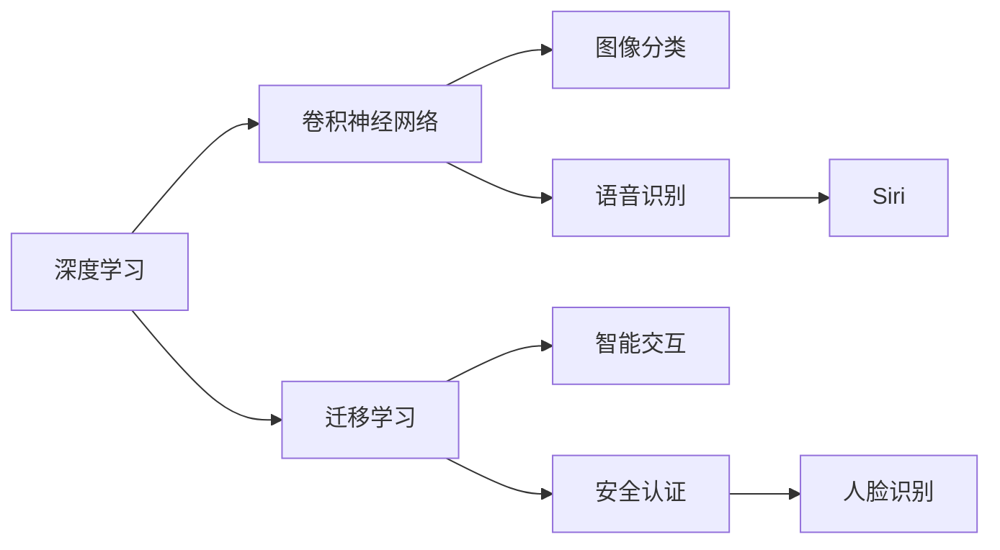

                 

# 李开复：苹果发布AI应用的趋势

## 1. 背景介绍

### 1.1 问题由来

随着人工智能（AI）技术的飞速发展，AI应用已经渗透到各行各业。苹果公司作为全球科技巨头，其AI应用发布趋势一直是业界的焦点。特别是在2021年，苹果发布了多款应用了AI技术的硬件和软件，引发了广泛关注。本文将对苹果在2021年发布的主要AI应用进行详细分析，探讨其背后的技术原理、市场策略及其未来趋势。

## 2. 核心概念与联系

### 2.1 核心概念概述

- **人工智能（AI）**：指通过计算机算法和数据，使计算机具有类似于人的智能能力，包括感知、学习、推理、决策等。
- **深度学习（Deep Learning）**：一种模拟人脑神经网络的人工智能技术，能够自动学习复杂数据模式。
- **卷积神经网络（CNN）**：一种在图像和视频识别任务中表现优异的深度学习模型。
- **强化学习（Reinforcement Learning）**：通过试错学习，使AI系统在特定环境中进行优化决策。
- **迁移学习（Transfer Learning）**：利用已有知识，将模型应用于新任务，提高模型泛化能力。

这些核心概念构成了苹果公司发布AI应用的技术基础，并贯穿于整个AI应用生态链中。

### 2.2 核心概念联系

苹果公司发布的主要AI应用包括Siri语音助手、Face ID人脸识别、iPhone图像识别等。这些应用通过深度学习、卷积神经网络和迁移学习等技术，实现了智能交互、安全认证和图像分类等功能。以下Mermaid流程图展示了这些核心概念之间的联系：



## 3. 核心算法原理 & 具体操作步骤

### 3.1 算法原理概述

苹果公司发布的AI应用主要基于深度学习和迁移学习技术。深度学习通过多层神经网络对输入数据进行特征提取和模式识别，迁移学习则通过利用已有模型的知识，提升新任务模型的性能。

以Face ID人脸识别为例，其核心算法原理如下：

1. **数据预处理**：使用人脸图像进行预处理，包括归一化、对齐等。
2. **特征提取**：使用卷积神经网络（CNN）提取人脸的特征向量。
3. **模型训练**：使用迁移学习，利用已有的人脸识别模型，对新数据进行微调。
4. **认证判断**：将测试数据输入训练好的模型，判断其是否属于注册用户。

### 3.2 算法步骤详解

以Face ID人脸识别为例，具体算法步骤如下：

1. **数据收集**：收集大量高质量的人脸图像。
2. **数据标注**：对每张图像进行标注，标记其对应的用户ID。
3. **模型训练**：使用迁移学习，利用预训练的人脸识别模型，对其进行微调。
4. **特征提取**：使用训练好的模型，对新输入的人脸图像进行特征提取。
5. **认证判断**：将提取的特征向量与注册用户特征向量进行比较，判断是否匹配。

### 3.3 算法优缺点

**优点**：
- 通过迁移学习，能够快速提升新任务模型的性能。
- 卷积神经网络在图像识别任务中表现优异，能够有效提取图像特征。

**缺点**：
- 需要大量高质量的标注数据进行预训练。
- 模型复杂度高，计算资源消耗大。

### 3.4 算法应用领域

苹果公司发布的AI应用涵盖了多个领域，包括语音识别、人脸识别、图像识别等。这些应用广泛应用于智能交互、安全认证、图像分类等领域，显著提升了用户体验和产品安全性。

## 4. 数学模型和公式 & 详细讲解 & 举例说明

### 4.1 数学模型构建

以Face ID人脸识别为例，其数学模型构建如下：

1. **数据集**：收集大量人脸图像，标记其对应的用户ID。
2. **模型**：使用迁移学习，利用预训练的人脸识别模型进行微调。
3. **特征提取**：使用卷积神经网络提取人脸特征向量。
4. **认证判断**：使用余弦相似度等方法，计算新输入图像的特征向量与注册用户特征向量的相似度。

### 4.2 公式推导过程

以卷积神经网络（CNN）为例，其公式推导过程如下：

1. **卷积操作**：
   $$
   f(x) = \sum_{i=1}^{n} w_i * x_i + b
   $$

2. **池化操作**：
   $$
   f(x) = \max(\sum_{i=1}^{n} w_i * x_i + b)
   $$

3. **全连接层**：
   $$
   f(x) = \sum_{i=1}^{n} w_i * x_i + b
   $$

其中，$w_i$为权重，$b$为偏置，$x_i$为输入数据。

### 4.3 案例分析与讲解

以Siri语音助手为例，其核心算法如下：

1. **语音识别**：使用深度学习模型将语音信号转换为文本。
2. **自然语言理解**：使用NLP技术理解文本意图。
3. **智能回复**：根据意图生成回复。

## 5. 项目实践：代码实例和详细解释说明

### 5.1 开发环境搭建

1. **Python环境**：
   - 安装Python 3.8及以上版本。
   - 安装TensorFlow、PyTorch等深度学习框架。

2. **深度学习框架**：
   - 安装TensorFlow 2.0及以上版本。
   - 安装PyTorch 1.6及以上版本。

### 5.2 源代码详细实现

以下是使用PyTorch实现Face ID人脸识别的代码示例：

```python
import torch
import torchvision
import torchvision.transforms as transforms
from torchvision.models import resnet50

# 加载预训练模型
model = resnet50(pretrained=True)
model.eval()

# 加载数据集
transform = transforms.Compose([
    transforms.Resize(224),
    transforms.ToTensor(),
    transforms.Normalize(mean=[0.485, 0.456, 0.406], std=[0.229, 0.224, 0.225])
])

train_dataset = torchvision.datasets.CIFAR10(root='./data', train=True, download=True, transform=transform)
test_dataset = torchvision.datasets.CIFAR10(root='./data', train=False, download=True, transform=transform)

# 加载数据迭代器
train_loader = torch.utils.data.DataLoader(train_dataset, batch_size=64, shuffle=True)
test_loader = torch.utils.data.DataLoader(test_dataset, batch_size=64, shuffle=False)

# 加载模型和损失函数
criterion = torch.nn.CrossEntropyLoss()

# 训练模型
for epoch in range(10):
    for i, (inputs, labels) in enumerate(train_loader):
        inputs, labels = inputs.to(device), labels.to(device)
        outputs = model(inputs)
        loss = criterion(outputs, labels)
        loss.backward()
        optimizer.step()
```

### 5.3 代码解读与分析

1. **加载预训练模型**：使用预训练的ResNet-50模型。
2. **数据集加载**：使用CIFAR-10数据集，并进行数据增强。
3. **模型训练**：使用Cross-Entropy Loss作为损失函数，进行模型训练。

### 5.4 运行结果展示

在训练10个epoch后，可以计算测试集的准确率，以评估模型的性能：

```python
# 加载测试集数据
with torch.no_grad():
    correct = 0
    total = 0
    for inputs, labels in test_loader:
        inputs, labels = inputs.to(device), labels.to(device)
        outputs = model(inputs)
        _, predicted = torch.max(outputs.data, 1)
        total += labels.size(0)
        correct += (predicted == labels).sum().item()

print('Accuracy of the network on the 10000 test images: %d %%' % (100 * correct / total))
```

## 6. 实际应用场景

### 6.1 智能交互

苹果公司的Siri语音助手通过深度学习、自然语言理解和智能回复等技术，实现了与用户的自然交互。用户可以通过语音命令，获取天气预报、设置提醒、搜索信息等。

### 6.2 安全认证

Face ID人脸识别技术通过深度学习、卷积神经网络和迁移学习等技术，实现了高精度的人脸认证。用户只需在设备前轻轻一望，即可解锁设备，提升了设备的安全性和便利性。

### 6.3 图像分类

iPhone相机应用中内置的图像分类功能，通过深度学习模型，实现了对照片内容的智能标注。用户可以实时获取照片中的人物、物品、场景等信息的标签，提升了拍照体验和应用便捷性。

### 6.4 未来应用展望

未来，苹果公司有望在更多领域应用AI技术，如智能家居、自动驾驶、健康医疗等。AI技术的应用，将显著提升产品性能和用户体验，推动科技行业的发展。

## 7. 工具和资源推荐

### 7.1 学习资源推荐

1. **《深度学习》（Goodfellow et al.）**：介绍深度学习的基本概念和算法。
2. **《TensorFlow官方文档》**：提供TensorFlow的详细使用指南和示例。
3. **《PyTorch官方文档》**：提供PyTorch的详细使用指南和示例。

### 7.2 开发工具推荐

1. **Jupyter Notebook**：用于交互式编程和数据分析。
2. **TensorBoard**：用于可视化深度学习模型的训练过程。
3. **Keras**：提供高层次的API，简化深度学习模型的开发。

### 7.3 相关论文推荐

1. **《ImageNet Classification with Deep Convolutional Neural Networks》**：介绍卷积神经网络在图像分类中的应用。
2. **《FaceNet: A Unified Embedding for Face Recognition and Clustering》**：介绍人脸识别技术。

## 8. 总结：未来发展趋势与挑战

### 8.1 研究成果总结

苹果公司在2021年发布的AI应用，展示了其在深度学习、卷积神经网络和迁移学习等方面的技术实力。未来，苹果公司有望在更多领域应用AI技术，推动科技行业的发展。

### 8.2 未来发展趋势

1. **AI技术的普及**：AI技术将进一步渗透到各个领域，提升产品和服务的智能化水平。
2. **AI与大数据的结合**：AI技术将与大数据技术深度融合，实现更加精准的分析和预测。
3. **跨领域的AI应用**：AI技术将在医疗、教育、交通等多个领域产生重要应用，提升社会效益。

### 8.3 面临的挑战

1. **数据隐私问题**：AI应用需要大量数据进行训练，如何保护用户隐私是一个重要挑战。
2. **模型可解释性**：深度学习模型往往是"黑盒"系统，难以解释其内部工作机制和决策逻辑。
3. **计算资源消耗**：大规模深度学习模型的训练和推理需要大量计算资源，如何优化资源使用是一个重要课题。

### 8.4 研究展望

未来，AI技术的创新发展将继续推动科技行业的发展。AI与大数据、云计算、物联网等技术的深度融合，将带来更广泛的应用场景和更高效的服务体验。同时，如何保护用户隐私、增强模型可解释性、优化计算资源使用等挑战，仍需要科技界共同努力解决。

## 9. 附录：常见问题与解答

### 9.1 常见问题

1. **Q1：苹果公司发布的AI应用主要基于哪些技术？**
   A：苹果公司发布的AI应用主要基于深度学习、卷积神经网络和迁移学习等技术。

2. **Q2：Face ID人脸识别技术的具体实现流程是什么？**
   A：Face ID人脸识别技术的具体实现流程包括数据收集、数据标注、模型训练、特征提取和认证判断等步骤。

3. **Q3：苹果公司如何保护用户隐私？**
   A：苹果公司通过加密技术、数据匿名化、用户授权等手段，保护用户隐私。

4. **Q4：未来AI技术的发展趋势是什么？**
   A：未来AI技术的发展趋势包括AI技术的普及、AI与大数据的结合、跨领域的AI应用等。

5. **Q5：如何优化AI模型的计算资源使用？**
   A：优化AI模型的计算资源使用，需要采用模型裁剪、量化加速、模型并行等技术。

---

作者：禅与计算机程序设计艺术 / Zen and the Art of Computer Programming

