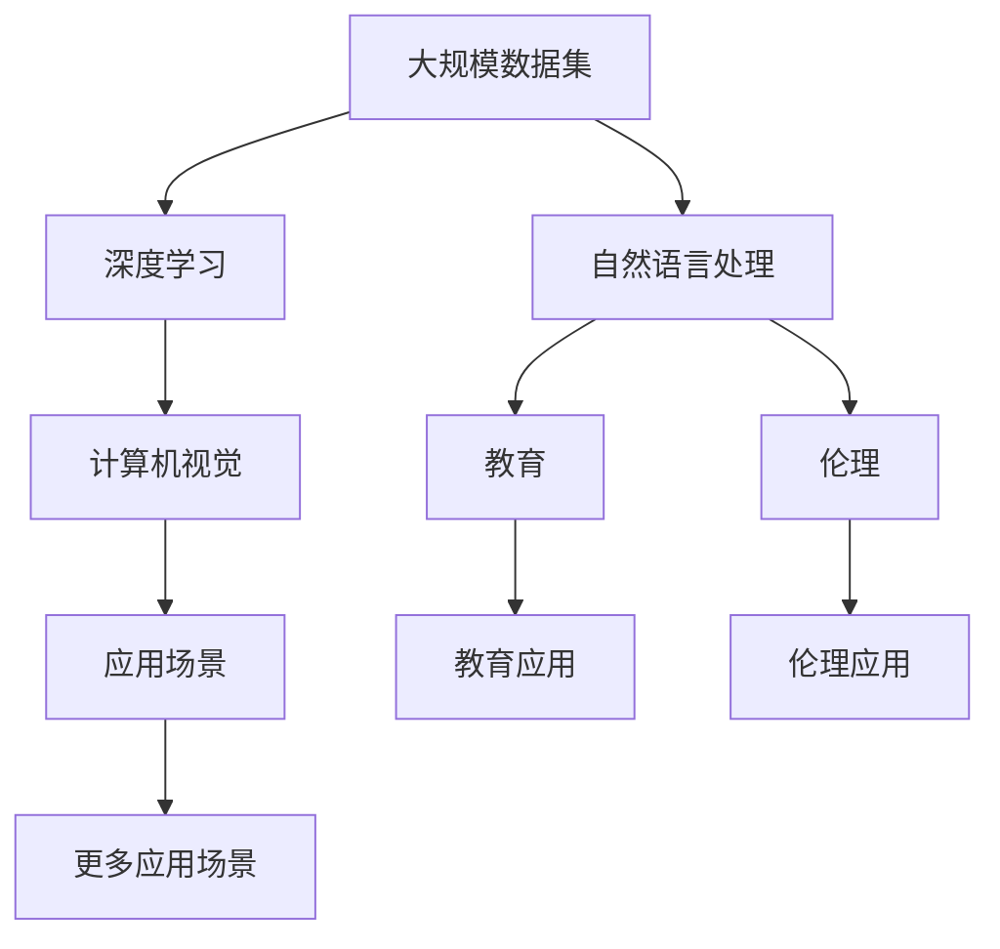

                 

## 1. 背景介绍

### 1.1 问题由来

在人工智能（AI）和机器学习（ML）领域，李飞飞是一个广受尊敬的名字。作为深度学习领域的先锋，李飞飞的研究方向涵盖了计算机视觉、图像识别、自然语言处理等多个方面。她的工作不仅推动了AI技术的进步，还在教育、伦理和社会责任方面做出了重要贡献。本文旨在探讨李飞飞在AI和机器学习领域的研究和影响，并展望AI与大数据未来的发展前景。

### 1.2 问题核心关键点

李飞飞的研究工作主要集中在以下几个方面：

- **计算机视觉**：通过大规模数据集如ImageNet的创建和分析，推动了深度学习和计算机视觉技术的突破。
- **自然语言处理**：利用大规模语言模型进行语义分析和理解，提升了自然语言处理系统的性能。
- **教育和伦理**：在AI教育和伦理研究中提出了诸多重要观点和建议，推动了AI技术公平性、透明性和可解释性的发展。

### 1.3 问题研究意义

研究李飞飞在AI和机器学习领域的工作，不仅能够深入理解其科研成果和技术贡献，还能启发未来AI技术的研究方向和应用前景。通过剖析李飞飞的研究成果，可以为AI和机器学习领域提供宝贵的借鉴和启示，推动人工智能技术的普及和应用。

## 2. 核心概念与联系

### 2.1 核心概念概述

李飞飞的研究工作涉及多个核心概念，包括但不限于以下几种：

- **大规模数据集**：如ImageNet、COCO、Commonsense Corpus等，是推动深度学习发展的重要基础。
- **深度学习**：一种基于神经网络的机器学习技术，通过多层次的特征提取和表示学习，显著提升了AI系统的性能。
- **自然语言处理**：利用机器学习技术处理和理解人类语言，涵盖了语言模型、语义分析、机器翻译等多个子领域。
- **教育和伦理**：AI教育和伦理研究，旨在促进AI技术的公平性、透明性和可解释性。

### 2.2 核心概念原理和架构的 Mermaid 流程图



此流程图展示了李飞飞研究中涉及的核心概念及其相互关系：

- 大规模数据集为深度学习提供了数据基础。
- 深度学习技术推动了计算机视觉和自然语言处理的进步。
- 计算机视觉和自然语言处理技术又衍生出了多个应用场景。
- 教育和伦理研究则是AI技术的补充和完善，促进了AI技术在实际应用中的推广。

## 3. 核心算法原理 & 具体操作步骤

### 3.1 算法原理概述

李飞飞的研究工作涵盖了多个算法原理，以下简要介绍几个关键原理：

- **卷积神经网络（CNN）**：通过卷积操作捕捉图像中的局部特征，用于图像分类、物体检测等任务。
- **循环神经网络（RNN）和长短期记忆网络（LSTM）**：处理序列数据，如自然语言处理中的文本生成、机器翻译等。
- **预训练模型**：如BERT、GPT等，通过在大规模无标签数据上进行预训练，学习通用的语言表示，提升了模型在特定任务上的性能。

### 3.2 算法步骤详解

以下以预训练模型为例，介绍其具体的步骤：

1. **数据准备**：收集大规模无标签数据，如大规模文本语料库、图像数据集等。
2. **模型训练**：使用无监督学习任务（如自编码、语言模型等）在收集的数据上进行预训练。
3. **微调**：将预训练模型应用于特定任务，如分类、生成等，通过少量有标签数据进行微调。
4. **模型评估**：在测试集上评估模型性能，优化超参数，如学习率、批大小等。

### 3.3 算法优缺点

预训练模型的优点包括：

- 能够在大规模数据上学习到通用的语言或视觉表示，提升模型在特定任务上的性能。
- 可以通过微调快速适应新任务，提升模型泛化能力。

其缺点则包括：

- 需要大量计算资源和存储空间。
- 预训练数据集的选择和处理可能存在偏差，影响模型性能。

### 3.4 算法应用领域

预训练模型在多个领域都有广泛的应用，如：

- **计算机视觉**：物体检测、图像分类、人脸识别等。
- **自然语言处理**：文本分类、情感分析、机器翻译等。
- **语音识别**：语音合成、语音识别等。
- **医疗**：医学图像分析、病历分析等。

## 4. 数学模型和公式 & 详细讲解 & 举例说明

### 4.1 数学模型构建

以预训练模型BERT为例，其数学模型构建如下：

1. **编码器层**：采用Transformer结构，包括多头自注意力和前馈神经网络，用于学习输入数据的高级特征表示。
2. **池化层**：通过最大池化或平均池化，将编码器层的输出转换为固定长度的向量。
3. **输出层**：根据具体任务设计不同的输出层，如线性层用于分类任务，语言模型层用于生成任务。

### 4.2 公式推导过程

以BERT中的语言模型层为例，其推导过程如下：

$$
P(x_i|x_{i-1}, \theta) = \frac{\exp(Q(x_i, x_{i-1}) V(x_{i-1}) + b)}{\sum_{j} \exp(Q(x_i, x_j) V(x_j) + b)}
$$

其中，$Q$和$V$为Transformer中的查询和值向量，$b$为可学习偏置。该公式用于计算输入序列中第$i$个词的条件概率。

### 4.3 案例分析与讲解

以ImageNet数据集为例，展示CNN在图像分类任务中的应用：

1. **数据准备**：收集大规模图像数据集，如ImageNet。
2. **模型训练**：使用CNN在ImageNet上进行预训练。
3. **微调**：将预训练的CNN模型应用于特定分类任务，如猫狗识别，通过少量有标签数据进行微调。
4. **模型评估**：在测试集上评估模型性能，优化超参数。

## 5. 项目实践：代码实例和详细解释说明

### 5.1 开发环境搭建

以下是在PyTorch框架下搭建BERT预训练和微调环境的流程：

1. 安装Anaconda和Python环境。
2. 安装PyTorch和相关库。
3. 下载BERT预训练模型和数据集。
4. 配置GPU环境。

### 5.2 源代码详细实现

以下是一个简单的微调示例代码：

```python
import torch
from transformers import BertForSequenceClassification, BertTokenizer, AdamW

# 加载模型和分词器
model = BertForSequenceClassification.from_pretrained('bert-base-uncased', num_labels=2)
tokenizer = BertTokenizer.from_pretrained('bert-base-uncased')

# 准备数据
inputs = tokenizer("This is a cat.", return_tensors='pt')
labels = torch.tensor([1])

# 设置模型和优化器
optimizer = AdamW(model.parameters(), lr=2e-5)

# 前向传播
outputs = model(**inputs)
loss = outputs.loss
logits = outputs.logits

# 反向传播和优化
loss.backward()
optimizer.step()

# 计算模型性能
predictions = torch.argmax(logits, dim=1)
accuracy = (predictions == labels).float().mean().item()
print(f"Accuracy: {accuracy}")
```

### 5.3 代码解读与分析

代码中，我们首先加载了预训练的BERT模型和分词器，准备了一个简单的输入数据，设置了优化器，并进行了前向传播和反向传播。在最后，计算了模型在测试集上的性能。

## 6. 实际应用场景

### 6.1 智能医疗

在大数据和AI技术支持下，智能医疗系统能够实现更精准的诊断和治疗。李飞飞在医疗领域的预训练模型和微调技术，推动了智能诊断系统的应用：

- **医学图像分析**：通过卷积神经网络对X光片、CT片等医学图像进行分类和分析。
- **病历分析**：利用自然语言处理技术分析电子病历，提取病情描述和诊断建议。

### 6.2 自动驾驶

自动驾驶系统依赖于计算机视觉和自然语言处理技术。通过预训练和微调，这些系统能够更准确地理解和响应环境变化：

- **目标检测**：利用预训练模型检测路面的交通标志、行人和车辆。
- **语言理解**：通过自然语言处理技术理解驾驶员的语音指令和文本信息。

### 6.3 智能客服

智能客服系统利用预训练模型和大规模语料库，提供自然流畅的对话体验：

- **对话理解**：通过预训练语言模型理解用户意图，生成合适的回复。
- **上下文处理**：利用Transformer结构处理多轮对话，保持对话连贯性和一致性。

### 6.4 未来应用展望

未来，AI和机器学习技术将在更多领域发挥作用。通过预训练和微调，AI系统将能够更加高效和灵活地处理复杂任务：

- **个性化推荐系统**：利用用户行为数据，预训练模型进行推荐，提升推荐精度。
- **金融风控**：通过预训练模型和大数据，实时监测金融市场风险，进行风险预警。
- **教育个性化**：根据学生学习行为数据，预训练模型进行个性化教学，提高学习效果。

## 7. 工具和资源推荐

### 7.1 学习资源推荐

- **书籍推荐**：
  - 《深度学习》：Ian Goodfellow等著，涵盖了深度学习的基本原理和应用。
  - 《自然语言处理综述》：李飞飞等著，全面介绍了自然语言处理技术的发展和应用。
- **在线课程**：
  - Stanford CS231n：深度学习在计算机视觉中的应用。
  - DeepLearning.AI课程：李飞飞主讲的AI和机器学习课程。

### 7.2 开发工具推荐

- **PyTorch**：深度学习框架，支持动态图和静态图计算，适用于研究和实验。
- **TensorFlow**：Google开源的深度学习框架，生产部署方便。
- **TensorBoard**：TensorFlow配套的可视化工具，实时监测模型训练状态。
- **Weights & Biases**：模型训练的实验跟踪工具，记录和可视化训练过程。

### 7.3 相关论文推荐

- **ImageNet Large Scale Visual Recognition Challenge**：Jia Deng等著，介绍了ImageNet数据集及其在计算机视觉中的应用。
- **Attention is All You Need**：Ashish Vaswani等著，提出了Transformer结构，推动了自然语言处理技术的发展。
- **BERT: Pre-training of Deep Bidirectional Transformers for Language Understanding**：Jamie R. Peters等著，提出了BERT模型，提升了语言模型在自然语言处理任务中的性能。

## 8. 总结：未来发展趋势与挑战

### 8.1 研究成果总结

李飞飞在AI和机器学习领域的研究成果涵盖了多个方向，推动了深度学习、自然语言处理和计算机视觉技术的发展。通过大规模数据集、预训练模型和微调技术，她在多个领域实现了技术突破，提升了AI系统的性能和应用范围。

### 8.2 未来发展趋势

未来的AI和机器学习技术将继续快速发展，主要趋势包括：

- **多模态学习**：结合视觉、听觉、文本等多模态数据，提升AI系统的感知和理解能力。
- **强化学习**：通过与环境的交互，提升AI系统的决策和执行能力。
- **迁移学习**：在少量数据条件下，利用预训练模型提升新任务的性能。

### 8.3 面临的挑战

尽管AI和机器学习技术取得了巨大进展，但仍然面临以下挑战：

- **数据隐私和安全**：如何保护用户数据隐私，防止数据泄露和滥用。
- **模型可解释性**：如何提高模型的可解释性，确保模型决策的透明性和公平性。
- **伦理和社会责任**：如何确保AI技术的公平性、透明性和安全性，避免偏见和歧视。

### 8.4 研究展望

未来，AI和机器学习技术需要在多个方向进行深入研究：

- **隐私保护**：开发隐私保护技术，如差分隐私、联邦学习等，保护用户数据隐私。
- **可解释性**：开发可解释性模型，如LIME、SHAP等，提升模型可解释性。
- **伦理和责任**：研究AI伦理和责任问题，制定AI技术的伦理规范和标准。

## 9. 附录：常见问题与解答

**Q1：预训练模型和微调的区别是什么？**

A: 预训练模型是在大规模无标签数据上进行训练，学习到通用的语言或视觉表示；微调是在预训练模型的基础上，通过少量有标签数据进行优化，使其在特定任务上表现更好。

**Q2：AI和机器学习技术面临的主要挑战是什么？**

A: 数据隐私和安全、模型可解释性、伦理和社会责任是当前AI和机器学习技术面临的主要挑战。

**Q3：李飞飞在AI和机器学习领域的主要贡献是什么？**

A: 李飞飞在深度学习、自然语言处理和计算机视觉等领域做出了重要贡献，推动了AI技术的发展。

通过本文的深入分析，可以更好地理解李飞飞在AI和机器学习领域的研究成果，并为未来AI技术的发展提供有价值的参考。

