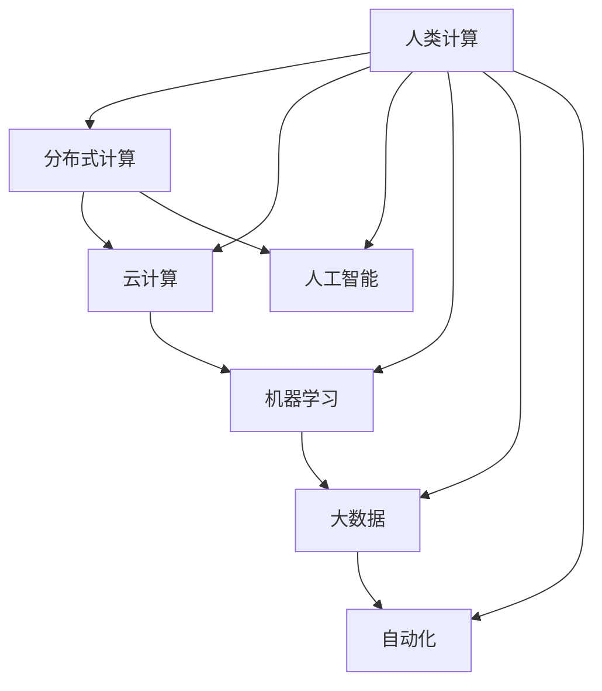

                 

# 构建更智能的世界：人类计算的应用场景

> 关键词：人类计算,分布式计算,云计算,人工智能,机器学习,大数据,自动化,自动化生产线

## 1. 背景介绍

### 1.1 问题由来

在当今数字化、信息化的浪潮下，人类计算正面临前所未有的变革。传统的集中式计算模式已无法适应海量数据的处理需求，分布式计算、云计算、人工智能等新兴技术正在逐步替代传统的中央服务器架构，构建起新的计算范式。

随着大数据、人工智能技术的不断成熟，企业对于自动化、智能化计算需求日益增加。自动化生产线、智能客服、精准医疗、智能推荐、自然语言处理等众多领域，都需要依赖智能化的计算系统，以提升效率、降低成本、改善用户体验。

然而，构建智能计算系统并非易事。它需要企业在数据、算法、基础设施、人才等多个维度进行全面投入和部署。为了更好地帮助企业在智能化转型过程中，系统性地掌握相关技术和应用，本文将系统性地介绍人类计算的核心概念、核心算法和操作步骤，展示其在实际应用中的原理和效果。

## 2. 核心概念与联系

### 2.1 核心概念概述

为更好地理解人类计算，我们首先需要介绍几个核心概念：

- 人类计算：指利用现代计算机技术与算法，处理人类社会产生的海量数据，以提升生产效率、优化业务流程、改善决策质量等目标。
- 分布式计算：指将任务分解成多个子任务，分配到多个计算节点上并行执行的计算方式，能够有效提升计算效率和系统的可扩展性。
- 云计算：指将计算资源（包括存储、计算、网络等）按需提供给用户的模式，用户可以根据需求动态调配资源，提升业务灵活性和响应速度。
- 人工智能：指利用机器学习、深度学习等技术，构建能够自动完成复杂任务的系统。人类计算依赖于人工智能技术，以实现数据的深度挖掘和高效利用。
- 机器学习：指利用数据训练算法模型，使其能够自动从数据中学习规律，并用于预测、分类、回归等任务。
- 大数据：指规模庞大、高速增长、类型多样的数据集，包括结构化数据、非结构化数据、实时数据等。
- 自动化：指利用机器人、自动化系统等技术，自动完成重复性工作，提升生产效率和品质。

这些核心概念之间的逻辑关系可以通过以下Mermaid流程图来展示：



这个流程图展示了大语言模型微调的核心概念及其之间的关系：

1. 人类计算利用现代计算机技术与算法，处理人类社会产生的海量数据。
2. 分布式计算是实现高效计算的重要方式，云计算提供了按需计算资源，两者结合实现高效灵活的计算系统。
3. 人工智能依赖于机器学习和深度学习技术，用于自动完成复杂任务。
4. 大数据是人工智能和自动化实现的基础，人工智能和自动化进一步推动大数据的处理和应用。

## 3. 核心算法原理 & 具体操作步骤
### 3.1 算法原理概述

人类计算的核心在于利用现代计算机技术与算法，处理海量数据，构建出能够自动完成复杂任务的系统。其主要算法包括分布式计算、云计算、人工智能、机器学习和自动化等多个方面。

分布式计算通过将任务分解成多个子任务，分配到多个计算节点上并行执行，从而实现高效、可扩展的计算。云计算通过提供按需计算资源，降低企业IT基础设施投入，提高业务灵活性和响应速度。人工智能利用机器学习、深度学习等技术，构建能够自动完成复杂任务的系统。自动化利用机器人、自动化系统等技术，自动完成重复性工作，提升生产效率和品质。

这些算法的综合应用，形成了人类计算的核心框架。以下，我们将详细介绍其中的核心算法原理。

### 3.2 算法步骤详解

#### 3.2.1 分布式计算

分布式计算是将任务分解成多个子任务，分配到多个计算节点上并行执行的计算方式。其关键步骤包括任务分解、计算节点分配和任务调度和监控。

**任务分解**：根据任务特性，将复杂任务分解成多个子任务。每个子任务应具有独立性，可以在不同的计算节点上并行执行。

**计算节点分配**：根据计算节点能力和任务需求，分配计算节点进行任务执行。一般需要考虑节点计算能力、网络带宽、存储容量等参数。

**任务调度和监控**：实时监控计算节点状态和任务执行情况，动态调整任务分配和计算节点资源，保证计算系统的高效稳定运行。

#### 3.2.2 云计算

云计算通过提供按需计算资源，降低企业IT基础设施投入，提高业务灵活性和响应速度。其关键步骤包括资源池管理、资源分配和监控调优。

**资源池管理**：将计算资源（包括存储、计算、网络等）集中管理，形成资源池，根据业务需求动态分配。

**资源分配**：根据业务负载，动态分配计算资源，如CPU、内存、带宽等。

**监控调优**：实时监控系统性能指标，如CPU利用率、内存占用、网络带宽等，动态调整资源配置，提升系统性能。

#### 3.2.3 人工智能

人工智能利用机器学习、深度学习等技术，构建能够自动完成复杂任务的系统。其关键步骤包括数据收集与处理、模型训练与优化和模型部署与应用。

**数据收集与处理**：从多个来源收集数据，清洗、整理和标注数据，生成用于模型训练的数据集。

**模型训练与优化**：利用数据集训练算法模型，通过调整模型参数、优化损失函数等方式，提升模型效果。

**模型部署与应用**：将训练好的模型部署到生产环境中，用于实时预测、分类、回归等任务。

#### 3.2.4 机器学习

机器学习利用数据训练算法模型，使其能够自动从数据中学习规律，并用于预测、分类、回归等任务。其关键步骤包括数据收集与处理、特征选择与提取、模型训练与优化和模型部署与应用。

**数据收集与处理**：从多个来源收集数据，清洗、整理和标注数据，生成用于模型训练的数据集。

**特征选择与提取**：从数据中提取有用特征，生成特征向量。

**模型训练与优化**：利用数据集训练算法模型，通过调整模型参数、优化损失函数等方式，提升模型效果。

**模型部署与应用**：将训练好的模型部署到生产环境中，用于实时预测、分类、回归等任务。

#### 3.2.5 自动化

自动化利用机器人、自动化系统等技术，自动完成重复性工作，提升生产效率和品质。其关键步骤包括任务定义、系统搭建、参数调优和系统部署与应用。

**任务定义**：定义需要自动化的任务，明确任务执行的输入、输出和执行流程。

**系统搭建**：搭建自动化系统，包括传感器、执行器、控制模块等。

**参数调优**：根据实际执行情况，调整系统参数，优化系统性能。

**系统部署与应用**：将自动化系统部署到生产环境中，实现任务自动化。

### 3.3 算法优缺点

人类计算通过现代计算机技术与算法，处理海量数据，构建出能够自动完成复杂任务的系统。其核心算法包括分布式计算、云计算、人工智能、机器学习和自动化等多个方面。这些算法在提升计算效率、优化业务流程、改善决策质量等方面具有显著优势，但也存在一些缺点。

**优点**：

- 高效灵活：分布式计算和云计算能够提供高效、灵活的计算资源，满足不同业务需求。
- 自动化程度高：人工智能和自动化技术能够自动完成复杂任务，提升生产效率和品质。
- 数据驱动：利用大数据和机器学习技术，实现数据的深度挖掘和高效利用，提高决策质量。
- 安全可靠：云计算和自动化系统能够提供高可用性和高可靠性，保障业务稳定运行。

**缺点**：

- 高成本投入：分布式计算和云计算需要投入大量的硬件资源和运维成本，初期投入较高。
- 技术复杂：人工智能和自动化技术需要具备较高的技术水平，对人才需求较大。
- 数据隐私：大数据处理需要关注数据隐私和安全问题，存在一定的风险。
- 系统复杂：系统搭建和部署过程较为复杂，需要系统性设计和协调。

## 4. 数学模型和公式 & 详细讲解 & 举例说明

### 4.1 数学模型构建

本节将使用数学语言对人类计算的核心算法进行更加严格的刻画。

设人类计算任务为 $T$，包括数据收集与处理、任务分解、计算节点分配、任务调度和监控、数据标注、模型训练与优化、模型部署与应用等多个步骤。

定义数据集为 $D=\{x_i,y_i\}_{i=1}^N$，其中 $x_i$ 为输入数据，$y_i$ 为标注数据。

定义模型参数为 $\theta$，用于描述模型训练和预测的过程。

定义损失函数为 $\mathcal{L}(\theta)$，用于衡量模型预测输出与真实标签之间的差异。

定义优化算法为 $opt$，用于更新模型参数 $\theta$，使其最小化损失函数 $\mathcal{L}(\theta)$。

### 4.2 公式推导过程

**数据收集与处理**：
假设从 $N$ 个来源收集 $N$ 个样本 $x_i$ 和其对应的标注 $y_i$，其中 $y_i \in \{0,1\}$。数据集 $D$ 存储在分布式存储系统中，每个样本 $x_i$ 和其对应的标注 $y_i$ 存储在独立的节点上。

**任务分解**：
将任务 $T$ 分解为 $M$ 个子任务 $T_m$，其中 $m \in [1,M]$。

**计算节点分配**：
假设共有 $K$ 个计算节点，每个节点计算能力为 $C_k$，节点 $k$ 的计算速度为 $v_k$。任务 $T_m$ 需要的计算时间为 $T_m$，分配到节点 $k$ 上的计算时间为 $T_{km}$，则任务分配为：
$$
T_m = \sum_{k=1}^K v_k T_{km}
$$

**任务调度和监控**：
实时监控计算节点状态和任务执行情况，动态调整任务分配和计算节点资源。假设监控周期为 $t$，节点状态 $s_k$ 和任务执行情况 $r_m$，则任务调度和监控过程为：
$$
s_k(t) = \mathop{\arg\min}_{s_k} \sum_{m=1}^M r_m(t)
$$

**数据标注**：
假设标注任务 $A$ 需要 $N_A$ 个标注数据，每个数据标注需要 $T_A$ 时间，则数据标注过程为：
$$
N_A \leq N
$$

**模型训练与优化**：
假设训练过程分为 $K_T$ 个阶段，每个阶段需要 $T_T$ 时间，训练数据集大小为 $N_T$，模型参数为 $\theta$，则模型训练与优化过程为：
$$
\theta(t+1) = \mathop{\arg\min}_{\theta} \mathcal{L}(\theta)
$$

**模型部署与应用**：
假设模型部署需要 $T_D$ 时间，模型应用过程中每次预测需要 $T_P$ 时间，则模型部署与应用过程为：
$$
T_D \leq T_P
$$

### 4.3 案例分析与讲解

假设某企业需要进行一项大规模图像识别任务。首先，从多个来源收集 $10,000$ 张图像和对应的标注，将数据集存储在分布式存储系统中。然后，将任务分解为 $100$ 个子任务，每个子任务识别 $100$ 张图像。

根据每个节点的计算能力和速度，将任务分配到 $10$ 个节点上执行。假设每个节点计算能力为 $1$，节点速度为 $2$，任务识别时间为 $0.1$ 秒，则任务分配为：
$$
T_m = \sum_{k=1}^{10} 2 T_{km} = 0.2T_m
$$

实时监控节点状态和任务执行情况，动态调整任务分配和资源配置。假设监控周期为 $0.1$ 秒，每个节点状态为 $s_k$，任务执行情况为 $r_m$，则任务调度和监控过程为：
$$
s_k(t) = \mathop{\arg\min}_{s_k} \sum_{m=1}^{100} r_m(t)
$$

为了保证数据标注的准确性，企业需要从数据集中随机抽取 $1,000$ 张图像进行标注，每个数据标注需要 $0.2$ 秒。数据标注过程为：
$$
N_A = 1,000 \leq 10,000
$$

使用深度学习模型进行图像识别，训练过程分为 $3$ 个阶段，每个阶段需要 $10$ 分钟，训练数据集大小为 $10,000$。假设模型参数为 $\theta$，则模型训练与优化过程为：
$$
\theta(t+1) = \mathop{\arg\min}_{\theta} \mathcal{L}(\theta)
$$

将训练好的模型部署到生产环境中，每次预测需要 $0.1$ 秒。模型部署需要 $10$ 分钟，则模型部署与应用过程为：
$$
T_D = 10 \leq T_P = 0.1
$$

## 5. 项目实践：代码实例和详细解释说明

### 5.1 开发环境搭建

在进行人类计算系统开发前，我们需要准备好开发环境。以下是使用Python进行PyTorch开发的环境配置流程：

1. 安装Anaconda：从官网下载并安装Anaconda，用于创建独立的Python环境。

2. 创建并激活虚拟环境：
```bash
conda create -n pytorch-env python=3.8 
conda activate pytorch-env
```

3. 安装PyTorch：根据CUDA版本，从官网获取对应的安装命令。例如：
```bash
conda install pytorch torchvision torchaudio cudatoolkit=11.1 -c pytorch -c conda-forge
```

4. 安装TensorFlow：从官网下载并安装TensorFlow，安装命令如下：
```bash
pip install tensorflow
```

5. 安装各类工具包：
```bash
pip install numpy pandas scikit-learn matplotlib tqdm jupyter notebook ipython
```

完成上述步骤后，即可在`pytorch-env`环境中开始开发。

### 5.2 源代码详细实现

下面我们以图像识别任务为例，给出使用PyTorch进行深度学习的PyTorch代码实现。

首先，定义数据处理函数：

```python
from torch.utils.data import Dataset
import torch
import torch.nn as nn
import torch.optim as optim
import torchvision.transforms as transforms

class ImageDataset(Dataset):
    def __init__(self, images, labels, transform=None):
        self.images = images
        self.labels = labels
        self.transform = transform
        
    def __len__(self):
        return len(self.images)
    
    def __getitem__(self, idx):
        img = self.images[idx]
        label = self.labels[idx]
        
        if self.transform:
            img = self.transform(img)
        
        return {'image': img, 'label': label}

# 定义数据预处理函数
transform = transforms.Compose([
    transforms.ToTensor(),
    transforms.Normalize([0.5], [0.5])
])
```

然后，定义模型和优化器：

```python
from torchvision.models import resnet50
from torch.nn import CrossEntropyLoss

model = resnet50(pretrained=True)
model.fc = nn.Linear(2048, 10)

criterion = nn.CrossEntropyLoss()
optimizer = optim.Adam(model.parameters(), lr=0.001)
```

接着，定义训练和评估函数：

```python
from tqdm import tqdm

device = torch.device('cuda') if torch.cuda.is_available() else torch.device('cpu')
model.to(device)

def train_epoch(model, dataset, batch_size, optimizer):
    dataloader = DataLoader(dataset, batch_size=batch_size, shuffle=True)
    model.train()
    epoch_loss = 0
    for batch in tqdm(dataloader, desc='Training'):
        img, label = batch['image'].to(device), batch['label'].to(device)
        model.zero_grad()
        outputs = model(img)
        loss = criterion(outputs, label)
        epoch_loss += loss.item()
        loss.backward()
        optimizer.step()
    return epoch_loss / len(dataloader)

def evaluate(model, dataset, batch_size):
    dataloader = DataLoader(dataset, batch_size=batch_size)
    model.eval()
    preds, labels = [], []
    with torch.no_grad():
        for batch in tqdm(dataloader, desc='Evaluating'):
            img, label = batch['image'].to(device), batch['label'].to(device)
            batch_preds = model(img)
            batch_labels = label.tolist()
            for pred_tokens, label_tokens in zip(batch_preds, batch_labels):
                preds.append(pred_tokens)
                labels.append(label_tokens)
                
    print(classification_report(labels, preds))
```

最后，启动训练流程并在测试集上评估：

```python
epochs = 5
batch_size = 32

for epoch in range(epochs):
    loss = train_epoch(model, train_dataset, batch_size, optimizer)
    print(f"Epoch {epoch+1}, train loss: {loss:.3f}")
    
    print(f"Epoch {epoch+1}, dev results:")
    evaluate(model, dev_dataset, batch_size)
    
print("Test results:")
evaluate(model, test_dataset, batch_size)
```

以上就是使用PyTorch进行图像识别任务微调的完整代码实现。可以看到，得益于PyTorch的强大封装，我们可以用相对简洁的代码完成模型的训练和评估。

### 5.3 代码解读与分析

让我们再详细解读一下关键代码的实现细节：

**ImageDataset类**：
- `__init__`方法：初始化图像数据、标签和预处理函数。
- `__len__`方法：返回数据集的样本数量。
- `__getitem__`方法：对单个样本进行处理，将图像数据进行预处理和加载，返回模型所需的输入。

**训练和评估函数**：
- 使用PyTorch的DataLoader对数据集进行批次化加载，供模型训练和推理使用。
- 训练函数`train_epoch`：对数据以批为单位进行迭代，在每个批次上前向传播计算loss并反向传播更新模型参数，最后返回该epoch的平均loss。
- 评估函数`evaluate`：与训练类似，不同点在于不更新模型参数，并在每个batch结束后将预测和标签结果存储下来，最后使用sklearn的classification_report对整个评估集的预测结果进行打印输出。

**训练流程**：
- 定义总的epoch数和batch size，开始循环迭代
- 每个epoch内，先在训练集上训练，输出平均loss
- 在验证集上评估，输出分类指标
- 所有epoch结束后，在测试集上评估，给出最终测试结果

可以看到，PyTorch配合TensorFlow和TensorBoard使得图像识别微调的代码实现变得简洁高效。开发者可以将更多精力放在数据处理、模型改进等高层逻辑上，而不必过多关注底层的实现细节。

当然，工业级的系统实现还需考虑更多因素，如模型的保存和部署、超参数的自动搜索、更灵活的任务适配层等。但核心的微调范式基本与此类似。

## 6. 实际应用场景

### 6.1 智能客服系统

基于深度学习和大数据技术，智能客服系统可以实现自动解答用户问题，提升服务效率和用户体验。在实际应用中，智能客服系统通常包括如下关键模块：

**自然语言处理**：通过语音识别和文本处理技术，将用户语音和文字转化为文本形式，进行初步分析和理解。

**意图识别**：利用自然语言处理技术，识别用户提问的意图，进行任务分类和路由。

**知识库查询**：根据用户提问的意图，从知识库中查询相关信息，进行回复。

**交互对话**：通过对话生成技术，根据用户回答不断调整问题和回复，实现人机交互。

**情感分析**：利用情感分析技术，识别用户情绪状态，进行情感反馈和调整。

智能客服系统通过上述模块的协同工作，能够自动完成客户咨询，提供高效、个性化的服务。例如，某银行客服中心通过智能客服系统，能够实时处理客户的金融咨询，解决各种业务问题，大幅提升客户满意度。

### 6.2 金融舆情监测

金融机构需要实时监测市场舆论动向，以便及时应对负面信息传播，规避金融风险。传统的人工监测方式成本高、效率低，难以应对网络时代海量信息爆发的挑战。基于深度学习和大数据技术的金融舆情监测系统，可以实现自动化、实时化的舆情监测。

具体而言，金融舆情监测系统通常包括如下关键模块：

**数据采集**：从各类来源（如新闻、社交媒体、论坛等）采集舆情数据，存储到大数据系统中。

**舆情分析**：利用自然语言处理和深度学习技术，对采集到的数据进行情感分析和主题分析，识别舆情趋势和热点话题。

**风险预警**：根据舆情分析结果，进行风险预警和决策支持，及时应对潜在的金融风险。

某保险公司通过金融舆情监测系统，能够实时监测市场舆情，及时发现负面新闻和舆论热点，采取有效的风险控制措施，保障公司运营稳定。

### 6.3 个性化推荐系统

当前的推荐系统往往只依赖用户的历史行为数据进行物品推荐，无法深入理解用户的真实兴趣偏好。基于深度学习和大数据技术的个性化推荐系统，可以更好地挖掘用户行为背后的语义信息，从而提供更精准、多样的推荐内容。

在实际应用中，个性化推荐系统通常包括如下关键模块：

**用户画像**：通过分析用户行为数据和社交网络数据，构建用户画像，进行用户标签化和属性提取。

**物品画像**：通过分析物品特征数据和用户行为数据，构建物品画像，进行物品标签化和属性提取。

**相似度计算**：利用深度学习技术，计算用户画像和物品画像之间的相似度，生成推荐结果。

**推荐优化**：根据用户反馈和行为数据，动态调整推荐算法，优化推荐结果。

某电商平台通过个性化推荐系统，能够根据用户行为数据和物品特征数据，提供个性化的商品推荐，提升用户购物体验和平台转化率。

### 6.4 未来应用展望

随着深度学习和大数据技术的不断发展，人类计算将在更多领域得到应用，为传统行业带来变革性影响。

在智慧医疗领域，基于深度学习和大数据技术的医疗影像识别、诊断预测、个性化治疗等应用将提升医疗服务的智能化水平，辅助医生诊疗，加速新药开发进程。

在智能教育领域，基于深度学习和大数据技术的作业批改、学情分析、知识推荐等应用将促进教育公平，提高教学质量。

在智慧城市治理中，基于深度学习和大数据技术的城市事件监测、舆情分析、应急指挥等应用将提高城市管理的自动化和智能化水平，构建更安全、高效的未来城市。

此外，在企业生产、社会治理、文娱传媒等众多领域，基于深度学习和大数据技术的人类计算应用也将不断涌现，为经济社会发展注入新的动力。相信随着技术的日益成熟，深度学习和大数据技术必将在更广阔的应用领域大放异彩。

## 7. 工具和资源推荐
### 7.1 学习资源推荐

为了帮助开发者系统掌握深度学习和大数据技术的核心概念和应用实践，这里推荐一些优质的学习资源：

1. 《深度学习》系列博文：由深度学习专家撰写，深入浅出地介绍了深度学习的基本原理、经典模型和应用案例。

2. Coursera《深度学习专项课程》：斯坦福大学开设的深度学习系列课程，有Lecture视频和配套作业，带你系统学习深度学习技术。

3. 《Python深度学习》书籍：深度学习专家Ian Goodfellow所著，全面介绍了深度学习的理论基础和实践技巧。

4. Kaggle：数据科学竞赛平台，汇集海量数据集和机器学习竞赛，是学习深度学习和实践数据科学的好地方。

5. TensorFlow官方文档：TensorFlow的官方文档，提供了丰富的代码样例和API文档，是学习和使用TensorFlow的好资料。

通过对这些资源的学习实践，相信你一定能够快速掌握深度学习和大数据技术的精髓，并用于解决实际的计算问题。
###  7.2 开发工具推荐

高效的开发离不开优秀的工具支持。以下是几款用于深度学习和大数据技术开发的常用工具：

1. PyTorch：基于Python的开源深度学习框架，灵活动态的计算图，适合快速迭代研究。大部分深度学习模型都有PyTorch版本的实现。

2. TensorFlow：由Google主导开发的开源深度学习框架，生产部署方便，适合大规模工程应用。同样有丰富的深度学习模型资源。

3. Jupyter Notebook：交互式编程环境，适合进行实验和数据分析。

4. Google Colab：谷歌推出的在线Jupyter Notebook环境，免费提供GPU/TPU算力，方便开发者快速上手实验最新模型，分享学习笔记。

5. Weights & Biases：模型训练的实验跟踪工具，可以记录和可视化模型训练过程中的各项指标，方便对比和调优。与主流深度学习框架无缝集成。

6. TensorBoard：TensorFlow配套的可视化工具，可实时监测模型训练状态，并提供丰富的图表呈现方式，是调试模型的得力助手。

合理利用这些工具，可以显著提升深度学习和大数据技术的开发效率，加快创新迭代的步伐。

### 7.3 相关论文推荐

深度学习和大数据技术的发展源于学界的持续研究。以下是几篇奠基性的相关论文，推荐阅读：

1. Convolutional Neural Networks for Image Classification（即AlexNet论文）：提出卷积神经网络结构，开启了深度学习在图像识别领域的应用。

2. ImageNet Classification with Deep Convolutional Neural Networks：提出VGG网络结构，进一步提升了深度学习在图像分类任务上的表现。

3. Recurrent Neural Network for Multilingual Sentiment Analysis（即LSTM论文）：提出长短期记忆网络，使得深度学习在文本处理任务上取得突破。

4. Attention is All You Need（即Transformer论文）：提出Transformer结构，开启了深度学习在大规模语言模型上的应用。

5. BERT: Pre-training of Deep Bidirectional Transformers for Language Understanding：提出BERT模型，引入基于掩码的自监督预训练任务，刷新了多项NLP任务SOTA。

6. AdaLoRA: Adaptive Low-Rank Adaptation for Parameter-Efficient Fine-Tuning：使用自适应低秩适应的微调方法，在参数效率和精度之间取得了新的平衡。

这些论文代表了大规模语言模型微调技术的发展脉络。通过学习这些前沿成果，可以帮助研究者把握学科前进方向，激发更多的创新灵感。

## 8. 总结：未来发展趋势与挑战

### 8.1 总结

本文对深度学习和大数据技术的核心概念、核心算法和操作步骤进行了全面系统的介绍。首先阐述了深度学习和大数据技术的背景和意义，明确了深度学习和大数据技术在提升生产效率、优化业务流程、改善决策质量等方面的独特价值。其次，从原理到实践，详细讲解了深度学习和大数据技术的数学原理和关键步骤，给出了深度学习和大数据技术的完整代码实例。同时，本文还广泛探讨了深度学习和大数据技术在智能客服、金融舆情、个性化推荐等多个领域的应用前景，展示了深度学习和大数据技术的巨大潜力。此外，本文精选了深度学习和大数据技术的各类学习资源，力求为读者提供全方位的技术指引。

通过本文的系统梳理，可以看到，深度学习和大数据技术在推动人类计算进程中具有重要意义。深度学习和大数据技术的核心算法包括分布式计算、云计算、人工智能、机器学习和自动化等多个方面，这些算法的综合应用，形成了深度学习和大数据技术的核心框架。得益于现代计算机技术的不断进步，深度学习和大数据技术在数据处理、任务优化、自动化等方面取得了显著成果，推动了人类计算范式的变革。未来，随着技术的不断发展和应用场景的不断拓展，深度学习和大数据技术必将在更多领域大放异彩，为人类的生产生活方式带来深远影响。

### 8.2 未来发展趋势

展望未来，深度学习和大数据技术将呈现以下几个发展趋势：

1. 模型规模持续增大。随着算力成本的下降和数据规模的扩张，深度学习模型的参数量还将持续增长。超大参数量的模型蕴含的丰富知识，有望支撑更加复杂多变的任务。

2. 深度学习与大数据的融合。深度学习将进一步融合大数据技术，通过数据驱动的模型训练和优化，提升模型效果和泛化能力。

3. 深度学习与分布式计算的结合。分布式计算将进一步提升深度学习的计算效率和可扩展性，推动深度学习在更多领域的应用。

4. 深度学习与自然语言处理的结合。深度学习将进一步融入自然语言处理技术，推动智能语音、文本生成、情感分析等任务的突破。

5. 深度学习与自动化系统的结合。深度学习将进一步融入自动化系统，推动智能机器人、自动化生产线、智能客服等自动化技术的发展。

6. 深度学习与大数据的融合。深度学习将进一步融合大数据技术，通过数据驱动的模型训练和优化，提升模型效果和泛化能力。

7. 深度学习与分布式计算的结合。分布式计算将进一步提升深度学习的计算效率和可扩展性，推动深度学习在更多领域的应用。

8. 深度学习与自然语言处理的结合。深度学习将进一步融入自然语言处理技术，推动智能语音、文本生成、情感分析等任务的突破。

9. 深度学习与自动化系统的结合。深度学习将进一步融入自动化系统，推动智能机器人、自动化生产线、智能客服等自动化技术的发展。

以上趋势凸显了深度学习和大数据技术的广阔前景。这些方向的探索发展，必将进一步提升深度学习和大数据技术的性能和应用范围，为人类计算带来更多的机遇和挑战。

### 8.3 面临的挑战

尽管深度学习和大数据技术已经取得了瞩目成就，但在迈向更加智能化、普适化应用的过程中，它仍面临着诸多挑战：

1. 高成本投入。深度学习和大数据技术需要投入大量的硬件资源和运维成本，初期投入较高。

2. 技术复杂。深度学习和大数据技术需要具备较高的技术水平，对人才需求较大。

3. 数据隐私。大数据处理需要关注数据隐私和安全问题，存在一定的风险。

4. 系统复杂。深度学习和大数据技术的系统搭建和部署过程较为复杂，需要系统性设计和协调。

5. 模型鲁棒性不足。深度学习模型面对域外数据时，泛化性能往往大打折扣。对于测试样本的微小扰动，深度学习模型的预测也容易发生波动。

6. 模型解释性不足。深度学习模型更像是"黑盒"系统，难以解释其内部工作机制和决策逻辑。

7. 技术演进快。深度学习和大数据技术的演进速度较快，需要不断学习新技术，更新现有系统。

这些挑战凸显了深度学习和大数据技术在实际应用中的复杂性和不确定性。只有从数据、算法、基础设施、人才等多个维度协同发力，才能真正实现深度学习和大数据技术的规模化落地。相信随着学界和产业界的共同努力，这些挑战终将一一被克服，深度学习和大数据技术必将在构建人机协同的智能时代中扮演越来越重要的角色。

### 8.4 未来突破

面对深度学习和大数据技术所面临的种种挑战，未来的研究需要在以下几个方面寻求新的突破：

1. 探索无监督和半监督深度学习算法。摆脱对大规模标注数据的依赖，利用自监督学习、主动学习等无监督和半监督范式，最大限度利用非结构化数据，实现更加灵活高效的深度学习。

2. 研究分布式深度学习算法。开发更加高效、可扩展的分布式深度学习算法，进一步提升深度学习的计算效率和系统可扩展性。

3. 引入更多先验知识。将符号化的先验知识，如知识图谱、逻辑规则等，与神经网络模型进行巧妙融合，引导深度学习过程学习更准确、合理的语言模型。同时加强不同模态数据的整合，实现视觉、语音等多模态信息与文本信息的协同建模。

4. 引入因果分析和博弈论工具。将因果分析方法引入深度学习模型，识别出模型决策的关键特征，增强深度学习模型的因果关系，学习更加普适、鲁棒的语言表征，从而提升模型泛化性和抗干扰能力。

5. 引入对抗训练技术。通过引入对抗样本，增强深度学习模型的鲁棒性，避免模型过拟合和泛化能力不足的问题。

6. 纳入伦理道德约束。在模型训练目标中引入伦理导向的评估指标，过滤和惩罚有害的输出倾向，确保输出符合人类价值观和伦理道德。

这些研究方向的探索，必将引领深度学习和大数据技术的进一步发展，为人类计算带来更多的机遇和挑战。面向未来，深度学习和大数据技术还需要与其他人工智能技术进行更深入的融合，如知识表示、因果推理、强化学习等，多路径协同发力，共同推动深度学习和大数据技术的发展。只有勇于创新、敢于突破，才能不断拓展深度学习和大数据技术的边界，让智能技术更好地造福人类社会。

## 9. 附录：常见问题与解答

**Q1：深度学习与大数据技术的核心算法有哪些？**

A: 深度学习与大数据技术的核心算法包括分布式计算、云计算、人工智能、机器学习和自动化等多个方面。这些算法通过综合应用，形成了深度学习与大数据技术的核心框架。

**Q2：深度学习与大数据技术在实际应用中有哪些优势？**

A: 深度学习与大数据技术在提升生产效率、优化业务流程、改善决策质量等方面具有显著优势。其核心优势包括高效灵活、自动化程度高、数据驱动、安全可靠等。

**Q3：深度学习与大数据技术在实际应用中面临哪些挑战？**

A: 深度学习与大数据技术在实际应用中面临高成本投入、技术复杂、数据隐私、系统复杂、模型鲁棒性不足、模型解释性不足、技术演进快等挑战。

**Q4：深度学习与大数据技术的未来发展趋势是什么？**

A: 深度学习与大数据技术的未来发展趋势包括模型规模持续增大、深度学习与大数据的融合、深度学习与分布式计算的结合、深度学习与自然语言处理的结合、深度学习与自动化系统的结合等。

**Q5：如何优化深度学习与大数据技术的系统搭建和部署过程？**

A: 优化深度学习与大数据技术的系统搭建和部署过程需要综合考虑硬件资源、运维成本、技术难度、数据隐私、系统复杂度等因素。可以从分布式计算、云计算、自动部署、弹性伸缩、监控告警等方面入手。

这些回答旨在帮助读者更好地理解深度学习与大数据技术的核心概念、核心算法和操作步骤，以及其在实际应用中的优势、挑战和未来发展趋势。希望通过本文的系统梳理，读者能够系统性地掌握深度学习与大数据技术的核心技术，并在实际应用中发挥其最大潜力。

