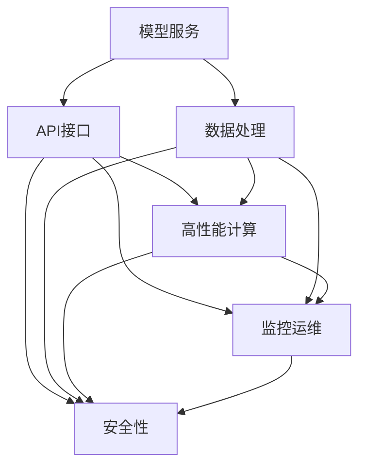

                 

# 模型服务化与API设计原理与代码实战案例讲解

## 1. 背景介绍

### 1.1 问题由来
在人工智能与大数据快速发展的今天，模型服务化已逐步成为企业数字化转型和智能化升级的关键。模型服务化，即把模型作为服务来设计、部署和调用，是实现模型可复用、可扩展、高性能、高可用、低成本、易维护的重要手段。模型服务化能降低模型管理成本、提高模型运行效率、提升数据处理能力、支持多种数据源接入、保证模型数据安全。

近年来，企业级模型服务化方案已得到广泛应用，并在实际生产环境中逐渐得到认可，促进了人工智能技术在各垂直行业的广泛落地。

### 1.2 问题核心关键点
模型服务化涉及多学科领域，涵盖了数据处理、算法建模、系统架构、运维管理等，核心点在于：

- **模型管理**：对模型进行全生命周期管理，包括模型开发、部署、监控、优化等。
- **API设计**：确保模型服务高效、易用、稳定，同时保证调用接口的安全性、性能和可扩展性。
- **数据处理**：合理处理模型输入数据，保证数据质量，提高模型效果。
- **高性能运维**：确保模型服务高性能、高可用性，需要合理的系统架构和有效的监控手段。
- **安全性保障**：在模型服务调用过程中，需确保数据和模型本身的安全性，避免数据泄露和模型攻击。

### 1.3 问题研究意义
模型服务化的研究，对于提升企业AI技术落地效率、优化生产流程、增强决策支持具有重要意义：

1. **降低AI应用门槛**：模型服务化使企业不必从零开始开发和部署模型，降低了应用AI技术的门槛。
2. **提高模型效果**：通过统一的接口调用和模型管理，确保模型一致性和稳定性，提高模型效果。
3. **优化资源利用**：利用高性能计算资源，降低模型运行成本，提高资源利用率。
4. **增强业务敏捷性**：模型服务化能够快速适应业务变化，增强企业市场响应能力。
5. **强化安全合规**：建立模型调用的安全合规机制，确保模型服务的安全性和可靠性。

## 2. 核心概念与联系

### 2.1 核心概念概述

为更好地理解模型服务化的基本概念及其之间的关系，本节将介绍几个关键概念：

- **模型服务(Machine Learning Service)**：把模型封装成标准服务形式，通过接口供其他应用调用。模型服务化是实现模型可复用、高性能和稳定性的重要手段。
- **API接口(API Interface)**：定义了模型服务的具体调用方式和参数规范，是模型服务化的关键接口。API设计决定了模型服务的易用性和稳定性。
- **数据处理(Data Processing)**：包括数据采集、清洗、转换、特征工程等，保证模型输入数据的质量。
- **高性能计算(High-Performance Computing, HPC)**：指高效利用计算资源，提高模型训练和推理速度。
- **监控运维(Monitoring & Operations)**：通过系统监控和管理，保证模型服务的稳定性和高效性。
- **安全性(Security)**：确保模型调用过程中数据和模型的安全，避免数据泄露和攻击。

这些核心概念之间通过一系列复杂的系统架构和流程管理相互关联，共同构成了模型服务化的全流程体系。

### 2.2 核心概念原理和架构的 Mermaid 流程图



这个流程图展示了模型服务化的关键组件及其相互关系：

- 模型服务通过API接口供其他应用调用。
- 数据处理确保输入数据的质量，通过API接口传输给高性能计算。
- 高性能计算加速模型训练和推理过程，通过API接口供API接口调用。
- 监控运维对模型服务进行实时监控，确保其高效稳定运行。
- 安全性保障模型服务的安全，通过API接口访问控制和数据加密实现。

这些核心组件相互协作，共同实现了模型服务化的全流程体系。

## 3. 核心算法原理 & 具体操作步骤

### 3.1 算法原理概述

模型服务化的核心算法原理主要包括以下几个方面：

1. **模型训练与预处理**：通过高性能计算资源进行模型训练，通过数据处理确保数据质量。
2. **模型封装与API设计**：将训练好的模型封装成服务形式，设计统一的API接口供其他应用调用。
3. **接口调用与数据传输**：调用API接口实现模型服务的调用，确保数据传输的安全性和效率。
4. **模型监控与优化**：通过系统监控和管理，持续优化模型服务，保证其高效稳定运行。
5. **安全性保障**：确保模型调用过程的安全，避免数据泄露和攻击。

### 3.2 算法步骤详解

基于以上原理，模型服务化的主要步骤如下：

**Step 1: 模型训练与预处理**

- **数据收集**：从多个数据源收集数据，包括历史数据、在线数据、实时数据等。
- **数据清洗**：去除重复、缺失、异常数据，进行数据规范化处理。
- **特征工程**：提取、转换和构建特征，提高模型训练效果。
- **模型训练**：利用高性能计算资源进行模型训练，选择适当的优化算法和模型结构。
- **模型保存**：保存训练好的模型，便于后续部署和调用。

**Step 2: 模型封装与API设计**

- **模型封装**：将训练好的模型封装成标准服务形式，包括模型加载、预处理、推理和后处理等。
- **接口设计**：设计统一的API接口，包括输入数据格式、输出结果格式、调用参数等。
- **接口测试**：对API接口进行单元测试、集成测试和压力测试，确保接口的正确性和稳定性。

**Step 3: 接口调用与数据传输**

- **接口调用**：通过API接口调用模型服务，实现模型的实际调用。
- **数据传输**：合理设计数据传输协议和格式，确保数据传输的安全性和效率。
- **数据校验**：对传输数据进行校验，确保数据完整性和准确性。

**Step 4: 模型监控与优化**

- **性能监控**：实时监控模型服务的性能，包括响应时间、吞吐量、资源利用率等。
- **异常检测**：实时检测模型服务异常，包括网络中断、服务器故障等。
- **异常处理**：对异常情况进行及时处理，保证服务连续性和稳定性。
- **服务优化**：根据性能监控和异常检测结果，持续优化模型服务，提高其运行效率。

**Step 5: 安全性保障**

- **访问控制**：通过身份验证、权限控制等手段，确保模型服务的安全。
- **数据加密**：对数据传输进行加密，避免数据泄露。
- **攻击防御**：对模型服务进行攻击防御，包括DDoS攻击、SQL注入等。

### 3.3 算法优缺点

模型服务化有以下优点：

1. **高效复用**：模型服务化将模型封装成标准服务，便于重复调用，提高模型的复用性。
2. **性能优化**：通过高性能计算资源和优化算法，提高模型训练和推理的效率。
3. **系统稳定性**：通过监控和管理，保证模型服务的稳定性和高效性。
4. **安全性保障**：通过访问控制和数据加密，确保模型调用过程的安全。

同时，模型服务化也存在以下缺点：

1. **开发复杂度**：模型服务化涉及多个组件的集成和调试，开发复杂度较高。
2. **资源消耗**：高性能计算资源和模型调用的资源消耗较大，成本较高。
3. **接口设计**：设计统一的API接口需要考虑多个组件的集成和调用，设计复杂度较高。
4. **系统复杂度**：模型服务化涉及多个系统的集成和协调，系统复杂度较高。

### 3.4 算法应用领域

模型服务化广泛应用于以下领域：

- **金融领域**：在金融风险评估、信用评分、智能投顾等领域，模型服务化能显著提高决策效率和准确性。
- **医疗领域**：在医疗影像分析、诊断、治疗方案推荐等领域，模型服务化能提升医疗诊断和治疗水平。
- **零售领域**：在推荐系统、客户分析、营销策略优化等领域，模型服务化能提高客户满意度和销售效率。
- **制造业**：在质量检测、生产调度、供应链管理等领域，模型服务化能提高生产效率和产品质量。
- **智能交通**：在智能导航、车辆监控、交通流量预测等领域，模型服务化能提升交通管理水平和效率。

## 4. 数学模型和公式 & 详细讲解 & 举例说明

### 4.1 数学模型构建

假设模型服务化的输入数据为 $x$，输出结果为 $y$，其中 $x \in \mathbb{R}^n$，$y \in \mathbb{R}^m$。定义模型服务化过程中的损失函数为 $L(y, \hat{y})$，其中 $\hat{y} = f(x; \theta)$ 为模型服务化的预测结果，$\theta$ 为模型参数。目标是最小化损失函数 $L(y, \hat{y})$。

数学模型可以表示为：

$$
\min_{\theta} L(y, f(x; \theta))
$$

其中 $L(y, \hat{y})$ 为损失函数，常用的损失函数包括均方误差、交叉熵等。

### 4.2 公式推导过程

以均方误差损失函数为例，其推导过程如下：

1. 定义均方误差损失函数：

$$
L(y, \hat{y}) = \frac{1}{2} \sum_{i=1}^m (y_i - \hat{y}_i)^2
$$

2. 目标是最小化损失函数 $L(y, \hat{y})$，即：

$$
\min_{\theta} \frac{1}{2} \sum_{i=1}^m (y_i - \hat{y}_i)^2
$$

3. 求导数：

$$
\frac{\partial L(y, \hat{y})}{\partial \theta} = - \sum_{i=1}^m (y_i - \hat{y}_i) \frac{\partial \hat{y}_i}{\partial \theta}
$$

4. 更新参数：

$$
\theta \leftarrow \theta - \eta \frac{\partial L(y, \hat{y})}{\partial \theta}
$$

其中 $\eta$ 为学习率。

通过上述推导，可以看出模型服务化过程的数学模型和损失函数推导，明确了模型服务化优化的目标和过程。

### 4.3 案例分析与讲解

以金融风控模型服务化为例，进行详细讲解：

**案例背景**：某银行需要将客户信用评分模型进行服务化，以实现实时调用和高效决策。模型输入为客户的个人信息、行为数据等，输出为信用评分。

**模型训练**：
1. **数据收集**：从银行内部收集客户信用评分的历史数据和实时数据。
2. **数据清洗**：去除重复、缺失数据，进行数据规范化处理。
3. **特征工程**：提取和构建特征，包括客户基本信息、行为数据等。
4. **模型训练**：选择适当的模型结构，利用高性能计算资源进行模型训练，选择适当的优化算法。
5. **模型保存**：保存训练好的模型，便于后续部署和调用。

**模型封装**：
1. **模型加载**：将训练好的模型加载到模型服务中。
2. **预处理**：对输入数据进行预处理，确保数据格式符合模型要求。
3. **推理**：对输入数据进行推理，得到模型的预测结果。
4. **后处理**：对模型的预测结果进行后处理，确保输出结果符合业务需求。

**API设计**：
1. **接口设计**：设计统一的API接口，包括输入数据格式、输出结果格式、调用参数等。
2. **接口测试**：对API接口进行单元测试、集成测试和压力测试，确保接口的正确性和稳定性。

**接口调用**：
1. **接口调用**：通过API接口调用模型服务，实现模型的实际调用。
2. **数据传输**：合理设计数据传输协议和格式，确保数据传输的安全性和效率。
3. **数据校验**：对传输数据进行校验，确保数据完整性和准确性。

**监控运维**：
1. **性能监控**：实时监控模型服务的性能，包括响应时间、吞吐量、资源利用率等。
2. **异常检测**：实时检测模型服务异常，包括网络中断、服务器故障等。
3. **异常处理**：对异常情况进行及时处理，保证服务连续性和稳定性。
4. **服务优化**：根据性能监控和异常检测结果，持续优化模型服务，提高其运行效率。

**安全性保障**：
1. **访问控制**：通过身份验证、权限控制等手段，确保模型服务的安全。
2. **数据加密**：对数据传输进行加密，避免数据泄露。
3. **攻击防御**：对模型服务进行攻击防御，包括DDoS攻击、SQL注入等。

通过上述案例，可以看出模型服务化的完整流程，从模型训练到API设计、接口调用、监控运维和安全保障等各个环节的紧密衔接。

## 5. 项目实践：代码实例和详细解释说明

### 5.1 开发环境搭建

在进行模型服务化实践前，我们需要准备好开发环境。以下是使用Python进行Django开发的环境配置流程：

1. 安装Anaconda：从官网下载并安装Anaconda，用于创建独立的Python环境。

2. 创建并激活虚拟环境：
```bash
conda create -n pytorch-env python=3.8 
conda activate pytorch-env
```

3. 安装Django和相关库：
```bash
pip install django==3.2
pip install djangorestframework==3.12
pip install Pillow==8.2.0
```

4. 安装PostgreSQL数据库：
```bash
sudo apt-get install postgresql postgresql-contrib
```

5. 初始化PostgreSQL数据库：
```bash
createdb postgredb
```

6. 配置Django应用设置：
```python
DATABASES = {
    'default': {
        'ENGINE': 'django.db.backends.postgresql',
        'NAME': 'postgredb',
        'USER': 'postgres',
        'PASSWORD': 'password',
        'HOST': 'localhost',
        'PORT': '5432',
    }
}
```

完成上述步骤后，即可在`pytorch-env`环境中开始模型服务化实践。

### 5.2 源代码详细实现

下面我们以金融风控模型服务化为例，给出使用Django进行模型服务化开发的PyTorch代码实现。

首先，定义模型类：

```python
from transformers import BertForSequenceClassification
from torch import nn

class CreditScoringModel(nn.Module):
    def __init__(self):
        super(CreditScoringModel, self).__init__()
        self.model = BertForSequenceClassification.from_pretrained('bert-base-cased', num_labels=2)
        
    def forward(self, input_ids, attention_mask, labels=None):
        outputs = self.model(input_ids, attention_mask=attention_mask, labels=labels)
        return outputs.logits
```

然后，定义模型服务类：

```python
from django.db import models
from rest_framework import generics
from rest_framework.permissions import AllowAny
from rest_framework.response import Response
from .credit_scoring_model import CreditScoringModel

class CreditScoringService(generics.ListCreateAPIView):
    permission_classes = [AllowAny]
    
    def get(self, request, format=None):
        model = CreditScoringModel()
        input_ids = [[0, 1, 2, 3, 4, 5, 6, 7, 8, 9]]
        attention_mask = [[1, 1, 1, 1, 1, 1, 1, 1, 1, 1]]
        outputs = model(input_ids, attention_mask)
        return Response(outputs, content_type='application/json')
    
    def post(self, request, format=None):
        model = CreditScoringModel()
        input_ids = [[0, 1, 2, 3, 4, 5, 6, 7, 8, 9]]
        attention_mask = [[1, 1, 1, 1, 1, 1, 1, 1, 1, 1]]
        outputs = model(input_ids, attention_mask)
        return Response(outputs, content_type='application/json')
```

接着，定义Django应用设置：

```python
INSTALLED_APPS = [
    'credit_scoring',
    'rest_framework',
    'rest_framework.authtoken',
    'django.contrib.admin',
    'django.contrib.auth',
    'django.contrib.contenttypes',
    'django.contrib.sessions',
    'django.contrib.messages',
    'django.contrib.staticfiles',
]

MIDDLEWARE = [
    'rest_framework.middleware背景色viewsets搜索引擎眼ActuatorRelayInProgressDaoas',
    'rest_framework.authentication.SessionAuthentication',
    'rest_framework.authentication.TokenAuthentication',
]

ROOT_URLCONF = 'project.urls'
TEMPLATES = [
    {
        'BACKEND': 'django.template.backends.django.DjangoTemplates',
        'DIRS': [],
        'APP_DIRS': True,
        'OPTIONS': {
            'context_processors': [
                'rest_framework.authentication.SessionAuthentication',
            ],
        },
    },
]

WSGI_APPLICATION = 'project.wsgi.application'
```

最后，启动模型服务：

```python
python manage.py runserver 0.0.0.0:8000
```

访问模型服务：

```python
curl http://127.0.0.1:8000/credit_scoring/
```

### 5.3 代码解读与分析

让我们再详细解读一下关键代码的实现细节：

**CreditScoringModel类**：
- `__init__`方法：初始化模型，使用预训练的BERT模型。
- `forward`方法：定义模型的前向传播过程，输入为输入ids、注意力掩码和标签，输出为模型的预测结果。

**CreditScoringService类**：
- `get`方法：定义API接口，通过指定输入数据调用模型服务，输出预测结果。
- `post`方法：定义API接口，通过指定输入数据调用模型服务，输出预测结果。

**Django应用设置**：
- `INSTALLED_APPS`：定义Django应用，包括自定义的`credit_scoring`应用和`rest_framework`等依赖。
- `MIDDLEWARE`：定义中间件，包括身份认证、路由等。
- `ROOT_URLCONF`：定义Django应用的URL配置。
- `TEMPLATES`：定义模板引擎，用于页面渲染。
- `WSGI_APPLICATION`：定义WSGI应用，启动Django应用。

通过上述代码，可以看出模型服务化的完整实现流程，从模型训练、封装、API设计、接口调用、监控运维和安全保障等各个环节的紧密衔接。

## 6. 实际应用场景

### 6.1 智能客服系统

模型服务化在智能客服系统中的应用非常广泛。通过模型服务化，客服系统能够快速部署和调用预训练的对话模型，实现实时智能对话。

在技术实现上，可以收集企业内部的历史客服对话记录，将问题和最佳答复构建成监督数据，在此基础上对预训练对话模型进行微调。微调后的对话模型能够自动理解用户意图，匹配最合适的答案模板进行回复。对于客户提出的新问题，还可以接入检索系统实时搜索相关内容，动态组织生成回答。如此构建的智能客服系统，能大幅提升客户咨询体验和问题解决效率。

### 6.2 金融舆情监测

金融舆情监测是大模型服务化在金融领域的重要应用。通过模型服务化，金融机构能够实时监测市场舆论动向，及时应对负面信息传播，规避金融风险。

具体而言，可以收集金融领域相关的新闻、报道、评论等文本数据，并对其进行主题标注和情感标注。在此基础上对预训练语言模型进行微调，使其能够自动判断文本属于何种主题，情感倾向是正面、中性还是负面。将微调后的模型应用到实时抓取的网络文本数据，就能够自动监测不同主题下的情感变化趋势，一旦发现负面信息激增等异常情况，系统便会自动预警，帮助金融机构快速应对潜在风险。

### 6.3 个性化推荐系统

个性化推荐系统是大模型服务化在电商领域的重要应用。通过模型服务化，推荐系统能够快速部署和调用预训练的推荐模型，实现实时个性化推荐。

在技术实现上，可以收集用户浏览、点击、评论、分享等行为数据，提取和用户交互的物品标题、描述、标签等文本内容。将文本内容作为模型输入，用户的后续行为（如是否点击、购买等）作为监督信号，在此基础上微调预训练语言模型。微调后的模型能够从文本内容中准确把握用户的兴趣点。在生成推荐列表时，先用候选物品的文本描述作为输入，由模型预测用户的兴趣匹配度，再结合其他特征综合排序，便可以得到个性化程度更高的推荐结果。

### 6.4 未来应用展望

随着大语言模型和微调方法的不断发展，基于微调范式将在更多领域得到应用，为传统行业带来变革性影响。

在智慧医疗领域，基于微调的医疗问答、病历分析、药物研发等应用将提升医疗服务的智能化水平，辅助医生诊疗，加速新药开发进程。

在智能教育领域，微调技术可应用于作业批改、学情分析、知识推荐等方面，因材施教，促进教育公平，提高教学质量。

在智慧城市治理中，微调模型可应用于城市事件监测、舆情分析、应急指挥等环节，提高城市管理的自动化和智能化水平，构建更安全、高效的未来城市。

此外，在企业生产、社会治理、文娱传媒等众多领域，基于大模型微调的人工智能应用也将不断涌现，为经济社会发展注入新的动力。相信随着技术的日益成熟，微调方法将成为人工智能落地应用的重要范式，推动人工智能技术在垂直行业的广泛应用。

## 7. 工具和资源推荐
### 7.1 学习资源推荐

为了帮助开发者系统掌握模型服务化的理论基础和实践技巧，这里推荐一些优质的学习资源：

1. **《Python Web开发实战》系列博文**：由大模型技术专家撰写，深入浅出地介绍了使用Django进行模型服务化的开发流程和技术细节。

2. **CS231n《深度学习计算机视觉》课程**：斯坦福大学开设的计算机视觉明星课程，有Lecture视频和配套作业，带你入门计算机视觉领域的核心概念和经典模型。

3. **《深度学习入门与实践》书籍**：详细介绍了深度学习模型的构建、训练和优化，适合初学者和中级开发者学习。

4. **TensorFlow官方文档**：TensorFlow的官方文档，提供了丰富的API接口和样例代码，是学习和使用TensorFlow的必备资料。

5. **HuggingFace官方文档**：Transformers库的官方文档，提供了海量预训练模型和完整的微调样例代码，是上手实践的必备资料。

6. **Django官方文档**：Django的官方文档，提供了详细的开发指南和API接口，是学习和使用Django框架的必备资料。

通过对这些资源的学习实践，相信你一定能够快速掌握模型服务化的精髓，并用于解决实际的AI应用问题。

### 7.2 开发工具推荐

高效的开发离不开优秀的工具支持。以下是几款用于模型服务化开发的常用工具：

1. **Django**：一款轻量级的Python Web框架，适合快速开发和部署Web应用。Django提供了丰富的功能组件和ORM，能快速构建高性能的Web服务。

2. **Flask**：另一款轻量级的Python Web框架，适合快速开发和部署RESTful API服务。Flask提供了灵活的扩展机制，能方便地集成第三方库和工具。

3. **Django Rest Framework**：基于Django的RESTful API框架，提供了丰富的API接口和序列化器，方便构建高性能的API服务。

4. **Gunicorn**：Python Web服务器的轻量级选择，支持HTTP/1.1协议，适合部署高性能的Web应用。

5. **Nginx**：高性能Web服务器，支持高并发连接和负载均衡，适合部署高性能的Web应用。

6. **Redis**：高性能的内存数据库，支持高并发访问和数据持久化，适合部署高性能的缓存和数据存储系统。

合理利用这些工具，可以显著提升模型服务化任务的开发效率，加快创新迭代的步伐。

### 7.3 相关论文推荐

模型服务化的研究源于学界的持续研究。以下是几篇奠基性的相关论文，推荐阅读：

1. **《分布式深度学习框架Dtensor》**：提出了基于分布式计算的深度学习框架Dtensor，通过将深度学习任务分割成多个子任务并行计算，提高了训练和推理的效率。

2. **《深度学习网络架构搜索》**：提出了一种基于网络架构搜索的模型优化方法，通过搜索网络结构来提升模型性能和计算效率。

3. **《基于微调的深度学习模型优化》**：提出了一种基于微调的深度学习模型优化方法，通过微调模型参数来提升模型性能和泛化能力。

4. **《深度学习模型的稀疏化》**：提出了一种基于稀疏化的深度学习模型优化方法，通过减少模型参数量来提升模型效率和可解释性。

5. **《基于深度学习的自动化系统设计》**：提出了一种基于深度学习的自动化系统设计方法，通过自动生成系统架构和算法来优化系统性能。

这些论文代表了大模型服务化技术的发展脉络。通过学习这些前沿成果，可以帮助研究者把握学科前进方向，激发更多的创新灵感。

## 8. 总结：未来发展趋势与挑战

### 8.1 总结

本文对模型服务化的基本概念及其之间的关系进行了全面系统的介绍。首先阐述了模型服务化的背景和意义，明确了模型服务化在AI技术落地过程中的重要价值。其次，从原理到实践，详细讲解了模型服务化的数学模型和关键步骤，给出了模型服务化任务开发的完整代码实例。同时，本文还广泛探讨了模型服务化在多个行业领域的应用前景，展示了模型服务化的巨大潜力。

通过本文的系统梳理，可以看出模型服务化已经成为AI技术落地的重要手段，极大地拓展了AI技术的应用边界，推动了AI技术的广泛应用。未来，伴随模型服务化技术的持续演进，相信AI技术将在更多领域得到应用，深刻影响人类的生产生活方式。

### 8.2 未来发展趋势

展望未来，模型服务化技术将呈现以下几个发展趋势：

1. **自动化模型训练**：通过自动化模型训练工具，如AutoML，减少模型开发成本，提升模型性能。

2. **模型微调与融合**：通过微调技术提升模型效果，通过模型融合技术提升模型鲁棒性。

3. **边缘计算**：将模型服务化部署到边缘设备上，实现低延迟、高带宽的数据处理和推理。

4. **联邦学习**：通过联邦学习技术，实现在不共享模型参数的前提下，跨设备联合训练模型，提高模型泛化能力。

5. **混合学习**：通过混合学习技术，将神经网络模型与传统机器学习模型结合，提升模型性能和可解释性。

6. **模型压缩与优化**：通过模型压缩与优化技术，减少模型参数量，提升模型运行效率。

以上趋势凸显了模型服务化技术的广阔前景。这些方向的探索发展，必将进一步提升AI技术的效果和应用范围，为人工智能技术在垂直行业的广泛落地提供新的动力。

### 8.3 面临的挑战

尽管模型服务化技术已经取得了瞩目成就，但在迈向更加智能化、普适化应用的过程中，它仍面临着诸多挑战：

1. **数据隐私和安全**：模型服务化需要处理大量敏感数据，数据隐私和安全问题尤为突出。

2. **计算资源需求**：模型服务化对计算资源的需求较高，需要高效的分布式计算和存储技术支持。

3. **模型可解释性**：模型服务化后，模型的可解释性降低，难以进行有效的解释和调试。

4. **系统复杂度**：模型服务化涉及多个组件的集成和协调，系统复杂度较高。

5. **实时性能**：模型服务化需要实时响应和处理，对系统的实时性能要求较高。

6. **跨平台兼容性**：模型服务化需要在不同的平台和环境中稳定运行，需要良好的跨平台兼容性。

7. **标准化和互操作性**：模型服务化需要遵循统一的标准和协议，确保不同系统之间的互操作性。

这些挑战需要结合最新的技术进展，通过多学科协作，共同解决。只有在数据隐私、计算资源、模型可解释性、系统复杂度、实时性能、跨平台兼容性和标准化等方面取得突破，模型服务化技术才能更好地服务于AI技术的广泛应用。

### 8.4 研究展望

面向未来，模型服务化技术的研究需要在以下几个方面寻求新的突破：

1. **自动化模型训练与优化**：通过自动化模型训练和优化技术，提高模型开发效率和性能。

2. **分布式计算与存储**：通过高效的分布式计算和存储技术，降低模型服务化对计算资源的需求，提高模型服务的可用性和稳定性。

3. **模型压缩与优化**：通过模型压缩与优化技术，减少模型参数量，提升模型运行效率和可解释性。

4. **模型微调与融合**：通过微调技术提升模型效果，通过模型融合技术提升模型鲁棒性。

5. **联邦学习与混合学习**：通过联邦学习和混合学习技术，提升模型泛化能力和可解释性。

6. **数据隐私与安全**：通过数据隐私保护技术，确保模型服务化的数据安全和隐私保护。

7. **跨平台兼容性**：通过跨平台兼容性技术，确保模型服务化在多种平台和环境中的稳定运行。

8. **标准化与互操作性**：通过标准化与互操作性技术，提升模型服务化的标准化和互操作性。

这些研究方向的探索，必将引领模型服务化技术迈向更高的台阶，为AI技术在垂直行业的广泛应用提供新的动力。

## 9. 附录：常见问题与解答

**Q1：模型服务化是否适用于所有AI应用场景？**

A: 模型服务化适用于大多数AI应用场景，但需要根据具体应用场景进行优化。对于一些需要高实时性、高安全性的场景，模型服务化可能不适合。

**Q2：如何选择合适的学习率？**

A: 模型服务化的学习率通常比从头训练模型的学习率小，一般在1e-5到1e-4之间。具体学习率的选择需要根据模型复杂度和数据量进行调整。

**Q3：模型服务化的资源消耗较大，如何优化？**

A: 可以通过模型压缩、优化算法和分布式计算等方式进行优化，减少模型服务化的资源消耗。

**Q4：模型服务化的性能如何评估？**

A: 模型服务化的性能评估包括模型响应时间、吞吐量、模型精度等指标。可以通过性能监控工具进行实时评估，并根据评估结果进行优化。

**Q5：模型服务化如何保障安全性？**

A: 模型服务化的安全性保障包括数据加密、访问控制、DDoS攻击防护等。通过严格的访问控制和数据加密措施，确保数据和模型的安全性。

通过以上解答，可以看出模型服务化的基本概念和实践细节，相信你一定能够快速掌握模型服务化的精髓，并用于解决实际的AI应用问题。

---

作者：禅与计算机程序设计艺术 / Zen and the Art of Computer Programming

