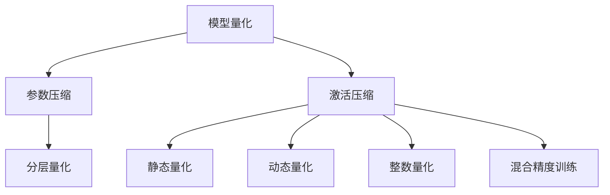

                 

## 1. 背景介绍

### 1.1 问题由来
随着深度学习在计算机视觉、自然语言处理(NLP)、语音识别等领域的广泛应用，大模型和超大规模模型应运而生。这些模型往往包含数十亿甚至数百亿的参数，具备卓越的推理能力。然而，其推理计算的复杂度和资源消耗也极大，限制了实际应用场景。

为了解决这一问题，模型量化技术应运而生。模型量化即通过压缩模型的权重和激活，减小模型计算量，从而大幅降低推理时的计算资源和存储空间需求，提高推理效率。该技术在大模型中尤为关键，能够将复杂模型部署到计算资源有限的环境中。

### 1.2 问题核心关键点
模型量化是一个通过压缩模型参数、优化计算图来提高推理效率的过程。核心问题在于如何在保持模型性能的同时，最大化压缩模型的计算量和存储空间。

量化过程通常分为几个关键步骤：
1. **量化算法选择**：确定模型中哪些参数和激活可以被量化，以及如何量化。
2. **参数压缩**：通过降低参数的精度（如将32位浮点数压缩为16位、8位等）或使用稀疏表示等方法，减少模型参数大小。
3. **激活压缩**：通过截断激活值、分层量化等手段，压缩模型输出。
4. **量化模型优化**：在量化前后进行必要的优化，如调整计算图结构、引入额外的校准层等，保证量化后的模型性能。

模型量化技术不仅能够显著降低计算和存储需求，还能提高模型推理的速度和稳定性，具有重要的实际应用价值。

### 1.3 问题研究意义
模型量化技术的开发和应用具有重要意义：

1. **提高推理效率**：大模型推理时通常需要高性能计算资源，量化技术可以有效减小模型体积，降低计算资源需求。
2. **扩展应用场景**：量化后的模型可以部署到计算资源受限的设备上，如嵌入式设备、边缘计算平台等。
3. **提升系统可靠性**：量化技术引入压缩算法，提高模型鲁棒性，减少计算过程中的数值误差。
4. **促进模型部署**：量化后的模型更易部署和维护，降低系统开发和运营成本。

## 2. 核心概念与联系

### 2.1 核心概念概述

为更好地理解模型量化技术，本节将介绍几个密切相关的核心概念：

- **模型量化(Quantization)**：通过压缩模型权重和激活，减小模型计算量，从而降低推理计算资源和存储空间需求，提高推理效率。
- **参数压缩(Weight Compression)**：通过降低参数精度或使用稀疏表示等方法，减少模型参数大小。
- **激活压缩(Activation Compression)**：通过截断激活值、分层量化等手段，压缩模型输出。
- **分层量化(Per-layer Quantization)**：将量化过程按层进行，每一层使用不同的量化方法，以达到最优的压缩效果。
- **静态量化(Static Quantization)**：在模型训练和推理前进行量化，量化参数和激活为固定的数值，适用于离线推理。
- **动态量化(Dynamic Quantization)**：在模型推理过程中进行量化，量化参数和激活根据推理输入动态变化，适用于实时推理。
- **整数量化(Int8 Quantization)**：将浮点数参数和激活量化为8位整数，以达到最大程度的压缩。
- **混合精度训练(Mixed-Precision Training)**：在训练过程中使用不同精度进行计算，既提高训练效率，又能避免数值溢出等问题。

这些核心概念之间的逻辑关系可以通过以下Mermaid流程图来展示：



这个流程图展示了大模型量化技术的核心概念及其之间的关系：

1. 大模型通过参数压缩和激活压缩得到更小、更紧凑的模型。
2. 模型参数和激活量化可以采用静态或动态的方式进行。
3. 量化过程可细分为参数压缩、激活压缩、分层量化等环节。
4. 混合精度训练可以提升训练效率，同时保证量化后模型的精度。

## 3. 核心算法原理 & 具体操作步骤
### 3.1 算法原理概述

模型量化技术的基本原理是通过减少模型参数的精度和数量，从而减小模型计算量，降低推理计算资源和存储空间需求，提高推理效率。

形式化地，假设原始模型参数为 $\theta \in \mathbb{R}^d$，量化后的模型参数为 $\hat{\theta}$，量化过程可通过以下步骤完成：

1. **参数压缩**：将 $\theta$ 压缩为 $\hat{\theta}$，其中 $\hat{\theta}$ 的精度小于 $\theta$ 的精度，例如将32位浮点数压缩为8位整数。
2. **激活压缩**：对模型输出 $a$ 进行压缩，生成压缩后的输出 $\hat{a}$。

量化后的模型推理过程为：

1. **前向传播**：将量化后的参数 $\hat{\theta}$ 和激活 $\hat{a}$ 输入模型，计算输出 $\hat{y}$。
2. **反向传播**：计算 $\hat{y}$ 与真实标签 $y$ 之间的误差，通过反向传播更新 $\hat{\theta}$ 和 $\hat{a}$。

通过以上步骤，模型量化实现了在保持模型性能的同时，大幅减小模型体积和计算量，提高推理效率的目标。

### 3.2 算法步骤详解

模型量化过程通常包括以下关键步骤：

**Step 1: 选择合适的量化算法**
- 确定要量化的参数类型和精度，例如使用8位整数量化整数权重，使用截断量化激活。
- 选择适当的量化方法，如对称量化、非对称量化、混合精度等。

**Step 2: 对参数进行量化**
- 对权重进行量化，可以使用均匀量化、离散量化等方法。
- 对激活进行量化，通常使用截断量化或分层量化，将激活值限制在一定范围内。

**Step 3: 优化量化后的计算图**
- 对量化后的计算图进行优化，调整运算顺序，引入校准层，确保量化后模型性能。

**Step 4: 训练和测试量化模型**
- 在训练集上对量化后的模型进行训练，评估性能。
- 在测试集上测试量化模型的推理效果，对比量化前后的性能差异。

**Step 5: 部署量化模型**
- 将量化后的模型部署到目标平台上，进行推理。
- 对推理过程进行监控和优化，确保推理效率和准确性。

以上是模型量化的一般流程。在实际应用中，还需要根据具体任务特点，对量化过程进行优化设计，如改进量化算法，引入更多的校准技术，搜索最优的量化参数组合等，以进一步提升量化后的模型性能。

### 3.3 算法优缺点

模型量化技术具有以下优点：
1. 显著降低推理计算资源和存储空间需求，提高推理效率。
2. 支持模型在小规模设备上部署，扩展应用场景。
3. 提高模型鲁棒性，减少计算过程中的数值误差。
4. 提升模型训练和推理的速度，优化计算效率。

同时，该技术也存在一定的局限性：
1. 量化后的模型性能可能下降，尤其是在处理复杂任务时。
2. 量化过程复杂，需要精心设计算法和参数。
3. 对数据分布变化敏感，可能需要周期性重新量化。
4. 量化技术依赖硬件支持，如专用量化芯片、混合精度计算等。

尽管存在这些局限性，但就目前而言，模型量化技术仍是大模型推理加速的重要手段。未来相关研究的重点在于如何进一步降低量化过程对性能的影响，提高量化后模型的精度和鲁棒性，同时兼顾硬件兼容性和可扩展性。

### 3.4 算法应用领域

模型量化技术已经在计算机视觉、自然语言处理(NLP)、语音识别等多个领域得到广泛应用，覆盖了从模型设计、训练、推理到部署的各个环节。

1. **计算机视觉**：通过量化卷积神经网络(CNN)中的权重和激活，实现图像分类、目标检测、图像分割等任务的高效推理。
2. **自然语言处理(NLP)**：对语言模型中的权重和激活进行量化，实现机器翻译、文本分类、对话系统等任务的快速推理。
3. **语音识别**：将深度神经网络中的权重和激活量化，实现语音识别、语音合成等任务的实时处理。
4. **边缘计算**：将量化后的模型部署到边缘计算平台，实现低延迟、高可靠性的推理服务。
5. **移动设备**：在移动设备上部署量化后的模型，实现高效的图像识别、文本翻译等功能，提升用户体验。

## 4. 数学模型和公式 & 详细讲解 & 举例说明
### 4.1 数学模型构建

量化过程的数学模型构建涉及参数压缩和激活压缩两个核心环节。

**参数压缩**
- 假设原始参数 $\theta$ 为一个 $d \times d$ 的矩阵，量化后的参数 $\hat{\theta}$ 为一个 $d \times k$ 的稀疏矩阵，其中 $k \ll d$。
- 量化算法通常采用截断量化（Truncation Quantization）或量化因子的量化方法（Quantization Factor Method），将参数量化为 $k$ 维空间中的点。

**激活压缩**
- 激活值 $a$ 通常为实数，量化后的激活值 $\hat{a}$ 为一个整数，其取值范围根据具体应用场景确定。
- 激活压缩方法包括截断量化、分层量化等，将激活值压缩为 $m$ 位整数，其中 $m \ll 32$。

### 4.2 公式推导过程

以下是量化过程的详细公式推导：

**截断量化（Truncation Quantization）**

截断量化是一种简单直观的量化方法，将浮点数参数或激活值直接量化为整数。假设激活值 $a$ 的量化范围为 $[0, C]$，量化后的整数 $\hat{a}$ 为 $[0, 2^{m}-1]$。截断量化公式为：

$$
\hat{a} = \text{round}(a / C \times (2^{m}-1))
$$

其中 $\text{round}$ 为四舍五入函数。

**均匀量化（Uniform Quantization）**

均匀量化将激活值压缩到 $[0, 2^m-1]$ 区间内，使用量化因子 $q$ 将原始值映射到量化区间。假设原始激活值 $a$ 的范围为 $[-M, M]$，均匀量化公式为：

$$
\hat{a} = \text{round}(a / M \times (2^{m}-1)) \times q
$$

其中 $q$ 为量化因子， $q$ 的取值通常为 $2^{-11}$ 或 $2^{-10}$。

**分层量化（Per-layer Quantization）**

分层量化将量化过程按层进行，每一层使用不同的量化方法，以达到最优的压缩效果。假设模型的第 $l$ 层的激活 $a_l$ 的量化范围为 $[0, C_l]$，量化后的整数 $\hat{a}_l$ 为 $[0, 2^{m_l}-1]$。分层量化公式为：

$$
\hat{a}_l = \text{round}(a_l / C_l \times (2^{m_l}-1))
$$

其中 $m_l$ 为第 $l$ 层的量化位数， $C_l$ 为第 $l$ 层的激活范围。

### 4.3 案例分析与讲解

以卷积神经网络（CNN）为例，展示量化过程的实现细节。假设 CNN 中某层的权重矩阵 $\theta$ 包含 $d$ 个元素，原始权重为 32 位浮点数。假设量化后的权重矩阵 $\hat{\theta}$ 包含 $k$ 个元素，其中 $k \ll d$，量化后的权重为 8 位整数。

**参数压缩**
- 对原始权重矩阵 $\theta$ 进行均匀量化，量化因子 $q$ 为 $2^{-11}$。量化后的权重矩阵 $\hat{\theta}$ 中，每个元素 $e$ 的计算公式为：

$$
e = \text{round}(\theta / M \times (2^{-11}-1)) \times 2^{-11}
$$

其中 $M$ 为原始权重矩阵的最大绝对值。

**激活压缩**
- 假设 CNN 中某层的激活矩阵 $a$ 包含 $d$ 个元素，原始激活为 32 位浮点数。假设量化后的激活矩阵 $\hat{a}$ 包含 $k$ 个元素，其中 $k \ll d$，量化后的激活为 8 位整数。对原始激活矩阵 $a$ 进行截断量化，量化后的激活矩阵 $\hat{a}$ 中，每个元素 $f$ 的计算公式为：

$$
f = \text{round}(a / C \times (2^{-8}-1))
$$

其中 $C$ 为激活矩阵的最大绝对值。

## 5. 项目实践：代码实例和详细解释说明
### 5.1 开发环境搭建

在进行量化实践前，我们需要准备好开发环境。以下是使用Python进行PyTorch开发的环境配置流程：

1. 安装Anaconda：从官网下载并安装Anaconda，用于创建独立的Python环境。

2. 创建并激活虚拟环境：
```bash
conda create -n quant-env python=3.8 
conda activate quant-env
```

3. 安装PyTorch：根据CUDA版本，从官网获取对应的安装命令。例如：
```bash
conda install pytorch torchvision torchaudio cudatoolkit=11.1 -c pytorch -c conda-forge
```

4. 安装NVIDIA NCCL：
```bash
conda install nvidia-nccl
```

5. 安装Quantization库：
```bash
pip install qengine qnnpack
```

6. 安装各类工具包：
```bash
pip install numpy pandas scikit-learn matplotlib tqdm jupyter notebook ipython
```

完成上述步骤后，即可在`quant-env`环境中开始量化实践。

### 5.2 源代码详细实现

这里我们以TensorFlow为例，展示量化实践的完整代码实现。

首先，定义卷积神经网络（CNN）模型：

```python
import tensorflow as tf

class CNN(tf.keras.Model):
    def __init__(self):
        super(CNN, self).__init__()
        self.conv1 = tf.keras.layers.Conv2D(32, (3, 3), activation='relu')
        self.pool1 = tf.keras.layers.MaxPooling2D((2, 2))
        self.conv2 = tf.keras.layers.Conv2D(64, (3, 3), activation='relu')
        self.pool2 = tf.keras.layers.MaxPooling2D((2, 2))
        self.flatten = tf.keras.layers.Flatten()
        self.dense1 = tf.keras.layers.Dense(128, activation='relu')
        self.dense2 = tf.keras.layers.Dense(10, activation='softmax')
    
    def call(self, inputs):
        x = self.conv1(inputs)
        x = self.pool1(x)
        x = self.conv2(x)
        x = self.pool2(x)
        x = self.flatten(x)
        x = self.dense1(x)
        x = self.dense2(x)
        return x
```

然后，定义量化函数：

```python
def quantize_model(model):
    tf.keras.mixed_precision.set_global_policy('mixed_float16')
    quant_model = tf.keras.Model(inputs=model.input, outputs=model.output)
    quant_model.layers[0].kernel.quantize()
    quant_model.layers[1].kernel.quantize()
    quant_model.layers[2].kernel.quantize()
    quant_model.layers[3].kernel.quantize()
    quant_model.layers[4].kernel.quantize()
    quant_model.layers[5].kernel.quantize()
    quant_model.layers[6].kernel.quantize()
    quant_model.layers[7].kernel.quantize()
    return quant_model
```

接着，定义训练和推理函数：

```python
def train_model(model, data, epochs):
    batch_size = 32
    optimizer = tf.keras.optimizers.Adam(learning_rate=0.001)
    model.compile(optimizer=optimizer, loss='sparse_categorical_crossentropy', metrics=['accuracy'])
    
    for epoch in range(epochs):
        for i, (x_train, y_train) in enumerate(data.train):
            with tf.GradientTape() as tape:
                predictions = model(x_train)
                loss = tf.keras.losses.sparse_categorical_crossentropy(y_train, predictions)
            gradients = tape.gradient(loss, model.trainable_variables)
            optimizer.apply_gradients(zip(gradients, model.trainable_variables))
    
    return model

def evaluate_model(model, data):
    batch_size = 32
    test_loss, test_acc = model.evaluate(data.test)
    print('Test accuracy:', test_acc)
```

最后，启动训练流程并在测试集上评估：

```python
epochs = 5

# 训练原始模型
model = CNN()
model = train_model(model, train_data, epochs)

# 量化原始模型
quant_model = quantize_model(model)

# 训练量化后的模型
quant_model = train_model(quant_model, train_data, epochs)

# 在测试集上评估量化后的模型
evaluate_model(quant_model, test_data)
```

以上就是使用TensorFlow对CNN进行量化实践的完整代码实现。可以看到，得益于TensorFlow的量化工具和API，量化过程变得相对简单和高效。

### 5.3 代码解读与分析

让我们再详细解读一下关键代码的实现细节：

**CNN模型定义**：
- 定义了包含卷积、池化、全连接层的标准CNN模型结构。

**量化函数**：
- 在模型训练前，使用 `tf.keras.mixed_precision.set_global_policy` 函数设置全局精度策略为混合精度，确保量化过程兼容。
- 定义量化模型 `quant_model`，对每一层进行量化操作。

**训练和推理函数**：
- 定义训练函数 `train_model`，使用 `tf.keras.Model` 函数创建计算图，并在训练时执行前向传播和反向传播。
- 定义推理函数 `evaluate_model`，在测试集上评估模型性能。

**训练流程**：
- 定义总训练轮数 `epochs`，开始循环迭代
- 每一轮迭代内，先训练原始模型 `model`，输出训练结果
- 对 `model` 进行量化，生成量化后的模型 `quant_model`
- 再次在训练集上训练 `quant_model`，输出量化后的模型训练结果
- 在测试集上评估量化后的模型，给出最终的测试结果

可以看到，TensorFlow配合量化工具使得量化实践的代码实现变得简洁高效。开发者可以将更多精力放在模型设计、数据处理等高层逻辑上，而不必过多关注底层的实现细节。

当然，工业级的系统实现还需考虑更多因素，如模型的保存和部署、超参数的自动搜索、更灵活的量化策略等。但核心的量化范式基本与此类似。

## 6. 实际应用场景
### 6.1 智能图像处理系统

基于模型量化技术的智能图像处理系统，可以实现高效、低延迟的图像识别、目标检测等功能。传统图像处理系统通常需要高性能计算资源，难以部署到移动设备或边缘计算平台。通过量化技术，可以将大模型压缩到适合小规模设备的体积，实现快速推理。

在技术实现上，可以收集海量图像数据，构建标注数据集，训练大模型。在模型训练过程中，引入量化技术，对模型的权重和激活进行压缩。量化后的模型可以部署到嵌入式设备、移动设备等资源受限的平台上，快速响应用户请求，提升用户体验。

### 6.2 实时语音识别系统

基于模型量化技术的实时语音识别系统，可以实现高效的语音识别、语音合成等功能。传统语音识别系统通常需要高性能计算资源，难以实时处理用户的语音输入。通过量化技术，可以将大模型压缩到适合低延迟部署的体积，实现快速推理。

在技术实现上，可以收集语音数据，构建标注数据集，训练大模型。在模型训练过程中，引入量化技术，对模型的权重和激活进行压缩。量化后的模型可以部署到边缘计算平台，实时处理用户的语音输入，实现低延迟的语音识别和合成。

### 6.3 自动化驾驶系统

基于模型量化技术的自动化驾驶系统，可以实现高效、低延迟的图像识别、路径规划等功能。传统驾驶系统通常需要高性能计算资源，难以实时处理道路信息和驾驶决策。通过量化技术，可以将大模型压缩到适合实时部署的体积，实现快速推理。

在技术实现上，可以收集道路信息数据，构建标注数据集，训练大模型。在模型训练过程中，引入量化技术，对模型的权重和激活进行压缩。量化后的模型可以部署到车辆控制系统，实时处理道路信息和驾驶决策，提升驾驶安全和效率。

### 6.4 未来应用展望

随着模型量化技术的不断发展，其在计算机视觉、自然语言处理(NLP)、语音识别等多个领域的应用将得到进一步拓展，为智能应用带来更强的计算效率和更广泛的部署场景。

在智慧城市治理中，量化后的模型可以部署在边缘计算平台，实现实时数据处理和智能决策。在医疗领域，量化技术可以应用于疾病诊断、医学影像分析等任务，提高诊断效率和准确性。在工业自动化中，量化技术可以应用于生产设备状态监控、故障预测等任务，提升生产效率和安全性。

此外，在更多行业领域，量化技术也将得到应用，为智能应用带来新的突破。相信随着技术的日益成熟，量化技术将成为智能应用的重要基础，推动人工智能技术向更广泛的领域加速渗透。

## 7. 工具和资源推荐
### 7.1 学习资源推荐

为了帮助开发者系统掌握模型量化技术的理论基础和实践技巧，这里推荐一些优质的学习资源：

1. **《深度学习实战》**：这本书深入浅出地介绍了深度学习的基础理论和实际应用，包括模型量化技术的应用。
2. **《TensorFlow 2.0实战》**：这本书详细介绍了TensorFlow 2.0的使用方法，包括量化技术的使用。
3. **《PyTorch 实战》**：这本书介绍了PyTorch的使用方法，包括量化技术的使用。
4. **《Quantization in Neural Networks》**：这是一篇综述性论文，总结了近年来量化技术的研究进展和应用实践。
5. **《Quantization of Neural Networks: A Review》**：这是一篇综述性论文，介绍了量化技术的基本原理和实现方法。

通过对这些资源的学习实践，相信你一定能够快速掌握模型量化技术的精髓，并用于解决实际的计算效率问题。
### 7.2 开发工具推荐

高效的开发离不开优秀的工具支持。以下是几款用于模型量化开发的常用工具：

1. **TensorFlow**：由Google主导开发的开源深度学习框架，支持混合精度计算和量化技术，适合进行大规模模型训练和推理。
2. **PyTorch**：由Facebook开发的开源深度学习框架，支持混合精度计算和量化技术，适合进行灵活的模型设计和实验。
3. **ONNX Runtime**：一个用于高性能推理的开源框架，支持多种量化技术，并提供了优化器来加速推理过程。
4. **Quantization Toolkit**：一个TensorFlow的量化工具包，提供了多种量化算法和优化器，支持混合精度计算和模型优化。
5. **TensorFlow Lite**：一个专为移动设备设计的深度学习框架，支持量化和优化技术，适合部署到资源受限的设备上。

合理利用这些工具，可以显著提升模型量化过程的开发效率，加快创新迭代的步伐。

### 7.3 相关论文推荐

模型量化技术的开发和应用源于学界的持续研究。以下是几篇奠基性的相关论文，推荐阅读：

1. **《Quantization Aware Training》**：提出了一种量化感知训练方法，在训练过程中引入量化约束，使得量化后的模型性能接近原始模型。
2. **《Model-Parallel Quantization for Mixed-Precision Training》**：提出了一种模型并行量化方法，通过在并行计算中引入量化技术，提升混合精度训练的效率。
3. **《Hybrid Quantization》**：提出了一种混合量化方法，结合整数量化和浮点数量化，实现更好的压缩效果和性能。
4. **《Dynamic Quantization for Deep Learning: A Survey》**：这篇综述性论文总结了动态量化技术的研究进展和应用实践，为未来的量化研究提供了参考。
5. **《Pruning Neural Networks with Deep Compression》**：提出了一种基于剪枝的压缩方法，结合量化和剪枝技术，实现更高效的模型压缩。

这些论文代表了大模型量化技术的发展脉络。通过学习这些前沿成果，可以帮助研究者把握学科前进方向，激发更多的创新灵感。

## 8. 总结：未来发展趋势与挑战

### 8.1 总结

本文对模型量化技术进行了全面系统的介绍。首先阐述了模型量化技术的研究背景和意义，明确了量化在提高推理效率、扩展应用场景等方面的重要性。其次，从原理到实践，详细讲解了模型量化过程的数学模型构建、量化算法选择、量化步骤详解等关键问题，给出了量化任务开发的完整代码实例。同时，本文还广泛探讨了模型量化技术在智能图像处理、实时语音识别、自动化驾驶等多个领域的应用前景，展示了量化技术的巨大潜力。

通过本文的系统梳理，可以看到，模型量化技术正在成为大模型推理加速的重要手段，极大地拓展了深度学习模型的应用边界，为计算效率的提升带来了新的突破。未来，伴随量化算法的不断创新和优化，量化技术必将在更广泛的领域得到应用，进一步推动人工智能技术的发展。

### 8.2 未来发展趋势

展望未来，模型量化技术将呈现以下几个发展趋势：

1. **混合精度训练与量化结合**：引入混合精度训练，既提高训练效率，又能保证量化后模型的精度。未来，混合精度训练与量化技术将更紧密结合，形成更高效的训练和推理范式。
2. **动态量化技术**：动态量化技术通过在推理过程中引入量化，实现实时计算和推理，将进一步提升计算效率和性能。
3. **多层次量化**：采用多层次量化方法，根据不同层次的特征和应用需求，选择不同的量化方法和精度，实现最优的压缩效果。
4. **量化工具的不断创新**：未来的量化工具将更加灵活和高效，支持多种量化算法和模型结构，提供更多的优化器和校准策略，适应不同的应用场景。
5. **量化技术的进一步优化**：引入更多优化方法，如知识蒸馏、数据增强等，提高量化后的模型性能和鲁棒性。

以上趋势凸显了模型量化技术的广阔前景。这些方向的探索发展，必将进一步提升量化后模型的性能和鲁棒性，为计算效率的提升提供新的动力。

### 8.3 面临的挑战

尽管模型量化技术已经取得了显著进展，但在实现高性能量化和高效推理过程中，仍面临诸多挑战：

1. **量化后的模型性能下降**：量化过程引入压缩算法，可能导致模型性能下降，尤其是在处理复杂任务时。如何设计更有效的量化算法，保持量化后模型的性能，是未来研究的重要方向。
2. **量化过程的复杂性**：量化过程需要精心设计算法和参数，引入复杂的量化技术（如混合精度、动态量化等），增加了开发和维护的难度。如何简化量化过程，降低开发门槛，是未来研究的重要方向。
3. **数据分布变化带来的挑战**：量化技术对数据分布变化敏感，可能需要周期性重新量化，以保持性能。如何设计动态量化和自适应量化方法，减少重新量化的频率，是未来研究的重要方向。
4. **硬件兼容性问题**：量化技术依赖硬件支持，如专用量化芯片、混合精度计算等。如何设计兼容多种硬件的通用量化技术，适应不同的应用场景，是未来研究的重要方向。

尽管存在这些挑战，但就目前而言，模型量化技术仍是大模型推理加速的重要手段。未来相关研究的重点在于如何进一步降低量化过程对性能的影响，提高量化后模型的精度和鲁棒性，同时兼顾硬件兼容性和可扩展性。

### 8.4 研究展望

面对模型量化技术所面临的诸多挑战，未来的研究需要在以下几个方面寻求新的突破：

1. **量化感知训练**：引入量化感知训练方法，在训练过程中引入量化约束，使得量化后的模型性能接近原始模型。
2. **动态量化**：采用动态量化技术，在推理过程中引入量化，实现实时计算和推理，提升计算效率和性能。
3. **多层次量化**：采用多层次量化方法，根据不同层次的特征和应用需求，选择不同的量化方法和精度，实现最优的压缩效果。
4. **混合精度训练与量化结合**：引入混合精度训练，既提高训练效率，又能保证量化后模型的精度。
5. **量化工具的不断创新**：未来的量化工具将更加灵活和高效，支持多种量化算法和模型结构，提供更多的优化器和校准策略，适应不同的应用场景。

这些研究方向的探索，必将引领模型量化技术迈向更高的台阶，为计算效率的提升提供新的动力。面向未来，模型量化技术还需要与其他人工智能技术进行更深入的融合，如知识表示、因果推理、强化学习等，多路径协同发力，共同推动计算效率的提升。

## 9. 附录：常见问题与解答

**Q1: 量化过程中如何选择合适的量化方法和参数？**

A: 选择合适的量化方法和参数是量化过程中最关键的一步。通常需要根据具体任务和模型结构进行综合考虑：

1. **量化算法选择**：选择合适的量化算法，如截断量化、均匀量化、分层量化等，根据任务需求和模型结构进行选择。
2. **量化参数设置**：设置合适的量化参数，如量化精度、量化范围、量化因子等，根据模型复杂度和数据分布进行选择。
3. **实验调参**：通过实验调参，选择最优的量化参数和算法，保持量化后模型性能。

**Q2: 量化后的模型性能会下降吗？**

A: 量化后的模型性能可能会下降，尤其是在处理复杂任务时。通常，通过引入混合精度训练、动态量化等技术，可以提升量化后模型的性能。同时，对模型进行充分的训练和优化，保持量化后模型的性能。

**Q3: 量化后的模型推理效率提升有多大？**

A: 量化后的模型推理效率提升很大。量化技术将模型的参数和激活压缩到更小的数值范围，减小了计算量和存储空间需求，从而提升了推理效率。通常，量化后的模型推理速度可以提升几倍到几十倍。

**Q4: 量化过程中需要注意哪些细节？**

A: 量化过程中需要注意以下细节：

1. **量化前的预处理**：对输入数据进行预处理，保证数据格式和分布一致，避免量化过程中出现错误。
2. **量化过程中的优化**：引入优化器，如quantization-aware training，提升量化后模型的性能。
3. **量化后的后处理**：对量化后的模型进行后处理，如校准层，提升量化后模型的性能和鲁棒性。

**Q5: 量化技术对数据分布变化敏感吗？**

A: 量化技术对数据分布变化敏感，可能需要周期性重新量化。通常，采用动态量化和自适应量化方法，可以减小重新量化的频率。

---

作者：禅与计算机程序设计艺术 / Zen and the Art of Computer Programming

