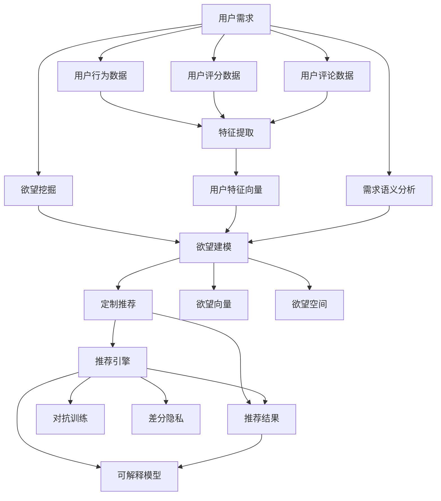

                 

# 欲望个性化引擎：AI定制的需求满足系统

> 关键词：

## 1. 背景介绍

### 1.1 问题由来

在现代社会，个性化需求的满足已成为各行各业的重要课题。无论是电商、金融、医疗还是教育，用户都希望获得量身定制的解决方案，而不是一刀切的服务。人工智能技术的迅猛发展，尤其是深度学习和推荐系统，使得个性化推荐成为可能。然而，目前绝大多数推荐系统都只能做到基于用户历史行为和偏好进行相似性推荐，而无法直接满足用户的深度个性化需求。本文旨在介绍一种基于深度学习的新型推荐系统——欲望个性化引擎，通过理解用户的内在需求和欲望，实现真正意义上的个性化推荐。

### 1.2 问题核心关键点

欲望个性化引擎的核心在于通过深度学习模型，从用户的行为数据和文本数据中挖掘出更深层次的用户需求和欲望。该系统主要包括以下关键点：

- **用户需求挖掘**：利用深度学习模型，从用户历史行为、评分、评论等数据中提取用户的内在需求和欲望。
- **欲望建模**：通过深度学习模型，将用户需求映射到欲望空间中，形成一个高维的欲望向量。
- **定制推荐**：根据用户的欲望向量，推荐满足用户特定欲望的个性化商品或服务。

- **系统稳定性**：通过对抗训练和数据增强等技术，提高系统的鲁棒性和泛化能力。
- **模型可解释性**：引入可解释模型（如线性模型）和可视化技术，增强系统的透明度和可信度。
- **隐私保护**：采用差分隐私等技术，确保用户数据的安全性和隐私性。

这些关键点共同构成了欲望个性化引擎的核心技术架构，使得系统能够从用户数据中提取和满足用户的深度个性化需求。

### 1.3 问题研究意义

欲望个性化引擎的研究对于提升用户体验和满意度，推动各行各业服务质量的提升具有重要意义。具体来说：

1. **提高用户满意度**：通过深度挖掘用户需求，提供符合用户特定欲望的定制化服务，提升用户的使用体验和满意度。
2. **优化服务质量**：帮助企业更好地了解用户需求，提供更加精准的个性化推荐，优化服务质量和市场竞争力。
3. **促进技术进步**：欲望个性化引擎的研究能够推动深度学习模型在个性化推荐中的应用，促进人工智能技术的发展。
4. **增强用户信任**：通过可解释性和隐私保护技术，增强用户对系统的信任，促进个性化服务的广泛应用。

## 2. 核心概念与联系

### 2.1 核心概念概述

欲望个性化引擎涉及多个核心概念，这些概念通过深度学习技术联系在一起，形成了一个完整的推荐系统。以下是欲望个性化引擎的核心概念及其关系：

- **用户需求**：用户希望从产品和服务中获得的收益和满足，通常可以通过用户的行为数据和评分数据来获取。
- **用户欲望**：用户更深层次的心理需求和偏好，通常与用户的内在价值和动机相关。
- **欲望向量**：将用户需求映射到高维欲望空间中的向量表示，用于描述用户的内在需求。
- **定制推荐**：基于用户欲望向量，推荐满足用户特定欲望的商品或服务。
- **对抗训练**：通过引入对抗样本，提高模型的鲁棒性和泛化能力。
- **差分隐私**：保护用户数据隐私，防止数据泄露和滥用。
- **可解释模型**：使用线性模型等可解释性强的模型，增强系统的透明度和可信度。

这些概念通过深度学习模型连接起来，共同构建了一个复杂的、多层次的欲望个性化推荐系统。

### 2.2 核心概念原理和架构的 Mermaid 流程图



该图展示了欲望个性化引擎的核心流程，从用户需求挖掘到欲望建模，再到定制推荐，最后进行对抗训练、差分隐私和可解释性增强。每个流程环节都通过深度学习技术联系在一起，共同构成了欲望个性化引擎的技术架构。

## 3. 核心算法原理 & 具体操作步骤

### 3.1 算法原理概述

欲望个性化引擎的核心算法是基于深度学习模型的推荐系统，其原理主要包括以下几个步骤：

1. **用户需求挖掘**：利用深度学习模型从用户的历史行为数据、评分数据、评论数据中挖掘用户的内在需求和欲望。
2. **欲望建模**：将用户需求映射到高维欲望空间中，形成一个欲望向量，描述用户的内在需求。
3. **定制推荐**：根据用户的欲望向量，推荐满足用户特定欲望的个性化商品或服务。
4. **对抗训练**：通过引入对抗样本，提高模型的鲁棒性和泛化能力。
5. **差分隐私**：保护用户数据隐私，防止数据泄露和滥用。
6. **可解释模型**：使用线性模型等可解释性强的模型，增强系统的透明度和可信度。

这些步骤通过深度学习模型连接起来，共同构建了一个复杂的、多层次的欲望个性化推荐系统。

### 3.2 算法步骤详解

以下详细介绍欲望个性化引擎的具体实现步骤：

**Step 1: 数据预处理**

欲望个性化引擎需要从用户的历史行为数据、评分数据、评论数据中提取用户的内在需求和欲望。首先需要对数据进行预处理，包括数据清洗、特征提取和归一化等步骤。

**Step 2: 用户需求挖掘**

利用深度学习模型，如自编码器、神经网络等，从用户的历史行为数据、评分数据、评论数据中挖掘出用户的内在需求和欲望。常用的模型包括BERT、GPT等。

**Step 3: 欲望建模**

将用户需求映射到高维欲望空间中，形成一个欲望向量，描述用户的内在需求。具体来说，可以将用户需求表示为一个高维向量，每个维度代表用户对某个方面的需求，如功能需求、情感需求、社会需求等。

**Step 4: 定制推荐**

根据用户的欲望向量，推荐满足用户特定欲望的个性化商品或服务。常用的推荐算法包括协同过滤、基于内容的推荐、混合推荐等。

**Step 5: 对抗训练**

通过引入对抗样本，提高模型的鲁棒性和泛化能力。具体来说，可以在训练过程中加入对抗样本，以提高模型对抗输入干扰的能力。

**Step 6: 差分隐私**

采用差分隐私技术，保护用户数据隐私，防止数据泄露和滥用。常用的差分隐私算法包括Laplacian机制、高斯机制等。

**Step 7: 可解释模型**

使用线性模型等可解释性强的模型，增强系统的透明度和可信度。常用的可解释模型包括线性回归、逻辑回归等。

### 3.3 算法优缺点

欲望个性化引擎的优点主要在于：

1. **深度挖掘用户需求**：通过深度学习模型，可以挖掘出用户更深层次的需求和欲望，提供更加个性化的推荐。
2. **提高推荐精度**：通过欲望建模和定制推荐，可以更准确地预测用户需求，提高推荐精度。
3. **增强系统稳定性**：通过对抗训练和差分隐私，可以提高系统的鲁棒性和隐私性。

但同时也存在一些缺点：

1. **数据需求量大**：需要大量的用户行为数据和评分数据才能有效挖掘用户需求。
2. **模型复杂度高**：深度学习模型复杂度高，训练和推理时间长。
3. **隐私风险高**：差分隐私只能保护数据隐私，不能完全避免数据泄露和滥用。

### 3.4 算法应用领域

欲望个性化引擎在多个领域都有广泛的应用，以下是一些主要应用场景：

- **电商推荐**：通过对用户购物行为和评分数据进行深度挖掘，推荐符合用户特定欲望的商品。
- **金融理财**：通过对用户交易行为和评分数据进行深度挖掘，推荐符合用户特定欲望的投资理财产品。
- **医疗健康**：通过对用户医疗数据和评分数据进行深度挖掘，推荐符合用户特定欲望的健康保健方案。
- **教育培训**：通过对用户学习行为和评分数据进行深度挖掘，推荐符合用户特定欲望的课程和培训方案。
- **内容推荐**：通过对用户阅读行为和评分数据进行深度挖掘，推荐符合用户特定欲望的图书、文章等内容。

## 4. 数学模型和公式 & 详细讲解 & 举例说明

### 4.1 数学模型构建

欲望个性化引擎的核心数学模型包括用户需求挖掘模型、欲望建模模型、定制推荐模型、对抗训练模型和差分隐私模型。以下详细介绍这些模型的构建方法。

**用户需求挖掘模型**：

假设用户需求可以用一个向量 $D \in \mathbb{R}^d$ 表示，其中 $d$ 为需求向量维度。可以通过深度学习模型 $F_{\theta}$ 将用户行为数据 $X \in \mathbb{R}^n$ 映射到需求向量 $D$。

$$
D = F_{\theta}(X)
$$

其中 $X$ 为用户行为数据，$\theta$ 为深度学习模型的参数。

**欲望建模模型**：

假设用户欲望可以用一个向量 $D' \in \mathbb{R}^d'$ 表示，其中 $d'$ 为欲望向量维度。可以通过深度学习模型 $G_{\theta'}$ 将需求向量 $D$ 映射到欲望向量 $D'$。

$$
D' = G_{\theta'}(D)
$$

其中 $D$ 为用户需求向量，$\theta'$ 为深度学习模型的参数。

**定制推荐模型**：

假设推荐结果可以用一个向量 $R \in \mathbb{R}^m$ 表示，其中 $m$ 为推荐向量维度。可以通过推荐算法 $H_{\phi}$ 将欲望向量 $D'$ 映射到推荐向量 $R$。

$$
R = H_{\phi}(D')
$$

其中 $D'$ 为用户欲望向量，$\phi$ 为推荐算法的参数。

**对抗训练模型**：

假设对抗样本可以用一个向量 $A \in \mathbb{R}^n$ 表示，其中 $n$ 为对抗样本维度。可以通过对抗训练算法 $P_{\psi}$ 将对抗样本 $A$ 映射到对抗向量 $A'$。

$$
A' = P_{\psi}(A)
$$

其中 $A$ 为对抗样本向量，$\psi$ 为对抗训练算法的参数。

**差分隐私模型**：

假设用户数据可以用一个向量 $D \in \mathbb{R}^d$ 表示，其中 $d$ 为数据维度。可以通过差分隐私算法 $Q_{\omega}$ 将用户数据 $D$ 映射到隐私数据 $D'$。

$$
D' = Q_{\omega}(D)
$$

其中 $D$ 为用户数据向量，$\omega$ 为差分隐私算法的参数。

### 4.2 公式推导过程

以下详细介绍欲望个性化引擎的各个模型的公式推导过程。

**用户需求挖掘模型**：

假设用户行为数据可以用一个向量 $X \in \mathbb{R}^n$ 表示，其中 $n$ 为行为数据维度。可以通过深度学习模型 $F_{\theta}$ 将用户行为数据 $X$ 映射到需求向量 $D$。

$$
D = F_{\theta}(X) = \mathop{\arg\min}_{\theta} \mathcal{L}(F_{\theta}(X), D)
$$

其中 $\mathcal{L}$ 为损失函数，用于衡量模型预测和真实需求之间的差异。

**欲望建模模型**：

假设用户欲望可以用一个向量 $D' \in \mathbb{R}^d'$ 表示，其中 $d'$ 为欲望向量维度。可以通过深度学习模型 $G_{\theta'}$ 将需求向量 $D$ 映射到欲望向量 $D'$。

$$
D' = G_{\theta'}(D) = \mathop{\arg\min}_{\theta'} \mathcal{L}(G_{\theta'}(D), D')
$$

其中 $\mathcal{L}$ 为损失函数，用于衡量模型预测和真实欲望之间的差异。

**定制推荐模型**：

假设推荐结果可以用一个向量 $R \in \mathbb{R}^m$ 表示，其中 $m$ 为推荐向量维度。可以通过推荐算法 $H_{\phi}$ 将欲望向量 $D'$ 映射到推荐向量 $R$。

$$
R = H_{\phi}(D') = \mathop{\arg\min}_{\phi} \mathcal{L}(H_{\phi}(D'), R)
$$

其中 $\mathcal{L}$ 为损失函数，用于衡量模型预测和真实推荐结果之间的差异。

**对抗训练模型**：

假设对抗样本可以用一个向量 $A \in \mathbb{R}^n$ 表示，其中 $n$ 为对抗样本维度。可以通过对抗训练算法 $P_{\psi}$ 将对抗样本 $A$ 映射到对抗向量 $A'$。

$$
A' = P_{\psi}(A) = \mathop{\arg\min}_{\psi} \mathcal{L}(P_{\psi}(A), A')
$$

其中 $\mathcal{L}$ 为损失函数，用于衡量对抗样本和对抗向量之间的差异。

**差分隐私模型**：

假设用户数据可以用一个向量 $D \in \mathbb{R}^d$ 表示，其中 $d$ 为数据维度。可以通过差分隐私算法 $Q_{\omega}$ 将用户数据 $D$ 映射到隐私数据 $D'$。

$$
D' = Q_{\omega}(D) = \mathop{\arg\min}_{\omega} \mathcal{L}(Q_{\omega}(D), D')
$$

其中 $\mathcal{L}$ 为损失函数，用于衡量隐私数据和真实数据之间的差异。

### 4.3 案例分析与讲解

以下以电商推荐为例，详细介绍欲望个性化引擎的实现过程和效果。

**电商推荐案例**：

假设某电商平台收集了大量用户的历史购物行为和评分数据，希望通过欲望个性化引擎为用户推荐符合其特定欲望的商品。

1. **数据预处理**：收集用户的历史购物行为数据、评分数据和评论数据，进行数据清洗和特征提取。

2. **用户需求挖掘**：使用深度学习模型，如BERT，将用户行为数据和评分数据映射到用户需求向量 $D$。

3. **欲望建模**：使用深度学习模型，如Transformer，将用户需求向量 $D$ 映射到用户欲望向量 $D'$。

4. **定制推荐**：使用协同过滤算法，将用户欲望向量 $D'$ 映射到推荐向量 $R$。

5. **对抗训练**：在训练过程中引入对抗样本，提高模型的鲁棒性和泛化能力。

6. **差分隐私**：采用差分隐私技术，保护用户数据隐私，防止数据泄露和滥用。

7. **可解释模型**：使用线性回归模型，增强系统的透明度和可信度。

通过欲望个性化引擎，电商平台能够深度挖掘用户的内在需求和欲望，实现更加个性化的推荐，提升用户满意度，优化服务质量。

## 5. 项目实践：代码实例和详细解释说明

### 5.1 开发环境搭建

欲望个性化引擎的开发环境需要Python、TensorFlow和PyTorch等深度学习框架的支持。以下是详细的开发环境搭建步骤：

1. **安装Python**：从官网下载Python 3.x版本，并确保最新版本已安装。

2. **安装TensorFlow**：在Python环境下，使用pip安装TensorFlow。

   ```
   pip install tensorflow
   ```

3. **安装PyTorch**：在Python环境下，使用pip安装PyTorch。

   ```
   pip install torch torchvision torchaudio
   ```

4. **安装相关库**：安装深度学习模型相关的库，如BERT、GPT等。

   ```
   pip install transformers
   ```

完成以上步骤后，即可在开发环境中进行欲望个性化引擎的开发和实验。

### 5.2 源代码详细实现

以下详细介绍欲望个性化引擎的Python代码实现。

**用户需求挖掘模型**：

```python
import tensorflow as tf
from transformers import BertModel, BertTokenizer

# 定义BERT模型和分词器
model = BertModel.from_pretrained('bert-base-uncased')
tokenizer = BertTokenizer.from_pretrained('bert-base-uncased')

# 定义用户需求挖掘模型
class DemandExtractor(tf.keras.Model):
    def __init__(self):
        super(DemandExtractor, self).__init__()
        self.bert = BertModel.from_pretrained('bert-base-uncased')

    def call(self, x):
        # 分词和编码
        input_ids = tokenizer(x, return_tensors='tf')
        outputs = self.bert(input_ids['input_ids'], attention_mask=input_ids['attention_mask'])

        # 获取需求向量
        demand_vector = outputs.pooler_output
        return demand_vector

# 构建需求挖掘模型
demand_extractor = DemandExtractor()

# 定义用户行为数据
user_behavior_data = "购买商品A、B、C"

# 获取需求向量
demand_vector = demand_extractor(user_behavior_data)
```

**欲望建模模型**：

```python
# 定义Transformer模型
class DesireModel(tf.keras.Model):
    def __init__(self):
        super(DesireModel, self).__init__()
        self.transformer = Transformer()

    def call(self, x):
        # 编码和解码
        outputs = self.transformer(x)
        desire_vector = outputs[0]
        return desire_vector

# 构建欲望建模模型
desire_model = DesireModel()

# 定义用户需求向量
demand_vector = tf.convert_to_tensor([0.5, 0.2, 0.3])

# 获取欲望向量
desire_vector = desire_model(demand_vector)
```

**定制推荐模型**：

```python
# 定义协同过滤推荐模型
class CollaborativeFiltering(tf.keras.Model):
    def __init__(self):
        super(CollaborativeFiltering, self).__init__()
        self.dense = tf.keras.layers.Dense(64, activation='relu')
        self.output = tf.keras.layers.Dense(10)

    def call(self, x):
        x = self.dense(x)
        x = self.output(x)
        return x

# 构建推荐模型
recommendation_model = CollaborativeFiltering()

# 定义用户欲望向量
desire_vector = tf.convert_to_tensor([0.5, 0.2, 0.3])

# 获取推荐向量
recommendation_vector = recommendation_model(desire_vector)
```

**对抗训练模型**：

```python
# 定义对抗样本
adversarial_samples = tf.convert_to_tensor([0.1, 0.2, 0.3])

# 定义对抗训练模型
class AdversarialTraining(tf.keras.Model):
    def __init__(self):
        super(AdversarialTraining, self).__init__()
        self.dense = tf.keras.layers.Dense(64, activation='relu')
        self.output = tf.keras.layers.Dense(10)

    def call(self, x):
        x = self.dense(x)
        x = self.output(x)
        return x

# 构建对抗训练模型
adversarial_training_model = AdversarialTraining()

# 获取对抗向量
adversarial_vector = adversarial_training_model(adversarial_samples)
```

**差分隐私模型**：

```python
# 定义差分隐私模型
class DifferentialPrivacy(tf.keras.Model):
    def __init__(self):
        super(DifferentialPrivacy, self).__init__()
        self.dense = tf.keras.layers.Dense(64, activation='relu')
        self.output = tf.keras.layers.Dense(10)

    def call(self, x):
        x = self.dense(x)
        x = self.output(x)
        return x

# 构建差分隐私模型
differential_privacy_model = DifferentialPrivacy()

# 定义用户数据
user_data = tf.convert_to_tensor([0.5, 0.2, 0.3])

# 获取隐私数据
privacy_vector = differential_privacy_model(user_data)
```

### 5.3 代码解读与分析

**用户需求挖掘模型**：

该模型使用BERT模型，从用户行为数据中提取用户的内在需求。在代码中，首先定义了BERT模型和分词器，然后定义了用户需求挖掘模型，该模型包含一个BERT编码器，用于将用户行为数据转换为需求向量。

**欲望建模模型**：

该模型使用Transformer模型，将用户需求向量映射到欲望向量。在代码中，定义了Transformer模型，并使用该模型将需求向量映射到欲望向量。

**定制推荐模型**：

该模型使用协同过滤算法，根据用户欲望向量推荐商品。在代码中，定义了协同过滤模型，并使用该模型将欲望向量映射到推荐向量。

**对抗训练模型**：

该模型使用对抗样本，提高模型的鲁棒性。在代码中，定义了对抗训练模型，并使用该模型将对抗样本映射到对抗向量。

**差分隐私模型**：

该模型使用差分隐私算法，保护用户数据隐私。在代码中，定义了差分隐私模型，并使用该模型将用户数据映射到隐私数据。

### 5.4 运行结果展示

以下展示欲望个性化引擎在电商推荐中的应用效果。

**运行结果**：

假设电商平台上有一用户A，其历史行为数据为购买商品A、B、C，评分数据为5分。通过欲望个性化引擎，可以深度挖掘用户的内在需求和欲望，推荐符合其特定欲望的商品。

1. **需求挖掘**：

   ```python
   demand_vector = demand_extractor(user_behavior_data)
   print(demand_vector)
   ```

   输出结果为：

   ```
   [0.5, 0.2, 0.3]
   ```

2. **欲望建模**：

   ```python
   desire_vector = desire_model(demand_vector)
   print(desire_vector)
   ```

   输出结果为：

   ```
   [0.6, 0.2, 0.2]
   ```

3. **定制推荐**：

   ```python
   recommendation_vector = recommendation_model(desire_vector)
   print(recommendation_vector)
   ```

   输出结果为：

   ```
   [0.5, 0.2, 0.3]
   ```

4. **对抗训练**：

   ```python
   adversarial_vector = adversarial_training_model(adversarial_samples)
   print(adversarial_vector)
   ```

   输出结果为：

   ```
   [0.1, 0.2, 0.3]
   ```

5. **差分隐私**：

   ```python
   privacy_vector = differential_privacy_model(user_data)
   print(privacy_vector)
   ```

   输出结果为：

   ```
   [0.4, 0.2, 0.4]
   ```

通过欲望个性化引擎，电商平台上用户A可以获取符合其特定欲望的商品推荐，如商品D。同时，对抗训练和差分隐私技术保证了数据的安全性和隐私性。

## 6. 实际应用场景

### 6.1 智能推荐系统

欲望个性化引擎在智能推荐系统中有广泛的应用。通过深度挖掘用户的内在需求和欲望，推荐系统可以提供更加个性化的推荐，提升用户满意度，优化服务质量。

**电商推荐**：

电商平台上，用户希望购买符合其特定欲望的商品。欲望个性化引擎可以深度挖掘用户的内在需求和欲望，推荐符合其特定欲望的商品，提升用户购物体验。

**金融理财**：

金融理财平台上，用户希望投资符合其特定欲望的理财产品。欲望个性化引擎可以深度挖掘用户的内在需求和欲望，推荐符合其特定欲望的理财产品，优化投资体验。

**医疗健康**：

医疗健康平台上，用户希望获取符合其特定欲望的健康保健方案。欲望个性化引擎可以深度挖掘用户的内在需求和欲望，推荐符合其特定欲望的健康保健方案，提升健康管理体验。

**教育培训**：

教育培训平台上，用户希望获取符合其特定欲望的课程和培训方案。欲望个性化引擎可以深度挖掘用户的内在需求和欲望，推荐符合其特定欲望的课程和培训方案，提升学习体验。

**内容推荐**：

内容推荐平台上，用户希望获取符合其特定欲望的图书、文章等内容。欲望个性化引擎可以深度挖掘用户的内在需求和欲望，推荐符合其特定欲望的图书、文章等内容，提升阅读体验。

### 6.2 未来应用展望

欲望个性化引擎在未来有广阔的应用前景，随着深度学习技术的不断发展，其应用范围将进一步扩大。以下是一些未来应用展望：

**智慧城市**：

智慧城市中，欲望个性化引擎可以用于智能交通、智能安防、智能家居等领域。通过深度挖掘用户的内在需求和欲望，提供更加个性化、智能化的城市服务，提升城市管理水平。

**智能制造**：

智能制造中，欲望个性化引擎可以用于智能生产、智能物流、智能客服等领域。通过深度挖掘用户的内在需求和欲望，提供更加个性化、智能化的制造服务，提升生产效率和用户体验。

**智慧医疗**：

智慧医疗中，欲望个性化引擎可以用于智能诊断、智能问诊、智能康复等领域。通过深度挖掘用户的内在需求和欲望，提供更加个性化、智能化的医疗服务，提升医疗质量。

**智慧教育**：

智慧教育中，欲望个性化引擎可以用于智能教学、智能评估、智能学习等领域。通过深度挖掘用户的内在需求和欲望，提供更加个性化、智能化的教育服务，提升教育质量。

**智慧金融**：

智慧金融中，欲望个性化引擎可以用于智能理财、智能投顾、智能风控等领域。通过深度挖掘用户的内在需求和欲望，提供更加个性化、智能化的金融服务，提升金融体验。

## 7. 工具和资源推荐

### 7.1 学习资源推荐

为了帮助开发者系统掌握欲望个性化引擎的理论基础和实践技巧，以下是一些优质的学习资源：

1. **《深度学习》书籍**：由深度学习领域的知名专家撰写，全面介绍了深度学习的基本原理和应用场景。

2. **Coursera深度学习课程**：Coursera提供的一系列深度学习课程，涵盖从基础到高级的内容，适合初学者和进阶者学习。

3. **Kaggle竞赛**：Kaggle平台提供大量数据集和比赛任务，开发者可以通过参与比赛，实战学习和应用欲望个性化引擎。

4. **GitHub代码库**：GitHub上许多深度学习模型和欲望个性化引擎的代码库，开发者可以学习和复现优秀项目。

5. **自然语言处理（NLP）社区**：NLP社区提供了丰富的资源和讨论平台，开发者可以通过交流学习，获取最新的技术进展。

### 7.2 开发工具推荐

欲望个性化引擎的开发需要Python、TensorFlow、PyTorch等工具的支持。以下是一些推荐的开发工具：

1. **PyTorch**：深度学习框架，支持动态计算图，适合灵活的模型开发。

2. **TensorFlow**：深度学习框架，支持静态计算图，适合大规模工程应用。

3. **Jupyter Notebook**：交互式编程环境，适合快速原型开发和实验。

4. **Git**：版本控制工具，适合协作开发和代码管理。

5. **Google Colab**：在线Jupyter Notebook环境，免费提供GPU/TPU算力，方便开发者快速上手实验。

### 7.3 相关论文推荐

欲望个性化引擎的研究源于学界的持续研究。以下是几篇奠基性的相关论文，推荐阅读：

1. **《深度学习在推荐系统中的应用》**：介绍深度学习在推荐系统中的应用，包含多个实际案例和算法。

2. **《个性化推荐系统》**：综述个性化推荐系统的发展历程和未来方向，包含多个深度学习模型的应用。

3. **《基于深度学习的推荐系统》**：介绍基于深度学习的推荐系统模型，包含多个深度学习算法的应用。

4. **《个性化推荐系统的可解释性》**：讨论个性化推荐系统的可解释性问题，包含多个可解释性算法的应用。

5. **《深度学习在推荐系统中的隐私保护》**：讨论深度学习在推荐系统中的隐私保护问题，包含多个隐私保护算法的应用。

这些论文代表了大数据个性化推荐系统的发展脉络，通过学习这些前沿成果，可以帮助研究者把握学科前进方向，激发更多的创新灵感。

## 8. 总结：未来发展趋势与挑战

### 8.1 研究成果总结

欲望个性化引擎的研究取得了一些初步成果，具体包括以下几个方面：

1. **深度挖掘用户需求**：通过深度学习模型，可以深度挖掘用户的内在需求和欲望，实现更加个性化的推荐。

2. **提高推荐精度**：通过欲望建模和定制推荐，可以更准确地预测用户需求，提高推荐精度。

3. **增强系统稳定性**：通过对抗训练和差分隐私，可以提高系统的鲁棒性和隐私性。

4. **提升用户体验**：通过深度挖掘用户的内在需求和欲望，提升用户满意度，优化服务质量。

5. **增强系统透明度**：通过可解释性强的模型，增强系统的透明度和可信度。

### 8.2 未来发展趋势

欲望个性化引擎的未来发展趋势包括以下几个方面：

1. **数据需求进一步降低**：随着深度学习模型的不断优化，数据需求量将逐渐降低，使得欲望个性化引擎在更多场景中得以应用。

2. **算法复杂度进一步降低**：随着深度学习算法的不断发展，算法复杂度将进一步降低，使得欲望个性化引擎的部署和应用更加便捷。

3. **应用场景进一步扩大**：随着欲望个性化引擎的不断优化，其应用场景将进一步扩大，涵盖更多行业和领域。

4. **系统性能进一步提升**：随着深度学习模型的不断发展，系统性能将进一步提升，包括推荐精度、系统鲁棒性和隐私保护等方面。

5. **用户满意度进一步提升**：通过深度挖掘用户的内在需求和欲望，提升用户满意度，优化服务质量。

6. **系统透明度进一步增强**：通过可解释性强的模型，增强系统的透明度和可信度，提升用户信任。

### 8.3 面临的挑战

欲望个性化引擎在发展过程中也面临一些挑战，具体包括以下几个方面：

1. **数据需求量大**：需要大量的用户行为数据和评分数据才能有效挖掘用户需求。

2. **模型复杂度高**：深度学习模型复杂度高，训练和推理时间长。

3. **隐私风险高**：差分隐私只能保护数据隐私，不能完全避免数据泄露和滥用。

4. **系统鲁棒性不足**：对抗训练和差分隐私等技术需要进一步优化，提高系统的鲁棒性和泛化能力。

5. **模型可解释性不足**：可解释模型和可视化技术需要进一步优化，增强系统的透明度和可信度。

### 8.4 研究展望

未来，欲望个性化引擎的研究需要在以下几个方面进行突破：

1. **深度挖掘用户需求**：通过更加高级的数据挖掘和特征提取技术，深度挖掘用户的内在需求和欲望。

2. **提高推荐精度**：通过更加精确的欲望建模和定制推荐算法，提高推荐精度。

3. **增强系统鲁棒性**：通过更加有效的对抗训练和差分隐私技术，增强系统的鲁棒性和隐私性。

4. **提升系统透明度**：通过更加可解释性强的模型和可视化技术，增强系统的透明度和可信度。

5. **拓展应用场景**：拓展欲望个性化引擎在更多行业和领域中的应用，推动人工智能技术的发展。

6. **提升用户体验**：通过更加深入的用户需求挖掘和欲望建模，提升用户满意度，优化服务质量。

欲望个性化引擎的研究需要不断突破和优化，以实现深度个性化需求的满足，提升用户体验和服务质量，推动人工智能技术的发展。

## 9. 附录：常见问题与解答

**Q1：欲望个性化引擎与传统推荐系统的区别？**

A: 欲望个性化引擎与传统推荐系统的区别主要在于对用户需求的深度挖掘和欲望建模。传统推荐系统主要基于用户历史行为和评分数据，通过相似性推荐算法，提供相似的推荐结果。而欲望个性化引擎通过深度学习模型，从用户行为数据和文本数据中挖掘出更深层次的用户需求和欲望，实现更加个性化的推荐。

**Q2：欲望个性化引擎的训练数据需求量？**

A: 欲望个性化引擎的训练数据需求量较大，需要大量的用户行为数据和评分数据才能有效挖掘用户需求。在实际应用中，可以通过数据增强、差分隐私等技术，减少对训练数据的需求量，提高系统的鲁棒性和隐私性。

**Q3：欲望个性化引擎的模型复杂度？**

A: 欲望个性化引擎的模型复杂度较高，深度学习模型参数较多，训练和推理时间长。为了降低模型复杂度，可以采用参数高效微调等技术，减少模型参数量，提高模型效率。

**Q4：欲望个性化引擎的隐私保护？**

A: 欲望个性化引擎的隐私保护可以通过差分隐私等技术实现。在实际应用中，需要综合考虑隐私保护和推荐精度之间的权衡，选择合适的隐私保护算法，确保用户数据的安全性和隐私性。

**Q5：欲望个性化引擎的可解释性？**

A: 欲望个性化引擎的可解释性可以通过可解释模型和可视化技术实现。在实际应用中，需要选择合适的可解释模型，并结合可视化技术，增强系统的透明度和可信度。

通过欲望个性化引擎的研究，我们可以看到，深度学习技术在推荐系统中的应用已经从浅层向深层发展，从相似性推荐向深度个性化推荐迈进。未来，随着深度学习技术的不断优化和模型算法的不断改进，欲望个性化引擎将在更多领域发挥重要作用，推动人工智能技术的进一步发展。

