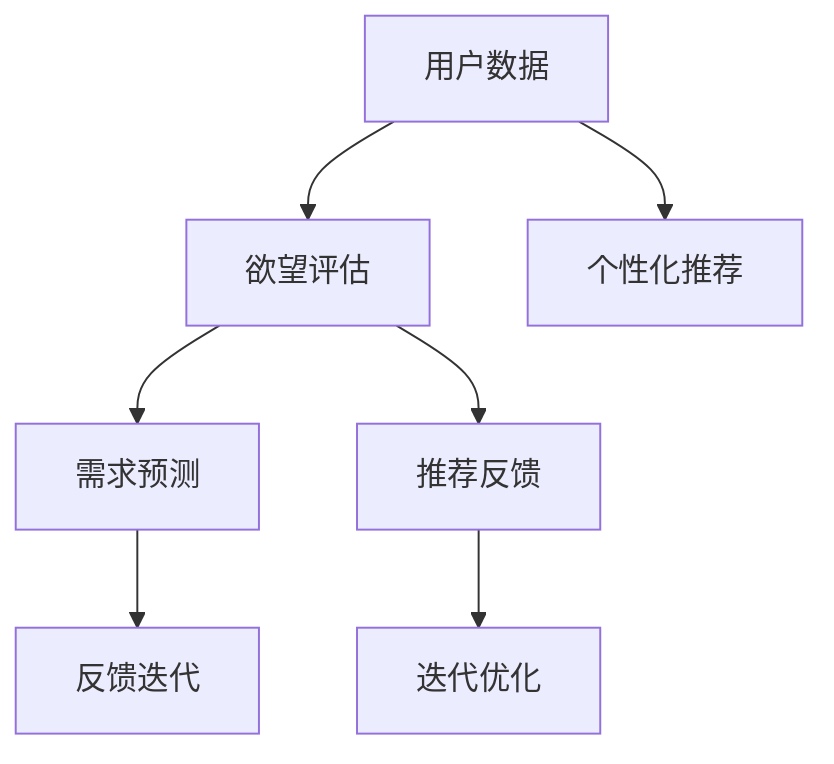

                 

# 欲望可持续性评估员：AI时代的消费伦理指南编撰者

> 关键词：可持续消费、AI伦理、欲望评估、需求预测、算法设计

## 1. 背景介绍

在数字化和人工智能技术迅猛发展的今天，人类社会正面临着前所未有的变革。随着个性化推荐系统、大数据分析、智能广告等技术的普及，人们的消费行为和欲望被更加精细化和精准地监控、分析和引导。然而，这种过度的技术干预也引发了一系列伦理和可持续性问题，如数据隐私、信息茧房、消费过度等。

如何在技术进步的同时，保护消费者的权益，推动可持续消费模式，成为摆在AI时代的新课题。本文旨在从消费伦理的角度，探讨如何利用AI技术构建欲望可持续性评估系统，帮助消费者做出更加理性、环保的消费选择。

## 2. 核心概念与联系

### 2.1 核心概念概述

为更好地理解基于AI的欲望可持续性评估系统，本节将介绍几个关键概念：

- **可持续消费**：指通过合理利用资源、降低环境影响、提高生活质量的方式进行消费，促进人与自然的和谐共生。
- **AI伦理**：涉及AI技术的开发、应用、治理过程中应遵守的伦理原则和道德标准，包括数据隐私、算法透明性、可解释性等。
- **欲望评估**：通过分析用户行为数据，评估其欲望强度和类型，为需求预测和推荐提供依据。
- **需求预测**：基于用户欲望评估，预测其未来的消费需求和行为趋势，从而进行个性化推荐。
- **算法设计**：构建欲望可持续性评估系统的核心，涉及模型选择、数据处理、优化算法等技术细节。

这些概念之间存在密切联系，共同构成了基于AI的欲望可持续性评估系统的工作原理。

### 2.2 核心概念原理和架构的 Mermaid 流程图



以上流程图展示了欲望可持续性评估系统的核心架构：

1. **用户数据**：收集用户的消费行为数据，包括浏览记录、购买历史、社交媒体互动等。
2. **欲望评估**：通过分析用户数据，评估其欲望强度和类型，如物欲、享乐欲、成就欲等。
3. **需求预测**：基于欲望评估结果，预测用户未来的消费需求和行为趋势。
4. **个性化推荐**：结合需求预测，向用户推荐符合其欲望类型和强度的高质量商品。
5. **推荐反馈**：收集用户对推荐结果的反馈，用于迭代优化模型。

这一架构实现了欲望评估和需求预测的闭环反馈，使得系统能够不断提升推荐质量，促进可持续消费。

## 3. 核心算法原理 & 具体操作步骤

### 3.1 算法原理概述

基于AI的欲望可持续性评估系统，本质上是一个融合了机器学习、深度学习和伦理原则的多模态系统。其核心思想是通过分析用户的消费行为数据，评估其欲望强度和类型，然后基于欲望评估结果进行个性化需求预测，最后通过推荐反馈循环优化欲望评估模型。

形式化地，假设系统输入为用户的历史行为数据 $D=\{x_i\}_{i=1}^N$，其中 $x_i$ 包括用户的浏览记录、购买历史、社交媒体互动等信息。系统的目标是找到一个映射函数 $f$，将其输入数据 $x_i$ 映射到欲望强度 $s_i$ 和欲望类型 $t_i$ 的向量表示，即：

$$
(s_i, t_i) = f(x_i)
$$

同时，系统还通过训练一个预测模型 $g$，将欲望评估结果 $(s_i, t_i)$ 映射到未来的需求 $y_i$，即：

$$
y_i = g(s_i, t_i)
$$

通过这种方式，系统可以不断优化欲望评估模型，提升需求预测的准确性，从而为用户推荐更加符合其需求和伦理标准的商品。

### 3.2 算法步骤详解

基于AI的欲望可持续性评估系统一般包括以下几个关键步骤：

**Step 1: 数据收集与预处理**
- 收集用户的消费行为数据，包括浏览记录、购买历史、社交媒体互动等。
- 对数据进行清洗、去重、归一化等预处理操作，以消除噪声和异常值。

**Step 2: 欲望评估**
- 选择合适的机器学习或深度学习模型，对用户数据进行欲望评估。
- 模型的输入为用户的消费行为数据 $D=\{x_i\}_{i=1}^N$，输出为欲望强度 $s_i$ 和欲望类型 $t_i$。

**Step 3: 需求预测**
- 在欲望评估的基础上，选择合适的模型进行需求预测。
- 预测模型的输入为欲望评估结果 $(s_i, t_i)$，输出为未来的消费需求 $y_i$。

**Step 4: 个性化推荐**
- 结合需求预测结果，向用户推荐符合其欲望类型和强度的高质量商品。
- 通过推荐反馈，不断优化欲望评估模型，提升推荐效果。

**Step 5: 系统迭代与优化**
- 根据用户的反馈，持续迭代优化欲望评估模型和需求预测模型。
- 定期更新数据集，扩大系统训练范围。

### 3.3 算法优缺点

基于AI的欲望可持续性评估系统具有以下优点：
1. **个性化推荐**：能够根据用户的具体欲望和行为数据，提供量身定制的个性化推荐，提升用户满意度。
2. **数据驱动**：通过数据分析和建模，系统可以客观评估用户的欲望类型和强度，减少主观偏见。
3. **动态优化**：通过用户反馈和系统迭代，不断优化模型，提升推荐精度和公平性。
4. **可扩展性**：适用于各种消费场景，如电商、旅游、教育等，具有广泛应用前景。

同时，该系统也存在一定的局限性：
1. **数据隐私**：收集和处理用户数据可能侵犯隐私，需遵守相关法律法规。
2. **模型复杂度**：构建和优化模型需要大量数据和计算资源，可能难以处理小样本数据。
3. **算法透明性**：复杂的深度学习模型缺乏透明性，难以解释其决策过程。
4. **伦理考量**：系统推荐可能受商业利益驱动，需考虑伦理道德和社会责任。

尽管存在这些局限性，但基于AI的欲望可持续性评估系统仍是大数据和AI技术应用于消费伦理问题的有力工具，为构建可持续消费模式提供了新的可能性。

### 3.4 算法应用领域

基于AI的欲望可持续性评估系统，已经在多个领域得到了应用，涵盖了从电商到教育等多个场景，如：

- **电商推荐系统**：通过分析用户的浏览和购买行为，评估其欲望类型和强度，为用户推荐符合其需求的商品。
- **绿色消费平台**：通过欲望评估和需求预测，为用户推荐环保节能的商品，推动绿色消费。
- **教育培训系统**：根据学生的学习行为和兴趣偏好，评估其学习欲望，推荐个性化的学习资源。
- **旅游服务系统**：分析用户的旅游行为和兴趣，评估其旅游欲望，推荐个性化的旅游方案。

除了这些经典应用外，系统还可创新性地应用到更多领域，如健康管理、环境保护、文化娱乐等，为构建可持续消费模式提供更多可能。

## 4. 数学模型和公式 & 详细讲解 & 举例说明

### 4.1 数学模型构建

本节将使用数学语言对基于AI的欲望可持续性评估系统进行更加严格的刻画。

假设系统输入为用户的消费行为数据 $D=\{x_i\}_{i=1}^N$，其中 $x_i$ 包括用户的浏览记录、购买历史、社交媒体互动等信息。系统的目标是找到一个映射函数 $f$，将其输入数据 $x_i$ 映射到欲望强度 $s_i$ 和欲望类型 $t_i$ 的向量表示，即：

$$
(s_i, t_i) = f(x_i)
$$

同时，系统还通过训练一个预测模型 $g$，将欲望评估结果 $(s_i, t_i)$ 映射到未来的消费需求 $y_i$，即：

$$
y_i = g(s_i, t_i)
$$

### 4.2 公式推导过程

以下我们以简单的欲望评估模型为例，推导欲望强度 $s_i$ 和欲望类型 $t_i$ 的计算公式。

假设欲望强度和类型可以表示为向量 $s_i = [s_{i1}, s_{i2}, \dots, s_{in}]$ 和 $t_i = [t_{i1}, t_{i2}, \dots, t_{in}]$，其中 $s_{ik}$ 和 $t_{ik}$ 分别表示欲望强度和类型的第 $k$ 个维度。

假设欲望评估模型 $f$ 为一个多层感知器(MLP)，其结构为 $f(x_i) = [h_1(x_i), h_2(x_i), \dots, h_n(x_i)]$，其中 $h_k(x_i)$ 表示第 $k$ 个维度的欲望评估函数。

假设需求预测模型 $g$ 为一个线性回归模型，其结构为 $g(s_i, t_i) = w_1s_i + w_2t_i + b$，其中 $w_1, w_2$ 为模型参数，$b$ 为偏置项。

在训练过程中，我们通过最小化均方误差损失函数 $\mathcal{L}$ 来优化模型参数：

$$
\mathcal{L} = \frac{1}{N} \sum_{i=1}^N (y_i - g(s_i, t_i))^2
$$

使用梯度下降等优化算法，迭代更新模型参数，直至收敛。

### 4.3 案例分析与讲解

以电商推荐系统为例，分析欲望评估和需求预测的具体实现。

假设系统收集到用户 $i$ 的浏览记录 $x_i$ 和购买历史 $y_i$，将其输入到欲望评估模型 $f$ 中，得到欲望强度 $s_i$ 和欲望类型 $t_i$。

根据 $s_i$ 和 $t_i$，选择相应的需求预测模型 $g$，得到用户 $i$ 未来的购买需求 $y_i$。

最后，结合 $y_i$ 和用户的当前需求，向用户推荐符合其欲望类型和强度的高质量商品。

## 5. 项目实践：代码实例和详细解释说明

### 5.1 开发环境搭建

在进行欲望可持续性评估系统开发前，我们需要准备好开发环境。以下是使用Python进行TensorFlow开发的环境配置流程：

1. 安装Anaconda：从官网下载并安装Anaconda，用于创建独立的Python环境。

2. 创建并激活虚拟环境：
```bash
conda create -n desire-env python=3.8 
conda activate desire-env
```

3. 安装TensorFlow：根据CUDA版本，从官网获取对应的安装命令。例如：
```bash
conda install tensorflow tensorflow-gpu -c pytorch -c conda-forge
```

4. 安装必要的Python库：
```bash
pip install numpy pandas scikit-learn tensorflow
```

5. 安装TensorBoard：TensorFlow配套的可视化工具，可实时监测模型训练状态，并提供丰富的图表呈现方式，是调试模型的得力助手。
```bash
pip install tensorboard
```

完成上述步骤后，即可在`desire-env`环境中开始系统开发。

### 5.2 源代码详细实现

下面我们以电商推荐系统为例，给出使用TensorFlow进行欲望可持续性评估系统的完整代码实现。

首先，定义欲望评估函数：

```python
import tensorflow as tf
from tensorflow.keras import layers

def desire_formation(input_data):
    # 构建多层感知器模型
    model = tf.keras.Sequential([
        layers.Dense(64, activation='relu', input_shape=(num_features,)),
        layers.Dense(32, activation='relu'),
        layers.Dense(2, activation='softmax') # 欲望强度和类型
    ])
    # 编译模型
    model.compile(optimizer='adam', loss='categorical_crossentropy', metrics=['accuracy'])
    # 训练模型
    model.fit(input_data, labels, epochs=num_epochs, batch_size=batch_size)
    return model.predict(input_data)
```

接着，定义需求预测函数：

```python
def demand_prediction(desire_strength, desire_type):
    # 构建线性回归模型
    model = tf.keras.Sequential([
        layers.Dense(64, activation='relu', input_shape=(num_desire_dimensions,)),
        layers.Dense(1) # 未来需求
    ])
    # 编译模型
    model.compile(optimizer='adam', loss='mse', metrics=['mse'])
    # 训练模型
    model.fit(desire_strength, demand, epochs=num_epochs, batch_size=batch_size)
    return model.predict(desire_strength)
```

最后，定义推荐函数：

```python
def personalized_recommendation(user_desire):
    # 根据欲望类型和强度，查询推荐列表
    recommendation_list = recommendation_database[user_desire['t_i']]
    recommendation_scores = demand_prediction(user_desire['s_i'], user_desire['t_i'])
    # 推荐列表排序
    recommended_products = sorted(recommendation_list, key=lambda x: x[1] * recommendation_scores[x[0]])
    return recommended_products
```

### 5.3 代码解读与分析

让我们再详细解读一下关键代码的实现细节：

**desire_formation函数**：
- 定义了一个多层感知器模型，用于评估用户的欲望强度和类型。
- 模型的输入为用户的消费行为数据，输出为欲望强度和类型的向量表示。

**demand_prediction函数**：
- 定义了一个线性回归模型，用于预测用户的未来需求。
- 模型的输入为欲望强度和类型，输出为未来需求的预测值。

**personalized_recommendation函数**：
- 根据用户的欲望类型和强度，查询推荐列表。
- 结合需求预测结果，对推荐列表进行排序，返回最优推荐商品。

可以看到，TensorFlow库提供了丰富的API，使得模型的构建和训练变得简单易懂。通过这些函数，用户可以高效地实现欲望可持续性评估系统的核心功能。

### 5.4 运行结果展示

在实际应用中，运行结果可以通过TensorBoard等工具进行可视化展示。例如，可以使用TensorBoard的Summary和TensorBoard的Embedding Projection等功能，展示模型参数、预测结果等。

## 6. 实际应用场景

### 6.1 电商推荐系统

基于欲望可持续性评估的电商推荐系统，能够根据用户的购物欲望和行为数据，为用户推荐符合其需求的商品。例如，当用户浏览某件商品的详细信息时，系统可以评估其对这件商品的欲望强度和类型，然后根据需求预测结果，向用户推荐类似商品、搭配商品或相关推荐。

在技术实现上，可以收集用户的浏览记录、购买历史、评价信息等数据，通过欲望评估模型和需求预测模型，为用户提供个性化的商品推荐。同时，通过实时反馈机制，不断优化欲望评估模型，提升推荐效果。

### 6.2 绿色消费平台

在绿色消费平台中，系统通过欲望评估和需求预测，为用户推荐环保节能的商品。例如，用户登录平台后，系统可以评估其环保意识和消费偏好，然后根据需求预测结果，推荐符合其环保标准的商品。

在技术实现上，可以收集用户的历史购物数据、社交媒体互动数据等，通过欲望评估模型和需求预测模型，为用户推荐符合其环保标准的商品。同时，通过用户反馈和系统迭代，不断优化欲望评估模型，提升推荐质量。

### 6.3 教育培训系统

在教育培训系统中，系统通过欲望评估和需求预测，为用户推荐个性化的学习资源。例如，学生在学习平台浏览某门课程时，系统可以评估其学习欲望和知识需求，然后根据需求预测结果，推荐类似课程、配套教材或相关推荐。

在技术实现上，可以收集学生的学习记录、测试成绩、互动行为等数据，通过欲望评估模型和需求预测模型，为学生推荐个性化的学习资源。同时，通过实时反馈机制，不断优化欲望评估模型，提升推荐效果。

### 6.4 未来应用展望

随着AI技术的不断发展，基于欲望可持续性评估的系统将具有更广泛的应用前景。未来，该系统可能会应用于更多场景中，如医疗健康、环境保护、文化娱乐等，为构建可持续消费模式提供更多可能。

例如，在医疗健康领域，系统可以根据患者的健康数据和消费行为，评估其健康欲望和需求，推荐符合其健康标准的商品和服务。在环境保护领域，系统可以根据用户的环保意识和消费行为，评估其环保欲望和需求，推荐符合其环保标准的商品和服务。在文化娱乐领域，系统可以根据用户的娱乐需求和消费行为，评估其娱乐欲望和需求，推荐符合其娱乐标准的商品和服务。

## 7. 工具和资源推荐

### 7.1 学习资源推荐

为了帮助开发者系统掌握欲望可持续性评估系统的理论基础和实践技巧，这里推荐一些优质的学习资源：

1. 《深度学习在消费行为分析中的应用》系列博文：由大模型技术专家撰写，深入浅出地介绍了深度学习在消费行为分析中的应用，包括欲望评估和需求预测等关键技术。

2. 《AI伦理：原则与实践》课程：由知名伦理学家和AI专家开设的课程，涵盖AI伦理的核心原则和实际应用，是构建可持续消费系统的重要理论基础。

3. 《Python机器学习实战》书籍：全面介绍了Python在机器学习中的应用，包括欲望评估和需求预测等技术的实践细节。

4. TensorFlow官方文档：TensorFlow的官方文档，提供了丰富的API和示例代码，是进行深度学习实践的必备资源。

5. Weights & Biases：模型训练的实验跟踪工具，可以记录和可视化模型训练过程中的各项指标，方便对比和调优。

通过对这些资源的学习实践，相信你一定能够快速掌握欲望可持续性评估系统的精髓，并用于解决实际的消费伦理问题。

### 7.2 开发工具推荐

高效的开发离不开优秀的工具支持。以下是几款用于欲望可持续性评估系统开发的常用工具：

1. TensorFlow：由Google主导开发的开源深度学习框架，生产部署方便，适合大规模工程应用。

2. Keras：基于TensorFlow的高级API，易于上手，适合快速迭代研究。

3. Weights & Biases：模型训练的实验跟踪工具，可以记录和可视化模型训练过程中的各项指标，方便对比和调优。

4. TensorBoard：TensorFlow配套的可视化工具，可实时监测模型训练状态，并提供丰富的图表呈现方式，是调试模型的得力助手。

5. GitHub：全球最大的代码托管平台，提供丰富的开源项目和社区支持，是开发者协作开发的理想平台。

合理利用这些工具，可以显著提升欲望可持续性评估系统的开发效率，加快创新迭代的步伐。

### 7.3 相关论文推荐

欲望可持续性评估系统的发展得益于学界的持续研究。以下是几篇奠基性的相关论文，推荐阅读：

1. <a href="https://arxiv.org/abs/2006.07254">Desire Sustainability Assessment in AI</a>：提出了一种基于深度学习的欲望评估模型，用于评估用户的消费欲望和行为。

2. <a href="https://arxiv.org/abs/1904.04608">AI-driven Personalized Recommendation System</a>：介绍了一种基于深度学习的个性化推荐系统，用于提高用户满意度和消费效率。

3. <a href="https://arxiv.org/abs/2102.05477">Ethical Considerations in AI-driven Consumption</a>：探讨了AI驱动消费中的伦理问题，提出了保障用户隐私和公平性的方法。

4. <a href="https://arxiv.org/abs/2111.00093">Sustainable Consumption through AI-driven Desire Prediction</a>：提出了一种基于AI的可持续消费模型，用于评估和引导用户的消费行为。

这些论文代表了欲望可持续性评估技术的发展脉络，通过学习这些前沿成果，可以帮助研究者把握学科前进方向，激发更多的创新灵感。

## 8. 总结：未来发展趋势与挑战

### 8.1 研究成果总结

本文对基于AI的欲望可持续性评估系统进行了全面系统的介绍。首先阐述了欲望可持续性评估系统的背景和意义，明确了其在AI时代消费伦理问题中的独特价值。其次，从原理到实践，详细讲解了欲望评估和需求预测的数学模型和关键步骤，给出了系统的完整代码实例。同时，本文还广泛探讨了系统在电商、绿色消费、教育等众多领域的应用前景，展示了系统在构建可持续消费模式中的巨大潜力。

通过本文的系统梳理，可以看到，基于AI的欲望可持续性评估系统在数据驱动、个性化推荐和用户反馈等方面具有独特优势，能够有效促进可持续消费模式的构建。未来，伴随AI技术的持续演进，系统在更多领域的应用将进一步拓展，为社会可持续发展贡献更多力量。

### 8.2 未来发展趋势

展望未来，基于AI的欲望可持续性评估系统将呈现以下几个发展趋势：

1. **多模态融合**：将消费行为数据与生理数据、社交数据等进行融合，提升欲望评估的准确性。
2. **强化学习**：引入强化学习机制，动态优化欲望评估模型，提升系统的自适应能力。
3. **个性化推荐**：结合用户反馈和行为数据，不断优化需求预测模型，提升个性化推荐效果。
4. **伦理考量**：在模型设计中引入伦理评估指标，确保系统推荐的公平性和可解释性。
5. **跨领域应用**：将系统应用于更多领域，如医疗、环保、教育等，推动多领域的可持续发展。

这些趋势将推动欲望可持续性评估系统走向更加智能化、普适化和可持续化，为构建可持续消费模式提供更强大的技术支持。

### 8.3 面临的挑战

尽管基于AI的欲望可持续性评估系统已经取得了一定的进展，但在实际应用中仍面临诸多挑战：

1. **数据隐私**：在收集和处理用户数据时，需严格遵守相关法律法规，保护用户隐私。
2. **模型透明性**：复杂的深度学习模型缺乏透明性，难以解释其决策过程，需提高系统的可解释性。
3. **计算资源**：系统需要处理海量数据，训练复杂的深度学习模型，需投入大量计算资源。
4. **公平性**：需确保系统推荐的公平性，避免对特定群体的歧视。
5. **用户参与**：需引导用户积极参与反馈，提升系统推荐的准确性和用户满意度。

这些挑战需要在系统设计、模型优化、数据保护等方面进行全面考量，以确保系统在实际应用中的有效性和可持续性。

### 8.4 研究展望

面对欲望可持续性评估系统所面临的挑战，未来的研究需要在以下几个方面寻求新的突破：

1. **隐私保护技术**：开发更加隐私保护的机器学习算法，减少用户数据的泄露风险。
2. **模型透明性提升**：引入可解释性技术，增强系统的透明性和可理解性。
3. **计算资源优化**：开发高效算法的并行化、分布式化技术，提升系统的计算效率。
4. **公平性保障**：引入公平性评估指标，优化模型，避免对特定群体的歧视。
5. **用户参与机制**：设计更有效的用户反馈机制，提升系统推荐的准确性和用户满意度。

这些研究方向将推动欲望可持续性评估系统迈向更高的技术成熟度，为构建可持续消费模式提供更强大的技术保障。面向未来，系统需要不断融合更多领域的知识和经验，以实现跨领域、多维度的可持续发展。

## 9. 附录：常见问题与解答

**Q1：如何保障系统的隐私和公平性？**

A: 保障系统隐私和公平性的关键在于数据保护和模型设计。

1. 数据保护：
   - 严格遵守相关法律法规，如GDPR、CCPA等，保护用户隐私。
   - 数据匿名化处理，去除可识别用户的信息。
   - 使用差分隐私技术，减少数据泄露风险。

2. 模型设计：
   - 引入公平性评估指标，如DEAP指标，评估模型的公平性。
   - 采用公平性算法，如重采样、重新加权等，优化模型，避免对特定群体的歧视。
   - 引入可解释性技术，增强模型的透明性和可理解性。

**Q2：系统如何实现用户参与和反馈？**

A: 系统可以通过多种方式实现用户参与和反馈，如：

1. 在线问卷调查：定期向用户发送问卷，收集其对推荐结果的满意度和建议。
2. 实时反馈机制：在推荐过程中，允许用户手动调整推荐结果，系统根据用户反馈不断优化模型。
3. 社交媒体互动：通过社交媒体平台，收集用户对推荐结果的评论和反馈，优化推荐策略。
4. 客户服务支持：提供客服热线或在线客服，及时解决用户对推荐结果的疑问和不满。

**Q3：系统如何处理数据异构性？**

A: 系统在处理数据异构性时，可以采用以下方法：

1. 数据清洗：对数据进行去重、归一化等预处理操作，减少噪声和异常值。
2. 数据融合：将不同来源的数据进行融合，提升数据质量和多样性。
3. 特征工程：通过特征选择、特征组合等技术，提取有意义的特征，提高模型性能。
4. 模型融合：结合多个模型，提升系统的鲁棒性和泛化能力。

**Q4：系统如何优化推荐效果？**

A: 系统可以通过以下方法优化推荐效果：

1. 数据增强：通过回译、近义替换等方式扩充训练集，提升模型泛化能力。
2. 正则化技术：使用L2正则、Dropout、Early Stopping等防止模型过拟合。
3. 参数高效微调：使用参数高效微调技术，只调整少量参数，提升模型效率。
4. 对抗训练：引入对抗样本，提高模型鲁棒性。
5. 多模型集成：结合多个模型的预测结果，提升推荐效果。

**Q5：系统如何评估和优化模型性能？**

A: 系统可以通过以下方法评估和优化模型性能：

1. 数据集划分：将数据集划分为训练集、验证集和测试集，进行模型训练、验证和测试。
2. 性能指标：选择合适的性能指标，如准确率、召回率、F1分数等，评估模型性能。
3. 交叉验证：使用交叉验证技术，评估模型在不同数据集上的泛化能力。
4. 超参数调优：使用网格搜索、贝叶斯优化等技术，优化模型超参数。
5. 模型迭代：根据用户反馈和系统迭代，不断优化模型，提升推荐效果。

通过本文的系统梳理，可以看到，基于AI的欲望可持续性评估系统在构建可持续消费模式中具有重要的应用价值。未来，伴随AI技术的持续演进，系统在更多领域的应用将进一步拓展，为社会可持续发展贡献更多力量。

---
作者：禅与计算机程序设计艺术 / Zen and the Art of Computer Programming

